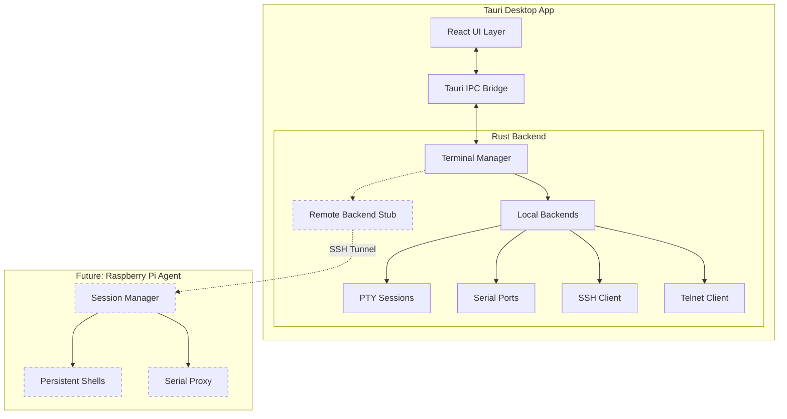
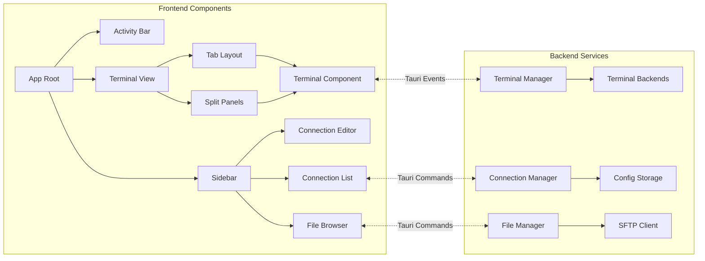
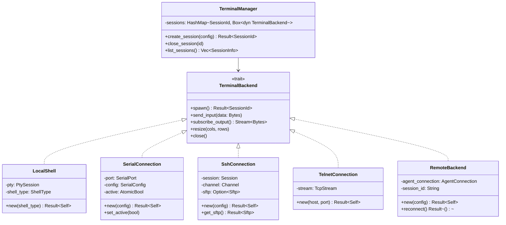
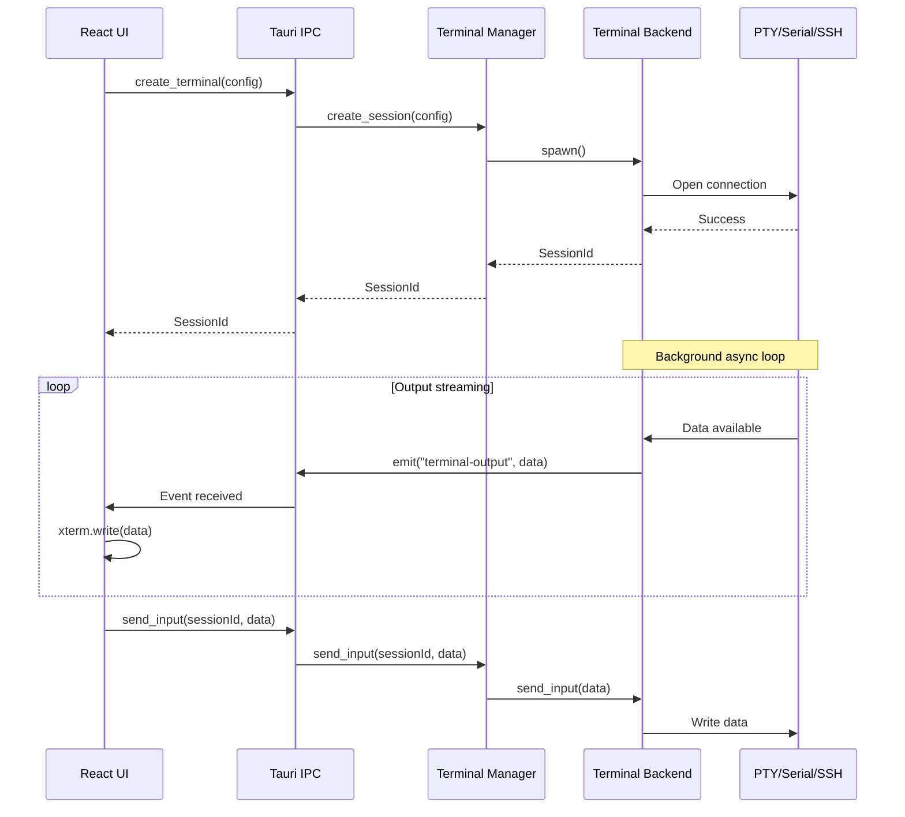

# TermiHub - Project Documentation

## Project Overview

**TermiHub** is a modern, cross-platform terminal hub designed for embedded development workflows. It provides a VS Code-like interface for managing multiple terminal connections with support for split views, drag-and-drop tabs, and organized connection management.

### Key Features
- Multiple terminal types: Local shells (zsh, bash, cmd, PowerShell, Git Bash), SSH, Telnet, Serial
- VS Code-inspired UI with activity bar, sidebar, and split view support
- Drag-and-drop tab management with up to 40 concurrent terminals
- Connection organization in folder hierarchies
- Integrated SSH file browser with drag-and-drop file transfer
- Session persistence and reconnect capabilities (for remote connections)
- Cross-platform support: Windows, Linux, macOS

### Target Use Case
Primary use case is embedded development where:
- Local shells build the product
- Serial connections interface with test targets
- Remote Raspberry Pi agents maintain persistent sessions overnight
- File transfer between development machine and test targets is seamless

---

## Tech Stack

### Frontend
- **Framework**: React 18 + TypeScript
- **Build Tool**: Vite (via Tauri template)
- **UI Libraries**:
  - `react-resizable-panels` - Split view management
  - `@dnd-kit/core` + `@dnd-kit/sortable` - Drag and drop
  - `@radix-ui/*` - Accessible UI primitives
  - `lucide-react` - Icon system
- **Terminal**: `@xterm/xterm` + `@xterm/addon-fit`
- **File Browser**: `react-virtuoso` (virtualized lists)

### Backend (Tauri)
- **Runtime**: Tauri 2.x
- **Language**: Rust
- **Core Dependencies**:
  - `tokio` - Async runtime
  - `portable-pty` - Cross-platform PTY
  - `serialport` - Serial port communication
  - `ssh2` - SSH and SFTP support
  - `serde` + `serde_json` - Serialization
  - `uuid` - Session ID generation
  - `anyhow` - Error handling

### Future (Phase 3 - Remote Agent)
- Standalone Rust binary for Raspberry Pi
- SQLite for session persistence
- Custom protocol over SSH for session management
- systemd service integration

---

## Architecture

### High-Level Architecture



### Component Architecture



### Backend Architecture (Trait-Based Design)



### Data Flow



---

## Implementation Phases

### Phase 1: UI Foundation (Weeks 1-2)

**Goal**: Create the complete UI shell without backend functionality

#### Tasks:
1. **Project Setup**
   ```bash
   npm create tauri-app@latest termihub
   # Select: React + TypeScript
   npm install dependencies (see package.json below)
   ```

2. **Layout Components**
   - Activity Bar (left sidebar with icons)
   - Sidebar (connection list, file browser)
   - Main Content Area with split view support
   - Tab system with drag-and-drop

3. **Terminal Component**
   - Integrate xterm.js
   - Mock data streaming for testing
   - Resize handling
   - Theme support

4. **Connection UI**
   - Connection type selector
   - Configuration forms for each type
   - Tree view for connection organization
   - Folder creation and management

5. **File Browser UI**
   - Tree view component
   - Drag-and-drop zones
   - Upload/download buttons (non-functional yet)

**Deliverable**: Fully functional UI that looks and feels like the final product, but with mock data

**Branch**: `feature/ui-foundation`

---

### Phase 2: Local Terminal Backends (Weeks 3-4)

**Goal**: Implement all local terminal types

#### Tasks:

1. **Backend Architecture Setup**
   - Define `TerminalBackend` trait
   - Implement `TerminalManager`
   - Set up Tauri command handlers
   - Implement event streaming

2. **Local Shell Implementation**
   - Auto-detect available shells (zsh, bash, cmd, PowerShell, Git Bash)
   - Implement `LocalShell` backend using `portable-pty`
   - Shell selection UI
   - Platform-specific handling

3. **Serial Port Implementation**
   - Port enumeration
   - `SerialConnection` backend with `serialport` crate
   - Configuration UI (baud rate, parity, stop bits, flow control)
   - Extensible config structure for future settings
   - Active/inactive tab handling

4. **Telnet Implementation**
   - `TelnetConnection` backend
   - Basic telnet protocol
   - Configuration UI (host, port)

5. **SSH Implementation (Basic)**
   - `SshConnection` backend with `ssh2` crate
   - Authentication (password, key-based)
   - Configuration UI
   - Connection status handling

**Deliverable**: All local terminal types working, users can create and use connections

**Branches**: 
- `feature/backend-architecture`
- `feature/local-shells`
- `feature/serial-backend`
- `feature/telnet-backend`
- `feature/ssh-backend`

---

### Phase 3: SSH File Browser (Week 5)

**Goal**: SFTP file browser for SSH connections

#### Tasks:

1. **SFTP Integration**
   - Add SFTP support to `SshConnection`
   - File listing commands
   - Upload/download commands

2. **File Browser Component**
   - Virtual scrolling for large directories
   - Directory navigation
   - File selection

3. **Drag & Drop**
   - Drop zone for uploads
   - Drag files out for download
   - Progress indicators

4. **File Operations**
   - Create directory
   - Delete files/folders
   - Rename operations
   - Permission display

**Deliverable**: Fully functional SSH file browser

**Branch**: `feature/sftp-browser`

---

### Phase 4: Connection Management & Persistence (Week 6)

**Goal**: Save and organize connections

#### Tasks:

1. **Configuration Storage**
   - Define config schema
   - Implement local storage (JSON file in app data directory)
   - Connection CRUD operations

2. **Connection Organization**
   - Folder hierarchy implementation
   - Drag-and-drop reorganization
   - Import/export connections

3. **Credential Management (Stub)**
   - Placeholder for encrypted credential storage
   - Warning UI for unsaved credentials
   - Preparation for future encryption

**Deliverable**: Connections persist across app restarts, can be organized

**Branch**: `feature/connection-persistence`

---

### Phase 5: Polish & Testing (Week 7)

**Goal**: Bug fixes, UX improvements, performance testing

#### Tasks:

1. **Performance Testing**
   - Test with 40 simultaneous terminals
   - Memory leak detection
   - Optimize event streaming

2. **UX Improvements**
   - Keyboard shortcuts
   - Context menus
   - Better error messages
   - Loading states
   - **TODO**: Filter shell type dropdown in ConnectionSettings to only show shells available on the current platform (use `listAvailableShells()` API which already exists in the backend). Currently `ConnectionSettings.tsx` hardcodes all 5 shell types regardless of OS.

3. **Cross-Platform Testing**
   - Test on Windows, Linux, macOS
   - Platform-specific bug fixes

4. **Documentation**
   - User guide
   - Developer documentation
   - Build instructions

**Deliverable**: Production-ready Phase 1 application

**Branch**: `feature/polish-and-testing`

---

### Phase 6: Remote Agent Foundation (Weeks 8-9)

**Goal**: Prepare for remote Raspberry Pi agent

#### Tasks:

1. **Protocol Design**
   - Define session management protocol
   - Message format (JSON over SSH)
   - Session state schema

2. **Backend Refactoring**
   - Abstract `RemoteBackend` implementation
   - Session reconnect logic
   - Connection state management

3. **Agent Stub**
   - Basic Rust binary
   - SSH server setup
   - Session listing endpoint

**Deliverable**: Architecture ready for remote sessions, basic agent running

**Branch**: `feature/remote-foundation`

---

### Phase 7: Remote Agent Implementation (Weeks 10-12)

**Goal**: Full remote session support with persistence

#### Tasks:

1. **Session Persistence**
   - SQLite integration
   - Session state save/restore
   - Output buffering

2. **Serial Proxy**
   - Remote serial port access
   - 24/7 buffering
   - Buffer replay on connect

3. **Agent Management**
   - systemd service setup
   - Auto-start configuration
   - Health monitoring

4. **UI Integration**
   - Remote connection type
   - Session listing
   - Reconnect handling
   - Remote file browser

**Deliverable**: Full remote agent with persistent sessions

**Branches**:
- `feature/agent-persistence`
- `feature/serial-proxy`
- `feature/remote-integration`

---

## Project Structure

```
termihub/
├── src/                          # React frontend
│   ├── components/
│   │   ├── ActivityBar/
│   │   │   ├── ActivityBar.tsx
│   │   │   ├── ActivityBarItem.tsx
│   │   │   └── index.ts
│   │   ├── Sidebar/
│   │   │   ├── Sidebar.tsx
│   │   │   ├── ConnectionList.tsx
│   │   │   ├── ConnectionEditor.tsx
│   │   │   ├── FileBrowser.tsx
│   │   │   └── index.ts
│   │   ├── Terminal/
│   │   │   ├── Terminal.tsx
│   │   │   ├── TerminalView.tsx
│   │   │   ├── TabBar.tsx
│   │   │   ├── Tab.tsx
│   │   │   └── index.ts
│   │   ├── SplitView/
│   │   │   ├── SplitView.tsx
│   │   │   └── index.ts
│   │   └── Settings/
│   │       ├── ConnectionSettings.tsx
│   │       ├── SerialSettings.tsx
│   │       ├── SshSettings.tsx
│   │       └── index.ts
│   ├── hooks/
│   │   ├── useTerminal.ts
│   │   ├── useConnections.ts
│   │   ├── useFileSystem.ts
│   │   └── useTauriEvents.ts
│   ├── services/
│   │   ├── api.ts              # Tauri command wrappers
│   │   ├── events.ts           # Tauri event listeners
│   │   └── storage.ts          # Local storage helpers
│   ├── types/
│   │   ├── terminal.ts
│   │   ├── connection.ts
│   │   └── events.ts
│   ├── utils/
│   │   ├── shell-detection.ts
│   │   └── formatters.ts
│   ├── App.tsx
│   ├── App.css
│   └── main.tsx
│
├── src-tauri/                    # Rust backend
│   ├── src/
│   │   ├── terminal/
│   │   │   ├── mod.rs
│   │   │   ├── backend.rs      # TerminalBackend trait
│   │   │   ├── manager.rs      # TerminalManager
│   │   │   ├── local_shell.rs
│   │   │   ├── serial.rs
│   │   │   ├── ssh.rs
│   │   │   ├── telnet.rs
│   │   │   └── remote.rs       # Future remote backend
│   │   ├── connection/
│   │   │   ├── mod.rs
│   │   │   ├── config.rs       # Connection config types
│   │   │   ├── manager.rs      # Connection CRUD
│   │   │   └── storage.rs      # Persistence
│   │   ├── files/
│   │   │   ├── mod.rs
│   │   │   ├── sftp.rs
│   │   │   └── browser.rs
│   │   ├── commands/           # Tauri commands
│   │   │   ├── mod.rs
│   │   │   ├── terminal.rs
│   │   │   ├── connection.rs
│   │   │   └── files.rs
│   │   ├── events/             # Event emitters
│   │   │   ├── mod.rs
│   │   │   └── terminal.rs
│   │   ├── utils/
│   │   │   ├── mod.rs
│   │   │   ├── shell_detect.rs
│   │   │   └── errors.rs
│   │   ├── lib.rs
│   │   └── main.rs
│   ├── Cargo.toml
│   └── tauri.conf.json
│
├── agent/                        # Future: Raspberry Pi agent
│   ├── src/
│   │   ├── session/
│   │   ├── serial/
│   │   ├── protocol/
│   │   └── main.rs
│   └── Cargo.toml
│
├── package.json
├── tsconfig.json
├── vite.config.ts
├── .gitignore
├── README.md
├── CLAUDE.md                     # This file
└── CHANGELOG.md                  # Keep-a-Changelog format, update with each PR
```

---

## Coding Standards

### General Principles

1. **Clean Code**
   - Maximum file length: ~500 lines (prefer smaller, focused files when reasonable)
   - Maximum function length: ~50 lines
   - Clear, descriptive naming
   - Single Responsibility Principle

2. **Type Safety**
   - No `any` types in TypeScript
   - Use proper Rust error handling (no `.unwrap()` in production code)
   - Comprehensive type definitions

3. **Documentation**
   - JSDoc for public TypeScript functions
   - Rust doc comments (`///`) for public APIs
   - README in each major directory

### TypeScript/React Standards

```typescript
// Component structure
interface ComponentNameProps {
  // Props interface always defined
  requiredProp: string;
  optionalProp?: number;
}

/**
 * Brief description of component purpose
 */
export function ComponentName({ requiredProp, optionalProp = 42 }: ComponentNameProps) {
  // Hooks first
  const [state, setState] = useState<Type>(initialValue);
  
  // Event handlers
  const handleEvent = useCallback(() => {
    // Implementation
  }, [dependencies]);
  
  // Render
  return (
    <div>
      {/* JSX */}
    </div>
  );
}
```

**File Organization**:
- One component per file
- Co-located styles (if using CSS modules)
- Export from `index.ts` for clean imports

**Naming Conventions**:
- Components: `PascalCase`
- Hooks: `useCamelCase`
- Utils: `camelCase`
- Constants: `UPPER_SNAKE_CASE`

### Rust Standards

```rust
// Module structure
pub mod terminal;
mod internal_module;

use std::collections::HashMap;
// Group imports

/// Brief description
/// 
/// # Examples
/// 
/// ```
/// let backend = LocalShell::new(ShellType::Bash)?;
/// ```
pub trait TerminalBackend: Send + Sync {
    /// Method documentation
    fn spawn(&mut self) -> Result<SessionId>;
}

// Implementation
pub struct LocalShell {
    /// Field documentation
    pty: PtySession,
    shell_type: ShellType,
}

impl LocalShell {
    /// Constructor documentation
    pub fn new(shell_type: ShellType) -> Result<Self> {
        // Implementation with proper error handling
        let pty = PtySession::new()?;
        
        Ok(Self {
            pty,
            shell_type,
        })
    }
}

impl TerminalBackend for LocalShell {
    fn spawn(&mut self) -> Result<SessionId> {
        // Clear, focused implementation
        // Use ? for error propagation
        // No .unwrap() in production
        Ok(uuid::Uuid::new_v4().to_string())
    }
}
```

**Naming Conventions**:
- Types/Traits: `PascalCase`
- Functions/methods: `snake_case`
- Constants: `UPPER_SNAKE_CASE`
- Modules: `snake_case`

**Error Handling**:
- Use `anyhow::Result<T>` for application code
- Custom error types where appropriate
- Always propagate errors with `?`
- Add context with `.context("description")`

**Async Code**:
- Use `tokio` for async runtime
- Properly handle task cancellation
- Use channels for communication

---

## Git Workflow

### Branch Strategy

**Main Branches**:
- `main` - Production-ready code, protected
- `develop` - Integration branch (optional, for larger features)

**Feature Branches**:
- Format: `feature/<brief-description>`
- Examples: `feature/ui-foundation`, `feature/serial-backend`
- Branch from `main`
- Merge back via Pull Request

**Bugfix Branches**:
- Format: `bugfix/<issue-description>`
- Example: `bugfix/terminal-resize-crash`

**Never commit directly to `main`**

### Commit Message Convention

Follow [Conventional Commits](https://www.conventionalcommits.org/):

```
<type>(<scope>): <subject>

<body>

<footer>
```

**Types**:
- `feat`: New feature
- `fix`: Bug fix
- `docs`: Documentation changes
- `style`: Code style changes (formatting, no logic change)
- `refactor`: Code refactoring
- `perf`: Performance improvements
- `test`: Adding or updating tests
- `chore`: Maintenance tasks

**Examples**:
```
feat(terminal): add xterm.js integration

- Integrate xterm.js library
- Add Terminal component with resize support
- Implement basic event handling

Closes #12

---

fix(serial): handle port disconnection gracefully

Previously, disconnecting a serial port would crash the app.
Now properly handles the error and shows notification to user.

Fixes #34

---

refactor(backend): extract TerminalBackend trait

Split terminal implementations into separate files following
the trait pattern for better maintainability.

---

docs(readme): add build instructions for macOS
```

**Scope Examples**: `terminal`, `ssh`, `ui`, `backend`, `sftp`, `config`

### Pull Request Process

1. Create feature branch from `main`
2. Implement feature following coding standards
3. Test thoroughly on all platforms (if applicable)
4. Create PR with description:
   - What changed
   - Why it changed
   - How to test
   - Screenshots (for UI changes)
5. Review and address feedback
6. Squash commits if messy (optional, prefer atomic commits)
7. Merge when approved

---

## Configuration Files

### package.json (Frontend)

```json
{
  "name": "termihub",
  "private": true,
  "version": "0.1.0",
  "type": "module",
  "scripts": {
    "dev": "vite",
    "build": "tsc && vite build",
    "preview": "vite preview",
    "tauri": "tauri"
  },
  "dependencies": {
    "react": "^18.2.0",
    "react-dom": "^18.2.0",
    "@tauri-apps/api": "^2.0.0",
    "@xterm/xterm": "^5.5.0",
    "@xterm/addon-fit": "^0.10.0",
    "react-resizable-panels": "^2.0.0",
    "@dnd-kit/core": "^6.1.0",
    "@dnd-kit/sortable": "^8.0.0",
    "@dnd-kit/utilities": "^3.2.2",
    "@radix-ui/react-tabs": "^1.0.4",
    "@radix-ui/react-dropdown-menu": "^2.0.6",
    "@radix-ui/react-dialog": "^1.0.5",
    "@radix-ui/react-select": "^2.0.0",
    "lucide-react": "^0.263.1",
    "react-virtuoso": "^4.6.0",
    "zustand": "^4.5.0"
  },
  "devDependencies": {
    "@types/react": "^18.2.0",
    "@types/react-dom": "^18.2.0",
    "@vitejs/plugin-react": "^4.2.0",
    "typescript": "^5.3.0",
    "vite": "^5.0.0",
    "@tauri-apps/cli": "^2.0.0"
  }
}
```

### Cargo.toml (Backend)

```toml
[package]
name = "termihub"
version = "0.1.0"
edition = "2021"

[dependencies]
tauri = { version = "2", features = ["shell-open"] }
serde = { version = "1", features = ["derive"] }
serde_json = "1"
tokio = { version = "1", features = ["full"] }
portable-pty = "0.8"
serialport = "4"
ssh2 = "0.9"
uuid = { version = "1", features = ["v4", "serde"] }
anyhow = "1"
thiserror = "1"
tracing = "0.1"
tracing-subscriber = "0.3"

# Platform-specific dependencies
[target.'cfg(windows)'.dependencies]
windows = { version = "0.58", features = [
    "Win32_System_Console",
    "Win32_Foundation",
] }

[build-dependencies]
tauri-build = { version = "2", features = [] }

[features]
default = ["custom-protocol"]
custom-protocol = ["tauri/custom-protocol"]
```

### tsconfig.json

```json
{
  "compilerOptions": {
    "target": "ES2020",
    "useDefineForClassFields": true,
    "lib": ["ES2020", "DOM", "DOM.Iterable"],
    "module": "ESNext",
    "skipLibCheck": true,
    "moduleResolution": "bundler",
    "allowImportingTsExtensions": true,
    "resolveJsonModule": true,
    "isolatedModules": true,
    "noEmit": true,
    "jsx": "react-jsx",
    "strict": true,
    "noUnusedLocals": true,
    "noUnusedParameters": true,
    "noFallthroughCasesInSwitch": true,
    "baseUrl": ".",
    "paths": {
      "@/*": ["./src/*"]
    }
  },
  "include": ["src"],
  "references": [{ "path": "./tsconfig.node.json" }]
}
```

---

## Key Design Decisions

### Why React over Svelte?
Despite Svelte's performance benefits, React was chosen for:
- Larger ecosystem with mature libraries
- Better tooling for complex drag-and-drop (dnd-kit)
- Production-ready split view component (react-resizable-panels)
- More examples and community support for AI-assisted development
- Better knowledge base for Claude Code

### Why Trait-Based Backend?
The `TerminalBackend` trait allows:
- Easy addition of new terminal types
- Consistent interface for the manager
- Future remote backend without major refactoring
- Testability through mock implementations

### Why Not Electron?
Tauri provides:
- Smaller binary size (~5MB vs ~100MB)
- Lower memory footprint
- Better security (Rust backend)
- Native system integration
- Still cross-platform

### Credential Storage Strategy
Phase 1 does NOT implement credential encryption to avoid complexity. Future implementation will use:
- Platform keychains (Windows Credential Manager, macOS Keychain, Linux Secret Service)
- Encryption at rest for portability option
- Clear UI warning when credentials are not yet encrypted

---

## Testing Strategy

### Frontend Testing
- Component testing with React Testing Library
- Integration tests for critical flows
- Manual testing on all platforms

### Backend Testing
- Unit tests for each backend implementation
- Integration tests for Tauri commands
- Manual testing with real serial ports, SSH servers

### Performance Testing
- Load testing with 40 concurrent terminals
- Memory profiling
- Event throughput testing

### Platform Testing Matrix
| Feature | Windows | Linux | macOS |
|---------|---------|-------|-------|
| Local shells | ✓ | ✓ | ✓ |
| Serial | ✓ | ✓ | ✓ |
| SSH | ✓ | ✓ | ✓ |
| Telnet | ✓ | ✓ | ✓ |
| File browser | ✓ | ✓ | ✓ |

---

## Future Enhancements (Post-Phase 7)

### X11 Forwarding
- X server spawning for SSH connections
- Window sharing from Linux hosts
- Display forwarding configuration
- Multi-display support

### Credential Encryption
- Platform keychain integration
- Master password option
- Import/export with encryption

### Advanced Serial Features
- Protocol analyzers
- Data logging
- Hex view mode
- Custom baud rates

### Session Sharing
- Read-only session sharing
- Multi-user collaboration
- Session recording/playback

### Plugin System
- Custom terminal types
- Custom parsers
- Theme extensions

### Cloud Sync
- Connection sync across devices
- Settings sync
- Optional cloud storage for session logs

---

## Development Guidelines

### Before Starting Work
1. Pull latest `main`
2. Create feature branch
3. Review relevant code in that area
4. Plan your approach (comment in issue/PR)

### During Development
1. Commit frequently with clear messages
2. Keep commits atomic (one logical change)
3. Test as you go
4. Update documentation alongside code
5. **Update CHANGELOG.md** for user-facing changes

### Before Pull Request
1. Test on your primary platform
2. Run linters (`cargo clippy`, `eslint`)
3. **Update CHANGELOG.md** following [Keep a Changelog](https://keepachangelog.com/) format:
   - Add entry under `[Unreleased]` section
   - Use categories: `Added`, `Changed`, `Deprecated`, `Removed`, `Fixed`, `Security`
   - Write user-facing descriptions (not technical details)
   - Example: "Added support for Git Bash on Windows" not "Implemented GitBashDetector"
4. Self-review your diff
5. Write clear PR description

### Code Review
- Be respectful and constructive
- Explain reasoning for suggestions
- Accept that multiple solutions can be valid
- Focus on readability and maintainability

---

## Troubleshooting Common Issues

### Serial Port Access Denied (Linux)
```bash
sudo usermod -a -G dialout $USER
# Then logout and login
```

### PTY Spawn Fails (Windows)
- Ensure ConPTY is available (Windows 10 1809+)
- Check antivirus isn't blocking

### SSH Connection Timeout
- Verify SSH server is running
- Check firewall rules
- Test with standard `ssh` command first

### xterm.js Not Rendering
- Ensure container has explicit dimensions
- Call `terminal.fit()` after resize
- Check for CSS conflicts

---

## Resources

### Documentation
- [Tauri Docs](https://tauri.app/v2/)
- [React Docs](https://react.dev/)
- [xterm.js](https://xtermjs.org/)
- [portable-pty](https://docs.rs/portable-pty/)
- [serialport](https://docs.rs/serialport/)

### Similar Projects (for inspiration)
- [Tabby](https://github.com/Eugeny/tabby)
- [Hyper](https://hyper.is/)
- [Warp](https://www.warp.dev/)

### Community
- Tauri Discord
- Rust Forum
- React Community

---

## Changelog

**Note**: This project follows [Keep a Changelog](https://keepachangelog.com/) format.

**Important for Claude Code**: Always update CHANGELOG.md when making user-facing changes:
- Add entries under `[Unreleased]` section
- Use appropriate category: `Added`, `Changed`, `Deprecated`, `Removed`, `Fixed`, `Security`
- Write for end-users, not developers
- Be concise but descriptive

### [Unreleased]

#### Added
- Project architecture and documentation

#### Changed

#### Deprecated

#### Removed

#### Fixed

#### Security

---

### [0.1.0] - TBD

#### Added
- Phase 1: UI Foundation with activity bar, sidebar, and split view
- Phase 2: Local terminal support (bash, zsh, cmd, PowerShell, Git Bash)
- Phase 2: Serial port connection with configurable settings
- Phase 2: SSH connection with authentication
- Phase 2: Telnet connection support
- Phase 3: SSH file browser with SFTP integration
- Phase 4: Connection persistence and organization in folders
- Drag-and-drop tab management
- Terminal theme support

---

## License

MIT License - See LICENSE file for details

---

## Contributors

- Arne Maximilian Richter (armaxri@gmail.com) - Initial development and architecture

---

**Last Updated**: 2026-02-09
**Document Version**: 1.0

---

## Quick Start for Claude Code

When working on this project:

1. **Always** create a feature branch first
2. **Read** the relevant architecture section before implementing
3. **Follow** the coding standards exactly
4. **Use** conventional commits
5. **Update CHANGELOG.md** for every user-facing change (new features, bug fixes, breaking changes)
6. **Test** on the target platform before committing
7. **Ask** if architecture decisions need clarification

For each new terminal backend:
1. Implement the `TerminalBackend` trait
2. Add to `TerminalManager`
3. Create Tauri commands
4. Build configuration UI
5. Add to connection type selector
6. Test thoroughly
7. Document in this file

Remember: Clean, maintainable code > clever code. Future you (and other developers) will thank you.
