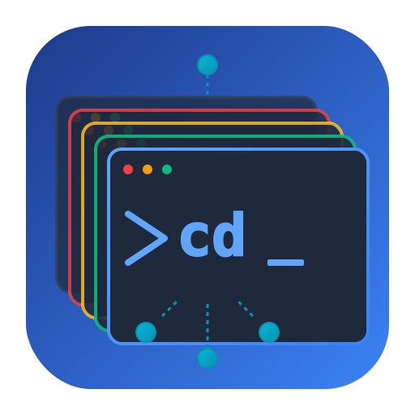

  

<h1 align="center">termiHub</h1>

A modern, cross-platform terminal hub for embedded development workflows.

  
  
  

---

termiHub provides a VS Code-like interface for managing multiple terminal connections — local shells, SSH, serial, telnet, Docker containers, and WSL distributions — with split views, drag-and-drop tabs, SSH tunneling, and organized connection management. A shared Rust core (`termihub-core`) powers both the desktop app and a remote agent for persistent sessions on headless servers. Built with [Tauri](https://tauri.app/), [React](https://react.dev/), and [Rust](https://www.rust-lang.org/).

## Features

### Connection Types
- **Local shells** — zsh, bash, PowerShell, cmd, Git Bash with automatic shell detection
- **SSH** — Remote terminal sessions with key-based and password authentication
- **Serial** — Direct serial port connections for embedded development
- **Telnet** — Classic telnet connections with IAC protocol support
- **Docker** — Connect to running containers or start new ones
- **WSL** — Windows Subsystem for Linux distribution sessions (Windows only)
- **Remote agent** — Persistent sessions on headless servers via auto-deployed `termihub-agent`

### Terminal Management
- **Split views** — Arrange terminals in horizontal and vertical splits with drag-and-drop
- **Tab management** — Drag-and-drop tabs between panels, per-tab colors, CWD tracking
- **Connection management** — Organize connections in folder hierarchies with import/export from external files

### SSH Features
- **File browser** — Browse, upload, download, and edit remote files via SFTP
- **SSH tunneling** — Local, remote, and dynamic (SOCKS5) port forwarding with session pooling
- **X11 forwarding** — Forward remote GUI applications to your local X server
- **System monitoring** — Real-time CPU, memory, disk, and network stats for remote hosts

### UI and Customization
- **VS Code-inspired layout** — Activity bar, sidebar, status bar with customizable positions
- **Themes** — Dark, Light, and System (auto-detects OS preference) themes
- **Layout presets** — Default, Focus (no sidebar), and Zen (minimal UI) modes
- **Built-in editor** — Edit local and remote files with Monaco Editor (syntax highlighting, search, minimap)
- **Schema-driven settings** — Connection types declare their own settings; the UI renders them automatically

### Security
- **Credential storage** — Optional credential encryption via platform keychain, master password, or prompt-only mode
- **Auto-lock** — Configurable timeout for credential store locking

### Platform Support
- **Cross-platform** — Windows, Linux, and macOS
- **Shared core** — `termihub-core` Rust library shared between desktop and remote agent

## Documentation

- **[User Guide](docs/user-guide.md)** — Interface overview, connections, tabs, splits, keyboard shortcuts, file browser, editor
- **[Building](docs/building.md)** — Platform-specific build and development instructions
- **[Scripts](scripts/README.md)** — Helper scripts for setup, dev, build, test, format, and quality checks
- **[Serial Setup](docs/serial-setup.md)** — Serial port configuration per platform
- **[SSH Configuration](docs/ssh-configuration.md)** — SSH keys, X11 forwarding, SFTP
- **[Testing Strategy](docs/testing.md)** — Automated testing layers (unit, integration, E2E)
- **[Manual Testing](docs/manual-testing.md)** — Manual test plan for hardware-dependent features
- **[Contributing](docs/contributing.md)** — Development workflow, coding standards, architecture
- **[Architecture](docs/architecture.md)** — Full arc42 architecture documentation
- **[Remote Protocol](docs/remote-protocol.md)** — Desktop-to-agent JSON-RPC specification
- **[Performance](docs/performance.md)** — Profiling guide and baseline metrics
- **[Raspberry Pi](docs/raspberry-pi.md)** — ARM64 deployment and remote agent setup
- **[Releasing](docs/releasing.md)** — Release process and version management

## Built With

- [Tauri 2](https://tauri.app/) — Desktop application framework
- [React 18](https://react.dev/) — UI framework
- [Rust](https://www.rust-lang.org/) — Backend language
- [xterm.js](https://xtermjs.org/) — Terminal emulator component
- [Monaco Editor](https://microsoft.github.io/monaco-editor/) — Code editor component
- [Zustand](https://github.com/pmndrs/zustand) — State management
- [dnd kit](https://dndkit.com/) — Drag and drop
- [react-resizable-panels](https://github.com/bvaughn/react-resizable-panels) — Split view layout

## License

This project is licensed under the MIT License — see the [LICENSE](LICENSE) file for details.

The MIT License is a short, permissive license that allows free use, modification, and distribution. For a plain-language explanation, see [Choose a License: MIT](https://choosealicense.com/licenses/mit/) by GitHub.
