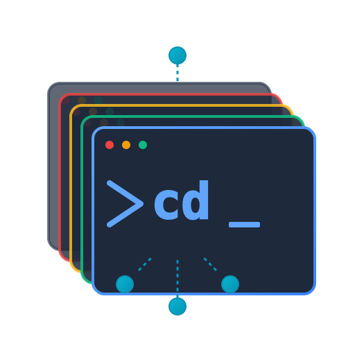

<p align="center">
  
</p>

<h1 align="center">termiHub</h1>

<p align="center">
A modern, cross-platform terminal hub for managing multiple connections.
</p>

<p align="center">
  <a href="https://github.com/armaxri/termiHub/actions/workflows/code-quality.yml"></a>
  <a href="https://github.com/armaxri/termiHub/actions/workflows/build.yml"></a>
  <a href="https://github.com/armaxri/termiHub/actions/workflows/release.yml"></a>
</p>

---

termiHub provides a VS Code-like interface for managing multiple terminal connections — local shells, SSH, serial, telnet, Docker containers, and WSL distributions — with split views, drag-and-drop tabs, SSH tunneling, and organized connection management. A shared Rust core (`termihub-core`) powers both the desktop app and a remote agent for persistent sessions on headless servers. Built with [Tauri](https://tauri.app/), [React](https://react.dev/), and [Rust](https://www.rust-lang.org/).

## Features

### Connection Types

- **Local shells** — zsh, bash, PowerShell, cmd, Git Bash with automatic shell detection
- **SSH** — Remote terminal sessions with key-based and password authentication
- **Serial** — Direct serial port connections for hardware debugging and IoT devices
- **Telnet** — Classic telnet connections with IAC protocol support
- **Docker** — Connect to running containers or start new ones
- **WSL** — Windows Subsystem for Linux distribution sessions (Windows only)
- **Remote agent** — Persistent sessions on headless servers via auto-deployed `termihub-agent`

### Terminal Management

- **Split views** — Arrange terminals in horizontal and vertical splits with drag-and-drop
- **Tab management** — Drag-and-drop tabs between panels, per-tab colors, CWD tracking
- **Connection management** — Organize connections in folder hierarchies with import/export from external files

### SSH Features

- **File browser** — Browse, upload, download, and edit remote files via SFTP
- **SSH tunneling** — Local, remote, and dynamic (SOCKS5) port forwarding with session pooling
- **X11 forwarding** — Forward remote GUI applications to your local X server
- **System monitoring** — Real-time CPU, memory, disk, and network stats for remote hosts

### UI and Customization

- **VS Code-inspired layout** — Activity bar, sidebar, status bar with customizable positions
- **Themes** — Dark, Light, and System (auto-detects OS preference) themes
- **Layout presets** — Default, Focus (no sidebar), and Zen (minimal UI) modes
- **Built-in editor** — Edit local and remote files with Monaco Editor (syntax highlighting, search, minimap)
- **Schema-driven settings** — Connection types declare their own settings; the UI renders them automatically

### Security

- **Credential storage** — Optional credential encryption via platform keychain, master password, or prompt-only mode
- **Auto-lock** — Configurable timeout for credential store locking

### Platform Support

- **Cross-platform** — Windows, Linux, and macOS
- **Shared core** — `termihub-core` Rust library shared between desktop and remote agent

## Usage Guide

### Interface Overview

termiHub uses a VS Code-inspired three-column layout:

```
┌──────────┬────────────────┬──────────────────────────────────────────┐
│ Activity │    Sidebar     │           Terminal View                  │
│   Bar    │                │  ┌──────┬──────┬──────┐                 │
│          │  Connections   │  │ Tab1 │ Tab2 │ Tab3 │                 │
│  [Con]   │  File Browser  │  ├──────┴──────┴──────┤                 │
│  [File]  │  Settings      │  │                    │                 │
│          │                │  │  Terminal Content   │                 │
│          │                │  │                    │                 │
│          │                │  │                    │                 │
│          │                │  └────────────────────┘                 │
│  [Gear]  │                │  Status Bar                             │
└──────────┴────────────────┴──────────────────────────────────────────┘
```

- **Activity Bar** — The narrow left column with icon buttons: Connections (network), File Browser (folder), and a gear icon at the bottom for settings, import/export. Click an active icon to toggle the sidebar.
- **Sidebar** — Shows the view selected in the Activity Bar.
- **Terminal View** — The main area with a tab bar, terminal content, toolbar (New Terminal, Split, Close Panel), and status bar.

### Managing Connections

1. Click **Connections** in the Activity Bar, then **+** to create a new connection
2. Fill in Name, Folder, Type (Local Shell / SSH / Serial / Telnet), and type-specific settings
3. Click **Save**

**Right-click** a connection for: Connect, Ping Host (SSH/Telnet), Edit, Duplicate, Delete. **Double-click** to connect immediately.

**Folders** — Create folders via the toolbar icon. Drag and drop connections between folders. Deleting a folder moves children to the parent.

**Import/Export** — Use the gear icon to export connections to JSON or import from a JSON file.

**External Connection Files** — Load shared connection configs from external JSON files (e.g., from a git repo). Add them in Settings > External Connection Files. External connections appear read-only with a git-folder icon.

**Environment Variable Placeholders** — Use `${env:VAR}` syntax in any connection field to substitute environment variables at connect time (e.g., `${env:HOME}/.ssh/id_rsa`).

### Connection Types

- **Local Shell** — Opens a local terminal using an auto-detected shell (zsh, bash, sh on macOS/Linux; PowerShell, cmd, Git Bash on Windows). Select the shell in the connection editor.
- **SSH** — Remote terminal via SSH. See [SSH Configuration](#ssh-configuration) below for authentication, X11 forwarding, and SFTP details.
- **Telnet** — Remote terminal via Telnet protocol. Configure host and port (default: 23).
- **Serial** — Connect to serial devices (USB-to-serial adapters, IoT, networking equipment). Configure port, baud rate, data/stop bits, parity, and flow control. See [Serial Port Setup](#serial-port-setup) below for platform-specific instructions.

### Terminal Tabs

Open terminals appear as tabs with type-specific icons and optional colored borders. Actions:

- **Click** to switch, **drag** to reorder or move between panels
- **Right-click** a tab for: Save to File, Copy to Clipboard, Clear Terminal, Horizontal Scrolling, Set Color

Each connection also has terminal options: **horizontal scrolling** and **tab color**, configurable in the editor or via the tab context menu.

### Split Views

Split the terminal area into multiple panels:

- Click the **Split** button in the toolbar, or **drag a tab** to the edge of a panel
- **Drag the divider** to resize panels
- **Close Panel** (X) removes a panel and moves its tabs to an adjacent one
- Splits can be nested (horizontal within vertical and vice versa)
- Drag tabs between panels or to panel edges to create new splits

### File Browser

The sidebar file browser operates in different modes based on the active tab:

| Active Tab      | Mode  | Description                  |
| --------------- | ----- | ---------------------------- |
| Local shell     | Local | Browses the local filesystem |
| SSH             | SFTP  | Browses the remote server    |
| Serial / Telnet | None  | File browser unavailable     |
| Editor/Settings | —     | Retains the last active mode |

**Toolbar:** Up (parent dir), Refresh, Upload (SFTP), New File, New Folder, Disconnect (SFTP).

**Context menu:** Files — Edit, Open in VS Code, Download (SFTP), Rename, Delete. Directories — Open, Rename, Delete.

**Drag-and-drop upload:** In SFTP mode, drag files from your OS file manager onto the browser to upload.

### Built-in Editor

Double-click a file in the file browser (or right-click > Edit) to open it in a Monaco-powered editor tab:

- Syntax highlighting with automatic language detection
- Search and replace (Ctrl+F / Ctrl+H)
- Save with Ctrl+S / Cmd+S, unsaved changes shown as a red dot
- Status bar shows cursor position, language, EOL type, tab size, and encoding

### Keyboard Shortcuts

| Shortcut                 | Action                |
| ------------------------ | --------------------- |
| `Ctrl+Shift+`` (`` ` ``) | New local terminal    |
| `Ctrl+W` / `Cmd+W`       | Close active tab      |
| `Ctrl+Tab`               | Next tab              |
| `Ctrl+Shift+Tab`         | Previous tab          |
| `Ctrl+S` / `Cmd+S`       | Save file (in editor) |

On macOS, `Cmd` can be used in place of `Ctrl`.

### Settings

Click the **gear icon** > **Settings** to open the settings tab. termiHub stores configuration in a platform-specific directory. Override with the `TERMIHUB_CONFIG_DIR` environment variable:

```bash
TERMIHUB_CONFIG_DIR=./my-project/termihub-config pnpm tauri dev
```

### Tips and Tricks

- **Quick connect** — Double-click any connection to open it immediately
- **Organize by project** — Use folders to group connections by project or environment
- **Color-code tabs** — Assign colors to distinguish production, staging, and dev
- **Share configs** — Use external connection files in a git repo for team-wide connection lists
- **Env var placeholders** — Use `${env:VAR}` so shared configs work across machines
- **Split for comparison** — Split the view to compare output from two sessions side by side
- **Auto-SFTP** — The file browser auto-connects to SFTP when you click an SSH tab

---

## SSH Configuration

### Authentication Methods

termiHub supports **Password** and **SSH Key** authentication:

- **Password** — termiHub prompts for the password each time you connect. Passwords are never stored in the configuration file (optionally stored in the credential store).
- **SSH Key** — Provide a path to your private key file. Recommended for frequent connections.

### Setting Up SSH Keys

Generate a key pair if you don't have one:

```bash
ssh-keygen -t ed25519 -C "your_email@example.com"
```

This creates `~/.ssh/id_ed25519` (private) and `~/.ssh/id_ed25519.pub` (public). You can also use RSA: `ssh-keygen -t rsa -b 4096`.

Install the public key on the server:

```bash
ssh-copy-id -i ~/.ssh/id_ed25519.pub user@hostname
```

In termiHub, set **Auth Method** to **SSH Key** and **Key Path** to `~/.ssh/id_ed25519`.

### Platform-Specific Key Setup

**macOS** — Add your key to the SSH agent and Keychain:

```bash
ssh-add --apple-use-keychain ~/.ssh/id_ed25519
```

**Linux** — Start the SSH agent and add your key:

```bash
eval "$(ssh-agent -s)"
ssh-add ~/.ssh/id_ed25519
```

Ensure correct permissions: `chmod 700 ~/.ssh && chmod 600 ~/.ssh/id_ed25519`

**Windows** — Enable the OpenSSH Authentication Agent service in Services (`services.msc`), set it to Automatic, then:

```powershell
ssh-add $env:USERPROFILE\.ssh\id_ed25519
```

### X11 Forwarding

X11 forwarding lets you run graphical applications on a remote server and display them locally. Enable it in the SSH connection editor (**Enable X11 Forwarding** checkbox).

**Platform requirements:**

- **macOS** — Install [XQuartz](https://www.xquartz.org/) (`brew install --cask xquartz`), then log out and back in
- **Linux** — Install `xauth` (`sudo apt install xauth` on Ubuntu/Debian)
- **Windows** — Not currently supported (relies on Unix domain sockets)

The SSH server must also have `X11Forwarding yes` in `/etc/ssh/sshd_config` and `xauth` installed.

### SFTP File Browser

When you click on an SSH terminal tab, the sidebar file browser auto-connects via SFTP. You can browse, upload, download, create, rename, and delete remote files. Edit remote files in the built-in Monaco editor — changes are saved back via SFTP.

### SSH Connection Settings

| Field                 | Description                               | Default  |
| --------------------- | ----------------------------------------- | -------- |
| Host                  | Server hostname or IP address             | —        |
| Port                  | SSH port                                  | 22       |
| Username              | Remote username                           | —        |
| Auth Method           | `password` or `key`                       | password |
| Key Path              | Path to private key (when using key auth) | —        |
| Enable X11 Forwarding | Forward remote GUI apps to local display  | Off      |

### SSH Troubleshooting

- **"Connection refused"** — Verify the SSH server is running (`systemctl status sshd`), check the port, test with `ssh -p 22 user@host`
- **"Authentication failed"** — Verify credentials; for key auth, ensure the public key is in `~/.ssh/authorized_keys` and the private key has `600` permissions
- **"Host key verification failed"** — Connect once with `ssh user@hostname` and accept the key
- **X11 not working** — Ensure XQuartz (macOS) or xauth (Linux) is installed and the server has `X11Forwarding yes`
- **SFTP fails** — Ensure `Subsystem sftp` is configured in `/etc/ssh/sshd_config`

---

## Serial Port Setup

### Platform Setup

**macOS** — Devices appear under `/dev/tty.*`:

| Device                | Path                       |
| --------------------- | -------------------------- |
| USB-to-serial adapter | `/dev/tty.usbserial-*`     |
| FTDI adapter          | `/dev/tty.usbserial-FTDI*` |
| CH340 adapter         | `/dev/tty.wchusbserial*`   |
| Arduino               | `/dev/tty.usbmodem*`       |

Most USB-to-serial adapters work out of the box. If not, download drivers from the chipset manufacturer (FTDI, CH340, CP210x). Run `ls /dev/tty.*` to list devices.

**Linux** — Devices appear under `/dev/ttyUSB*` or `/dev/ttyACM*`:

| Device                | Path           |
| --------------------- | -------------- |
| USB-to-serial adapter | `/dev/ttyUSB0` |
| Arduino / ACM device  | `/dev/ttyACM0` |
| Built-in serial port  | `/dev/ttyS0`   |

Add your user to the `dialout` group for serial port access:

```bash
sudo usermod -a -G dialout $USER
# Log out and back in for the change to take effect
```

**Windows** — Devices appear as COM ports (e.g., `COM3`). Find them in Device Manager > Ports (COM & LPT). Drivers are usually installed automatically via Windows Update.

### Configuration Parameters

| Parameter    | Options                                                   | Default | Description                       |
| ------------ | --------------------------------------------------------- | ------- | --------------------------------- |
| Port         | Auto-detected or manual                                   | —       | Serial port path                  |
| Baud Rate    | 9600, 19200, 38400, 57600, 115200, 230400, 460800, 921600 | 9600    | Data transfer speed (bits/second) |
| Data Bits    | 5, 6, 7, 8                                                | 8       | Number of data bits per frame     |
| Stop Bits    | 1, 2                                                      | 1       | Number of stop bits per frame     |
| Parity       | None, Odd, Even                                           | None    | Error-checking method             |
| Flow Control | None, Hardware (RTS/CTS), Software (XON/XOFF)             | None    | Data flow regulation              |

**Common configurations:** Most embedded devices (Arduino, ESP32, STM32) use 115200/8/1/None/None. Legacy devices typically use 9600/8/1/None/None.

### Testing with Virtual Serial Ports

For testing without physical hardware, use the virtual serial port setup in `examples/serial/`:

```bash
# Install socat (macOS: brew install socat, Linux: sudo apt install socat)
cd examples/serial
./setup-virtual-serial.sh        # Creates /tmp/termihub-serial-a and /tmp/termihub-serial-b
python3 serial-echo-server.py    # Echo server on port B
```

Connect termiHub to `/tmp/termihub-serial-a` to test.

### Serial Troubleshooting

- **Port not appearing** — Unplug/replug the device, click Refresh. On Linux, check `dialout` group membership.
- **Garbled output** — Baud rate mismatch (most common cause). Verify it matches your device.
- **"Permission denied" (Linux)** — `sudo usermod -a -G dialout $USER`, then log out and back in.
- **"Port is busy"** — Another application has the port open. Serial ports can only be used by one application at a time.

---

## Development

### Prerequisites

- **Node.js** v18+ — [nodejs.org](https://nodejs.org/)
- **pnpm** — `npm install -g pnpm`
- **Rust** — [rustup.rs](https://www.rust-lang.org/tools/install)
- **Tauri prerequisites** — Follow the [Tauri v2 prerequisites guide](https://v2.tauri.app/start/prerequisites/) for your platform

**Platform-specific dependencies:**

- **macOS** — Xcode Command Line Tools: `xcode-select --install`
- **Linux (Ubuntu/Debian)** — `sudo apt install libwebkit2gtk-4.1-dev build-essential curl wget file libxdo-dev libssl-dev libayatana-appindicator3-dev librsvg2-dev libssh2-1-dev libudev-dev pkg-config`
- **Linux (Fedora)** — `sudo dnf install webkit2gtk4.1-devel openssl-devel curl wget file libxdo-devel libappindicator-gtk3-devel librsvg2-devel libssh2-devel systemd-devel pkg-config`
- **Linux (Arch)** — `sudo pacman -S --needed webkit2gtk-4.1 base-devel curl wget file openssl xdotool libappindicator-gtk3 librsvg libssh2 pkg-config`
- **Windows** — Visual Studio Build Tools ("Desktop development with C++" workload), WebView2 (pre-installed on Win 10 1803+)

### Quick Start

```bash
git clone https://github.com/armaxri/termiHub.git
cd termiHub
./scripts/setup.sh     # Install deps + initial build
./scripts/dev.sh       # Start dev mode with hot-reload
```

Or manually: `pnpm install && pnpm tauri dev`

### Scripts

All scripts live in `scripts/` with `.sh` (Unix/macOS) and `.cmd` (Windows) variants:

| Script                     | Purpose                                                                  |
| -------------------------- | ------------------------------------------------------------------------ |
| `./scripts/setup.sh`       | Install all dependencies and do an initial build                         |
| `./scripts/dev.sh`         | Start the app in dev mode with hot-reload                                |
| `./scripts/build.sh`       | Build for production (creates platform installer)                        |
| `./scripts/test.sh`        | Run all unit tests (frontend + backend + agent)                          |
| `./scripts/check.sh`       | Read-only quality checks mirroring CI (formatting, linting, clippy)      |
| `./scripts/format.sh`      | Auto-fix all formatting issues (Prettier + cargo fmt)                    |
| `./scripts/clean.sh`       | Remove all build artifacts for a fresh start                             |
| `./scripts/test-system.sh` | Start Docker infra + virtual serial ports and run system-level E2E tests |

**Typical workflow:**

```bash
./scripts/dev.sh           # Daily development
./scripts/format.sh        # Before pushing
./scripts/test.sh          # Run all tests
./scripts/check.sh         # Quality checks (mirrors CI)
```

### Individual Commands

```bash
# Frontend
pnpm run lint            # ESLint
pnpm run format:check    # Prettier check
pnpm test                # Vitest single run
pnpm test:watch          # Vitest watch mode
pnpm test:coverage       # Vitest with coverage
pnpm build               # TypeScript check + Vite build

# Rust workspace
cargo fmt --all -- --check
cargo clippy --workspace --all-targets --all-features -- -D warnings
cargo test --workspace --all-features
```

### Building for Production

```bash
pnpm tauri build
```

**Output by platform:**

- **macOS** — `src-tauri/target/release/bundle/dmg/termiHub_<version>_aarch64.dmg` (or `_x64.dmg`)
- **Linux** — `src-tauri/target/release/bundle/deb/termihub_<version>_amd64.deb` and `.AppImage`
- **Windows** — `src-tauri\target\release\bundle\msi\termiHub_<version>_x64_en-US.msi` and `_x64-setup.exe`

### Test Environment

**Quick start** — The `examples/` directory provides simple Docker-based test servers:

```bash
cd examples
./start-test-environment.sh   # Start SSH (port 2222) + Telnet (port 2323) servers
./stop-test-environment.sh    # Stop servers
```

**Comprehensive testing** — The `tests/docker/` directory provides 13 Docker containers for system testing (SSH variants, telnet, serial, SFTP stress, network fault injection). See [tests/docker/README.md](tests/docker/README.md).

---

## Documentation

- **[Architecture](docs/architecture.md)** — Full arc42 architecture documentation (building blocks, runtime views, ADRs)
- **[Contributing](docs/contributing.md)** — Development workflow, coding standards, agent development, releasing, and performance profiling
- **[Testing](docs/testing.md)** — Automated testing strategy and manual test procedures
- **[Remote Protocol](docs/remote-protocol.md)** — Desktop-to-agent JSON-RPC specification

## Built With

- [Tauri 2](https://tauri.app/) — Desktop application framework
- [React 18](https://react.dev/) — UI framework
- [Rust](https://www.rust-lang.org/) — Backend language
- [xterm.js](https://xtermjs.org/) — Terminal emulator component
- [Monaco Editor](https://microsoft.github.io/monaco-editor/) — Code editor component
- [Zustand](https://github.com/pmndrs/zustand) — State management
- [dnd kit](https://dndkit.com/) — Drag and drop
- [react-resizable-panels](https://github.com/bvaughn/react-resizable-panels) — Split view layout

## License

This project is licensed under the MIT License — see the [LICENSE](LICENSE) file for details.

The MIT License is a short, permissive license that allows free use, modification, and distribution. For a plain-language explanation, see [Choose a License: MIT](https://choosealicense.com/licenses/mit/) by GitHub.
