# termiHub Architecture Documentation

> Based on the [arc42](https://arc42.org) template for software architecture documentation.

---

## Table of Contents

1. [Introduction and Goals](#1-introduction-and-goals)
2. [Architecture Constraints](#2-architecture-constraints)
3. [Context and Scope](#3-context-and-scope)
4. [Solution Strategy](#4-solution-strategy)
5. [Building Block View](#5-building-block-view)
6. [Runtime View](#6-runtime-view)
7. [Deployment View](#7-deployment-view)
8. [Cross-cutting Concepts](#8-cross-cutting-concepts)
9. [Architecture Decisions](#9-architecture-decisions)
10. [Quality Requirements](#10-quality-requirements)
11. [Risks and Technical Debts](#11-risks-and-technical-debts)
12. [Glossary](#12-glossary)

---

## 1. Introduction and Goals

### Requirements Overview

**termiHub** is a modern, cross-platform terminal hub for managing multiple terminal connections. It provides a VS Code-like interface with support for split views, drag-and-drop tabs, and organized connection management.

**Core capabilities:**

- **Multiple terminal types** — Local shells (zsh, bash, cmd, PowerShell, Git Bash), SSH, Telnet, Serial, Docker, and WSL (Windows Subsystem for Linux)
- **VS Code-inspired UI** — Activity bar, sidebar, split view support with customizable layout (presets: default, focus, zen)
- **Drag-and-drop tab management** — Up to 40 concurrent terminals with per-tab color coding
- **Connection organization** — Folder hierarchies with import/export and external connection file support
- **SSH file browser** — Browse, upload, download, and edit remote files via SFTP
- **SSH tunneling** — Local, remote, and dynamic (SOCKS5) port forwarding with visual tunnel editor
- **Built-in editor** — Edit local and remote files with syntax highlighting (Monaco Editor)
- **Theme system** — Dark, Light, and System (auto-detect OS preference) themes
- **X11 forwarding** — Forward remote GUI applications to local X server
- **Session persistence** — Remote agent sessions survive disconnects and agent restarts via daemon architecture
- **Schema-driven connection settings** — Connection types declare their configuration as schemas; the UI renders forms dynamically without hardcoded knowledge of any backend
- **Cross-platform** — Windows, Linux, macOS

**Example use case:** A developer uses local shells for builds, serial connections to interface with hardware, remote agents on headless servers for persistent sessions, SSH tunnels to expose remote services, and SFTP for seamless file transfer — all from a single window.

### Quality Goals

| Priority | Quality Goal | Description |
|----------|-------------|-------------|
| 1 | Cross-platform | Run identically on Windows, Linux, and macOS |
| 2 | Performance | Support 40 concurrent terminals without degradation |
| 3 | Extensibility | Add new terminal types with minimal code changes |
| 4 | Reliability | Handle disconnections, reconnections, and errors gracefully |
| 5 | Usability | VS Code-familiar interface with minimal learning curve |

### Stakeholders

| Role | Contact | Expectations |
|------|---------|-------------|
| Creator / Lead Developer | Arne Maximilian Richter | Full-featured terminal hub for multi-protocol workflows |
| Developers / DevOps / Sysadmins | (Target users) | Reliable multi-protocol terminal with organized connections and file transfer |
| Contributors | (Open source) | Clear architecture, coding standards, and contribution workflow |

---

## 2. Architecture Constraints

### Technical Constraints

| Constraint | Rationale |
|-----------|-----------|
| **Tauri 2.x** as application framework | Small binary (~5 MB vs Electron's ~100 MB), lower memory footprint, Rust backend for performance and safety |
| **React 18 + TypeScript** for frontend | Mature ecosystem, best-in-class drag-and-drop (dnd-kit) and split view (react-resizable-panels) libraries |
| **Rust** for backend | Memory safety, cross-platform PTY/serial/SSH support, async I/O via tokio |
| **Windows 10 1809+** minimum | Required for ConPTY (Windows pseudo-terminal) support |
| **Credential storage optional** | Platform keychain and master-password encryption available but optional; SSH passwords can be prompted at connection time |

### Organizational Constraints

| Constraint | Rationale |
|-----------|-----------|
| Single developer (initially) | Architecture must be simple enough for one person to maintain |
| MIT License | Permissive open-source for broad adoption |
| GitHub-based workflow | Issues, PRs, Actions for CI/CD |

### Convention Constraints

| Constraint | Detail |
|-----------|--------|
| Conventional Commits | All commit messages follow the `type(scope): subject` format |
| Keep a Changelog | User-facing changes documented in CHANGELOG.md |
| Merge commits only | No squash or rebase merges — preserve full commit history |

---

## 3. Context and Scope

### Business Context

The following diagram shows termiHub in its operational environment — a developer interacting with multiple systems simultaneously.

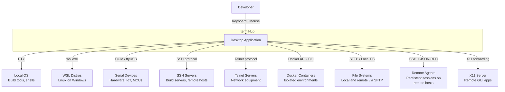

| Partner | Description |
|---------|-------------|
| **Developer** | Primary user interacting via keyboard and mouse |
| **Local OS** | Host operating system providing shells (bash, zsh, PowerShell, cmd, Git Bash) via PTY |
| **WSL Distros** | Windows Subsystem for Linux distributions accessible on Windows hosts |
| **Serial Devices** | Hardware connected via USB-to-serial adapters (IoT devices, networking equipment, microcontrollers) |
| **SSH Servers** | Remote machines (build servers, cloud instances, ARM devices) accessed over SSH; also used for tunneling and X11 forwarding |
| **Telnet Servers** | Legacy network equipment accessed via Telnet |
| **Docker Containers** | Isolated container environments for development, testing, and CI workflows |
| **File Systems** | Local and remote file systems for browsing and transfer |
| **Remote Agents** | Remote machines running `termihub-agent` for persistent shell sessions, serial proxy, Docker containers, file browsing, and system monitoring |
| **X11 Server** | Local X display server (XQuartz on macOS, native on Linux) for remote GUI application forwarding |

### Technical Context

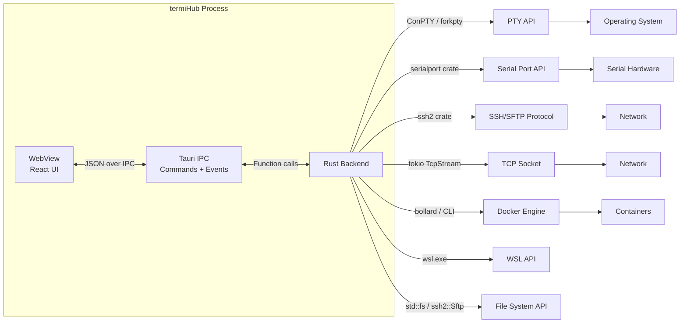

| Channel | Technology | Format |
|---------|-----------|--------|
| Frontend ↔ Backend | Tauri IPC (commands + events) | JSON-serialized Rust structs |
| Backend → PTY | `portable-pty` crate (ConPTY on Windows, forkpty on Unix) | Raw bytes |
| Backend → Serial | `serialport` crate | Raw bytes |
| Backend → SSH | `ssh2` crate (libssh2) | SSH protocol (encrypted) |
| Backend → Telnet | `tokio::net::TcpStream` | Telnet protocol (IAC sequences) |
| Backend → Docker | `bollard` crate (Docker Engine API) or Docker CLI | Raw bytes via PTY/exec |
| Backend → WSL | `wsl.exe` invocation (Windows only) | Raw bytes via PTY |
| Backend → Files | `std::fs` (local) / `ssh2::Sftp` (remote) | File I/O |

---

## 4. Solution Strategy

| Decision | Choice | Rationale |
|----------|--------|-----------|
| Application framework | **Tauri 2** over Electron | ~5 MB binary (vs ~100 MB), lower memory, Rust backend, native system integration |
| Frontend framework | **React 18** over Svelte | Larger ecosystem, mature dnd-kit and react-resizable-panels libraries, better AI-assisted development support |
| State management | **Zustand** | Minimal boilerplate, single store, no provider wrappers, good TypeScript support |
| Backend language | **Rust** | Memory safety, cross-platform PTY/serial/SSH, async I/O with tokio |
| Terminal rendering | **xterm.js** | Industry-standard terminal emulator, canvas-based rendering, add-on ecosystem |
| Code editor | **Monaco Editor** | VS Code's editor component — syntax highlighting, language detection, find/replace for local and remote file editing |
| Backend extensibility | **`ConnectionType` trait + registry** | Schema-driven connection types in `termihub-core` — each backend declares its settings schema, capabilities, and lifecycle; the UI renders forms dynamically (see [ADR-7](#adr-7-connectiontype-trait-and-registry)) |
| IPC pattern | **Commands + Events** | Commands for request-response (create terminal, send input), events for streaming (terminal output) |
| Connection storage | **JSON files with generic config** | Connections stored as `{type, config}` pairs where config is a type-specific JSON object; schemas define validation |
| Credential handling | **Optional credential store** | Platform keychain (macOS Keychain, Windows Credential Manager, Linux Secret Service) or master password encryption; prompt-at-connection fallback |

---

## 5. Building Block View

### Level 1: System Overview

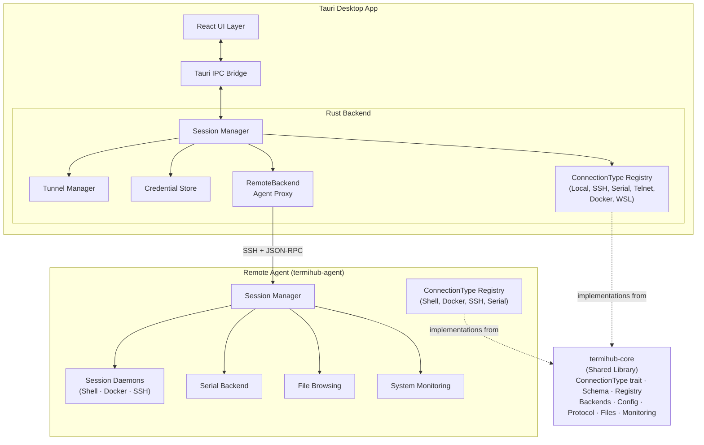

**Contained building blocks:**

| Building Block | Description |
|---------------|-------------|
| **React UI Layer** | Frontend application rendered in Tauri's WebView with schema-driven connection forms, theme engine, tunnel editor, and customizable layout |
| **Tauri IPC Bridge** | Bidirectional communication layer between frontend and backend |
| **Session Manager** | Orchestrates terminal session lifecycle using the `ConnectionType` registry — creates, routes I/O, and cleans up sessions for all connection types |
| **ConnectionType Registry** | Runtime registry of available connection types. Each type is a `ConnectionType` trait implementation registered at startup with its settings schema, capabilities, and factory function. Both desktop and agent maintain their own registries populated from `termihub-core` backends. |
| **Tunnel Manager** | Manages SSH port forwarding tunnels (local, remote, dynamic SOCKS5) with auto-start, status tracking, and persistence |
| **Credential Store** | Optional encrypted credential storage via platform keychain or master password, with auto-lock timeout |
| **RemoteBackend** | Proxy to remote agent instances — forwards I/O as JSON-RPC over SSH |
| **Shared Core (termihub-core)** | Shared Rust library containing the `ConnectionType` trait, `ConnectionTypeRegistry`, settings schema system, concrete backend implementations (local shell, SSH, serial, telnet, Docker, WSL), config types, error types, protocol types, session helpers, file operations, monitoring parsers, transport traits, and output processing — used by both desktop and agent |
| **Remote Agent** | Standalone binary (`termihub-agent`) for persistent remote sessions, file browsing, and system monitoring. Uses a thin JSON-RPC dispatcher that delegates to the core `ConnectionType` registry. See [Remote Protocol](remote-protocol.md) for the protocol specification. |

### Level 2: Frontend Components

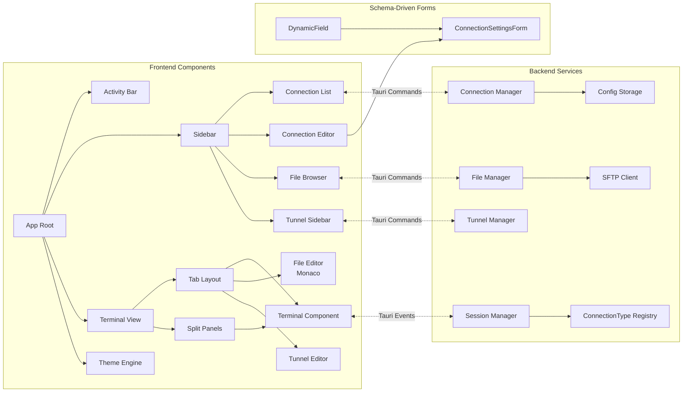

| Component | Location | Responsibility |
|-----------|----------|---------------|
| **Activity Bar** | `src/components/ActivityBar/` | Icon navigation (Connections, File Browser, Tunnels, Settings) |
| **Sidebar** | `src/components/Sidebar/` | Connection list, agent nodes, file browser panels |
| **Connection Editor** | `src/components/ConnectionEditor/` | Schema-driven connection editing using `ConnectionSettingsForm` |
| **Terminal View** | `src/components/Terminal/` | Tab bar, split panels, xterm.js terminal instances |
| **File Editor** | `src/components/FileEditor/` | Monaco Editor for local and remote file editing |
| **Tunnel Editor** | `src/components/TunnelEditor/` | Visual SSH tunnel configuration with diagram |
| **Tunnel Sidebar** | `src/components/TunnelSidebar/` | Tunnel list with status indicators and actions |
| **DynamicForm** | `src/components/DynamicForm/` | Generic schema-driven form renderer — renders `SettingsField` definitions as UI widgets (text, password, select, file picker, key-value list, etc.) |
| **Settings Panel** | `src/components/Settings/` | Two-panel settings with categories: General, Appearance, Terminal, External Files, Security, plus Customize Layout dialog |
| **Theme Engine** | `src/themes/` | Dark/Light/System theme management, CSS variable application, xterm.js live re-theming |
| **App Store** | `src/store/appStore.ts` | Zustand store managing all frontend state (panels, tabs, connections, tunnels, agents, themes, layout, credentials) |
| **API Service** | `src/services/api.ts` | Tauri command wrappers |
| **Event Service** | `src/services/events.ts` | Tauri event listeners and dispatcher |

### Level 2: Backend Modules

| Module | Location | Responsibility |
|--------|----------|---------------|
| **Terminal** | `src-tauri/src/terminal/` | Agent manager (deploy, version check, setup), remote backend proxy, X11 forwarding, JSON-RPC client |
| **Session** | `src-tauri/src/session/` | Desktop `SessionManager` — wraps core `ConnectionType` instances, manages lifecycle via the registry |
| **Connection** | `src-tauri/src/connection/` | Config persistence, CRUD operations, connection file I/O |
| **Tunnel** | `src-tauri/src/tunnel/` | SSH tunnel manager — local, remote, and dynamic (SOCKS5) forwarding with session pooling, auto-start, and `tunnels.json` persistence |
| **Credential** | `src-tauri/src/credential/` | Credential store abstraction — platform keychain backend, master password backend, encryption, auto-lock |
| **Files** | `src-tauri/src/files/` | Local and SFTP file browsing, upload/download |
| **Monitoring** | `src-tauri/src/monitoring/` | SSH remote system monitoring (CPU, memory, disk, uptime) |
| **Commands** | `src-tauri/src/commands/` | Tauri IPC command handlers (session, connection, agent, files, monitoring, credentials, tunnels, logs) |
| **Utils** | `src-tauri/src/utils/` | Shell detection, Docker detection, VS Code detection, env expansion, error helpers |

### Level 2: Shared Core Modules

The `termihub-core` crate is the shared backend engine that both the desktop and agent depend on. It defines the `ConnectionType` trait and registry, settings schema system, concrete backend implementations, and all shared types and utilities. The goal is that both consumers are thin transport adapters over core — a bug fixed in core fixes it everywhere.

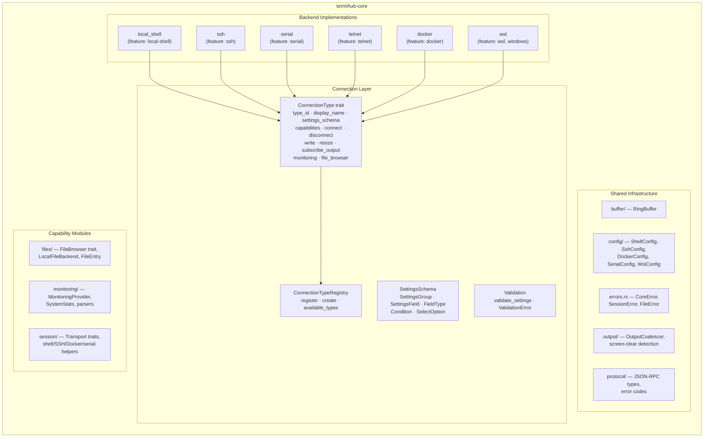

| Module | Location | Responsibility |
|--------|----------|---------------|
| **Connection** | `core/src/connection/` | The central abstraction layer: `ConnectionType` async trait (the unified interface all backends implement), `ConnectionTypeRegistry` (runtime registry with factory functions), `SettingsSchema` types for dynamic UI form generation (groups, fields, field types including text, password, number, boolean, select, port, file path, key-value list, object list), `Condition` for conditional field visibility, `Capabilities` (monitoring, file browser, resize, persistent), and settings validation |
| **Backends** | `core/src/backends/` | Concrete `ConnectionType` implementations, each gated behind a cargo feature flag: `local_shell` (portable-pty), `ssh` (ssh2 with auth, file browser, monitoring, X11), `serial` (serialport crate), `telnet` (raw TCP + IAC), `docker` (bollard + file browser), `wsl` (Windows only) |
| **Buffer** | `core/src/buffer/` | `RingBuffer` — 1 MiB circular byte buffer for output replay and serial capture |
| **Config** | `core/src/config/` | Unified configuration types (`ShellConfig`, `SshConfig`, `DockerConfig`, `SerialConfig`, `WslConfig`, `PtySize`, `EnvVar`, `VolumeMount`) with config value expansion utilities (`${env:VAR}`, tilde expansion) |
| **Errors** | `core/src/errors.rs` | Shared error types (`CoreError`, `SessionError`, `FileError`) with `From` conversions for `std::io::Error` |
| **Files** | `core/src/files/` | `FileBrowser` async trait, `LocalFileBackend` implementation, `FileEntry` struct, and utilities (`chrono_from_epoch`, `format_permissions`, `normalize_path_separators`, `list_dir_sync`) |
| **Monitoring** | `core/src/monitoring/` | `MonitoringProvider` trait, `SystemStats`, `CpuCounters`, `StatsCollector` trait, and parsers (`parse_stats`, `parse_cpu_line`, `cpu_percent_from_delta`, `parse_meminfo_value`, `parse_df_output`, `MONITORING_COMMAND`) |
| **Output** | `core/src/output/` | `OutputCoalescer` for batching terminal output and `contains_screen_clear` for ANSI screen-clear detection |
| **Protocol** | `core/src/protocol/` | JSON-RPC 2.0 message types (`JsonRpcRequest`, `JsonRpcResponse`, `JsonRpcNotification`) and standard/application error code constants |
| **Session** | `core/src/session/` | Transport traits (`OutputSink`, `ProcessSpawner`, `ProcessHandle`) and session helpers — shell command building, SSH argument building, Docker CLI argument building, serial config parsing and port management |

### Level 2: Agent Modules

The remote agent (`termihub-agent`) uses a **session daemon architecture** for shell persistence. Each shell session runs as an independent daemon process (`termihub-agent --daemon <session-id>`) that manages a PTY, a 1 MiB ring buffer for output replay, and a Unix domain socket for IPC. The agent connects to daemons as a client, forwarding I/O between the desktop (JSON-RPC) and the daemon (binary frame protocol).

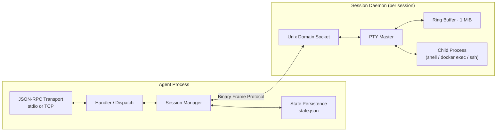

| Module | Location | Responsibility |
|--------|----------|---------------|
| **Buffer** | `agent/src/buffer/` | Shared 1 MiB ring buffer used by session daemons and serial backend for output replay |
| **Daemon** | `agent/src/daemon/` | Binary frame protocol (`[type: 1B][length: 4B BE][payload]`) and session daemon process (PTY allocation, poll-based event loop, Unix socket listener) |
| **Shell** | `agent/src/shell/` | ShellBackend — agent-side daemon client for PTY shell sessions |
| **Docker** | `agent/src/docker/` | DockerBackend — Docker container sessions via daemon infrastructure |
| **SSH** | `agent/src/ssh/` | SshBackend — SSH jump host sessions via daemon infrastructure |
| **Serial** | `agent/src/serial/` | SerialBackend — direct serial port access with ring buffer (no daemon) |
| **Session** | `agent/src/session/` | SessionManager (create, attach, detach, close, recover), session types and snapshots, prepared connection definitions |
| **Files** | `agent/src/files/` | Connection-scoped file browsing (local filesystem, SFTP relay for SSH targets, Docker exec) |
| **Monitoring** | `agent/src/monitoring/` | System stats collection and parsing — CPU, memory, disk, network for agent host and jump targets |
| **Handler** | `agent/src/handler/` | JSON-RPC method dispatcher — routes requests to session, files, monitoring, and agent lifecycle handlers |
| **Protocol** | `agent/src/protocol/` | Protocol types (configs, capabilities, results, error codes) for all JSON-RPC methods |
| **State** | `agent/src/state/` | Session state persistence (`~/.config/termihub-agent/state.json`) for daemon recovery after agent restart |
| **IO** | `agent/src/io/` | Transport layer — stdio (production SSH mode) and TCP (development/test mode) |

The agent was recently refactored into a **thin proxy** over the core `ConnectionType` registry. All session lifecycle methods now use the `connection.*` JSON-RPC namespace (`connection.create`, `connection.attach`, `connection.detach`, `connection.input`, `connection.resize`, `connection.close`, `connection.list`). The agent's dispatcher routes these generically through the registry — no connection-type-specific dispatch code. See [Remote Protocol](remote-protocol.md) for the full specification and [Agent Concept](concepts/handled/agent.md) for the design vision.

### Level 3: ConnectionType Architecture

The core abstraction is the `ConnectionType` trait in `termihub-core`. Every connection backend — local shell, SSH, serial, telnet, Docker, WSL — implements this trait. The desktop and agent both populate a `ConnectionTypeRegistry` at startup with factory functions for each available type. The frontend never hardcodes knowledge of specific backends; it discovers available types via the registry's schemas and renders forms dynamically.

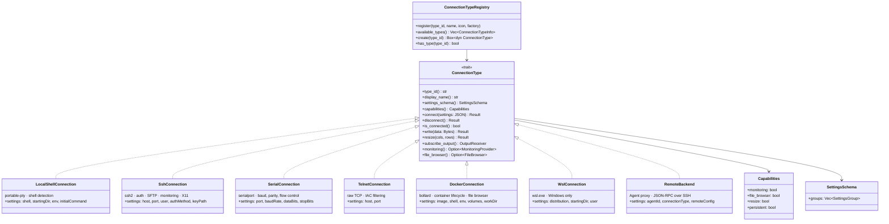

The `ConnectionConfig` stored on disk is a generic `{type, config}` pair — `type` identifies the connection type (e.g., `"ssh"`, `"serial"`), and `config` holds the type-specific settings as a JSON object validated against the schema at connect time. This replaced an earlier enum-based `ConnectionConfig` that required adding a variant for each new type.

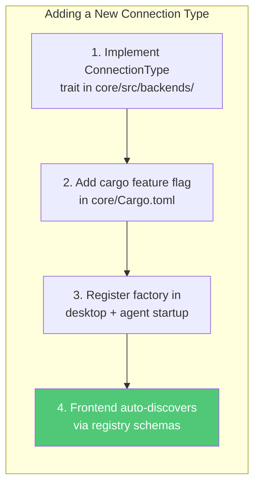

No frontend changes are needed to add a new connection type — the schema-driven form renderer and generic `ConnectionConfig` handle it automatically.

---

## 6. Runtime View

### Terminal Creation

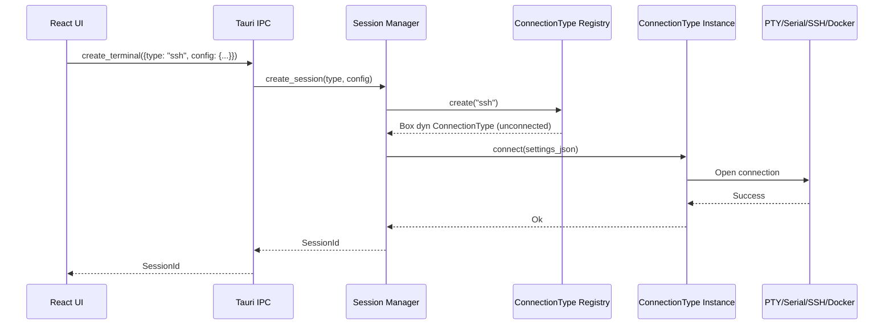

### Output Streaming

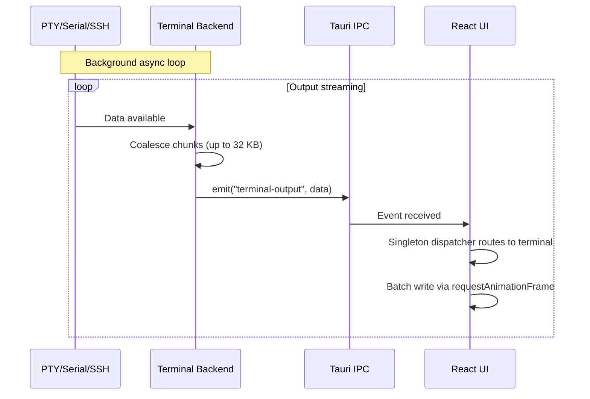

### Input Handling

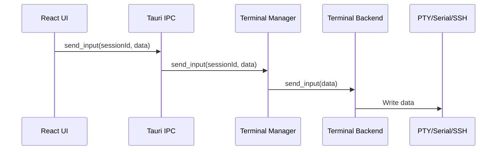

### SSH File Transfer

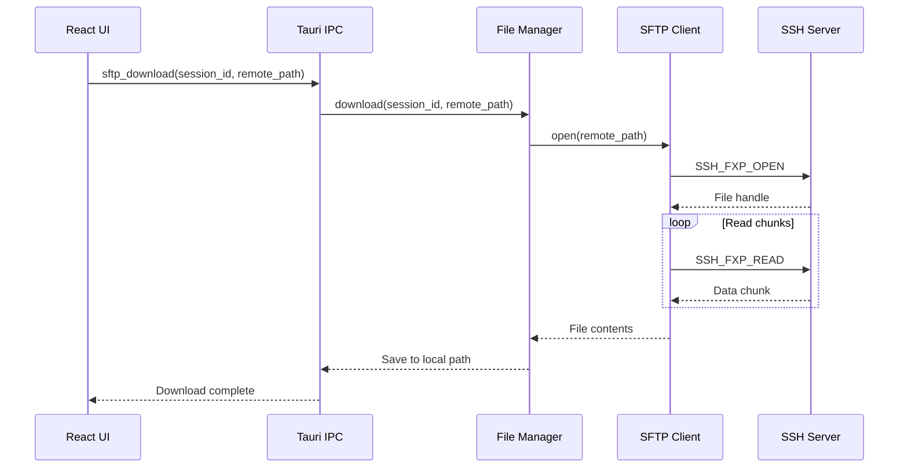

### Tab Drag-and-Drop Between Panels

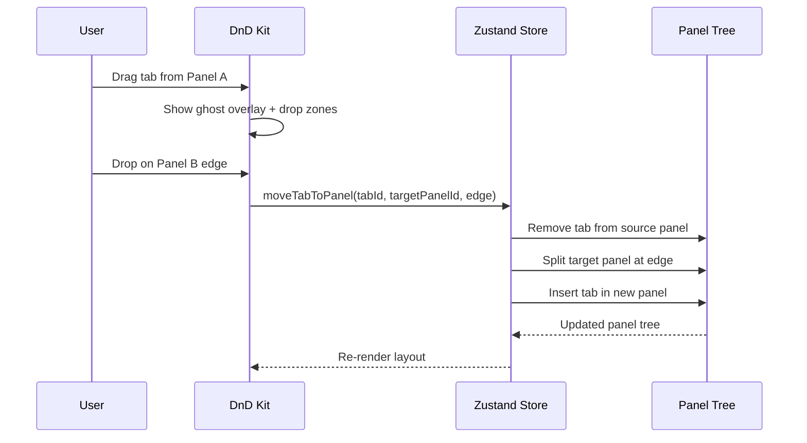

### SSH Tunnel Lifecycle

termiHub supports three types of SSH tunnels: local forwarding (expose a remote service on a local port), remote forwarding (expose a local service on the remote host), and dynamic forwarding (SOCKS5 proxy through the remote host). Tunnels are managed independently from terminal sessions and can auto-start on application launch.

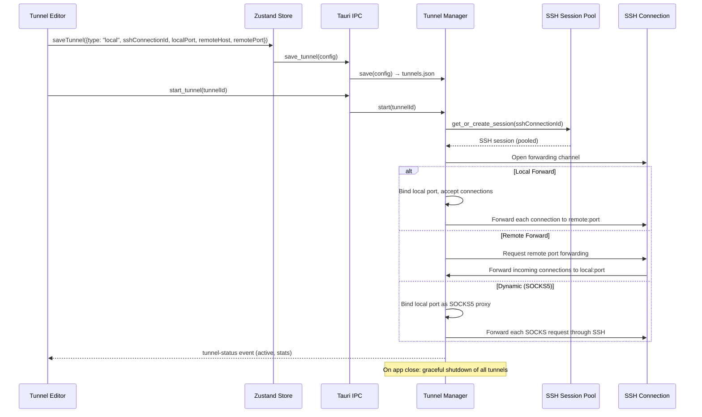

Tunnels are persisted in `tunnels.json` alongside connections. The SSH Session Pool reuses SSH connections across multiple tunnels targeting the same host, avoiding redundant authentication.

### Remote Session Creation (via Agent)

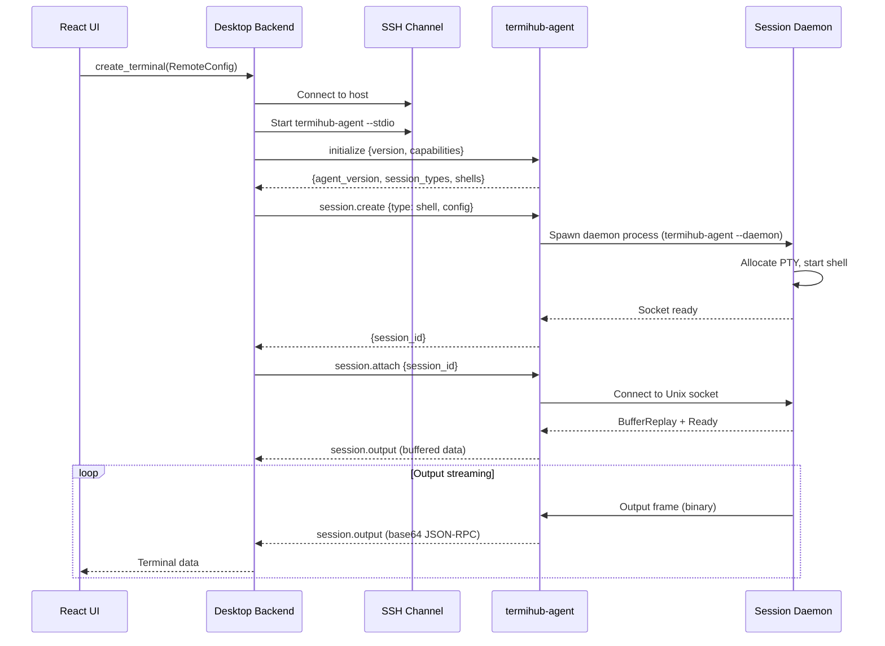

### Session Reconnection

When the desktop reconnects after a disconnect, sessions are recovered from living daemon processes:

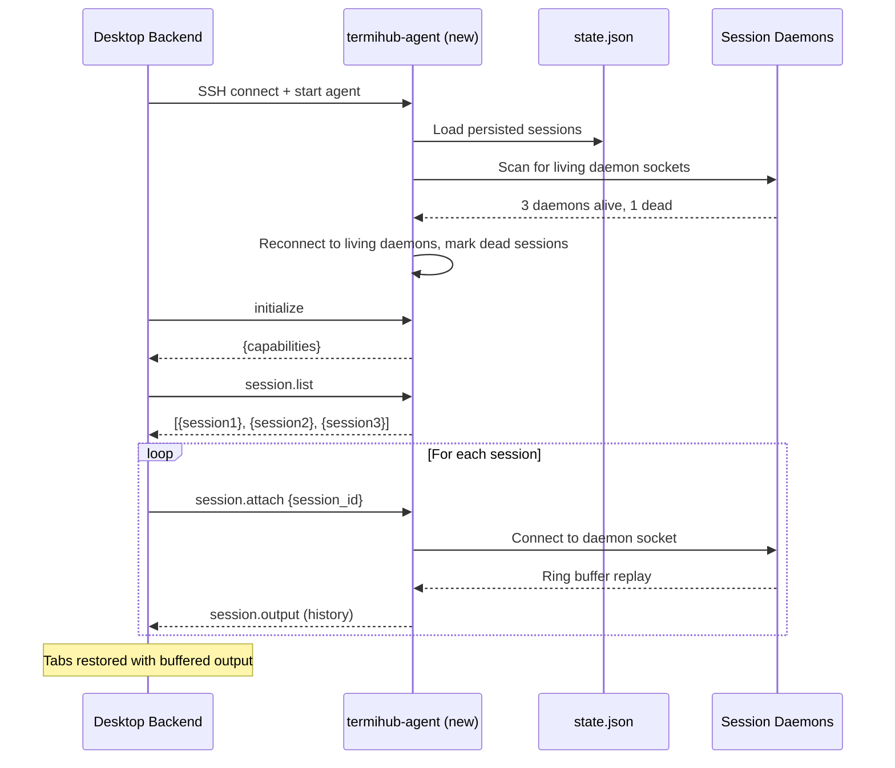

### Agent Update Flow

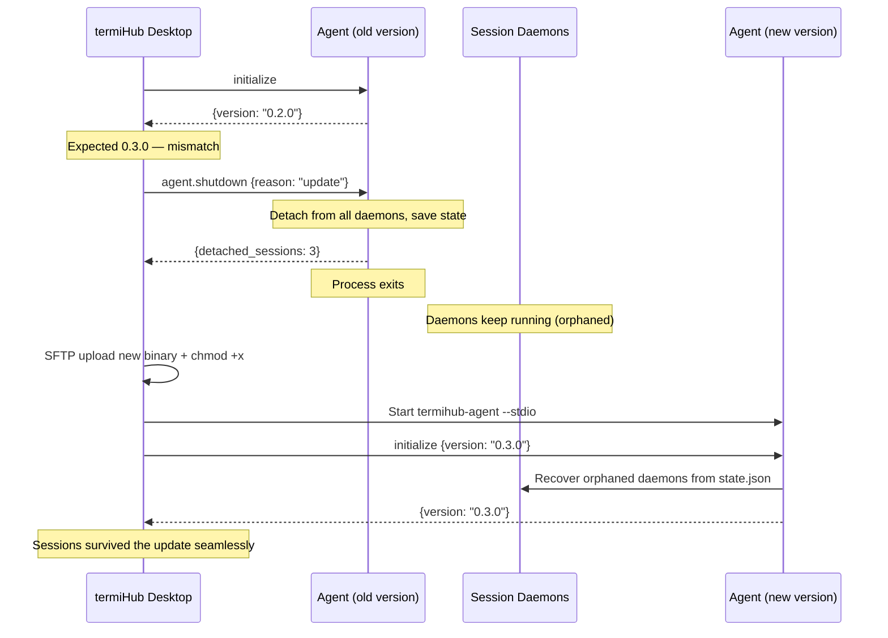

---

## 7. Deployment View

### Desktop Application


| Platform | Architectures | Installer Formats | Min OS Version |
|----------|--------------|-------------------|----------------|
| Windows | x64 | `.msi`, `.exe` | Windows 10 1809+ (ConPTY) |
| Linux | x64, ARM64 | `.deb`, `.AppImage` | WebKitGTK 4.1+ |
| macOS | x64 (Intel), ARM64 (Apple Silicon) | `.dmg` | macOS 10.15+ |

### CI/CD Pipeline

Three GitHub Actions workflows handle the build and release pipeline. See `.github/workflows/` for details.

| Workflow | Trigger | Purpose |
|----------|---------|---------|
| **Code Quality** | Push/PR to `main` | Linting, formatting, type checking, tests (all 3 OSes) |
| **Build** | Push/PR to `main` | Build Tauri app for all platforms |
| **Agent** | Push/PR to `main` | Agent crate formatting, linting, tests, ARM64 cross-compilation |
| **Release** | Tag `v*.*.*` | Create GitHub Release with platform installers |

See [Releasing](releasing.md) for the full release process.

### Development Scripts

The `scripts/` directory provides cross-platform helper scripts (`.sh` + `.cmd` variants) for common tasks: setup, dev server, build, test, format, quality checks, and clean. These mirror the CI checks locally. See [scripts/README.md](../scripts/README.md) for the full list.

### Remote Agent

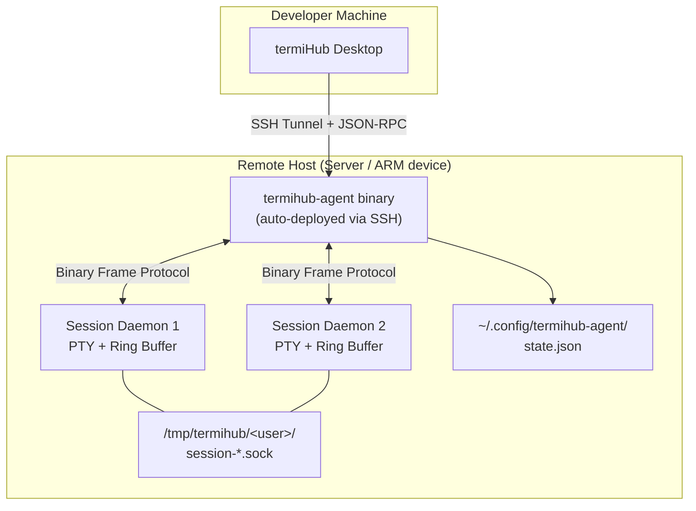

The remote agent is a standalone Rust binary (`termihub-agent`) that runs on remote hosts — build servers, NAS devices, ARM boards, or any Linux/macOS machine. It maintains persistent terminal sessions that survive desktop disconnects and agent restarts. Communication uses JSON-RPC 2.0 over NDJSON through an SSH stdio channel.

**Auto-deployment:** When the desktop connects to a host via SSH, it checks for `termihub-agent --version`. If the agent is missing or version-incompatible, the desktop detects the target architecture via `uname -m`, downloads the matching binary from GitHub Releases (or uses a bundled binary in development), uploads it via SFTP to `~/.local/bin/termihub-agent`, and starts it.

**Agent binary targets:**

| `uname -m` | Target | Use Case |
|-------------|--------|----------|
| `x86_64` | `linux-x86_64` | Linux build servers |
| `aarch64` | `linux-aarch64` | ARM64 servers, Raspberry Pi 4/5 |
| `armv7l` | `linux-armv7` | ARMv7 devices, older Raspberry Pi |
| `arm64` | `darwin-aarch64` | macOS ARM hosts |

**Platform constraint:** The session daemon architecture uses PTY, Unix domain sockets, and POSIX process APIs — it is Unix-only (`#[cfg(unix)]`). Windows agent support would require ConPTY + named pipes.

See [Remote Protocol](remote-protocol.md) for the full protocol specification and [Agent Concept](concepts/agent.md) for the complete design vision.

---

## 8. Cross-cutting Concepts

### Error Handling

**Rust backend:**
- `anyhow::Result<T>` for application code
- `thiserror` for custom error types in library-facing APIs
- Error propagation with `?` operator, context added with `.context("description")`
- No `.unwrap()` in production code — all mutex locks use proper error propagation

**TypeScript frontend:**
- Try-catch around all Tauri IPC calls
- Error display in terminal pane when connections fail (inline, not modal)
- Graceful degradation: a failed terminal doesn't crash the app

### Async Patterns

- **Tokio** runtime for all async operations in Rust
- **Bounded channels** (`sync_channel(64)`) for terminal output with backpressure
- **Output coalescing**: backend reads coalesce pending chunks (up to 32 KB) into a single IPC event
- **Task cancellation**: each terminal session owns its async tasks, cleaned up on close

### IPC Communication

```
Frontend → Backend:  Tauri Commands (request-response, JSON-serialized)
Backend → Frontend:  Tauri Events (push-based, JSON-serialized)
```

- **Commands** for actions: `create_terminal`, `send_input`, `resize_terminal`, `close_terminal`
- **Events** for streaming: `terminal-output` events routed by session ID
- **Singleton dispatcher**: frontend uses O(1) Map-based routing instead of per-terminal global listeners

### State Management

The frontend uses a single **Zustand** store (`src/store/appStore.ts`) managing:

- **Panel layout** — Recursive tree of horizontal/vertical splits with customizable layout (activity bar position, sidebar position, visibility, status bar)
- **Tab state** — Active tab, dirty flags, per-tab colors, CWD tracking
- **Connection/folder persistence** — Saved connections, folder hierarchy, and external connection file references
- **Remote agents** — Agent definitions, connection state (disconnected/connecting/connected/reconnecting), capabilities
- **Sidebar** — Active view, collapsed state
- **SFTP sessions** — File browser state per SSH connection
- **SSH tunnels** — Tunnel definitions, status, and statistics
- **Connection types** — Registry of available `ConnectionTypeInfo` from the backend (schemas, capabilities)
- **Theme** — Active theme (dark/light/system), resolved theme for OS auto-detection
- **Credential store** — Storage mode (keychain/master password/none), lock state

### Terminal Rendering

- **xterm.js** renders to `<canvas>`, not DOM elements
- **`@xterm/addon-fit`** handles terminal resize to fill container
- **`requestAnimationFrame` batching** reduces rendering overhead for high-throughput output
- Canvas rendering makes DOM-based testing impossible; see [Testing Strategy](testing.md)

### Theme System

termiHub supports three theme modes: **Dark** (default, VS Code Dark-inspired), **Light** (VS Code Light-inspired), and **System** (auto-detects OS `prefers-color-scheme`).

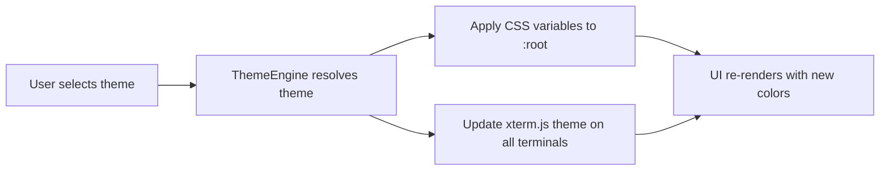

The theme engine writes CSS custom properties directly to `:root` via JavaScript — no separate CSS files per theme. When "System" is selected, a `matchMedia` listener auto-switches between Dark and Light when the OS preference changes. The activity bar stays dark in all themes (VS Code convention).

### Schema-Driven Connection Settings

Connection types declare their configuration fields as a `SettingsSchema` — groups of typed fields with labels, defaults, validation rules, and conditional visibility. The frontend renders these schemas generically using the `DynamicField` component, requiring zero knowledge of any specific connection type.

```mermaid
flowchart LR
    subgraph Backend
        CT["ConnectionType impl"] --> SCH["settings_schema()"]
        SCH --> REG["ConnectionTypeRegistry"]
    end
    subgraph Frontend
        REG -->|"Tauri command:<br/>list_connection_types"| STORE["Zustand Store"]
        STORE --> CSF["ConnectionSettingsForm"]
        CSF --> DF["DynamicField<br/>(renders per FieldType)"]
    end
```

Supported field types: `text`, `password`, `number`, `boolean`, `select` (dropdown), `port`, `filePath` (with file picker), `keyValueList` (for env vars), `objectList` (for volume mounts). Fields can declare conditional visibility (`visibleWhen`) — for example, "show Key Path only when Auth Method is 'key'".

### Credential Storage

termiHub provides optional credential encryption with three storage modes:

- **Platform Keychain** — Uses the OS credential store (macOS Keychain, Windows Credential Manager, Linux Secret Service via `keyring` crate)
- **Master Password** — Encrypts credentials with a user-chosen master password, stored in a portable encrypted file
- **None** — Passwords are prompted at connection time and never persisted (the default for new installations)

All modes support auto-lock after a configurable timeout. Credential storage is managed through the Security section in Settings.

---

## 9. Architecture Decisions

### ADR-1: React over Svelte

**Context:** Choosing a frontend framework for a complex desktop UI with drag-and-drop, split views, and terminal rendering.

**Decision:** React 18 with TypeScript.

**Rationale:**
- Mature ecosystem with production-ready libraries (dnd-kit, react-resizable-panels, react-virtuoso)
- Better tooling for complex drag-and-drop interactions
- Larger community and more examples for AI-assisted development
- Better knowledge base for Claude Code contributions

**Trade-off:** Larger bundle size and more boilerplate compared to Svelte.

### ADR-2: Tauri over Electron

**Context:** Choosing a desktop application framework for a cross-platform terminal hub.

**Decision:** Tauri 2.x with Rust backend.

**Rationale:**
- ~5 MB binary vs Electron's ~100 MB
- Lower memory footprint (single WebView vs bundled Chromium)
- Rust backend provides memory safety and native performance
- Native system integration (serial ports, PTY, file system)

**Trade-off:** Smaller ecosystem than Electron, platform-specific WebView rendering differences.

### ADR-3: Trait-Based Backend (Original)

**Context:** Supporting multiple terminal types (PTY, serial, SSH, telnet, remote agent) with a unified management interface.

**Decision:** Rust `TerminalBackend` trait with one implementation per terminal type.

**Rationale:**
- Adding new terminal types requires only implementing the trait
- `TerminalManager` manages all types through a single `Box<dyn TerminalBackend>`
- Future remote backend can be added without modifying existing code
- Enables mock implementations for testing

**Status:** Superseded by [ADR-7](#adr-7-connectiontype-trait-and-registry) which moves the trait into `termihub-core` as `ConnectionType` with schema-driven settings and a runtime registry. The desktop-side `TerminalBackend` trait still exists as a thin wrapper but all new backends implement `ConnectionType` directly in core.

### ADR-4: Zustand for State Management

**Context:** Managing complex frontend state (panel trees, tabs, connections, file browser) in a React application.

**Decision:** Zustand with a single store.

**Rationale:**
- Minimal boilerplate (no providers, reducers, or action creators)
- Excellent TypeScript support
- Single store simplifies state access and debugging
- No context provider wrappers needed

### ADR-5: E2E System Tests Run in Docker (Linux Only)

**Context:** Tauri's `tauri-driver` (the WebDriver proxy for E2E tests) only supports Linux (WebKitGTK) and Windows (Edge WebView2). On macOS, it prints "not supported on this platform" and exits because Apple provides no WKWebView driver — `safaridriver` only controls Safari the browser, not WKWebView instances embedded in apps. This is a known Tauri limitation ([tauri-apps/tauri#7068](https://github.com/tauri-apps/tauri/issues/7068)) with no upstream fix expected.

**Decision:** Run E2E system tests inside a Docker container with a Linux environment (Xvfb + WebKitGTK + WebKitWebDriver + tauri-driver). This allows developers on macOS to run the full E2E suite locally via `./scripts/test-system.sh` without needing a CI service.

**Rationale:**

- Docker is already used for test infrastructure (SSH/Telnet servers, virtual serial ports)
- Runs locally without external cloud services or CI
- Tests the Linux build of the app, which shares the same React UI and Rust backend logic
- Developers on Linux can also run E2E tests natively without Docker

**Trade-off:** Tests run against the Linux build, not the native macOS build. macOS-specific rendering behavior (WKWebView quirks) must be verified via manual testing. See [Manual Testing](manual-testing.md).

**Future consideration:** The experimental [danielraffel/tauri-webdriver](https://github.com/danielraffel/tauri-webdriver) project (Feb 2026) provides a WKWebView WebDriver via a Tauri plugin. If it matures, it could enable native macOS E2E testing without Docker. Evaluate periodically.

### ADR-6: Credential Storage (Evolved)

**Context:** SSH connections require authentication credentials. The original decision (Phase 1) was to prompt for passwords at connection time and never persist them. As the project matured, a credential storage system was implemented.

**Decision:** Provide three credential storage modes — platform keychain, master password encryption, and no storage (prompt-only). The user chooses their mode in Security settings.

**Rationale:**
- Platform keychains (macOS Keychain, Windows Credential Manager, Linux Secret Service) are the most secure option for single-machine use
- Master password mode provides portability for users who sync settings across machines
- No-storage mode preserves the original Phase 1 behavior for users who prefer it
- Key-based authentication (recommended) doesn't require password storage regardless of mode
- Auto-lock timeout adds an additional security layer

**Trade-off:** Master password mode requires the user to remember a master password. If lost, stored credentials are unrecoverable.

### ADR-7: ConnectionType Trait and Registry

**Context:** The original `TerminalBackend` trait (ADR-3) lived in the desktop crate, and each connection type was implemented independently in both the desktop and agent, leading to deep duplication. The [Shared Rust Core concept](concepts/shared-rust-core.md) identified that both crates implement the same session lifecycle with the only difference being the transport layer. Additionally, adding a new connection type required frontend changes — adding a variant to the `ConnectionConfig` enum, writing a type-specific settings component, and updating connection type checks throughout the UI.

**Decision:** Define a `ConnectionType` async trait in `termihub-core` that all backends implement, paired with a `ConnectionTypeRegistry` for runtime discovery and a `SettingsSchema` system for dynamic UI form generation. Connection types declare their settings, capabilities, and lifecycle in core; both the desktop and agent register the same implementations from core at startup.

```mermaid
flowchart LR
    subgraph "Before: Duplicated + Hardcoded"
        D1["Desktop: TerminalBackend trait<br/>+ 5 implementations"]
        A1["Agent: independent<br/>5 implementations"]
        F1["Frontend: ConnectionConfig enum<br/>+ type-specific components"]
    end

    subgraph "After: Shared + Schema-Driven"
        CORE["Core: ConnectionType trait<br/>+ 6 implementations<br/>+ SettingsSchema"]
        D2["Desktop: thin registry wrapper"]
        A2["Agent: thin registry wrapper"]
        F2["Frontend: generic DynamicField<br/>+ ConnectionSettingsForm"]
    end

    D1 -.->|"~5000 LOC duplicated"| A1
    CORE --> D2
    CORE --> A2
    CORE --> F2
```

**Rationale:**
- **Single source of truth** — backend logic lives in one place; a bug fix in core fixes it for both desktop and agent
- **Zero-touch frontend** — new connection types are discovered via the registry and rendered via schemas; no frontend code changes needed
- **Capabilities-driven UI** — the frontend shows monitoring panels, file browser tabs, and resize handles based on the `Capabilities` struct, not hardcoded type checks
- **Feature-gated compilation** — each backend is behind a cargo feature flag (`local-shell`, `ssh`, `serial`, `telnet`, `docker`, `wsl`), so consumers only compile what they need
- **Factory pattern** — the registry creates fresh, unconnected instances via factory functions; connection state is isolated per session

**Trade-off:** The `ConnectionType` trait is async (`#[async_trait]`), which adds a small runtime cost. The trait is object-safe (`Box<dyn ConnectionType>`), requiring dynamic dispatch for method calls — acceptable given that terminal I/O throughput is not bottlenecked by dispatch overhead.

### ADR-8: Schema-Driven Connection Settings

**Context:** The original connection editor had hardcoded form components for each connection type (`SshSettingsForm`, `SerialSettingsForm`, etc.). Adding a new connection type required writing a new React component and wiring it into the editor with type checks. The generic `ConnectionConfig` (ADR-7) made the backend type-agnostic, but the frontend still needed to know how to render each type's settings.

**Decision:** Each `ConnectionType` declares a `SettingsSchema` — an ordered list of field groups, where each field specifies its type (`text`, `password`, `number`, `boolean`, `select`, `port`, `filePath`, `keyValueList`, `objectList`), label, default value, placeholder, validation rules, and conditional visibility. The frontend renders this schema with a generic `DynamicField` component.

**Rationale:**
- New connection types render automatically without any frontend changes
- Conditional visibility (`visibleWhen`) handles dependent fields (e.g., show "Key Path" only when "Auth Method" is "key")
- Supports environment variable expansion (`${env:VAR}`) and tilde expansion markers per field
- The schema is serializable as JSON — enables remote agents to report their available types and schemas to the desktop
- Plugin-provided connection types (future) can declare schemas without shipping frontend code

**Trade-off:** Schema-driven forms are less flexible than custom components for highly specialized UIs. If a connection type needs truly custom UI (e.g., an interactive terminal preview), the schema system would need extension points.

### ADR-9: Generic ConnectionConfig

**Context:** The stored `ConnectionConfig` was originally a Rust enum with one variant per connection type and a TypeScript discriminated union mirroring it. Every new connection type required adding a variant to both the Rust enum and TypeScript union, updating serialization, and modifying all match/switch statements.

**Decision:** Replace the enum with a generic struct: `{type: string, config: Record<string, unknown>}` in TypeScript and `ConnectionConfig { type_id: String, settings: serde_json::Value }` in Rust. The `type` field identifies the connection type (matching a registry entry), and `config` holds the type-specific settings as an opaque JSON object.

**Rationale:**
- Adding a new connection type requires zero changes to the config format
- Existing connection files remain backward-compatible (migration reads old enum variants and converts to generic format)
- The settings JSON is validated against the `SettingsSchema` at connect time, not at storage time — this allows storing partially-configured connections
- External connection files and plugin-provided types work without schema changes

**Trade-off:** Loss of compile-time type safety for connection settings. The settings are `serde_json::Value` / `Record<string, unknown>` rather than strongly-typed structs. Validation happens at runtime via the schema, not at compile time.

---

## 10. Quality Requirements

### Quality Requirements Overview

```mermaid
graph TD
    Q[Quality Goals]
    Q --> P[Performance]
    Q --> R[Reliability]
    Q --> X[Cross-Platform]
    Q --> E[Extensibility]
    Q --> U[Usability]

    P --> P1[40 concurrent terminals]
    P --> P2[Low memory per session]
    P --> P3[Responsive UI under load]

    R --> R1[Graceful disconnection handling]
    R --> R2[Session cleanup on close]
    R --> R3[No crash on backend errors]

    X --> X1[Windows + Linux + macOS]
    X --> X2[Platform-specific shell detection]
    X --> X3[Native serial/PTY support]

    E --> E1[New backends via ConnectionType trait + registry]
    E --> E2[Schema-driven settings — zero frontend changes]
    E --> E3[Plugin-friendly architecture]

    U --> U1[VS Code-familiar layout]
    U --> U2[Keyboard shortcuts]
    U --> U3[Drag-and-drop everywhere]
```

### Quality Scenarios

| Scenario | Quality | Stimulus | Response | Measure |
|----------|---------|----------|----------|---------|
| High terminal count | Performance | User opens 40 terminals | All terminals remain responsive | UI interaction latency < 100ms |
| Connection failure | Reliability | SSH server becomes unreachable | Error shown in terminal, app stays stable | No crash, clear error message |
| New protocol | Extensibility | Developer adds WebSocket backend | Implement `ConnectionType` trait in core, register in registry — no frontend changes needed | 1 new file + 1 registration line; 0 existing files modified |
| Cross-platform use | Portability | User runs on Linux after using on Windows | Same features and behavior | All connection types available |
| First-time user | Usability | User familiar with VS Code opens termiHub | Can create and manage terminals | No documentation needed for basic use |

---

## 11. Risks and Technical Debts

| Risk / Debt | Description | Mitigation |
|-------------|-------------|------------|
| **Runtime type safety for connection settings** | `ConnectionConfig` stores settings as `serde_json::Value` / `Record<string, unknown>` — no compile-time type checking for connection-specific fields | Schema-based validation at connect time; strongly-typed config structs inside each `ConnectionType::connect()` implementation deserialize and validate |
| **ConPTY dependency** | Windows PTY requires Windows 10 1809+ | Document minimum version; fail gracefully on older Windows |
| **xterm.js canvas testing** | Terminal renders to `<canvas>`, invisible to DOM-based test tools | Manual testing plan ([manual-testing.md](manual-testing.md)); E2E tests cover surrounding UI |
| **WebView rendering differences** | Tauri uses platform WebView (Edge/WebKitGTK/WebKit) with subtle CSS differences | CI builds on all 3 OSes; test matrix for visual regression |
| **libssh2 limitations** | `ssh2` crate wraps libssh2 which has occasional compatibility issues with newer SSH servers | Monitor upstream issues; consider `russh` migration if needed |
| **Single-threaded IPC** | Tauri commands run on the main thread by default | Heavy operations use `tauri::async_runtime::spawn` |
| **Session limit** | Hard cap at 50 concurrent terminals (desktop), 20 concurrent sessions (agent) | Sufficient for target use case; can be raised if needed |
| **No automated cross-platform tests for serial** | Serial tests require physical hardware | Docker-based virtual serial via socat in `examples/` |
| **No native macOS E2E tests** | `tauri-driver` does not support macOS (no WKWebView driver exists); E2E tests run in Docker against the Linux build | Manual testing for macOS-specific behavior; evaluate [danielraffel/tauri-webdriver](https://github.com/danielraffel/tauri-webdriver) as it matures (see ADR-5) |
| **Agent Unix-only daemon architecture** | Session daemons use PTY, Unix domain sockets, and POSIX process APIs — no Windows agent support | Agent targets are Linux/macOS remote hosts; Windows agent would require ConPTY + named pipes |
| **Agent state.json not crash-safe** | Agent state is persisted as plain JSON; a crash mid-write could corrupt the file | Acceptable trade-off — daemon sockets provide independent recovery path even if state.json is lost |
| **Schema-driven forms less flexible** | Schema-driven `DynamicField` cannot handle truly custom UI layouts (e.g., interactive previews, connection test buttons embedded in the form) | Sufficient for all current connection types; extension points can be added if a future type requires custom UI |

---

## 12. Glossary

| Term | Definition |
|------|-----------|
| **PTY** | Pseudo-terminal — a virtual terminal device that provides a bidirectional communication channel, used to run shell processes |
| **ConPTY** | Windows Console Pseudo Terminal — Windows 10's pseudo-terminal API (available since build 1809) |
| **forkpty** | Unix system call that creates a new process with a pseudo-terminal attached |
| **SFTP** | SSH File Transfer Protocol — secure file transfer over an SSH connection |
| **IPC** | Inter-Process Communication — the mechanism Tauri uses for frontend-backend communication |
| **JSON-RPC** | JSON-based Remote Procedure Call protocol — used for desktop-to-agent communication |
| **NDJSON** | Newline-Delimited JSON — the framing format used for JSON-RPC messages between desktop and agent over SSH stdio |
| **IAC** | Interpret As Command — Telnet protocol escape sequence for control commands |
| **xterm.js** | Open-source terminal emulator component that renders to HTML5 canvas |
| **Tauri Command** | A Rust function exposed to the frontend via Tauri's IPC bridge (request-response pattern) |
| **Tauri Event** | A push-based message from backend to frontend via Tauri's event system |
| **Zustand** | Lightweight React state management library using hooks |
| **dnd-kit** | React drag-and-drop toolkit used for tab reordering and panel splitting |
| **WebView** | Platform-native web rendering component (Edge WebView2 on Windows, WebKitGTK on Linux, WebKit on macOS) |
| **Session Daemon** | Independent process (`termihub-agent --daemon <id>`) that manages a single PTY session, surviving agent restarts via Unix domain socket reconnection |
| **Binary Frame Protocol** | Length-prefixed IPC protocol (`[type: 1B][length: 4B BE][payload]`) used between the agent and session daemons over Unix domain sockets |
| **Ring Buffer** | Fixed-size circular buffer (1 MiB default) used by session daemons and the serial backend to store terminal output for replay on client attach |
| **Backpressure** | Flow control mechanism where bounded channels prevent fast producers from overwhelming slow consumers |
| **ConnectionType** | Unified async trait in `termihub-core` that all connection backends implement — defines lifecycle (connect/disconnect), terminal I/O (write/resize/output), settings schema, and capabilities |
| **ConnectionTypeRegistry** | Runtime registry where connection backends register factory functions at startup; provides discovery (`available_types()`) and creation (`create()`) for both desktop and agent |
| **SettingsSchema** | Declarative description of a connection type's configuration fields — groups of typed fields with labels, defaults, validation, and conditional visibility; rendered generically by the frontend |
| **ConnectionConfig** | Generic connection configuration format: `{type: string, config: Record<string, unknown>}` — type-agnostic storage that works with any registered connection type |
| **DynamicField** | React component that renders a single `SettingsField` based on its `FieldType` (text input, checkbox, dropdown, file picker, etc.) without knowledge of the connection type |
| **SSH Tunnel** | Encrypted port-forwarding channel over an SSH connection — supports local (listen locally, forward to remote), remote (listen on remote, forward to local), and dynamic (SOCKS5 proxy) modes |
| **SOCKS5** | Network proxy protocol used by SSH dynamic tunnels — applications route traffic through the SOCKS5 proxy, which forwards it over the SSH connection |
| **WSL** | Windows Subsystem for Linux — allows running Linux distributions natively on Windows; termiHub connects via `wsl.exe` to WSL distributions as a connection type |
| **Docker** | Container runtime; termiHub can connect to running Docker containers or start new ones as a connection type, executing shells inside the container environment |
| **Theme Engine** | Frontend subsystem that resolves the active theme (dark/light/system), applies CSS custom properties to `:root`, and live-updates xterm.js terminal colors |
| **Monaco Editor** | VS Code's code editor component, embedded in termiHub for editing local and remote files with syntax highlighting |
| **Credential Store** | Optional subsystem for persisting connection passwords — supports platform keychain, master password encryption, or no-storage (prompt-only) modes |
| **Layout Presets** | Pre-defined UI configurations (default, focus, zen) that control activity bar position, sidebar visibility, and status bar visibility |

---

*This document follows the [arc42](https://arc42.org) template. For contribution guidelines, see [Contributing](contributing.md). For testing details, see [Testing Strategy](testing.md).*
