# termiHub Architecture Documentation

> Based on the [arc42](https://arc42.org) template for software architecture documentation.

---

## Table of Contents

1. [Introduction and Goals](#1-introduction-and-goals)
2. [Architecture Constraints](#2-architecture-constraints)
3. [Context and Scope](#3-context-and-scope)
4. [Solution Strategy](#4-solution-strategy)
5. [Building Block View](#5-building-block-view)
6. [Runtime View](#6-runtime-view)
7. [Deployment View](#7-deployment-view)
8. [Cross-cutting Concepts](#8-cross-cutting-concepts)
9. [Architecture Decisions](#9-architecture-decisions)
10. [Quality Requirements](#10-quality-requirements)
11. [Risks and Technical Debts](#11-risks-and-technical-debts)
12. [Glossary](#12-glossary)

---

## 1. Introduction and Goals

### Requirements Overview

**termiHub** is a modern, cross-platform terminal hub for managing multiple terminal connections. It provides a VS Code-like interface with support for split views, drag-and-drop tabs, and organized connection management.

**Core capabilities:**

- **Multiple terminal types** — Local shells (zsh, bash, cmd, PowerShell, Git Bash), SSH, Telnet, Serial, Docker, and WSL (Windows Subsystem for Linux)
- **VS Code-inspired UI** — Activity bar, sidebar, split view support with customizable layout (presets: default, focus, zen)
- **Drag-and-drop tab management** — Up to 40 concurrent terminals with per-tab color coding
- **Connection organization** — Folder hierarchies with import/export and external connection file support
- **SSH file browser** — Browse, upload, download, and edit remote files via SFTP
- **SSH tunneling** — Local, remote, and dynamic (SOCKS5) port forwarding with visual tunnel editor
- **Built-in editor** — Edit local and remote files with syntax highlighting (Monaco Editor)
- **Theme system** — Dark, Light, and System (auto-detect OS preference) themes
- **X11 forwarding** — Forward remote GUI applications to local X server
- **Session persistence** — Remote agent sessions survive disconnects and agent restarts via daemon architecture
- **Schema-driven connection settings** — Connection types declare their configuration as schemas; the UI renders forms dynamically without hardcoded knowledge of any backend
- **Cross-platform** — Windows, Linux, macOS

**Example use case:** A developer uses local shells for builds, serial connections to interface with hardware, remote agents on headless servers for persistent sessions, SSH tunnels to expose remote services, and SFTP for seamless file transfer — all from a single window.

### Quality Goals

| Priority | Quality Goal   | Description                                                 |
| -------- | -------------- | ----------------------------------------------------------- |
| 1        | Cross-platform | Run identically on Windows, Linux, and macOS                |
| 2        | Performance    | Support 40 concurrent terminals without degradation         |
| 3        | Extensibility  | Add new terminal types with minimal code changes            |
| 4        | Reliability    | Handle disconnections, reconnections, and errors gracefully |
| 5        | Usability      | VS Code-familiar interface with minimal learning curve      |

### Stakeholders

| Role                            | Contact                 | Expectations                                                                  |
| ------------------------------- | ----------------------- | ----------------------------------------------------------------------------- |
| Creator / Lead Developer        | Arne Maximilian Richter | Full-featured terminal hub for multi-protocol workflows                       |
| Developers / DevOps / Sysadmins | (Target users)          | Reliable multi-protocol terminal with organized connections and file transfer |
| Contributors                    | (Open source)           | Clear architecture, coding standards, and contribution workflow               |

---

## 2. Architecture Constraints

### Technical Constraints

| Constraint                             | Rationale                                                                                                   |
| -------------------------------------- | ----------------------------------------------------------------------------------------------------------- |
| **Tauri 2.x** as application framework | Small binary (~5 MB vs Electron's ~100 MB), lower memory footprint, Rust backend for performance and safety |
| **React 18 + TypeScript** for frontend | Mature ecosystem, best-in-class drag-and-drop (dnd-kit) and split view (react-resizable-panels) libraries   |
| **Rust** for backend                   | Memory safety, cross-platform PTY/serial/SSH support, async I/O via tokio                                   |
| **Windows 10 1809+** minimum           | Required for ConPTY (Windows pseudo-terminal) support                                                       |
| **Credential storage optional**        | Master-password encryption available but optional; SSH passwords can be prompted at connection time         |

### Organizational Constraints

| Constraint                   | Rationale                                                     |
| ---------------------------- | ------------------------------------------------------------- |
| Single developer (initially) | Architecture must be simple enough for one person to maintain |
| MIT License                  | Permissive open-source for broad adoption                     |
| GitHub-based workflow        | Issues, PRs, Actions for CI/CD                                |

### Convention Constraints

| Constraint           | Detail                                                                                                               |
| -------------------- | -------------------------------------------------------------------------------------------------------------------- |
| Conventional Commits | All commit messages follow the `type(scope): subject` format                                                         |
| Keep a Changelog     | User-facing changes recorded as per-branch fragments in `docs/changes/`, consolidated into `CHANGELOG.md` at release |
| Merge commits only   | No squash or rebase merges — preserve full commit history                                                            |

---

## 3. Context and Scope

### Business Context

The following diagram shows termiHub in its operational environment — a developer interacting with multiple systems simultaneously.

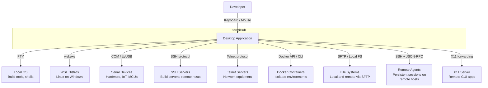
```mermaid
graph TB
    DEV[Developer]

    subgraph "termiHub"
        APP[Desktop Application]
    end

    LOCAL[Local OS<br/>Build tools, shells]
    WSL_ENV[WSL Distros<br/>Linux on Windows]
    SERIAL[Serial Devices<br/>Hardware, IoT, MCUs]
    SSH_HOST[SSH Servers<br/>Build servers, remote hosts]
    TELNET_HOST[Telnet Servers<br/>Network equipment]
    DOCKER[Docker Containers<br/>Isolated environments]
    FS[File Systems<br/>Local and remote via SFTP]
    AGENT[Remote Agents<br/>Persistent sessions on<br/>remote hosts]
    X11[X11 Server<br/>Remote GUI apps]

    DEV -->|Keyboard / Mouse| APP
    APP -->|PTY| LOCAL
    APP -->|wsl.exe| WSL_ENV
    APP -->|COM / ttyUSB| SERIAL
    APP -->|SSH protocol| SSH_HOST
    APP -->|Telnet protocol| TELNET_HOST
    APP -->|Docker API / CLI| DOCKER
    APP -->|SFTP / Local FS| FS
    APP -->|SSH + JSON-RPC| AGENT
    APP -->|X11 forwarding| X11
```

| Partner               | Description                                                                                                                                   |
| --------------------- | --------------------------------------------------------------------------------------------------------------------------------------------- |
| **Developer**         | Primary user interacting via keyboard and mouse                                                                                               |
| **Local OS**          | Host operating system providing shells (bash, zsh, PowerShell, cmd, Git Bash) via PTY                                                         |
| **WSL Distros**       | Windows Subsystem for Linux distributions accessible on Windows hosts                                                                         |
| **Serial Devices**    | Hardware connected via USB-to-serial adapters (IoT devices, networking equipment, microcontrollers)                                           |
| **SSH Servers**       | Remote machines (build servers, cloud instances, ARM devices) accessed over SSH; also used for tunneling and X11 forwarding                   |
| **Telnet Servers**    | Legacy network equipment accessed via Telnet                                                                                                  |
| **Docker Containers** | Isolated container environments for development, testing, and CI workflows                                                                    |
| **File Systems**      | Local and remote file systems for browsing and transfer                                                                                       |
| **Remote Agents**     | Remote machines running `termihub-agent` for persistent shell sessions, serial proxy, Docker containers, file browsing, and system monitoring |
| **X11 Server**        | Local X display server (XQuartz on macOS, native on Linux) for remote GUI application forwarding                                              |

### Technical Context

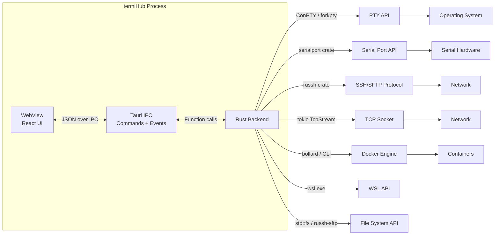
```mermaid
graph LR
    subgraph "termiHub Process"
        WV[WebView<br/>React UI]
        IPC[Tauri IPC<br/>Commands + Events]
        RUST[Rust Backend]
    end

    WV <-->|JSON over IPC| IPC
    IPC <-->|Function calls| RUST

    RUST -->|ConPTY / forkpty| PTY[PTY API]
    RUST -->|serialport crate| SERIAL_API[Serial Port API]
    RUST -->|russh crate| SSH_API[SSH/SFTP Protocol]
    RUST -->|tokio TcpStream| TELNET_API[TCP Socket]
    RUST -->|bollard / CLI| DOCKER_API[Docker Engine]
    RUST -->|wsl.exe| WSL_API[WSL API]
    RUST -->|std::fs / russh-sftp| FS_API[File System API]

    PTY --> OS[Operating System]
    SERIAL_API --> HW[Serial Hardware]
    SSH_API --> NET1[Network]
    TELNET_API --> NET2[Network]
    DOCKER_API --> CONTAINERS[Containers]
```

| Channel            | Technology                                                | Format                             |
| ------------------ | --------------------------------------------------------- | ---------------------------------- |
| Frontend ↔ Backend | Tauri IPC (commands + events)                             | JSON-serialized Rust structs       |
| Backend → PTY      | `portable-pty` crate (ConPTY on Windows, forkpty on Unix) | Raw bytes                          |
| Backend → Serial   | `serialport` crate                                        | Raw bytes                          |
| Backend → SSH      | `russh` crate (pure-Rust)                                 | SSH protocol (encrypted)           |
| Backend → Telnet   | `tokio::net::TcpStream`                                   | Telnet protocol (IAC, NAWS, TTYPE) |
| Backend → Docker   | `bollard` crate (Docker Engine API) or Docker CLI         | Raw bytes via PTY/exec             |
| Backend → WSL      | `wsl.exe` invocation (Windows only)                       | Raw bytes via PTY                  |
| Backend → FTP      | `suppaftp` crate (async, `async-rustls` TLS)              | FTP/FTPS control + data channels   |
| Backend → Files    | `std::fs` (local) / `russh-sftp` (remote)                 | File I/O                           |

---

## 4. Solution Strategy

| Decision              | Choice                                | Rationale                                                                                                                                                                                                            |
| --------------------- | ------------------------------------- | -------------------------------------------------------------------------------------------------------------------------------------------------------------------------------------------------------------------- |
| Application framework | **Tauri 2** over Electron             | ~5 MB binary (vs ~100 MB), lower memory, Rust backend, native system integration                                                                                                                                     |
| Frontend framework    | **React 18** over Svelte              | Larger ecosystem, mature dnd-kit and react-resizable-panels libraries, better AI-assisted development support                                                                                                        |
| State management      | **Zustand**                           | Minimal boilerplate, single store, no provider wrappers, good TypeScript support                                                                                                                                     |
| Backend language      | **Rust**                              | Memory safety, cross-platform PTY/serial/SSH, async I/O with tokio                                                                                                                                                   |
| Terminal rendering    | **xterm.js**                          | Industry-standard terminal emulator, canvas-based rendering, add-on ecosystem                                                                                                                                        |
| Code editor           | **Monaco Editor**                     | VS Code's editor component — syntax highlighting, language detection, find/replace for local and remote file editing                                                                                                 |
| Backend extensibility | **`ConnectionType` trait + registry** | Schema-driven connection types in `termihub-core` — each backend declares its settings schema, capabilities, and lifecycle; the UI renders forms dynamically (see [ADR-7](#adr-7-connectiontype-trait-and-registry)) |
| IPC pattern           | **Commands + Events**                 | Commands for request-response (create terminal, send input), events for streaming (terminal output)                                                                                                                  |
| Connection storage    | **JSON files with generic config**    | Connections stored as `{type, config}` pairs where config is a type-specific JSON object; schemas define validation                                                                                                  |
| Credential handling   | **Optional credential store**         | Master password encryption (Argon2id key derivation + AES-256-GCM), native OS keychain (macOS Keychain / Windows Credential Manager / Linux Secret Service via the `keyring` crate), or no-storage (prompt-only)     |

---

## 5. Building Block View

### Level 1: System Overview

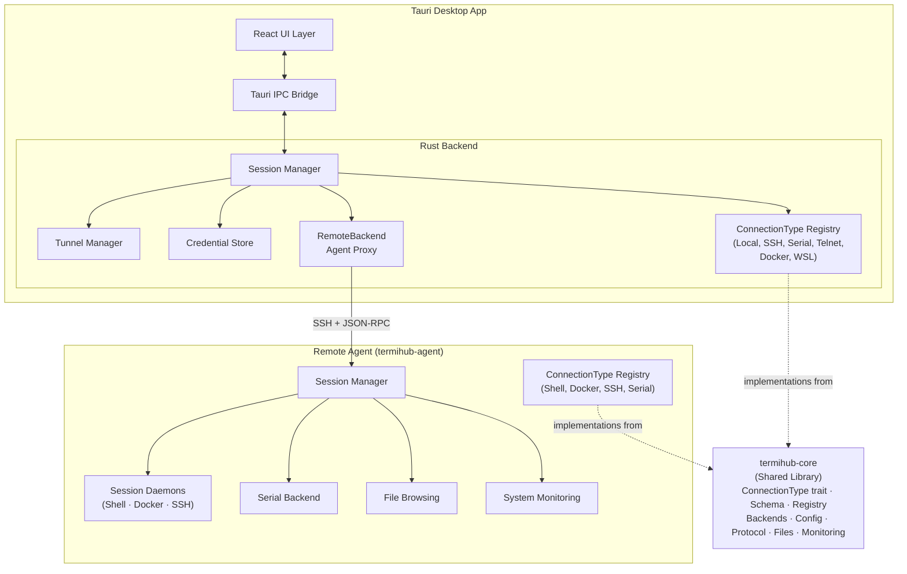
```mermaid
graph TB
    subgraph "Tauri Desktop App"
        UI[React UI Layer]
        IPC[Tauri IPC Bridge]

        subgraph "Rust Backend"
            SM_D[Session Manager]
            TUNNEL[Tunnel Manager]
            CRED[Credential Store]
            REG_D["ConnectionType Registry<br/>(Local, SSH, Serial, Telnet,<br/>Docker, WSL)"]
            RB[RemoteBackend<br/>Agent Proxy]
        end
    end

    CORE["termihub-core<br/>(Shared Library)<br/>ConnectionType trait · Schema · Registry<br/>Backends · Config · Protocol · Files · Monitoring"]

    subgraph "Remote Agent (termihub-agent)"
        SM_A[Session Manager]
        REG_A["ConnectionType Registry<br/>(Shell, Docker, SSH, Serial)"]
        SM_A --> DAEMONS["Session Daemons<br/>(Shell · Docker · SSH)"]
        SM_A --> SERIAL_B[Serial Backend]
        SM_A --> FILES[File Browsing]
        SM_A --> MON[System Monitoring]
    end

    UI <--> IPC
    IPC <--> SM_D
    SM_D --> REG_D
    SM_D --> RB
    SM_D --> TUNNEL
    SM_D --> CRED

    RB -->|SSH + JSON-RPC| SM_A

    REG_D -.->|implementations from| CORE
    REG_A -.->|implementations from| CORE
```

**Contained building blocks:**

| Building Block                  | Description                                                                                                                                                                                                                                                                                                                                                              |
| ------------------------------- | ------------------------------------------------------------------------------------------------------------------------------------------------------------------------------------------------------------------------------------------------------------------------------------------------------------------------------------------------------------------------ |
| **React UI Layer**              | Frontend application rendered in Tauri's WebView with schema-driven connection forms, theme engine, tunnel editor, and customizable layout                                                                                                                                                                                                                               |
| **Tauri IPC Bridge**            | Bidirectional communication layer between frontend and backend                                                                                                                                                                                                                                                                                                           |
| **Session Manager**             | Orchestrates terminal session lifecycle using the `ConnectionType` registry — creates, routes I/O, and cleans up sessions for all connection types                                                                                                                                                                                                                       |
| **ConnectionType Registry**     | Runtime registry of available connection types. Each type is a `ConnectionType` trait implementation registered at startup with its settings schema, capabilities, and factory function. Both desktop and agent maintain their own registries populated from `termihub-core` backends.                                                                                   |
| **Tunnel Manager**              | Manages SSH port forwarding tunnels (local, remote, dynamic SOCKS5) with auto-start, status tracking, and persistence                                                                                                                                                                                                                                                    |
| **Credential Store**            | Optional encrypted credential storage via master password (Argon2id + AES-256-GCM), with auto-lock timeout                                                                                                                                                                                                                                                               |
| **RemoteBackend**               | Proxy to remote agent instances — forwards I/O as JSON-RPC over SSH                                                                                                                                                                                                                                                                                                      |
| **Shared Core (termihub-core)** | Shared Rust library containing the `ConnectionType` trait, `ConnectionTypeRegistry`, settings schema system, concrete backend implementations (local shell, SSH, serial, telnet, Docker, WSL), config types, error types, protocol types, session helpers, file operations, monitoring parsers, transport traits, and output processing — used by both desktop and agent |
| **Remote Agent**                | Standalone binary (`termihub-agent`) for persistent remote sessions, file browsing, and system monitoring. Dispatches JSON-RPC requests via [`jsonrpsee`](https://crates.io/crates/jsonrpsee) `RpcModule`, delegating to the core `ConnectionType` registry. See [Remote Protocol](remote-protocol.md) for the protocol specification.                                   |

### Level 2: Frontend Components

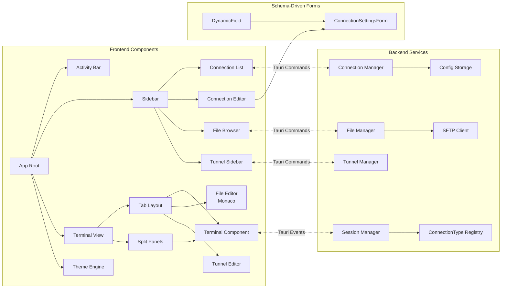
```mermaid
graph LR
    subgraph "Frontend Components"
        APP[App Root]
        AB[Activity Bar]
        SB[Sidebar]
        TV[Terminal View]

        APP --> AB
        APP --> SB
        APP --> TV
        APP --> THEME[Theme Engine]

        SB --> CL[Connection List]
        SB --> CE[Connection Editor]
        SB --> FB[File Browser]
        SB --> TS[Tunnel Sidebar]

        TV --> TL[Tab Layout]
        TV --> SP[Split Panels]

        TL --> TERM[Terminal Component]
        TL --> FE[File Editor<br/>Monaco]
        TL --> TE[Tunnel Editor]
        SP --> TERM
    end

    subgraph "Schema-Driven Forms"
        DF[DynamicField]
        CSF[ConnectionSettingsForm]
        DF --> CSF
    end

    subgraph "Backend Services"
        SM[Session Manager]
        CM[Connection Manager]
        FM[File Manager]
        TUN[Tunnel Manager]

        SM --> REG[ConnectionType Registry]
        CM --> CONFIG[Config Storage]
        FM --> SFTP[SFTP Client]
    end

    TERM <-.->|Tauri Events| SM
    CL <-.->|Tauri Commands| CM
    FB <-.->|Tauri Commands| FM
    CE --> CSF
    TS <-.->|Tauri Commands| TUN
```

| Component             | Location                           | Responsibility                                                                                                                                                                                                                                                                     |
| --------------------- | ---------------------------------- | ---------------------------------------------------------------------------------------------------------------------------------------------------------------------------------------------------------------------------------------------------------------------------------- |
| **Activity Bar**      | `src/components/ActivityBar/`      | Icon navigation (Connections, File Browser, Tunnels, Settings) and the **Open Connections** panel trigger                                                                                                                                                                          |
| **Open Connections**  | `src/components/OpenConnections/`  | **Primary connection monitoring panel.** Modal listing all open connections across every subsystem (local sessions, agent connections, sessions on agents, SSH tunnels, SFTP, monitoring) with per-row Kill and per-section Kill All buttons. Opened from the settings wheel menu. |
| **Sidebar**           | `src/components/Sidebar/`          | Connection list, agent nodes, file browser panels                                                                                                                                                                                                                                  |
| **Connection Editor** | `src/components/ConnectionEditor/` | Schema-driven connection editing using `ConnectionSettingsForm`                                                                                                                                                                                                                    |
| **Terminal View**     | `src/components/Terminal/`         | Tab bar, split panels, xterm.js terminal instances                                                                                                                                                                                                                                 |
| **File Editor**       | `src/components/FileEditor/`       | Monaco Editor for local and remote file editing                                                                                                                                                                                                                                    |
| **Tunnel Editor**     | `src/components/TunnelEditor/`     | Visual SSH tunnel configuration with diagram                                                                                                                                                                                                                                       |
| **Tunnel Sidebar**    | `src/components/TunnelSidebar/`    | Tunnel list with status indicators and actions                                                                                                                                                                                                                                     |
| **DynamicForm**       | `src/components/DynamicForm/`      | Generic schema-driven form renderer — renders `SettingsField` definitions as UI widgets (text, password, select, file picker, key-value list, etc.)                                                                                                                                |
| **Settings Panel**    | `src/components/Settings/`         | Two-panel settings with categories: General, Appearance, Terminal, External Files, Security, plus Customize Layout dialog                                                                                                                                                          |
| **Theme Engine**      | `src/themes/`                      | Dark/Light/System theme management, CSS variable application, xterm.js live re-theming                                                                                                                                                                                             |
| **Design System**     | `src/components/ui/`               | Shared UI primitives (Button, Input, Field, Select, Modal, Toggle) + Toast feedback hub — token-driven skins over Radix / react-hook-form / sonner. All dialogs and forms compose from these.                                                                                      |
| **App Store**         | `src/store/appStore.ts`            | Zustand store managing all frontend state (panels, tabs, connections, tunnels, agents, themes, layout, credentials)                                                                                                                                                                |
| **API Service**       | `src/services/api.ts`              | Tauri command wrappers                                                                                                                                                                                                                                                             |
| **Event Service**     | `src/services/events.ts`           | Tauri event listeners and dispatcher                                                                                                                                                                                                                                               |

### Design System

The frontend is built on a shared **design system** (`src/components/ui/`) that keeps every screen visually and behaviorally consistent:

- **Primitives** — `Button`, `Input`, `Field`, `Select`, `Modal`, `Toggle`: thin, token-driven skins over installed libraries (Radix for `Modal`/`Select`, `@radix-ui/react-switch` for `Toggle`, `react-hook-form` + `zod` for forms). Dialogs and forms compose from these instead of hand-rolling CSS.
- **Feedback** — a `Toast` hub (`src/components/ui/Toast/`, over `sonner`) plus an async `Button` lifecycle (idle → pending → success/error). Every mutating/async action gives immediate feedback; nothing resolves silently.
- **Tokens** — all visual values come from `src/styles/variables.css` (colors, spacing, radii, shadows, control heights, z-index, transitions). No raw hex, per-component overlays, or ad-hoc scrollbars.

The system is authoritative: its concept lives at [`docs/concepts/implemented/ui-modernization.html`](concepts/implemented/ui-modernization.html), the rules are in `.claude/CLAUDE.md` (UI / Design System), and the `ui-design` subagent (`.claude/agents/ui-design.md`) enforces them. New UI must compose from the primitives and use tokens only.

### Level 2: Backend Modules

| Module         | Location                    | Responsibility                                                                                                                                                                           |
| -------------- | --------------------------- | ---------------------------------------------------------------------------------------------------------------------------------------------------------------------------------------- |
| **Terminal**   | `src-tauri/src/terminal/`   | Agent manager (deploy, version check, setup), remote backend proxy, X11 forwarding, cross-platform X server provisioning orchestrator (`xserver/`), JSON-RPC client                      |
| **Session**    | `src-tauri/src/session/`    | Desktop `SessionManager` — wraps core `ConnectionType` instances, manages lifecycle via the registry                                                                                     |
| **Connection** | `src-tauri/src/connection/` | Config persistence, CRUD operations, connection file I/O                                                                                                                                 |
| **Tunnel**     | `src-tauri/src/tunnel/`     | SSH tunnel manager — local, remote, and dynamic (SOCKS5) forwarding with session pooling, auto-start, and `tunnels.json` persistence                                                     |
| **Credential** | `src-tauri/src/credential/` | Credential store abstraction — master password backend, Argon2id + AES-256-GCM encryption, auto-lock                                                                                     |
| **Files**      | `src-tauri/src/files/`      | Local and SFTP file browsing, upload/download                                                                                                                                            |
| **Monitoring** | `src-tauri/src/monitoring/` | SSH remote system monitoring (CPU, memory, disk, uptime)                                                                                                                                 |
| **Commands**   | `src-tauri/src/commands/`   | Tauri IPC command handlers (session, connection, agent, files, monitoring, credentials, tunnels, logs)                                                                                   |
| **Spawn**      | `src-tauri/src/spawn/`      | "Open in termiHub" spawn rendezvous — `SpawnRequest` wire types, per-user IPC transport (named pipe / Unix socket), CLI classifier, and per-OS file-manager registration (`registry.rs`) |
| **Utils**      | `src-tauri/src/utils/`      | Shell detection, Docker detection, VS Code detection, env expansion, error helpers                                                                                                       |

### Level 2: Shared Core Modules

The `termihub-core` crate is the shared backend engine that both the desktop and agent depend on. It defines the `ConnectionType` trait and registry, settings schema system, concrete backend implementations, and all shared types and utilities. The goal is that both consumers are thin transport adapters over core — a bug fixed in core fixes it everywhere.

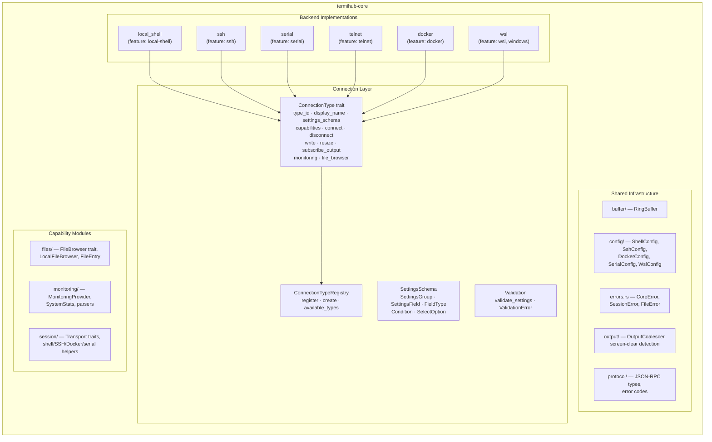
```mermaid
graph TD
    subgraph "termihub-core"
        direction TB

        subgraph "Connection Layer"
            CT["ConnectionType trait<br/>type_id · display_name · settings_schema<br/>capabilities · connect · disconnect<br/>write · resize · subscribe_output<br/>monitoring · file_browser"]
            REG["ConnectionTypeRegistry<br/>register · create · available_types"]
            SCH["SettingsSchema<br/>SettingsGroup · SettingsField · FieldType<br/>Condition · SelectOption"]
            VAL["Validation<br/>validate_settings · ValidationError"]
        end

        subgraph "Backend Implementations"
            LS["local_shell<br/>(feature: local-shell)"]
            SSH_B["ssh<br/>(feature: ssh)"]
            SER_B["serial<br/>(feature: serial)"]
            TEL_B["telnet<br/>(feature: telnet)"]
            DOC_B["docker<br/>(feature: docker)"]
            WSL_B["wsl<br/>(feature: wsl, windows)"]
        end

        subgraph "Shared Infrastructure"
            BUF["buffer/ — RingBuffer"]
            CFG["config/ — ShellConfig, SshConfig,<br/>DockerConfig, SerialConfig, WslConfig"]
            ERR["errors.rs — CoreError,<br/>SessionError, FileError"]
            OUT["output/ — OutputCoalescer,<br/>screen-clear detection"]
            PROTO["protocol/ — JSON-RPC types,<br/>error codes"]
        end

        subgraph "Capability Modules"
            FILES["files/ — FileBrowser trait,<br/>LocalFileBrowser, FileEntry"]
            MON["monitoring/ — MonitoringProvider,<br/>SystemStats, parsers"]
            SESS["session/ — Transport traits,<br/>shell/SSH/Docker/serial helpers"]
        end
    end

    LS --> CT
    SSH_B --> CT
    SER_B --> CT
    TEL_B --> CT
    DOC_B --> CT
    WSL_B --> CT
    CT --> REG
```

| Module         | Location               | Responsibility                                                                                                                                                                                                                                                                                                                                                                                                                                                                                                                      |
| -------------- | ---------------------- | ----------------------------------------------------------------------------------------------------------------------------------------------------------------------------------------------------------------------------------------------------------------------------------------------------------------------------------------------------------------------------------------------------------------------------------------------------------------------------------------------------------------------------------- |
| **Connection** | `core/src/connection/` | The central abstraction layer: `ConnectionType` async trait (the unified interface all backends implement), `ConnectionTypeRegistry` (runtime registry with factory functions), `SettingsSchema` types for dynamic UI form generation (groups, fields, field types including text, password, number, boolean, select, port, file path, key-value list, object list), `Condition` for conditional field visibility, `Capabilities` (monitoring, file browser, resize, persistent), and settings validation                           |
| **Backends**   | `core/src/backends/`   | Concrete `ConnectionType` implementations, each gated behind a cargo feature flag: `local_shell` (portable-pty), `ssh` (russh + russh-sftp with auth, file browser, monitoring, X11), `serial` (serialport crate), `telnet` (raw TCP + IAC, NAWS window size, TERMINAL-TYPE, optional prompt-driven auto-login), `docker` (bollard + file browser), `wsl` (Windows only), `ftp` (suppaftp — FTP/FTPS client with file browser + transfers, desktop-only; see [§8 FTP client sessions](#ftp-client-sessions-and-the-transfer-queue)) |
| **Buffer**     | `core/src/buffer/`     | `RingBuffer` — 1 MiB circular byte buffer for output replay and serial capture                                                                                                                                                                                                                                                                                                                                                                                                                                                      |
| **Config**     | `core/src/config/`     | Unified configuration types (`ShellConfig`, `SshConfig`, `DockerConfig`, `SerialConfig`, `WslConfig`, `PtySize`, `EnvVar`, `VolumeMount`) with config value expansion utilities (`${VAR}` and tilde expansion via `shellexpand`)                                                                                                                                                                                                                                                                                                    |
| **Errors**     | `core/src/errors.rs`   | Shared error types (`CoreError`, `SessionError`, `FileError`) with `From` conversions for `std::io::Error`                                                                                                                                                                                                                                                                                                                                                                                                                          |
| **Files**      | `core/src/files/`      | `FileBrowser` async trait (the single file-capability interface across core, desktop and agent), `LocalFileBrowser` implementation, `FileEntry` struct, and utilities (`chrono_from_epoch`, `format_permissions`, `normalize_path_separators`, `list_dir_sync`)                                                                                                                                                                                                                                                                     |
| **Monitoring** | `core/src/monitoring/` | `MonitoringProvider` trait, `SystemStats`, `CpuCounters`, `StatsCollector` trait, and parsers (`parse_stats`, `parse_cpu_line`, `cpu_percent_from_delta`, `parse_meminfo_value`, `parse_df_output`, `MONITORING_COMMAND`)                                                                                                                                                                                                                                                                                                           |
| **Output**     | `core/src/output/`     | `OutputCoalescer` for batching terminal output and `contains_screen_clear` for ANSI screen-clear detection                                                                                                                                                                                                                                                                                                                                                                                                                          |
| **Protocol**   | `core/src/protocol/`   | `JsonRpcNotification` (agent → desktop push) and standard/application error code constants; request/response handling is delegated to [`jsonrpsee`](https://crates.io/crates/jsonrpsee)                                                                                                                                                                                                                                                                                                                                             |
| **Session**    | `core/src/session/`    | Transport traits (`OutputSink`, `ProcessSpawner`, `ProcessHandle`) and session helpers — shell command building, SSH argument building, Docker CLI argument building, serial config parsing and port management                                                                                                                                                                                                                                                                                                                     |

### Level 2: Agent Modules

The remote agent (`termihub-agent`) uses a **session daemon architecture** for shell persistence. Each shell session runs as an independent daemon process (`termihub-agent --daemon <session-id>`) that manages a PTY, a 1 MiB ring buffer for output replay, and a local IPC channel. The IPC transport is abstracted (`agent/src/daemon/transport.rs`): a **Unix domain socket** (`0o700`) on unix and a **Windows named pipe** (per-user DACL) on windows, both restricted to the current user. The agent connects to daemons as a client, forwarding I/O between the desktop (JSON-RPC) and the daemon (binary frame protocol).

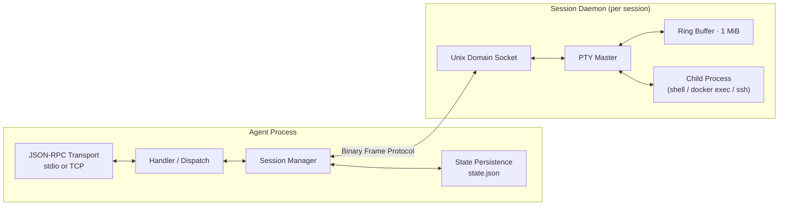
```mermaid
graph LR
    subgraph "Agent Process"
        JSONRPC[JSON-RPC Transport<br/>stdio or TCP]
        DISPATCH[Handler / Dispatch]
        SESSIONS[Session Manager]
        STATE[State Persistence<br/>state.json]
    end

    subgraph "Session Daemon (per session)"
        SOCKET[Unix Domain Socket]
        PTY_MASTER[PTY Master]
        RING[Ring Buffer · 1 MiB]
        CHILD["Child Process<br/>(shell / docker exec / ssh)"]
    end

    JSONRPC <--> DISPATCH
    DISPATCH <--> SESSIONS
    SESSIONS <--> STATE
    SESSIONS <-->|Binary Frame Protocol| SOCKET
    SOCKET <--> PTY_MASTER
    PTY_MASTER <--> RING
    PTY_MASTER <--> CHILD
```

| Module         | Location                | Responsibility                                                                                                                                                                                                                                                                                                        |
| -------------- | ----------------------- | --------------------------------------------------------------------------------------------------------------------------------------------------------------------------------------------------------------------------------------------------------------------------------------------------------------------- |
| **Buffer**     | `agent/src/buffer/`     | Shared 1 MiB ring buffer used by session daemons and serial backend for output replay                                                                                                                                                                                                                                 |
| **Daemon**     | `agent/src/daemon/`     | Binary frame protocol (`[type: 1B][length: 4B BE][payload]`), cross-platform IPC transport (`transport.rs`: Unix socket / Windows named pipe), and session daemon process (PTY allocation, poll-based event loop, transport listener)                                                                                 |
| **Shell**      | `agent/src/shell/`      | ShellBackend — agent-side daemon client for PTY shell sessions                                                                                                                                                                                                                                                        |
| **Docker**     | `agent/src/docker/`     | DockerBackend — Docker container sessions via daemon infrastructure                                                                                                                                                                                                                                                   |
| **SSH**        | `agent/src/ssh/`        | SshBackend — SSH jump host sessions via daemon infrastructure                                                                                                                                                                                                                                                         |
| **Serial**     | `agent/src/serial/`     | SerialBackend — direct serial port access with ring buffer (no daemon)                                                                                                                                                                                                                                                |
| **Session**    | `agent/src/session/`    | SessionManager (create, attach, detach, close, recover), session types and snapshots, prepared connection definitions                                                                                                                                                                                                 |
| **Files**      | `agent/src/files/`      | Connection-scoped file browsing (local filesystem, SFTP relay for SSH targets, Docker exec)                                                                                                                                                                                                                           |
| **Monitoring** | `agent/src/monitoring/` | System stats collection and parsing — CPU, memory, disk, network for agent host and jump targets                                                                                                                                                                                                                      |
| **Handler**    | `agent/src/handler/`    | JSON-RPC method dispatcher — routes requests to session, files, monitoring, and agent lifecycle handlers                                                                                                                                                                                                              |
| **Protocol**   | `agent/src/protocol/`   | Protocol types (configs, capabilities, results, error codes) for all JSON-RPC methods                                                                                                                                                                                                                                 |
| **State**      | `agent/src/state/`      | Session state persistence (`~/.config/termihub-agent/state.json`) for daemon recovery after agent restart                                                                                                                                                                                                             |
| **IO**         | `agent/src/io/`         | Transport layer — stdio (production SSH mode) and TCP (development/test mode)                                                                                                                                                                                                                                         |
| **File log**   | `agent/src/file_log.rs` | Durable, size-bounded, rotating on-disk log (`<config-dir>/logs/termihub-agent.log`, e.g. `~/.config/termihub-agent/logs/`) written for **all** roles — the only retrievable trace for the `--daemon`/`--listen`/`--registry-daemon` roles, whose stderr goes to the remote host with no capture path (audit OBS-003) |

The agent was recently refactored into a **thin proxy** over the core `ConnectionType` registry. All session lifecycle methods now use the `connection.*` JSON-RPC namespace (`connection.create`, `connection.attach`, `connection.detach`, `connection.input`, `connection.resize`, `connection.close`, `connection.list`). The agent's dispatcher routes these generically through the registry — no connection-type-specific dispatch code. See [Remote Protocol](remote-protocol.md) for the full specification and [Agent Concept](concepts/implemented/agent.html) for the design vision.

### Level 3: ConnectionType Architecture

The core abstraction is the `ConnectionType` trait in `termihub-core`. Every connection backend — local shell, SSH, serial, telnet, Docker, WSL — implements this trait. The desktop and agent both populate a `ConnectionTypeRegistry` at startup with factory functions for each available type. The frontend never hardcodes knowledge of specific backends; it discovers available types via the registry's schemas and renders forms dynamically.

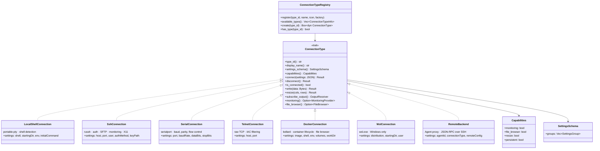
```mermaid
classDiagram
    class ConnectionType {
        <<trait>>
        +type_id() str
        +display_name() str
        +settings_schema() SettingsSchema
        +capabilities() Capabilities
        +connect(settings: JSON) Result
        +disconnect() Result
        +is_connected() bool
        +write(data: Bytes) Result
        +resize(cols, rows) Result
        +subscribe_output() OutputReceiver
        +monitoring() Option~MonitoringProvider~
        +file_browser() Option~FileBrowser~
    }

    class Capabilities {
        +monitoring: bool
        +file_browser: bool
        +resize: bool
        +persistent: bool
    }

    class SettingsSchema {
        +groups: Vec~SettingsGroup~
    }

    class ConnectionTypeRegistry {
        +register(type_id, name, icon, factory)
        +available_types() Vec~ConnectionTypeInfo~
        +create(type_id) Box~dyn ConnectionType~
        +has_type(type_id) bool
    }

    class LocalShellConnection {
        portable-pty · shell detection
        +settings: shell, startingDir, env, initialCommand
    }

    class SshConnection {
        russh · auth · SFTP · monitoring · X11
        +settings: host, port, user, authMethod, keyPath
    }

    class SerialConnection {
        serialport · baud, parity, flow control
        +settings: port, baudRate, dataBits, stopBits
    }

    class TelnetConnection {
        raw TCP · IAC filtering
        +settings: host, port
    }

    class DockerConnection {
        bollard · container lifecycle · file browser
        +settings: image, shell, env, volumes, workDir
    }

    class WslConnection {
        wsl.exe · Windows only
        +settings: distribution, startingDir, user
    }

    class RemoteBackend {
        Agent proxy · JSON-RPC over SSH
        +settings: agentId, connectionType, remoteConfig
    }

    ConnectionType <|.. LocalShellConnection
    ConnectionType <|.. SshConnection
    ConnectionType <|.. SerialConnection
    ConnectionType <|.. TelnetConnection
    ConnectionType <|.. DockerConnection
    ConnectionType <|.. WslConnection
    ConnectionType <|.. RemoteBackend

    ConnectionType --> Capabilities
    ConnectionType --> SettingsSchema
    ConnectionTypeRegistry --> ConnectionType
```

The `ConnectionConfig` stored on disk is a generic `{type, config}` pair — `type` identifies the connection type (e.g., `"ssh"`, `"serial"`), and `config` holds the type-specific settings as a JSON object validated against the schema at connect time. This replaced an earlier enum-based `ConnectionConfig` that required adding a variant for each new type.

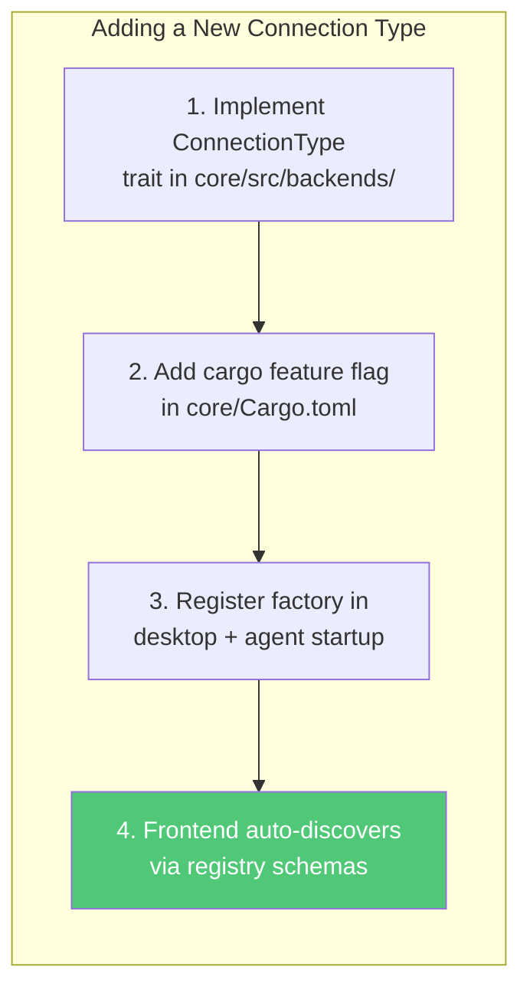
```mermaid
flowchart LR
    subgraph "Adding a New Connection Type"
        A["1. Implement ConnectionType<br/>trait in core/src/backends/"] --> B["2. Add cargo feature flag<br/>in core/Cargo.toml"]
        B --> C["3. Register factory in<br/>desktop + agent startup"]
        C --> D["4. Frontend auto-discovers<br/>via registry schemas"]
    end
    style D fill:#50c878,color:#fff
```

No frontend changes are needed to add a new connection type — the schema-driven form renderer and generic `ConnectionConfig` handle it automatically.

---

## 6. Runtime View

### Terminal Creation

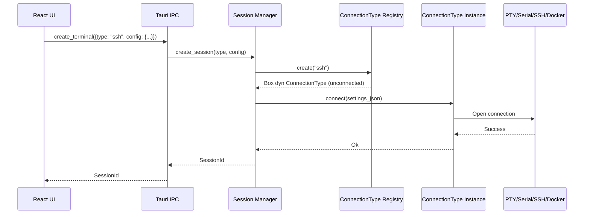
```mermaid
sequenceDiagram
    participant UI as React UI
    participant Tauri as Tauri IPC
    participant SM as Session Manager
    participant REG as ConnectionType Registry
    participant CT as ConnectionType Instance
    participant IO as PTY/Serial/SSH/Docker

    UI->>Tauri: create_terminal({type: "ssh", config: {...}})
    Tauri->>SM: create_session(type, config)
    SM->>REG: create("ssh")
    REG-->>SM: Box dyn ConnectionType (unconnected)
    SM->>CT: connect(settings_json)
    CT->>IO: Open connection
    IO-->>CT: Success
    CT-->>SM: Ok
    SM-->>Tauri: SessionId
    Tauri-->>UI: SessionId
```

### Output Streaming

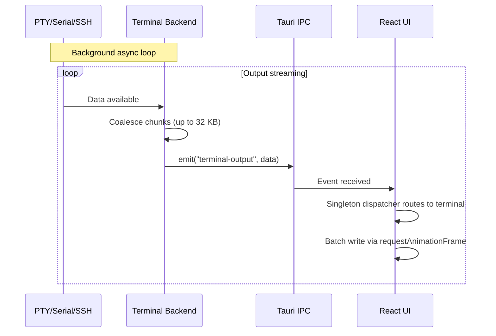
```mermaid
sequenceDiagram
    participant PTY as PTY/Serial/SSH
    participant Backend as Terminal Backend
    participant Tauri as Tauri IPC
    participant UI as React UI

    Note over Backend,PTY: Background async loop
    loop Output streaming
        PTY->>Backend: Data available
        Backend->>Backend: Coalesce chunks (up to 32 KB)
        Backend->>Tauri: emit("terminal-output", data)
        Tauri->>UI: Event received
        UI->>UI: Singleton dispatcher routes to terminal
        UI->>UI: Batch write via requestAnimationFrame
    end
```

### Input Handling

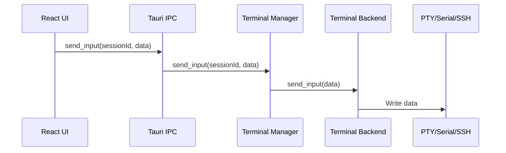
```mermaid
sequenceDiagram
    participant UI as React UI
    participant Tauri as Tauri IPC
    participant TM as Terminal Manager
    participant Backend as Terminal Backend
    participant PTY as PTY/Serial/SSH

    UI->>Tauri: send_input(sessionId, data)
    Tauri->>TM: send_input(sessionId, data)
    TM->>Backend: send_input(data)
    Backend->>PTY: Write data
```

### SSH File Transfer

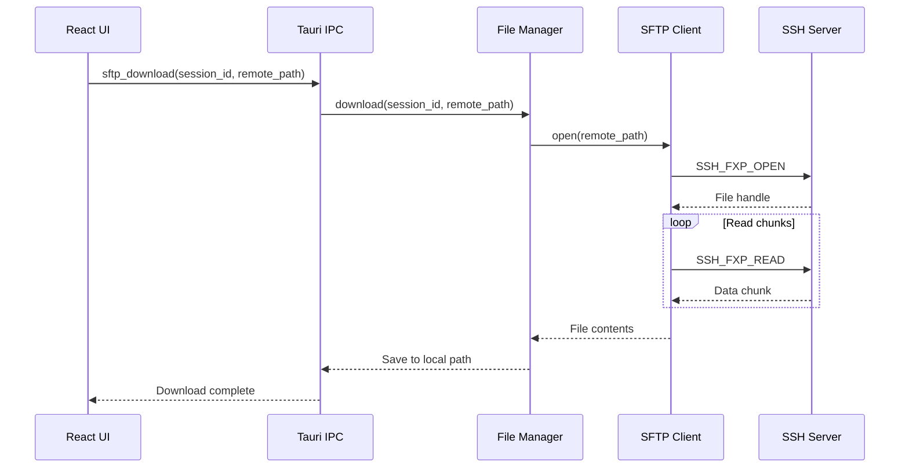
```mermaid
sequenceDiagram
    participant UI as React UI
    participant Tauri as Tauri IPC
    participant FM as File Manager
    participant SFTP as SFTP Client
    participant Remote as SSH Server

    UI->>Tauri: sftp_download(session_id, remote_path)
    Tauri->>FM: download(session_id, remote_path)
    FM->>SFTP: open(remote_path)
    SFTP->>Remote: SSH_FXP_OPEN
    Remote-->>SFTP: File handle
    loop Read chunks
        SFTP->>Remote: SSH_FXP_READ
        Remote-->>SFTP: Data chunk
    end
    SFTP-->>FM: File contents
    FM-->>Tauri: Save to local path
    Tauri-->>UI: Download complete
```

### Tab Drag-and-Drop Between Panels

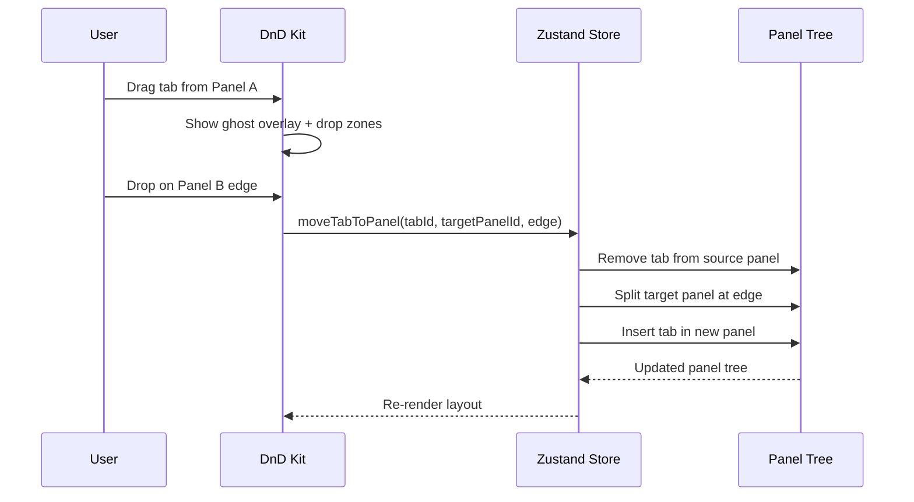
```mermaid
sequenceDiagram
    participant User
    participant DnD as DnD Kit
    participant Store as Zustand Store
    participant Tree as Panel Tree

    User->>DnD: Drag tab from Panel A
    DnD->>DnD: Show ghost overlay + drop zones
    User->>DnD: Drop on Panel B edge
    DnD->>Store: moveTabToPanel(tabId, targetPanelId, edge)
    Store->>Tree: Remove tab from source panel
    Store->>Tree: Split target panel at edge
    Store->>Tree: Insert tab in new panel
    Tree-->>Store: Updated panel tree
    Store-->>DnD: Re-render layout
```

### SSH Tunnel Lifecycle

termiHub supports three types of SSH tunnels: local forwarding (expose a remote service on a local port), remote forwarding (expose a local service on the remote host), and dynamic forwarding (SOCKS5 proxy through the remote host). Tunnels are managed independently from terminal sessions and can auto-start on application launch.

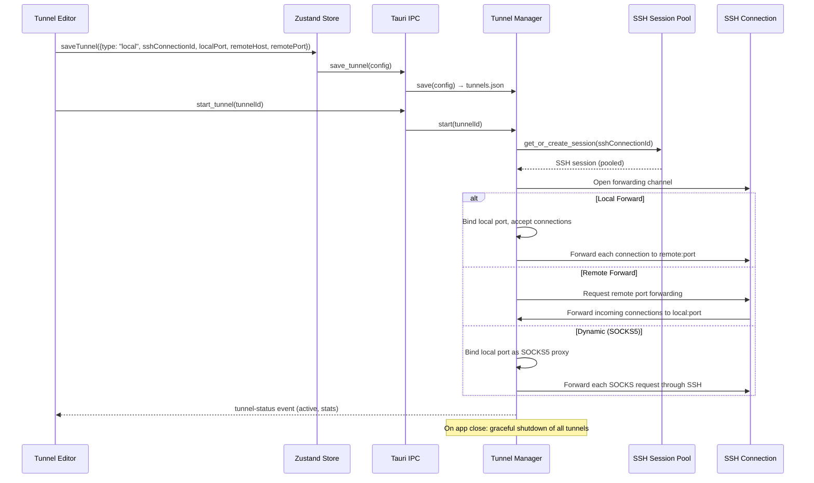
```mermaid
sequenceDiagram
    participant UI as Tunnel Editor
    participant Store as Zustand Store
    participant Tauri as Tauri IPC
    participant TM as Tunnel Manager
    participant Pool as SSH Session Pool
    participant SSH as SSH Connection

    UI->>Store: saveTunnel({type: "local", sshConnectionId, localPort, remoteHost, remotePort})
    Store->>Tauri: save_tunnel(config)
    Tauri->>TM: save(config) → tunnels.json

    UI->>Tauri: start_tunnel(tunnelId)
    Tauri->>TM: start(tunnelId)
    TM->>Pool: get_or_create_session(sshConnectionId)
    Pool-->>TM: SSH session (pooled)
    TM->>SSH: Open forwarding channel

    alt Local Forward
        TM->>TM: Bind local port, accept connections
        TM->>SSH: Forward each connection to remote:port
    else Remote Forward
        TM->>SSH: Request remote port forwarding
        SSH->>TM: Forward incoming connections to local:port
    else Dynamic (SOCKS5)
        TM->>TM: Bind local port as SOCKS5 proxy
        TM->>SSH: Forward each SOCKS request through SSH
    end

    TM-->>UI: tunnel-status event (active, stats)

    Note over TM: On app close: graceful shutdown of all tunnels
```

Tunnels are persisted in `tunnels.json` alongside connections. The SSH Session Pool reuses SSH connections across multiple tunnels targeting the same host, avoiding redundant authentication.

#### Per-connection port forwards (PROD-023)

A tunnel can be bound to its SSH connection's sessions: the **Port Forwarding** section of the SSH connection editor lists the tunnels whose `sshConnectionId` is that connection (the same `tunnels` projection the Tunnels sidebar renders — there is no second store), with add / edit (both open the regular Tunnel editor, a new one pre-bound to the connection) and remove. Each tunnel carries a `startWithConnection` flag (serde-defaulted, so older `tunnels.json` files load unchanged), independent of `autoStart` (app launch).

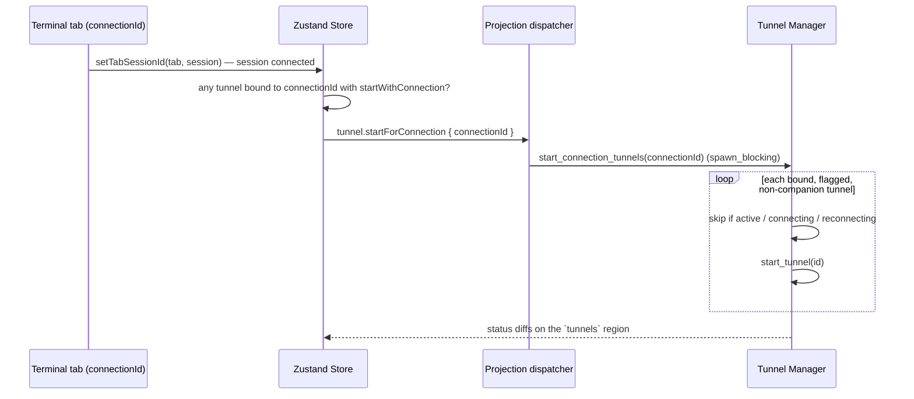
```mermaid
sequenceDiagram
    participant Term as Terminal tab (connectionId)
    participant Store as Zustand Store
    participant Disp as Projection dispatcher
    participant TM as Tunnel Manager

    Term->>Store: setTabSessionId(tab, session) — session connected
    Store->>Store: any tunnel bound to connectionId with startWithConnection?
    Store->>Disp: tunnel.startForConnection { connectionId }
    Disp->>TM: start_connection_tunnels(connectionId) (spawn_blocking)
    loop each bound, flagged, non-companion tunnel
        TM->>TM: skip if active / connecting / reconnecting
        TM->>TM: start_tunnel(id)
    end
    TM-->>Store: status diffs on the `tunnels` region
```

The forwards do **not** share the terminal's SSH transport: the terminal session is owned by the session manager, while a tunnel runs on the Tunnel Manager's own pooled endpoint session (jump-host gateways are shared process-wide). Starting is idempotent — a second tab or a reconnect does not restart a running forward — and forwards keep running after the terminal closes until stopped, like any tunnel. Chained companions (#2597) are never started directly; they follow their parent. Deleting the SSH connection does not yet cascade to its bound tunnels (tracked in #2850); a bound tunnel whose connection was deleted fails to start with "SSH connection not found", exactly as a manually started one does.

### Remote Session Creation (via Agent)

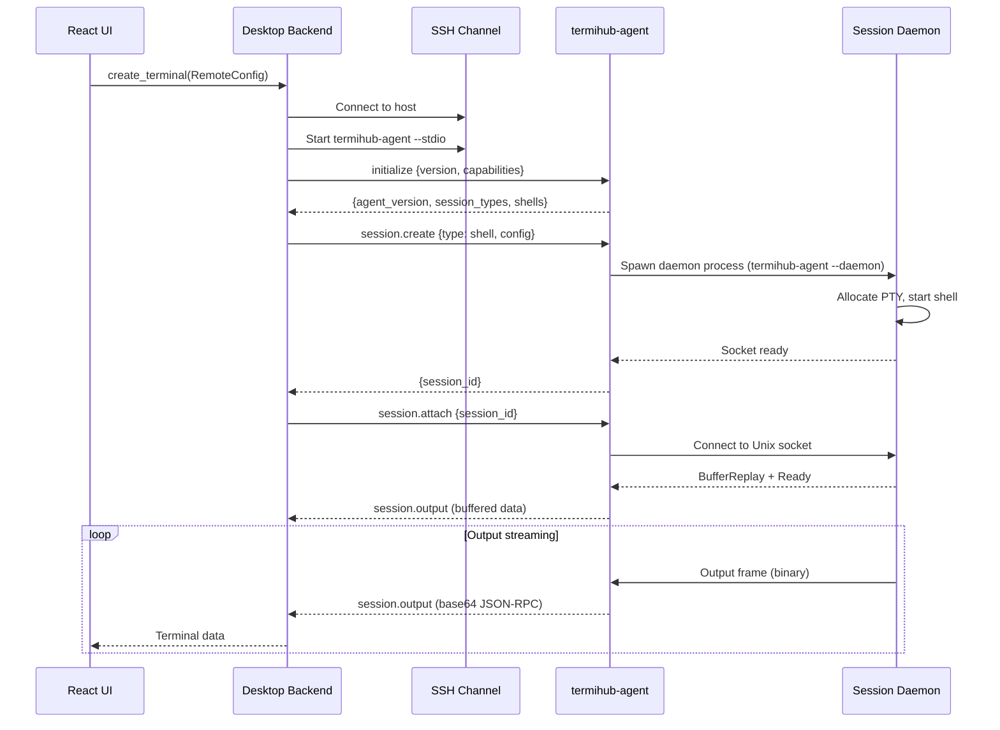
```mermaid
sequenceDiagram
    participant UI as React UI
    participant Desktop as Desktop Backend
    participant SSH as SSH Channel
    participant Agent as termihub-agent
    participant SD as Session Daemon

    UI->>Desktop: create_terminal(RemoteConfig)
    Desktop->>SSH: Connect to host
    Desktop->>SSH: Start termihub-agent --stdio

    Desktop->>Agent: initialize {version, capabilities}
    Agent-->>Desktop: {agent_version, session_types, shells}

    Desktop->>Agent: session.create {type: shell, config}
    Agent->>SD: Spawn daemon process (termihub-agent --daemon)
    SD->>SD: Allocate PTY, start shell
    SD-->>Agent: Socket ready
    Agent-->>Desktop: {session_id}

    Desktop->>Agent: session.attach {session_id}
    Agent->>SD: Connect to Unix socket
    SD-->>Agent: BufferReplay + Ready
    Agent-->>Desktop: session.output (buffered data)

    loop Output streaming
        SD->>Agent: Output frame (binary)
        Agent-->>Desktop: session.output (base64 JSON-RPC)
        Desktop-->>UI: Terminal data
    end
```

### Session Reconnection

When the desktop reconnects after a disconnect, sessions are recovered from living daemon processes:

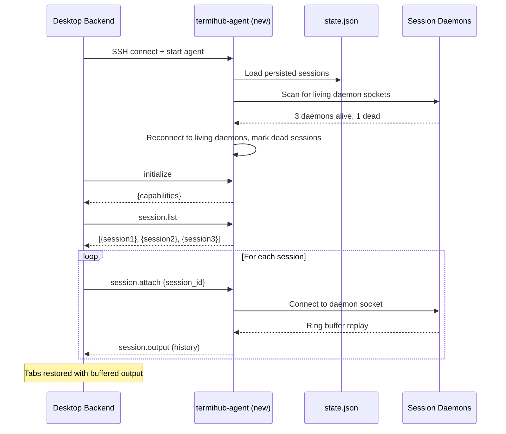
```mermaid
sequenceDiagram
    participant Desktop as Desktop Backend
    participant Agent as termihub-agent (new)
    participant State as state.json
    participant SD as Session Daemons

    Desktop->>Agent: SSH connect + start agent
    Agent->>State: Load persisted sessions
    Agent->>SD: Scan for living daemon sockets
    SD-->>Agent: 3 daemons alive, 1 dead
    Agent->>Agent: Reconnect to living daemons, mark dead sessions

    Desktop->>Agent: initialize
    Agent-->>Desktop: {capabilities}

    Desktop->>Agent: session.list
    Agent-->>Desktop: [{session1}, {session2}, {session3}]

    loop For each session
        Desktop->>Agent: session.attach {session_id}
        Agent->>SD: Connect to daemon socket
        SD-->>Agent: Ring buffer replay
        Agent-->>Desktop: session.output (history)
    end

    Note over Desktop: Tabs restored with buffered output
```

### Auto-Reconnect Setting (PARITY-008)

Every connection type that supports automatically recovering a dropped connection
exposes it under **one** settings key, `autoReconnect` (label "Auto-Reconnect"), which
defaults to **on**: an absent key means "on", only an explicit `false` opts out. Today
that is SSH (backend-driven backoff redrive into the same tab) and the graphical
backends (VNC/RDP). The key, default and legacy handling live in
`core/src/connection/auto_reconnect.rs` (mirrored for the frontend in
`src/utils/autoReconnect.ts`).

SSH previously used `resilientReconnect` (default off). The legacy key is migrated and
still accepted on read so mixed versions interoperate:

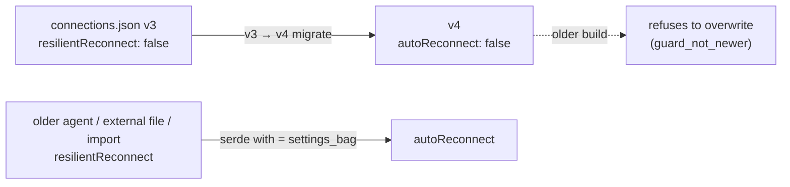
```mermaid
flowchart LR
    V3["connections.json v3<br/>resilientReconnect: false"] -->|v3 → v4 migrate| V4["v4<br/>autoReconnect: false"]
    OLD["older agent / external file / import<br/>resilientReconnect"] -->|"serde with = settings_bag"| NEW["autoReconnect"]
    V4 -.->|older build| REFUSE["refuses to overwrite<br/>(guard_not_newer)"]
```

- `connections.json` is at schema **v4**; the v3 → v4 step renames the key in every saved
  connection, preserving the user's explicit value. An older build refuses to overwrite a
  v4 file.
- The desktop `ConnectionConfig`, the agent's persisted connection definitions and the
  agent wire DTOs (`ConnectionDefinition`, `connections.create`/`update` params) rewrite
  the legacy key on read and write only `autoReconnect`.
- Agent-hosted terminal tabs are always reconnect-eligible (agent-level session
  re-attach), independent of this setting.

### Agent Update Flow

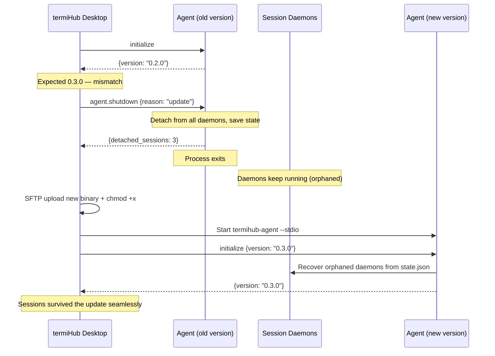
```mermaid
sequenceDiagram
    participant Desktop as termiHub Desktop
    participant Agent as Agent (old version)
    participant SD as Session Daemons
    participant NewAgent as Agent (new version)

    Desktop->>Agent: initialize
    Agent-->>Desktop: {version: "0.2.0"}
    Note over Desktop: Expected 0.3.0 — mismatch

    Desktop->>Agent: agent.shutdown {reason: "update"}
    Note over Agent: Detach from all daemons, save state
    Agent-->>Desktop: {detached_sessions: 3}
    Note over Agent: Process exits
    Note over SD: Daemons keep running (orphaned)

    Desktop->>Desktop: SFTP upload new binary + chmod +x

    Desktop->>NewAgent: Start termihub-agent --stdio
    Desktop->>NewAgent: initialize {version: "0.3.0"}
    NewAgent->>SD: Recover orphaned daemons from state.json
    NewAgent-->>Desktop: {version: "0.3.0"}

    Note over Desktop: Sessions survived the update seamlessly
```

---

## 7. Deployment View

### Desktop Application

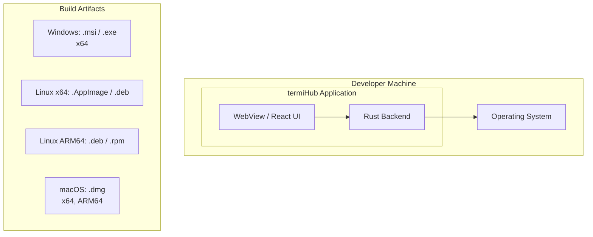
```mermaid
graph TB
    subgraph "Developer Machine"
        subgraph "termiHub Application"
            WV[WebView / React UI]
            RS[Rust Backend]
        end

        OS[Operating System]
        WV --> RS
        RS --> OS
    end

    subgraph "Build Artifacts"
        WIN[Windows: .msi / .exe<br/>x64]
        LINUX[Linux x64: .AppImage / .deb]
        LINUXARM[Linux ARM64: .deb / .rpm]
        MAC[macOS: .dmg<br/>x64, ARM64]
    end
```

| Platform | Architectures                      | Installer Formats   | Min OS Version            |
| -------- | ---------------------------------- | ------------------- | ------------------------- |
| Windows  | x64                                | `.msi`, `.exe`      | Windows 10 1809+ (ConPTY) |
| Linux    | x64                                | `.AppImage`, `.deb` | WebKitGTK 4.1+            |
| Linux    | ARM64                              | `.deb`, `.rpm`      | WebKitGTK 4.1+            |
| macOS    | x64 (Intel), ARM64 (Apple Silicon) | `.dmg`              | macOS 10.15+              |

No AppImage is built for Linux ARM64: `linuxdeploy`, the AppImage tool, is
x86_64-only, so the native ARM64 release runner produces `.deb` and `.rpm` only.

### CI/CD Pipeline

Three GitHub Actions workflows handle the build and release pipeline. See `.github/workflows/` for details.

| Workflow         | Trigger           | Purpose                                                         |
| ---------------- | ----------------- | --------------------------------------------------------------- |
| **Code Quality** | Push/PR to `main` | Linting, formatting, type checking, tests (all 3 OSes)          |
| **Build**        | Push/PR to `main` | Build Tauri app for all platforms                               |
| **Agent**        | Push/PR to `main` | Agent crate formatting, linting, tests, ARM64 cross-compilation |
| **Release**      | Tag `v*.*.*`      | Create GitHub Release with platform installers                  |

See [Releasing](contributing.md#release-process) for the full release process.

### Development Scripts

The `scripts/` directory provides cross-platform helper scripts (`.sh` + `.cmd` variants) for common tasks: setup, dev server, build, test, format, quality checks, and clean. These mirror the CI checks locally. See [scripts/README.md](../scripts/README.md) for the full list.

### Remote Agent

```mermaid
graph TB
    subgraph "Developer Machine"
        APP[termiHub Desktop]
    end

    subgraph "Remote Host (Linux / macOS / Windows)"
        AGENT["termihub-agent binary<br/>(auto-deployed via SSH)"]
        SD1[Session Daemon 1<br/>PTY + Ring Buffer]
        SD2[Session Daemon 2<br/>PTY + Ring Buffer]
        STATE["state.json<br/>(~/.config or %APPDATA%)"]
        IPC["Unix socket (unix)<br/>or named pipe (windows)"]
    end

    APP -->|SSH Tunnel + JSON-RPC| AGENT
    AGENT <-->|Binary Frame Protocol| SD1
    AGENT <-->|Binary Frame Protocol| SD2
    AGENT --> STATE
    SD1 --- IPC
    SD2 --- IPC
```

The remote agent is a standalone Rust binary (`termihub-agent`) that runs on remote hosts — build servers, NAS devices, ARM boards, or any Linux, macOS, or Windows machine. It maintains persistent terminal sessions that survive desktop disconnects and agent restarts. Communication uses JSON-RPC 2.0 over NDJSON through an SSH stdio channel.

**Auto-deployment:** When the desktop connects to a host via SSH, it checks for `termihub-agent --version`. If the agent is missing or version-incompatible, the desktop detects the remote OS and architecture (`uname -s`/`uname -m`, falling back to `%PROCESSOR_ARCHITECTURE%` on a cmd.exe/PowerShell-only Windows host), downloads the matching binary from GitHub Releases (or uses a bundled binary in development), uploads it via SFTP, and starts it. On Linux/macOS the binary is installed to `~/.local/bin/termihub-agent` (`mkdir`/`mv`/`chmod`); on Windows the desktop detects the default OpenSSH shell (cmd.exe vs PowerShell) and issues shell-appropriate commands to install to `%LOCALAPPDATA%\termiHub\agent\termihub-agent.exe` — no POSIX-only commands are sent to a Windows remote.

**Agent binary targets:**

| Detected host   | Target           | Use Case                          |
| --------------- | ---------------- | --------------------------------- |
| `x86_64` Linux  | `linux-x86_64`   | Linux build servers               |
| `aarch64` Linux | `linux-aarch64`  | ARM64 servers, Raspberry Pi 4/5   |
| `armv7l` Linux  | `linux-armv7`    | ARMv7 devices, older Raspberry Pi |
| `arm64` macOS   | `darwin-aarch64` | macOS ARM hosts                   |
| `x86_64` macOS  | `darwin-x86_64`  | Intel Mac hosts                   |
| `AMD64` Windows | `windows-x64`    | Windows x64 hosts                 |
| `ARM64` Windows | `windows-arm64`  | Windows ARM64 hosts (best effort) |

Linux targets are cross-compiled to static musl binaries via `cross-rs` from any host; macOS and Windows targets are built natively (`scripts/build-agents.sh --native`) because `cross-rs` cannot produce the MSVC ABI. See [`scripts/build-agents.sh`](../scripts/build-agents.sh) and [Testing → Windows Agent CI Coverage](testing.md#windows-agent-ci-coverage).

**Cross-platform daemon:** The session daemon is cross-platform end-to-end. Its frame protocol and IPC transport run over a Unix domain socket on unix and a Windows named pipe (per-user DACL) on windows (`agent/src/daemon/transport.rs`); shell spawning uses `portable-pty` (ConPTY on Windows); and the `SystemDaemonLauncher` spawns a detached daemon process on both platforms (orphaned child on unix, `DETACHED_PROCESS | CREATE_NEW_PROCESS_GROUP | CREATE_NO_WINDOW` on windows). Persistent (reconnectable) agent sessions therefore work on Windows as well as unix; no `nix` fork/setsid/signal is used on the daemon path.

See [Remote Protocol](remote-protocol.md) for the full protocol specification and [Agent Concept](concepts/implemented/agent.html) for the complete design vision.

---

## 8. Cross-cutting Concepts

### Error Handling

**Rust backend:**

- `anyhow::Result<T>` for application code
- `thiserror` for custom error types in library-facing APIs
- Error propagation with `?` operator, context added with `.context("description")`
- No `.unwrap()` in production code — all mutex locks use proper error propagation

**TypeScript frontend:**

- Try-catch around all Tauri IPC calls
- Error display in terminal pane when connections fail (inline, not modal)
- Graceful degradation: a failed terminal doesn't crash the app

### Async Patterns

- **Tokio** runtime for all async operations in Rust
- **Bounded channels** (`sync_channel(64)`) for terminal output with backpressure
- **Output coalescing**: backend reads coalesce pending chunks (up to 32 KB) into a single IPC event
- **Task cancellation**: each terminal session owns its async tasks, cleaned up on close

### IPC Communication

```text
Frontend → Backend:  Tauri Commands (request-response, JSON-serialized)
Backend → Frontend:  Tauri Events (push-based, JSON-serialized)
```

- **Commands** for actions: `create_terminal`, `send_input`, `resize_terminal`, `close_terminal`
- **Events** for streaming: `terminal-output` events routed by session ID
- **Singleton dispatcher**: frontend uses O(1) Map-based routing instead of per-terminal global listeners

### Spawn IPC & Shell-Integration Registration

The **"Open in termiHub" shell integration** (`src-tauri/src/spawn/`, concept
[`shell-context-menu-integration.html`](concepts/implemented/shell-context-menu-integration.html),
epic #1363) lets an OS file-manager context-menu entry or a `termiHub spawn --location <path>`
CLI call open a new session tab **in the already-running window** (brought to focus), or launch the
app first if none is running. Both sources — plus a deliberately-deferred `termihub://spawn` deep
link — funnel through one `SpawnRequest`.

**Rendezvous over a per-user IPC channel.** A `termiHub spawn …` invocation is detected from the raw
process arguments **before** Tauri initialises (`spawn::classify_command`), turned into a
`SpawnRequest`, and forwarded to a running instance over a per-user transport: a Windows named pipe
`\\.\pipe\termihub-spawn-{username}` or a macOS/Linux Unix domain socket
`{runtime_dir}/termihub-spawn-{uid}.sock`, carrying newline-delimited JSON. The server is started in
`tauri::Builder::setup()` for the app lifetime; on receipt it re-emits the request as the
`spawn-request` Tauri event, which the frontend consumes to focus the window, resolve the connection
type, and open a session tab `cd`'d to the target (dir → `cd <path>`; file → `cd <parent>`; missing →
home + warning toast). If **no** running instance answers, the invocation becomes the running
instance and self-handles its own request (threaded into `setup()` as a pending spawn), so a cold
start still opens the target once the UI is ready.

```mermaid
sequenceDiagram
    participant OS as File manager / CLI
    participant New as termiHub spawn (new process)
    participant IPC as Per-user pipe/socket
    participant Run as Running instance
    participant UI as Frontend
    OS->>New: termiHub spawn --location <path>
    New->>New: classify_command → SpawnRequest
    New->>IPC: connect + send JSON
    alt a running instance is listening
        IPC->>Run: SpawnRequest
        Run->>UI: emit "spawn-request"
        UI->>UI: focus window · resolve type · open tab cd'd to path
        New-->>OS: exit (forwarded)
    else nothing listening
        New->>New: become the running instance,<br/>self-handle as pending spawn
    end
```

**Connection-type resolution priority** (frontend): `--connection` flag → clicked entry's
`--entry-id` → first "Always" entry → fallback setting ("Show session picker" / "Use system default
shell"). The session-picker branch of that fallback is the one still-open sub-issue (#1366).

**Per-OS registration** (`spawn/registry.rs`) is entirely **user-level — no admin/elevation** — and
fully installable/uninstallable from the Shell Integration settings panel or the
`(un)install-shell-integration` CLI, with every registration losslessly removing only what it wrote:

- **Windows** — `HKCU\Software\Classes\{Directory|Directory\Background|*}\shell\termihub_<slug>`;
  `Icon` points at the executable's own icon resource (`<exe>,0`); `Extended` hides an entry behind
  Shift+right-click; ≥3 entries collapse into a cascading submenu.
- **macOS** — per-entry Automator Quick Action `.workflow` bundles under `~/Library/Services`, plus
  the app-level `NSServices` entry declared in `src-tauri/Info.plist` and served by a native provider
  (`macos_services.rs`) for file managers that surface app Services rather than Quick Actions.
- **Linux** — XDG `.desktop` launchers + Nautilus scripts + KDE service menus (KDE5/6) + Thunar
  `uca.xml`, written only for the file managers detected on the box; launchers reference the themed
  `termihub` icon.

**Bundle assets.** The integration needs almost no static bundle configuration: the only
build-time asset is `src-tauri/Info.plist` (auto-merged into the macOS `.app` by tauri-bundler),
the Windows registry `Icon` reuses the bundled `.exe`'s embedded icon, and the Linux launchers use
the themed icon the `deb`/`rpm` bundler already installs. Every other surface (workflow bundles,
desktop files, `uca.xml`) is **generated at runtime** by the registration code — no `externalBin`
helper is bundled. Because registration writes **absolute exe paths** into system-global locations,
the launch-time comparison of the registered path to `current_exe()` drives a **reinstall banner**
when they diverge (e.g. a moved portable install) — see [ADR-13](#adr-13-multi-instance-with-a-spawn-ipc-rendezvous).
Per-OS manual verification steps live in [testing.md](testing.md#manual-testing).

### State Management

> **Authority note.** Frontend state authority has been **inverted onto backend projection regions**
> (see [ADR-14](#adr-14-backend-projection-regions-as-the-single-source-of-ui-state-strangler-migration)).
> The Zustand store below is now largely a **render cache** fed from server-authoritative projections
> with mutations routed back as intents; it is no longer the source of truth for the migrated domains.

The frontend uses a single **Zustand** store (`src/store/appStore.ts`) managing:

- **Panel layout** — Recursive tree of horizontal/vertical splits with customizable layout (activity bar position, sidebar position, visibility, status bar)
- **Tab state** — Active tab, dirty flags, per-tab colors, CWD tracking
- **Connection/folder persistence** — Saved connections, folder hierarchy, and external connection file references
- **Remote agents** — Agent definitions, connection state (disconnected/connecting/connected/reconnecting), capabilities
- **Sidebar** — Active view, collapsed state
- **SFTP sessions** — File browser state per SSH connection
- **SSH tunnels** — Tunnel definitions, status, and statistics
- **Connection types** — Registry of available `ConnectionTypeInfo` from the backend (schemas, capabilities)
- **Theme** — Active theme (dark/light/system), resolved theme for OS auto-detection
- **Credential store** — Storage mode (master password/none), lock state

### Terminal Rendering

- **xterm.js** renders to `<canvas>`, not DOM elements
- **`@xterm/addon-fit`** handles terminal resize to fill container
- **`requestAnimationFrame` batching** reduces rendering overhead for high-throughput output
- Canvas rendering makes DOM-based testing impossible; see [Testing Strategy](testing.md)

### Theme System

termiHub supports three theme modes: **Dark** (default, VS Code Dark-inspired), **Light** (VS Code Light-inspired), and **System** (auto-detects OS `prefers-color-scheme`).

```mermaid
flowchart LR
    A[User selects theme] --> B[ThemeEngine resolves theme]
    B --> C[Apply CSS variables to :root]
    B --> D[Update xterm.js theme on all terminals]
    C --> E[UI re-renders with new colors]
    D --> E
```

The theme engine writes CSS custom properties directly to `:root` via JavaScript — no separate CSS files per theme. When "System" is selected, a `matchMedia` listener auto-switches between Dark and Light when the OS preference changes. The activity bar stays dark in all themes (VS Code convention).

### Per-Workspace Settings (PROD-052)

A saved workspace may override a curated subset of the global settings while it is
active: the **theme**, the terminal **font family / size**, a **default working
directory** and extra **environment variables** for new local shells. Precedence is
`global < workspace < connection` — a connection's own starting directory, an env var of
the same name, or a per-connection terminal font always wins.

- **Storage.** The overrides live in the workspace record (`settings` on
  `WorkspaceDefinition`, `src-tauri/src/workspace/settings.rs`) inside `workspaces.json`,
  so export/import, duplicate and the unified backup carry them. The store moved to schema
  **v2**; the v1 → v2 step is additive, and the bump makes it downgrade-safe (an older
  build refuses to overwrite a v2 file instead of dropping the overrides, PER-004).
  Unknown override keys round-trip verbatim.
- **Active workspace.** Launching a workspace (or saving the current layout as one)
  marks it active on the backend (`set_active_workspace`). The backend broadcasts
  `active-workspace-changed` to every window, including when the active workspace is
  edited or deleted; a newly opened window reads `get_active_workspace`.
- **Active workspace across restarts (#3517).** The active workspace id is persisted in
  `last-session.json` (`activeWorkspaceId`, additive — schema version unchanged). The
  backend stamps it on every `save_last_session` and patches the stored session when the
  active workspace is set or deleted. With restore mode `always` the backend re-activates
  it at boot, before the first window reads it, and the frontend reads it before its
  first theme apply (no flash of the global theme); with `ask` the frontend re-activates
  it when the user accepts the restore. A recorded workspace that no longer exists is
  logged and cleared. The frontend's `activeWorkspaceName` follows the broadcast.
- **Session defaults.** `create_connection` merges the active workspace's directory and
  env vars into the settings of a **new direct `local`** session only
  (`apply_session_defaults`). Running sessions, agent sessions and other connection
  types are never changed.
- **Display settings.** The frontend never writes overrides into the global settings
  document. `src/services/workspaceSettings.ts` layers them over it
  (`useEffectiveSettings`), re-applies the theme live on a switch, and Settings shows an
  "Overridden in workspace X" notice with a per-key **Reset to global**.

```mermaid
sequenceDiagram
    participant UI as Window (frontend)
    participant WM as WorkspaceManager
    participant SM as create_connection
    UI->>WM: set_active_workspace(id)
    WM-->>UI: active-workspace-changed {id, name, settings} (all windows)
    UI->>UI: apply theme / font overrides live
    UI->>SM: create_connection("local", settings)
    SM->>WM: active_settings()
    SM->>SM: fill startingDirectory / prepend envVars (connection wins)
```

### Schema-Driven Connection Settings

Connection types declare their configuration fields as a `SettingsSchema` — groups of typed fields with labels, defaults, validation rules, and conditional visibility. The frontend renders these schemas generically using the `DynamicField` component, requiring zero knowledge of any specific connection type.

```mermaid
flowchart LR
    subgraph Backend
        CT["ConnectionType impl"] --> SCH["settings_schema()"]
        SCH --> REG["ConnectionTypeRegistry"]
    end
    subgraph Frontend
        REG -->|"Tauri command:<br/>list_connection_types"| STORE["Zustand Store"]
        STORE --> CSF["ConnectionSettingsForm"]
        CSF --> DF["DynamicField<br/>(renders per FieldType)"]
    end
```

Supported field types: `text`, `password`, `number`, `boolean`, `select` (dropdown), `port`, `filePath` (with file picker), `keyValueList` (for env vars), `objectList` (for volume mounts). Fields can declare conditional visibility (`visibleWhen`) — for example, "show Key Path only when Auth Method is 'key'".

### Credential Storage

termiHub provides optional credential encryption with two storage modes:

- **Master Password** — Encrypts all credentials into a single `credentials.enc` file using Argon2id key derivation and AES-256-GCM authenticated encryption. Supports auto-lock after a configurable inactivity timeout.
- **None** — Passwords are prompted at connection time and never persisted (the default for new installations).

Credential storage is managed through the Security section in Settings.

#### Credential vault export / import

Settings → Security → **Credential Vault Backup** exports every saved credential to an encrypted
file and imports such a file into the **current** store (PROD-063, `src-tauri/src/credential/vault/`).

- **Export** requires re-authentication (in master-password mode the store must be unlocked and the
  master password re-entered) and an **export passphrase** entered twice (minimum 12 characters,
  different from the master password, with a strength hint). In **OS-keychain mode export is
  refused** (backend and UI) until OS-level user authentication exists
  ([#3433](https://github.com/armaxri/termiHub/issues/3433)) — termiHub can read its own keychain
  items without a prompt, so there would be no re-authentication step. Import into the keychain is
  allowed. The file is written only after encryption; plaintext never reaches the disk, the logs
  or the clipboard, and in-memory copies are zeroized.
- **File format** — a versioned JSON header around the standard envelope:

  ```json
  {
    "format": "termihub-credential-vault",
    "formatVersion": 1,
    "createdAt": "2026-09-26T12:00:00+00:00",
    "envelope": {
      "version": 1,
      "kdf": {
        "algorithm": "argon2id",
        "memoryCost": 65536,
        "timeCost": 3,
        "parallelism": 1,
        "salt": "…"
      },
      "nonce": "…",
      "data": "…"
    }
  }
  ```

  The envelope is the same Argon2id + AES-256-GCM format as `credentials.enc`, sealed at the
  production KDF cost. The header is repeated inside the ciphertext and must match on import, so an
  edited header is detected; no connection ids or counts are stored in the clear. A file written
  by a newer format version is rejected with an "update termiHub" message.

- **Import** decrypts with the passphrase, shows a preview (new / unchanged / conflicting
  credentials, and credentials for connections not saved on this machine), lets the user keep or
  replace conflicting credentials, then writes everything as one all-or-nothing batch. A wrong
  passphrase or a tampered file fails before anything is written.

```mermaid
sequenceDiagram
    participant UI as Settings → Security
    participant BE as credential::vault
    participant Store as Current store
    UI->>BE: export(master password, passphrase)
    BE->>Store: verify master password, read all credentials
    BE-->>UI: sealed file text (ciphertext only)
    UI->>UI: save dialog → write file
    UI->>BE: preview(file, passphrase)
    BE-->>UI: counts + conflicts (no secrets)
    UI->>BE: import(file, passphrase, skip | overwrite)
    BE->>Store: set_many (atomic, rolled back on failure)
```

The exported file object is self-contained, and the unified backup below embeds it verbatim as its
credentials section.

#### Scheduled workflows and macros

Scheduled runs (PROD-043, `src-tauri/src/schedules/`) are **backend-timed, frontend-executed**.
The backend owns the clock and every safety rule; each window owns its tabs and runs the workflow
runner, so it decides where a fired run can go.

```mermaid
sequenceDiagram
    participant L as Scheduler loop (15 s tick)
    participant M as ScheduleManager
    participant W as Each app window
    W->>M: register_schedule_window (on boot / reload)
    L->>M: tick(now, Local, open windows)
    M-->>L: fires (due, enabled, not paused, not overlapping)
    L->>W: schedule-fire {token, action, targets}
    W->>M: ack_schedule_run(token)
    W->>W: open + connected tabs of the target connections only
    W->>M: report_schedule_run(token, outcome)
    M->>M: all windows reported -> record lastResult
    M-->>W: schedules-changed
```

- **Model** — `schedules.json` (versioned, per-entry salvage, unknown keys preserved, part of the
  backup): a workflow or macro, explicit targets (saved connection ids or a broadcast group, never
  the active tab), a rule (every N minutes / daily / weekly at a local `HH:MM`), a missed-run
  policy, and backend-owned state (`enabled`, `confirmedAt`, `enabledAt`, `lastRunAt`,
  `lastResult`) plus a global `paused` switch.
- **Timing** — `timing.rs` is pure and generic over `chrono::TimeZone` (production uses
  `chrono::Local`). Intervals count absolute minutes from when the schedule was enabled; a local
  time that does not exist (spring-forward) fires at the first valid minute after the gap, and a
  time that occurs twice (fall-back) fires once, at the earlier occurrence.
- **Safety rules** (`manager.rs`) — new schedules are disabled; the first enable must carry the
  user's confirmation of the target hosts, and changing the action or targets disables the
  schedule and drops that confirmation; a due run is skipped while the previous one is in flight;
  a run more than 2 minutes late (app closed, machine asleep) is skipped with a logged reason or
  run once (per schedule); a paused period is never replayed. Runs go only to windows whose
  frontend registered as listening (a due run is held while none has, e.g. during boot); a window
  that does not acknowledge a run within 60 s is dropped from it, and a run no window settles
  within 6 hours is closed as failed.
- **Execution** (`src/store/scheduledRuns.ts`) — unattended: only already-connected tabs opened
  from a target connection, no connecting, no prompts (a required parameter without a default or
  an un-allowlisted local program makes it skip/fail), and never while another run or macro
  playback is active in that window. Workflow runs are recorded in the run history with the
  `scheduled` origin; the status bar shows "N schedules active".

#### Unified backup and restore

Settings → **Backup & Restore** backs up all app data to one file and restores it (PROD-068,
`src-tauri/src/backup/`). Each persisted store is one **section** carrying the store's own schema
version; the registry in `backup/sections.rs` lists them — connections (with agents; passwords are
stripped as defence in depth), settings (including custom themes and keyboard shortcuts),
workspaces, macros, workflows, schedules, tunnels, embedded servers, Wake-on-LAN devices, HTTP
monitors and network-tool history. Session history, workflow run history, the last session and transfer state
are deliberately not backed up. The optional **credentials** section is the credential-vault file
object above, sealed with the backup passphrase and gated exactly like a vault export
(master-password re-authentication; refused in OS-keychain mode until
[#3433](https://github.com/armaxri/termiHub/issues/3433), while the rest of the backup still works).

```json
{
  "format": "termihub-backup",
  "formatVersion": 1,
  "createdAt": "2026-09-26T12:00:00+00:00",
  "appVersion": "0.1.0",
  "encrypted": true,
  "envelope": {
    "version": 1,
    "kdf": { "algorithm": "argon2id", "…": "…" },
    "nonce": "…",
    "data": "…"
  }
}
```

- **Encryption** (default on): the whole contents — sections plus the credentials section — are
  sealed in the standard Argon2id + AES-256-GCM envelope with the backup passphrase (same rules as
  the vault export passphrase). The header is repeated inside the ciphertext and must match. An
  unencrypted backup keeps the contents in a `contents` field; sections that hold secrets in their
  own store (embedded-server passwords) are refused there, and credentials stay sealed in their own
  vault envelope, so a secret never appears in plaintext.
- **Restore preview** decrypts, runs each section through its store's typed model and
  `VersionedStore` gate (older schemas are migrated forward, newer ones and unknown sections are
  refused) and compares items by id with the current store (new / differ / unchanged).
- **Restore** is per section: **merge** (add new items; keep or overwrite items with the same id —
  connections merge by their path-based id) or **replace** (settings are replace-only and always
  keep this machine's credential-storage mode). It is all-or-nothing across the chosen sections:

```mermaid
sequenceDiagram
    participant UI as Settings → Backup & Restore
    participant BE as backup::restore
    participant Cred as Credential store
    participant Boot as Next start (backup::pending)
    UI->>BE: apply(file, passphrase, choices)
    BE->>BE: compute every chosen store's new file (validate, migrate, merge/replace)
    BE->>BE: write them to .backup-restore-staging + manifest
    BE->>Cred: set_many (atomic)
    BE->>BE: rename staging → .backup-restore-pending (commit)
    Note over BE,Cred: any failure: discard staging, put the credentials back
    UI->>BE: restart_after_backup_restore
    Boot->>Boot: snapshot originals → .backup-restore-rollback
    Boot->>Boot: swap every staged file in before any store loads
    Note over Boot: a failed file rolls every file back and shows a startup warning
```

Store files are swapped at the next start rather than live, so no running store ever has its file
changed underneath it (and cannot overwrite the restored data with stale in-memory state). The
startup swap snapshots the originals before touching anything, so a crash mid-swap resumes from the
original snapshot, and the manifest may only name known store files.

##### Embedded-server passwords (#3514, #3520)

`embedded_servers.json` v2 keeps no password (they live in the credential store), so the
embedded-servers section is not encryption-only: it never carries a password, and the passwords
travel in the sealed credentials section like connection passwords. Plaintext a v1 file or an older
backup's v1 section still holds is never written to a file: export migrates the section (stripping
it, with a warning), and restore moves the passwords of the items it keeps into the credential store
in the same all-or-nothing batch as the credentials — refusing while the store is locked, and
dropping them (the preview says so) when credential storage is off.

##### Trusted host keys and plugins (#3515)

- **Trust stores** — `ssh_known_hosts.json` and `rdp_known_hosts.json` are sections of shape
  `TrustMap` (`host:port` → trusted fingerprints). They are **integrity-sensitive**: only exported
  in an encrypted backup and only restored from one (AES-GCM authenticates the whole contents, so a
  hand-edited file cannot inject a key). A **merge** is a union by host, but a host already trusted
  here always keeps exactly its current keys — whatever conflict strategy is picked — and the
  preview lists those hosts; only **replace** adopts the backup's keys.
- **Trust-store versioning** — the files keep their flat, unversioned on-disk format: adding a
  `version` key inside that object would make every older termiHub read the file as corrupt and
  start with an empty store (the downgrade loss the migration layer exists to prevent). The format
  is versioned where it leaves the machine: the backup section records schema version 1
  (`TRUST_STORE_SCHEMA_VERSION`), and a section with a newer version is refused. The on-disk
  migration story itself is still open in [#2745](https://github.com/armaxri/termiHub/issues/2745).
- **Plugins** (`backup/plugins/`) — one section with every installed plugin's files
  (base64), its `plugin-state.json` record (including the signer record, as-is), its settings and
  the pinned publisher keys (each must still hash to its `keyId`). Encrypted-only as well. Each
  restored plugin's manifest must validate and name its directory, and file paths must stay inside
  it. Plugins over 16 MB, or past 24 MB in total, are skipped with a warning at export time.
- **Plugin trust is never restored** — `native-plugin-trust.json` (the global "native plugins on"
  switch and the per-plugin, library-hash-bound acknowledgments) is neither backed up nor written by
  a restore, and every restored **native** plugin comes back turned off. It loads only after the
  user turns it on and acknowledges trust on this machine.
- **Swap** — plugin directories are staged whole and swapped at startup by renames (the original
  moves into the rollback directory; a replace removes plugins not in the backup the same way), so
  a failure or crash restores the original directories exactly. The manifest format that can name
  plugin paths is version 2, which older builds refuse instead of half-applying.

### Content-Security-Policy & capability scoping

termiHub ships a deliberately tight webview Content-Security-Policy and a scoped Tauri capability
set. This section documents the current posture, the three deliberate relaxations that remain, and
the reasoning behind each — so future maintainers and auditors can see they are considered
trade-offs, not oversights. (Audit finding SEC-013: maintainer-accepted; further tightening is
deferred post-release — see the follow-up issue linked from that finding.)

#### The policy

The CSP lives in `src-tauri/tauri.conf.json` (`app.security.csp`):

```text
default-src 'self';
script-src 'self' plugin://localhost http://plugin.localhost 'wasm-unsafe-eval';
style-src 'self' 'unsafe-inline';
img-src 'self' data: blob:;
font-src 'self' data:;
connect-src 'self' ipc: http://ipc.localhost;
worker-src 'self' blob:;
child-src 'self' blob:;
object-src 'none';
frame-src 'none';
base-uri 'self';
form-action 'none'
```

The baseline is strict: `default-src 'self'`, **no** `unsafe-eval`, **no** inline or remote
`script-src` hosts (only the local Tauri plugin origins), `object-src 'none'`, `frame-src 'none'`,
`base-uri 'self'`, and `form-action 'none'`. There is no path by which remote content can be loaded
or arbitrary JavaScript evaluated.

#### The three deliberate relaxations

1. **`script-src 'wasm-unsafe-eval'` — required by the Shiki WASM highlighter.**
   The External-Files editor uses Monaco with TextMate-grammar syntax highlighting powered by
   [Shiki](https://shiki.style/) (`src/utils/monacoCustomLanguages.ts`, via `@shikijs/monaco`).
   Shiki's regex engine is Oniguruma compiled to **WebAssembly** (`onig.wasm`), and instantiating a
   WASM module requires `'wasm-unsafe-eval'`. This is a **WASM-compilation-only** relaxation — it
   permits `WebAssembly.compile`/`instantiate`, and does **not** enable JavaScript `eval` or
   `new Function`. It is removable only by dropping Shiki-based highlighting.

2. **`style-src 'unsafe-inline'` + `dangerousDisableAssetCspModification: ["style-src"]` — forced by third-party runtime `<style>` injection.**
   Several bundled libraries inject `<style>` elements into the document at runtime — xterm.js
   (terminal rendering), sonner (toasts), and Monaco (editor). Those styles have no ahead-of-time
   hash, so `'unsafe-inline'` is required for them to apply. Tauri, by default, auto-appends a hash
   for `index.html`'s inline styles to the `style-src` directive; per **CSP Level 3**, the presence
   of a hash or nonce **cancels** `'unsafe-inline'`, which broke xterm/sonner styling (fixed in
   commit `9f4594ab`). Setting `dangerousDisableAssetCspModification: ["style-src"]` disables that
   auto-hash injection for `style-src` only, keeping `'unsafe-inline'` effective.
   Note that termiHub's **own** theming does **not** rely on this: the theme engine writes CSS
   custom properties through the CSSOM (`element.style.setProperty`, `src/themes/engine.ts`), which
   is a scripted style mutation exempt from `style-src` entirely. A nonce/hash-based `style-src` is
   high-effort and fragile here (the library-generated styles are dynamic with no stable hash set,
   and Tauri exposes no runtime-nonce hook), so it is deferred.

3. **Unscoped `fs` / `opener` capabilities — because they back user-driven, dialog-picked paths.**
   `capabilities/default.json` grants `fs:allow-read-text-file` / `fs:allow-write-text-file` and
   `opener:allow-open-path` without a static `fs:scope`. These back **user-initiated** flows where
   the user chooses an arbitrary location through the OS **save/open dialog**: exporting and
   importing config, themes, logs, and connection definitions, and "open / reveal in OS" actions on
   file-browser entries. A static path scope is a poor fit for locations the user picks at runtime.
   External **URL** opening is a separate concern and is already **application-level allowlisted** —
   `src/utils/safeOpenExternal.ts` restricts schemes to `http`/`https`/`mailto` before handing off
   to the opener. Scoping the **app-owned** (non-dialog) paths — config, logs, and the portable
   `data/` directory — while keeping user-dialog exports working is a possible future refinement and
   is deferred.

#### Native file drag-out (no drag capability granted)

Dragging file-browser rows out to Finder / Explorer / a GTK file manager (#3457) uses CrabNebula's
[`drag`](https://crates.io/crates/drag) crate (Apache-2.0 OR MIT) — the engine behind
`tauri-plugin-drag` — **directly**, not the plugin. The plugin would add a
`drag:allow-start-drag` capability that lets the webview start an OS drag of any path _or arbitrary
pasteboard data_. Instead the webview only reaches four typed app commands
(`src-tauri/src/files/drag_out.rs`, `commands/files.rs`):

- `drag_out_start` accepts **file paths only** (never pasteboard data), each absolute, `..`-free
  and existing, capped at 1000 entries. It grants nothing the webview could not already reach via
  the local file-browser commands, and the drop itself still needs the user's physical gesture.
- `drag_out_create_staging` makes a **private** staging directory (`0700` on Unix; the per-user
  app cache dir on Windows) for remote entries and returns one target path per entry. An entry is
  a list of name segments, so a remote folder tree (#3491) is laid out in one call — at most 10 000
  entries, 32 levels deep, folders created private up front. Every segment is sanitized to a single
  path component, so a hostile server name such as `../../.bashrc` can never escape it. SFTP / FTP
  files are then downloaded into those paths through the transfer queue.
- `drag_out_stage_session` stages rows of a **byte-based** session (Docker / remote agent), which
  has no transfer queue (#3491). The webview sends only remote paths and names; the backend reads
  each file (recursing into folders, never following symlinked ones) through the session and
  writes it into a staging directory it creates and owns — the destination is never
  webview-supplied. It is capped at 10 000 entries, 32 levels and 1 GiB (those backends return
  whole files in memory), and a failed staging discards its directory.
- `drag_out_discard_staging` deletes only a directory **this process created** — any other path
  is refused. All of the process's staging directories are removed at app teardown, and ones left
  by a crash are swept (older than 24 h) the next time staging is used.

#### Threat-model note

termiHub is a local desktop terminal application; it does not load remote web content into its
webview and has no server-side surface. Against that model, the residual risk from the three
relaxations above is low: `'wasm-unsafe-eval'` does not enable JS `eval`, `'unsafe-inline'` applies
only to `style-src` (styling, not script execution), and the unscoped filesystem/opener permissions
are exercised only through explicit user actions (OS dialogs and app-level allowlists). Each is a
deliberate, documented trade-off rather than an oversight, and each has a tracked path to future
tightening.

### Projection client identity (window binding)

Every projection intent and subscription carries a `clientId` — the fan-out / audit identity and
the key of client-scoped regions such as `layout@<clientId>` (see ADR-14). That field is asserted by
the webview, so on its own it proves nothing. Since multi-window (#1900), each window is a separate
JavaScript context, and nothing in the payload would stop window B from dispatching an intent as
window A's client or subscribing to A's private regions (audit finding TAURI-012, #3444).

The backend therefore **binds each `clientId` to the calling principal** in
`ClientIdentities` (`src-tauri/src/projection/identity.rs`). On desktop the principal is the invoking
`WebviewWindow` label (`main`, `win-N`), supplied server-side by Tauri and not forgeable by page
script; a future remote-client transport must supply the authenticated connection id instead.

```mermaid
flowchart LR
    W["window win-1<br/>(invokes command)"] -->|"label from Tauri,<br/>clientId from payload"| C{"ClientIdentities"}
    C -->|"unbound → bind to win-1"| OK["dispatch / subscribe"]
    C -->|"bound to win-1"| OK
    C -->|"bound to another window"| R["reject: client_identity_mismatch<br/>(logged)"]
```

- **Trust-on-first-use binding.** The frontend mints unguessable `client-<ulid>` ids per bridge; the
  first window to use an id owns it. A window may mint any number of ids, but can only ever act as
  its own.
- **Enforcement points** (`src-tauri/src/commands/projection.rs`): `intent_dispatch` rejects an
  intent whose `clientId` belongs to another window before any handler runs;
  `projection_subscribe` requires the asserted `clientId` and, for a client-scoped region
  (`<domain>@<clientId>`), the region's client to be the caller's; `projection_resync` and
  `projection_unsubscribe` apply the same region rule, and unsubscribe detaches only the caller's
  own subscriptions. A resubscribe with a reused subscription id replaces only the same client's
  subscription, so one window cannot evict another's diff stream.
- **Shared regions stay shared.** Regions without an `@` suffix (`connections`, `settings`,
  `tunnels`, …) are app-wide authority that every window legitimately reads and mutates; windows are
  the same trusted application code, so no per-window policy applies to them.
- **Lifecycle.** When a window is destroyed its bindings are released and its subscriptions
  detached.
- **Wire compatibility.** The frontend still sends `clientId`; it is validated, not trusted.
  Rejections surface as a rejected `IntentAck` or a `{ code, message }` command error.

**Threat model.** The webview is trusted application code — this is not a defence against a
compromised renderer, which could invoke any command. It guarantees that multiple windows cannot
impersonate each other through the projection substrate. Frontend plugins run sandboxed in a Web
Worker (#2136, default-off) with no Tauri IPC access; even code that reached IPC from inside a window
would act only under that window's label and could not assume another window's identity. Before a
remote-client transport ships, it must derive the principal from its authenticated session and add
an authorization policy for shared regions — the substrate does not authenticate transports itself.

### Experimental Features

termiHub provides an opt-in mechanism for features that are under active development and not yet ready for general availability.

#### Purpose

Experimental features allow work-in-progress functionality to ship in releases without stability guarantees. They may be:

- Completely redesigned before reaching stable status
- Removed without replacement if the direction is abandoned
- Broken across releases without migration paths

Users opt in explicitly and accept these trade-offs.

#### How It Works

A single boolean setting, **Allow Experimental Features** (`experimentalFeaturesEnabled` in `AppSettings`), gates all experimental UI. It is `false` by default and surfaced in **Settings → General**.

The `useExperimentalFeatures()` hook (`src/hooks/useExperimentalFeatures.ts`) is the single read point for this flag across the frontend:

```typescript
const experimental = useExperimentalFeatures();
if (!experimental) return null;
```

#### Marking a Feature as Experimental

**Activity Bar items** — set `experimental: true` on the item definition in `ActivityBar.tsx`. The item is automatically hidden when the flag is off and shown with a " — Experimental" suffix in the right-click context menu when enabled.

**Connection type options** — gate inclusion via the `includeRemoteAgent` parameter of `buildTypeOptions()` in `ConnectionEditor.tsx`.

**Sidebar sections** — guard the render block with `experimental &&` in `ConnectionList.tsx`.

**Other UI** — guard rendering with `useExperimentalFeatures()`.

#### Currently Experimental Features

| Feature      | Entry points gated                                               |
| ------------ | ---------------------------------------------------------------- |
| Remote Agent | Connection type dropdown, agent nodes in the Connections sidebar |
| SSH Tunnels  | Activity Bar item (SSH Tunnels sidebar view)                     |

#### Stability Contract

| Status       | Guarantee                                                   |
| ------------ | ----------------------------------------------------------- |
| Stable       | Backward-compatible; breaking changes require deprecation   |
| Experimental | No guarantees; may change, break, or be removed at any time |

Experimental features may ship in public releases. The flag is not a hidden developer tool — it is a user-visible opt-in that makes the lack of guarantees explicit.

### X Server Provisioning (SSH X11 Forwarding)

SSH **X11 forwarding** renders a remote GUI app (`xeyes`, a graphical IDE) as a native window on the machine running termiHub. That requires a **local X server** — something Linux users usually already have, macOS users install (XQuartz), and Windows users historically had to source and configure by hand. The X-server provisioning subsystem (epic #1047, concept `docs/concepts/implemented/x-server-provisioning.html`) makes a usable local X server available, forwards to it, and tears it down cleanly — with the acquisition **strategy chosen per platform** (see [ADR-10](#adr-10-per-platform-x-server-provisioning)).

#### Where it lives

The subsystem straddles the core/desktop boundary because core cannot provision servers itself — process lifecycle, VcXsrv acquisition, and the native install flows are desktop concerns:

| Layer                                                  | Responsibility                                                                                                                                                                                                                                                                      |
| ------------------------------------------------------ | ----------------------------------------------------------------------------------------------------------------------------------------------------------------------------------------------------------------------------------------------------------------------------------- |
| `core/src/backends/ssh/x11.rs`                         | The forwarding mechanism (russh reverse `tcpip_forward` → local X socket/TCP), the `XServerProvisioner` **seam** (trait + `set_x_server_provisioner`), `ResolvedXServer`/`XServerLease`, and the no-provisioner fallback `detect_local_x_server` for a user-run server              |
| `src-tauri/src/terminal/xserver/`                      | The desktop provisioner: `orchestrator` (cross-platform decision), `manager` (managed-server lifecycle + session refcount), `windows` (VcXsrv resolve + winget install), `macos` (XQuartz), `linux_gap` (Linux hint classifier), `consent` (connect-time gate), `auth` (MIT cookie) |
| `src-tauri/src/commands/xserver.rs`                    | Tauri command surface: `x_server_status`, `x_server_ensure`, `x_server_stop`, `x_server_install_dependency`, `x_server_connect_consent_reply`                                                                                                                                       |
| `src/components/OpenConnections/XServer*`, `Settings/` | Frontend: settings toggles (`provideXServerAutomatically`, `stopXServerWhenIdle`), the Open Connections **X Servers** section, the manual **Set up** dialog, and the connect-time consent dialog                                                                                    |

Core stays transport-only: at startup the desktop registers `XServerProvisionerImpl` via `set_x_server_provisioner`, and `SshConnector` consults it whenever `enable_x11_forwarding` is set. With no provisioner registered (core standalone / tests), behavior is unchanged — the forwarder falls back to detecting a user-run server.

#### Per-platform strategy

- **Windows — install VcXsrv via winget (#1318).** No native X server exists, so termiHub provisions one. `windows.rs` resolves the winget-installed `vcxsrv.exe` and, when it is absent, runs `winget install -e --id marha.VcXsrv …` (`WINGET_INSTALL_VCXSRV_COMMAND` in `xserver/types.rs`) after a connect-time consent prompt — or the user installs it manually. termiHub does **not** bundle, host, or redistribute a VcXsrv binary (the earlier download/SHA-256 pinned-artifact approach, #1076, was dropped). The installed server runs as a separate process; a user-run/already-running VcXsrv is adopted via the TCP probe.
- **macOS — detect + guide XQuartz.** macOS cannot embed an X server. `macos.rs` detects XQuartz (`/opt/X11`, `/Applications/Utilities/XQuartz.app`); on connect it best-effort launches it (`open -a XQuartz`) and polls for readiness (≤ ~4 s, cancellable, #1260). An install **never runs silently** — only the explicit `x_server_install_dependency` action runs `brew install --cask xquartz` (or returns xquartz.org guidance when Homebrew is absent).
- **Linux — native X, guide-only.** termiHub never bundles or installs anything. It adopts the running server; when forwarding fails, `linux_gap.rs` snapshots the environment (`DISPLAY`, `WAYLAND_DISPLAY`, sockets, `Xwayland`/`Xorg` on PATH, Flatpak/Snap sandbox) and classifies the gap into a **targeted, actionable hint** (install XWayland; grant the `--socket=x11` sandbox permission; start a graphical session / Xvfb) rather than a generic error.

#### Managed-server lifecycle

At most one managed X server exists per termiHub instance, shared across sessions and reference-counted (#1107). The manager either **adopts** an already-reachable server (TCP `127.0.0.1:6000`, never terminated by termiHub) or, on a provider platform, **spawns** one on the first free display with a fresh MIT-MAGIC-COOKIE-1 (falling back to loopback-only `-ac`). Each X11-forwarding session holds a RAII `SessionGuard`; when the last one drops **and** "shut down when idle" is set, a termiHub-spawned server is stopped — so a clean disconnect leaves **no orphan process**.

```mermaid
stateDiagram-v2
    [*] --> Absent
    Absent --> Adopted: external server<br/>reachable on :6000
    Absent --> Running: spawn managed<br/>(Windows / provider)
    Absent --> Failed: no server + typed<br/>per-platform error
    Adopted --> Adopted: sessions acquire / release<br/>(never terminated)
    Running --> Running: reuse across sessions<br/>(refcount > 0)
    Running --> Absent: refcount → 0 &&<br/>stop-when-idle
    Failed --> Absent: retry / dependency installed
    Running --> [*]: app exit (child reaped)
```

#### Connect-time consent handshake

Downloading an X dependency on someone's behalf requires consent. On a first-time, download-backed Windows connect with automatic provisioning **undecided** and no server already present, the provisioner pauses the connect: it emits `x-server-consent-needed`, streams `x-server-progress`, and awaits the frontend's `x_server_connect_consent_reply`. **Enable** provisions and persists the decision (later connects never re-prompt); **Not now** continues the SSH connection without X forwarding; **Stop** while the prompt is up aborts the connect promptly (#1260). macOS/Linux never download, so they never prompt — they only gain progress feedback.

```mermaid
sequenceDiagram
    participant UI as Frontend
    participant Conn as SSH connect (core)
    participant Prov as XServerProvisionerImpl
    participant Mgr as XServerManager

    Conn->>Prov: ensure(cancel)
    Prov->>Prov: consent required?<br/>(Windows · undecided · no server)
    alt prompt needed
        Prov-->>UI: x-server-consent-needed {id}
        UI-->>Prov: x_server_connect_consent_reply(id, Enable | NotNow)
    end
    alt Enable / not needed
        Prov->>Mgr: ensure_running() + acquire lease
        Mgr-->>Prov: ResolvedXServer + SessionGuard
        Prov-->>Conn: XServerLease (forward here)
    else Not now
        Prov-->>Conn: empty lease (connect without X)
    else Stop during prompt
        Prov-->>Conn: Err (connect aborted)
    end
```

### FTP Client Sessions and the Transfer Queue

termiHub ships a first-class **FTP/FTPS client** connection type (epic #1331, concept
`docs/concepts/implemented/ftp-client.html`, implements #518). It lets users connect to FTP servers for
remote file browsing and transfer and is **distinct** from the two pre-existing FTP-adjacent
features it must not be confused with: the **SFTP file browser** (an SSH subsystem,
`src-tauri/src/files/sftp.rs`) and the **embedded FTP _server_**
(`src-tauri/src/embedded_servers/ftp_server.rs`, `libunftp`, #728).

- **Backend** — `core/src/backends/ftp/` implements `ConnectionType` on top of the
  [`suppaftp`](https://crates.io/crates/suppaftp) crate. It handles plain FTP and FTPS
  (explicit `AUTH TLS` on 21, implicit TLS on 990), passive/active data connections, binary/ASCII
  transfer types, `MLSD`→`LIST` listing with multi-format parsers (`listing_parser.rs`), and
  robustness (`reconnect.rs`): `NOOP` keep-alive, auto-reconnect on control drop, and `EPSV`→`PASV`
  fallback. Because FTP has no interactive terminal, `write`/`resize` are no-ops and
  `file_browser()` returns the session's `FtpFileBrowser`. TLS uses **`async-rustls`** to match
  termiHub's rustls/russh stack (the concept originally proposed `async-native-tls`; see the sync
  ledger in the concept).
- **Credentials** — FTP passwords resolve through the same credential-store path as SSH and are
  never written to `connections.json` or logs. Plain-FTP connections raise an **insecure-connection
  warning** (`src/utils/ftpSecurity.ts`, modal in `ConnectionList.tsx`) before the control channel
  opens, with a per-connection suppress option.
- **Transfer Queue** — a **connection-type-agnostic** subsystem (`src-tauri/src/files/transfer/`,
  frontend `src/components/TransferQueue/`) extends the pre-existing cancellable-transfer registry
  (#1245) with a queue, bounded per-session concurrency (2 by default), pause/resume, `REST`-based
  resume, and auto-retry (≤3, exponential backoff). It surfaces as a panel docked above the status
  bar with a minimized status-bar indicator, driven by `transfer-progress` events and generic
  `transfer_*` IPC commands, so SFTP can adopt the same model later. See
  [ADR-12](#adr-12-connection-type-agnostic-transfer-queue).
- **Desktop-only for v1** — the `ftp` cargo feature is desktop-only (registered in
  `src-tauri/src/session/registry.rs::build_desktop_registry()`); the remote agent has no FTP
  backend. Wiring the connection-type-agnostic `file_browser()` dispatch into the sidebar (so FTP
  sessions browse there the way SFTP does today) is tracked as the final sub-issue #1335 and is not
  yet merged; until then FTP file operations run through the backend and the Transfer Queue rather
  than the sidebar tree.

---

## 9. Architecture Decisions

### ADR-1: React over Svelte

**Context:** Choosing a frontend framework for a complex desktop UI with drag-and-drop, split views, and terminal rendering.

**Decision:** React 18 with TypeScript.

**Rationale:**

- Mature ecosystem with production-ready libraries (dnd-kit, react-resizable-panels, @tanstack/react-virtual)
- Better tooling for complex drag-and-drop interactions
- Larger community and more examples for AI-assisted development
- Better knowledge base for Claude Code contributions

**Trade-off:** Larger bundle size and more boilerplate compared to Svelte.

### ADR-2: Tauri over Electron

**Context:** Choosing a desktop application framework for a cross-platform terminal hub.

**Decision:** Tauri 2.x with Rust backend.

**Rationale:**

- ~5 MB binary vs Electron's ~100 MB
- Lower memory footprint (single WebView vs bundled Chromium)
- Rust backend provides memory safety and native performance
- Native system integration (serial ports, PTY, file system)

**Trade-off:** Smaller ecosystem than Electron, platform-specific WebView rendering differences.

### ADR-3: Trait-Based Backend (Original)

**Context:** Supporting multiple terminal types (PTY, serial, SSH, telnet, remote agent) with a unified management interface.

**Decision:** Rust `TerminalBackend` trait with one implementation per terminal type.

**Rationale:**

- Adding new terminal types requires only implementing the trait
- `TerminalManager` manages all types through a single `Box<dyn TerminalBackend>`
- Future remote backend can be added without modifying existing code
- Enables mock implementations for testing

**Status:** Superseded by [ADR-7](#adr-7-connectiontype-trait-and-registry) which moves the trait into `termihub-core` as `ConnectionType` with schema-driven settings and a runtime registry. The desktop-side `TerminalBackend` trait still exists as a thin wrapper but all new backends implement `ConnectionType` directly in core.

### ADR-4: Zustand for State Management

**Context:** Managing complex frontend state (panel trees, tabs, connections, file browser) in a React application.

**Decision:** Zustand with a single store.

**Rationale:**

- Minimal boilerplate (no providers, reducers, or action creators)
- Excellent TypeScript support
- Single store simplifies state access and debugging
- No context provider wrappers needed

### ADR-5: System and E2E Tests Run Through the Cross-Platform Bridge

**Context:** Tauri's `tauri-driver` (the WebDriver proxy for E2E tests) only supports Linux (WebKitGTK) and Windows (Edge WebView2). On macOS it prints "not supported on this platform" and exits, because Apple provides no WKWebView driver — `safaridriver` only controls Safari the browser, not WKWebView instances embedded in apps ([tauri-apps/tauri#7068](https://github.com/tauri-apps/tauri/issues/7068), no upstream fix expected). The original suite was therefore a WebdriverIO/`tauri-driver` runner boxed into a Docker+Xvfb Linux container so that even macOS developers could run it — at the cost of testing the Linux build, never the native macOS app.

**Decision (current):** The system/E2E suite is the host-native **Python bridge harness** (`tests/system/`, run via `./scripts/test-system-py.sh`). It drives the app over a WebSocket **bridge** rather than a native WebView driver, so it launches and drives the **real per-platform build on macOS, Linux, and Windows** — no `tauri-driver`, no WKWebView driver, no Docker-in-the-loop for the app itself. Under epic #799 every WebdriverIO spec was ported to it; the WebdriverIO scaffold (`wdio.conf.js`, `tests/e2e/`, the `@wdio/*` devDependencies) was fully retired in #1027, and the unified suite now runs on **all three platforms in CI** — the nightly integration lane ([`system-integration.yml`](../.github/workflows/system-integration.yml)) carries Linux, macOS, and Windows legs (#804/#1649). macOS is no longer manual-only for integration testing: the built `.app` is launched and driven natively.

**What stays Linux-bound (and why):**

- **Docker fixtures.** The SSH/telnet/serial/agent fixtures in `tests/docker/` are Linux containers driven by a Linux Docker daemon. GitHub-hosted macOS/Windows runners have no usable Linux daemon (macOS ships no Docker; the Windows runner runs Windows, not Linux, containers), so the fixture-backed suites **self-skip** on those legs while the app-launch/UI suites run. Locally, Docker Desktop on macOS runs the containers in a Linux VM with no host networking, which is why the live SSH-tunnel cases also carve out to macOS-manual (see [testing.md](testing.md#ssh-tunnel-startstop-on-macos-manual-carve-out-933)).
- **The smoke test.** The one remaining `tauri-driver` consumer is `scripts/smoke-test.sh`; its W3C-WebDriver UI checks run on Linux/Windows and fall back to process/`osascript` checks on macOS. macOS-specific _rendering_ behaviour (WKWebView quirks) is still verified via [manual testing](testing.md#manual-testing).

**Trade-off:** The cross-platform app-behaviour suite is real on every OS, but Docker-fixture coverage and low-level rendering checks remain Linux-centric / manual on macOS. This is a documented, narrow gap rather than the former "all macOS integration testing is manual".

### ADR-6: Credential Storage (Evolved)

**Context:** SSH connections require authentication credentials. The original decision (Phase 1) was to prompt for passwords at connection time and never persist them. As the project matured, a credential storage system was implemented.

**Decision:** Provide two credential storage modes — master password encryption and no storage (prompt-only). The user chooses their mode in Security settings.

**Rationale:**

- Master password mode provides strong, portable encryption (Argon2id + AES-256-GCM) that works identically on all platforms
- No-storage mode preserves the original Phase 1 behavior for users who prefer it
- Key-based authentication (recommended) doesn't require password storage regardless of mode
- Auto-lock timeout adds an additional security layer
- An OS keychain backend was implemented and later removed: it offered no additional security over master password on macOS (login.keychain is silently unlocked during the session) while adding platform-specific complexity and inconsistent behaviour across OSes

**Trade-off:** Master password mode requires the user to remember a master password. If lost, stored credentials are unrecoverable.

### ADR-7: ConnectionType Trait and Registry

**Context:** The original `TerminalBackend` trait (ADR-3) lived in the desktop crate, and each connection type was implemented independently in both the desktop and agent, leading to deep duplication. The [Shared Rust Core concept](concepts/implemented/shared-rust-core.html) identified that both crates implement the same session lifecycle with the only difference being the transport layer. Additionally, adding a new connection type required frontend changes — adding a variant to the `ConnectionConfig` enum, writing a type-specific settings component, and updating connection type checks throughout the UI.

**Decision:** Define a `ConnectionType` async trait in `termihub-core` that all backends implement, paired with a `ConnectionTypeRegistry` for runtime discovery and a `SettingsSchema` system for dynamic UI form generation. Connection types declare their settings, capabilities, and lifecycle in core; both the desktop and agent register the same implementations from core at startup.

```mermaid
flowchart LR
    subgraph "Before: Duplicated + Hardcoded"
        D1["Desktop: TerminalBackend trait<br/>+ 5 implementations"]
        A1["Agent: independent<br/>5 implementations"]
        F1["Frontend: ConnectionConfig enum<br/>+ type-specific components"]
    end

    subgraph "After: Shared + Schema-Driven"
        CORE["Core: ConnectionType trait<br/>+ 6 implementations<br/>+ SettingsSchema"]
        D2["Desktop: thin registry wrapper"]
        A2["Agent: thin registry wrapper"]
        F2["Frontend: generic DynamicField<br/>+ ConnectionSettingsForm"]
    end

    D1 -.->|"~5000 LOC duplicated"| A1
    CORE --> D2
    CORE --> A2
    CORE --> F2
```

**Rationale:**

- **Single source of truth** — backend logic lives in one place; a bug fix in core fixes it for both desktop and agent
- **Zero-touch frontend** — new connection types are discovered via the registry and rendered via schemas; no frontend code changes needed
- **Capabilities-driven UI** — the frontend shows monitoring panels, file browser tabs, and resize handles based on the `Capabilities` struct, not hardcoded type checks
- **Feature-gated compilation** — each backend is behind a cargo feature flag (`local-shell`, `ssh`, `serial`, `telnet`, `docker`, `wsl`), so consumers only compile what they need
- **Factory pattern** — the registry creates fresh, unconnected instances via factory functions; connection state is isolated per session

**Trade-off:** The `ConnectionType` trait is async (`#[async_trait]`), which adds a small runtime cost. The trait is object-safe (`Box<dyn ConnectionType>`), requiring dynamic dispatch for method calls — acceptable given that terminal I/O throughput is not bottlenecked by dispatch overhead.

### ADR-8: Schema-Driven Connection Settings

**Context:** The original connection editor had hardcoded form components for each connection type (`SshSettingsForm`, `SerialSettingsForm`, etc.). Adding a new connection type required writing a new React component and wiring it into the editor with type checks. The generic `ConnectionConfig` (ADR-7) made the backend type-agnostic, but the frontend still needed to know how to render each type's settings.

**Decision:** Each `ConnectionType` declares a `SettingsSchema` — an ordered list of field groups, where each field specifies its type (`text`, `password`, `number`, `boolean`, `select`, `port`, `filePath`, `keyValueList`, `objectList`), label, default value, placeholder, validation rules, and conditional visibility. The frontend renders this schema with a generic `DynamicField` component.

**Rationale:**

- New connection types render automatically without any frontend changes
- Conditional visibility (`visibleWhen`) handles dependent fields (e.g., show "Key Path" only when "Auth Method" is "key")
- Supports environment variable expansion (`${VAR}`) and tilde expansion markers per field
  - **WSL is the deliberate exception:** its `startingDirectory`, `env`, and `initialCommand` fields advertise **no** expansion (`supports_*_expansion: false`) and are passed to the guest literally. `expand_config_value` resolves `~` / `${VAR}` against the **Windows host**, so host-side expansion would corrupt a Linux path (`~` → `C:\Users\…`). The WSL connect path never expands; the guest / `wsl --cd` / login shell resolve these values in the Linux namespace that actually contains them. See `docs/concepts/backlog/wsl-path-expansion-semantics.html` (#2360).
- The schema is serializable as JSON — enables remote agents to report their available types and schemas to the desktop
- Plugin-provided connection types (future) can declare schemas without shipping frontend code

**Trade-off:** Schema-driven forms are less flexible than custom components for highly specialized UIs. If a connection type needs truly custom UI (e.g., an interactive terminal preview), the schema system would need extension points.

### ADR-9: Generic ConnectionConfig

**Context:** The stored `ConnectionConfig` was originally a Rust enum with one variant per connection type and a TypeScript discriminated union mirroring it. Every new connection type required adding a variant to both the Rust enum and TypeScript union, updating serialization, and modifying all match/switch statements.

**Decision:** Replace the enum with a generic struct: `{type: string, config: Record<string, unknown>}` in TypeScript and `ConnectionConfig { type_id: String, settings: serde_json::Value }` in Rust. The `type` field identifies the connection type (matching a registry entry), and `config` holds the type-specific settings as an opaque JSON object.

**Rationale:**

- Adding a new connection type requires zero changes to the config format
- Existing connection files remain backward-compatible (migration reads old enum variants and converts to generic format)
- The settings JSON is validated against the `SettingsSchema` at connect time, not at storage time — this allows storing partially-configured connections
- External connection files and plugin-provided types work without schema changes

**Trade-off:** Loss of compile-time type safety for connection settings. The settings are `serde_json::Value` / `Record<string, unknown>` rather than strongly-typed structs. Validation happens at runtime via the schema, not at compile time.

### ADR-10: Per-Platform X Server Provisioning

**Context:** SSH X11 forwarding needs a local X server to render remote GUI apps (see [X Server Provisioning](#x-server-provisioning-ssh-x11-forwarding)). The three desktop platforms differ fundamentally: Linux almost always has a running X (or Wayland+XWayland) server; macOS needs XQuartz, which Apple does not ship and which cannot be embedded; Windows has no native X server at all and no first-class package manager we can assume. A single strategy ("bundle an X server", or "tell the user to install one") is wrong on at least two of the three, and silently downloading or installing software is a trust violation.

**Decision:** Provision **per platform**, behind one `XServerProvisioner` seam in `termihub-core` that the desktop implements:

- **Windows — install via winget (#1318).** Install VcXsrv on first use via winget (`marha.VcXsrv`) — or adopt a user-installed one — and run it as a managed process. termiHub owns the lifecycle but does not bundle or redistribute the binary; winget (or the user) fetches it from upstream.
- **macOS — detect / guide.** Detect XQuartz and offer an **explicit, consent-gated** install (`brew install --cask xquartz`, else a link). Never install silently; launch and wait for XQuartz on connect, cancellably.
- **Linux — native, guide-only.** Adopt the running server; never bundle or install. On failure, classify the environment into a specific, actionable hint (missing XWayland, sandbox socket, headless).

A first-time, install-backed Windows provision is gated on a connect-time consent prompt; the decision is persisted so later connects are silent. Adopted (user-run) servers are never terminated; only termiHub-spawned servers are stopped when idle.

**Rationale:**

- Matches each platform's reality and user expectations instead of forcing one model everywhere.
- Keeps core transport-agnostic — the provisioning policy and OS-specific flows live in `src-tauri`, registered via a trait, so core (and the agent) carry no X-server code.
- Consent + package-manager install + "adopt but never kill external servers" keeps the trust and resource-cleanup contracts explicit (no silent installs, no orphan processes).
- The per-platform decision, lifecycle, and consent gate are pure/injectable, so they are covered by host-agnostic unit tests; only the irreducible "a real window renders" step stays manual (per [ADR-5](#adr-5-system-and-e2e-tests-run-through-the-cross-platform-bridge); see the X11 matrix in [testing.md](testing.md#x11--gui-forwarding)).

**Trade-off:** Three code paths instead of one. The Windows path installs VcXsrv via **winget** and the macOS path installs XQuartz via **Homebrew** (#1318) — termiHub runs each as a separate process but does not host/redistribute them, so neither carries a redistribution obligation (the earlier GPL-3.0 pinned-artifact concern, #1076, was dropped with that approach). Full E2E rendering cannot be automated in CI, so the cross-platform release matrix is a documented human step.

### ADR-11: Per-Process Agent Connection Tracking (Multi-Host Model)

**Context:** The remote-agent update strategy epic (#1345, concept `docs/concepts/implemented/remote-agent-update-strategy.html`) needs an agent to answer "who else is connected?" so a desktop can update a shared agent without silently killing another desktop's sessions. The concept assumed **one shared agent process that knows all connected clients**. The code does not work that way: `AgentConnectionManager::connect_agent` (`src-tauri/src/terminal/agent_manager.rs`) opens a **russh exec channel per desktop** and runs `termihub-agent --stdio` (`RemoteAgentConfig::agent_exec_command`), so there is **one agent OS process per desktop→agent channel**, and that process's `AgentHandler`/`HandlerState` serves exactly one client. The `--listen` TCP mode (`agent/src/io/tcp.rs`) shares a `SessionManager` across connections but still accepts **one client at a time**. The layer of detached session **daemons** (`termihub-agent --daemon <id>`, unix socket / Windows named pipe) outlives the worker and replays a ring buffer on re-attach. This gap (SI-1, #1346) is the foundational risk for every cross-client feature in the epic.

> **Correction (#1574).** As originally written, this ADR claimed the session daemons were host-side state _shared across workers_, and built its rationale on it. That is **factually wrong**, verified at `1c554c6e`. The session daemons are shared across **time**, not across **workers**:
>
> | Original claim                     | Reality                                                                                                                                                    |
> | ---------------------------------- | ---------------------------------------------------------------------------------------------------------------------------------------------------------- |
> | Daemons are shared across workers  | **No — they are per-session.** `daemon/transport.rs::session_endpoint` → `session-{session_id}.sock` (Windows: `\\.\pipe\termihub-session-{id}`)           |
> | A daemon can serve as a rendezvous | **No — single-attach with takeover.** `daemon/process.rs` clears `agent_writer` and aborts the previous reader on every `accept()`, evicting the incumbent |
> | A host-wide endpoint exists        | **No.** No host-wide endpoint existed before #1574                                                                                                         |
> | Every desktop has a daemon         | **No** — daemons exist only where sessions exist; a session-less desktop has none                                                                          |
>
> A restarted worker re-attaching to a surviving daemon is time-sharing. At any instant a daemon has exactly one attached worker, and a second connection hijacks the live session's I/O. The decision below still stands — per-process tracking remains the honest primitive — but the sentences supporting it have been corrected, and the deferred coordination work was **not implementable as described**, which is why it was never filed. See the amendment under ADR-11a.

Three options were prototyped against the real code:

- **(a) A new host-side coordinator/supervisor process** that all `--stdio` workers and daemons register with.
- **(b) Switch the desktop→agent transport to the existing `--listen` TCP shared server** (one agent, many clients).
- **(c) Build cross-client awareness on the already-shared persistent-daemon layer**, and keep a per-process registry of the one client each worker serves.

**Decision:** Adopt **(c)**. Each agent process owns a `ConnectionRegistry` (`agent/src/client_registry.rs`) that records its single connected client — `ConnectedClient { client_id, client, client_version, connected_since }` — populated from `initialize` (`handler/dispatch.rs::register_initialize`) and cleared on disconnect by the transport loops (`io/stdio.rs`, `io/tcp.rs`). Cross-client/cross-worker coordination for later epic phases (`list_connections`, coordinated update broadcast) will be built by **extending the existing daemon layer** to carry client identity, **not** by introducing a new coordinator process (a) or changing the transport (b). The registry is the within-process building block that ships now; it is shaped for many clients (add/remove/list/get) so the same API serves the `--listen` path and any future coordination layer. Reject (a) and (b).

**Rationale:**

- **Topology reality.** One `--stdio` process per desktop is fixed by the SSH-exec transport; a process genuinely knows one client, so per-process tracking is the honest primitive. The daemon **layer** is the only host-side substrate that already survives an agent binary swap on all three platforms, and the epic's deferred-update approach "leans entirely on" that property — so it is the natural coordination substrate. (As corrected above, the individual session daemons are _not_ themselves shared across workers; what #1574 reuses is the substrate — `DaemonListener`, the frame protocol, the per-user socket dir — not the session daemons.)
- **Security.** `--stdio` runs inside the existing authenticated SSH channel and opens no new socket. Option (b) would require a listening TCP port on every remote host plus its own authentication and port management — a real attack-surface regression over SSH-tunneled stdio.
- **Retry / streaming.** Daemons already persist across agent-worker restarts and replay their ring buffer on re-attach; extending them keeps cross-client visibility that survives an agent binary swap. A new coordinator (a) would have to re-implement that restart/streaming story from scratch.
- **Platform coverage.** The daemon layer already works on all three platforms (unix domain socket / Windows named pipe; Windows agent parity landed in #771), so (c) inherits the 3-platform matrix. A new long-lived coordinator (a) would need fresh cross-platform daemonization, and (b)'s single-client-at-a-time accept loop does not even deliver concurrent multi-client visibility without further rework.

**Trade-off:** The shipped registry does not yet give cross-agent visibility on its own — in `--stdio` it holds exactly one client — so the epic's `list_connections`/broadcast features still need the follow-up daemon-layer work chosen here. That is deliberate: SI-1 fixes the model and lands the queryable primitive; the coordination surface is built on top in later sub-issues. RPC methods, UI, and update logic are explicitly out of scope for #1346.

### ADR-11a: "Extending the daemon layer" admits a new daemon _role_ (host-wide registry)

**Context:** ADR-11 deferred cross-worker coordination to "extending the existing daemon layer" and rejected option (a), "a new host-side coordinator/supervisor process". When #1574 came to implement that deferred half, the two readings forked and **neither** satisfied the brief:

- Extending the **per-session** daemons cannot work. Visibility would become a function of _session topology_, not host topology: a desktop holding **zero sessions** has no daemon, so it is invisible and unreachable — and under SI-5 that is exactly the client an agent binary swap kills without warning. It would also silently redefine `agent.list_connections` from "connected clients" to "clients holding ≥1 live session", and would require reworking the attach contract that persistent-session re-attach depends on.
- A host-wide registry process reaches the goal but is, literally, ADR-11's rejected (a).

The deferred work was never filed precisely because ADR-11 assumed a shared substrate the per-session daemon layer does not provide (see the correction under ADR-11).

**Decision:** "Extending the daemon layer" is hereby read as admitting a **new daemon role on the existing substrate**. `termihub-agent --registry-daemon` is a host-wide registry that reuses `DaemonListener`, the existing `[type][length][payload]` frame protocol, the per-user `0o700` socket dir and `termihub_core::ipc`. Every worker registers its client with it, keyed to `initialize` and **never to sessions**, so a session-less desktop is visible and reachable.

This **is** ADR-11's option (a), adopted deliberately. ADR-11 rejected (a) for two reasons — _fresh cross-platform daemonization_ and _re-implementing the restart/streaming story from scratch_ — and **both are mitigated by reuse**: the registry inherits daemonization, the 3-platform matrix and the detached-spawn path from the substrate the session daemons already use. The rejection was written against such a process _existing_; reusing the substrate was not the option on the table. Option **(b) (`--listen` TCP) stays rejected** — its security objection is unchanged and binding.

**The three properties that constrain any implementation of this role:**

- **No new network socket.** UDS / Windows named pipe, current-user-only. A TCP port would be option (b).
- **Survives an agent binary swap.** Detached, exactly like the session daemons.
- **All three platforms**, inherited via `termihub_core::ipc`.

**Rationale:**

- **It is the only route that reaches the goal.** The session-less desktop is not an edge case; it is the motivating case for SI-5.
- **Reuse, not a new mechanism.** The registry is a _role_ — a different frame vocabulary on the same listener, dir and spawn path — so it adds no second daemonization story to maintain.
- **Optional by construction.** A missing or restarting registry is never fatal to a worker: registration is best-effort, the worker re-registers on reconnect, and a worker whose registry is unreachable still serves its own client and reports itself.

**Trade-off:** A second long-lived process shape now exists on a host. It is bounded deliberately: it is spawned on demand by whichever worker finds no registry running (the loser of a spawn race sees `AddrInUse` and exits), it exits on an idle timeout when no worker is attached, it holds only in-memory records, and it garbage-collects a worker by dropping its record when the connection drops. It stores nothing on disk and is safe to kill.

> **Consumed by #1351.** The registry's `broadcast` shipped with #1574 as substrate with no production caller. SI-5 (`agent.request_update`, protocol 0.4.0) is now that caller: it broadcasts `agent.update_pending` to every other client on the host and waits for them to disconnect before applying an update. It relies on exactly the property that ruled out the per-session reading above — registration keyed to `initialize`, so a **session-less** desktop is reachable — and on the registry being optional, since a host with no registry proceeds with the pre-#1351 hard cut rather than blocking the update. The ack is the client's disconnect, which the registry already observes when a worker deregisters or its socket closes, so coordination needed **no new frame vocabulary**.

### ADR-12: Connection-Type-Agnostic Transfer Queue

**Context:** The FTP client epic (#1331, concept `docs/concepts/implemented/ftp-client.html`) needs a transfer queue with per-transfer progress, pause/resume/retry, and bounded concurrency. termiHub already had a transfer subsystem for SFTP — `src-tauri/src/files/transfer.rs` (#1245) — but it only offered one-shot cancellable up/downloads with no queue, concurrency limit, pause/resume, or panel UI. Two shapes were possible: (a) build an **FTP-specific** queue inside `core/src/backends/ftp/` (as the concept's skeleton sketched), or (b) **generalize the existing transfer subsystem** into a protocol-agnostic queue that FTP is the first consumer of.

**Decision:** Adopt **(b)**. The queue model, states (queued/active/paused/completed/failed-with-retry), concurrency gate, `REST`-based resume, and exponential-backoff retry live in the shared `src-tauri/src/files/transfer/` module and are driven by generic `transfer_pause`/`transfer_resume`/`transfer_cancel`/`transfer_retry`/`transfer_list` IPC commands and a single `transfer-progress` event stream. FTP is wired in via `src-tauri/src/files/transfer/ftp.rs`; the frontend panel (`src/components/TransferQueue/`) is likewise protocol-agnostic. The existing `TransferRegistry`/`CancellationToken` plumbing is **extended, never forked**.

**Rationale:**

- **No duplication.** SFTP transfers and any future protocol can adopt the same queue, panel, and commands rather than each re-implementing progress/pause/retry.
- **Backwards compatible.** The `transfer-progress` event only **added** fields (queue `state`, `speed`, `totalBytes`, ETA, retry attempt); existing SFTP progress and toasts are unaffected.
- **Prefer-libraries alignment.** Reuses `tokio_util::sync::CancellationToken` and the existing registry rather than introducing new channels.

**Trade-off:** The queue currently only has FTP wired as a producer; SFTP still uses its original one-shot path and is expected to migrate onto the shared model in a follow-up. The concept's original placement of the queue inside the FTP backend was rejected as a divergence and recorded in the concept sync ledger.

### ADR-13: Multi-Instance with a Spawn IPC Rendezvous

**Context:** The "Open in termiHub" shell integration (epic #1363, concept
[`shell-context-menu-integration.html`](concepts/implemented/shell-context-menu-integration.html)) must
route an OS context-menu click or a `termiHub spawn` CLI call into a session tab **in the
already-running window**, focusing it — or launch the app if none is running. termiHub is
**deliberately multi-instance**: `lib.rs` polls `connections.json` mtime and emits
`connections-changed` so several independently-launched windows stay in sync over the config file.
The obvious Tauri answer, `tauri-plugin-single-instance` (forward argv from a second launch to the
first, then exit), would collapse that model — it makes the second process a courier that dies, so
only one window can ever exist, changing the established sync behaviour.

**Decision:** Keep the app multi-instance and add a dedicated **spawn IPC rendezvous** as the
cross-process channel, rather than adopting single-instance. A `termiHub spawn …` invocation is
classified from raw argv **before** Tauri initialises, serialised to a `SpawnRequest`, and sent over
a **per-user** named pipe (`\\.\pipe\termihub-spawn-{username}`) or Unix domain socket
(`{runtime_dir}/termihub-spawn-{uid}.sock`) as newline-delimited JSON. A server started in
`tauri::Builder::setup()` receives it and re-emits a `spawn-request` event to the frontend. If no
instance answers, the spawning process **becomes** the running instance and self-handles the request
as a pending spawn. All three spawn sources (context menu, CLI, and a future `termihub://` deep link)
converge on this one path.

**Rationale:**

- **Preserves the existing sync model.** The `connections.json` file-watch that keeps multiple
  windows consistent is untouched; the spawn socket is an _additive_ rendezvous, not a replacement
  for how instances coordinate.
- **One code path, three sources.** Classifying argv pre-init and funnelling everything through
  `SpawnRequest` means the context menu, the CLI, and a later deep link share the same transport,
  resolution priority, and frontend consumer — the IPC layer was shaped to admit the deep link
  without reopening the design.
- **Cold start is free.** "Nobody listening → become the instance and self-handle" means a spawn
  that launches the app needs no special-casing; the queued request is drained once the UI is ready.
- **Per-user isolation.** Keying the pipe/socket on username/uid keeps concurrent users (and the
  parallel dev checkouts) from colliding on one endpoint.

**Trade-off:** A hand-rolled IPC endpoint and its lifecycle are more code than dropping in the
single-instance plugin, and registration writes **absolute exe paths** into system-global locations
— inherently at odds with portable mode. The mitigation is a launch-time `registeredExePath` vs
`current_exe()` comparison that raises a **reinstall banner** when a portable install moves, rather
than trying to keep the registrations location-independent. Full end-to-end verification (real
right-click → focus → tab, especially window focus under Wayland) cannot run in CI and stays a
documented manual step (see [testing.md](testing.md#manual-testing)).

### ADR-14: Backend Projection Regions as the Single Source of UI State (Strangler Migration)

**Context:** The frontend's `appStore.ts` Zustand store (ADR-4) was originally the **authoritative**
holder of UI state — panel layout, tabs, connections, agents, tunnels, transfers, sessions, and
more — with reducers mutating that state in the WebView and the Rust backend treated as a set of
side-effecting commands. This is a **dual-authority** design: the same logical state (e.g. "is this
session connected?", "which tunnels exist?") lived in two places that had to be kept in step by hand.
Three problems followed from it:

- **Reconnect / lifecycle correctness.** Session and agent lifecycle is fundamentally backend state
  (daemons, russh channels, auto-reconnect timers — see [ADR-11](#adr-11-per-process-agent-connection-tracking-multi-host-model)
  and [Session Reconnection](#session-reconnection)). Mirroring it in a frontend reducer meant the UI
  ran its own reconnect state machine that could drift from what the backend actually held, especially
  across a WebView reload or a prolonged connection drop.
- **Multi-window consistency.** termiHub is deliberately multi-instance/multi-window
  ([ADR-13](#adr-13-multi-instance-with-a-spawn-ipc-rendezvous)). With each window owning its own
  authoritative store, shared state (tunnels, sessions, connections) could not be kept consistent
  across windows without an ad-hoc broadcast for every field.
- **Stateless-UI goal.** The target end state is a **stateless UI**: the WebView renders from
  backend-held state and can be torn down and rebuilt (reload, crash, second window) with no loss of
  truth, because it never _was_ the truth. That is incompatible with reducers owning state.

**Decision:** Invert authority. **Backend per-region projections are the single source of truth**; the
frontend **renders from projections and routes every mutation back as an intent**. The mechanism
(#2149, `src-tauri/src/projection/`) is a transport-neutral substrate of server-authoritative,
per-region **versioned diff channels** with multi-subscriber fan-out:

- A domain implements `ProjectedStore` (`projection/region.rs`) — a pure `snapshot()` returning the
  render-ready view model for its region. The backend is the **single authoritative writer**: it
  applies an intent once, bumps the region version once, computes one RFC 6902 diff, and fans that one
  diff out to every current subscriber. Each region carries its **own** `Mutex<RegionState>`
  (`projection/mod.rs`), so writes to a region serialize through that region's lock.
- Regions are either **shared** (`"<domain>"`, e.g. `session-lifecycle`, `tunnels`, `connections`) or
  **client-scoped** (`"<domain>@<clientId>"`, e.g. `layout@client-7`); the `@client` suffix is the
  only structural difference. Infrastructure domains are shared so two windows see the same state.
- The frontend caches `{ version, view }` per region (`src/store/projectionCache.ts`), driven by a
  `ProjectionClient` (`src/services/transport/ProjectionClient.ts`) that applies ordered diffs, detects
  gaps (`baseVersion !== version`) and re-baselines via `resync`. An **optimistic overlay** (#2533)
  lets a dispatching client apply its own intent to its local view synchronously; the fold is
  version-gated and dropped once the authoritative diff for that version arrives, so there is no
  double-apply and no drift.

Each domain was migrated behind flags via a **per-domain strangler-fig sequence**, landing beside the
~206 existing typed commands and ~36 events rather than replacing them wholesale:

1. **Shadow** — stand up the backend store + region and register it. Not authoritative; the UI still
   renders from `appStore`; zero `src/` behaviour change.
2. **Render cut** — mirror the appStore slice into the region and render from the projection behind a
   **deep-equal faithful-mirror gate** with appStore fallback; the render flag ships on by default once
   parity holds.
3. **Mutation cut** — route the UI's actions to `<domain>.*` intents, flag on by default, keeping the
   local reducers as an **instant-revert fallback**. Cuts flip on the strength of cut-vs-local parity
   tests plus that instant revert — no per-domain manual GUI gate.
4. **Reducer removal** — delete the now-dead local reducers, after the parity/soak window.

**Status: essentially complete.** Every UI domain has been inverted onto its own region + `<domain>.*`
intents and drives the live UI. The regions registered in `src-tauri/src/lib.rs` are: `tunnels`
(the Phase-2 pilot, #2150), `session-lifecycle` (#2152), `connections` and `agents` (#2283),
`settings` (#2227), `system-monitors` (#2224), `transfers` (#2229), and the client-scoped
`layout@<clientId>` (#2151), `restore-cohort@<clientId>` (#2206), `file-browser@<clientId>`,
`broadcast@<clientId>`, and `workflow-run@<clientId>` (#2206/#2152). With the sessions/agents
inversion complete, the **frontend client-side reconnect engine was deleted** — session and agent
reconnection is now driven entirely from the backend projection (#2283; automation-proven, #2553).
The projections are no longer optional shadows: they are the authority the UI reads and writes
through.

- **One deferred outlier.** `layout@<clientId>` is registered, served, and mutation-cut, but its
  hot-path panel-tree reducer removal was deferred and is tracked as `TODO(maintainer)` **#2562** — the
  layout reducers remain as the render source in the deferred slice pending that removal.

**Rationale:**

- **Single authority.** The dual-authority drift class is eliminated: there is exactly one writer per
  region, and the UI cannot hold a state the backend disagrees with.
- **Reconnect / multi-window correctness.** Lifecycle truth lives where the daemons and transports
  already are; a shared region projects one change to every subscribing window, and a WebView reload
  re-subscribes and re-baselines instead of losing state.
- **Testable projections.** The substrate is transport-neutral (no Tauri dependency in
  `projection/`), so the whole loop — subscribe → snapshot, intent → diff fan-out, gap → resync — is
  exercised in-memory; each domain also carries `*_projection/projection_tests.rs` and frontend
  `*.projection.test.*` parity tests.
- **Strangler safety.** Landing beside the existing commands/events, behind faithful-mirror gates with
  instant-revert fallbacks, kept every cut individually revertible and low-blast-radius rather than a
  single big-bang rewrite.

**Trade-off:**

- **Per-region write serialization.** Every mutation to a region takes that region's `Mutex` to bump
  the version and compute the diff; a hot region serializes its writers behind that lock.
- **Projection latency.** A mutation is a round-trip (intent → apply → diff → fan-out) rather than a
  synchronous local reducer write. The optimistic overlay (#2533) hides this on the dispatching
  client's own view, but the authoritative update is still asynchronous.
- **Region plumbing.** Each domain now carries a backend region module, an intent vocabulary, a
  frontend cache binding, and parity tests — more moving parts than a single in-WebView reducer, and
  every new projection domain registers in the shared `lib.rs` `setup()` block.
- **One deferred reducer removal** (`layout`, #2562) still keeps a local reducer alive in that slice,
  so that one domain temporarily retains the very dual-state shape this ADR removes.

---

### ADR-15: Native Plugin ABI Frozen at 1.0 with Major/Minor Compatibility

**Context:** Native terminal-backend plugins are `cdylib`s loaded in-process through the
hand-rolled `#[repr(C)]` ABI in `termihub-plugin-api`. Before the 0.1 release that ABI was a single
`u32` counter checked by **exact equality** and bumped on every layout change (it reached `4` via
issues #2018, #2024 and #2030), while the manifest carried a second, independent `apiVersion` (`"1.0"`) that
never moved (audit findings PLG-001/002/003). An auto-updating host on an exact-match ABI orphans
every installed native plugin on any ABI-touching update, and the manifest gate — the one that feeds
the graceful "incompatible, auto-disabled" path — could not see that skew at all.

**Decision** (maintainer, 2026-09-26, #3367):

- The ABI is `major.minor`, **frozen at 1.0**. A host at `H.h` loads a plugin at `P.p` iff `P == H`
  and `p <= h`; anything else is refused with a typed error naming both versions.
- Minors are **append-only**. Host-owned tables and host-allocated structs may grow by appending
  (the capability bridge moved behind a host-owned `PluginHostBridgeVTable` for exactly this); new
  plugin-provided behavior arrives as optional exported symbols resolved only when the plugin's
  minor supports it; new enum variants are downgraded for older-minor plugins
  (`PluginStatus::for_peer`). By-value and plugin-owned structs are frozen for the whole major.
  `plugin-api/tests/abi_layout.rs` pins the 1.0 layout so a break fails CI.
- **One authoritative version**: the ABI the library exports (packed `u32`, `major << 16 | minor`).
  The manifest `apiVersion` is a checked mirror — canonical `major.minor`, gated with the same rule,
  and required to equal the library's ABI at load (`ManifestAbiMismatch`); `PluginInfo` must repeat
  the exported value (`InconsistentAbi`).
- The SDK crate stays **internal for 0.1** (`publish = false`); publishing it is a later decision.

**Consequences:**

- Plugins keep loading across the whole 1.x line; honest ABI skew surfaces through the manifest
  gate as the graceful _Incompatible_ state, and a package whose manifest lies is refused at load.
- Planned ABI additions — a toolchain record in `PluginInfo` (PLG-013) and host context for backends
  (PLG-014) — fit as future **minor** additions instead of breaking bumps.
- A breaking change now costs a major bump that orphans every plugin, so it is a deliberate
  maintainer decision rather than a routine counter increment.

---

## 10. Quality Requirements

### Quality Requirements Overview

```mermaid
graph TD
    Q[Quality Goals]
    Q --> P[Performance]
    Q --> R[Reliability]
    Q --> X[Cross-Platform]
    Q --> E[Extensibility]
    Q --> U[Usability]

    P --> P1[40 concurrent terminals]
    P --> P2[Low memory per session]
    P --> P3[Responsive UI under load]

    R --> R1[Graceful disconnection handling]
    R --> R2[Session cleanup on close]
    R --> R3[No crash on backend errors]

    X --> X1[Windows + Linux + macOS]
    X --> X2[Platform-specific shell detection]
    X --> X3[Native serial/PTY support]

    E --> E1[New backends via ConnectionType trait + registry]
    E --> E2[Schema-driven settings — zero frontend changes]
    E --> E3[Plugin-friendly architecture]

    U --> U1[VS Code-familiar layout]
    U --> U2[Keyboard shortcuts]
    U --> U3[Drag-and-drop everywhere]
```

### Quality Scenarios

| Scenario            | Quality       | Stimulus                                  | Response                                                                                    | Measure                                                     |
| ------------------- | ------------- | ----------------------------------------- | ------------------------------------------------------------------------------------------- | ----------------------------------------------------------- |
| High terminal count | Performance   | User opens 40 terminals                   | All terminals remain responsive                                                             | UI interaction latency < 100ms                              |
| Connection failure  | Reliability   | SSH server becomes unreachable            | Error shown in terminal, app stays stable                                                   | No crash, clear error message                               |
| New protocol        | Extensibility | Developer adds WebSocket backend          | Implement `ConnectionType` trait in core, register in registry — no frontend changes needed | 1 new file + 1 registration line; 0 existing files modified |
| Cross-platform use  | Portability   | User runs on Linux after using on Windows | Same features and behavior                                                                  | All connection types available                              |
| First-time user     | Usability     | User familiar with VS Code opens termiHub | Can create and manage terminals                                                             | No documentation needed for basic use                       |

---

## 11. Risks and Technical Debts

| Risk / Debt                                      | Description                                                                                                                                                                                                | Mitigation                                                                                                                                                                                                                                                                       |
| ------------------------------------------------ | ---------------------------------------------------------------------------------------------------------------------------------------------------------------------------------------------------------- | -------------------------------------------------------------------------------------------------------------------------------------------------------------------------------------------------------------------------------------------------------------------------------- |
| **Runtime type safety for connection settings**  | `ConnectionConfig` stores settings as `serde_json::Value` / `Record<string, unknown>` — no compile-time type checking for connection-specific fields                                                       | Schema-based validation at connect time; strongly-typed config structs inside each `ConnectionType::connect()` implementation deserialize and validate                                                                                                                           |
| **ConPTY dependency**                            | Windows PTY requires Windows 10 1809+                                                                                                                                                                      | Document minimum version; fail gracefully on older Windows                                                                                                                                                                                                                       |
| **xterm.js canvas testing**                      | Terminal renders to `<canvas>`, invisible to DOM-based test tools                                                                                                                                          | Manual testing plan ([testing.md](testing.md#manual-testing)); E2E tests cover surrounding UI                                                                                                                                                                                    |
| **WebView rendering differences**                | Tauri uses platform WebView (Edge/WebKitGTK/WebKit) with subtle CSS differences                                                                                                                            | CI builds on all 3 OSes; test matrix for visual regression                                                                                                                                                                                                                       |
| **Single-threaded IPC**                          | Tauri commands run on the main thread by default                                                                                                                                                           | Heavy operations use `tauri::async_runtime::spawn`                                                                                                                                                                                                                               |
| **Session limit**                                | Hard cap at 50 concurrent terminals (desktop), 20 concurrent sessions (agent)                                                                                                                              | Sufficient for target use case; can be raised if needed                                                                                                                                                                                                                          |
| **No automated cross-platform tests for serial** | Serial tests require physical hardware                                                                                                                                                                     | Docker-based virtual serial via socat in `examples/`                                                                                                                                                                                                                             |
| **macOS: Docker fixtures + WKWebView rendering** | The cross-platform bridge suite runs natively on macOS (no `tauri-driver`), but the Docker SSH/telnet/serial fixtures need a Linux daemon and the smoke test's WKWebView UI checks have no macOS driver    | Bridge app-launch/UI integration runs on the macOS CI leg; Docker-fixture suites self-skip and low-level macOS rendering stays manual (see ADR-5)                                                                                                                                |
| **Agent daemon IPC transport abstraction**       | The session daemon's IPC channel is abstracted behind `DaemonTransport` — a Unix domain socket (`0o700`) on unix, a Windows named pipe (per-user DACL) on windows                                          | Named pipes are the direct security analog of `0o700` Unix sockets (no exposed TCP port). The launcher spawns a detached daemon on both platforms (orphaned child on unix; `DETACHED_PROCESS`/`CREATE_NEW_PROCESS_GROUP` on windows), so persistent sessions work cross-platform |
| **Agent state.json not crash-safe**              | Agent state is persisted as plain JSON; a crash mid-write could corrupt the file                                                                                                                           | Acceptable trade-off — daemon sockets provide independent recovery path even if state.json is lost                                                                                                                                                                               |
| **Schema-driven forms less flexible**            | Schema-driven `DynamicField` cannot handle truly custom UI layouts (e.g., interactive previews, connection test buttons embedded in the form)                                                              | Sufficient for all current connection types; extension points can be added if a future type requires custom UI                                                                                                                                                                   |
| **Plain FTP is unencrypted**                     | A plain-FTP (non-FTPS) control channel sends credentials and data in cleartext                                                                                                                             | Insecure-connection warning modal before the control channel opens (`src/utils/ftpSecurity.ts`), with FTPS explicit/implicit offered; credentials still resolve through the credential store, never persisted to `connections.json`/logs                                         |
| **FTP sidebar browsing not yet wired**           | The FTP backend implements `file_browser()`, but the sidebar file tree still dispatches only through `SftpManager`/`sftp_*` commands, so FTP sessions cannot yet be browsed in the sidebar the way SFTP is | Connection-type-agnostic file-browser session layer is tracked as sub-issue #1335 (SI-4, open); until it merges, FTP file operations run through the backend + Transfer Queue. Recorded in the concept sync ledger                                                               |

---

## 12. Glossary

| Term                       | Definition                                                                                                                                                                                       |
| -------------------------- | ------------------------------------------------------------------------------------------------------------------------------------------------------------------------------------------------ |
| **PTY**                    | Pseudo-terminal — a virtual terminal device that provides a bidirectional communication channel, used to run shell processes                                                                     |
| **ConPTY**                 | Windows Console Pseudo Terminal — Windows 10's pseudo-terminal API (available since build 1809)                                                                                                  |
| **forkpty**                | Unix system call that creates a new process with a pseudo-terminal attached                                                                                                                      |
| **SFTP**                   | SSH File Transfer Protocol — secure file transfer over an SSH connection                                                                                                                         |
| **FTP**                    | File Transfer Protocol — a plaintext client/server protocol for remote file listing and transfer over separate control and data channels                                                         |
| **FTPS**                   | FTP over TLS — FTP secured with TLS, either _explicit_ (`AUTH TLS` on port 21) or _implicit_ (TLS from connect on port 990)                                                                      |
| **IPC**                    | Inter-Process Communication — the mechanism Tauri uses for frontend-backend communication                                                                                                        |
| **JSON-RPC**               | JSON-based Remote Procedure Call protocol — used for desktop-to-agent communication                                                                                                              |
| **NDJSON**                 | Newline-Delimited JSON — the framing format used for JSON-RPC messages between desktop and agent over SSH stdio                                                                                  |
| **IAC**                    | Interpret As Command — Telnet protocol escape sequence for control commands                                                                                                                      |
| **xterm.js**               | Open-source terminal emulator component that renders to HTML5 canvas                                                                                                                             |
| **Tauri Command**          | A Rust function exposed to the frontend via Tauri's IPC bridge (request-response pattern)                                                                                                        |
| **Tauri Event**            | A push-based message from backend to frontend via Tauri's event system                                                                                                                           |
| **Zustand**                | Lightweight React state management library using hooks                                                                                                                                           |
| **dnd-kit**                | React drag-and-drop toolkit used for tab reordering and panel splitting                                                                                                                          |
| **WebView**                | Platform-native web rendering component (Edge WebView2 on Windows, WebKitGTK on Linux, WebKit on macOS)                                                                                          |
| **Session Daemon**         | Independent process (`termihub-agent --daemon <id>`) that manages a single PTY session, surviving agent restarts via Unix domain socket reconnection                                             |
| **Binary Frame Protocol**  | Length-prefixed IPC protocol (`[type: 1B][length: 4B BE][payload]`) used between the agent and session daemons over Unix domain sockets                                                          |
| **Ring Buffer**            | Fixed-size circular buffer (1 MiB default) used by session daemons and the serial backend to store terminal output for replay on client attach                                                   |
| **Backpressure**           | Flow control mechanism where bounded channels prevent fast producers from overwhelming slow consumers                                                                                            |
| **ConnectionType**         | Unified async trait in `termihub-core` that all connection backends implement — defines lifecycle (connect/disconnect), terminal I/O (write/resize/output), settings schema, and capabilities    |
| **ConnectionTypeRegistry** | Runtime registry where connection backends register factory functions at startup; provides discovery (`available_types()`) and creation (`create()`) for both desktop and agent                  |
| **SettingsSchema**         | Declarative description of a connection type's configuration fields — groups of typed fields with labels, defaults, validation, and conditional visibility; rendered generically by the frontend |
| **ConnectionConfig**       | Generic connection configuration format: `{type: string, config: Record<string, unknown>}` — type-agnostic storage that works with any registered connection type                                |
| **DynamicField**           | React component that renders a single `SettingsField` based on its `FieldType` (text input, checkbox, dropdown, file picker, etc.) without knowledge of the connection type                      |
| **SSH Tunnel**             | Encrypted port-forwarding channel over an SSH connection — supports local (listen locally, forward to remote), remote (listen on remote, forward to local), and dynamic (SOCKS5 proxy) modes     |
| **SOCKS5**                 | Network proxy protocol used by SSH dynamic tunnels — applications route traffic through the SOCKS5 proxy, which forwards it over the SSH connection                                              |
| **WSL**                    | Windows Subsystem for Linux — allows running Linux distributions natively on Windows; termiHub connects via `wsl.exe` to WSL distributions as a connection type                                  |
| **Docker**                 | Container runtime; termiHub can connect to running Docker containers or start new ones as a connection type, executing shells inside the container environment                                   |
| **Theme Engine**           | Frontend subsystem that resolves the active theme (dark/light/system), applies CSS custom properties to `:root`, and live-updates xterm.js terminal colors                                       |
| **Monaco Editor**          | VS Code's code editor component, embedded in termiHub for editing local and remote files with syntax highlighting                                                                                |
| **Credential Store**       | Optional subsystem for persisting connection passwords — master password encryption (Argon2id + AES-256-GCM) or no-storage (prompt-only)                                                         |
| **Layout Presets**         | Pre-defined UI configurations (default, focus, zen) that control activity bar position, sidebar visibility, and status bar visibility                                                            |

---

_This document follows the [arc42](https://arc42.org) template. For contribution guidelines, see [Contributing](contributing.md). For testing details, see [Testing Strategy](testing.md)._
