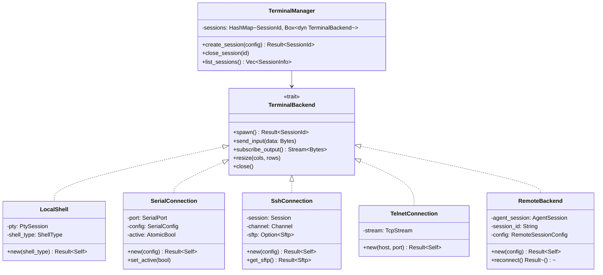

# termiHub Architecture Documentation

> Based on the [arc42](https://arc42.org) template for software architecture documentation.

---

## Table of Contents

1. [Introduction and Goals](#1-introduction-and-goals)
2. [Architecture Constraints](#2-architecture-constraints)
3. [Context and Scope](#3-context-and-scope)
4. [Solution Strategy](#4-solution-strategy)
5. [Building Block View](#5-building-block-view)
6. [Runtime View](#6-runtime-view)
7. [Deployment View](#7-deployment-view)
8. [Cross-cutting Concepts](#8-cross-cutting-concepts)
9. [Architecture Decisions](#9-architecture-decisions)
10. [Quality Requirements](#10-quality-requirements)
11. [Risks and Technical Debts](#11-risks-and-technical-debts)
12. [Glossary](#12-glossary)

---

## 1. Introduction and Goals

### Requirements Overview

**termiHub** is a modern, cross-platform terminal hub designed for embedded development workflows. It provides a VS Code-like interface for managing multiple terminal connections with support for split views, drag-and-drop tabs, and organized connection management.

**Core capabilities:**

- **Multiple terminal types** — Local shells (zsh, bash, cmd, PowerShell, Git Bash), SSH, Telnet, and Serial
- **VS Code-inspired UI** — Activity bar, sidebar, split view support
- **Drag-and-drop tab management** — Up to 40 concurrent terminals
- **Connection organization** — Folder hierarchies with import/export
- **SSH file browser** — Drag-and-drop file transfer via SFTP
- **Session persistence** — Reconnect capabilities for remote connections
- **Cross-platform** — Windows, Linux, macOS

**Target use case:** Embedded development where local shells build the product, serial connections interface with test targets, remote Raspberry Pi agents maintain persistent sessions overnight, and file transfer between development machine and test targets is seamless.

### Quality Goals

| Priority | Quality Goal | Description |
|----------|-------------|-------------|
| 1 | Cross-platform | Run identically on Windows, Linux, and macOS |
| 2 | Performance | Support 40 concurrent terminals without degradation |
| 3 | Extensibility | Add new terminal types with minimal code changes |
| 4 | Reliability | Handle disconnections, reconnections, and errors gracefully |
| 5 | Usability | VS Code-familiar interface with minimal learning curve |

### Stakeholders

| Role | Contact | Expectations |
|------|---------|-------------|
| Creator / Lead Developer | Arne Maximilian Richter | Full-featured terminal hub for embedded development workflows |
| Embedded Developers | (Target users) | Reliable multi-protocol terminal with organized connections and file transfer |
| Contributors | (Open source) | Clear architecture, coding standards, and contribution workflow |

---

## 2. Architecture Constraints

### Technical Constraints

| Constraint | Rationale |
|-----------|-----------|
| **Tauri 2.x** as application framework | Small binary (~5 MB vs Electron's ~100 MB), lower memory footprint, Rust backend for performance and safety |
| **React 18 + TypeScript** for frontend | Mature ecosystem, best-in-class drag-and-drop (dnd-kit) and split view (react-resizable-panels) libraries |
| **Rust** for backend | Memory safety, cross-platform PTY/serial/SSH support, async I/O via tokio |
| **Windows 10 1809+** minimum | Required for ConPTY (Windows pseudo-terminal) support |
| **No credential encryption** (Phase 1) | Avoids platform keychain complexity; SSH passwords are prompted at connection time |

### Organizational Constraints

| Constraint | Rationale |
|-----------|-----------|
| Single developer (initially) | Architecture must be simple enough for one person to maintain |
| MIT License | Permissive open-source for broad adoption |
| GitHub-based workflow | Issues, PRs, Actions for CI/CD |

### Convention Constraints

| Constraint | Detail |
|-----------|--------|
| Conventional Commits | All commit messages follow the `type(scope): subject` format |
| Keep a Changelog | User-facing changes documented in CHANGELOG.md |
| Merge commits only | No squash or rebase merges — preserve full commit history |

---

## 3. Context and Scope

### Business Context

The following diagram shows termiHub in its operational environment — an embedded development workflow where a developer interacts with multiple systems simultaneously.


| Partner | Description |
|---------|-------------|
| **Developer** | Primary user interacting via keyboard and mouse |
| **Local OS** | Host operating system providing shells (bash, zsh, PowerShell, cmd, Git Bash) via PTY |
| **Serial Devices** | Embedded targets connected via USB-to-serial adapters |
| **SSH Servers** | Remote machines (build servers, Raspberry Pi test agents) accessed over SSH |
| **Telnet Servers** | Legacy network equipment accessed via Telnet |
| **File Systems** | Local and remote file systems for browsing and transfer |
| **Remote Agents** | Remote machines running `termihub-agent` for persistent shell sessions, serial proxy, file browsing, and system monitoring |

### Technical Context


| Channel | Technology | Format |
|---------|-----------|--------|
| Frontend ↔ Backend | Tauri IPC (commands + events) | JSON-serialized Rust structs |
| Backend → PTY | `portable-pty` crate (ConPTY on Windows, forkpty on Unix) | Raw bytes |
| Backend → Serial | `serialport` crate | Raw bytes |
| Backend → SSH | `ssh2` crate (libssh2) | SSH protocol (encrypted) |
| Backend → Telnet | `tokio::net::TcpStream` | Telnet protocol (IAC sequences) |
| Backend → Files | `std::fs` (local) / `ssh2::Sftp` (remote) | File I/O |

---

## 4. Solution Strategy

| Decision | Choice | Rationale |
|----------|--------|-----------|
| Application framework | **Tauri 2** over Electron | ~5 MB binary (vs ~100 MB), lower memory, Rust backend, native system integration |
| Frontend framework | **React 18** over Svelte | Larger ecosystem, mature dnd-kit and react-resizable-panels libraries, better AI-assisted development support |
| State management | **Zustand** | Minimal boilerplate, single store, no provider wrappers, good TypeScript support |
| Backend language | **Rust** | Memory safety, cross-platform PTY/serial/SSH, async I/O with tokio |
| Terminal rendering | **xterm.js** | Industry-standard terminal emulator, canvas-based rendering, add-on ecosystem |
| Backend extensibility | **Trait-based design** | `TerminalBackend` trait allows adding new terminal types without modifying the manager |
| IPC pattern | **Commands + Events** | Commands for request-response (create terminal, send input), events for streaming (terminal output) |
| Connection storage | **JSON files** | Simple, human-readable, no database dependency for Phase 1 |
| Credential handling | **Prompt at connection** | No encryption complexity in Phase 1; passwords are never persisted to disk |

---

## 5. Building Block View

### Level 1: System Overview


**Contained building blocks:**

| Building Block | Description |
|---------------|-------------|
| **React UI Layer** | Frontend application rendered in Tauri's WebView |
| **Tauri IPC Bridge** | Bidirectional communication layer between frontend and backend |
| **Terminal Manager** | Orchestrates terminal session lifecycle across all backend types |
| **Local Backends** | PTY, Serial, SSH, and Telnet implementations |
| **RemoteBackend** | Proxy to remote agent instances — implements `TerminalBackend` trait, forwarding I/O as JSON-RPC over SSH |
| **Remote Agent** | Standalone binary (`termihub-agent`) for persistent remote sessions, file browsing, and system monitoring. See [Remote Protocol](remote-protocol.md) for the protocol specification. |

### Level 2: Frontend Components


| Component | Location | Responsibility |
|-----------|----------|---------------|
| **Activity Bar** | `src/components/ActivityBar/` | Icon navigation (Connections, File Browser, Settings) |
| **Sidebar** | `src/components/Sidebar/` | Connection list, editor, file browser panels |
| **Terminal View** | `src/components/Terminal/` | Tab bar, split panels, xterm.js terminal instances |
| **App Store** | `src/store/appStore.ts` | Zustand store managing all frontend state |
| **API Service** | `src/services/api.ts` | Tauri command wrappers |
| **Event Service** | `src/services/events.ts` | Tauri event listeners and dispatcher |

### Level 2: Backend Modules

| Module | Location | Responsibility |
|--------|----------|---------------|
| **Terminal** | `src-tauri/src/terminal/` | Backend trait, manager, all terminal implementations |
| **Connection** | `src-tauri/src/connection/` | Config types, CRUD operations, file persistence |
| **Files** | `src-tauri/src/files/` | Local and SFTP file browsing, upload/download |
| **Monitoring** | `src-tauri/src/monitoring/` | SSH remote system monitoring (CPU, memory, disk, uptime) |
| **Commands** | `src-tauri/src/commands/` | Tauri IPC command handlers |
| **Events** | `src-tauri/src/events/` | Event emitters for terminal output streaming |
| **Utils** | `src-tauri/src/utils/` | Shell detection, env expansion, error helpers |

### Level 2: Agent Modules

The remote agent (`termihub-agent`) uses a **session daemon architecture** for shell persistence. Each shell session runs as an independent daemon process (`termihub-agent --daemon <session-id>`) that manages a PTY, a 1 MiB ring buffer for output replay, and a Unix domain socket for IPC. The agent connects to daemons as a client, forwarding I/O between the desktop (JSON-RPC) and the daemon (binary frame protocol).


| Module | Location | Responsibility |
|--------|----------|---------------|
| **Buffer** | `agent/src/buffer/` | Shared 1 MiB ring buffer used by session daemons and serial backend for output replay |
| **Daemon** | `agent/src/daemon/` | Binary frame protocol (`[type: 1B][length: 4B BE][payload]`) and session daemon process (PTY allocation, poll-based event loop, Unix socket listener) |
| **Shell** | `agent/src/shell/` | ShellBackend — agent-side daemon client for PTY shell sessions |
| **Docker** | `agent/src/docker/` | DockerBackend — Docker container sessions via daemon infrastructure |
| **SSH** | `agent/src/ssh/` | SshBackend — SSH jump host sessions via daemon infrastructure |
| **Serial** | `agent/src/serial/` | SerialBackend — direct serial port access with ring buffer (no daemon) |
| **Session** | `agent/src/session/` | SessionManager (create, attach, detach, close, recover), session types and snapshots, prepared connection definitions |
| **Files** | `agent/src/files/` | Connection-scoped file browsing (local filesystem, SFTP relay for SSH targets, Docker exec) |
| **Monitoring** | `agent/src/monitoring/` | System stats collection and parsing — CPU, memory, disk, network for agent host and jump targets |
| **Handler** | `agent/src/handler/` | JSON-RPC method dispatcher — routes requests to session, files, monitoring, and agent lifecycle handlers |
| **Protocol** | `agent/src/protocol/` | Protocol types (configs, capabilities, results, error codes) for all JSON-RPC methods |
| **State** | `agent/src/state/` | Session state persistence (`~/.config/termihub-agent/state.json`) for daemon recovery after agent restart |
| **IO** | `agent/src/io/` | Transport layer — stdio (production SSH mode) and TCP (development/test mode) |

**Planned extensions:** Docker container sessions, SSH jump host sessions, and an enhanced prepared connections model with folder hierarchy are designed but not yet fully integrated. See [Agent Concept](concepts/agent.md) for the complete design vision.

### Level 3: Terminal Backends



Each backend implements the same trait, so the `TerminalManager` can manage all session types uniformly. See [Adding a New Terminal Backend](contributing.md#adding-a-new-terminal-backend) in the contributing guide.

---

## 6. Runtime View

### Terminal Creation


### Output Streaming


### Input Handling


### SSH File Transfer


### Tab Drag-and-Drop Between Panels


### Remote Session Creation (via Agent)


### Session Reconnection

When the desktop reconnects after a disconnect, sessions are recovered from living daemon processes:


### Agent Update Flow


---

## 7. Deployment View

### Desktop Application


| Platform | Architectures | Installer Formats | Min OS Version |
|----------|--------------|-------------------|----------------|
| Windows | x64 | `.msi`, `.exe` | Windows 10 1809+ (ConPTY) |
| Linux | x64, ARM64 | `.deb`, `.AppImage` | WebKitGTK 4.1+ |
| macOS | x64 (Intel), ARM64 (Apple Silicon) | `.dmg` | macOS 10.15+ |

### CI/CD Pipeline

Three GitHub Actions workflows handle the build and release pipeline. See `.github/workflows/` for details.

| Workflow | Trigger | Purpose |
|----------|---------|---------|
| **Code Quality** | Push/PR to `main` | Linting, formatting, type checking, tests (all 3 OSes) |
| **Build** | Push/PR to `main` | Build Tauri app for all platforms |
| **Agent** | Push/PR to `main` | Agent crate formatting, linting, tests, ARM64 cross-compilation |
| **Release** | Tag `v*.*.*` | Create GitHub Release with platform installers |

See [Releasing](releasing.md) for the full release process.

### Development Scripts

The `scripts/` directory provides cross-platform helper scripts (`.sh` + `.cmd` variants) for common tasks: setup, dev server, build, test, format, quality checks, and clean. These mirror the CI checks locally. See [scripts/README.md](../scripts/README.md) for the full list.

### Remote Agent


The remote agent is a standalone Rust binary (`termihub-agent`) that runs on remote hosts — Raspberry Pis, build servers, NAS devices, or any Linux/macOS machine. It maintains persistent terminal sessions that survive desktop disconnects and agent restarts. Communication uses JSON-RPC 2.0 over NDJSON through an SSH stdio channel.

**Auto-deployment:** When the desktop connects to a host via SSH, it checks for `termihub-agent --version`. If the agent is missing or version-incompatible, the desktop detects the target architecture via `uname -m`, downloads the matching binary from GitHub Releases (or uses a bundled binary in development), uploads it via SFTP to `~/.local/bin/termihub-agent`, and starts it.

**Agent binary targets:**

| `uname -m` | Target | Use Case |
|-------------|--------|----------|
| `x86_64` | `linux-x86_64` | Linux build servers |
| `aarch64` | `linux-aarch64` | Raspberry Pi 4/5, ARM servers |
| `armv7l` | `linux-armv7` | Older Raspberry Pi models |
| `arm64` | `darwin-aarch64` | macOS ARM hosts |

**Platform constraint:** The session daemon architecture uses PTY, Unix domain sockets, and POSIX process APIs — it is Unix-only (`#[cfg(unix)]`). Windows agent support would require ConPTY + named pipes.

See [Remote Protocol](remote-protocol.md) for the full protocol specification and [Agent Concept](concepts/agent.md) for the complete design vision.

---

## 8. Cross-cutting Concepts

### Error Handling

**Rust backend:**
- `anyhow::Result<T>` for application code
- `thiserror` for custom error types in library-facing APIs
- Error propagation with `?` operator, context added with `.context("description")`
- No `.unwrap()` in production code — all mutex locks use proper error propagation

**TypeScript frontend:**
- Try-catch around all Tauri IPC calls
- Error display in terminal pane when connections fail (inline, not modal)
- Graceful degradation: a failed terminal doesn't crash the app

### Async Patterns

- **Tokio** runtime for all async operations in Rust
- **Bounded channels** (`sync_channel(64)`) for terminal output with backpressure
- **Output coalescing**: backend reads coalesce pending chunks (up to 32 KB) into a single IPC event
- **Task cancellation**: each terminal session owns its async tasks, cleaned up on close

### IPC Communication

```
Frontend → Backend:  Tauri Commands (request-response, JSON-serialized)
Backend → Frontend:  Tauri Events (push-based, JSON-serialized)
```

- **Commands** for actions: `create_terminal`, `send_input`, `resize_terminal`, `close_terminal`
- **Events** for streaming: `terminal-output` events routed by session ID
- **Singleton dispatcher**: frontend uses O(1) Map-based routing instead of per-terminal global listeners

### State Management

The frontend uses a single **Zustand** store (`src/store/appStore.ts`) managing:

- **Panel layout** — Recursive tree of horizontal/vertical splits
- **Tab state** — Active tab, dirty flags, colors, CWD tracking
- **Connection/folder persistence** — Saved connections and folder hierarchy
- **Sidebar** — Active view, collapsed state
- **SFTP sessions** — File browser state per SSH connection

### Terminal Rendering

- **xterm.js** renders to `<canvas>`, not DOM elements
- **`@xterm/addon-fit`** handles terminal resize to fill container
- **`requestAnimationFrame` batching** reduces rendering overhead for high-throughput output
- Canvas rendering makes DOM-based testing impossible; see [Testing Strategy](testing.md)

### Credential Storage

**Phase 1 (current):** No credential encryption. SSH passwords are prompted at connection time and never written to disk. Connection files store host, port, username, and key path only.

**Future:** Platform keychains (Windows Credential Manager, macOS Keychain, Linux Secret Service) with encryption at rest as a portability option.

---

## 9. Architecture Decisions

### ADR-1: React over Svelte

**Context:** Choosing a frontend framework for a complex desktop UI with drag-and-drop, split views, and terminal rendering.

**Decision:** React 18 with TypeScript.

**Rationale:**
- Mature ecosystem with production-ready libraries (dnd-kit, react-resizable-panels, react-virtuoso)
- Better tooling for complex drag-and-drop interactions
- Larger community and more examples for AI-assisted development
- Better knowledge base for Claude Code contributions

**Trade-off:** Larger bundle size and more boilerplate compared to Svelte.

### ADR-2: Tauri over Electron

**Context:** Choosing a desktop application framework for a cross-platform terminal hub.

**Decision:** Tauri 2.x with Rust backend.

**Rationale:**
- ~5 MB binary vs Electron's ~100 MB
- Lower memory footprint (single WebView vs bundled Chromium)
- Rust backend provides memory safety and native performance
- Native system integration (serial ports, PTY, file system)

**Trade-off:** Smaller ecosystem than Electron, platform-specific WebView rendering differences.

### ADR-3: Trait-Based Backend

**Context:** Supporting multiple terminal types (PTY, serial, SSH, telnet, remote agent) with a unified management interface.

**Decision:** Rust `TerminalBackend` trait with one implementation per terminal type.

**Rationale:**
- Adding new terminal types requires only implementing the trait
- `TerminalManager` manages all types through a single `Box<dyn TerminalBackend>`
- Future remote backend can be added without modifying existing code
- Enables mock implementations for testing

### ADR-4: Zustand for State Management

**Context:** Managing complex frontend state (panel trees, tabs, connections, file browser) in a React application.

**Decision:** Zustand with a single store.

**Rationale:**
- Minimal boilerplate (no providers, reducers, or action creators)
- Excellent TypeScript support
- Single store simplifies state access and debugging
- No context provider wrappers needed

### ADR-5: E2E System Tests Run in Docker (Linux Only)

**Context:** Tauri's `tauri-driver` (the WebDriver proxy for E2E tests) only supports Linux (WebKitGTK) and Windows (Edge WebView2). On macOS, it prints "not supported on this platform" and exits because Apple provides no WKWebView driver — `safaridriver` only controls Safari the browser, not WKWebView instances embedded in apps. This is a known Tauri limitation ([tauri-apps/tauri#7068](https://github.com/tauri-apps/tauri/issues/7068)) with no upstream fix expected.

**Decision:** Run E2E system tests inside a Docker container with a Linux environment (Xvfb + WebKitGTK + WebKitWebDriver + tauri-driver). This allows developers on macOS to run the full E2E suite locally via `./scripts/test-system.sh` without needing a CI service.

**Rationale:**

- Docker is already used for test infrastructure (SSH/Telnet servers, virtual serial ports)
- Runs locally without external cloud services or CI
- Tests the Linux build of the app, which shares the same React UI and Rust backend logic
- Developers on Linux can also run E2E tests natively without Docker

**Trade-off:** Tests run against the Linux build, not the native macOS build. macOS-specific rendering behavior (WKWebView quirks) must be verified via manual testing. See [Manual Testing](manual-testing.md).

**Future consideration:** The experimental [danielraffel/tauri-webdriver](https://github.com/danielraffel/tauri-webdriver) project (Feb 2026) provides a WKWebView WebDriver via a Tauri plugin. If it matures, it could enable native macOS E2E testing without Docker. Evaluate periodically.

### ADR-6: No Credential Encryption in Phase 1

**Context:** SSH connections require authentication credentials.

**Decision:** Prompt for passwords at connection time; never persist passwords to disk.

**Rationale:**
- Avoids platform keychain complexity across three OSes
- Key-based authentication (recommended) doesn't require password storage
- Clear security boundary: connection files are safe to share/commit
- Future phases will add platform keychain integration

---

## 10. Quality Requirements

### Quality Requirements Overview


### Quality Scenarios

| Scenario | Quality | Stimulus | Response | Measure |
|----------|---------|----------|----------|---------|
| High terminal count | Performance | User opens 40 terminals | All terminals remain responsive | UI interaction latency < 100ms |
| Connection failure | Reliability | SSH server becomes unreachable | Error shown in terminal, app stays stable | No crash, clear error message |
| New protocol | Extensibility | Developer adds WebSocket backend | Only new files + manager registration needed | < 3 existing files modified |
| Cross-platform use | Portability | User runs on Linux after using on Windows | Same features and behavior | All connection types available |
| First-time user | Usability | User familiar with VS Code opens termiHub | Can create and manage terminals | No documentation needed for basic use |

---

## 11. Risks and Technical Debts

| Risk / Debt | Description | Mitigation |
|-------------|-------------|------------|
| **No credential encryption** | SSH passwords are prompted but key paths are stored in plaintext connection files | Phase 2: platform keychain integration. Key-based auth recommended. |
| **ConPTY dependency** | Windows PTY requires Windows 10 1809+ | Document minimum version; fail gracefully on older Windows |
| **xterm.js canvas testing** | Terminal renders to `<canvas>`, invisible to DOM-based test tools | Manual testing plan ([manual-testing.md](manual-testing.md)); E2E tests cover surrounding UI |
| **WebView rendering differences** | Tauri uses platform WebView (Edge/WebKitGTK/WebKit) with subtle CSS differences | CI builds on all 3 OSes; test matrix for visual regression |
| **libssh2 limitations** | `ssh2` crate wraps libssh2 which has occasional compatibility issues with newer SSH servers | Monitor upstream issues; consider `russh` migration if needed |
| **Single-threaded IPC** | Tauri commands run on the main thread by default | Heavy operations use `tauri::async_runtime::spawn` |
| **Session limit** | Hard cap at 50 concurrent terminals (desktop), 20 concurrent sessions (agent) | Sufficient for target use case; can be raised if needed |
| **No automated cross-platform tests for serial** | Serial tests require physical hardware | Docker-based virtual serial via socat in `examples/` |
| **No native macOS E2E tests** | `tauri-driver` does not support macOS (no WKWebView driver exists); E2E tests run in Docker against the Linux build | Manual testing for macOS-specific behavior; evaluate [danielraffel/tauri-webdriver](https://github.com/danielraffel/tauri-webdriver) as it matures (see ADR-5) |
| **Agent Unix-only daemon architecture** | Session daemons use PTY, Unix domain sockets, and POSIX process APIs — no Windows agent support | Agent targets are Linux/macOS remote hosts; Windows agent would require ConPTY + named pipes |
| **Agent state.json not crash-safe** | Agent state is persisted as plain JSON; a crash mid-write could corrupt the file | Acceptable trade-off — daemon sockets provide independent recovery path even if state.json is lost |

---

## 12. Glossary

| Term | Definition |
|------|-----------|
| **PTY** | Pseudo-terminal — a virtual terminal device that provides a bidirectional communication channel, used to run shell processes |
| **ConPTY** | Windows Console Pseudo Terminal — Windows 10's pseudo-terminal API (available since build 1809) |
| **forkpty** | Unix system call that creates a new process with a pseudo-terminal attached |
| **SFTP** | SSH File Transfer Protocol — secure file transfer over an SSH connection |
| **IPC** | Inter-Process Communication — the mechanism Tauri uses for frontend-backend communication |
| **JSON-RPC** | JSON-based Remote Procedure Call protocol — used for desktop-to-agent communication |
| **NDJSON** | Newline-Delimited JSON — the framing format used for JSON-RPC messages between desktop and agent over SSH stdio |
| **IAC** | Interpret As Command — Telnet protocol escape sequence for control commands |
| **xterm.js** | Open-source terminal emulator component that renders to HTML5 canvas |
| **Tauri Command** | A Rust function exposed to the frontend via Tauri's IPC bridge (request-response pattern) |
| **Tauri Event** | A push-based message from backend to frontend via Tauri's event system |
| **Zustand** | Lightweight React state management library using hooks |
| **dnd-kit** | React drag-and-drop toolkit used for tab reordering and panel splitting |
| **WebView** | Platform-native web rendering component (Edge WebView2 on Windows, WebKitGTK on Linux, WebKit on macOS) |
| **Session Daemon** | Independent process (`termihub-agent --daemon <id>`) that manages a single PTY session, surviving agent restarts via Unix domain socket reconnection |
| **Binary Frame Protocol** | Length-prefixed IPC protocol (`[type: 1B][length: 4B BE][payload]`) used between the agent and session daemons over Unix domain sockets |
| **Ring Buffer** | Fixed-size circular buffer (1 MiB default) used by session daemons and the serial backend to store terminal output for replay on client attach |
| **Backpressure** | Flow control mechanism where bounded channels prevent fast producers from overwhelming slow consumers |

---

*This document follows the [arc42](https://arc42.org) template. For contribution guidelines, see [Contributing](contributing.md). For testing details, see [Testing Strategy](testing.md).*
