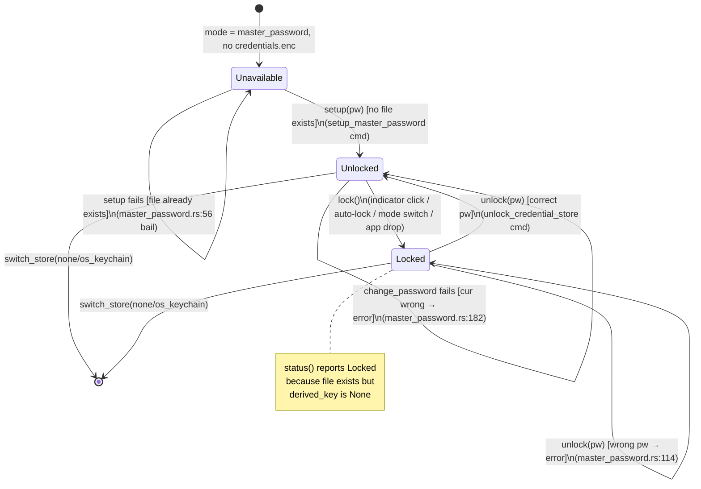
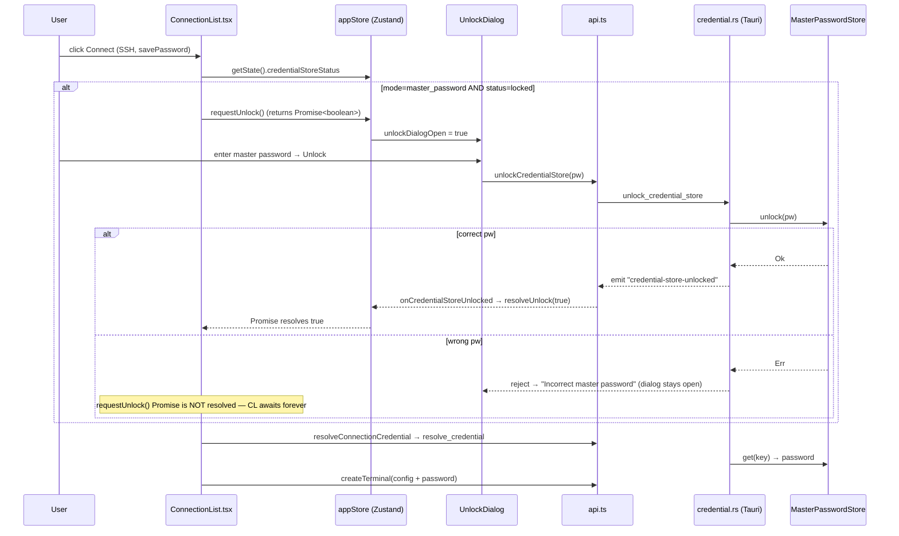
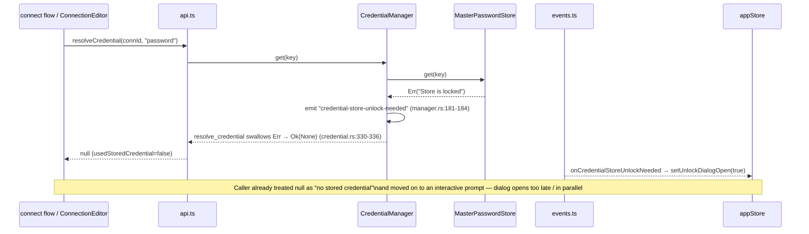
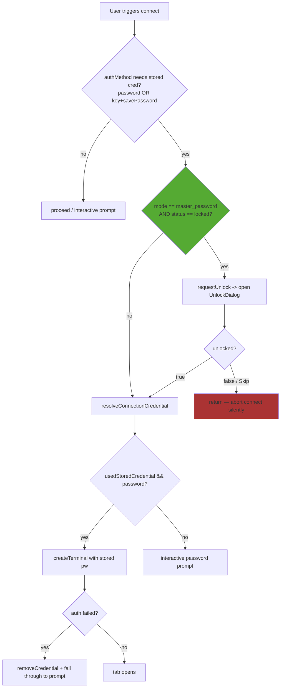

# Credential Store State Machine — Audit

> **Issue:** #1133 — Audit + fix the credential store state machine (locked / unlocked / master-password)
> **Scope:** Credential store lifecycle (no-store → initialized → locked → unlocked) + connect-flow unlock gating
> **Deliverable:** Audit findings only — analysis, diagrams, and prioritized gaps. No production code changes.

## 1. Where the state lives

The credential store is a three-mode machine. The **mode** (`master_password` / `os_keychain` / `none`) is orthogonal to the **status** (`unlocked` / `locked` / `unavailable`); only `master_password` mode has a meaningful lock/unlock lifecycle.

| Concept                       | Rust type                                                                            | file:line                                             |
| ----------------------------- | ------------------------------------------------------------------------------------ | ----------------------------------------------------- |
| Store status enum             | `CredentialStoreStatus::{Unlocked, Locked, Unavailable}`                             | `src-tauri/src/credential/types.rs:60-68`             |
| Storage mode enum             | `StorageMode::{MasterPassword, OsKeychain, None}`                                    | `src-tauri/src/credential/types.rs:71-80`             |
| Status derivation (master pw) | `status()` — unlocked if key in memory, else Locked if file exists, else Unavailable | `src-tauri/src/credential/master_password.rs:349-357` |
| In-memory secret state        | `derived_key` / `credentials` / `salt` (all `RwLock<Option<…>>`)                     | `src-tauri/src/credential/master_password.rs:29-34`   |
| Frontend mirror               | `credentialStoreStatus: CredentialStoreStatusInfo \| null` (Zustand)                 | `src/store/appStore.ts:691, 4087`                     |
| Demand-unlock promise         | `unlockResolve` + `requestUnlock()` / `resolveUnlock()`                              | `src/store/appStore.ts:696-705, 4107-4118`            |

**Transitions** (each `set` of the master-password store's in-memory state):

- `setup()` — creates file + loads empty map into memory → **Unlocked** (`master_password.rs:55-80`)
- `unlock()` — decrypts file into memory → **Unlocked** (`master_password.rs:84-134`)
- `lock()` — zeroizes + clears memory → **Locked** (`master_password.rs:137-155`), also fired by `Drop` (`:360-364`), auto-lock timer (`auto_lock.rs:174`), and `switch_store` (`manager.rs:73-75`)
- `change_password()` — re-derives key, re-encrypts (stays **Unlocked**) (`master_password.rs:167-205`)

**Guards / reads** (gate other transitions or rendering):

- `resolveConnectionCredential` connect gate: `credStatus?.mode === "master_password" && credStatus?.status === "locked"` (`ConnectionList.tsx:484`, `AgentNode.tsx:607`, `AgentErrorTab.tsx:41`, `appStore.ts:3873`)
- Indicator render branch: `status.status === "locked"` (`CredentialStoreIndicator.tsx:22, 50`)

---

## 2. Lifecycle diagrams

### 2.1 Master-password mode lifecycle



### 2.2 Mode machine (top-level, orthogonal to lock state)

```mermaid
stateDiagram-v2
    [*] --> None : default (StorageMode::None)

    None --> MasterPassword : switch_credential_store("master_password", pw)\n[setup or unlock existing file]
    None --> OsKeychain : switch_credential_store("os_keychain")
    MasterPassword --> None : switch(none) [creds removed]
    MasterPassword --> OsKeychain : switch(os_keychain) [creds migrated]
    OsKeychain --> None : switch(none)
    OsKeychain --> MasterPassword : switch(master_password, pw)

    state None {
        [*] --> Unavailable_None : status always Unavailable
    }
    state OsKeychain {
        [*] --> Unlocked_OS : status always Unlocked (OS-gated)
    }
    state MasterPassword {
        [*] --> mp : see lifecycle diagram 2.1
    }
```

Note: `NullStore.status()` is always `Unavailable` (`null.rs:33-35`); `OsKeychainStore.status()` is always `Unlocked` (`os_keychain.rs:119-121`) — neither has an in-app lock state.

---

## 3. Sequence diagrams

### 3.1 Unlock-gated connect (sidebar happy path)



### 3.2 Demand-driven unlock (locked store hit during resolve)



### 3.3 Master-password set / change

```mermaid
sequenceDiagram
    participant U as User
    participant SS as SecuritySettings.tsx
    participant API as api.ts
    participant Cmd as credential.rs
    participant Mgr as CredentialManager
    participant MP as MasterPasswordStore

    rect rgb(40,50,60)
    Note over U,MP: SET (via mode switch to master_password)
    U->>SS: select "Master Password" + enter pw twice
    SS->>API: switchCredentialStore("master_password", pw)
    API->>Cmd: switch_credential_store
    Cmd->>Mgr: switch_store(MasterPassword)
    Cmd->>MP: has_file ? unlock(pw) : setup(pw)
    Cmd->>Mgr: migrate old creds → set(key,val)
    Cmd-->>SS: emit status-changed → Unlocked
    end

    rect rgb(50,40,50)
    Note over U,MP: CHANGE
    U->>SS: Change Master Password (cur,new)
    SS->>API: changeMasterPassword(cur,new)
    API->>Cmd: change_master_password
    Cmd->>MP: change_password(cur,new)
    alt cur correct
        MP-->>SS: Ok → resetChangePasswordDialog()
        Note over SS: NO success toast — silent
    else cur wrong
        MP-->>SS: Err "Current password is incorrect" (inline error)
    end
    end
```



---

## 4. Credential-unlock gating decision (flowchart)



The green node is the gate that **three of four** connect call sites implement (`ConnectionList`, `AgentNode`, `AgentErrorTab`, `openWorkspace`) but **ConnectionEditor "Save & Connect" does not** (Gap G3).

---

## 5. Prioritized gap list

Ranked stuck/leak/data-loss first.

### G1 — `requestUnlock()` promise hangs forever on wrong password (STUCK) 🔴

- **State/transition:** `Locked --unlock[wrong pw]--> Locked`; the connect caller is awaiting `requestUnlock()`.
- **file:line:** `UnlockDialog.tsx:38-40` (on error only sets inline error, never resolves the promise), `useCredentialStoreEvents.ts:34-40` (only `onCredentialStoreUnlocked` → `resolveUnlock(true)`), `appStore.ts:4108-4111`.
- **Symptom:** User clicks Connect on a locked store, the unlock dialog opens, they type the wrong password, get "Incorrect master password", then close the dialog with the **X / overlay click** (not the Skip button). If that dismissal doesn't route through `setUnlockDialogOpen(false)`'s cancel path, the awaiting connect promise never settles — the connect action is wedged with no feedback. Even via Skip it works, but the "retry wrong password then give up" path is fragile: the only thing that resolves `true` is the backend `unlocked` event; the only thing that resolves `false` is `setUnlockDialogOpen(prevOpen && !open)`.
- **Smallest fix:** Guarantee every dialog exit resolves the pending promise exactly once. Have `UnlockDialog.handleUnlock` success/`handleSkip` both funnel through `onOpenChange`, and make `resolveUnlock` idempotent (it already clears `unlockResolve`, so a double-call is safe). Confirm Modal's overlay/Esc close also calls `onOpenChange(false)`.

### G2 — Demand-driven unlock fires too late and is swallowed (STUCK / silent) 🔴

- **State/transition:** `Locked` hit inside `resolve_credential`; `get()` emits `credential-store-unlock-needed` **after** returning `Ok(None)`.
- **file:line:** `manager.rs:181-184` (emit on error), `credential.rs:330-336` (`resolve_credential` maps the locked-store `Err` to `Ok(None)`), `resolveConnectionCredential.ts:36-47` (catches / treats null as "not found").
- **Symptom:** In any path that calls `resolveCredential` **without** the pre-check gate (notably ConnectionEditor, G3), a locked store returns "no credential", so the caller proceeds to an interactive password prompt — **while** the unlock-needed event asynchronously opens the UnlockDialog on top. The user sees two overlapping prompts, or unlocks the store but the connect already fell back to manual entry. The store status field and the actual store state momentarily disagree (the `get` proved it's locked, but nothing updated `credentialStoreStatus` to Locked).
- **Smallest fix:** Make the emit path drive the gate: either (a) have `resolve_credential` surface a distinct "locked" result the frontend can await on, or (b) always run the `mode===master_password && status===locked` pre-check gate before `resolveCredential` at every call site (see G3), so the demand-driven emit becomes a redundant safety net rather than the primary trigger.

### G3 — ConnectionEditor "Save & Connect" has no unlock gate (silent fallback) 🔴

- **State/transition:** Missing `Locked --> requestUnlock` edge on the editor's connect path.
- **file:line:** `ConnectionEditor.tsx:797-816` resolves the credential and, if null, jumps straight to `requestPassword`. No `credentialStoreStatus?.status === "locked"` check exists on this path (grep at `ConnectionEditor.tsx` shows `credentialStoreStatus` only used for `.mode`, never `.status`).
- **Symptom:** With master-password mode **locked**, "Save & Connect" silently ignores the saved credential and prompts for a password every time — the user's stored secret appears "lost" until they manually lock/unlock via the indicator. Inconsistent with the sidebar path.
- **Smallest fix:** Add the same gate the other three sites use before `resolveConnectionCredential` (`ConnectionList.tsx:480-488` is the template): if locked, `await requestUnlock()` and abort on `false`.

### G4 — `change_master_password` requires unlocked but no unlock prompt; dead-end when locked 🟠

- **State/transition:** `change_password` guarded by `Store is locked — cannot change password` but nothing transitions Locked→Unlocked first.
- **file:line:** `master_password.rs:172-183` (both `salt`/`derived_key` reads `.context("Store is locked …")`), `SecuritySettings.tsx:161-185` and `MasterPasswordSetup.tsx:71` (surface the raw error inline).
- **Symptom:** If the store auto-locked (or user locked it) and they open Settings → Change Master Password, submitting yields "Store is locked — cannot change password" with **no unlock affordance in the dialog**. Dead-end: user must know to close, click the status-bar indicator to unlock, reopen Settings.
- **Smallest fix:** Disable / gate the "Change Master Password" button when `status === "locked"` and show "Unlock first" (or auto-open the unlock dialog on submit-while-locked).

### G5 — No success feedback on unlock-gated actions / change-password (feedback gap) 🟠

- **file:line:** `SecuritySettings.tsx:180-181` (change password success just closes the dialog — no toast), `switch_credential_store` migration result shows inline text but no toast (`SecuritySettings.tsx:300-314`), `CredentialStoreIndicator.tsx:24-30` (lock action has no success feedback; error only `console.error`, violating the "use LogViewer/toast, never console" rule).
- **Symptom:** User changes the master password or clicks the indicator to lock and gets no confirmation the mutating action succeeded. Violates design-system rule 4 ("every action gives feedback"). `UnlockDialog` does `toast.success` (`:36`) — the rest are inconsistent.
- **Smallest fix:** Add `toast.success()` on change-password, lock, and switch; replace the `console.error` at `CredentialStoreIndicator.tsx:28` with a recoverable `toast.error()`.

### G6 — `unlock` "already unlocked" is an error string, not a benign no-op (race) 🟠

- **file:line:** `credential.rs:59-61` returns `Err("Store is already unlocked")`.
- **Symptom:** Two connect flows race: both see `status === locked`, both open/await unlock (or one unlocks via the auto-lock-cleared event while the other's dialog submits). The second `unlock_credential_store` returns an error, surfacing "Store is already unlocked" as an "Incorrect master password" style failure in `UnlockDialog.tsx:38` (its catch is generic). The store is actually fine.
- **Smallest fix:** Treat already-unlocked as `Ok(())` (idempotent) and still emit `credential-store-unlocked` so any awaiting `requestUnlock()` resolves.

### G7 — Auto-lock while a session is mid-connect / holding secrets (ambiguous timing) 🟡

- **file:line:** `auto_lock.rs:166-186` locks purely on inactivity; `record_activity()` is only called on store `get/set/remove/list` (`manager.rs:186, 199, 211, 223, 235`), **not** on live terminal I/O.
- **Symptom:** During a long interactive SSH session that used a stored credential once at connect, no further credential reads occur, so the auto-lock timer expires and locks the store underneath the user. The next reconnect/new-tab then hits a locked store. Not a leak, but the "unlocked" indicator flips to "Locked" with only a silent status refresh (`useCredentialStoreEvents.ts:30-32`) — no toast telling the user why their next connect will re-prompt.
- **Smallest fix:** Emit a low-key toast on auto-lock ("Credential store auto-locked after inactivity"), and consider treating an active session as activity, or document that auto-lock is credential-access-based by design.

### G8 — Wrong-password attempt count / lockout absent; no distinction corrupt-vs-wrong (ambiguous state) 🟡

- **file:line:** `master_password.rs:114` collapses "wrong password" and "corrupted file" into one message; `UnlockDialog.tsx:38-39` further flattens all errors to "Incorrect master password."
- **Symptom:** A genuinely corrupted `credentials.enc` reports "Incorrect master password", sending the user down an infinite wrong-password loop with no path to recovery/reset. There's a `RecoveryDialog` in `App.tsx:281` but it's wired to switch-store migration warnings, not to unlock corruption.
- **Smallest fix:** Distinguish decrypt-failure (auth) from parse/version failure (corruption) and surface a "reset store" affordance for the latter.

---

## 6. Missing controls

Controls the correct machine needs but the UI doesn't expose, each tied to the transition it would fire:

| Missing control                                                    | Where it belongs                                                                                                                                                                                                | Transition it fires                                                                                                                                  |
| ------------------------------------------------------------------ | --------------------------------------------------------------------------------------------------------------------------------------------------------------------------------------------------------------- | ---------------------------------------------------------------------------------------------------------------------------------------------------- |
| **Unlock affordance inside Change-Password dialog**                | `SecuritySettings.tsx` change-password inline dialog                                                                                                                                                            | `Locked --> Unlocked` before `change_password` (fixes G4 dead-end)                                                                                   |
| **"Retry" vs "Reset store" on unlock failure**                     | `UnlockDialog.tsx` error state                                                                                                                                                                                  | `Locked --unlock--> Unlocked` (retry) / `Locked --> Unavailable` (reset corrupt file, G8)                                                            |
| **Success toast on lock / change-password / switch**               | `CredentialStoreIndicator.tsx`, `SecuritySettings.tsx`                                                                                                                                                          | Observable feedback for `Unlocked-->Locked` and `change_password` (G5)                                                                               |
| **Explicit "Set up master password" entry point when Unavailable** | Currently only reachable via mode-switch radio (`SecuritySettings.tsx:113`); `openMasterPasswordSetup`/`MasterPasswordSetup` modal exists (`appStore.ts:4119-4123`, `App.tsx:274`) but has **no trigger** wired | `Unavailable --setup--> Unlocked` (the `MasterPasswordSetup` modal is effectively orphaned UI — no `openMasterPasswordSetup("setup")` caller exists) |
| **Auto-lock notification**                                         | status-bar / toast on `credential-store-locked`                                                                                                                                                                 | Make `Unlocked --auto-lock--> Locked` observable (G7)                                                                                                |
| **Idempotent unlock guard**                                        | `credential.rs:59`                                                                                                                                                                                              | Removes the spurious `Unlocked --> error` self-edge on races (G6)                                                                                    |

### Orphan-UI finding

`MasterPasswordSetup` modal + its store actions `openMasterPasswordSetup` / `masterPasswordSetupOpen` (`appStore.ts:706-708, 4119-4123`) are mounted in `App.tsx:274` but **no code calls `openMasterPasswordSetup`** — it is an unreachable state / dead control. Master-password setup happens instead through `SecuritySettings`'s inline dialog + `switchCredentialStore`. Either wire a trigger to it or remove it; today it is duplicate, unreachable setup UI.

---

## 7. Summary

The core Rust state machine (`MasterPasswordStore` status derivation, zeroize-on-lock, atomic file writes, auto-lock timer) is sound and well-tested. The defects are concentrated at the **UI↔state seams**:

1. **Promise-based unlock gating is fragile** — `requestUnlock()` can hang (G1) and the demand-driven `unlock-needed` event fires after the credential has already been reported missing (G2).
2. **Inconsistent gating across the four connect entry points** — ConnectionEditor lacks the lock pre-check the other three have (G3).
3. **Dead-ends** — change-password while locked (G4), corrupt-file unlock loop (G8).
4. **Feedback gaps** — silent lock/change/switch, `console.error` instead of toast (G5, G7).
5. **Race edge** — "already unlocked" surfaces as an error (G6).
6. **Orphan setup UI** — `MasterPasswordSetup` modal has no trigger.

Highest-leverage fix: unify all four connect paths behind one gating helper that (a) checks `mode===master_password && status===locked`, (b) `await requestUnlock()` with a promise guaranteed to settle on every dialog exit, and (c) makes `unlock`/`resolve_credential` idempotent and lock-aware — which collapses G1, G2, G3, and G6 into a single corrected transition.
