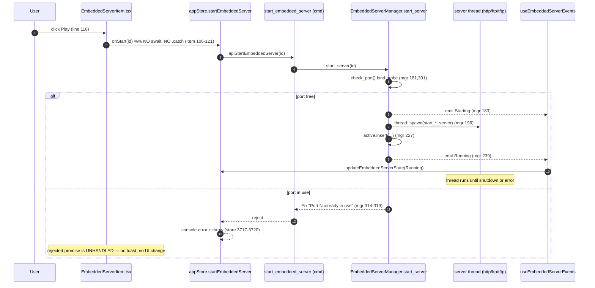
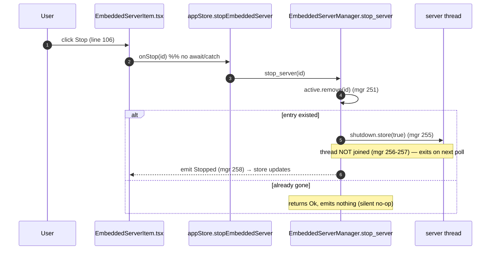
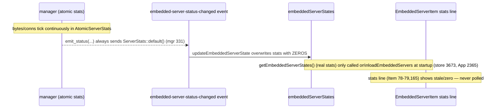

# Embedded Servers State Machine — Audit

> **Issue:** #1134 — Audit + fix the embedded servers state machine (HTTP / FTP / TFTP start / stop / error)
> **Scope:** Embedded server lifecycle (stopped → starting → running → stopping → error) per server type
> **Deliverable:** Audit findings only — analysis, diagrams, and prioritized gaps. No production code changes.

## 1. Where the state lives

| Layer                  | Location                                                                                                          | Role                                                                                                               |
| ---------------------- | ----------------------------------------------------------------------------------------------------------------- | ------------------------------------------------------------------------------------------------------------------ |
| Status enum            | `src-tauri/src/embedded_servers/config.rs:56-62` — `ServerStatus { Stopped, Starting, Running, Stopping, Error }` | Canonical state vocabulary                                                                                         |
| Runtime state struct   | `config.rs:75-85` — `ServerState { server_id, status, error, stats, started_at }`                                 | What the frontend receives                                                                                         |
| Active-server registry | `server_manager.rs:37` — `active: Mutex<HashMap<String, ActiveServer>>`                                           | The _real_ source of truth: a config is "running" iff it has an entry here (`get_states`, `server_manager.rs:122`) |
| Per-server error slot  | `server_manager.rs:28` — `error: Arc<Mutex<Option<String>>>`                                                      | Error text set by the server thread on failure                                                                     |
| Frontend cache         | `src/store/appStore.ts:655,3668` — `embeddedServerStates: Record<string, ServerState>`                            | Zustand mirror driving the sidebar                                                                                 |
| Event push             | `server_manager.rs:326-337` `emit_status` + `216` (thread error) → `"embedded-server-status-changed"`             | Backend → UI notification                                                                                          |
| Event receiver         | `src/hooks/useEmbeddedServerEvents.ts:16` → `updateEmbeddedServerState` (`appStore.ts:3732`)                      | Applies pushed state, mounted in `App.tsx:100`                                                                     |

**Key structural fact:** the `ServerStatus` enum has **5 variants but only 3 are ever produced at runtime**. `Starting` is emitted then immediately overwritten by `Running` in the same synchronous call (`start_server`, `server_manager.rs:183` then `:239`), and `Stopping` is **never emitted anywhere** (grep confirms `Stopping` appears only at its definition, `config.rs:60`). So the true runtime machine is `Stopped ⇄ Running`, plus a transient `Error`.

## 2. Lifecycle state diagram (as-built)

```mermaid
stateDiagram-v2
    [*] --> Stopped : config saved / loaded from disk
    Stopped --> Running : start_server() ok\n[check_port passes, not already active]
    Stopped --> Stopped : start_server() Err\n[check_port fails — port in use]\n(command rejects; no state change, no event)
    Running --> Error : server thread returns Err\n(thread emits Error asynchronously)
    Running --> Stopped : stop_server()\n(shutdown flag set, entry removed)
    Error --> Stopped : stop_server()\n[entry still in active map]
    Error --> Running : start_server()?\n[BLOCKED — active.contains_key ⇒ "already running"]
    Stopped --> [*] : delete_config()

    note right of Running
      Emitted transiently but never
      observed: Starting (overwritten
      by Running same call), Stopping
      (never emitted at all)
    end note
```



### Per-type differences

The lifecycle is identical across HTTP/FTP/TFTP at the manager level — the only branch is which `start_*_server` runs (`server_manager.rs:197-201`). The **teardown semantics differ per type**, which is where correctness diverges:

```mermaid
stateDiagram-v2
    direction LR
    state "Running (thread)" as R
    state HTTP {
        [*] --> httpServe : axum::serve + graceful_shutdown
        httpServe --> httpGone : polls shutdown flag every 100ms\n(http_server.rs:203-210) ✅ exits
    }
    state FTP {
        [*] --> ftpServe : libunftp listen + tokio::select! poll_shutdown
        ftpServe --> ftpGone : poll_shutdown every 50ms\n(ftp_server.rs:76,84-91) ✅ select! cancels listen
    }
    state TFTP {
        [*] --> tftpListen : recv_from loop, 100ms read timeout
        tftpListen --> tftpGone : checks shutdown each loop\n(tftp_server.rs:52-55) ✅ main loop exits
        tftpListen --> tftpLeak : per-transfer threads spawned\n(tftp_server.rs:85,99) ⚠️ NOT tracked, NOT signalled
    }
```

- **HTTP** — graceful; `with_graceful_shutdown` drains then returns (`http_server.rs:202-212`).
- **FTP** — graceful; `tokio::select!` cancels `server.listen` when `poll_shutdown` wins (`ftp_server.rs:72-79`). Note libunftp's own client connections are dropped when the runtime is dropped at thread exit.
- **TFTP** — the **listen loop** exits, but each RRQ/WRQ is handled in a **detached `std::thread::spawn`** (`tftp_server.rs:85,99`) that binds its own ephemeral socket and never sees the shutdown flag. An in-flight transfer keeps running (up to its 5×5s ACK timeout, `tftp_server.rs:135,178`) after the server reports `Stopped`.

## 3. Start-flow sequence (UI → store → command → manager → thread)



**Two critical race/feedback problems visible here:**

1. **TOCTOU port race** — `check_port` binds a probe socket and immediately drops it (`server_manager.rs:305-320`), _then_ the server thread binds again later (`http_server.rs:194`, `tftp_server.rs:38`, libunftp `listen`). Between the probe and the real bind the port can be taken. If the real bind then fails, HTTP/TFTP surface it via the async `Error` event (`server_manager.rs:203-217`), but the manager has **already emitted `Running`** (`:239`) and inserted into `active`. Result: the item shows Running, then flips to Error, but is stuck-"active" (see Gap G2).

2. **Silent start failure** — the store re-throws (`appStore.ts:3719`) but `EmbeddedServerItem` calls `onStart(config.id)` with no `.catch` (`EmbeddedServerItem.tsx:106-121`) and the sidebar passes the raw action (`EmbeddedServerSidebar.tsx:105`). A port-in-use rejection becomes an unhandled promise rejection with **zero user feedback** — the button just does nothing.

## 4. Stop-flow sequence



**No `Stopping` state is ever shown.** The manager jumps `Running → Stopped` synchronously (`server_manager.rs:258`) while the thread is still winding down. For TFTP with in-flight transfers, and briefly for HTTP/FTP, the OS resource is still held after the UI says "Stopped" — the port may not be immediately re-bindable, so an immediate restart can hit the check_port probe and fail (see Gap G3).

## 5. Stats-refresh gap (dead data)



`emit_status` hard-codes `stats: ServerStats::default()` (`server_manager.rs:331`) and `started_at: None` (`:332`), and the thread-error path also sends `ServerStats::default()` (`:213`). The only path that returns _real_ stats is `get_states` (`server_manager.rs:133`), reachable solely via `getEmbeddedServerStates` → `loadEmbeddedServers`, which runs **once at startup** (`appStore.ts:2365`). There is **no polling timer**, so the live "conn · ↑ ↓" line (`EmbeddedServerItem.tsx:78-79,165`) and `started_at` are effectively always zero/stale, and every status event _overwrites_ whatever was loaded with zeros.

---

## 6. Prioritized gap list

Ranked stuck/leak/data-loss first.

### G1 — TFTP transfer threads leak past shutdown _(leak)_

- **State/transition:** `Running → Stopped`, TFTP per-transfer threads.
- **file:line:** `tftp_server.rs:85` and `:99` (`std::thread::spawn`), no shutdown propagation; `server_manager.rs:256-257` deliberately does not join.
- **Symptom:** After the user stops (or quits the app) a TFTP server mid-transfer, detached threads keep a UDP socket + file handle open, spinning up to ~25s (5 retries × 5s, `tftp_server.rs:135,178`). Nothing in the UI or Open Connections shows them; the port can stay busy.
- **Smallest fix:** Pass the `shutdown` `Arc<AtomicBool>` into `handle_rrq`/`handle_wrq` and check it in the ACK-wait loops so transfers abort promptly; optionally track child handles and join on stop.

### G2 — Error state is a dead-end (no Retry, Start is blocked) _(stuck)_

- **State/transition:** `Error → Running` missing / blocked.
- **file:line:** `server_manager.rs:173-177` (`active.contains_key ⇒ "already running"`) — a failed server still has its `active` entry (it's only removed on `stop_server`), so `get_states` reports `Error` (`:124`) while `start_server` refuses to run. UI shows the Stop button for `error` status (`EmbeddedServerItem.tsx:48-49` treats `error`… actually `isActive` returns false for `error`, so it shows **Start**, which then rejects with "already running").
- **Symptom:** A server that failed at runtime (e.g. late bind failure) shows red with an error message and a Start button that silently fails; the only escape is Delete or Edit. No Retry.
- **Smallest fix:** On the async error path, remove the entry from `active` (or add a distinct `Failed` bookkeeping) so `Error → Stopped` is real, then Start works again; add a Retry control that fires `stop_server` then `start_server`.

### G3 — `Running` emitted before the bind actually succeeds; late failure desyncs _(stuck / wrong state)_

- **State/transition:** `Starting → Running` premature.
- **file:line:** `server_manager.rs:239` emits `Running` unconditionally right after `thread::spawn`, while the real bind happens later inside the thread (`http_server.rs:194`, `ftp_server.rs:73`, `tftp_server.rs:38`). `check_port` (`:181`) is a separate socket, so it does not guarantee the thread's bind succeeds (TOCTOU).
- **Symptom:** Item briefly shows green "Running", then flips to red "Error" (or, if the error event is missed, stays green while nothing is listening). User can't tell whether the server is up.
- **Smallest fix:** Have the server thread signal successful bind back (a `oneshot`/channel) and only emit `Running` on that signal; emit `Error` and drop the `active` entry on bind failure.

### G4 — Port-in-use start failure is completely silent in the UI _(feedback / data-loss-of-intent)_

- **State/transition:** `Stopped → Stopped` on `check_port` failure.
- **file:line:** `server_manager.rs:314-319` returns the error; `appStore.ts:3717-3720` re-throws; **but** `EmbeddedServerItem.tsx:106-121` and `EmbeddedServerSidebar.tsx:105` call `onStart`/`onStop` with no `.catch` and no toast.
- **Symptom:** User clicks Play on a server whose port is taken → nothing happens, no error, no toast. Violates the "every action gives feedback" design rule.
- **Smallest fix:** Wrap the start/stop handlers to `toast.error(err)` (mirror the port message from `server_manager.rs:307`) and reflect a transient pending state on the button.

### G5 — Manual Start has no port-fallback that the code already implements _(inconsistency)_

- **State/transition:** `Stopped → Running` via sidebar Play vs. `quickShareServer`.
- **file:line:** Sidebar Start → `apiStartEmbeddedServer` (plain, no fallback). The 10-port-fallback logic exists only in `create_and_start_server` (`commands/embedded_servers.rs:106-142`) used by `quickShareServer` (`appStore.ts:3750`).
- **Symptom:** Quick-share auto-avoids busy ports; the normal Start button does not — same operation, two behaviors. Confusing and makes G4 more likely to bite.
- **Smallest fix:** Either surface a clear "port busy" error (G4) or offer a "start on next free port" affordance; unify the two start paths.

### G6 — Stats and `started_at` are overwritten with zeros; never polled _(data-loss / stale UI)_

- **State/transition:** `Running` render.
- **file:line:** `server_manager.rs:331-332` (`emit_status` sends default stats + `None` started_at) and `:213` (error path); no polling in the frontend (only `loadEmbeddedServers` at `appStore.ts:2365`).
- **Symptom:** The live traffic line (`EmbeddedServerItem.tsx:165`) shows `0 conn · ↑0 B ↓0 B` even under load; `started_at`/uptime is lost.
- **Smallest fix:** In `emit_status`, snapshot real stats from the `active` entry (as `get_states` does at `:133`); add a lightweight periodic `getEmbeddedServerStates` poll (e.g. every 1–2s while any server is active) in the store.

### G7 — Auto-start failures are invisible _(feedback)_

- **State/transition:** `Stopped → Running` at launch.
- **file:line:** `server_manager.rs:281-296` (`start_auto_servers`) logs a `warn!` on failure but emits no event; called from `lib.rs:346`.
- **Symptom:** A server marked auto-start whose port is busy at boot silently stays stopped; user sees a stopped server with no explanation.
- **Smallest fix:** Emit an `Error` state (with message) for auto-start failures so the sidebar shows red on launch.

### G8 — `stop_all` never resets frontend state on shutdown _(cosmetic / cross-session)_

- **State/transition:** app-quit teardown.
- **file:line:** `lib.rs:640-644` calls `mgr.stop_all()`; `stop_all` (`server_manager.rs:266-278`) stops threads but the window is already being destroyed so emitted `Stopped` events (`:258`) may not reach the (gone) UI. Not a leak (threads are signalled), but combined with G1 the TFTP transfer threads still linger.
- **Symptom:** None visible normally; relevant only alongside G1.
- **Smallest fix:** Covered by G1's shutdown propagation.

### G9 — Overloaded `Error` state can't distinguish start-failure vs. runtime-crash _(ambiguity)_

- **file:line:** `server_manager.rs:124` (any non-empty `error` slot ⇒ `Error`) — same status whether bind failed at start or the server died later, and whether the `active` entry should be considered live.
- **Symptom:** UI can't decide whether to offer Retry vs. Restart; contributes to G2.
- **Smallest fix:** Separate `Failed(reason)` from `Error(runtime)`, or clear the `active` entry on failure so `Error` always means "was running, now not".

---

## 7. Missing controls

| Control                                                                                       | Where it belongs                                                                                                                              | Transition it should fire                    | Currently                                                                                                                                                     |
| --------------------------------------------------------------------------------------------- | --------------------------------------------------------------------------------------------------------------------------------------------- | -------------------------------------------- | ------------------------------------------------------------------------------------------------------------------------------------------------------------- |
| **Restart**                                                                                   | `EmbeddedServerItem` action row + context menu (`EmbeddedServerItem.tsx:100-159`, `:175-223`)                                                 | `Running → Stopped → Running`                | Absent — user must Stop then Start manually                                                                                                                   |
| **Retry** (after error)                                                                       | Item, shown when `status === "error"`                                                                                                         | `Error → Running`                            | Absent; the shown Start button silently fails (G2)                                                                                                            |
| **Cancel** (during start)                                                                     | Item, while `Starting`                                                                                                                        | abort pending `start_server`                 | N/A — `Starting` is never actually shown (G3); no cancel path                                                                                                 |
| **Error feedback / toast**                                                                    | store or item handlers                                                                                                                        | surface `start`/`stop` rejection             | Absent (G4) — rejections unhandled                                                                                                                            |
| **"Open in Browser"** for non-HTTP is correctly hidden (`EmbeddedServerItem.tsx:215`); no gap | —                                                                                                                                             | —                                            | OK                                                                                                                                                            |
| **Presence in Open Connections panel**                                                        | `OpenConnections/OpenConnectionsModal.tsx` (has locals, agents, SSH, SFTP, monitoring, X server — **no embedded servers**, confirmed by grep) | central "kill all" for running HTTP/FTP/TFTP | Absent — running servers cannot be inspected or force-stopped from the canonical panel, contradicting the CLAUDE.md contract that it covers "every subsystem" |
| **Uptime display**                                                                            | Item details                                                                                                                                  | render `started_at`                          | Data exists (`config.rs:84`) but is nulled by `emit_status` (G6) and never rendered                                                                           |

### Highest-leverage fixes

1. **G1** (TFTP thread leak) and **G2/G9** (Error dead-end) — these are true stuck/leak defects.
2. **G3** (premature `Running`) — makes the whole machine's `Running` state untrustworthy.
3. **G4 + G7** (silent failures) — cheapest wins; add toasts + surface auto-start errors.
4. Add embedded servers to the **Open Connections panel** and add **Restart/Retry** controls — closes the UX loop and satisfies the panel's documented "every subsystem" mandate.
