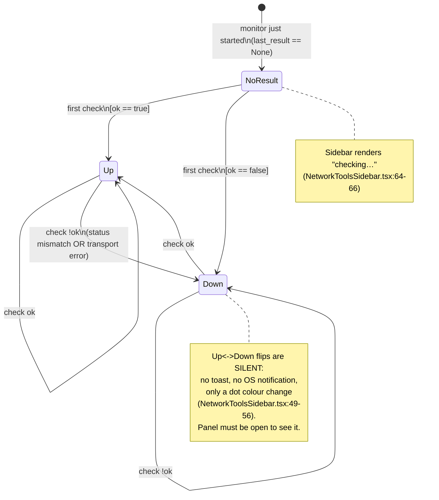
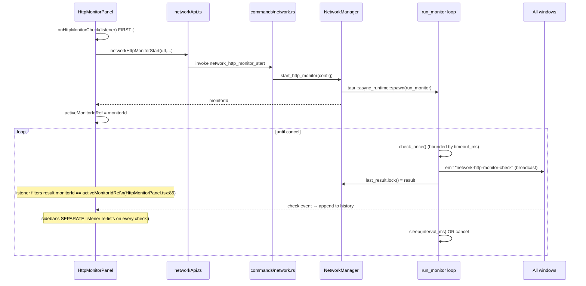
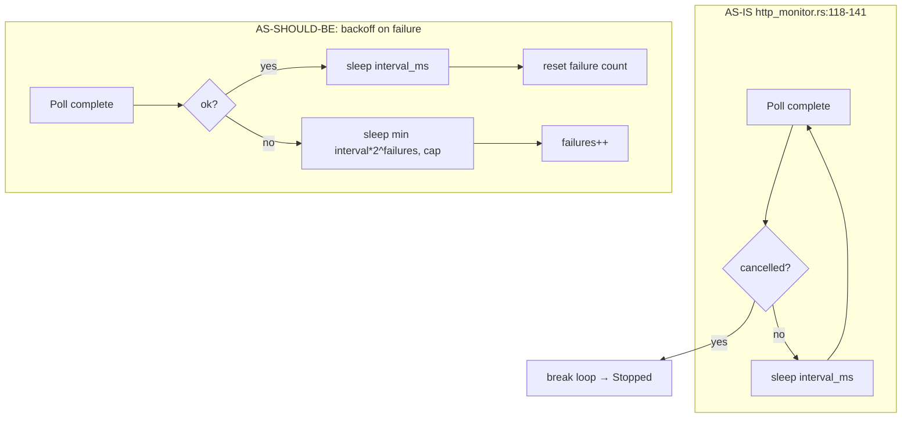

# HTTP Monitor State Machine — Audit

> **Issue:** #1136 — Audit + fix the HTTP monitor state machine (network tools)
> **Scope:** HTTP monitor lifecycle (stopped → polling → up/down → paused → error)
> **Deliverable:** Audit findings only — analysis, diagrams, and prioritized gaps. No production code changes.

## 1. What the machine actually is

The HTTP monitor is a **backend-owned polling loop with a thin, derived frontend view**. There is no explicit `status` enum anywhere — the "state" is reconstructed from a handful of booleans and `Option`s spread across the backend handle and the last check result.

**State is encoded by, and only by:**

- `HttpMonitorHandle.cancel: CancellationToken` — whether the loop is alive (`src-tauri/src/network/http_monitor.rs:48-52`). `cancel.is_cancelled()` is the sole `running` signal (`mod.rs:152`).
- Presence in the `http_monitors: Mutex<HashMap<String, HttpMonitorHandle>>` map (`mod.rs:31`). Insert = exists; `remove` = gone (`mod.rs:121`, `mod.rs:132`).
- `HttpCheckResult.ok: bool` + `error: Option<String>` (`http_monitor.rs:29-36`) — the up/down/error signal, recomputed each poll (`http_monitor.rs:158`, `http_monitor.rs:168-175`).
- Frontend `activeMonitorId: string | null` (`HttpMonitorPanel.tsx:35`) — which monitor _this panel instance_ is "attached" to for the chart/history. This is **panel-local UI state, not monitor state**.

**Critical structural facts that shape every finding below:**

- `stop_http_monitor` does `monitors.remove(monitor_id)` **then** `cancel()` (`mod.rs:132-134`). A stopped monitor is _deleted from the map entirely_, so `list_http_monitors` (`mod.rs:142-157`) can never return a `running: false` entry. The `running` field, the `HttpMonitorState.running: bool` type (`network.ts:123`), and the disabled-grey dot branch in the sidebar (`NetworkToolsSidebar.tsx:53-54`) are **dead code** — the "stopped-but-listed" state is unreachable.
- There is **no persistence**. No monitor config is written to disk (contrast WoL: `wol_storage::save_wol_devices`, `mod.rs:179`). Nothing in `src-tauri/src/workspace/` references monitors. The store field `httpMonitors` (`appStore.ts:338`, `appStore.ts:858`) is plain in-memory Zustand, not persisted. → **All monitors vanish on app restart.**
- There is **no pause**. No `paused` field, no pause command, no pause UI. The lifecycle the issue names (`paused`) does not exist in code.
- There is **no backoff**. `run_monitor` sleeps a fixed `config.interval_ms` regardless of success/failure/error (`http_monitor.rs:137-140`). "up" and "down" poll at the identical cadence.

## 2. Lifecycle — the machine the code has

```mermaid
stateDiagram-v2
    [*] --> Stopped : monitor does not exist

    Stopped --> Polling : network_http_monitor_start\n(insert handle + spawn loop)\n[url non-empty in UI guard]

    state Polling {
        [*] --> Checking
        Checking --> Emitting : check_once returns\nHttpCheckResult
        Emitting --> Sleeping : emit event +\nstore last_result
        Sleeping --> Checking : sleep(interval_ms) elapsed

        state up_down <<choice>>
        Emitting --> up_down
        up_down --> Up : [status == expected_status]
        up_down --> Down : [status != expected]\nor transport error
        Up --> Sleeping
        Down --> Sleeping
    }

    Polling --> Stopped : network_http_monitor_stop\n(remove from map + cancel token)
    Polling --> Stopped : app window Destroyed\n(process dies; NOT cancelled cleanly)

    note right of Stopped
        No persistence: on restart the
        machine is always [*] Stopped.
        Removed-from-map == gone; there is
        NO listed "Stopped" state.
    end note
```



Note there is **no `Paused` state** and **no `Error` terminal state**. A client-build failure (`http_monitor.rs:112-115`) is the only true dead-end: the loop `return`s before it ever polls, the handle stays in the map with `running: true`, and no check is ever emitted — an invisible zombie (see Gap #4).

### Up / Down as sub-states of Polling (the derived view)



## 3. Poll cycle sequence



**Ordering note (a real gap):** the panel's history listener filters `result.monitorId !== activeMonitorIdRef.current` (`HttpMonitorPanel.tsx:85`). The event is **broadcast to every window/listener** (`app.emit`, `http_monitor.rs:131` — not `emit_to`). Every running monitor's checks hit every panel's listener; correctness relies entirely on the id filter. Fine today, but there is no per-window scoping, so any future multi-window use will cross-talk.

## 4. Up→Down notification path (the missing edge)

```mermaid
sequenceDiagram
    participant Task as run_monitor
    participant Win as Window(s)
    participant Sidebar as NetworkToolsSidebar
    participant Panel as HttpMonitorPanel
    participant User

    Task->>Task: check_once → ok=false (was ok=true)
    Task->>Win: emit "network-http-monitor-check"
    Win-->>Sidebar: re-list → dot turns red (#986)
    Win-->>Panel: append row; "Last: ✗ error"
    Note over User: NO toast, NO OS notification,\nNO status-bar badge.
    Note over User: If Network Tools sidebar is not the\nactive activity-bar view AND the panel\ntab is not focused, the down transition\nis completely invisible.
    User--xUser: learns of outage only by\nmanually opening the panel
```

There is **no comparison of previous vs current `ok`** anywhere (backend or frontend). The transition Up→Down is computed fresh each poll and never diffed, so nothing can fire an alert on the _edge_. For a "monitor," missing the up→down edge notification is the single biggest UX gap.

## 5. Interval / backoff policy (as-is vs. as-should-be)



**Interval correctness issues found:**

- **No backoff.** Down hosts are hammered at the same `interval_ms` as healthy ones (`http_monitor.rs:137-140`). A dead endpoint at a 5 s interval gets 12 doomed requests/min forever.
- **Interval is measured _after_ the request returns, not from a fixed schedule.** The loop is `check → emit → sleep(interval)` (`http_monitor.rs:123-140`), so the _effective_ period is `interval_ms + latency` (up to `+timeout_ms` when the endpoint hangs). At a 5 s interval with a 10 s timeout, a hanging host polls every ~15 s, silently drifting the chart's x-axis (which assumes a fixed `intervalMs`, `HttpMonitorPanel.tsx:137`, `LatencyChart.tsx`). Use `tokio::time::interval` (fixed-rate) instead of `sleep` after work.
- **No minimum-interval guard in the backend.** The UI `min={5}` (`HttpMonitorPanel.tsx:216`) is a soft HTML hint only; `network_http_monitor_start` accepts any `interval_ms` (`network.rs:318-333`), including `0` → a tight busy-loop of requests. A `Number(e.target.value)` of `0`/`NaN` from the field is passed straight through (`HttpMonitorPanel.tsx:93`, `215`).

## 6. Prioritized gap list

Ranked stuck/leak/data-loss first.

| #   | Severity                                       | State / transition                                            | file:line                                                                                                         | User-visible symptom                                                                                                                                                                                                                                                          | Smallest fix                                                                                                                                                                                            |
| --- | ---------------------------------------------- | ------------------------------------------------------------- | ----------------------------------------------------------------------------------------------------------------- | ----------------------------------------------------------------------------------------------------------------------------------------------------------------------------------------------------------------------------------------------------------------------------- | ------------------------------------------------------------------------------------------------------------------------------------------------------------------------------------------------------- |
| 1   | **Data-loss**                                  | No `Stopped→Polling` restore on launch; no persistence at all | `mod.rs:31` (in-mem map only), `lib.rs:93` (fresh `NetworkManager::new()`), no `workspace/` ref                   | Every configured monitor silently disappears on app restart. User must re-enter URL/interval/method every session. A "monitor" that forgets what it monitors.                                                                                                                 | Persist monitor **configs** (not runtime) to disk like WoL (`wol_storage.rs` pattern); reload + auto-`start_http_monitor` in `NetworkManager::init` (`mod.rs:54`).                                      |
| 2   | **Silent transition**                          | Polling `Up → Down` (and recovery `Down → Up`)                | `http_monitor.rs:158`/`168` set `ok`; nothing diffs prev vs curr; `app.emit` only (`:131`)                        | An endpoint goes down and the user is never told unless the Network Tools sidebar/panel happens to be on-screen. Defeats the purpose of a monitor.                                                                                                                            | Track previous `ok` per monitor; on edge, `toast` (via a dedicated `network-http-monitor-transition` event) and/or fire an OS notification. Add a status-bar badge for any monitor currently Down.      |
| 3   | **Leak / no cleanup**                          | `Polling → Stopped` on app exit                               | `lib.rs:623-652` cleans tunnels/embedded-servers/xserver but **not** `NetworkManager` monitors                    | On a normal quit the poll loops are never cancelled cleanly; they die only because the process dies. In-flight `reqwest` requests are abandoned mid-flight rather than cancelled. No orphan survives, but teardown is inconsistent with every sibling subsystem.              | Add `handle.try_state::<NetworkManager>() → stop_all_http_monitors()` to the `WindowEvent::Destroyed` block (`lib.rs:634-650`); add a `stop_all` method mirroring `TunnelManager::stop_all`.            |
| 4   | **Stuck / zombie**                             | `Stopped → Polling` when `Client::builder().build()` fails    | `http_monitor.rs:107-116` — loop `return`s before first poll, but handle already inserted (`mod.rs:120-122`)      | Monitor shows `running: true`, "checking…" forever (`NetworkToolsSidebar.tsx:64`), never emits a check, never recovers. No error surfaced to the user. Dead-end state with no exit but manual Stop.                                                                           | Emit a failure `HttpCheckResult`/error event before `return`; or surface the build error to the caller so `start` rejects and the row never appears.                                                    |
| 5   | **Missing control (no way out except delete)** | No `Polling → Paused → Polling`                               | No `paused` field anywhere; `HttpMonitorHandle` (`http_monitor.rs:48`) has only `cancel`                          | User can only Stop (which **deletes** the monitor, Gap #6) — there is no way to temporarily suspend polling (e.g. during maintenance) and resume with the same config/history.                                                                                                | Add a `paused: AtomicBool` to the handle; guard the poll body; add pause/resume commands + a Pause button.                                                                                              |
| 6   | **Ambiguous / data-loss**                      | `Stop` overloads "pause" and "delete"                         | `mod.rs:132` `remove` + `cancel`; panel history reset on next start (`HttpMonitorPanel.tsx:73`)                   | "Stop" doesn't stop-and-keep — it destroys the monitor and its config; the `running:false` listed state is unreachable. Chart/history are lost. User expecting to resume finds nothing.                                                                                       | Split into Stop (cancel, keep in map as `running:false`) and Remove (delete). Fixes the dead `running` field + `Disabled` dot branch at once.                                                           |
| 7   | **Race / double-fire**                         | `Stopped → Polling` fired twice                               | Start button has no pending guard (`HttpMonitorPanel.tsx:172-181`); only disabled by URL emptiness                | Rapid double-click of Start (or Start while a previous start is in-flight) spawns two independent monitors for the same URL, each its own UUID and loop. The panel attaches to the _last_ id; the first becomes an untracked background poller only killable via the sidebar. | Disable Start while a start promise is pending (async `Button` state); or dedupe by URL in `start_http_monitor`.                                                                                        |
| 8   | **Interval correctness**                       | `Sleeping` uses post-work fixed sleep, no backoff, no floor   | `http_monitor.rs:137-140`; unguarded `interval_ms` (`network.rs:328`)                                             | Effective period drifts to `interval+latency` (chart x-axis wrong, `HttpMonitorPanel.tsx:137`); down hosts hammered every interval; `interval_ms=0`/NaN → request busy-loop.                                                                                                  | Use `tokio::time::interval` (fixed-rate MissedTickBehavior::Delay); apply exponential backoff on consecutive failures; clamp `interval_ms >= 1000` server-side in `HttpMonitorConfig::new`/the command. |
| 9   | **Silent / observability**                     | HTTP monitors absent from Open Connections panel              | `OpenConnectionsModal.tsx` "Monitoring" section is SSH system-monitoring only (`:384-396`); no HTTP-monitor group | The canonical "kill everything" panel cannot see or stop HTTP monitors, contradicting CLAUDE.md's rule that it covers every live subsystem. A user hunting a leak won't find the poll loops.                                                                                  | Add an "HTTP Monitors" group to Open Connections listing each monitor with a per-row Stop and a Kill-All wired to a new `stop_all` command.                                                             |
| 10  | **Silent transition**                          | `Polling → Stopped` via Stop                                  | `handleStop`/`handleStopMonitor` (`HttpMonitorPanel.tsx:108-130`) update state but no toast                       | Stopping a monitor gives no success feedback (violates design-system rule 4); errors only set an inline `error` string, no toast on the sidebar path (`NetworkToolsSidebar.tsx:139` logs only).                                                                               | `toast.success("Monitor stopped")` / `toast.error` on both stop paths.                                                                                                                                  |
| 11  | **Cosmetic / stale view**                      | `Polling` sub-state staleness                                 | Sidebar refreshes only on check events (`NetworkToolsSidebar.tsx:112-131`)                                        | If a monitor's interval is long (e.g. 5 min), the sidebar dot can show a stale "up" for minutes after the endpoint died, until the next poll. No "last checked N ago / overdue" indicator.                                                                                    | Show relative "last checked" time; mark a monitor "stale/overdue" when `now - timestampMs > 2×interval`.                                                                                                |

## 7. Missing controls list

Buttons/menu items the correct machine needs but the UI doesn't expose, each tied to the transition it fires:

- **Pause / Resume** — fires `Polling → Paused` / `Paused → Polling`. Neither the state nor the control exists (Gap #5). Today Stop is the only suspend, and it destroys the monitor.
- **Stop vs. Remove (two distinct controls)** — currently one button both cancels and deletes (Gap #6). Need `Stop` (→ listed `running:false`) and `Remove` (→ truly gone). This also makes the already-typed `running:false` state and the grey-dot render branch (`NetworkToolsSidebar.tsx:53`) reachable.
- **Edit monitor** — no way to change URL/interval/method of an existing monitor; user must Stop (destroy) and recreate, losing history. Fires `Polling → (reconfigure) → Polling`.
- **Retry / Clear-error** — when the client build fails (Gap #4) the monitor is a stuck zombie with no Retry and no auto-error surfaced; only manual Stop escapes. Need a `Retry` that re-enters `Stopped → Polling`.
- **Kill-All in Open Connections** — the panel that is supposed to force-kill every subsystem has no HTTP-monitor entry at all (Gap #9). Needs a group + per-row Stop + Kill-All → `stop_all`.
- **Clear history** — the panel accumulates up to `MAX_HISTORY=120` in-memory points (`HttpMonitorPanel.tsx:14`, `:86-88`) with no way to reset without restarting the monitor (which currently means destroying it).
- **Acknowledge / mute a down alert** — precondition once Gap #2 adds notifications: a way to silence a known-down endpoint without stopping monitoring.

## 8. Concept cross-check

No `docs/concepts/**` file describes the HTTP monitor's intended lifecycle (searched — the network-tools surface has no concept doc). Per the repo's concept-drives-code rule, the intended machine is unspecified; this audit's Section 2 machine plus the Section 6/7 gaps should be treated as the behavior spec to build against, and ideally captured as a concept before implementation of the fixes in #1136.

**Bottom line:** the monitor is really a _fire-and-forget poller_, not a stateful monitor. The four highest-impact fixes are: **persist configs across restart (#1)**, **notify on up/down edges (#2)**, **clean teardown at exit + Open-Connections visibility (#3, #9)**, and **separate Stop from Delete + add Pause (#5, #6)** — after which the currently-dead `running:false` state and grey-dot branch become reachable and the diagram in Section 2 gains its missing `Paused` and listed-`Stopped` states.
