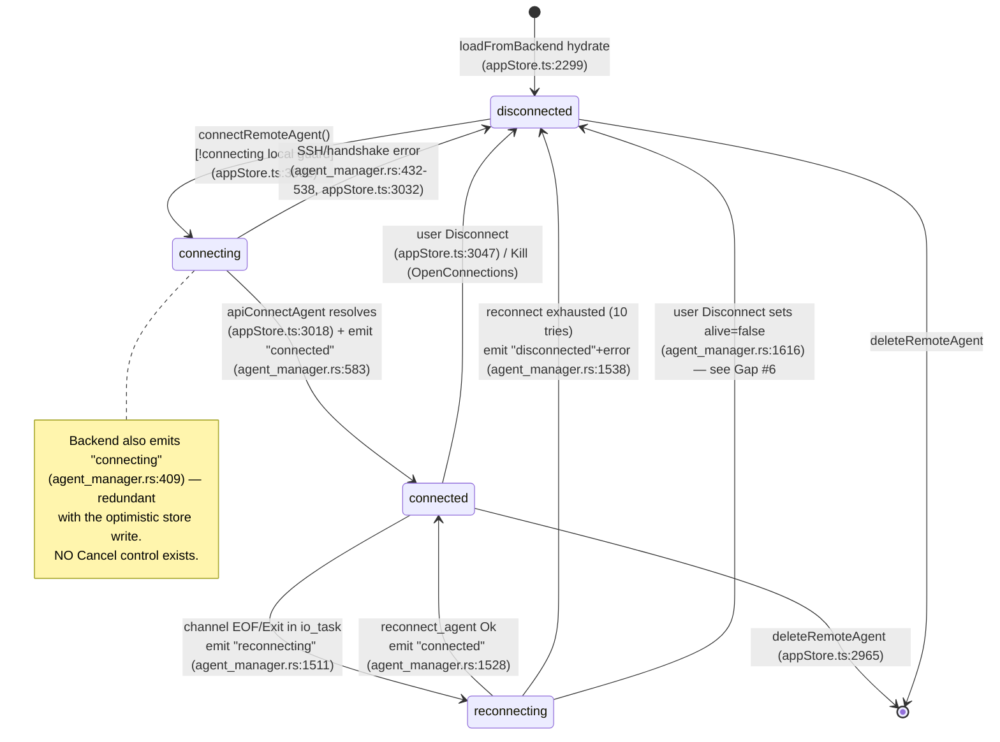
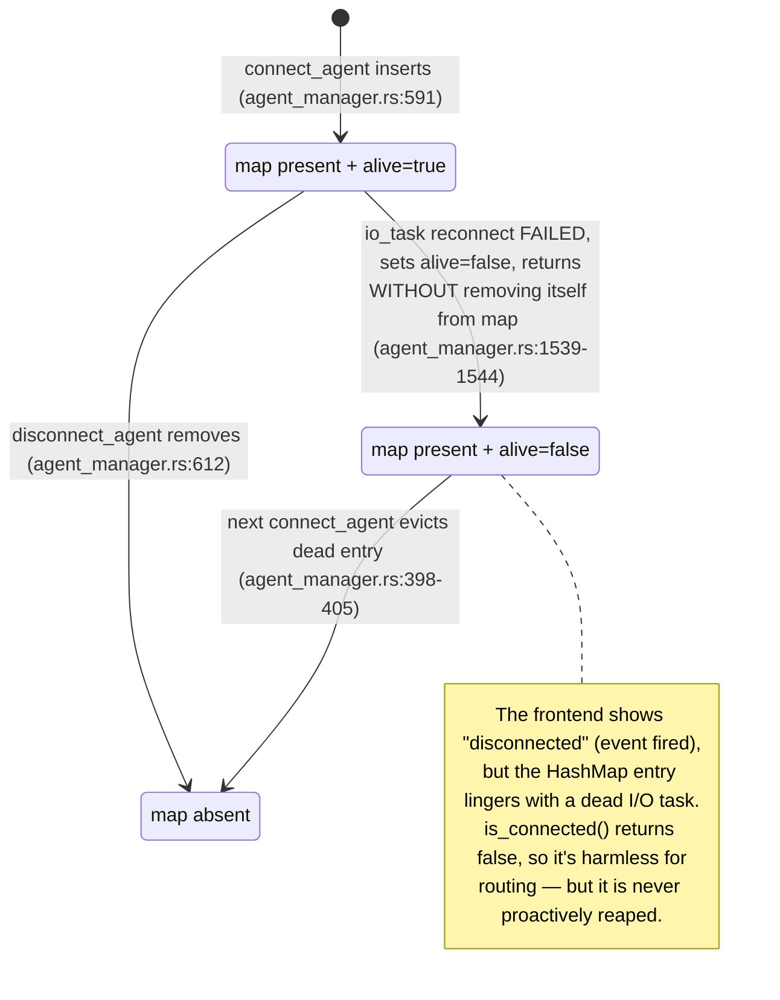
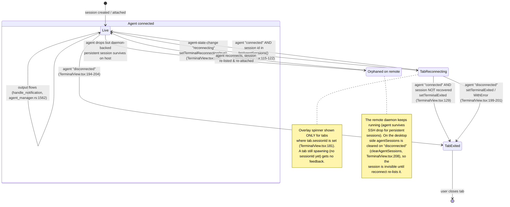
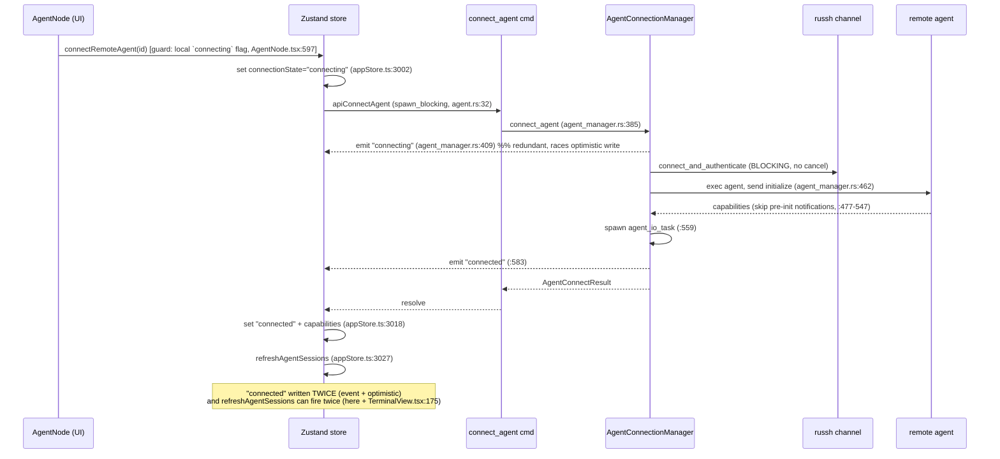
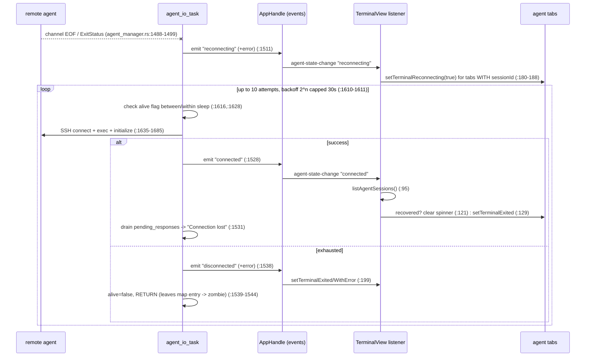

# Remote Agent Lifecycle State Machine — Audit

> **Issue:** #1131 — Audit + fix the remote agent lifecycle state machine (deploy / setup / connect / reconnect / sessions-on-agent)
> **Scope:** Remote agent transport lifecycle + sessions-hosted-on-agent
> **Deliverable:** Audit findings only — analysis, diagrams, and prioritized gaps. No production code changes.

## 1. Where the state lives

The remote-agent transport machine is encoded in two loosely-coupled places that are **not kept in sync by a single authority**:

| Layer                                            | State variable                                                                                           | File:line                                     |
| ------------------------------------------------ | -------------------------------------------------------------------------------------------------------- | --------------------------------------------- |
| Frontend (authoritative for UI)                  | `RemoteAgentDefinition.connectionState: "disconnected" \| "connecting" \| "connected" \| "reconnecting"` | `src/types/connection.ts:124`                 |
| Backend liveness (authoritative for RPC routing) | `AgentConnection.alive: Arc<AtomicBool>`                                                                 | `src-tauri/src/terminal/agent_manager.rs:191` |
| Backend map presence                             | `AgentConnectionManager.agents: HashMap<String, AgentConnection>`                                        | `src-tauri/src/terminal/agent_manager.rs:369` |

The backend never stores the four-variant enum; it stores only `alive` + map presence and **emits** the enum as strings via the `agent-state-change` event (`emit_agent_state`, `agent_manager.rs:1319`). The frontend enum is then written from **two independent writers**:

- **Optimistic writer** — the store action `connectRemoteAgent` sets `"connecting"` → `"connected"`/`"disconnected"` directly (`appStore.ts:3002`, `:3018`, `:3032`).
- **Event writer** — `TerminalView`'s `agent-state-change` listener calls `setAgentConnectionState` (`TerminalView.tsx:68`, store `appStore.ts:3054`).

These two writers race (see Gap #4).

---

## 2. Lifecycle state diagram — agent transport

### Backend-only "shadow" states not represented in the enum

---

## 3. Sessions-hosted-on-agent (composite sub-machine)

A connected agent multiplexes N sessions over one SSH channel. Each terminal **tab** bound to the agent (`tab.config.config.agentId === agentId`, matched in `TerminalView.tsx:83`) has its own overlay sub-state driven by the _agent's_ transitions, plus the agent-reported session list (`agentSessions[agentId]`, `appStore.ts` / `OpenConnectionsModal.tsx`).

Key routing detail: on agent drop the I/O task's `session_outputs`/`monitoring_outputs` maps **survive** in `agent_io_task` (they are local `HashMap`s, `agent_manager.rs:1345-1346`) and are **reused after reconnect** without re-registration. This is correct for surviving sessions but means stale senders for dead sessions linger until the tab explicitly unregisters (Gap #7).

---

## 4. Sequence — connect (SSH/IPC boundary)

## 5. Sequence — reconnect after drop

---

## 6. Prioritized gap list

Ranked stuck / leak / data-loss first, cosmetic feedback last.

### G1 — [STUCK, no Cancel] In-flight `connecting` cannot be aborted

- **State/transition:** `connecting → (stuck)`.
- **file:line:** `agent_manager.rs:385-581` (single blocking `connect_and_authenticate` + handshake with no cancellation token); command `agent.rs:24-39`; UI `AgentNode.tsx:596-672` (no cancel path).
- **Symptom:** User clicks Connect to an unreachable/slow host. SSH auth or the initialize handshake blocks (russh has no client timeout applied here; the handshake loop caps _message count_ at 1000, `agent_manager.rs:474`, but has **no wall-clock timeout**). The sidebar dot sits on `connecting` (`AgentNode.tsx:858`) with **no Cancel button** and no way back to `disconnected` except waiting for the OS/TCP to error out. Compare with `cancel_connecting` for local sessions (`commands/session.rs:60`) and `cancel_connection_path_probe` (`commands/connection_path.rs:206`) which both exist — the agent connect path is the odd one out.
- **Smallest fix:** Add a `CancellationToken` per agent-connect (mirroring `connection_path.rs`'s registry), a `cancel_connect_agent` command, and a Cancel control in the connecting state. On cancel, drop the channel and emit `"disconnected"`.

### G2 — [LEAK / INVISIBLE] Reconnecting & connecting agents are absent from Open Connections

- **State/transition:** `reconnecting` (and `connecting`) hold a live SSH connection + spawned `agent_io_task` + possibly surviving remote sessions, yet are filtered out of the panel.
- **file:line:** `OpenConnectionsModal.tsx:73` — `connectedAgents = remoteAgents.filter(a => a.connectionState === "connected")`. Every agent section, proxy-session section, and "Sessions on <agent>" section (`:274-338`) iterates only `connectedAgents`.
- **Symptom:** An agent stuck in `reconnecting` (looping up to ~1–5 min through 10 backoff attempts, `agent_manager.rs:1610`) owns a russh session and a tokio task, but the canonical kill panel shows nothing for it. The user "thinks it's gone" but the resource lingers — exactly the leak signature the panel exists to catch. The only kill route is the sidebar Disconnect.
- **Smallest fix:** Include `reconnecting` (and ideally `connecting`) agents in the panel with a state badge and a Kill/Cancel button wired to `disconnectRemoteAgent`.

### G3 — [STUCK] No user-driven Retry from `disconnected`-with-error after reconnect exhaustion

- **State/transition:** `reconnecting → disconnected` after 10 failed attempts (`agent_manager.rs:1751`).
- **file:line:** `agent_manager.rs:1538` emits `"disconnected"` with the error; `TerminalView.tsx:199` shows `setTerminalDisconnectWithError` on tabs. The agent node offers plain "Connect" again, but there is **no automatic resumption and no Retry affordance on the agent header** — only the per-tab overlay and the context-menu Connect.
- **Symptom:** After a long dropout the agent silently gives up; the sidebar dot goes grey. The reason (`error`) is delivered to tabs (`TerminalView.tsx:184`) but the **agent-level** `connectionState="disconnected"` carries no stored error, so the sidebar has no "reconnect failed: <reason>" surface — the user must guess whether the network is still down.
- **Smallest fix:** Store the last error on the `RemoteAgentDefinition` and render a "Reconnect" button + tooltip in the disconnected state; optionally offer manual "keep retrying".

### G4 — [RACE / AMBIGUOUS] Two writers for `connectionState`, order-dependent

- **State/transition:** every transition into `connecting`/`connected`/`disconnected`.
- **file:line:** optimistic writes `appStore.ts:3002,3018,3032,3047`; event writes via `TerminalView.tsx:68` → `appStore.ts:3054`. Backend emits `"connecting"` (`agent_manager.rs:409`) and `"connected"` (`:583`) that duplicate the optimistic writes.
- **Symptom:** The `agent-state-change` "connected" event and the awaited `apiConnectAgent` promise resolution both set `"connected"` and both trigger `refreshAgentSessions` (`appStore.ts:3027` and `TerminalView.tsx:175`) — a double refresh on every connect. Worse: if a fast drop→`"reconnecting"` event arrives _before_ the optimistic `"connected"` write lands (promise still settling), the optimistic write can clobber `reconnecting` back to `connected`, hiding an active reconnect. The two paths also disagree about who owns capabilities.
- **Smallest fix:** Make the backend `agent-state-change` event the **single** writer of `connectionState`; have `connectRemoteAgent` only kick off the request and consume `capabilities`, not set terminal states. De-dupe `refreshAgentSessions`.

### G5 — [SILENT / STALE] Tab-strip state dot does not reflect agent-level reconnect/disconnect

- **State/transition:** `connected → reconnecting → disconnected` at the agent level.
- **file:line:** the tab dot reads `remoteStates[tab.id]` (`TabBar.tsx:78`, `Tab.tsx:99`), which is written only by the per-session `remote-state-change` event (`setRemoteState`, `appStore.ts:2921`; subscribed in `events.ts:140`). The `agent-state-change` path (`TerminalView.tsx`) updates `terminalReconnecting`/`terminalExited` overlays but **never calls `setRemoteState`**, and `agent_io_task` never emits a per-session `remote-state-change` on drop.
- **Symptom:** When an agent drops, the terminal body shows a reconnecting overlay, but the **tab strip dot** for that session stays whatever it last was (often "connected"/green). Two different truth sources for "is this session live," and the compact tab indicator lies.
- **Smallest fix:** In the `agent-state-change` handler, also `setRemoteState(tab.sessionId, state)` for each agent tab so the tab dot and the overlay agree.

### G6 — [ZOMBIE / LEAK] Failed-reconnect I/O task leaves its HashMap entry behind

- **State/transition:** `reconnecting → disconnected` (exhausted).
- **file:line:** `agent_manager.rs:1539-1544` — on exhausted reconnect the task sets `alive=false` and `return`s **without** removing itself from `AgentConnectionManager.agents`. The stale entry is only reaped lazily on the _next_ `connect_agent` (eviction check `:398-405`).
- **Symptom:** A dead `AgentConnection` (with a closed `command_tx`) lingers in the map indefinitely if the user never reconnects. `is_connected` correctly returns false (guards routing), so it is not a _correctness_ bug, but it is an untracked resource that the Open Connections panel cannot see or clear (compounds G2). If the user tries to reconnect, it is silently evicted — fine — but until then it is invisible dead state.
- **Smallest fix:** Have `disconnect_agent`/a reaper (or the task itself via a shared weak handle) remove the entry on terminal failure; or expose a "prune dead agents" action.

### G7 — [LEAK, minor] Output/monitoring senders for non-recovered sessions persist across reconnect

- **State/transition:** `reconnecting → connected` where some sessions did not survive.
- **file:line:** `agent_io_task` keeps `session_outputs`/`monitoring_outputs` across the reconnect (`agent_manager.rs:1345-1346`, maps not cleared at `:1526`). Cleanup relies on the tab calling `unregister_session_output` (`agent_manager.rs:913`), which only happens when the frontend marks the tab exited and tears down.
- **Symptom:** For a session that did **not** recover (`TerminalView.tsx:129` marks the tab exited), the sender entry stays in the I/O task's map until the tab-side unregister fires. Low impact (bounded by tab count) but it is untracked state keyed by a now-dead session id.
- **Smallest fix:** On successful reconnect, reconcile `session_outputs` keys against the freshly-listed session ids and drop the missing ones.

### G8 — [DATA-LOSS window] `reconnecting` overlay skipped for tabs still spawning

- **State/transition:** `connected → reconnecting`.
- **file:line:** `TerminalView.tsx:181` — `if (!tab.sessionId) continue;` skips reconnecting feedback for any agent tab that has not yet been assigned a `sessionId` (mid-`connection.create`). Such a tab's in-flight create RPC is answered with `"Connection lost during request"` (`agent_manager.rs:1532`) but the tab shows neither the reconnecting spinner nor a clear error tied to the drop.
- **Symptom:** Open a new shell on an agent exactly as the link drops → the tab can land in an ambiguous state (spawn error unrelated-looking) with no reconnect overlay.
- **Smallest fix:** For agent tabs without a sessionId, route to the waiting/retry path (`terminalWaitingForAgent`) on `reconnecting` rather than skipping.

### G9 — [SILENT teardown mismatch] `disconnect_agent` doesn't proactively close remote sessions

- **State/transition:** `connected → disconnected` (user-initiated).
- **file:line:** `agent_manager.rs:606-623` sends only `AgentIoCommand::Disconnect` (drops the channel). Non-persistent remote sessions are left to die with the channel; persistent daemon-backed ones keep running on the host. The desktop clears `agentSessions` (`TerminalView.tsx:208` / `appStore.ts:3049`).
- **Symptom:** Ambiguity between "closed the transport" and "killed the remote sessions." After a Disconnect, remote persistent daemons keep running but the panel shows nothing, and there is no "Disconnect (keep sessions running)" vs "Shutdown agent" distinction surfaced next to the plain Disconnect (the `shutdown_agent` path exists at `agent_manager.rs:644` and reports `detached_sessions`, but the sidebar Disconnect uses the plain path). This overloads one control with two intents.
- **Smallest fix:** Surface both intents in the UI (Disconnect = detach, Shutdown = stop remote), and show the `detached_sessions` count as feedback.

### G10 — [SILENT, deploy/setup] No cancellation of deploy/setup; agent state not modeled during it

- **State/transition:** deploy/setup runs orthogonally to `connectionState` (agent stays `disconnected` throughout).
- **file:line:** `deploy_agent` (`agent_deploy.rs:148`) and `setup_remote_agent` (`agent_setup.rs:145`) take **no cancellation token** (contrast `connection_path.rs`). Deploy emits `agent-deploy-progress` (`agent_deploy.rs:377`); setup spawns a background thread (`agent_setup.rs:219`) that cannot be stopped once running. Setup dialog has a Cancel button (`AgentSetupDialog.tsx:245`) but it only closes the dialog — the background SFTP upload/script injection keeps going.
- **Symptom:** A long download/upload (`resolve_agent_binary`, `agent_deploy.rs:199`) cannot be aborted; "Cancel" is a lie during setup. If the SFTP connection stalls, the setup thread hangs with only terminal echo as feedback.
- **Smallest fix:** Thread a `CancellationToken` through `deploy_agent`/`run_setup_background`, checked before each network step, and wire the dialog's Cancel to fire it.

### G11 — [COSMETIC] `connecting` backend emit is redundant and unobserved distinctly

- **file:line:** `agent_manager.rs:409` emits `"connecting"` but the store already set it optimistically (`appStore.ts:3002`); harmless duplicate. Listed for completeness under G4.

---

## 7. Missing-controls list

Buttons/menu items the correct machine needs, tied to the transition each would fire:

| Missing control                                                                   | State it belongs in               | Transition it fires                                                               | Why (gap)                                                                                 |
| --------------------------------------------------------------------------------- | --------------------------------- | --------------------------------------------------------------------------------- | ----------------------------------------------------------------------------------------- |
| **Cancel connect** (sidebar + connect overlay)                                    | `connecting`                      | `connecting → disconnected` via new `cancel_connect_agent`                        | G1 — connecting is currently a dead-end while blocked                                     |
| **Kill / Cancel reconnect** in Open Connections                                   | `reconnecting` (and `connecting`) | `reconnecting → disconnected` (`disconnect_agent`, sets `alive=false`)            | G2 — reconnecting agents are invisible & unkillable in the canonical panel                |
| **Reconnect** on the agent header                                                 | `disconnected` (post-exhaustion)  | `disconnected → connecting` (`connectRemoteAgent`) with stored last-error tooltip | G3 — no first-class retry after auto-reconnect gives up                                   |
| **"Shutdown agent (stop remote sessions)"** distinct from **Disconnect (detach)** | `connected`                       | `connected → disconnected` via `shutdown_agent` vs `disconnect_agent`             | G9 — one control overloads two intents; `shutdown_agent` already exists but is unsurfaced |
| **Cancel setup / deploy** that actually aborts                                    | during deploy/setup progress      | fire a `CancellationToken`                                                        | G10 — current Cancel only closes the dialog                                               |
| **"Prune dead agents"** (or automatic reap)                                       | zombie backend entries            | remove stale `AgentConnection`                                                    | G6 — failed-reconnect entries linger untracked                                            |

---

## 8. Summary of the delta (real vs. ideal)

The machine's happy path (connect → connected → reconnect → connected) is well-built: backoff respects the `alive` flag (regression-tested, `agent_manager.rs:2189`), the handshake tolerates pre-init notifications, and surviving sessions are correctly re-linked by id on reconnect (`TerminalView.tsx:113-136`). The defects cluster at the **edges and the cross-writer seam**:

1. **No cancellation anywhere in the agent path** (connect G1, deploy/setup G10) while sibling subsystems have it — the biggest UX hole.
2. **`reconnecting` is a first-class transport state the kill panel refuses to acknowledge** (G2), so its resources leak from the user's view.
3. **Two writers for `connectionState`** (G4) create a race and duplicate work, and the tab dot reads a _third_ source that no agent transition updates (G5).
4. **Terminal failure leaves a zombie map entry** (G6) reaped only lazily.

Fixing G1, G2, and G4 first collapses most of the "stuck/leak/invisible" symptoms; G5/G3/G9 then make the remaining transitions observable and reversible.
