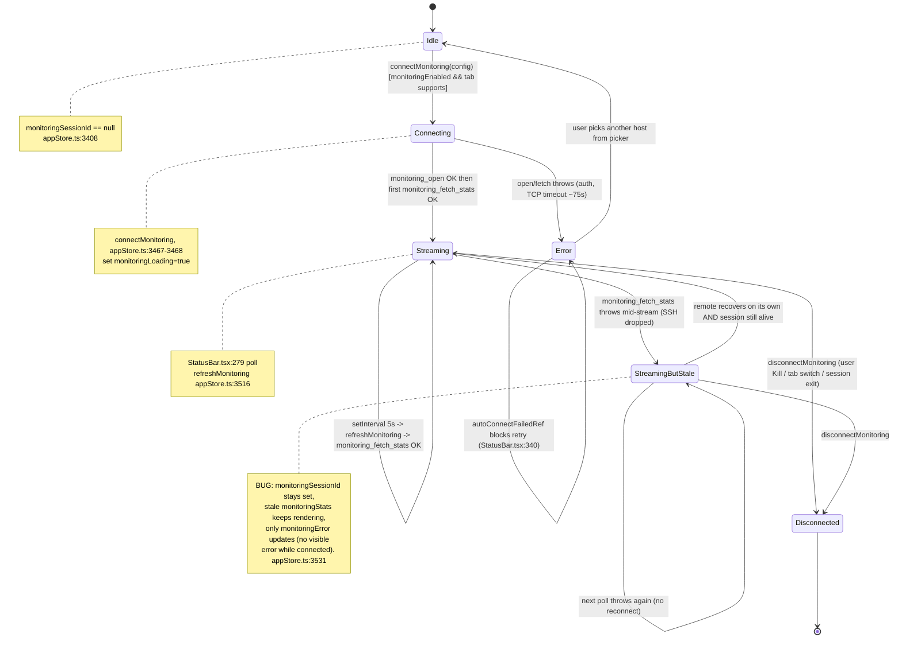
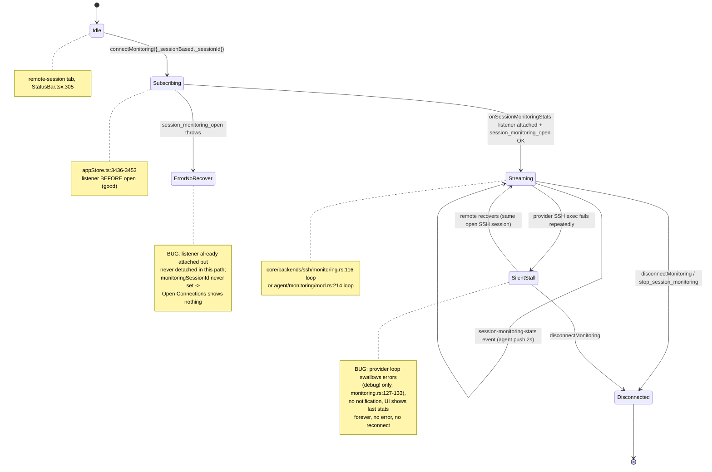
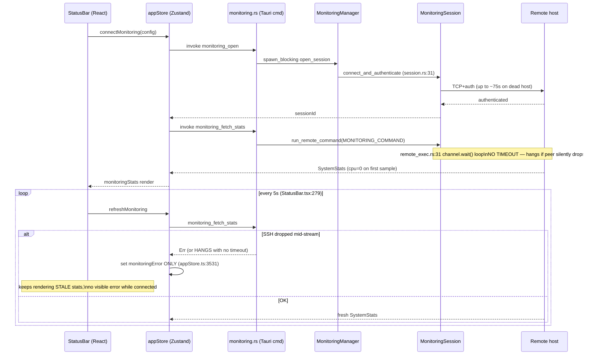

# Remote System Monitoring State Machine — Audit

> **Issue:** #1137 — Audit + fix the remote system monitoring state machine
> **Scope:** SSH remote system monitoring lifecycle (idle → collecting → streaming → paused → error/disconnected)
> **Deliverable:** Audit findings only — analysis, diagrams, and prioritized gaps. No production code changes.

## Executive summary

There are **two independent monitoring machines** that share one frontend surface (the status-bar `MonitoringStatus` widget and a single global slice in `appStore`):

1. **Legacy desktop-SSH path** ("standard" monitoring) — `monitoring_open` / `monitoring_fetch_stats` / `monitoring_close` (`src-tauri/src/commands/monitoring.rs`), backed by `MonitoringSession` (`src-tauri/src/monitoring/session.rs`). **Pull-based**: the UI polls every 5 s via a `setInterval` in `StatusBar.tsx:279`.
2. **Session-based / agent path** ("remote-session" tabs) — `session_monitoring_open` / `session_monitoring_close` (`src-tauri/src/commands/session.rs:324`), backed by `SessionManager::start_session_monitoring` (`src-tauri/src/session/manager.rs:630`), which subscribes to a `MonitoringProvider` (`core/src/backends/ssh/monitoring.rs` = `SshMonitoringProvider`, or the agent's `MonitoringManager` in `agent/src/monitoring/mod.rs`). **Push-based**: stats arrive as `session-monitoring-stats` Tauri events.

The two machines are **overloaded onto the same five store fields** (`monitoringSessionId`, `monitoringHost`, `monitoringStats`, `monitoringLoading`, `monitoringError` — `src/store/appStore.ts:3408-3412`), which are **global/singleton** (only one host can be monitored app-wide). The most serious defects are: **no error state on a mid-stream SSH drop** (both paths go silent instead of surfacing an error), **no reconnect for either machine after the transport dies**, and a **collect-hang risk** because neither exec loop has a timeout. There is also **no user-facing Pause/Resume/Retry control** — the state machine has states the user cannot drive.

---

## Diagram 1 — Legacy desktop-SSH monitoring lifecycle (pull-based)



### Where each transition lives

- `Idle → Connecting`: auto-connect effect `StatusBar.tsx:343-375`, or manual `handleConnect` `StatusBar.tsx:385-393` → `connectMonitoring` `appStore.ts:3457-3475`.
- `Connecting → Streaming`: `appStore.ts:3467-3475` (both `monitoring_open` and the first `monitoring_fetch_stats` must succeed before `monitoringSessionId` is set).
- `Streaming → Streaming`: `setInterval(refreshMonitoring, 5000)` `StatusBar.tsx:279-281`; `refreshMonitoring` `appStore.ts:3516-3535`.
- `Streaming → StreamingButStale`: `refreshMonitoring` catch `appStore.ts:3530-3534` sets **only** `monitoringError` and leaves `monitoringSessionId`/`monitoringStats` intact.
- `* → Disconnected`: `disconnectMonitoring` `appStore.ts:3484-3514`.

---

## Diagram 2 — Session-based / agent monitoring lifecycle (push-based)



### Where each transition lives

- `Idle → Subscribing → Streaming`: `connectMonitoring` session branch `appStore.ts:3426-3454`; backend `SessionManager::start_session_monitoring` `manager.rs:630-670`.
- push loop desktop-direct: `SshMonitoringProvider::subscribe` `core/src/backends/ssh/monitoring.rs:89-152`.
- push loop on agent: `MonitoringManager::monitoring_task` `agent/src/monitoring/mod.rs:204-264`.
- `* → Disconnected`: `stop_session_monitoring` `manager.rs:672-687` (aborts push task, unsubscribes); frontend `disconnectMonitoring` `appStore.ts:3484-3514`.

---

## Sequence 1 — Legacy pull-based collection crossing the IPC/SSH boundary



### Boundary gaps this exposes

- `run_remote_command` (`src-tauri/src/utils/remote_exec.rs:31-46`) has **no timeout** on `channel.wait()`. If the TCP peer half-drops, the `spawn_blocking` task hangs indefinitely; the 5 s poll then stacks a _new_ `spawn_blocking` each tick (`StatusBar.tsx:279` fires regardless of whether the prior `refreshMonitoring` resolved) → thread/blocking-pool leak under a dead remote.
- On a fetch error while `monitoringSessionId` is still set, the render branch `StatusBar.tsx:474-508` stays in the "connected" arm, so the **`monitoringError` is never shown** (the error UI only renders in the _disconnected_ arm, `StatusBar.tsx:424-432`).

---

## Sequence 2 — Session/agent push collection crossing the IPC/SSH boundary

```mermaid
sequenceDiagram
    participant UI as StatusBar (React)
    participant Store as appStore
    participant Cmd as session.rs (Tauri cmd)
    participant SM as SessionManager
    participant Prov as MonitoringProvider (SSH)
    participant SSH as Remote host

    UI->>Store: connectMonitoring({_sessionBased})
    Store->>Store: onSessionMonitoringStats listener (appStore.ts:3436)
    Store->>Cmd: session_monitoring_open
    Cmd->>SM: start_session_monitoring (manager.rs:630)
    SM->>Prov: subscribe() -> Receiver (manager.rs:643)
    Prov->>Prov: tokio::spawn connect_target (monitoring.rs:102)
    alt provider connect fails
        Prov-->>Prov: warn! + task returns (monitoring.rs:109-111)
        Note over SM,UI: subscribe() STILL returned Ok(rx);\nsession_monitoring_open reports success;\nUI enters Streaming but NO stats ever arrive
    end
    loop every 2s (monitoring.rs:116)
        Prov->>SSH: ssh_exec(MONITORING_COMMAND)
        alt exec/parse error
            Prov-->>Prov: debug! only, continue (monitoring.rs:127-133)
            Note over UI: silent stall — last stats linger,\nno error event, no reconnect
        else OK
            Prov->>SM: tx.send(stats)
            SM->>UI: emit session-monitoring-stats (manager.rs:657)
            UI->>Store: update monitoringStats
        end
    end
    UI->>Store: disconnectMonitoring
    Store->>Cmd: session_monitoring_close
    Cmd->>SM: stop_session_monitoring -> abort + unsubscribe (manager.rs:673-687)
```

### Boundary gaps this exposes

- `SshMonitoringProvider::subscribe` returns `Ok(rx)` **before** the SSH connection is even attempted (the connect happens inside the spawned task, `monitoring.rs:102-112`). A connect failure only logs `warn!` and drops the task — the UI is told monitoring started and waits forever for a first stat with no error and no timeout.
- The agent's `monitoring_task` (`agent/src/monitoring/mod.rs:253-255`) and the provider loop (`monitoring.rs:127-133`) both **swallow collection errors** (`warn!`/`debug!` only). The remote going away mid-stream produces a **silent stall**, never a state change the UI can see.

---

## Prioritized gap list (stuck / leak / data-loss first)

### G1 — Mid-stream SSH drop shows stale data as if live (data-integrity, both paths) 🔴

- **State/transition:** `Streaming → StreamingButStale` / `Streaming → SilentStall` — no state change reaches the UI.
- **file:line:** legacy: `appStore.ts:3530-3534` (fetch error sets only `monitoringError`, keeps `monitoringSessionId`+`monitoringStats`); render never surfaces it because the connected arm has no error branch (`StatusBar.tsx:474-508`). Push: provider swallows errors `core/src/backends/ssh/monitoring.rs:127-133`; agent `agent/src/monitoring/mod.rs:253-255`.
- **User-visible symptom:** CPU/Mem/Disk numbers freeze at last-good values but keep looking "connected" (green/normal severity). User trusts stale metrics of a host that may be down.
- **Smallest fix:** Introduce an explicit `Stale`/`Error-while-connected` sub-state. Legacy: after N consecutive `refreshMonitoring` failures, flip a `monitoringStale=true` flag and render a warning badge in the connected arm. Push: emit a `session-monitoring-error` event (or a status field on the stats event) when the provider loop's exec fails K times in a row, and have the store surface it.

### G2 — No reconnect after transport dies (stuck, both paths) 🔴

- **State/transition:** missing `Stale → Reconnecting → Streaming`.
- **file:line:** legacy `MonitoringSession` holds one `SshSession` (`session.rs:23`) with no re-dial on `fetch_stats` error. Push loop reuses one `session` for the task lifetime (`monitoring.rs:106`); it never re-runs `connect_target` after a drop.
- **User-visible symptom:** once the SSH session drops, monitoring is dead until the user manually Kills and re-picks the host (legacy) or switches the tab away and back (session). For remote-session it may never recover.
- **Smallest fix:** add a bounded backoff reconnect in each collector loop (re-establish the SSH session on `Err`, cap attempts) and, for the legacy path, have `fetch_stats` transparently re-open on a broken channel. Surface `Reconnecting` in the UI.

### G3 — Collect can hang forever (leak / runtime starvation, legacy) 🔴

- **State/transition:** `Streaming` self-loop that never completes.
- **file:line:** `run_remote_command` `src-tauri/src/utils/remote_exec.rs:31-46` — `channel.wait()` loop has no timeout; `monitoring_fetch_stats` `src-tauri/src/commands/monitoring.rs:56-59` wraps it in `spawn_blocking` but never bounds it.
- **User-visible symptom:** against a half-dead remote, each 5 s poll (`StatusBar.tsx:279`) launches another blocking task that never returns; blocking pool fills, and the stale-data problem (G1) becomes permanent because `refreshMonitoring` never resolves to update `monitoringError`.
- **Smallest fix:** wrap the exec in `tokio::time::timeout` (e.g. 10 s) and, in `StatusBar.tsx`, skip a poll tick while the previous `refreshMonitoring` is still in flight (in-flight guard).

### G4 — Provider `subscribe()` returns Ok before the SSH connect (false "connected", push) 🟠

- **State/transition:** `Subscribing → Streaming` fires on a connection that hasn't happened.
- **file:line:** `core/src/backends/ssh/monitoring.rs:89-152` — `Ok(rx)` returned at line 151; the actual `connect_target` runs later inside the spawned task (line 102) and a failure only `warn!`s (line 109).
- **User-visible symptom:** UI shows "connected"/Connecting-cleared with no stats forever when the remote is unreachable; no error.
- **Smallest fix:** perform (or await a one-shot result of) the initial connect inside `subscribe()` and return `Err(CoreError)` on failure so `start_session_monitoring` → `session_monitoring_open` → `connectMonitoring` lands in the error branch.

### G5 — Session-open failure leaks the event listener (leak, push) 🟠

- **State/transition:** `Subscribing → ErrorNoRecover`.
- **file:line:** `appStore.ts:3436-3453` — `onSessionMonitoringStats` listener is attached and stored in `_monitoringUnlisten` _before_ `sessionMonitoringOpen`; if `sessionMonitoringOpen` throws, control jumps to the `catch` (`appStore.ts:3476`) which sets `monitoringError` but **never calls `_monitoringUnlisten()`**. `monitoringSessionId` stays null, so `disconnectMonitoring` (`appStore.ts:3487` guard) won't clean it up either.
- **User-visible symptom:** a dangling Tauri event listener survives; on a later successful subscribe of another session, stray events can update the wrong host.
- **Smallest fix:** in the `catch` of `connectMonitoring`, call `_monitoringUnlisten?.()` and null it.

### G6 — Only one host can be monitored app-wide; second connect silently evicts first (data-loss, both) 🟠

- **State/transition:** singleton store slice overloaded across all tabs.
- **file:line:** single global fields `appStore.ts:3408-3413`; auto-connect disconnects the previous host on tab switch (`StatusBar.tsx:317-319`, `351-353`).
- **User-visible symptom:** with two SSH tabs open, switching tabs tears down the first tab's monitoring and its live stream; the Open Connections panel only ever shows one Monitoring row (`OpenConnectionsModal.tsx:385` gates on the single `monitoringHost`).
- **Smallest fix (spec-level):** key monitoring state by session/host (`Record<hostKey, MonitoringState>`) instead of a singleton, so each tab keeps its own machine and Open Connections lists all of them. (Larger change — flag for design.)

### G7 — Auto-connect failure is a hard dead-end (stuck, both) 🟠

- **State/transition:** `Error → Error` (no path back to `Connecting`).
- **file:line:** `autoConnectFailedRef` `StatusBar.tsx:340-341` (SSH) and `311-312` (session) latch the failed host key and block any further auto-connect attempt; it's only cleared on success (`371`) or tab-exit reset (`297`).
- **User-visible symptom:** if the first auto-connect fails (host briefly down, password cancelled), monitoring for that tab never retries even after the host recovers — no Retry button exists, so the user must switch tabs away and back.
- **Smallest fix:** add a visible **Retry** control in the error state that clears `autoConnectFailedRef` and re-invokes connect; optionally auto-retry with backoff.

### G8 — Password cancel during auto-connect leaves it "failed" with no feedback (silent, legacy) 🟡

- **State/transition:** `Connecting → Idle` with no user signal.
- **file:line:** `StatusBar.tsx:363-364` — `requestPassword` returning `null` just `return`s; `autoConnectFailedRef` remains latched, `monitoringLoading` is never set, no toast.
- **User-visible symptom:** nothing appears; user doesn't know monitoring didn't start and (per G7) can't retry.
- **Smallest fix:** on cancel, surface a subtle "Monitoring not connected" affordance and leave the picker/Retry reachable.

### G9 — `monitoringError` never auto-clears between hosts (cosmetic/stale, both) 🟡

- **State/transition:** `Error` persists into the next `Idle`.
- **file:line:** `refreshMonitoring` catch sets `monitoringError` (`appStore.ts:3531`) but leaves it set; only `connectMonitoring` start (`appStore.ts:3431`,`3462`) or `disconnectMonitoring` (`appStore.ts:3507`) clears it.
- **User-visible symptom:** a stale "Monitor error" tooltip can linger from a previous host.
- **Smallest fix:** clear `monitoringError` on every successful stat update (session push branch `appStore.ts:3438-3442` already does; make the legacy poll-success path do the same — it does at `appStore.ts:3525`, so this is mainly the disconnected-arm error render timing).

### G10 — CPU% is 0 on the first sample with no indication (minor data-quality) 🟡

- **file:line:** `session.rs:48-51` and `agent/collector.rs:220-223` — first `collect` returns 0 % because there's no prior CPU delta; documented but the UI renders a solid "CPU 0%" that looks real.
- **User-visible symptom:** first status-bar reading always says CPU 0 %.
- **Smallest fix:** render a "—"/priming indicator until the second sample (or prime the counters on connect, as `LocalCollector::new` already does at `agent/collector.rs:43`).

---

## Missing-controls list

| Control                                        | Where it belongs                                                                 | Transition it should fire                                                                                                                                    | Today                                                                                                                                                          |
| ---------------------------------------------- | -------------------------------------------------------------------------------- | ------------------------------------------------------------------------------------------------------------------------------------------------------------ | -------------------------------------------------------------------------------------------------------------------------------------------------------------- |
| **Retry / Reconnect**                          | status-bar error state & Open Connections monitoring row                         | `Error/Stale → Connecting` (clears `autoConnectFailedRef`)                                                                                                   | Absent — failure is a dead-end (G7). Open Connections only offers Kill (`OpenConnectionsModal.tsx:390,396`).                                                   |
| **Pause / Resume**                             | status-bar monitoring dropdown (`MonitoringDetailDropdown`, `StatusBar.tsx:516`) | `Streaming ↔ Paused` (stop polling / stop push without tearing down the SSH session)                                                                         | Absent — there is no `Paused` state at all; the "paused" leg of the issue's scope is unimplemented. Only Refresh + Disconnect exist (`StatusBar.tsx:481-482`). |
| **Cancel (during Connecting)**                 | status-bar "Connecting…" indicator (`StatusBar.tsx:414-421`)                     | `Connecting → Idle` (abort the up-to-75 s SSH handshake)                                                                                                     | Absent — the "Connecting…" state is uninterruptible; the blocking open runs to timeout.                                                                        |
| **Explicit "Monitor stale/offline" indicator** | connected stats arm (`StatusBar.tsx:484-508`)                                    | render branch for `Stale`                                                                                                                                    | Absent — G1; stale data is indistinguishable from live.                                                                                                        |
| **Per-host Kill in Open Connections**          | monitoring section (`OpenConnectionsModal.tsx:384-399`)                          | `Streaming → Disconnected` per host                                                                                                                          | Only a single global row exists (G6); multi-host monitoring can't be inspected or individually killed.                                                         |
| **Interval / refresh-rate control**            | monitoring settings or dropdown                                                  | reconfigure poll/push interval (`REFRESH_INTERVAL_MS` `StatusBar.tsx:18`, `MONITORING_INTERVAL` `monitoring.rs:24`, agent `DEFAULT_INTERVAL_MS` `mod.rs:27`) | Absent — hardcoded; three different intervals across the three loops with no user control.                                                                     |

---

## Cross-cutting observations

- **Two intervals disagree:** legacy UI polls at **5 s** (`StatusBar.tsx:18`) while the push provider ticks at **2 s** (`core/src/backends/ssh/monitoring.rs:24`) and the agent at **2 s** (`agent/src/monitoring/mod.rs:27`). Same widget, inconsistent refresh cadence depending on path.
- **Teardown correctness (the good part):** the push machine tears down cleanly — `stop_session_monitoring` both aborts the task and calls `provider.unsubscribe()` (`manager.rs:673-687`), and `MonitoringTask`/`Subscription` use `Drop`/`CancellationToken` to stop the loop (`monitoring.rs:34-38`, `mod.rs:62-65`). The legacy path drops the `SshSession` on `close_session` (`session.rs:87-90`). The **leak risk is not in teardown** but in G3 (unbounded in-flight collects) and G5 (listener leak on open failure).
- **Terminal-exit coupling works:** when the underlying terminal session dies, the store calls `disconnectMonitoring` (`appStore.ts:2848-2851`, `2860-2861`) and the auto-connect effect is gated on `activeTabExited` (`StatusBar.tsx:296-298`) — so an _expected_ session death does tear monitoring down. The gap is the _unexpected_ mid-stream SSH drop that doesn't kill the terminal session (G1/G2).
- **Legacy path is explicitly marked for removal** (`session.rs:16-21` doc comment) in favor of the unified `MonitoringProvider`; several gaps (G1–G3, G6) would be resolved by completing that migration and giving the provider loop real error/reconnect semantics.
