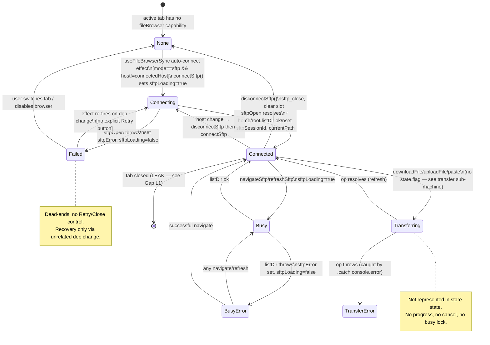
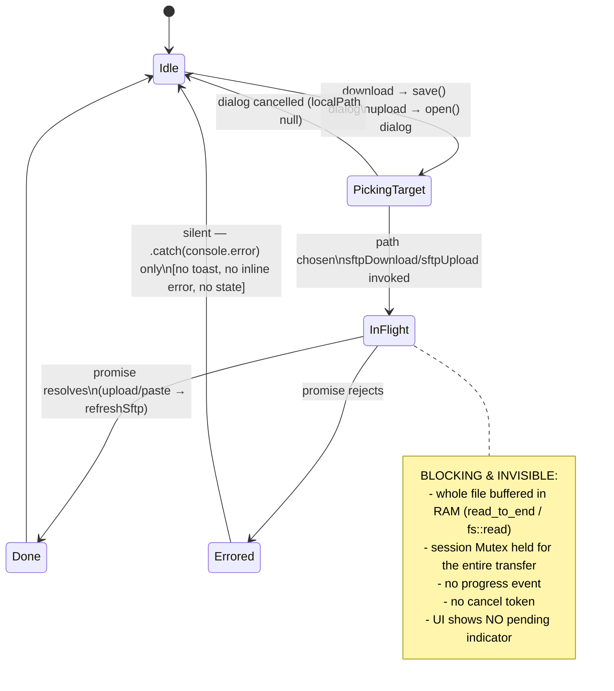
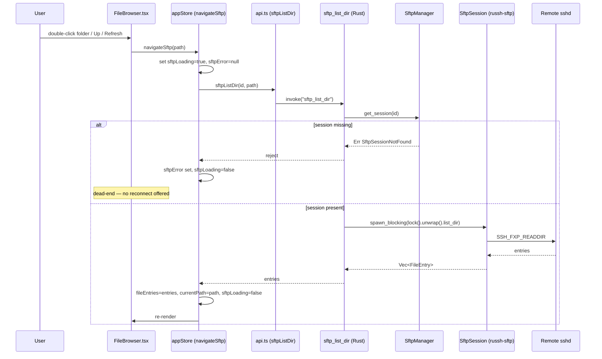
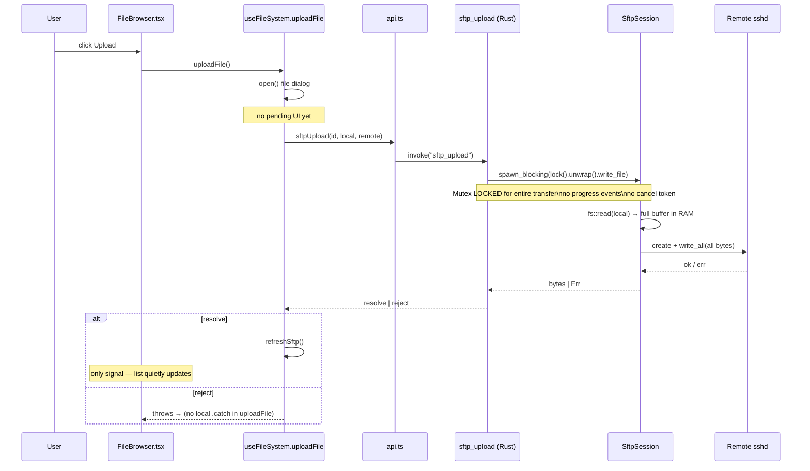

# SFTP / File Browser Session State Machine — Audit

> **Issue:** #1132 — Audit + fix the SFTP / file browser session state machine
> **Scope:** SFTP / file browser lifecycle (connect → browse → transfer → cancel → error → disconnect)
> **Deliverable:** Audit findings only — analysis, diagrams, and prioritized gaps. No production code changes.

## 1. Where the state actually lives

The "SFTP session" is encoded across three layers, and the front-end state is deliberately **single-slot** — there is one connection tracked at a time even though the Rust manager can hold many.

| Layer          | State carrier                                                                                                                                        | File:line                                                                     |
| -------------- | ---------------------------------------------------------------------------------------------------------------------------------------------------- | ----------------------------------------------------------------------------- |
| Rust manager   | `SftpManager.sessions: Arc<Mutex<HashMap<String, Arc<Mutex<SftpSession>>>>>` — N sessions keyed by UUID                                              | `src-tauri/src/files/sftp.rs:435-470`                                         |
| Tauri commands | Stateless per-call; each command does `get_session(id)` → `spawn_blocking(lock().unwrap())`                                                          | `src-tauri/src/commands/files.rs:49-144`                                      |
| Zustand store  | `sftpSessionId: string \| null`, `sftpLoading: bool`, `sftpError: string \| null`, `sftpConnectedHost: string \| null`, `currentPath`, `fileEntries` | `src/store/appStore.ts:477-480, 2664-2670`                                    |
| Browser mode   | `fileBrowserMode: "local" \| "sftp" \| "session" \| "none"` (derived from the active tab)                                                            | `src/store/appStore.ts:607`, `src/components/Sidebar/FileBrowser.tsx:432-490` |

The **desktop SFTP session state** is therefore the 3-tuple `(sftpSessionId, sftpLoading, sftpError)`. There is **no explicit `status` enum** — the state is inferred:

- `sftpSessionId === null && sftpLoading` → _Connecting_
- `sftpSessionId === null && sftpError` → _Failed_
- `sftpSessionId !== null && !sftpLoading` → _Connected/Idle_
- `sftpSessionId !== null && sftpLoading` → _Busy_ (listing/refresh — **shared with connect**)

That overload (one `sftpLoading` boolean for connect, navigate, refresh, and every mutating op) is the root of several gaps below.

There is **no transfer state at all** — `sftp_download` / `sftp_upload` (`src-tauri/src/commands/files.rs:63-96`) are one-shot request/response; `read_file`/`write_file` read the whole file into a `Vec<u8>` in memory (`src-tauri/src/files/sftp.rs:93-143`) with no chunking, no progress event, and no cancel token.

---

## 2. Session lifecycle — desktop SFTP

**Key observations bound to code:**

- `Connecting → Connected` is gated by the home-dir probe: `connectSftp` lists `/home/<username>`, falling back to `/` on error (`src/store/appStore.ts:2679-2688`). The fallback is silent.
- `Failed` has **no user-driven outgoing edge**. `connectSftp`'s error path only sets `sftpError`/`sftpLoading=false` (`appStore.ts:2696-2701`); the render shows an `AlertCircle` + message with **no Retry/Close button** (`FileBrowser.tsx:944-953`). Re-entry into `Connecting` happens only if the auto-connect effect's deps change (`FileBrowser.tsx:606-617`).
- `Connected → None` is the disconnect edge, driven by the toolbar Unplug button (`FileBrowser.tsx:1070-1080`) or the Open Connections panel kill (`OpenConnectionsModal.tsx:373-379`), both calling `disconnectSftp` (`appStore.ts:2704-2720`).

---

## 3. Transfer sub-machine (download / upload / paste)

Grounding:

- Download: `useFileSystem.downloadFile` → `save()` dialog → `sftpDownload(id, remote, local)` (`src/hooks/useFileSystem.ts:44-52`). **No `refresh`, no progress, no try/catch** — errors bubble to `FileBrowser.handleContextAction`'s `.catch(console.error)` (`FileBrowser.tsx:759-762`), which is a DevTools-only console call (violates the "LogViewer, never console" rule and gives the user nothing).
- Upload: `uploadFile` / `uploadFileFromPath` → `sftpUpload` → `refreshSftp()` (`useFileSystem.ts:54-74`). Same absence of progress/pending/cancel.
- Rust side buffers the entire file: download does `remote.read_to_end(&mut data)` then `tokio::fs::write` (`sftp.rs:104-113`); upload does `tokio::fs::read` then `remote.write_all` (`sftp.rs:125-138`). A multi-GB transfer will consume RAM equal to file size and **hold the per-session `Mutex`** (`files.rs:71-73, 88-93`) so **every other browse/list on that session is blocked** for the whole transfer — the shared `sftpLoading` never even flips, so the browser looks frozen with no spinner.

---

## 4. Browse sequence (list dir across the IPC/SSH boundary)

Race note: the store `set` in `navigateSftp` (`appStore.ts:2725-2728`) is not guarded against overlapping calls — two fast navigations both set `sftpLoading=true` and whichever `listDir` resolves **last** wins `currentPath`/`fileEntries`, which can leave `currentPath` and the displayed list out of sync (out-of-order responses). The buttons that fire it (`Up`, `Refresh`, row double-click) are **not disabled during a pending list** (`FileBrowser.tsx:986-1024`).

---

## 5. Transfer sequence (upload) — shows the missing feedback/cancel gaps

Note: `uploadFile` / `uploadFileFromPath` have **no `try/catch`** at all (`useFileSystem.ts:54-74`). For the toolbar button (`onClick={uploadFile}`, `FileBrowser.tsx:1030`) and OS drop (`handleOsDrop`, `FileBrowser.tsx:689-696`), a rejected upload becomes an **unhandled promise rejection** — no toast, no inline error, nothing. Contrast with `pasteEntry`, which the caller wraps in `.catch(console.error)` (`FileBrowser.tsx:815`) — still console-only.

---

## 6. Prioritized gap list

Ranked stuck / leak / data-loss first.

### L1 — SFTP session leaks on tab close (LEAK, high)

- **State/transition:** `Connected → [*]` when the SSH tab that spawned the browser is closed.
- **file:line:** `closeTab` (`src/store/appStore.ts:1870-1920`) cleans ~18 per-tab maps but never reads/clears `sftpSessionId` and never calls `sftpClose`; `SftpManager` keeps the entry (`sftp.rs:435-470`).
- **Symptom:** User closes the SSH terminal tab; the underlying dedicated SSH+SFTP connection stays open on the server indefinitely. Because the store only tracks the _current_ `sftpSessionId`, if the user had browsed host A then switched to a tab for host B, host A's UUID is overwritten (`connectSftp` at `appStore.ts:2690`) with **no `sftp_close`** for A — a fully orphaned session with no UUID anywhere in the front end.
- **Also invisible in Open Connections:** the panel lists SFTP purely from `sftpConnectedHost` (single string, `OpenConnectionsModal.tsx:135, 368-381`). Orphaned/previous-host sessions in the Rust `HashMap` **never appear** and **cannot be killed** — directly contradicting the "canonical kill surface" mandate.
- **Smallest fix:** In `closeTab`, if the closing tab is the SFTP-owning tab, call `disconnectSftp()`. Track sessions as a `Record<hostKey, sessionId>` (or list) instead of a single slot so host-switch closes the old UUID, and drive the Open Connections list from that map so every live `HashMap` entry is shown and killable. Add a Rust-side `close_all` invoked on window `CloseRequested`.

### L2 — No app-shutdown cleanup of SFTP sessions (LEAK, high)

- **State/transition:** `Connected → [*]` on window close / app quit.
- **file:line:** No `on_window_event(CloseRequested)` or `beforeunload` handler touches SFTP (grep for `CloseRequested`/`beforeunload` finds only `TestBridge.tsx:106`). `SftpManager` has `close_session` but no `close_all` and no Drop-based teardown wired to app exit.
- **Symptom:** Quitting termiHub with an open SFTP browser leaves the SSH connection dangling until the server times it out.
- **Smallest fix:** Wire `SftpManager::close_all()` to the Tauri window `CloseRequested`/exit event.

### S1 — Failed-connect is a dead-end (STUCK, high)

- **State/transition:** `Connecting → Failed`, no user edge back to `Connecting`.
- **file:line:** `connectSftp` catch sets only `sftpError`/`sftpLoading` (`appStore.ts:2696-2701`); render shows message with no controls (`FileBrowser.tsx:944-953`).
- **Symptom:** Wrong password / host down → the panel shows the error text and the user is stuck; the only "retry" is to switch tabs and back, or toggle a setting, to make the auto-connect effect re-fire (`FileBrowser.tsx:606-617`). Non-obvious.
- **Smallest fix:** Add a **Retry** button (fires `connectSftp(lastConfig)`) and a **Dismiss/Close** button to the `sftp-connecting` error state. Persist the last config used so Retry has something to call.

### S2 — Session-not-found mid-browse is unrecoverable (STUCK, high)

- **State/transition:** `Busy → BusyError` when `get_session` fails (session was closed/expired underneath).
- **file:line:** `get_session` → `SftpSessionNotFound` (`sftp.rs:463-469`); surfaces as `sftpError` via `navigateSftp`/`refreshSftp` catch (`appStore.ts:2729-2733`) but `sftpSessionId` stays non-null, so the UI still renders "Connected" with a red error strip and no reconnect path.
- **Symptom:** After the peer drops the SSH channel (network blip), every navigate throws "session not found" with no way to re-establish except manual disconnect+tab-switch. The state is **ambiguous**: `sftpSessionId !== null` but the session is dead.
- **Smallest fix:** On a `SftpSessionNotFound`/transport error, clear `sftpSessionId` (transition to a real `Disconnected`/`Failed` state) so the auto-connect effect can re-establish, and/or expose a Reconnect button.

### D1 — Transfers have no cancel (DATA-LOSS / STUCK, high)

- **State/transition:** `Transferring` (InFlight) has no cancel edge.
- **file:line:** `sftp_download`/`sftp_upload` are single blocking calls with no cancel token (`files.rs:63-96`); Rust reads/writes the whole file under the session `Mutex` (`sftp.rs:93-143`).
- **Symptom:** A user who starts a large/wrong transfer cannot stop it. Worse, because the transfer holds the session `Mutex`, **the entire browser is frozen** for that session until it finishes — every list/navigate on that session blocks (`files.rs:71-73, 88-93`), with no spinner because `sftpLoading` is never set for transfers.
- **Smallest fix (machine-level):** Introduce a transfer registry with per-transfer IDs + a cancel command, chunk the copy (loop with a `CancellationToken` check), emit progress, and — critically — do transfers on a **cloned/dedicated channel** rather than under the single session `Mutex` so browsing stays live. Minimum viable: at least set a busy flag and disable browse controls during a transfer.

### D2 — Transfer errors are silent (FEEDBACK, high)

- **State/transition:** `Transferring → TransferError`.
- **file:line:** download error → `.catch(console.error)` (`FileBrowser.tsx:759-762`); upload has **no catch** (`useFileSystem.ts:54-74`) → unhandled rejection; paste → `.catch(console.error)` (`FileBrowser.tsx:815`).
- **Symptom:** A failed download/upload gives the user **zero feedback** — the file silently isn't there. Violates CLAUDE.md rule "every action gives feedback" and "never console.log for debug."
- **Smallest fix:** Wrap each transfer in the async Button/`toast` pattern — `toast.loading()` on start, `toast.success()`/`toast.error()` on settle; replace `console.error` with a `toast.error` + `frontendLog`.

### D3 — No transfer progress / pending indicator (FEEDBACK, medium)

- **State/transition:** entry into `Transferring`.
- **file:line:** no progress event exists anywhere (grep for `progress` in the file stack returns nothing); UI toolbar upload/download buttons show no pending state (`FileBrowser.tsx:1026-1035`, row download in menu `FileBrowser.tsx:127-135`).
- **Symptom:** For any non-trivial file the app appears to hang; user cannot tell whether it's working.
- **Smallest fix:** Emit a Tauri progress event from a chunked transfer loop and render a progress bar / toast.loading percentage (depends on D1's chunking).

### R1 — Overlapping list responses can desync path & list (RACE, medium)

- **State/transition:** `Busy → Connected` when two navigations overlap.
- **file:line:** `navigateSftp` sets `sftpLoading` then awaits, with no request-sequence guard or abort (`appStore.ts:2722-2735`); nav buttons not disabled while loading (`FileBrowser.tsx:986-1024`).
- **Symptom:** Rapid folder clicks can land `currentPath` from click #2 with `fileEntries` from click #1 (or vice-versa).
- **Smallest fix:** Guard with a monotonically increasing request id (ignore stale responses) or disable navigation while `sftpLoading`.

### A1 — `sftpLoading` overloaded across connect/list/refresh (AMBIGUOUS, medium)

- **State/transition:** all of `Connecting`, `Busy`, refresh share one flag.
- **file:line:** `connectSftp`, `navigateSftp`, `refreshSftp` all write `sftpLoading` (`appStore.ts:2676, 2725, 2740`); render decides "Connecting SFTP…" vs "Loading…" purely from `isConnected` (`FileBrowser.tsx:937-957, 1145-1149`).
- **Symptom:** UI cannot distinguish "connecting" from "listing" from "refreshing"; a refresh after connect can flash the wrong spinner label.
- **Smallest fix:** Replace the three booleans + implicit inference with an explicit `sftpStatus: 'idle'|'connecting'|'connected'|'listing'|'error'` enum.

### C1 — `.unwrap()` on the session Mutex in every command (ROBUSTNESS, medium)

- **file:line:** every command does `session.lock().unwrap()` (`files.rs:56, 72, 89, 106, 121, 141, 208, 222`) and manager methods `sessions.lock().unwrap()` (`sftp.rs:450, 458, 464`).
- **Symptom:** If any prior transfer/op panicked while holding the lock, the `Mutex` is poisoned and **every subsequent SFTP command panics** — the whole session becomes unusable with a process-level abort rather than a recoverable error. Violates the "no `.unwrap()` in production" rule.
- **Smallest fix:** Map lock errors to `TerminalError`/`FileError` (the `SftpFileBackend` impl already does this correctly at `sftp.rs:331-333`) instead of `.unwrap()`.

### C2 — Silent home→root fallback on connect (FEEDBACK, low)

- **file:line:** `connectSftp` guesses `/home/<username>`, falls back to `/` on any error with no notice (`appStore.ts:2679-2688`).
- **Symptom:** User connects and lands at `/` with no explanation when the home guess is wrong (non-Linux layouts, different home path). The guess is also fragile (assumes `/home/<user>`).
- **Smallest fix:** Resolve the real home via the session (SFTP `realpath(".")`) instead of string-building; if falling back, note it.

---

## 7. Missing controls list

Controls the correct machine needs but the UI does not expose today.

| Control                                  | Fires transition                        | Where it belongs                                                       | Currently                                                                               |
| ---------------------------------------- | --------------------------------------- | ---------------------------------------------------------------------- | --------------------------------------------------------------------------------------- |
| **Retry** (connect)                      | `Failed → Connecting`                   | `file-browser-sftp-connecting` error state (`FileBrowser.tsx:944-953`) | Absent — only implicit via effect re-fire                                               |
| **Dismiss / Close error**                | `Failed → None`                         | same error placeholder                                                 | Absent                                                                                  |
| **Reconnect** (live)                     | `BusyError/dead-session → Connecting`   | toolbar next to Disconnect (`FileBrowser.tsx:1070-1080`)               | Absent                                                                                  |
| **Cancel transfer**                      | `Transferring → Idle`                   | a transfer/progress affordance (toast or toolbar)                      | Absent — no cancel path exists at all (D1)                                              |
| **Transfer progress indicator**          | visualizes `Transferring`               | toast.loading / progress bar                                           | Absent (D3)                                                                             |
| **Per-session kill in Open Connections** | `Connected → None` for _each_ live UUID | `OpenConnectionsModal.tsx:368-381`                                     | Only the single current host shown/killable; orphaned `HashMap` sessions invisible (L1) |
| **Force-kill / close-all on quit**       | `Connected → [*]`                       | Rust window `CloseRequested`                                           | Absent (L2)                                                                             |

---

## 8. Summary of the delta (ideal vs. real)

- The real machine has **no transfer sub-state** — transfers are fire-and-forget blocking calls that freeze the session and give no progress, cancel, or error feedback (D1–D3). This is the largest correctness gap.
- The session slot is **single-valued** while the backend holds **N sessions**, so host-switch and tab-close **leak** SSH connections that are invisible and unkillable in the canonical Open Connections panel (L1, L2).
- `Failed` and dead-session states are **dead-ends** with no Retry/Reconnect (S1, S2), and the `sftpSessionId !== null` flag is **ambiguous** once the transport drops.
- `sftpLoading` is **overloaded** across connect/list/refresh/transfer, and navigation is **unguarded** against overlapping responses (A1, R1).
- Production `.unwrap()` on the session mutex can **poison the whole session** on any panic (C1).

The smallest coherent fix set: (1) add an explicit `sftpStatus` enum + last-config for Retry; (2) close the SFTP session on owning-tab close and on app quit, and track sessions as a keyed map surfaced to Open Connections; (3) build a cancellable, chunked, progress-emitting transfer path off the shared session mutex; (4) route all transfer/connect outcomes through toasts instead of `console.error`.
