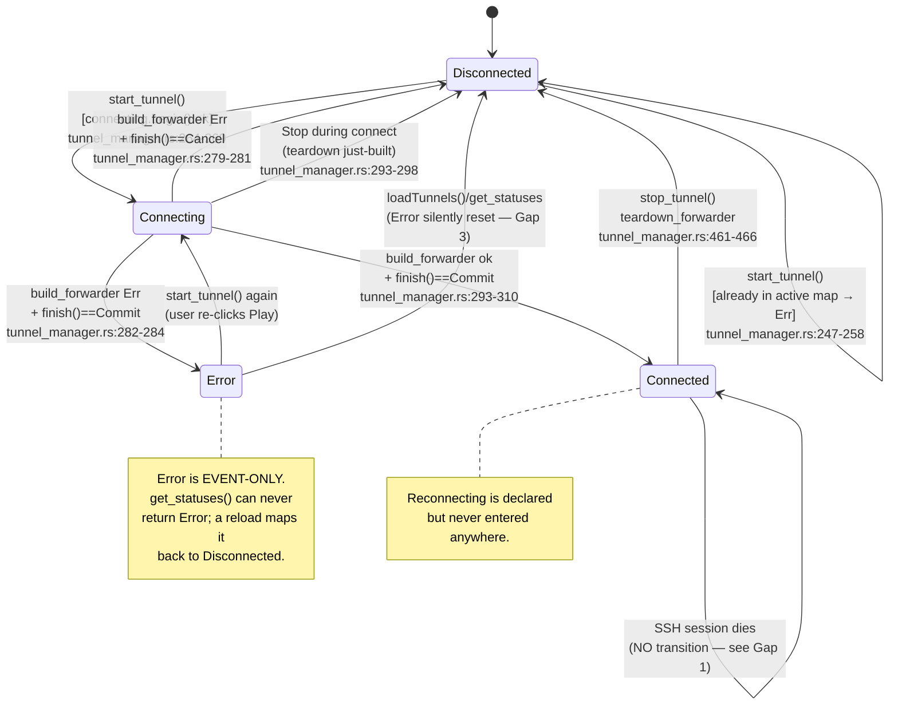
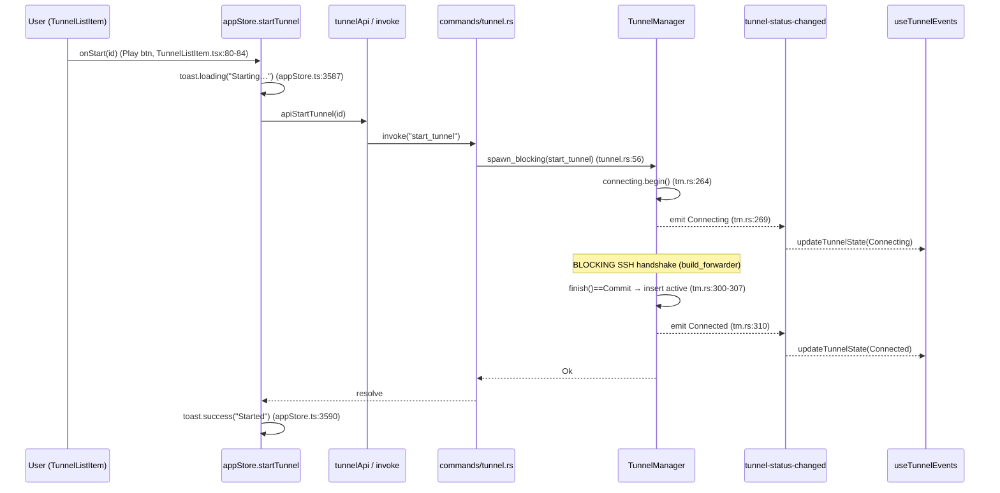
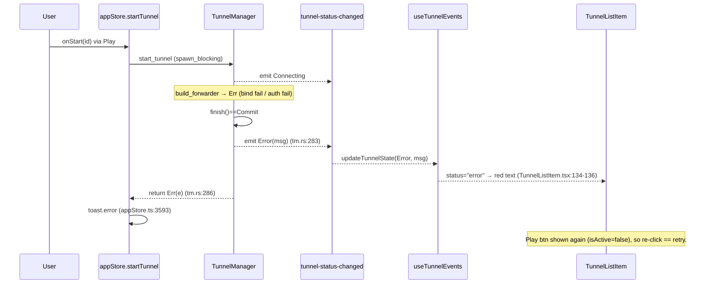

# SSH Tunnel State Machine — Audit

> **Issue:** #1130 — Audit + fix the SSH tunnel state machine
> **Scope:** SSH tunnel lifecycle (start → active → stopped → error → retry)
> **Deliverable:** Audit findings only — analysis, diagrams, and prioritized gaps. No production code changes.

## 1. Where the state lives

The tunnel machine is split across two authorities that are **only loosely reconciled**:

| Layer                             | State carrier                                                               | File:line                                               |
| --------------------------------- | --------------------------------------------------------------------------- | ------------------------------------------------------- |
| Rust — declared status enum       | `TunnelStatus { Disconnected, Connecting, Connected, Reconnecting, Error }` | `src-tauri/src/tunnel/config.rs:76-82`                  |
| Rust — runtime truth (active set) | `active_tunnels: Mutex<HashMap<String, ActiveTunnel>>`                      | `src-tauri/src/tunnel/tunnel_manager.rs:95`             |
| Rust — connecting truth           | `ConnectingTracker` (map of `CancellationToken`)                            | `src-tauri/src/tunnel/connecting.rs:29-31`              |
| Frontend — mirror                 | `tunnelStates: Record<string, TunnelState>`                                 | `src/store/appStore.ts:644, 3616-3620`                  |
| Frontend — derived render flag    | `status`, `isActive`                                                        | `src/components/TunnelSidebar/TunnelListItem.tsx:39-40` |

**Key observation:** the Rust status is _not_ stored anywhere. `get_statuses()` (`tunnel_manager.rs:183-226`) **recomputes** status on every call purely from set membership: in `active_tunnels` → `Connected`; in `ConnectingTracker` → `Connecting`; otherwise → `Disconnected`. There is **no field that can ever hold `Error` or `Reconnecting`**. Those two variants are reachable _only_ through the transient `emit_status` event, never through a queried status. This is the root of several gaps below.

## 2. Real lifecycle state machine (as coded)

### Orphan / unreachable states

- **`TunnelStatus::Reconnecting`** (`config.rs:80`) — never constructed in any production path. Grep of `src-tauri/`/`core/` finds it only in the enum definition and serde tests. `reconnect_on_disconnect` (`config.rs:70`, surfaced as a Toggle at `TunnelEditor.tsx:370-375`) is **persisted but never read** by any runtime code. The whole "Reconnecting" branch of the machine is dead.
- **`TunnelStatus::Error`** — reachable _only_ as a fire-and-forget event (`tunnel_manager.rs:283`), never as a queryable state (§1). It is a transient, not a resting state.

## 3. Cross-actor sequence — Start (happy path)

## 4. Cross-actor sequence — Start fails (silent-error gap)

This path (Play button → failure) _does_ give feedback (toast + red error text). The **silent** failures are the ones that do **not** flow through `start_tunnel`'s return — see Gaps 1 & 2.

## 5. Prioritized gap list

Ranked **stuck / leak / silent-death first**, cosmetic last. Each cites the state/transition, `file:line`, the user-visible symptom, and the smallest fix.

---

### GAP 1 — `Connected → (dead)` : a tunnel whose SSH session dies stays "Connected" forever (silent death + leak) — **CRITICAL**

- **Transition:** the missing edge `Connected --> Error/Disconnected` on peer/session loss.
- **Evidence:** `LocalForwarder`/`DynamicForwarder` accept loops `break` on listener error and log only (`local_forward.rs:124-127`, `dynamic_forward.rs:81-85`); per-connection relays swallow channel-open failures (`local_forward.rs:143-147`, `dynamic_forward.rs:172-181`). Nothing observes `SshSession` liveness. `get_statuses()` reports `Connected` purely from `active_tunnels` membership (`tunnel_manager.rs:197-208`) — the entry is never removed when the underlying session dies. No task ever calls `stop_tunnel` or `emit_status` on transport loss.
- **Symptom:** the bastion drops / laptop sleeps / server reboots → the tunnel is functionally dead, every `localhost:port` connection fails, but the sidebar dot stays green "connected" and the only control is **Stop**. The `ActiveTunnel` (and its pooled endpoint/gateway `PooledRef`, `tunnel_manager.rs:81-86`) linger in the active map and in Open Connections. User has no signal and no Retry.
- **Smallest fix:** give each forwarder a "dead" signal (accept-loop exit / a watch channel from the SSH session), and in the manager spawn a supervisor that, on that signal, removes the entry from `active_tunnels`, drops guards, and `emit_status(Error, "connection lost")` — i.e. actually enter the declared `Error` state. This is also the natural hook point for the unimplemented `reconnect_on_disconnect` (Gap 5).

---

### GAP 2 — `Connecting → Connected` reported even when the accept loop instantly dies (false-positive Connected) — **HIGH**

- **Transition:** `build_forwarder → Connected` (`tunnel_manager.rs:293-310`).
- **Evidence:** `LocalForwarder::start`/`DynamicForwarder::start` bind the listener synchronously (good — a port-in-use bind error _is_ surfaced, `local_forward.rs:72-75`), but then `tokio::spawn(accept_loop)` and immediately return `Ok` (`local_forward.rs:82-90`). For **Remote** forwarding the server-side `tcpip_forward` is awaited (`remote_forward.rs:36-40`) so a rejected remote bind _is_ caught — but the local relay target is never validated. Any post-bind failure (accept loop `break`, remote target `connect` refused at `remote_forward.rs:110-119`) happens after `Ok` was already returned → status is `Connected`.
- **Symptom:** tunnel shows green "connected" but no traffic can pass (e.g. remote-forward's local target port isn't listening). No error, no toast.
- **Smallest fix:** same supervisor as Gap 1 — treat an early accept-loop exit as a transition to `Error`. Additionally surface per-connection relay failures as a transient status/toast rather than `tracing::error!` only.

---

### GAP 3 — `Error` is not a resting state; a reload silently launders it back to `Disconnected` (ambiguous/overloaded state) — **HIGH**

- **Transition:** `Error --> Disconnected` via `loadTunnels()` / `get_statuses()`.
- **Evidence:** `get_statuses()` has no branch that can emit `Error` (`tunnel_manager.rs:203-221`); it only knows `Connected`/`Connecting`/`Disconnected`. The frontend `Error` status lives _only_ in `tunnelStates` from the one-shot event (`useTunnelEvents.ts:17-19`). `loadTunnels` overwrites the whole map from `get_statuses` (`appStore.ts:3541-3549`), so any window reload / re-open replaces `Error` with `Disconnected`. Open Connections' `activeTunnels` filter only counts `connected`/`connecting` (`OpenConnectionsModal.tsx:117-120`), so an errored tunnel never appears there.
- **Symptom:** a tunnel that failed shows a red error until the next status refresh, then reverts to a normal "disconnected/Play" row as if nothing happened — the failure cause is lost. Two very different situations ("never started" and "died with an error") share one visible state.
- **Smallest fix:** persist last-error per tunnel in the manager (a `Mutex<HashMap<String, String>>` set on the `Error` branch, cleared on successful `start`/`stop`) and have `get_statuses` return `Error{error}` for those ids so the state survives reloads and shows in Open Connections.

---

### GAP 4 — Start/Stop can double-fire during `Connecting` (button not gated to the pending state) — **HIGH (race)**

- **Transition:** UI-triggered `start_tunnel` / `stop_tunnel` while `status == "connecting"`.
- **Evidence:** `TunnelListItem` treats `connecting` and `reconnecting` as `isActive` and therefore shows the **Stop** button (`TunnelListItem.tsx:40, 64-75`) — good, Stop during connect is wanted (and handled via `ConnectingTracker`, `tunnel_manager.rs:469-476`). But neither `startTunnel` nor `stopTunnel` in the store guards against being fired again while a prior call is in flight (`appStore.ts:3585-3614`) — the toast id is regenerated each click and both calls hit the backend. The backend _does_ defend the start side (`connecting.begin()` returns `None` on a second start → Err, `connecting.rs:46-54`; active-map check, `tunnel_manager.rs:247-258`), so a true double-PTY is prevented. However rapid **Stop then Start** while connecting: the first Stop cancels the token (`request_cancel`, `connecting.rs:64-72`); a second Start before `finish()` runs sees the id still in the tracker and is rejected with a confusing "already connecting" error toast.
- **Symptom:** fast double-clicking Start/Stop on a connecting tunnel yields spurious "already active"/"already connecting" error toasts even though nothing is wrong; the visible state can briefly flip Stop→Play→Stop.
- **Smallest fix:** in the store, ignore re-entrant `startTunnel`/`stopTunnel` for an id whose status is already `connecting` (or disable the button while a call is pending); optionally map the backend "already connecting/active" errors to a no-op instead of an error toast.

---

### GAP 5 — `reconnect_on_disconnect` toggle is a no-op (dead control feeding a dead state) — **MEDIUM**

- **State:** the intended `Connected --> Reconnecting --> Connecting` sub-machine.
- **Evidence:** the Toggle is rendered and persisted (`TunnelEditor.tsx:370-375`, `config.rs:70`) but `reconnect_on_disconnect` is never read in `tunnel_manager.rs` (grep: only definition + tests). No code ever sets `TunnelStatus::Reconnecting` (`config.rs:80`).
- **Symptom:** user enables "Reconnect automatically on disconnect", the tunnel drops, nothing reconnects — a promised feature silently does nothing. (Compounded by Gap 1: a drop isn't even detected.)
- **Smallest fix:** once Gap 1's supervisor exists, branch on `reconnect_on_disconnect`: emit `Reconnecting`, back off, and re-run the start path; otherwise emit `Error`. Until implemented, the honest interim is to hide/disable the toggle so it doesn't imply behavior that doesn't exist.

---

### GAP 6 — Live stats never update after start; the `tunnel-stats-updated` event has no emitter (stale UI) — **MEDIUM**

- **Evidence:** `emit_status` always ships `TunnelStats::default()` (all zeros) (`tunnel_manager.rs:564-571`), so the `Connected` event carries no traffic. Real stats exist only behind the pull API `get_statuses` (`tunnel_manager.rs:198-208`), which the sidebar calls once in `loadTunnels` and never again. The push channel `tunnel-stats-updated` is defined on both sides (`events.ts:362-369`, `useTunnelEvents.ts:21-26`) but **nothing in Rust ever emits it** (grep: zero `emit("tunnel-stats-updated")`).
- **Symptom:** the sidebar's `↑/↓ bytes` and `N conn` (`TunnelListItem.tsx:127-132`) freeze at 0 for the tunnel's whole lifetime; Open Connections shows no throughput either.
- **Smallest fix:** either spawn a periodic emitter of `tunnel-stats-updated` per active tunnel, or have the sidebar poll `get_tunnel_statuses` on an interval while any tunnel is active. (The push route is cheaper and matches the already-wired hook.)

---

### GAP 7 — `deleteTunnel` swallows errors and doesn't stop a running tunnel from the store's view (potential leak/desync) — **LOW/MEDIUM**

- **Evidence:** backend `delete_tunnel` _does_ call `stop_tunnel` first (`tunnel_manager.rs:164-166`) — correct. But the store `deleteTunnel` catches and only `console.error`s (`appStore.ts:3571-3583`), giving no user feedback (violates the "every action gives feedback" rule) and, on failure, leaves the row visually removed while the backend may still hold it. `handleDelete` has no confirmation for an _active_ tunnel (`TunnelSidebar.tsx:43-48`).
- **Symptom:** deleting a running tunnel silently kills it with no toast; a delete that fails backend-side desyncs the list.
- **Smallest fix:** add a loading/success/error toast to `deleteTunnel` (like start/stop already have), and confirm-before-delete when the tunnel is active.

---

### GAP 8 — `stop_tunnel` during `Connecting` returns `Ok` but the forwarder is torn down only _after_ the full blocking handshake (delayed teardown) — **LOW**

- **Evidence:** the cancel token is threaded into the SSH connect (`tunnel_manager.rs:264, 275`, `connect_through_gateway` selects on `cancel.cancelled()`, `tunnel_manager.rs:425-435`) so cancellation is prompt for the _jumped_ path, and the direct path passes the token to `core_connect_cancellable`/`connect_with_registry_cancellable`. The UI is told "Disconnected" immediately (`tunnel_manager.rs:473-475`). Good design overall (#829/#841). The residual risk: if `build_forwarder` _succeeds_ in the race window before the cancel is observed, teardown happens at `tunnel_manager.rs:293-298` — correct, but the pooled endpoint session may already have been created and is only drained when guards drop.
- **Symptom:** minor — brief lifetime of a pooled SSH session that's immediately dropped; no user-visible leak. Listed for completeness.
- **Smallest fix:** none required; behavior is correct. Worth a regression test asserting `active_tunnels`/pool counts return to zero after Stop-during-connect.

---

### GAP 9 — Open Connections "Kill" optimistically prunes local state, masking a failed stop — **LOW**

- **Evidence:** `handleKillTunnel`/`handleKillAllTunnels` `await stopTunnel` then unconditionally strip the row from local `tunnelStates` (`OpenConnectionsModal.tsx:201-209`). If `stopTunnel` throws (it re-throws, `appStore.ts:3612`), the `await` rejects and the row-prune is skipped — acceptable — but there's no error surfaced beyond the store's toast, and the panel's `tunnelStates` are a **separate copy** fetched once on open (`OpenConnectionsModal.tsx:108-114`), not the store's live map, so it can drift from the sidebar.
- **Symptom:** the Open Connections tunnel list can show stale membership vs. the sidebar; a genuinely-stuck tunnel (Gap 1) never appears here to be killed.
- **Smallest fix:** drive the panel's tunnel list from the store's `tunnelStates` (single source) rather than a one-shot `getTunnelStatuses`, and include `error` tunnels once Gap 3 makes `Error` queryable.

## 6. Missing controls list

Buttons/menu items the correct machine needs but the UI does not expose, each tied to the transition it would fire:

| Control                                                     | Where it belongs                                                                                                              | Transition it fires                                           | Why it's missing today                                                                                                                                                                  |
| ----------------------------------------------------------- | ----------------------------------------------------------------------------------------------------------------------------- | ------------------------------------------------------------- | --------------------------------------------------------------------------------------------------------------------------------------------------------------------------------------- |
| **Retry**                                                   | `TunnelListItem` when `status === "error"`                                                                                    | `Error --> Connecting`                                        | Today the Play button _is_ the only retry, but it disappears the instant `Error` is laundered to `Disconnected` (Gap 3); an explicit Retry that also clears the stored error is needed. |
| **Reconnect / force-reconnect**                             | `TunnelListItem` when `status === "connected"` but session is dead                                                            | `Connected --> Connecting`                                    | No liveness detection exists (Gap 1), so the UI can't even offer it.                                                                                                                    |
| **Cancel (connecting)**                                     | already covered by the Stop button during `connecting` (`TunnelListItem.tsx:64-75`) → `stop_tunnel` cancel path. **Present.** | `Connecting --> Disconnected`                                 | — (works; keep).                                                                                                                                                                        |
| **View last error**                                         | `TunnelListItem` / Open Connections on an errored tunnel                                                                      | (no transition; diagnostic)                                   | Error text shows only transiently (`TunnelListItem.tsx:134-136`) and is lost on reload (Gap 3).                                                                                         |
| **Confirm-delete for active tunnel**                        | `handleDelete` in `TunnelSidebar`                                                                                             | `Connected/Connecting --> Disconnected --> (removed)`         | Delete silently stops+removes with no confirmation or feedback (Gap 7).                                                                                                                 |
| **Stop from Open Connections for a _stuck/errored_ tunnel** | `OpenConnectionsModal` tunnel section                                                                                         | force `Connected(stale)/Error --> Disconnected` + drop guards | The filter only lists `connected`/`connecting` (`OpenConnectionsModal.tsx:117-120`), so a leaked/errored tunnel (Gaps 1, 3) can't be force-killed from the canonical kill panel.        |

## 7. Summary of the delta (ideal vs. coded)

- The machine has **two terminal-ish states declared but not real**: `Error` is event-only (not queryable, lost on reload) and `Reconnecting` is entirely dead.
- The single biggest defect is the **missing `Connected → Error` edge on session death** (Gap 1): the active map is treated as ground truth for "connected" but is never invalidated when the transport dies, producing a silent-death + resource-leak state that also disappears from the Open Connections kill panel.
- Feedback is good on the _user-initiated_ start/stop paths (toasts, red error text) but **absent for backend-initiated transitions** (session loss, post-bind failures, stats) because those never reach the UI.
- The `reconnect_on_disconnect` toggle and the `tunnel-stats-updated` push channel are **wired end-to-end on the frontend but have no Rust producer** — promised behavior that silently does nothing.

Recommended fix order: **Gap 1 → 2 → 3** (make session death observable and `Error` a real persisted, queryable state, surfaced in the sidebar + Open Connections), then **Gap 4** (re-entrancy guard), then **Gap 5/6** (reconnect + live stats on top of the new supervisor), then the LOW cosmetic/feedback items.
