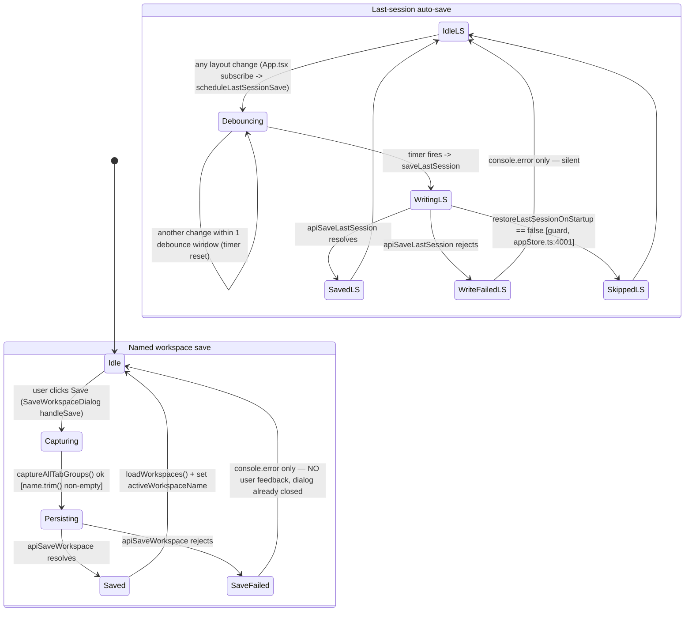
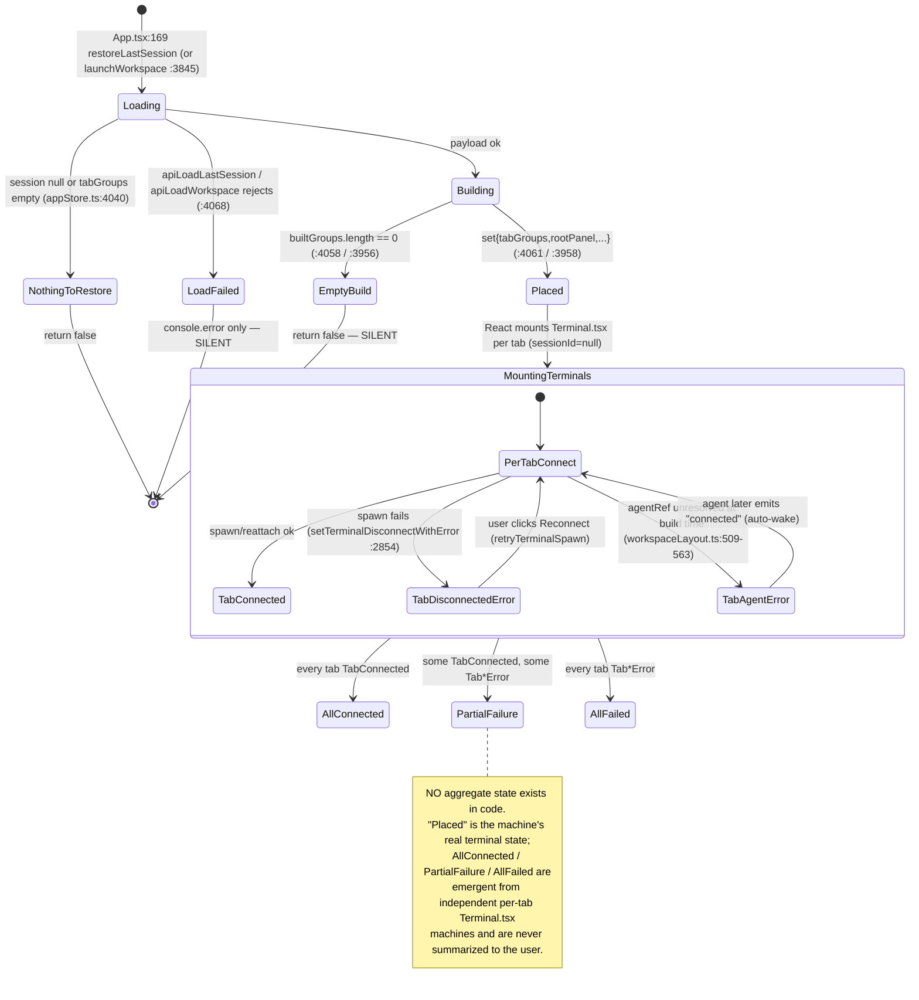
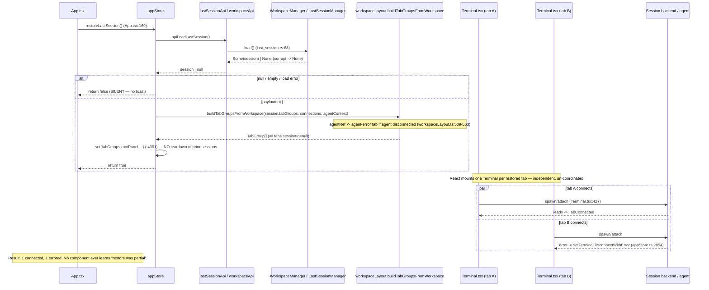

# Workspace Save/Restore State Machine — Audit

> **Issue:** #1135 — Audit + fix the workspace save/restore state machine
> **Scope:** Workspace save (idle → saving → saved) and restore (loading → restoring → restored / partial-failure)
> **Deliverable:** Audit findings only — analysis, diagrams, and prioritized gaps. No production code changes.

## 1. What the machine actually is

There are **two distinct save/restore subsystems**, and neither has an explicit status enum — both are one-shot `async` functions wrapped in `try/catch` that resolve silently or log to `console.error`:

| Subsystem               | Save trigger                                                                             | Restore trigger                                                      | Persistence                                                                |
| ----------------------- | ---------------------------------------------------------------------------------------- | -------------------------------------------------------------------- | -------------------------------------------------------------------------- |
| **Named workspaces**    | `saveCurrentAsWorkspace` (`appStore.ts:3970`), `saveWorkspaceToBackend` (`:3769`)        | `launchWorkspace` (`appStore.ts:3845`) — double-click / Play button  | `workspaces.json` via `WorkspaceStorage::save` (`storage.rs:86`)           |
| **Last session (auto)** | `saveLastSession` (`appStore.ts:3998`), debounced by `scheduleLastSessionSave` (`:4029`) | `restoreLastSession` (`appStore.ts:4037`) on startup (`App.tsx:169`) | `last-session.json` via `LastSessionManager::save` (`last_session.rs:123`) |

**The critical architectural fact:** neither restore path connects any terminals. `buildTabGroupsFromWorkspace` (`workspaceLayout.ts:668`) → `buildPanelTreeFromWorkspace` (`:432`) produces `TerminalTab` structs with **`sessionId: null`** (`:441-469`). The actual per-session reconnect fan-out happens **later and independently** inside each mounted `Terminal.tsx` (connect logic around `Terminal.tsx:310-535`, overlay/retry state in `appStore.ts` via `terminalRetryCounters` `:508`, `terminalDisconnectErrors` `:524`, `setTerminalDisconnectWithError` `:2854`). So "restore" as a state machine **ends the moment the tab structs are placed in the store** — there is no aggregate notion of "restoring sessions" or "restored / partial-failure" anywhere in the workspace layer. That absence is the root of most gaps below.

`agentRef` tabs are the one exception that is pre-resolved: at build time a disconnected/missing agent resolves to an **`agent-error`** tab (`workspaceLayout.ts:496-564`) rather than a live terminal — that is the only place partial-failure is modeled as a first-class visible state, and only for agent tabs.

---

## 2. Save lifecycle — state diagram

**Key save observations (grounded):**

- `SaveFailed` is a **silent terminal transition**. `saveCurrentAsWorkspace` re-throws (`appStore.ts:3994`) but the caller `handleSaveCurrent` (`WorkspaceSidebar.tsx:55-61`) does **not** await and does **not** catch — it fires `saveCurrentAsWorkspace(...)` then synchronously `setShowSaveDialog(false)` (`WorkspaceSidebar.tsx:57-58`). The dialog closes optimistically; a rejected save leaves the user believing it succeeded. No toast, unlike connection saves which do toast (`appStore.ts:2498`, `:2503`).
- Auto-save write failure is fully silent (`appStore.ts:4024-4026`) — acceptable for a background bookkeeping write, but there is no "last session may be stale" signal anywhere.
- The last-session debounce timer is a **module-global** (`lastSessionPersistTimer`, `appStore.ts:729`), not per-store — fine for a singleton app but a latent hazard for tests/multi-store.

---

## 3. Restore lifecycle — state diagram (partial-failure modeled explicitly)

**Key restore observations (grounded):**

- `LoadFailed` (`appStore.ts:4068`, `:3965`) and `EmptyBuild` (`:4058`, `:3956`) are both **silent** — a corrupt/unreadable session or a workspace whose every connection ref went missing yields an empty window with zero explanation.
- **`launchWorkspace` and `restoreLastSession` both blindly `set(...)` the new `tabGroups`/`rootPanel` (`appStore.ts:3958-3964`, `:4061-4066`) without closing the currently-open live sessions.** No `closeTab`/`closeTabGroup`/session-kill is called first (verified: only `closeTabGroup`/`closeTab` exist at `:954`/`:1870`, neither is invoked from either path). Any live PTY/SSH/agent session that was open is dropped from the store — its backend resource is orphaned (see leak analysis §5).
- The corrupt last-session file is swallowed to `Ok(None)` (`last_session.rs:76-82`) — correct for not blocking startup, but it means a user who had a session silently gets a blank window with no "we couldn't restore your last session" notice.

---

## 4. Restore fan-out — sequence diagram

The fan-out is **not orchestrated by the restore action** — it is the emergent sum of N independent `Terminal.tsx` mounts. There is no `Promise.all`, no counter, no completion event for "all restored tabs settled," and therefore no place to raise a summary toast such as _"Restored 5 tabs — 2 could not reconnect."_

---

## 5. Prioritized gap list (stuck / leak / data-loss first)

### G1 — Restore/launch orphans live sessions (resource leak) — **HIGH**

- **State/transition:** `Placed` transition in both restore machines.
- **file:line:** `appStore.ts:3958-3964` (`launchWorkspace`) and `appStore.ts:4061-4066` (`restoreLastSession`) — `set(...)` replaces `tabGroups`/`rootPanel` with **no** preceding teardown.
- **Symptom:** Double-clicking a workspace (or a startup restore that runs after tabs already exist, e.g. CLI workspace at `App.tsx:158` then restore) discards the current live tabs from the store. Their backend PTY/SSH/agent sessions are never closed — they linger in the **Open Connections panel** (`OpenConnectionsModal.tsx`) with no tab to reach them, exactly the "leaked" signature the mandate flags.
- **Smallest fix:** Before the `set(...)`, enumerate the existing `tabGroups` leaves and call the existing `closeTab`/session-kill for each (or add a `teardownAllSessions()` helper), then place the new groups. Guard `launchWorkspace` with a confirm-if-dirty prompt (see missing controls M1).

### G2 — Silent save failure with false success (data-loss) — **HIGH**

- **State/transition:** `Persisting → SaveFailed`.
- **file:line:** `WorkspaceSidebar.tsx:55-61` (dialog closes without awaiting), `appStore.ts:3992-3995` (throws into the void).
- **Symptom:** If `apiSaveWorkspace` rejects (disk full, permission, lock poisoned — `manager.rs:87-89` / `storage.rs:86-90` all surface `WorkspaceError`), the dialog closes and the user believes the workspace was saved. It wasn't — silent data loss.
- **Smallest fix:** Make `handleSaveCurrent` `async` and `await` the save inside `try/catch`; keep the dialog open on error and `toast.error(...)`; only `setShowSaveDialog(false)` and `toast.success(...)` on resolve — mirroring the connection-save feedback at `appStore.ts:2498/2503`.

### G3 — Silent restore failure = blank window (stuck / no-feedback) — **HIGH**

- **State/transition:** `Loading → LoadFailed`, `Building → EmptyBuild`, corrupt-file → `None`.
- **file:line:** `appStore.ts:4068-4070` and `:3965-3967` (console.error only); `last_session.rs:76-82` (corrupt → `Ok(None)`); `appStore.ts:4058`, `:3956` (empty build → silent `return false`).
- **Symptom:** User who had a populated session/workspace opens the app to an empty window with no explanation; or launches a workspace whose connections were deleted and gets nothing. Indistinguishable from "nothing was saved."
- **Smallest fix:** On `LoadFailed`/`EmptyBuild`, `toast.error("Could not restore last session")` / `toast.warning("Workspace \"X\" had no launchable tabs")`. For the corrupt-file case, surface a recovery warning the way `workspaces.json` corruption already does via `RecoveryWarning` + `RecoveryDialog` (`storage.rs:64-72`, `App.tsx:281`) — `last_session.rs` currently has no equivalent warning channel.

### G4 — No aggregate partial-restore feedback (no-feedback) — **MEDIUM**

- **State/transition:** the missing `PartialFailure` / `AllFailed` aggregate states.
- **file:line:** absent by construction — fan-out is per-tab in `Terminal.tsx` (`:310-535`); the workspace layer stops at `set(...)` (`appStore.ts:4061`). Per-tab errors live isolated in `terminalDisconnectErrors` (`appStore.ts:524`).
- **Symptom:** Restore 6 tabs, 2 fail to reconnect. The 2 failures are only visible if the user manually clicks into each tab (per-tab overlay). No "Restored 4 of 6 tabs (2 failed)" summary anywhere.
- **Smallest fix:** After `set(...)`, register the set of restored tab ids as a pending cohort; when each Terminal settles (connected or `setTerminalDisconnectWithError`), decrement; on cohort completion raise one summary toast. Alternatively a lighter first step: a badge on the Workspace sidebar / status bar reading `activeWorkspaceName` (`appStore.ts:666`) plus failed count.

### G5 — Race: auto-save can capture a mid-restore layout (data corruption of session file) — **MEDIUM**

- **State/transition:** `Debouncing` overlapping `Placed → MountingTerminals`.
- **file:line:** auto-save subscription attached _after_ restore (`App.tsx:178` `enableAutoSave()` runs post-restore) — good — **but** any manual tab action during the debounce window, or a `set(...)` from an in-flight per-tab connect that mutates `rootPanel`, fires `scheduleLastSessionSave` (`App.tsx:132-142`). Because `saveLastSession` recaptures the _whole_ live tree (`appStore.ts:4002-4007`), a save landing while some tabs are still `agent-error`/unconnected persists that degraded snapshot over the good one.
- **Symptom:** Restart during/right after a partial restore → the previously-good last session gets overwritten with the partially-failed layout; agent-error tabs get re-persisted as agent-error (`captureTab` preserves `agentRef`, `workspaceLayout.ts:626-632`), which is intended, but transient failures become sticky.
- **Smallest fix:** Gate `scheduleLastSessionSave` behind a `restoreInProgress` flag until the restored cohort settles (ties to G4's cohort tracking); or debounce longer than the expected connect settle time. At minimum, add a `restoreInProgress` boolean to the store and skip auto-save while true.

### G6 — Race / double-fire: launch button not disabled during launch — **LOW/MEDIUM**

- **State/transition:** `Loading` re-entry.
- **file:line:** `WorkspaceListItem.tsx:32-40` (Launch button + `onDoubleClick` at `:23`) → `launchWorkspace` (`appStore.ts:3845`), which has no in-flight guard and awaits credential unlock (`:3885`) and agent connects (`:3893`).
- **Symptom:** During the (possibly multi-second) credential-unlock / agent-connect phase, a second double-click starts a second `launchWorkspace`; two concurrent `set(...)` calls race, and both tear over each other — combined with G1 this multiplies orphaned sessions.
- **Smallest fix:** Track a `launchingWorkspaceId` in the store; disable the Launch/Play controls and ignore re-entry while a launch is in flight (the Button primitive already supports async pending state).

### G7 — Delete/duplicate have no confirmation and no feedback — **LOW**

- **State/transition:** delete transition.
- **file:line:** `WorkspaceListItem.tsx:63-72` → `deleteWorkspaceFromBackend` (`appStore.ts:3779-3788`), which on failure only `console.error`s (`:3786`) and optimistically removes from state (`:3782`) — if the backend delete failed, the item reappears on next `loadWorkspaces` with no explanation.
- **Symptom:** One-click destructive delete of a saved workspace, no confirm, no toast on success or failure; a failed delete silently "un-deletes" on refresh.
- **Smallest fix:** Add a confirm step (or undo toast) before delete; `toast.success/error` on completion; only mutate local state after the backend resolves.

### G8 — Import/Export fully swallow errors — **LOW**

- **file:line:** `WorkspaceSidebar.tsx:65-92` — both `handleExport` (`:74` empty catch) and `handleImport` (`:89` empty catch) discard all errors; import success count from `import_json` (`manager.rs:239`) is never shown.
- **Symptom:** Import that skips duplicates (`manager.rs:206`) or fails parse (`manager.rs:195`) gives zero feedback; user can't tell if 0, some, or all workspaces imported.
- **Smallest fix:** Surface the returned count as `toast.success("Imported N workspaces")` and `toast.error(...)` on failure; distinguish user-cancel (no toast) from real failure.

---

## 6. Missing controls list

| Control                                                                 | Where it belongs                                           | Transition it would fire                                 | Rationale                                                                                                                               |
| ----------------------------------------------------------------------- | ---------------------------------------------------------- | -------------------------------------------------------- | --------------------------------------------------------------------------------------------------------------------------------------- |
| **M1 — "Launch will close current tabs" confirm**                       | `launchWorkspace` entry / `WorkspaceListItem` Play         | guards `Idle → Loading`, forces teardown before `Placed` | Prevents G1 session orphaning + accidental loss of the current live layout.                                                             |
| **M2 — Retry-all / "Reconnect failed tabs"**                            | Workspace sidebar or status bar after a partial restore    | drives every `Tab*Error → PerTabConnect` at once         | Today reconnect is per-tab only (`Terminal.tsx` retry); no bulk recovery from a partial restore (G4).                                   |
| **M3 — "Restore last session now" manual action**                       | Command palette / File menu                                | `Idle → Loading` (last-session) on demand                | Restore only runs at startup (`App.tsx:169`); no way to re-trigger after an accidental close.                                           |
| **M4 — Save success/error feedback (toast)**                            | `saveCurrentAsWorkspace` / dialog                          | makes `Persisting → Saved/SaveFailed` observable         | Closes G2; matches existing connection-save toasts.                                                                                     |
| **M5 — Restore-failed notice / recovery entry for `last-session.json`** | startup, RecoveryDialog channel                            | makes `LoadFailed`/corrupt-`None` observable             | Closes G3; `workspaces.json` already has this via `RecoveryWarning` — `last-session.json` does not (`last_session.rs:76-82`).           |
| **M6 — Cancel during launch**                                           | Launch in-flight (credential unlock / agent connect phase) | `Loading → Idle`                                         | `launchWorkspace` can block on `requestUnlock` (`appStore.ts:3885`) and agent connects (`:3893`) with no abort; user is stuck watching. |
| **M7 — Delete confirmation / undo**                                     | `WorkspaceListItem` delete                                 | gates the delete transition                              | Closes G7; destructive one-click action on named workspaces.                                                                            |

---

## 7. Notes for the implementer

- The cleanest structural fix for G1/G4/G5/G6 is to introduce an explicit **restore-status field** in the store (e.g. `workspaceRestore: { status: "idle" | "loading" | "restoring" | "settled"; total: number; failed: number; launchingId: string | null }`). This gives the machine the aggregate `restoring → restored / partial-failure` states the issue title assumes exist but which the code currently only has emergently. Every gap above except G7/G8 collapses into "read/write this one field."
- **Concept check:** I found no `docs/concepts/**` HTML/MD concept describing the workspace save/restore behavior, so there is no source-of-truth spec to diff against — this audit is reconstructed purely from code. If #1135 proceeds, consider authoring the concept alongside so the fixed machine has an authoritative reference.
- Existing tests cover only the Rust CRUD/round-trip (`manager.rs:403-735`) and the store's happy-path last-session (`appStore.lastSession.test.ts`). There is **no** test for partial-restore, teardown-on-launch, or save-failure feedback — any fix for G1–G4 should ship with regression tests per the TDD workflow.
