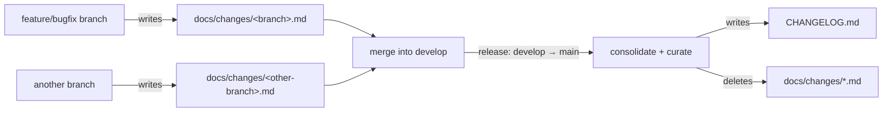

# Change Fragments

This directory holds **per-branch changelog fragments**. It exists so that day-to-day
work on `develop` does **not** touch the shared `CHANGELOG.md` — which used to be the
single biggest source of merge conflicts (nearly every PR edited the same `[Unreleased]`
lines, and each conflict resolution forced another push and another full CI run).

## How it works



- **On a `develop`-targeted branch** (the normal case): if your change is user-facing, add
  a fragment for your branch instead of editing `CHANGELOG.md`. Each branch owns its own
  file, so two branches never conflict.
- **At release time** (`develop` → `main`): a maintainer **consolidates** all fragments
  into `CHANGELOG.md` as a single curated, user-facing version section, then deletes the
  fragments. See [the release process](../contributing.md#release-process).
- **Hotfixes** branched directly from a `main` tag ship immediately and edit `CHANGELOG.md`
  directly — they have no `develop` integration window to consolidate over.

## Why fragments instead of `CHANGELOG.md` entries

From the **user's** perspective, the released changelog should describe the _net_ change,
not the development path. If feature X plus ten fixes against X all land before X ships,
the only release note is "X added" — the ten intermediate fixes are invisible to users and
must **not** clutter the changelog. Only a fix against something **already released on
`main`** is a genuine release-note entry.

Keeping notes in throwaway per-branch fragments makes this curation a deliberate step at
release time, instead of accreting every intermediate commit into `CHANGELOG.md`.

## Creating a fragment

Name the file after your current branch and place it here:

```bash
mkdir -p "docs/changes/$(dirname "$(git branch --show-current)")"
$EDITOR "docs/changes/$(git branch --show-current).md"
```

For branch `feature/1234-new-thing` that is `docs/changes/feature/1234-new-thing.md`. The
branch path (including the `feature/` or `bugfix/` prefix) is kept verbatim, which
guarantees a unique path per branch.

> Skip the fragment entirely for changes that are **not** user-facing (refactors, CI,
> internal docs, test-only work). The changelog is for users.

## Fragment format

Use [Keep a Changelog](https://keepachangelog.com/) categories so the consolidation step
can group entries directly. Only include the categories you need:

```markdown
### Added

- SSH: a short, user-facing description of the new capability (#1234).

### Fixed

- Serial: what was broken and is now fixed, from the user's point of view (#1234).
```

Guidelines:

- Write **user-facing** descriptions, not implementation details.
  - **Good**: "Added support for Git Bash on Windows"
  - **Bad**: "Implemented `GitBashDetector` in `shell_detect.rs`"
- Reference the issue/PR number(s).
- No top-level `#` heading is needed — start at `###` category headings.
- **Security fixes go under a `### Security` category.** At release time the release
  workflow detects that section and injects a `<!-- security -->` marker into the GitHub
  release body; the desktop app's self-update check keys on that marker to flag the release
  as a non-suppressible security update. See
  [`scripts/internal/emit-release-notes.mjs`](../../scripts/internal/emit-release-notes.mjs).
