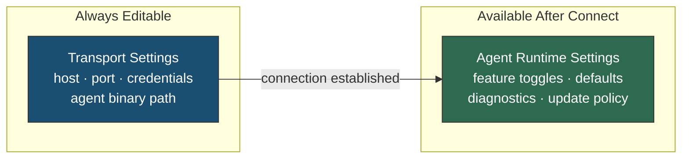
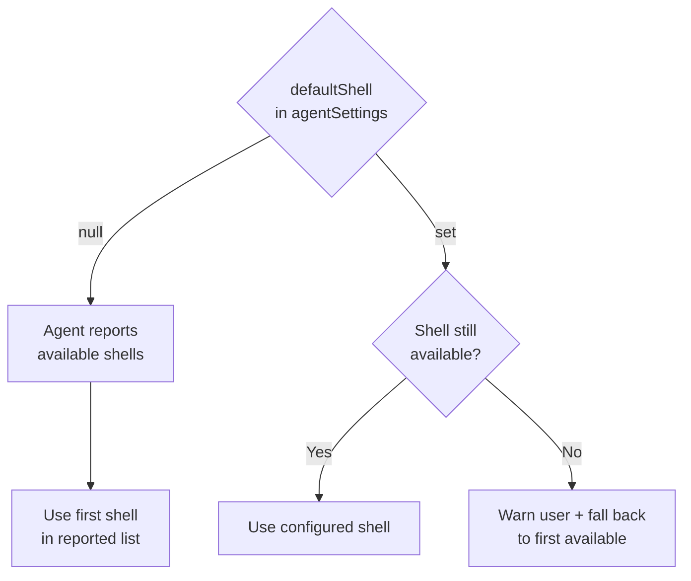
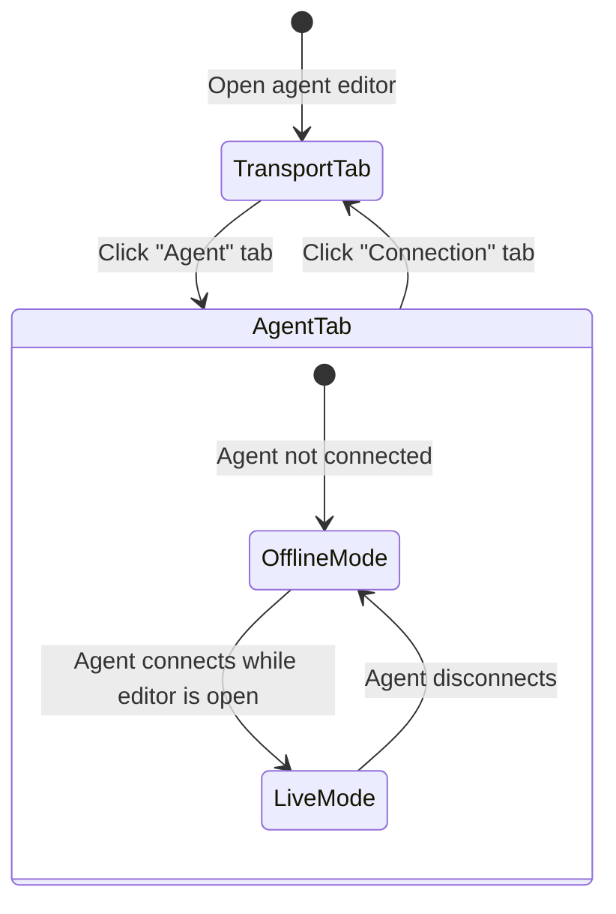
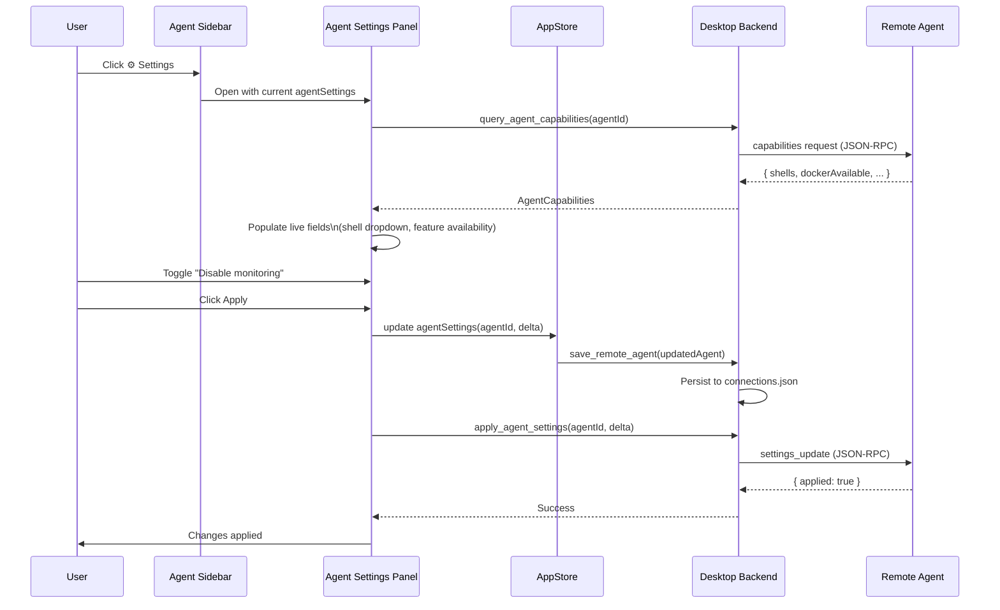
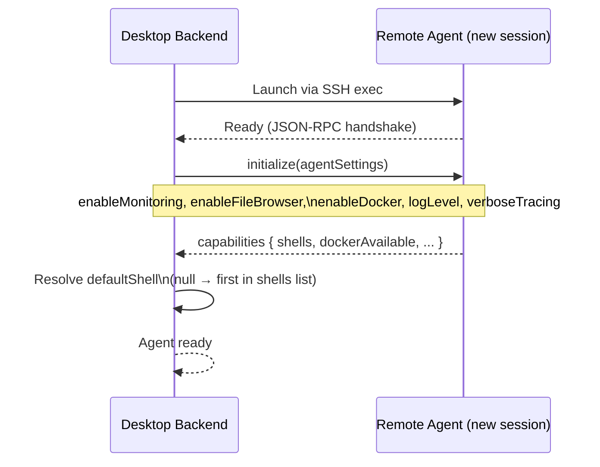

# Agent Settings Separation: Transport vs. Runtime Configuration

> GitHub Issue: [#608](https://github.com/armaxri/termiHub/issues/608)

## Overview

A remote agent connection is configured in one place today, but its settings belong to two fundamentally different categories with different lifecycles and concerns:

1. **Transport settings** — the SSH credentials, host, port, and agent binary path needed to _reach_ the agent. These are always editable and must be set before a connection can be established.

2. **Agent runtime settings** — preferences that govern _what the agent does_ once connected: feature toggles, default session behavior, update preferences, and diagnostic options. These are only fully meaningful (and in some cases, only validatable) after the agent is reachable.

Mixing both categories in a single editor creates friction: transport fields and runtime preferences compete for the user's attention when they are performing very different tasks (configuring access vs. tuning behavior). Separating them improves discoverability, enables live application of runtime changes without reconnecting, and makes the surface area of each category clearer.



---

## UI Interface

### Connection Editor — Two Distinct Sections

The connection editor for a remote agent gains a second tab alongside **Connection** (transport). A new **Agent** tab holds runtime settings:

```
┌─────────────────────────────────────────────────────────────────────┐
│ Edit Remote Agent: prod-server                                       │
│                                                                      │
│  [Connection]  [Agent]                                               │
│                                                                      │
│ ─── Transport ───                                                    │
│ Host:     [prod.example.com         ]                                │
│ Port:     [22   ]                                                    │
│ Username: [deploy]                                                   │
│                                                                      │
│ ─── Authentication ───                                               │
│ Method:   [SSH Key ▾]                                                │
│ Key:      [~/.ssh/id_ed25519       ] [Browse]                        │
│ ☐ Save password in credential store                                  │
│                                                                      │
│ ─── Agent Binary ───                                                 │
│ Path:     [~/.local/bin/termihub-agent]                              │
└─────────────────────────────────────────────────────────────────────┘
```

The **Agent** tab is always reachable in the editor (settings are stored locally with the connection profile) but clearly communicates which fields depend on live agent data:

```
┌─────────────────────────────────────────────────────────────────────┐
│ Edit Remote Agent: prod-server                                       │
│                                                                      │
│  [Connection]  [Agent]                                               │
│                                                                      │
│ ─── Features ───                                                     │
│ ☑ Enable system monitoring                                           │
│ ☑ Enable file browser (SFTP)                                         │
│ ☑ Enable Docker session support                                      │
│                                                                      │
│ ─── Session Defaults ───                                             │
│ Default shell:     [Auto-detect ▾]  ⚠ Connect to query available    │
│ Starting directory:[~            ]                                   │
│                                                                      │
│ ─── Diagnostics ───                                                  │
│ Log level:   [Info ▾]                                                │
│ ☐ Enable verbose protocol tracing                                    │
└─────────────────────────────────────────────────────────────────────┘
```

Fields that can be populated from live agent data show a subtle indicator (⚠) when the agent is not connected. When connected, those fields become auto-populated dropdowns (e.g., shell picker lists actual shells found on the host).

### Agent Settings Panel — Post-Connection Access

When a remote agent is connected, the Agent sidebar section header gains a settings icon that opens a floating **Agent Settings** panel without navigating away from the terminal:

```
┌─────────────────────────────────────────────────────────────────────┐
│ AGENTS                                              [⚙ Settings]    │
│                                                                      │
│ ● prod-server  [connected]                                           │
│   ├─ shell: /bin/bash                                                │
│   ├─ monitoring: active                                              │
│   └─ file browser: active                                            │
└─────────────────────────────────────────────────────────────────────┘
```

The panel mirrors the **Agent** tab from the editor, but with live agent data populated and an **Apply** button that pushes changes to the running agent session without requiring a reconnect (for settings that support live reload):

```
┌─────────────────────────────────────────────────────────────────────┐
│ prod-server — Agent Settings                                    [×] │
│                                                                      │
│ ─── Features ───                                                     │
│ ☑ System monitoring         Status: active  [Disable]               │
│ ☑ File browser (SFTP)       Status: active  [Disable]               │
│ ☑ Docker sessions           Status: active  [Disable]               │
│                                                                      │
│ ─── Session Defaults ───                                             │
│ Default shell:     [/bin/bash ▾]  (detected: bash, zsh, sh)         │
│ Starting directory:[~           ]                                    │
│                                                                      │
│ ─── Diagnostics ───                                                  │
│ Log level:   [Info ▾]                                                │
│ ☐ Verbose protocol tracing                                           │
│                                                                      │
│ Agent version: 1.4.2  [Check for updates]                           │
│                                                                      │
│                               [Cancel]  [Apply]                     │
└─────────────────────────────────────────────────────────────────────┘
```

---

## General Handling

### Setting Categories

| Setting                | Category  | Editable offline?          | Live apply?             |
| ---------------------- | --------- | -------------------------- | ----------------------- |
| Host / port            | Transport | Yes                        | No (reconnect required) |
| SSH credentials        | Transport | Yes                        | No                      |
| Agent binary path      | Transport | Yes                        | No                      |
| Enable monitoring      | Runtime   | Yes (stored locally)       | Yes                     |
| Enable file browser    | Runtime   | Yes (stored locally)       | Yes                     |
| Enable Docker sessions | Runtime   | Yes (stored locally)       | Yes                     |
| Default shell          | Runtime   | Yes (default: auto-detect) | Yes (new sessions)      |
| Starting directory     | Runtime   | Yes                        | Yes (new sessions)      |
| Log level              | Runtime   | Yes                        | Yes                     |
| Verbose tracing        | Runtime   | Yes                        | Yes                     |

### Storage

Agent runtime settings are stored locally in `connections.json` as a new `agentSettings` field on `SavedRemoteAgent`. They are **not** stored on the agent host — the desktop is the source of truth. This avoids per-user config files on servers and keeps all configuration portable.

```json
{
  "id": "Work/prod-server",
  "name": "prod-server",
  "config": {
    /* RemoteAgentConfig: host, port, auth */
  },
  "agentSettings": {
    "enableMonitoring": true,
    "enableFileBrowser": true,
    "enableDocker": true,
    "defaultShell": null,
    "startingDirectory": "~",
    "logLevel": "info",
    "verboseTracing": false
  }
}
```

`defaultShell: null` means "auto-detect from the remote host". When the agent connects, it reports available shells; the auto-detect value resolves to the first shell in that list.

### Defaults and Auto-Detection

The `defaultShell` field follows a resolution chain:



### Live Application of Changes

When the Agent Settings panel is open and the agent is connected, clicking **Apply** sends a configuration update over the existing JSON-RPC connection. The agent applies the delta without restarting:

- **Feature toggles** (monitoring, file browser, Docker): take effect for all new sessions; existing sessions are unaffected
- **Default shell / starting directory**: applied only to sessions opened after the change
- **Log level / tracing**: applied immediately to the agent process

Settings that require reconnection (transport fields) do not appear in the post-connection panel.

### Validation

- The **Agent** tab is always editable offline; no validation against the live agent is required to save
- When connected, the shell dropdown is populated from the agent's reported shell list; the user cannot enter a free-text shell path (prevents typos)
- When not connected, the shell field accepts free-text or remains `null` (auto-detect)

---

## States & Sequences

### Editor Tab State



### Post-Connection Settings Flow



### Agent Connection Startup with Runtime Settings



---

## Preliminary Implementation Details

> Based on the current project architecture at the time of concept creation. The codebase may evolve before implementation.

### Backend (Rust)

#### New `AgentSettings` Type (`src-tauri/src/terminal/backend.rs`)

```rust
/// Runtime behaviour preferences for a connected remote agent.
///
/// Stored locally with the connection profile; sent to the agent on startup
/// and on live updates via the `settings_update` JSON-RPC method.
#[derive(Debug, Clone, Serialize, Deserialize, Default)]
#[serde(rename_all = "camelCase")]
pub struct AgentSettings {
    /// Start the system monitoring subsystem on agent startup.
    #[serde(default = "default_true")]
    pub enable_monitoring: bool,
    /// Start the SFTP file-browser subsystem on agent startup.
    #[serde(default = "default_true")]
    pub enable_file_browser: bool,
    /// Enable Docker/Podman session support on agent startup.
    #[serde(default = "default_true")]
    pub enable_docker: bool,
    /// Preferred shell for new sessions. `None` means auto-detect.
    #[serde(skip_serializing_if = "Option::is_none")]
    pub default_shell: Option<String>,
    /// Default working directory for new sessions.
    #[serde(default)]
    pub starting_directory: String,
    /// Agent log level: "error", "warn", "info", "debug", "trace".
    #[serde(default)]
    pub log_level: String,
    /// Enable verbose JSON-RPC protocol tracing in agent logs.
    #[serde(default)]
    pub verbose_tracing: bool,
}
```

#### Extend `SavedRemoteAgent` (`src-tauri/src/connection/config.rs`)

```rust
pub struct SavedRemoteAgent {
    pub id: String,
    pub name: String,
    pub config: RemoteAgentConfig,
    /// Runtime preferences sent to the agent on startup and on live updates.
    #[serde(default)]
    pub agent_settings: AgentSettings,
}
```

#### New Tauri Commands (`src-tauri/src/commands/connection.rs`)

```rust
/// Return the capabilities reported by a currently-connected agent.
#[tauri::command]
pub async fn query_agent_capabilities(agent_id: String) -> Result<AgentCapabilities>;

/// Push updated AgentSettings to a running agent session (live reload).
/// Also persists the new settings to connections.json.
#[tauri::command]
pub async fn apply_agent_settings(agent_id: String, settings: AgentSettings) -> Result<()>;
```

#### Agent Protocol Extension (`agent/src/protocol/`)

Add a new JSON-RPC method and a startup initialization step:

```
Method: "agent/initialize"
Params: { settings: AgentSettings }
Result: { capabilities: AgentCapabilities }

Method: "agent/settingsUpdate"
Params: { delta: Partial<AgentSettings> }
Result: { applied: true }
```

`AgentCapabilities` includes:

- `availableShells: Vec<String>` — full paths to available shells
- `dockerAvailable: bool` — whether Docker/Podman is on PATH
- `monitoringSupported: bool` — whether `/proc` or equivalent is readable
- `agentVersion: String`

#### Agent Startup Flow (`src-tauri/src/terminal/agent_manager.rs`)

After the JSON-RPC handshake succeeds, send `agent/initialize` with the stored `AgentSettings` before opening any sessions. Cache the returned `AgentCapabilities` on the desktop side so the UI can query them without a round-trip.

### Frontend (React/TypeScript)

#### New Type (`src/types/terminal.ts`)

```typescript
export interface AgentSettings {
  enableMonitoring: boolean;
  enableFileBrowser: boolean;
  enableDocker: boolean;
  defaultShell: string | null;
  startingDirectory: string;
  logLevel: "error" | "warn" | "info" | "debug" | "trace";
  verboseTracing: boolean;
}

export interface AgentCapabilities {
  availableShells: string[];
  dockerAvailable: boolean;
  monitoringSupported: boolean;
  agentVersion: string;
}
```

#### Connection Editor Changes (`src/components/ConnectionEditor/`)

- Add `"agent"` to the editor category list for agent-transport mode:

  ```typescript
  const AGENT_TRANSPORT_CATEGORIES = [
    { id: "connection", label: "Connection" },
    { id: "agent", label: "Agent" }, // new
  ];
  ```

- New component `AgentSettingsForm.tsx` renders the `AgentSettings` fields. Uses a static schema (no `DynamicForm` needed — the fields are fixed and known).

#### Agent Settings Panel (`src/components/EmbeddedServerSidebar/` or new `AgentSettingPanel/`)

A floating modal/panel rendered from the Agent sidebar. Props:

```typescript
interface AgentSettingsPanelProps {
  agentId: string;
  settings: AgentSettings;
  capabilities: AgentCapabilities | null; // null when not connected
  onApply: (delta: Partial<AgentSettings>) => Promise<void>;
  onClose: () => void;
}
```

#### API Layer (`src/services/api.ts`)

```typescript
/** Query capabilities of a currently-connected agent. */
export function queryAgentCapabilities(agentId: string): Promise<AgentCapabilities>;

/** Push live settings update to a running agent and persist locally. */
export function applyAgentSettings(agentId: string, settings: AgentSettings): Promise<void>;
```

#### Store (`src/store/appStore.ts`)

Cache `AgentCapabilities` per `agentId` in the Zustand store so any component can access them without another IPC call. Invalidate the cache when the agent disconnects.

### Modified Files

| File                                                       | Change                                                          |
| ---------------------------------------------------------- | --------------------------------------------------------------- |
| `src-tauri/src/terminal/backend.rs`                        | Add `AgentSettings` struct                                      |
| `src-tauri/src/connection/config.rs`                       | Add `agent_settings` field to `SavedRemoteAgent`                |
| `src-tauri/src/terminal/agent_manager.rs`                  | Send `agent/initialize` after handshake, cache capabilities     |
| `src-tauri/src/commands/connection.rs`                     | Add `query_agent_capabilities`, `apply_agent_settings` commands |
| `agent/src/protocol/`                                      | Add `agent/initialize` and `agent/settingsUpdate` methods       |
| `agent/src/handler/`                                       | Handle new protocol methods                                     |
| `agent/src/state/`                                         | Store active `AgentSettings` for the session                    |
| `core/src/protocol/`                                       | Define shared `AgentSettings` and `AgentCapabilities` types     |
| `src/types/terminal.ts`                                    | Add `AgentSettings`, `AgentCapabilities` TS types               |
| `src/services/api.ts`                                      | Add new IPC bindings                                            |
| `src/store/appStore.ts`                                    | Cache capabilities per agent                                    |
| `src/components/ConnectionEditor/ConnectionEditor.tsx`     | Add "Agent" tab for agent-transport mode                        |
| `src/components/ConnectionEditor/AgentSettingsForm.tsx`    | New — agent runtime settings form                               |
| `src/components/AgentSettingsPanel/AgentSettingsPanel.tsx` | New — post-connection floating panel                            |

### Implementation Phases

1. **Phase 1 — Data model**: Add `AgentSettings` + `AgentCapabilities` types in Rust and TypeScript. Extend `SavedRemoteAgent` with `agent_settings`. Update save/load paths. No behavioral change yet.

2. **Phase 2 — Startup initialization**: Send `agent/initialize` after handshake. Agent applies the settings (feature toggles → start/skip subsystems). Desktop caches capabilities.

3. **Phase 3 — Editor UI**: Add "Agent" tab to the connection editor for remote agent transport mode. Render `AgentSettingsForm`. Wire to existing save path.

4. **Phase 4 — Post-connection panel**: Build `AgentSettingsPanel`. Wire ⚙ button in Agent sidebar. Populate from cached capabilities. Implement `apply_agent_settings` IPC command + `agent/settingsUpdate` RPC method.

5. **Phase 5 — Live shell/feature toggle**: Polish the shell auto-detect flow. Test all live-apply settings. Handle edge cases (agent disconnects while panel is open).
