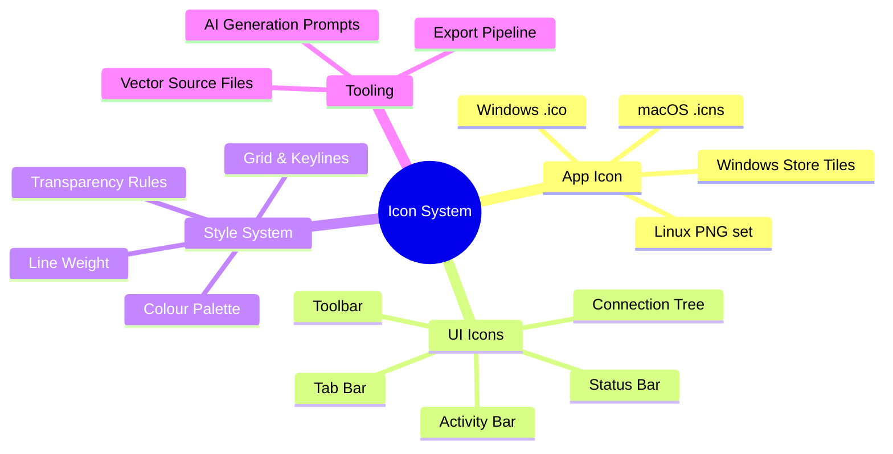
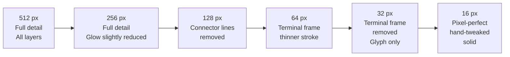
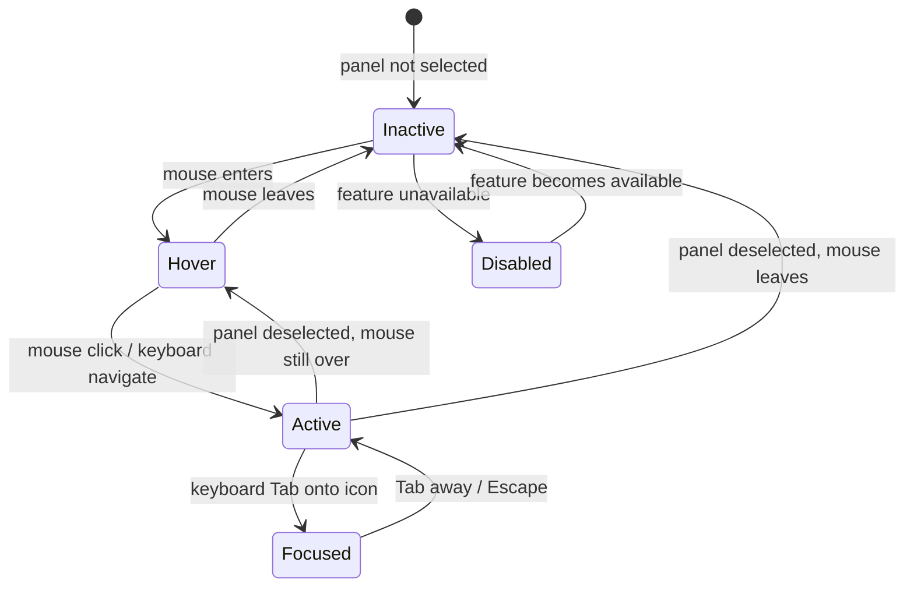
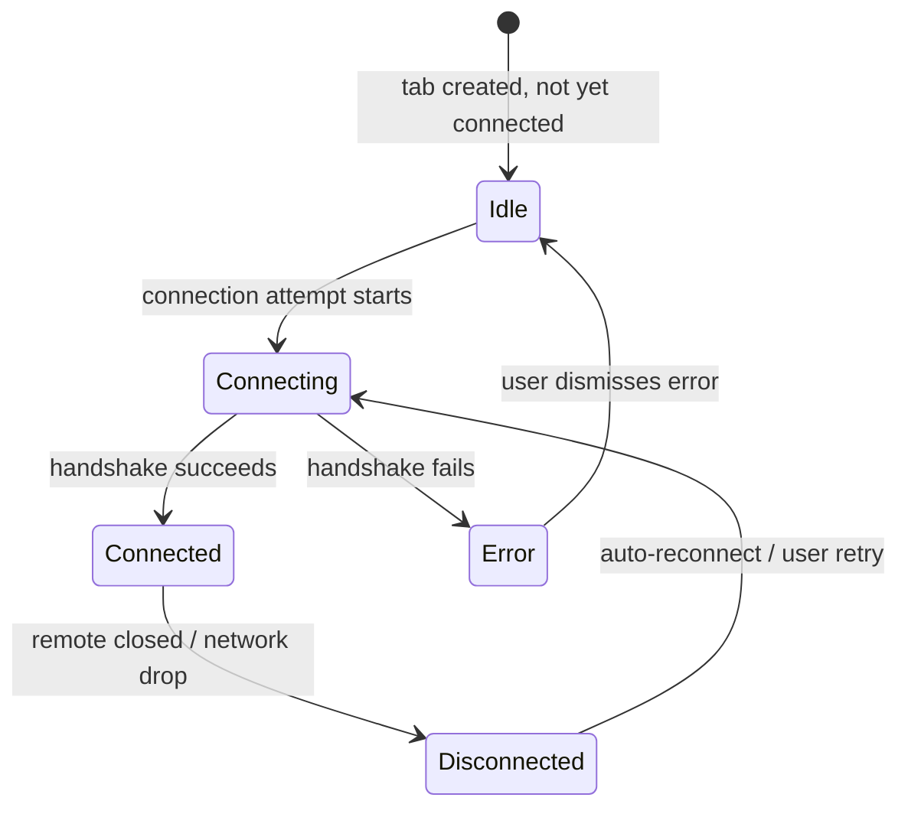
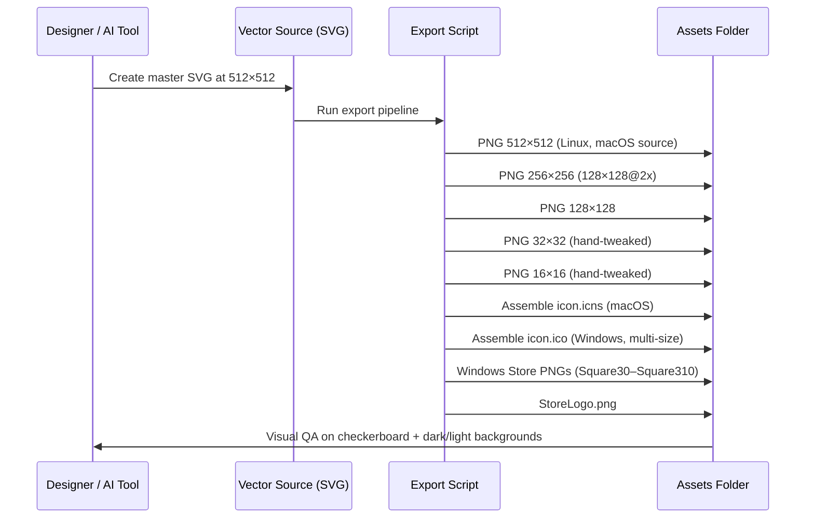

# App Icons — Modern, Transparency-Aware Design

> GitHub Issue: [#641](https://github.com/armaxri/termiHub/issues/641)

## Overview

termiHub currently ships the default Tauri-generated placeholder icon set: a flat, untextured glyph with no depth, no transparency work, and no visual connection to the application's identity. On macOS the icon stands out poorly in the Dock and Launchpad; on Windows it appears dull in the taskbar and File Explorer; on Linux it lacks the refinement expected of a polished desktop app.

**Motivation**: a cohesive, modern icon set serves two roles simultaneously. First, it communicates brand identity — users should recognise termiHub at a glance in alt-tab, Dock, task switcher, pinned taskbar entries, and system notifications. Second, it anchors the application's visual language: the same shapes, palette, and transparency conventions used in the app icon inform how UI icons (sidebar, tab bar, toolbar, status bar) are drawn and perceived.

**Scope of this concept**:

1. **Application icon** — the single icon representing the termiHub process on all three platforms, in all required sizes
2. **UI icon family** — sidebar activity-bar icons, tab-type icons, status-bar glyphs, toolbar buttons
3. **Style system** — the shared rules that tie the two categories together (grid, line weight, corner radius, palette, transparency)
4. **Tooling guidance** — recommended AI-assisted and manual workflows for producing transparency-aware, multi-resolution assets



---

## UI Interface

### Where Icons Appear

| Location                       | Icon Type             | Sizes Used              | Notes                                                                      |
| ------------------------------ | --------------------- | ----------------------- | -------------------------------------------------------------------------- |
| Dock / Launchpad (macOS)       | App icon              | 512 px, 1024 px         | Rounded superellipse shape enforced by OS                                  |
| Taskbar (Windows)              | App icon              | 16, 24, 32, 48 px       | Embedded in `.ico`; small sizes must be pixel-perfect hand-tweaks          |
| File Explorer / Finder         | App icon              | 16, 32, 48, 128, 256 px | Also used in "Open With" menus                                             |
| Activity Bar                   | UI icon               | 20 px (SVG)             | Lucide-style stroke icons; currently `#525d6e` inactive / `#e4e8f4` active |
| Tab bar                        | Connection-type badge | 16 px                   | Tiny — silhouette-only shapes                                              |
| Sidebar tree                   | Node glyph            | 16 px                   | Folder open/closed, session type                                           |
| Status bar                     | Status glyph          | 14–16 px                | Connected, warning, error                                                  |
| Toolbar / context menus        | Action glyph          | 16–18 px                | Matches Lucide stroke weight                                               |
| Notifications (macOS, Windows) | App icon              | 48–64 px                | Used by the OS in toast notifications                                      |
| About screen                   | App icon              | 128 px                  | Displayed in the in-app About dialog                                       |

### App Icon Visual Design

The app icon concept is built around a single central motif: a **terminal prompt cursor** (`▋`) inside a stylised **hub node**. The hub is represented as a rounded square (superellipse) divided into four quadrants by two crossing lines — a subtle nod to the "four connection types" (local shell, SSH, serial, telnet) and to the concept of a central switching point.

```
  ┌───────────────────────────────────────────────────┐
  │                 App Icon (512 px)                  │
  │                                                   │
  │      ┌─────────────────────────────────┐          │
  │      │  ░░░░░░░░░░░░░░░░░░░░░░░░░░░░  │          │
  │      │  ░                           ░  │          │
  │      │  ░   ╔═══════════════════╗   ░  │          │
  │      │  ░   ║                   ║   ░  │          │
  │      │  ░   ║   > _             ║   ░  │          │
  │      │  ░   ║                   ║   ░  │          │
  │      │  ░   ╚═══════════════════╝   ░  │          │
  │      │  ░                           ░  │          │
  │      │  ░░ · ─────────────── · ░░░░░  │          │
  │      │  ░    four corner dots        ░  │          │
  │      │  ░░░░░░░░░░░░░░░░░░░░░░░░░░░░  │          │
  │      └─────────────────────────────────┘          │
  │                                                   │
  │   Background: radial gradient #0f1117 → #1c2130   │
  │   Terminal glyph: #3d7de8 (accent) with glow     │
  │   Corner dots: #3d7de8 at 60% opacity            │
  │   Frame stroke: rgba(61,125,232,0.15) border     │
  └───────────────────────────────────────────────────┘
```

**Layer breakdown (large sizes, 256 px and above)**:

1. **Base shape** — macOS-style rounded superellipse (corner radius = 22.5 % of width). Fill: radial gradient from `#141923` (centre) to `#0b0d12` (edge).
2. **Subtle noise texture** — 3–5 % opacity monochrome noise overlay; adds depth without visible grain at normal viewing distance.
3. **Terminal window** — a rounded-rectangle inner frame, stroke `rgba(255,255,255,0.06)`, fill `rgba(15,17,23,0.7)`. Positioned centre-left, occupying ~55 % of the icon width.
4. **Prompt glyph** — `> ▋` in the accent blue `#3d7de8`. At large sizes a soft radial glow (`rgba(61,125,232,0.35)`, blur radius 24 px) makes it the focal point.
5. **Hub connector lines** — four thin lines (`rgba(61,125,232,0.22)`) radiate from the terminal window's corner points toward the four corners of the icon, each ending in a small filled circle (6 px diameter at 512 px scale). These represent hub connections without being literal and remain invisible at small sizes.
6. **Edge vignette** — subtle darkening at the outer 15 % of the shape to prevent the icon from appearing "cut off" against light backgrounds.

**Transparency usage**:

- The shape itself is opaque; the macOS system clips to the superellipse automatically.
- Internal alpha transparency is used for the noise layer, the inner glow, connector lines, and the terminal window fill — never for structural elements that must be readable.
- On Windows `.ico`, all sizes ≥ 32 px include a full alpha channel. The 16 px and 24 px sizes are pixel-perfect solid renders (no sub-pixel alpha) to ensure crispness in the taskbar.
- On Linux the PNG set always includes a full alpha channel.

### Small-Size Simplification Strategy

Below 64 px the hub connector lines are removed entirely. Below 32 px the terminal window frame is removed and only the prompt glyph (`>_`) on the gradient background remains. This ensures the icon reads correctly in all contexts.



### UI Icon Style (Activity Bar, Sidebar, Tab Bar)

UI icons follow the Lucide React convention already used throughout the codebase:

- **Grid**: 24 × 24 px viewBox, 1 px inset safe area (effective drawing area 22 × 22 px)
- **Stroke width**: 1.5 px (matches Lucide default); 2 px for the largest UI icons (toolbar at 20 px)
- **Cap / join**: `round` stroke linecap and linejoin
- **Fill**: `none` by default; solid fill only for status indicator dots
- **Corner radius on rectangles**: 2 px
- **No decorative gradients** inside UI icons — colour is applied purely at the CSS level via `currentColor`

```
  Activity Bar Icon Grid (24×24, scaled to 20 px render)
  ┌────────────────────────────┐
  │  1px safe margin           │
  │  ┌──────────────────────┐  │
  │  │                      │  │
  │  │   1.5px stroke,      │  │
  │  │   round linecap/join │  │
  │  │                      │  │
  │  └──────────────────────┘  │
  │  1px safe margin           │
  └────────────────────────────┘
```

Connection-type icons (used in the tab bar badge and sidebar tree) require a **recognisable silhouette at 16 px**:

| Connection Type | Icon Concept                                                    |
| --------------- | --------------------------------------------------------------- |
| Local Shell     | `>_` prompt in a terminal rectangle                             |
| SSH             | Padlock with a network dot above it                             |
| Serial          | Two horizontal data lines with diagonal ticks (RS-232 waveform) |
| Telnet          | Globe outline with a small `>` inside                           |
| Docker          | Container stack (simplified whale silhouette)                   |
| WSL             | Penguin head outline                                            |
| SFTP            | Folder with an upward arrow                                     |

---

## General Handling

### Colour Palette

All icon colours are drawn from the existing termiHub CSS variable palette to ensure consistency:

| Role                     | Value                                 | Usage                                 |
| ------------------------ | ------------------------------------- | ------------------------------------- |
| Icon background dark     | `#0b0d12` (`--activity-bar-bg`)       | App icon outer gradient stop          |
| Icon background mid      | `#0f1117` (`--bg-primary`)            | App icon centre gradient stop         |
| Icon background raised   | `#1c2130` (`--bg-tertiary`)           | Terminal window fill in app icon      |
| Accent / focus           | `#3d7de8` (`--accent-color`)          | Prompt glyph, connector lines, glow   |
| Accent hover             | `#5a94f0` (`--accent-hover`)          | Hover state tint for UI icons         |
| Text primary (icon face) | `#dde1ec` (`--text-primary`)          | White-label glyphs at small sizes     |
| Inactive UI icon         | `#525d6e` (`--activity-bar-inactive`) | Default state for activity bar icons  |
| Active UI icon           | `#e4e8f4` (`--activity-bar-active`)   | Selected state for activity bar icons |
| Success                  | `#7dcf88` (`--color-success`)         | Connected status dot                  |
| Warning                  | `#d4a843` (`--color-warning`)         | Reconnecting / partial status dot     |
| Error                    | `#ef6b5a` (`--color-error`)           | Disconnected / error status dot       |

### Line Weight and Geometry Rules

- **App icon glyph strokes**: 14 px at the 512 px canvas (≈ 2.7 % of canvas width). Scale proportionally for each size tier; hand-tweak 16 px and 32 px.
- **UI icon strokes**: 1.5 px on a 24 × 24 viewBox. Rendered at 20 px effective size.
- **No hairline strokes** (< 1 px at render size) — they disappear or alias badly.
- **No pure-black fills** — use `#0b0d12` minimum, never `#000000`, so icons retain depth on OLED screens.

### Transparency Rules

1. **Alpha is intentional, not incidental** — every semi-transparent element serves a visual purpose (depth, glow, layering). Unintentional partial transparency from anti-aliasing at export must be eliminated at 16 px and 32 px sizes.
2. **Background independence** — the app icon must look correct on white, black, and mid-grey backgrounds (system uses icon on all three in various contexts). Test with a checkerboard background in every export.
3. **No pure transparent regions at icon edges** for `.ico` — Windows renders a magenta or black fringe on icons with edge alpha at some DPI settings. Edge pixels should be opaque or composite against the expected taskbar background colour.
4. **macOS adaptive icons** — Tauri does not yet support macOS adaptive dark/light icon variants; provide a single icon that works on both light and dark macOS menu bars. The deep navy background satisfies this constraint naturally (dark enough to read on light backgrounds, with internal glow contrast on dark backgrounds).

### Contrast and Accessibility

- The prompt glyph must meet **WCAG AA contrast** (4.5:1) against the terminal window background at all sizes ≥ 32 px.
  - Accent blue `#3d7de8` on `#0f1117` → contrast ratio ≈ 5.8:1 ✓
- UI icons in active state (`#e4e8f4` on `#0b0d12`) → contrast ratio ≈ 14.5:1 ✓
- UI icons in inactive state (`#525d6e` on `#0b0d12`) → contrast ratio ≈ 3.1:1 — intentionally below AA (inactive items are not the user's current focus; this matches VS Code's own inactive icon behaviour)

---

## States & Sequences

### Application Icon States

The app icon itself has no interactive states — it is a static asset. State is conveyed by OS-level affordances (badge counts, progress bars in the Dock/taskbar overlay) outside the scope of this concept.

### UI Icon States

Every UI icon renders in one of five states. The state machine below applies to activity-bar icons; the same states apply to toolbar and context-menu icons.



| State    | Colour    | Opacity | Indicator                           |
| -------- | --------- | ------- | ----------------------------------- |
| Inactive | `#525d6e` | 100 %   | None                                |
| Hover    | `#8a95a8` | 100 %   | Tooltip shown                       |
| Active   | `#e4e8f4` | 100 %   | `#3d7de8` left-edge bar (3 × 24 px) |
| Focused  | `#e4e8f4` | 100 %   | Focus ring `rgba(61,125,232,0.22)`  |
| Disabled | `#3d4557` | 100 %   | Cursor: not-allowed                 |

### Connection-Type Badge States

Tab bar badges reflect the live session state:



Badge colour overlaid on the connection-type icon:

| Session State | Dot Colour | CSS Variable           |
| ------------- | ---------- | ---------------------- |
| Idle          | (no dot)   | —                      |
| Connecting    | `#d4a843`  | `--state-connecting`   |
| Connected     | `#2dd79c`  | `--state-connected`    |
| Disconnected  | `#e05555`  | `--state-disconnected` |
| Error         | `#ef6b5a`  | `--color-error`        |

### Export Pipeline Sequence



---

## Preliminary Implementation Details

### Current State

The `src-tauri/icons/` directory contains the Tauri default placeholder icon in the following files, referenced by `tauri.conf.json` under `bundle.icon`:

```
icons/
  32x32.png           ← referenced in bundle config
  128x128.png         ← referenced in bundle config
  128x128@2x.png      ← referenced in bundle config (HiDPI)
  icon.icns           ← referenced in bundle config (macOS)
  icon.ico            ← referenced in bundle config (Windows)
  Square30x30Logo.png     ┐
  Square44x44Logo.png     │
  Square71x71Logo.png     │ Windows Store tiles
  Square89x89Logo.png     │ (not yet in bundle config)
  Square107x107Logo.png   │
  Square142x142Logo.png   │
  Square150x150Logo.png   │
  Square284x284Logo.png   │
  Square310x310Logo.png   ┘
  StoreLogo.png
  icon.png            ← 1024×1024 master source
```

### Recommended AI-Assisted Design Workflow

The most practical path is a hybrid approach: AI generation for concept exploration and initial raster art, manual vector cleanup in Inkscape or Figma for the production master.

#### Phase 1 — AI Concept Generation

Use an image-generation tool (DALL-E 3, Midjourney v7, or Adobe Firefly) with the following prompt template:

```
App icon for a cross-platform terminal hub application called "termiHub".
Style: modern macOS app icon, rounded superellipse shape, dark theme.
Design: a terminal window prompt symbol ("> _" blinking cursor) centred slightly
left, rendered in electric blue (#3d7de8) with a soft radial glow.
Four thin accent lines extend from the terminal window corners to the icon corners,
each ending in a small filled circle, suggesting network hub connections.
Background: deep radial gradient from near-black navy (#141923) at the edges to
slightly lighter (#1c2130) at the centre.
Subtle noise texture overlay at low opacity.
The overall mood: VS Code–inspired professionalism, technical precision, quiet depth.
No text or wordmark inside the icon.
Transparent outer region (the superellipse background is the icon shape).
Output: 1024×1024 px, PNG with alpha channel.
```

For UI icons, use a vector-generation prompt in Midjourney or directly in Figma AI:

```
Single-colour SVG icon, 24×24 grid, 1.5 px stroke, round linecap and linejoin,
no fill. Icon: [describe specific icon, e.g. "serial port connector with two
horizontal lines and diagonal tick marks"].
Style: Lucide icons family. Output as clean SVG paths.
```

#### Phase 2 — Vector Refinement

1. Open the AI-generated raster in Inkscape and **trace to vector** (Path → Trace Bitmap, with manual cleanup).
2. Snap all nodes to the **4 px grid** (icon grid = 4 px subdivisions of the 512 px canvas).
3. Convert all strokes to paths. Verify stroke widths are proportional (target ~14 px at 512 px).
4. Export SVG master as `src-tauri/icons/source/termihub-icon.svg`.

#### Phase 3 — Multi-Resolution Export

Use the open-source `icns-tool` (macOS) or `png2icns` and ImageMagick for automated export. A shell script should:

1. Rasterize `termihub-icon.svg` at 1024, 512, 256, 128, 64, 32, 16 px using Inkscape CLI (`inkscape --export-png`).
2. Manually hand-pixel the 32 px and 16 px PNGs in Aseprite or Pixelmator to ensure crispness.
3. Assemble `icon.icns` using `iconutil` (macOS) from the size set `{16, 32, 64, 128, 256, 512, 1024}`.
4. Assemble `icon.ico` using ImageMagick: `convert 16.png 24.png 32.png 48.png 64.png 128.png 256.png icon.ico`.
5. Generate Windows Store tiles by cropping/scaling the 512 px raster with appropriate padding per the Microsoft Store icon guidance (16 px padding on all sides for tiles).

#### Phase 4 — Quality Verification

Before committing updated assets, visually verify each size against:

- Dark background (`#0f1117`)
- Light background (`#f0f0f0`)
- Checkerboard (transparency test)
- macOS Dock at normal and 2× zoom
- Windows taskbar at 100 % and 150 % DPI scaling
- Linux Nautilus/Files icon view

### Tauri Configuration

No Tauri configuration changes are required beyond replacing the files in `src-tauri/icons/`. The bundle config already lists the correct paths. After replacing assets, `pnpm tauri build` will package the new icons automatically.

### Implementation Ticket Suggestion

When implementing this concept, consider splitting the work into two tickets:

1. **App icon replacement** — deliver the new `icon.png`, `icon.icns`, `icon.ico`, and sized PNGs.
2. **UI icon system** — audit all current Lucide usages, define the connection-type icon set as custom SVGs where Lucide has no suitable match, and document the icon style guide in `docs/contributing.md`.
