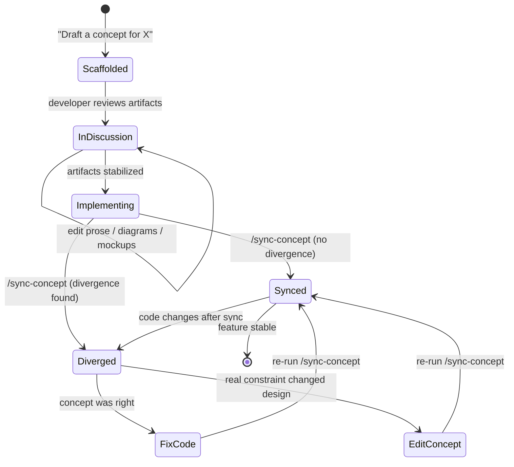
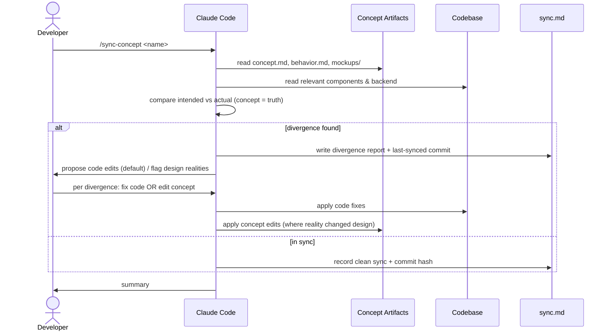
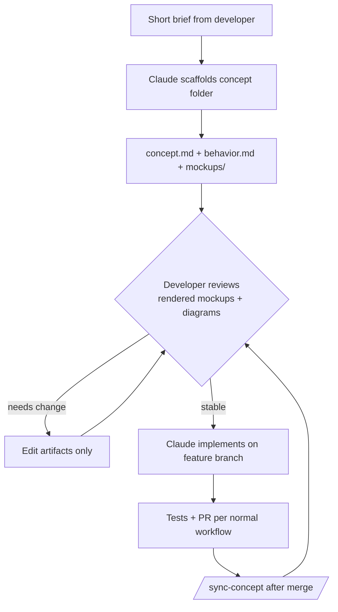

# AI-Driven Concept Workflow

**GitHub Issue:** TBD

> **Update — artifact form changed to a single HTML file.** This document originally proposed a
> **folder form** (`concept.md` + `behavior.md` + `mockups/*.html` + `sync.md`). That has been
> **superseded by a single self-contained HTML file per concept**: `docs/concepts/<status>/<name>.html`
> holds the prose, the Mermaid diagrams (rendered client-side via the vendored
> `_assets/mermaid.min.js`), the mockups (inline `<section>`s using `_assets/mockup.css`), and the
> sync ledger (`<section id="sync">`) — all in one file. The rationale and loop below still apply;
> only the packaging changed (four files → one). Where the text says "the folder / `concept.md` /
> `behavior.md` / `sync.md`," read "the corresponding part of the one HTML file." Authoritative,
> current instructions live in `.claude/CLAUDE.md` (§ AI-Driven Concept Workflow) and the
> `/sync-concept` skill. Worked example: [`backlog/x-server-provisioning.html`](x-server-provisioning.html).

---

## Overview

termiHub already documents every feature as a concept in `docs/concepts/`, sorted by
implementation status (`implemented/`, `partial/`, `backlog/`, `future/`). Each concept is a
single Markdown file with prose plus Mermaid diagrams. This works well as _documentation_, but
it is a weak medium for **designing forward** and for **briefing Claude Code** on the exact
intended result before a line of code is written.

This concept evolves the existing system into a **design-first, AI-driven development loop**.
Each feature gains a small set of co-located artifacts — a prose concept, behavior diagrams, and
**hand-written HTML mockups** — that act as the shared, unambiguous picture of the feature. The
artifacts are the medium for human discussion _and_ the primary input Claude Code uses to
generate and verify code. A deliberate, human-triggered **sync step** closes the loop by
comparing the artifacts against the real code and surfacing divergence.

### Motivation

- **Prose is ambiguous for UI.** "Put the editor tab next to the file tree" can mean several
  layouts. A renderable HTML mockup settles it instantly — for both the human reviewer and Claude.
- **Claude lacks visual grounding.** Today Claude infers intended layout from prose and from
  reading existing components. A mockup gives an explicit visual target before implementation.
- **Discussion happens too late.** Disagreements about behavior and layout currently surface
  during or after implementation. Concrete artifacts move that discussion _before_ code exists,
  when changes are cheap.
- **Docs drift silently.** There is no defined moment where concept and code are reconciled.
  A formal sync step makes reconciliation an explicit, reviewable action.

### Core Decisions

These three decisions define the system and are deliberately fixed:

1. **Concept drives code (source of truth).** When the concept artifacts and the code disagree,
   the **concept is authoritative** — code is generated from and checked against it. Realities
   discovered at the code level (performance limits, platform quirks, library constraints) are
   _not_ silently absorbed into the code; they flow **back into the concept as edits**, so the
   concept stays the true picture.
2. **Hand-written, layout-altitude mockups.** Mockups are standalone HTML showing **structure
   and states**, not pixel-perfect reproductions of the live app. They are authored by hand so
   they can describe features that do **not yet exist**. They are explicitly allowed to be
   "directionally right, not current" between syncs.
3. **Sync requires a Claude Code invocation.** Synchronization is never automatic. It happens
   only when a developer runs the sync step (a `/sync-concept` skill), which keeps a human in
   the loop and prevents silent rewrites of either side.

### Goals

- Define a **per-concept folder structure** that co-locates prose, diagrams, and mockups.
- Establish **hand-written HTML mockup conventions** at layout altitude.
- Define a **`/sync-concept` skill** that compares concept artifacts to code and produces a
  divergence report plus proposed edits (to code, since the concept is authoritative).
- Make the whole thing an **incremental, opt-in** layer over the existing concept system — no
  retrofit of already-implemented concepts is required.

### Non-Goals

- **Not** a pixel-perfect design system, component library, or Storybook replacement.
- **Not** automatic two-way sync — reconciliation is always human-triggered.
- **Not** a mandate to convert all ~40 existing concepts; this targets **new** features and
  **active redesigns**.
- **Not** a code generator that bypasses review — generated code goes through the normal
  branch + PR + test workflow.

---

## UI Interface

This is a **developer-facing** system. Its "interface" is the on-disk artifact layout, the
rendered mockups viewed in a browser, and the Claude Code interaction during authoring and sync.

### Per-Concept Layout

> Superseded: the layout below is the **original folder form**, kept for context. The **current
> form is one self-contained HTML file** — see the banner at the top of this document.

**Current (single-file HTML):** a concept with a visual surface is one file that co-locates
everything:

```
docs/concepts/<status>/<concept-name>.html   # prose + Mermaid + mockups + sync ledger
docs/concepts/_assets/                        # shared, linked by every concept
  concept-template.html   # copy-me scaffold      concept.css   # document styling
  mockup.css              # app-chrome kit         mermaid.min.js # vendored, offline diagrams
```

**Original (folder form, retired):** a concept graduated from a single `.md` to a folder:

```
docs/concepts/<status>/<concept-name>/
  concept.md          # Overview, UI Interface, General Handling, Impl Details (existing format)
  behavior.md         # Mermaid state machines + sequence diagrams
  mockups/
    main-view.html    # Hand-written, layout-altitude HTML mockups
    editor.html
    ...
  sync.md             # Sync ledger: last-synced commit, open divergences
```

Single-file `.md` concepts remain valid for features with **no** visual surface; features **with**
a visual surface become a single-file HTML concept. Both live in the same status directories.

### The Mockup Viewer

Mockups are plain `.html` files openable directly in any browser — no build step. A small index
page (`docs/concepts/mockups-index.html`, generated by a script) lists every mockup across all
concepts so they can be browsed in one place during a design discussion. Each mockup:

- Uses a shared lightweight stylesheet that approximates termiHub's VS Code-inspired dark theme
  (activity bar, sidebar, panel chrome) at **structural** fidelity only.
- Annotates non-obvious regions with callout labels (e.g. `[A] file tree`, `[B] editor tab`).
- May embed multiple states side by side (empty / loading / populated / error) so a reviewer
  sees the state space at a glance.

```
┌─ mockups-index.html ─────────────────────────────────────────────┐
│  termiHub Concept Mockups                          [ filter… ]    │
├───────────────────────────────────────────────────────────────────┤
│  backlog/ai-driven-concept-workflow                               │
│    • main-view.html                                               │
│  backlog/broadcast-input                                          │
│    • toolbar.html   • target-picker.html                         │
│  …                                                                │
└───────────────────────────────────────────────────────────────────┘
```

### Claude Code Interaction Surface

Two interaction points, both explicit developer actions:

| Action     | Trigger                 | Result                                                                                                                                |
| ---------- | ----------------------- | ------------------------------------------------------------------------------------------------------------------------------------- |
| **Author** | "Draft a concept for X" | Claude scaffolds the folder, writes `concept.md` + `behavior.md` + first mockup(s) for discussion                                     |
| **Sync**   | `/sync-concept <name>`  | Claude reads artifacts + relevant code, writes a divergence report into `sync.md`, and proposes code edits (concept is authoritative) |

---

## General Handling

### The Improvement Loop

The lifecycle of a feature under this system:

1. **Scaffold** — Claude creates the concept folder from a short brief: `concept.md`,
   `behavior.md` with at least one state diagram and one sequence diagram, and one or more
   layout-altitude mockups.
2. **Discuss & refine** — The developer reviews the rendered mockups and diagrams, edits prose,
   and iterates _on the artifacts only_. No code yet. Cheap changes.
3. **Implement** — Once the artifacts stabilize, Claude generates code on a feature branch,
   using the mockups as the layout target and `behavior.md` as the behavior spec. Normal
   branch + test + PR workflow applies.
4. **Sync** — After implementation (and after any later code change that touches the feature),
   the developer runs `/sync-concept <name>`. Claude compares artifacts to code and writes a
   divergence report.
5. **Reconcile** — For each divergence, the developer decides:
   - **Concept was right, code is wrong** → fix the code (the default, since concept is truth).
   - **A real constraint changed the design** → edit the concept artifacts to match reality, so
     the concept stays authoritative going forward.
6. **Repeat** — The feature re-enters the loop for the next change.

### Edge Cases & Rules

- **Stale mockups are expected, not a failure.** Between syncs, mockups may lag the code. The
  `sync.md` ledger records the last-synced commit so staleness is visible, never silent.
- **Source-of-truth conflicts always resolve toward the concept.** Code that diverges from the
  concept without a corresponding concept edit is treated as a bug to fix, not a new fact to
  document. The only way the code "wins" is by the developer deliberately editing the concept.
- **Not every concept needs mockups.** Backend-only or protocol concepts (e.g. `shared-rust-core`,
  `agent`) stay single-file with diagrams; they have no visual surface to mock.
- **No retrofit.** Implemented concepts are upgraded to the folder form only if they enter an
  active redesign. Otherwise they keep their current single-file form.
- **Mockups never import app code.** They are self-contained HTML so they can describe
  not-yet-built features and never break when components are refactored.

---

## States & Sequences

### Concept Lifecycle State Machine



### Sync Sequence



### Authoring & Implementation Flow



---

## Preliminary Implementation Details

Based on the current project architecture (concept system in `docs/concepts/`, skills in
`.claude/`, helper scripts in `scripts/`).

### 1. Folder structure & migration

- Introduce the per-concept folder form alongside existing single-file concepts. No mass
  migration. Update `docs/concepts/README.md` to document both forms and when to use a folder.
- A concept is a folder **iff** it has mockups; otherwise it stays a single `.md`.

### 2. Mockup conventions

- `docs/concepts/_assets/mockup.css` — one shared stylesheet that **mirrors the app's real
  component class names and theme values** (sourced from `src/styles/variables.css` and the
  component CSS): `.activity-bar__item`, `.tab`, `.terminal-view__toolbar`, `.status-bar`, etc.
  Using the real class names keeps the mockup DOM close to the real DOM, so it doubles as a precise
  implementation target. Still layout altitude — structure, dimensions, and theme, not every pixel.
- **Icons are real lucide geometry.** Mockups inline a lucide `<symbol>` sprite (copied from
  `mockup-template.html`) and reference it with `<svg class="li"><use href="#i-name" /></svg>` —
  no unicode glyphs, since glyphs were the main reason early drafts didn't read as termiHub.
- Each mockup is a single self-contained `.html` file (inline markup, shared CSS link, no JS
  build, no app imports). Light inline `<script>` is allowed only to toggle between mock states.
- Naming: one file per distinct screen/region (`main-view.html`, `editor.html`,
  `target-picker.html`).
- **Visual verification**: `scripts/internal/screenshot-mockup.sh <file>` (or `--all`) renders a
  mockup to PNG via headless Chrome (into a gitignored `.preview/`), so fidelity can be checked
  against the real app rather than asserted.

### 3. `/sync-concept` skill

- New skill under `.claude/skills/` (project skill). Input: a concept name. Steps:
  1. Resolve the concept folder; read `concept.md`, `behavior.md`, all `mockups/*.html`.
  2. Identify the relevant code surface (components named in the concept, related backend
     modules). Read them.
  3. Diff **intended vs. actual** at behavior + layout altitude. Treat the concept as truth.
  4. Write/refresh `sync.md`: last-synced commit (`git rev-parse HEAD`), a dated divergence
     list, and a per-item recommendation (default = fix code).
  5. Surface the report to the developer and apply the chosen resolutions.
- The skill is the formal embodiment of decision #3 — sync only ever happens via this invocation.

### 4. Mockup index generator

- `scripts/internal/build-mockups-index.{sh,cmd}` — scans `docs/concepts/**/mockups/*.html` and
  regenerates `docs/concepts/mockups-index.html` with grouped links and a filter box. Pure static
  output; no server. Optionally wired into a `scripts/` entry for discoverability.

### 5. Integration with existing workflow

- The existing **Concept issue** flow (CLAUDE.md → `Concept` label → `docs/concepts/<name>.md`)
  is extended: a concept that has a visual surface scaffolds the folder form instead of a single
  file, including at least one mockup.
- Implementation still follows the standard **branch → tests → PR → merge** rules. This system
  changes _what Claude reads before coding_, not how code lands.
- The `sync.md` ledger gives reviewers a concrete record of when concept and code were last
  reconciled — useful in PR review.

### 6. Open questions for iteration

- Should `sync.md` divergences be cross-referenced to GitHub issues automatically?
- Do we want a CI check that warns when a folder-form concept's code surface changed but
  `sync.md`'s last-synced commit is stale? (Advisory only — sync stays human-triggered.)
- Should the shared `mockup.css` be generated from real theme variables periodically, or kept
  deliberately approximate to avoid implying pixel fidelity?

---

## Implementation Status

**Infrastructure built; awaiting first implementation-time use.**

What exists:

- **Folder form** defined and documented (`docs/concepts/README.md`, `.claude/CLAUDE.md`).
- **Shared mockup kit** — `docs/concepts/_assets/mockup.css` mirroring the app's **real component
  class names and theme values** plus an inline **lucide icon sprite** in `mockup-template.html`,
  and `_assets/README.md` with conventions.
- **`/sync-concept` skill** — `.claude/skills/sync-concept/SKILL.md`, encoding the
  concept-is-source-of-truth reconciliation procedure and the `sync.md` ledger format.
- **Index generator** — `scripts/internal/build-mockups-index.{sh,cmd}` producing
  `docs/concepts/mockups-index.html`.
- **Screenshot helper** — `scripts/internal/screenshot-mockup.sh` rendering mockups to PNG via
  headless Chrome for fidelity checks.
- **First worked example** — `backlog/broadcast-input/` migrated to the folder form with two
  mockups (verified to visually match the real shell), `behavior.md`, and a seeded `sync.md`.

What is missing:

- A **real implementation-time run of `/sync-concept`** against actual code (broadcast-input is
  not yet built, so the loop's reconciliation half is untested in practice).
- The optional **CI staleness check** (open question #2) and any **issue cross-referencing**
  (open question #1).

This document keeps its diagrams inline rather than splitting into `behavior.md`, and has no
`mockups/` of its own, because the workflow is a developer process with no app-level visual
surface — consistent with the rule that a concept becomes a folder only when it has mockups.
