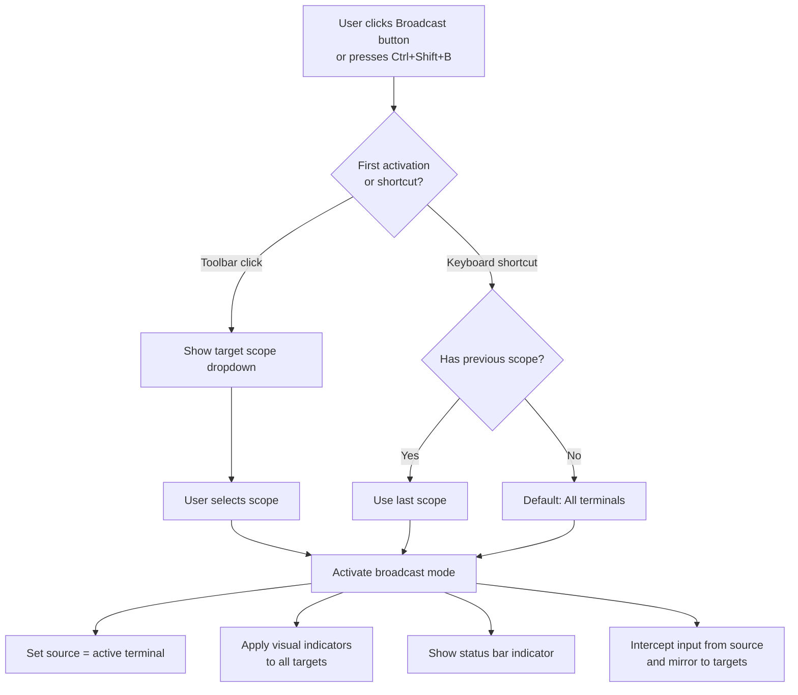
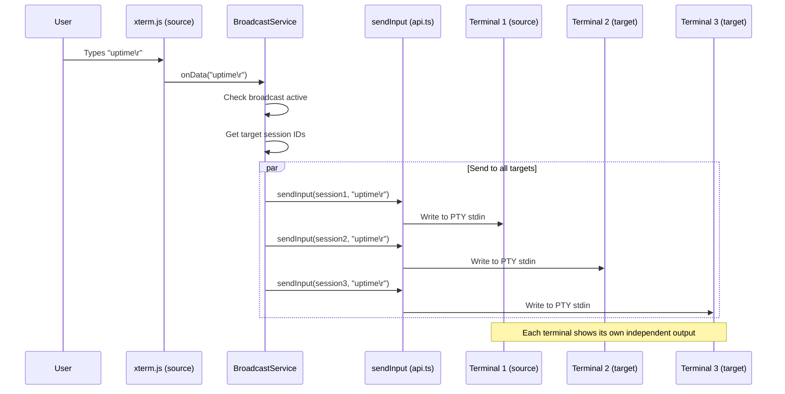
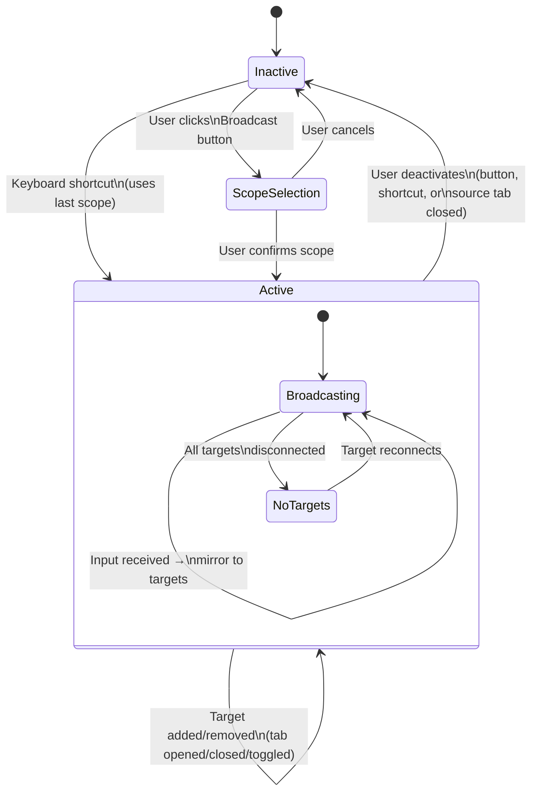
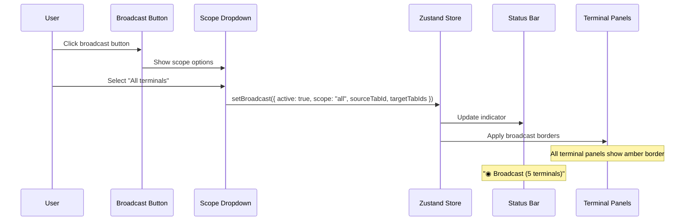
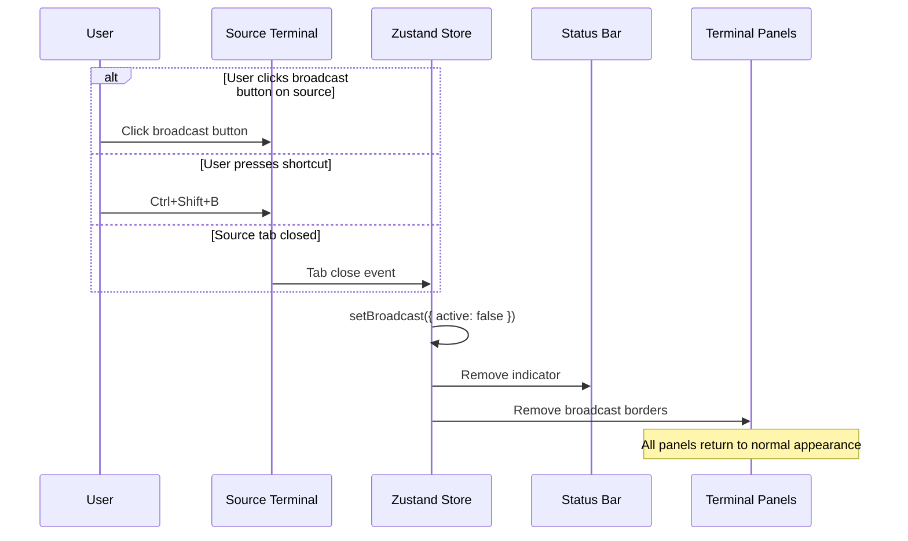
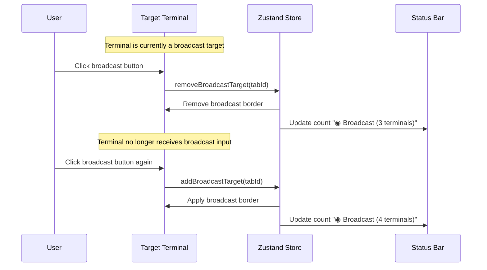
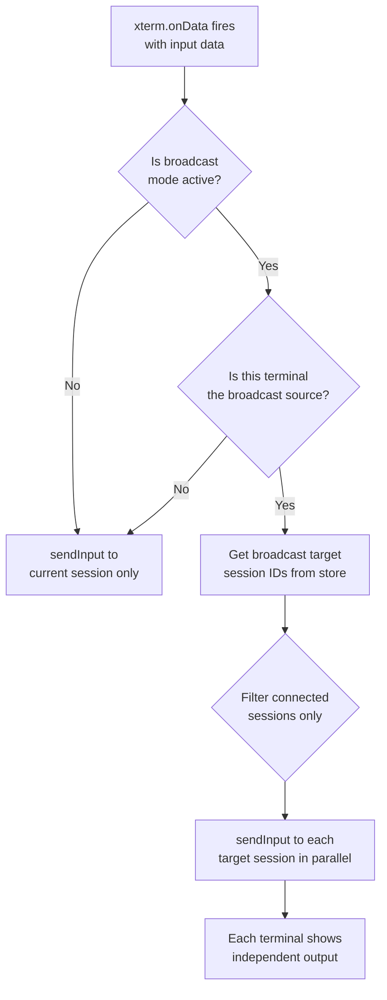
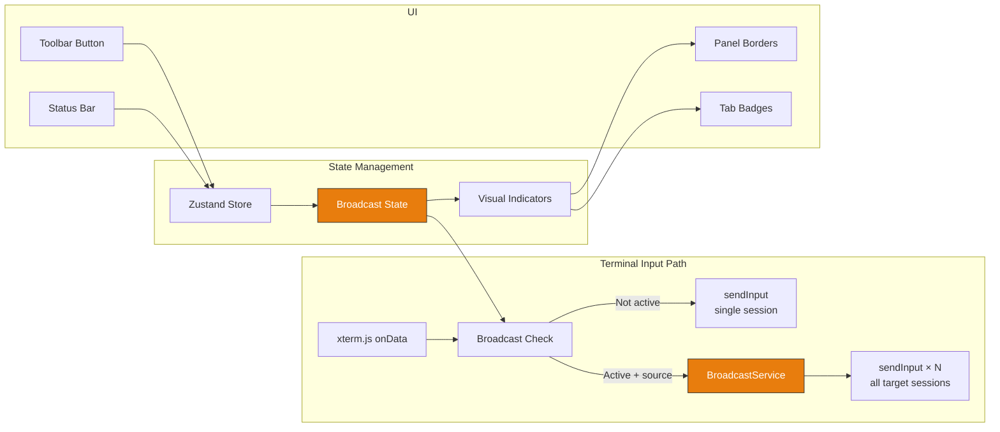

# Broadcast Input (Multi-Execution)

**GitHub Issue:** [#516](https://github.com/armaxri/termiHub/issues/516)

---

## Overview

Broadcast input is a mode that sends keystrokes simultaneously to multiple terminal sessions. Users type once and the input is mirrored to every selected terminal in real time. Each terminal maintains independent output — only input is shared.

This is one of the most requested power-user features in terminal multiplexers (MobaXterm's "MultiExec", iTerm2's "Send Input to All Panes", Terminator's "broadcast"). System administrators frequently need to run the same command across a fleet of servers — applying patches, checking status, restarting services — and doing this one terminal at a time is tedious and error-prone.

### Goals

- Allow users to type once and send input to multiple terminals simultaneously
- Provide clear visual feedback for which terminals are receiving broadcast input
- Support flexible target selection (all terminals, specific tabs, specific panels)
- Integrate naturally with the existing split view and tab system
- Keep the feature discoverable but unobtrusive for users who don't need it

### Non-Goals

- Synchronized output comparison (diff view across terminals)
- Command queuing or sequential execution across terminals
- Macro recording and playback (separate feature)
- Backend-side batching (frontend-driven loop over `sendInput` is sufficient)

---

## UI Interface

### Broadcast Toggle in Terminal Toolbar

The primary activation point is a toggle button in the terminal view toolbar, alongside the existing New / Split / Close buttons:

```
┌──────────────────────────────────────────────────────────────────────┐
│  [Tab 1] [Tab 2] [Tab 3]                          [+] [⫽] [⊟] [×] │
│                                                                      │
│  ┌──────────────────────────────────────────────────────────────┐    │
│  │ server-1 $  █                                                │    │
│  │                                                              │    │
│  │                                                              │    │
│  └──────────────────────────────────────────────────────────────┘    │
└──────────────────────────────────────────────────────────────────────┘
         [+] New   [⫽] Split Right   [⊟] Split Down   [×] Close
```

A new **Broadcast** button (using a `Radio` or `Podcast` lucide icon) is added to the toolbar:

```
┌──────────────────────────────────────────────────────────────────────┐
│  [Tab 1] [Tab 2] [Tab 3]                   [◉] [+] [⫽] [⊟] [×]   │
│                                              ↑                       │
│                                         Broadcast                    │
│  ┌──────────────────────────────────────────────────────────────┐    │
│  │ server-1 $  █                                                │    │
│  │                                                              │    │
│  └──────────────────────────────────────────────────────────────┘    │
└──────────────────────────────────────────────────────────────────────┘
```

When broadcast mode is **inactive**, the button appears in the default toolbar style. When **active**, the button is highlighted (accent color background) and a colored border appears around the terminal panel.

### Broadcast Active State — Visual Feedback

When broadcast mode is enabled, every terminal that is a broadcast target receives a visual indicator:

```
┌─ Panel 1 (SOURCE — typing here) ──────────┬─ Panel 2 (TARGET) ─────────────────┐
│ ┏━━━━━━━━━━━━━━━━━━━━━━━━━━━━━━━━━━━━━━┓  │ ┏━━━━━━━━━━━━━━━━━━━━━━━━━━━━━━━━┓ │
│ ┃ [Tab 1] [Tab 2]          [◉] [+]...  ┃  │ ┃ [Tab 3]              [◉] [+].. ┃ │
│ ┃                                       ┃  │ ┃                                ┃ │
│ ┃ server-1 $ uptime█                    ┃  │ ┃ server-2 $ uptime█             ┃ │
│ ┃                                       ┃  │ ┃                                ┃ │
│ ┃                                       ┃  │ ┃                                ┃ │
│ ┗━━━━━━━━━━━━━━━━━━━━━━━━━━━━━━━━━━━━━━┛  │ ┗━━━━━━━━━━━━━━━━━━━━━━━━━━━━━━━━┛ │
└────────────────────────────────────────────┴─────────────────────────────────────┘

  ━━━ = Broadcast accent border (e.g., orange/amber)
```

Visual indicators:

1. **Accent border** — A colored border (e.g., amber/orange) around every terminal panel participating in broadcast. The source terminal (where the user types) gets a slightly thicker or differently styled border.
2. **Tab badge** — A small broadcast icon (●) next to the tab title for each participating tab, visible even when the tab is not the active tab in its panel.
3. **Status bar indicator** — A "Broadcast" pill in the status bar (left section) showing the mode is active and how many terminals are targeted:

```
┌──────────────────────────────────────────────────────────────────────┐
│ ◉ Broadcast (4 terminals)  │                    │                    │
└──────────────────────────────────────────────────────────────────────┘
```

### Broadcast Target Selector

Clicking the broadcast button opens a dropdown menu before activating broadcast, allowing the user to choose the target scope:

```
┌─────────────────────────────────┐
│  Broadcast To:                  │
│  ─────────────────────────────  │
│  ● All terminals (5)           │
│  ○ All in current panel (2)    │
│  ○ Custom selection...         │
│  ─────────────────────────────  │
│  [Start Broadcast]  [Cancel]   │
└─────────────────────────────────┘
```

**Target scopes:**

| Scope            | Description                                              |
| ---------------- | -------------------------------------------------------- |
| All terminals    | Every open terminal tab across all panels                |
| Current panel    | Only tabs within the panel where broadcast was activated |
| Custom selection | Opens a picker with checkboxes for individual tabs       |

The **Custom selection** option shows a list of all open terminal tabs with checkboxes:

```
┌─────────────────────────────────────────┐
│  Select Broadcast Targets               │
│  ───────────────────────────────────    │
│  ☑ Tab 1 — server-1 (SSH)              │
│  ☑ Tab 2 — server-2 (SSH)              │
│  ☐ Tab 3 — local shell                 │
│  ☑ Tab 4 — server-3 (SSH)              │
│  ☐ Tab 5 — serial /dev/ttyUSB0         │
│  ───────────────────────────────────    │
│  [Select All]  [Select None]            │
│  ───────────────────────────────────    │
│  [Start Broadcast]  [Cancel]            │
└─────────────────────────────────────────┘
```

### Keyboard Shortcut

Broadcast mode can also be toggled via keyboard shortcut:

| Action           | Windows / Linux | macOS         |
| ---------------- | --------------- | ------------- |
| Toggle Broadcast | `Ctrl+Shift+B`  | `Cmd+Shift+B` |

The keyboard shortcut toggles broadcast with the **last used scope** (defaulting to "All terminals" on first use). To change the scope, the user must use the toolbar dropdown.

### Excluding a Terminal While Broadcast is Active

Each target terminal's broadcast button acts as a local toggle. Clicking the broadcast button on a specific terminal while broadcast is active **excludes** that terminal from the broadcast group (without ending the overall broadcast session):

```
┌─ Panel 1 (SOURCE) ────────────────────────┬─ Panel 2 (EXCLUDED) ───────────────┐
│ ┏━━━━━━━━━━━━━━━━━━━━━━━━━━━━━━━━━━━━━━┓  │ ┌────────────────────────────────┐  │
│ ┃ server-1 $ uptime█                    ┃  │ │ server-2 $ █                   │  │
│ ┃                                       ┃  │ │           (no broadcast border) │  │
│ ┗━━━━━━━━━━━━━━━━━━━━━━━━━━━━━━━━━━━━━━┛  │ └────────────────────────────────┘  │
└────────────────────────────────────────────┴─────────────────────────────────────┘
```

### Ending Broadcast Mode

Broadcast mode ends when:

1. The user clicks the broadcast button on the **source** terminal (where broadcast was initiated)
2. The user presses the toggle shortcut (`Ctrl+Shift+B` / `Cmd+Shift+B`)
3. The source terminal tab is closed
4. The user clicks "Stop Broadcast" in the status bar indicator

---

## General Handling

### Activation Workflow



### Input Flow During Broadcast

When broadcast is active, the input flow changes from the standard single-terminal path:



### Session Filtering

Only **connected** sessions receive broadcast input. The broadcast service checks session state before sending:

- **Connected sessions**: receive input normally
- **Disconnected sessions**: skipped silently (no error shown per keystroke)
- **Connecting sessions**: skipped (avoid sending input during handshake)
- **Non-terminal tabs** (e.g., file editor, SFTP browser): always excluded from broadcast

If all target sessions are disconnected, the status bar indicator updates to show a warning:

```
┌──────────────────────────────────────────────────────────────────────┐
│ ⚠ Broadcast (0/4 connected)  │                  │                    │
└──────────────────────────────────────────────────────────────────────┘
```

### New Terminals During Broadcast

When a new terminal is opened while broadcast is active:

- **Scope "All terminals"**: the new terminal is automatically added to the broadcast group
- **Scope "Current panel"**: the new terminal is added only if it's in the same panel
- **Scope "Custom selection"**: the new terminal is **not** added (user must manually include it by clicking the broadcast button on that terminal)

### Closed Terminals During Broadcast

When a broadcast target terminal is closed:

- It is silently removed from the target set
- If the **source** terminal is closed, broadcast mode ends entirely
- The status bar count updates accordingly

### Paste During Broadcast

When the user pastes text (via `Ctrl+Shift+V` / `Cmd+V`) while broadcast is active, the pasted text is sent to all broadcast targets — the same as typed input. The paste goes through the same `onData` path and is therefore automatically broadcast.

### Edge Cases

| Scenario                                          | Behavior                                                                       |
| ------------------------------------------------- | ------------------------------------------------------------------------------ |
| Only one terminal open                            | Broadcast activates but has no effect (input goes to the single terminal)      |
| Source terminal loses focus                       | Broadcast remains active; input resumes when focus returns to source terminal  |
| User switches active tab in source panel          | Broadcast continues from whichever tab is active in the source panel           |
| User drags a target tab to a different panel      | The tab remains in the broadcast group (tracked by tab ID, not panel position) |
| Resize event on source terminal                   | Only the source terminal is resized — broadcast does not mirror resize events  |
| Terminal type mismatch (SSH vs. local vs. serial) | All terminal types receive the same raw input; output varies per backend       |
| Broadcast + chord shortcut pending                | Chord keystrokes are not broadcast — they are consumed by the shortcut system  |

---

## States & Sequences

### Broadcast Mode State Machine



### Broadcast Activation Sequence



### Broadcast Deactivation Sequence



### Target Exclusion Sequence



### Input Routing Decision Flow



---

## Preliminary Implementation Details

Based on the current project architecture at the time of concept creation. The codebase may evolve between concept creation and implementation.

### Architecture Overview



### New and Modified Files

| File                                           | Change                                                                    |
| ---------------------------------------------- | ------------------------------------------------------------------------- |
| `src/store/appStore.ts`                        | **Modify** — Add broadcast state and actions                              |
| `src/components/Terminal/Terminal.tsx`         | **Modify** — Hook into `onData` to check broadcast state and mirror input |
| `src/components/Terminal/TerminalRegistry.tsx` | **Modify** — Expose method to enumerate all session IDs for broadcast     |
| `src/components/SplitView/TerminalView.tsx`    | **Modify** — Add broadcast toggle button to toolbar                       |
| `src/components/StatusBar/StatusBar.tsx`       | **Modify** — Add broadcast status indicator                               |
| `src/components/StatusBar/BroadcastStatus.tsx` | **New** — Broadcast indicator component for status bar                    |
| `src/hooks/useKeyboardShortcuts.ts`            | **Modify** — Add `toggle-broadcast` action                                |
| `src/types/terminal.ts`                        | **Modify** — Add broadcast-related type definitions                       |
| `src/styles/broadcast.css`                     | **New** — Broadcast-specific styles (borders, badges, button states)      |

### Store State Design

New state added to `AppState` in `src/store/appStore.ts`:

```typescript
// New broadcast state
interface BroadcastState {
  /** Whether broadcast mode is currently active */
  broadcastActive: boolean;
  /** The tab ID of the terminal where the user types (source of input) */
  broadcastSourceTabId: string | null;
  /** The scope used for the current broadcast session */
  broadcastScope: "all" | "panel" | "custom";
  /** Set of tab IDs that are broadcast targets */
  broadcastTargetTabIds: Set<string>;
  /** Last used scope (persisted for keyboard shortcut toggle) */
  lastBroadcastScope: "all" | "panel" | "custom";
}

// New actions
interface BroadcastActions {
  startBroadcast: (
    scope: "all" | "panel" | "custom",
    sourceTabId: string,
    targetTabIds: string[]
  ) => void;
  stopBroadcast: () => void;
  addBroadcastTarget: (tabId: string) => void;
  removeBroadcastTarget: (tabId: string) => void;
  isBroadcastTarget: (tabId: string) => boolean;
}
```

### Input Mirroring Implementation

The broadcast logic hooks into the existing `xterm.onData` handler in `Terminal.tsx`. The current implementation:

```typescript
// Current (single terminal)
xterm.onData((data) => {
  sendInput(sessionIdRef.current, data);
});
```

With broadcast support:

```typescript
// With broadcast
xterm.onData((data) => {
  const state = useAppStore.getState();
  const currentTabId = tabIdRef.current;

  if (state.broadcastActive && state.broadcastSourceTabId === currentTabId) {
    // This is the source terminal — mirror input to all targets
    const sessionRegistry = sessionRegistryRef.current;
    for (const targetTabId of state.broadcastTargetTabIds) {
      const targetSessionId = sessionRegistry.get(targetTabId);
      if (targetSessionId) {
        sendInput(targetSessionId, data);
      }
    }
  } else {
    // Normal single-terminal input
    sendInput(sessionIdRef.current, data);
  }
});
```

Note: The source terminal is included in `broadcastTargetTabIds`, so it also receives the input through the broadcast loop. This keeps the logic simple — the source is just another target.

### TerminalRegistry Extension

The `TerminalRegistry` (`TerminalPortalProvider`) needs to expose session enumeration for the broadcast service:

```typescript
// New method on the registry context
getAllSessions: () => Map<string, SessionId>;
// Returns sessionRegistryRef.current (the existing Map<tabId, SessionId>)
```

This is already internally available as `sessionRegistryRef.current` — it just needs to be exposed through the context.

### Toolbar Button

The broadcast button is added to `TerminalView.tsx` alongside existing toolbar buttons. It follows the same pattern (`terminal-view__toolbar-btn` CSS class with a lucide icon):

```typescript
<button
  className={`terminal-view__toolbar-btn ${
    isBroadcastActive ? "terminal-view__toolbar-btn--broadcast-active" : ""
  }`}
  onClick={handleBroadcastClick}
  title={isBroadcastActive ? "Stop Broadcast" : "Broadcast Input"}
>
  <Radio size={16} />
</button>
```

### Status Bar Indicator

A new `BroadcastStatus` component follows the pattern of the existing `CredentialStoreIndicator`:

```typescript
export function BroadcastStatus(): ReactElement | null {
  const broadcastActive = useAppStore((s) => s.broadcastActive);
  const targetCount = useAppStore((s) => s.broadcastTargetTabIds.size);

  if (!broadcastActive) return null;

  return (
    <div className="broadcast-status" onClick={handleStopBroadcast}>
      <Radio size={12} />
      <span>Broadcast ({targetCount} terminals)</span>
    </div>
  );
}
```

### CSS Styling

Broadcast visual indicators use CSS classes applied conditionally:

```css
/* Broadcast accent border on terminal panels */
.terminal-panel--broadcast-target {
  border: 2px solid var(--broadcast-accent, #e87d0d);
  border-radius: 4px;
}

.terminal-panel--broadcast-source {
  border: 2px solid var(--broadcast-accent, #e87d0d);
  box-shadow: 0 0 8px rgba(232, 125, 13, 0.3);
}

/* Broadcast button active state */
.terminal-view__toolbar-btn--broadcast-active {
  background-color: var(--broadcast-accent, #e87d0d);
  color: #fff;
}

/* Status bar indicator */
.broadcast-status {
  display: flex;
  align-items: center;
  gap: 4px;
  padding: 0 8px;
  color: var(--broadcast-accent, #e87d0d);
  cursor: pointer;
}
```

### Performance Considerations

- **No backend changes needed**: `sendInput()` called in a loop (one call per target session) is sufficient. Each call is a lightweight Tauri IPC invoke that writes bytes to a PTY stdin — sub-millisecond per call.
- **Parallel sends**: The `sendInput` calls are fire-and-forget (`Promise<void>`) and can be dispatched without awaiting each one sequentially. For N terminals, all N calls are dispatched in the same microtask.
- **Scaling limit**: For very large broadcast groups (50+ terminals), the serial IPC loop could introduce noticeable latency. If this becomes an issue in the future, a batch `sendInputMultiple(sessionIds[], data)` Tauri command could be added to the backend. This is an optimization and not needed for the initial implementation.

### Implementation Order

1. **Phase 1 — Core broadcast state and input mirroring**: Add broadcast state to Zustand store. Modify `Terminal.tsx` `onData` handler to mirror input when broadcast is active. Add `getAllSessions` to TerminalRegistry.
2. **Phase 2 — Toolbar button and scope selection**: Add broadcast toggle button to `TerminalView.tsx`. Implement scope dropdown (all / panel / custom). Wire button to store actions.
3. **Phase 3 — Visual indicators**: Add broadcast accent borders to terminal panels. Add tab badges for broadcast targets. Add `BroadcastStatus` component to status bar.
4. **Phase 4 — Keyboard shortcut**: Register `toggle-broadcast` action in `useKeyboardShortcuts.ts`. Implement scope memory (last used scope).
5. **Phase 5 — Polish and edge cases**: Handle new/closed terminals during broadcast. Session filtering (skip disconnected). Custom selection picker UI.
