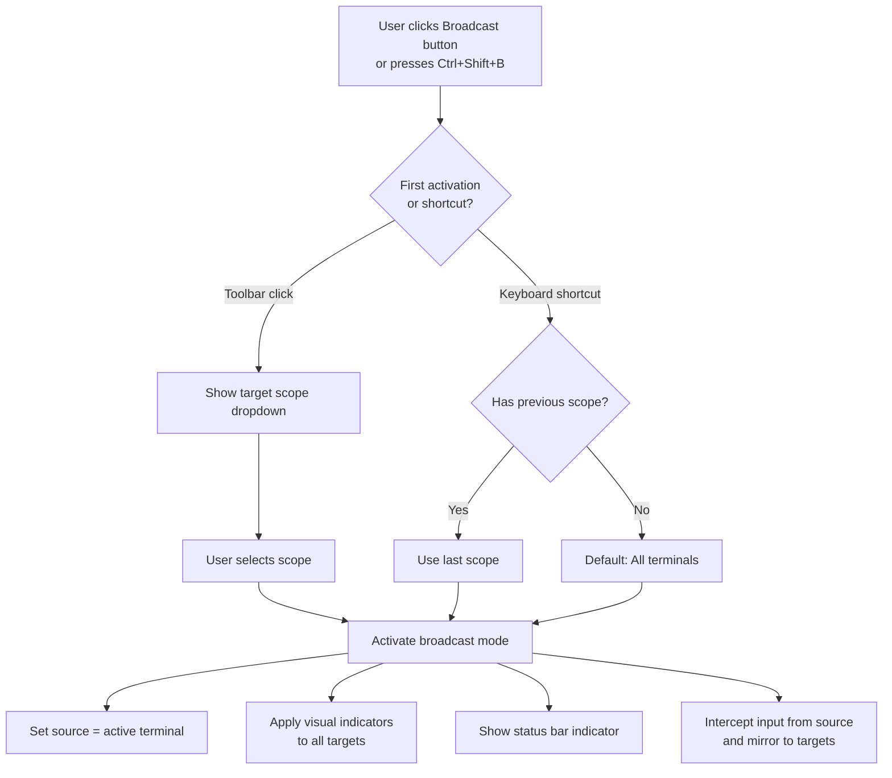
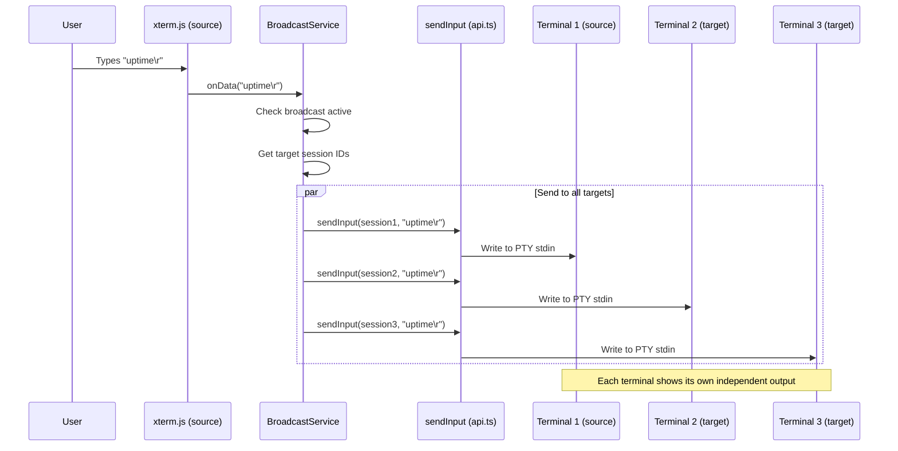
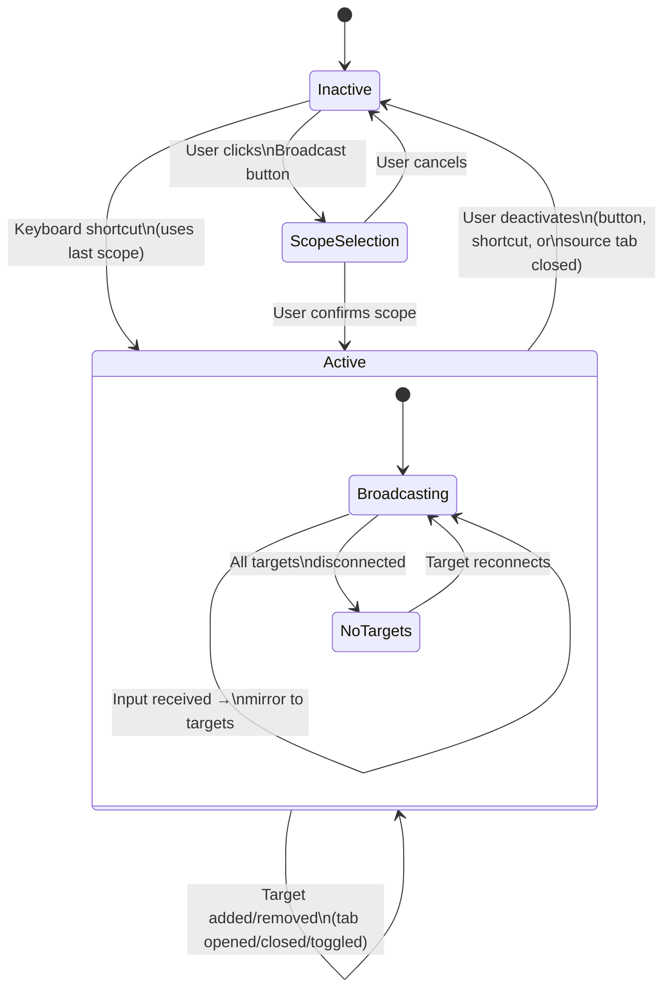
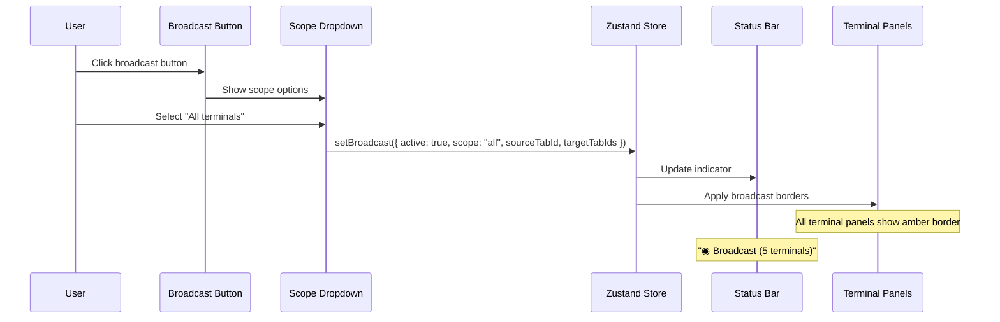
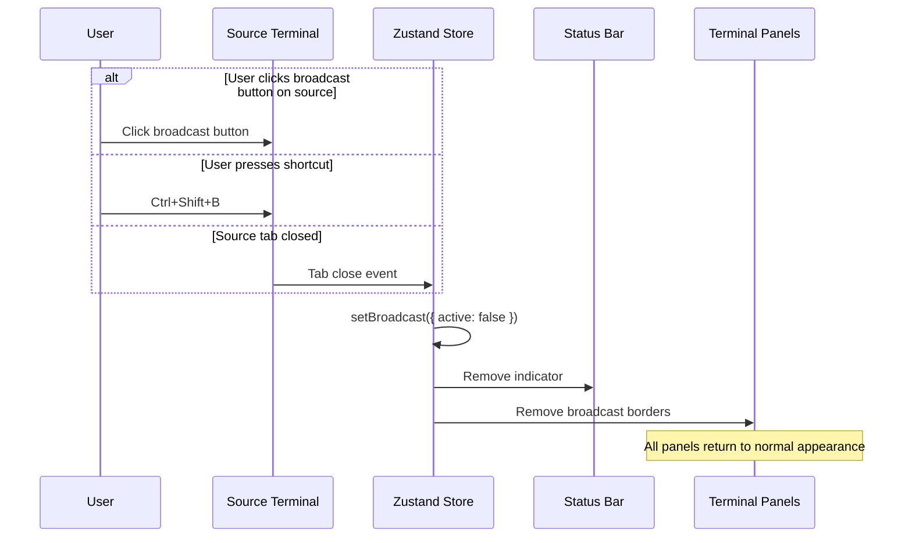
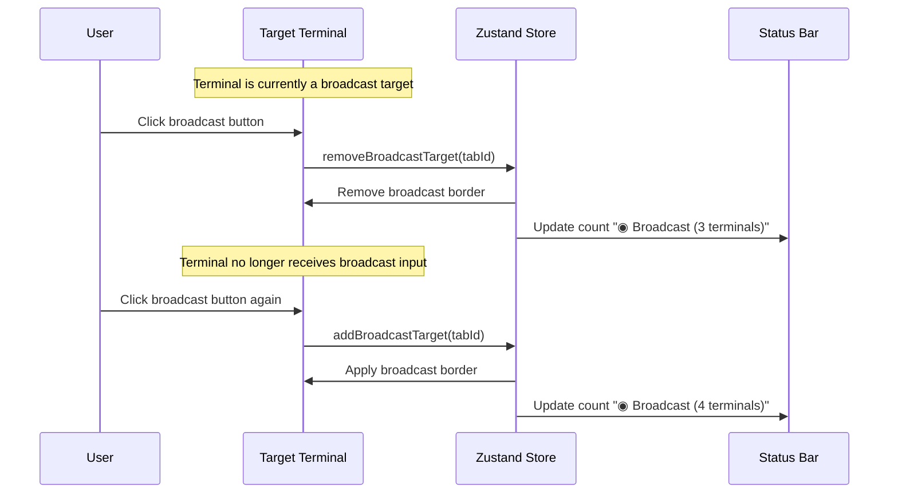
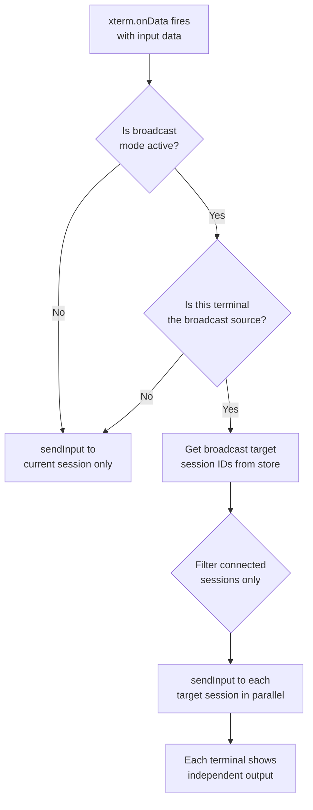
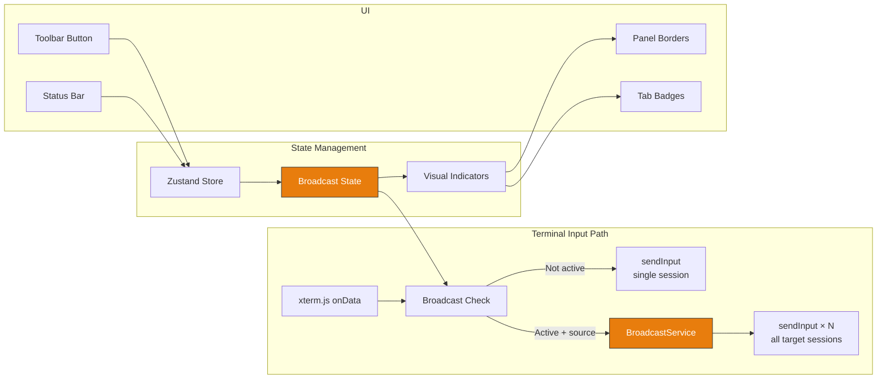

# Broadcast Input — Behavior

Behavior diagrams for the [broadcast-input concept](concept.md). State machines, sequences, and
flows live here; visual layout lives in [`mockups/`](mockups/).

---

## Activation Workflow

## Input Flow During Broadcast

## Broadcast Mode State Machine

## Activation Sequence

## Deactivation Sequence

## Target Exclusion Sequence

## Input Routing Decision Flow

## Architecture Overview

## Session Filtering Rules

| Session state                   | Behavior                                  |
| ------------------------------- | ----------------------------------------- |
| Connected                       | Receives input normally                   |
| Disconnected                    | Skipped silently (no per-keystroke error) |
| Connecting                      | Skipped (avoid input during handshake)    |
| Non-terminal tab (editor, SFTP) | Always excluded from broadcast            |

## Edge Cases

| Scenario                                          | Behavior                                                                       |
| ------------------------------------------------- | ------------------------------------------------------------------------------ |
| Only one terminal open                            | Broadcast activates but has no effect (input goes to the single terminal)      |
| Source terminal loses focus                       | Broadcast remains active; input resumes when focus returns to source terminal  |
| User switches active tab in source panel          | Broadcast continues from whichever tab is active in the source panel           |
| User drags a target tab to a different panel      | The tab remains in the broadcast group (tracked by tab ID, not panel position) |
| Resize event on source terminal                   | Only the source terminal is resized — broadcast does not mirror resize events  |
| Terminal type mismatch (SSH vs. local vs. serial) | All terminal types receive the same raw input; output varies per backend       |
| Broadcast + chord shortcut pending                | Chord keystrokes are not broadcast — they are consumed by the shortcut system  |
