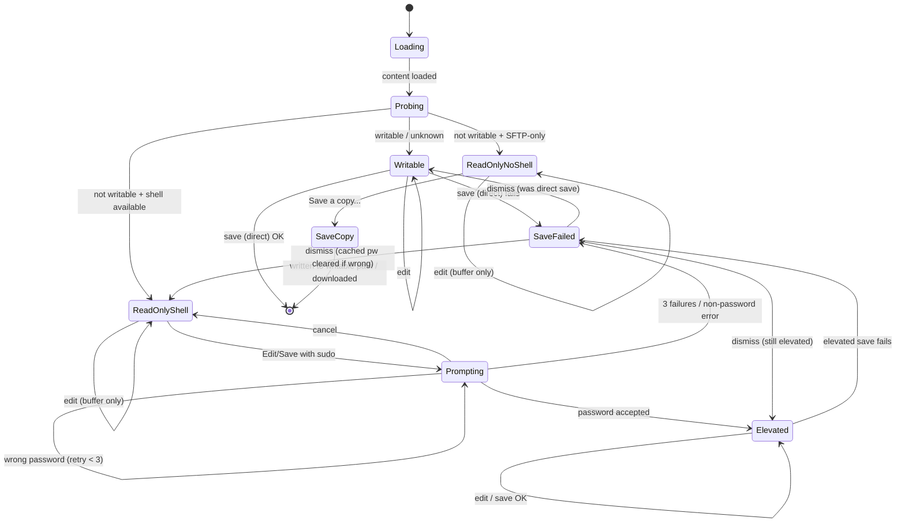
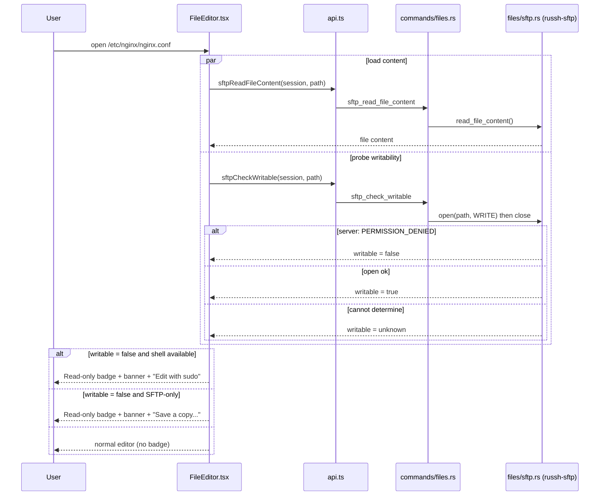
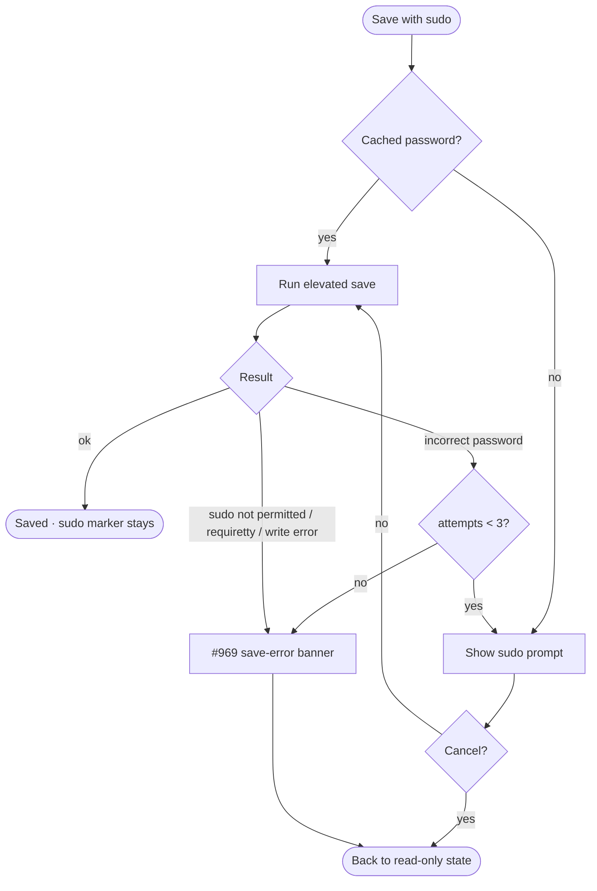
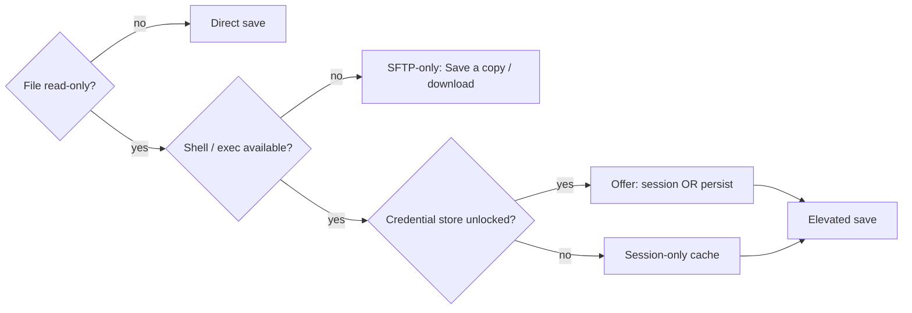

# Behavior — Elevated SFTP Editing + Early Read-Only Detection

**GitHub Issue:** [#970](https://github.com/armaxri/termiHub/issues/970)

Companion to [`concept.md`](concept.md). State machines and sequence diagrams for read-only
detection on open, the elevated-save flow, and the sudo prompt / retry / failure paths.

---

## Editor writability state machine



Notes:

- **Unknown** writability (no permission bits, no probe) collapses into `Writable` — today's
  optimistic behavior. A failed direct save then routes to `SaveFailed`, whose banner offers
  **Retry with sudo** (transition into `Prompting`) when a shell is available.

---

## Read-only detection on open



---

## Elevated save flow

```mermaid
sequenceDiagram
    participant U as User
    participant FE as FileEditor.tsx
    participant DLG as SudoPromptDialog
    participant API as api.ts
    participant CMD as commands/files.rs
    participant SFTP as files/sftp.rs
    participant SSH as SshSession (exec channel)
    participant H as Remote host

    U->>FE: Save with sudo
    alt no cached password
        FE->>DLG: open prompt (host, user, file)
        DLG-->>FE: password + cache scope
    else cached password
        FE->>FE: use cached password
    end

    FE->>API: sftpWriteFileContentElevated(session, path, content, pw)
    API->>CMD: sftp_write_file_content_elevated
    CMD->>SFTP: write buffer to /tmp/termihub-<uuid>
    SFTP->>H: SFTP create + write_all (temp)
    CMD->>SSH: exec: sudo -S -p '' sh -c 'cat "$TMP" > "$DEST" && rm -f "$TMP"'
    CMD->>SSH: stdin: <password>\n
    SSH->>H: run as root
    alt exit 0
        H-->>FE: ok
        FE->>FE: savedContent = content; keep sudo marker
        opt cache scope = credential store
            FE->>CMD: store SudoPassword credential
        end
        FE-->>U: saved
    else incorrect password
        H-->>FE: error: incorrect password
        FE->>FE: discard cached pw
        FE->>DLG: re-open prompt (retry)
    else other failure
        H-->>FE: error (sudo not permitted / requiretty / write error)
        SSH->>H: rm -f $TMP (cleanup)
        FE-->>U: #969 save-error banner (no retry loop)
    end
```

---

## Sudo prompt + retry / failure



---

## Capability + cache-scope decision


