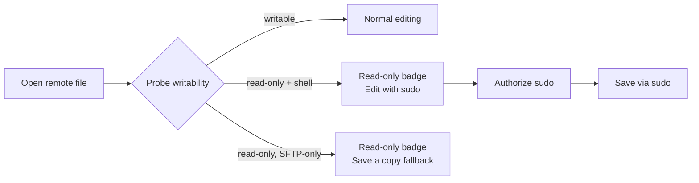
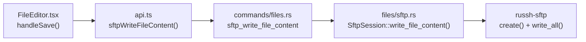

# Elevated (sudo) SFTP Editing + Early Read-Only Detection

**GitHub Issue:** [#970](https://github.com/armaxri/termiHub/issues/970)

> **Folder-form concept** (AI-driven concept workflow). Visual surfaces live in
> [`mockups/`](mockups/), behavior diagrams in [`behavior.md`](behavior.md), and the
> concept↔code reconciliation ledger in [`sync.md`](sync.md). The concept is the source of
> truth; run `/sync-concept elevated-sftp-editing` to reconcile it with the implementation.

---

## Overview

When a user opens a remote file over an **SFTP file connection** they sometimes lack write
permission for it — typically root/admin-owned files on a Raspberry Pi or server (e.g.
`/etc/nginx/nginx.conf`). Today the editor only discovers this **at save time**: the write fails
and (after [#969](https://github.com/armaxri/termiHub/issues/969)) surfaces a "permission denied"
banner. The user has already edited the file and now cannot save their work without leaving
termiHub.

This concept designs two complementary improvements:

1. **Early read-only detection** — determine writability **at open time** from SFTP permission
   bits and flag it clearly (badge + banner), before the user invests effort in edits they cannot
   save.
2. **Elevated (sudo) save** — when the connection also has shell access, let the user authorize a
   privileged write so the file can be saved anyway, via `sudo` on the remote host.



### Goals

- Tell the user a file is read-only **before** they edit it.
- Let users save admin-owned files without dropping to a terminal, when a shell is available.
- Be explicit and honest about the privileged context (a persistent `sudo` marker, named targets
  in the prompt).
- Handle the sudo password securely (in-memory by default, optional credential-store persistence).
- Degrade gracefully when elevation isn't possible (SFTP-only connections).

### Non-Goals

- Editing local files as another user / `sudo` for local files (this concept is remote-only).
- Changing file ownership or permissions from the editor (`chmod`/`chown`).
- A general remote-command console — elevation is scoped to the save operation only.
- Detecting writability via true ownership (uid/gid) — `russh-sftp` does not expose owner ids;
  detection uses permission bits plus a best-effort probe (see Implementation Details).

---

## UI Interface

The visual surfaces are specified by the mockups — open them in a browser to review layout and
states. This section describes them; the mockups are authoritative for layout.

| Mockup                                                     | Shows                                                                                                                       |
| ---------------------------------------------------------- | --------------------------------------------------------------------------------------------------------------------------- |
| [`mockups/editor-states.html`](mockups/editor-states.html) | Writable baseline, read-only detected, elevated-edit mode, elevated-save failure, and the SFTP-only (no elevation) fallback |
| [`mockups/sudo-prompt.html`](mockups/sudo-prompt.html)     | Sudo password prompt: initial, incorrect-password retry, and persist-to-credential-store option                             |

### Read-only badge

A **Read-only** badge (lucide `Lock`, warning color) appears in the existing
`.file-editor__toolbar` next to the `Remote` badge whenever the open file is not writable by the
connecting user. Its tooltip shows the parsed permission string (e.g. `-rw-r--r--`). The badge is
purely informational; it never blocks reading or navigating.

### Read-only info banner

Under the toolbar, a dismissible `.file-editor__readonly-banner` (mirrors the #969
`.file-editor__save-error` banner, warning color instead of error) explains the cause in plain
language and offers the relevant action inline:

- **Shell available:** "You don't have write access to this file (`-rw-r--r--`). Saving directly
  will fail. **Edit with sudo** to save through privilege elevation."
- **SFTP-only:** "…This is an SFTP-only connection, so sudo elevation isn't available. **Save a
  copy…**"

### Edit-with-sudo affordance

When a file is read-only **and** the connection exposes a shell channel, the toolbar's **Save**
button is replaced by an **Edit with sudo** button (lucide `ShieldCheck`, accent outline). The
same action is reachable from the banner link. Activating it opens the sudo prompt (if needed) and
puts the editor into **elevated edit mode**.

### Elevated edit mode

Once elevation is authorized for the tab:

- A persistent **sudo** marker (accent color) sits in the toolbar for the whole elevated session,
  so the privileged context is never hidden.
- The Save button reads **Save with sudo** and writes via the elevated path.
- The buffer is fully editable (Monaco is no longer dimmed).

### Sudo password prompt

A modal dialog (built on the shared `.menu` primitive) that:

- Names the exact target: host, user, and file path being written as root.
- Has a masked password field.
- Defaults to **Remember for this session** (in-memory cache for the tab's connection).
- When the credential store is **Unlocked**, offers a second choice to **Save in credential
  store** under a dedicated sudo-password key.
- On wrong password, re-prompts (matching sudo's three-attempt loop) before giving up.

### SFTP-only fallback

For pure SFTP connections (no shell), there is no `sudo` path. The read-only state is still shown,
Save stays disabled, and the banner offers **Save a copy…** (write to a writable remote path, or
download to the local disk via the existing download command).

---

## General Handling

### Workflow A — open a read-only file (shell available)

1. User opens `/etc/nginx/nginx.conf` from the file browser.
2. The editor loads the content **and** probes writability (see Implementation Details).
3. Probe returns _not writable_ → Read-only badge + banner; toolbar shows **Edit with sudo**.
4. User edits the buffer (allowed — edits are local until save).
5. User clicks **Edit with sudo** (or **Save with sudo**) → sudo prompt appears.
6. User enters the password, chooses cache scope, confirms.
7. termiHub writes the buffer to a temp path via SFTP, then runs
   `sudo tee`/`sudo mv` over an exec channel to move it into place.
8. Success → `savedContent` updates, dirty flag clears, sudo marker stays for the session.

### Workflow B — open a read-only file (SFTP-only)

1–3 as above, except the probe also reports no shell capability. 4. Banner explains elevation is unavailable; Save is disabled. 5. User picks **Save a copy…** → choose a writable remote path or download locally.

### Workflow C — writable file (no change)

Probe reports writable (or returns unknown and the optimistic-write succeeds) → editor behaves
exactly as today. This concept must not add friction to the common case.

### Edge cases

| Case                                                                             | Handling                                                                                                                                                                                       |
| -------------------------------------------------------------------------------- | ---------------------------------------------------------------------------------------------------------------------------------------------------------------------------------------------- |
| Permission bits unavailable (`permissions: null`)                                | Treat as **unknown**, not read-only. No badge. Fall back to today's behavior: attempt the write, surface the #969 error if it fails, and _then_ offer **Retry with sudo** in the error banner. |
| Owner write bit set but file still unwritable (parent dir, immutable, full disk) | The optimistic probe/write fails; surface via the #969 error banner with a **Retry with sudo** action. Early detection is best-effort, not a guarantee.                                        |
| User is root already                                                             | Write succeeds directly; no elevation needed. The probe sees a writable result, no badge.                                                                                                      |
| `sudo` not installed / user not in sudoers                                       | Elevated save fails with a clear message ("sudo: command not found" / "user is not in the sudoers file"). No retry loop for non-password failures.                                             |
| `sudo` requires a TTY (`requiretty`)                                             | Use `sudo -S` reading the password from stdin on a non-PTY exec channel; if the host enforces `requiretty`, report it and suggest the user disable it or use the terminal.                     |
| Cached session password becomes wrong (changed remotely)                         | First elevated save fails → discard the cache, re-prompt.                                                                                                                                      |
| Connection drops mid-save                                                        | Temp file may remain on the remote; the elevated command cleans up its own temp file on failure (`rm -f` in the same command). Report the failure via the #969 banner.                         |
| Scratch buffer saved to a read-only remote path                                  | Same detection applies once a destination is chosen; offer sudo on the chosen path.                                                                                                            |
| Symlink to a root-owned file                                                     | Permission string is for the link target after `stat`; elevation writes the resolved target via `sudo tee`.                                                                                    |

### Security considerations

- **Password handling:** the sudo password is sent only over the already-authenticated, encrypted
  SSH channel via `sudo -S` (stdin). It is never written to the remote disk and never logged.
- **In-memory by default:** the default cache scope is the in-memory session, cleared on
  disconnect / app exit. Persistence is opt-in and only when the credential store is unlocked.
- **Credential store reuse:** persisted sudo passwords use the existing AES-GCM master-password
  store via a new `CredentialType::SudoPassword` key, inheriting auto-lock and removal semantics.
- **Explicit consent:** the prompt always names host, user, and target file, so the user knows
  exactly what privileged write they authorize. The persistent `sudo` marker keeps it visible.
- **Audit:** elevated writes go through `sudo`, so they appear in the remote host's normal sudo
  audit log (`/var/log/auth.log`). termiHub adds a frontend LogViewer DEBUG entry per elevated
  save (without the password).
- **No command injection:** the remote path is passed as an argument to `tee`, never interpolated
  into a shell string; the temp path is a termiHub-generated name. (See Implementation Details for
  argument construction.)

---

## States & Sequences

See [`behavior.md`](behavior.md) for the full Mermaid state machines and sequence diagrams:

- Editor writability state machine (open → probe → writable / read-only / elevated).
- Read-only detection sequence on open.
- Elevated-save sequence (temp upload → `sudo tee`/`mv` → result).
- Sudo prompt + retry / failure flow.

---

## Preliminary Implementation Details

Based on the architecture at the concept's base commit. References real modules so implementation
can follow directly. The concept is authoritative; if a constraint makes the design wrong, change
the concept (not silently the code).

### Current write path (today)



Key facts gathered from the code:

- **Frontend editor:** `src/components/FileEditor/FileEditor.tsx`. `handleSave()` calls
  `sftpWriteFileContent(meta.sftpSessionId, meta.filePath, content)`. Save errors already surface
  in the dismissible `.file-editor__save-error` banner via `formatSaveError()` (#969). The toolbar
  already renders a `Remote` badge — the read-only badge slots in beside it.
- **Tauri command:** `src-tauri/src/commands/files.rs` — `sftp_write_file_content(session_id,
remote_path, content)` and `sftp_read_file_content(...)`, plus `sftp_list_dir`, `sftp_stat`,
  `sftp_download`.
- **SFTP session:** `src-tauri/src/files/sftp.rs` — `SftpSession` wraps a `russh_sftp` client and
  the underlying `SshSession`; `SftpManager` keys sessions by UUID. Write goes through
  `write_file_content` → `write_bytes` (`sftp.create()` + `write_all`).
- **File metadata:** `core/src/files/mod.rs` `FileEntry { name, path, is_directory, size,
modified, permissions: Option<String> }`. `permissions` is the `rwxrwxrwx` string from
  `core/src/files/utils.rs::format_permissions(u32)`. **No uid/gid** is exposed by `russh-sftp`.
- **Frontend types:** `src/types/connection.ts::FileEntry` (mirrors the Rust struct) and
  `src/types/terminal.ts::EditorTabMeta { filePath, isRemote, sftpSessionId?, scratch?,
scratchContent? }`.
- **Credential store:** `src-tauri/src/credential/` — `CredentialStore` trait (`get`/`set`/
  `remove`), `CredentialKey { connection_id, credential_type }`, `CredentialType { Password,
KeyPassphrase }`, `CredentialManager` with master-password AES-GCM store and auto-lock.
- **SSH exec capability:** `core/src/backends/ssh/` — the same `SshSession`
  (`russh::client::Handle`) can open additional channels. SFTP uses its own channel/subsystem; an
  **exec channel** (`channel_open_session()` + `channel.exec(...)`) on the same connection runs
  remote commands. The monitoring provider already uses this pattern
  (`core/src/backends/ssh/monitoring.rs` runs periodic `stat` via an exec helper). This is the
  hook for running `sudo`.

### 1. Early read-only detection

**Step 1 — surface writability to the frontend.** Add an optional, best-effort writability hint.
Two layers:

- **Cheap (permission bits):** extend `FileEntry` with `writable: Option<bool>` derived from the
  permission string. Because `russh-sftp` gives no uid/gid, the backend cannot know if the
  connecting user _is_ the owner. The conservative rule: parse the `rwxrwxrwx` string and treat the
  file as **not writable** only when _none_ of owner/group/other has the write bit (i.e. the file
  is read-only for everyone, e.g. `-r--r--r--` or `-rw-r--r--` owned by another user). This is a
  hint, not a guarantee — see Step 2.
- **Accurate (probe):** add an `sftp_check_writable(session_id, remote_path)` command. Most robust
  option is an **SFTP `open` for write without truncate** (open the existing file with write flags
  and immediately close, no data written) — if the server returns `SFTP_FX_PERMISSION_DENIED` the
  file is not writable for this user; success means writable. This sidesteps the uid/gid gap and
  works on SFTP-only connections. Implement in `src-tauri/src/files/sftp.rs` using the
  `russh_sftp` open-flags API.

The probe (accurate) is preferred when available; the permission bits (cheap) drive the file
browser's at-a-glance display without an extra round-trip.

**Step 2 — wire into the editor.** `FileEditor.tsx` calls `sftp_check_writable` in the load
`useEffect` (in parallel with the existing read). New state `writable: boolean | "unknown"`. When
`false`, render the read-only badge + banner and switch the toolbar action set. `"unknown"` keeps
today's optimistic behavior. Add `frontendLog("file_editor", ...)` traces for the probe result.

### 2. Elevated (sudo) save

**Capability detection.** The editor needs to know whether the file connection has an associated
shell. Add a backend helper that reports, for a given SFTP session / connection, whether an exec
channel can be opened on the same `SshSession`. SFTP-only connections (no SSH credentials for a
shell, or a relay without exec) report `false` → SFTP-only fallback.

**Elevated write command.** Add `sftp_write_file_content_elevated(session_id, remote_path, content,
sudo_password)` in `src-tauri/src/commands/files.rs`, implemented in `files/sftp.rs`:

1. Write the buffer to a termiHub-generated temp path under a writable dir (e.g.
   `/tmp/termihub-<uuid>`) via the normal SFTP `create()` + `write_all()`.
2. Open an exec channel on the same `SshSession` and run a single composed command that moves the
   temp file into place as root and cleans up, reading the password from stdin:

   ```text
   sudo -S -p '' /bin/sh -c 'cat "$TMP" > "$DEST" && rm -f "$TMP"'
   ```

   The password is written to the channel's stdin (one line). `$DEST`/`$TMP` are passed as a
   here-doc / single-quoted literals built in Rust (never string-interpolated from user text) to
   avoid injection. Using `cat > dest` (rather than `mv`) preserves the destination file's
   existing owner, mode, and ACLs.

3. Inspect the exit status and stderr: success → ok; `incorrect password` → typed error so the
   frontend can re-prompt; other → pass through to the #969 banner. Always attempt `rm -f $TMP` on
   the remote even on failure.

This reuses the existing exec pattern from `core/src/backends/ssh/monitoring.rs`; factor a small
`ssh_exec_with_stdin` helper if one does not already exist.

**Frontend.** `api.ts` gains `sftpWriteFileContentElevated(...)`. A new `SudoPromptDialog`
component (built like `UnsavedChangesDialog` in `src/components/ConnectionEditor/`) collects the
password and cache choice. `FileEditor.tsx` gains `elevated: boolean` + `sudoPassword` (held only
in component state / store, never persisted to disk by the component) and routes `handleSave` to
the elevated command when in elevated mode. On `incorrect password`, re-open the prompt; on three
failures, surface via the existing save-error banner.

### 3. Sudo password caching

- **Session cache:** keep the password in the backend session/connection state (or a short-lived
  in-memory map keyed by connection id), cleared on disconnect. Never serialized.
- **Persistent cache (opt-in):** add `CredentialType::SudoPassword` to
  `src-tauri/src/credential/types.rs`; store/retrieve via the existing `CredentialManager` keyed by
  `connection_id`. Only offered when `CredentialStore::status()` is `Unlocked`. Removed with the
  connection's other credentials via `remove_all_for_connection`.

### Affected modules summary

| Area                   | File(s)                                                | Change                                                                      |
| ---------------------- | ------------------------------------------------------ | --------------------------------------------------------------------------- |
| Writability hint       | `core/src/files/mod.rs`, `core/src/files/utils.rs`     | Add `FileEntry.writable: Option<bool>` + permission-bit derivation          |
| Probe + elevated write | `src-tauri/src/files/sftp.rs`                          | `check_writable`, `write_file_content_elevated`, exec-with-stdin helper     |
| Capability detection   | `src-tauri/src/files/sftp.rs` / ssh backend            | report exec-channel availability per session                                |
| Commands               | `src-tauri/src/commands/files.rs`                      | `sftp_check_writable`, `sftp_write_file_content_elevated`, capability query |
| Credential type        | `src-tauri/src/credential/types.rs`                    | `CredentialType::SudoPassword`                                              |
| Frontend API           | `src/services/api.ts`                                  | new wrappers                                                                |
| Frontend types         | `src/types/connection.ts`, `src/types/terminal.ts`     | `FileEntry.writable`, editor elevated state                                 |
| Editor UI              | `src/components/FileEditor/FileEditor.tsx` + `.css`    | badge, banner, elevate button, sudo marker                                  |
| Sudo dialog            | `src/components/FileEditor/SudoPromptDialog.tsx` (new) | password prompt + cache choice                                              |

### Testing strategy (for the eventual implementation)

- **Rust unit:** `format_permissions` → `writable` derivation; elevated-command composition
  (argument quoting, temp-path generation) without a live host.
- **Integration (Docker):** `tests/docker/` already has SSH variants; add a root-owned file and
  assert: probe reports not-writable; elevated save with correct password succeeds; wrong password
  fails with the typed error; SFTP-only variant reports no-shell.
- **Frontend (Vitest):** `FileEditor` renders the read-only badge/banner when `writable=false`,
  routes save to the elevated path in elevated mode, and re-prompts on `incorrect password`.
- **Manual:** macOS (no E2E) — verify the prompt, marker, and retry against a real Raspberry Pi;
  document steps in `docs/testing.md`.
