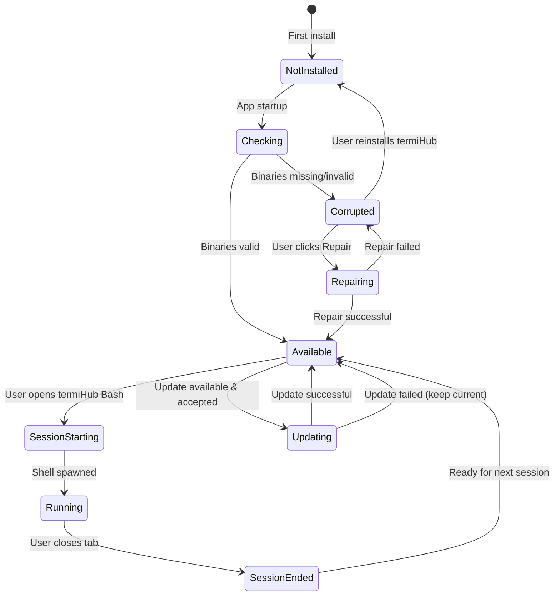
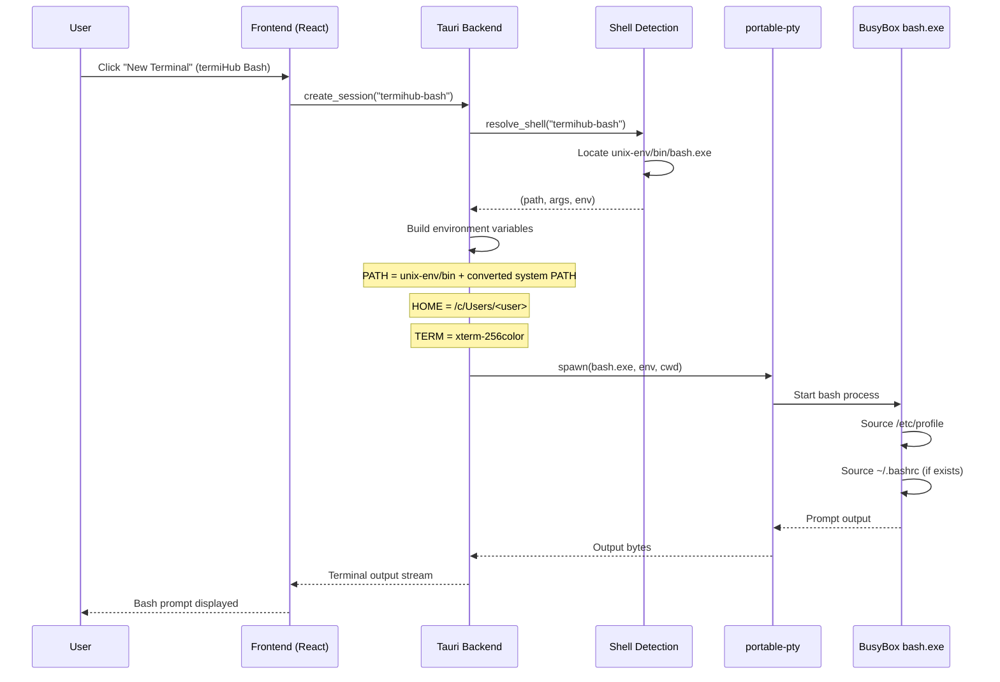
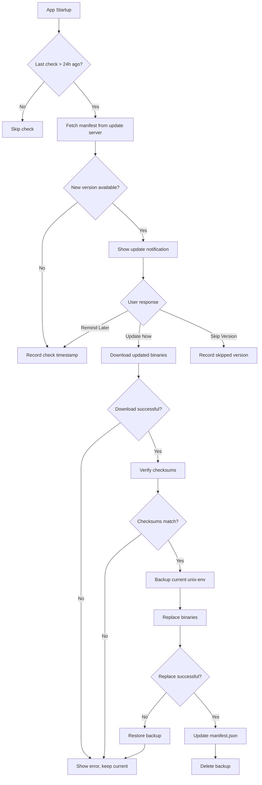
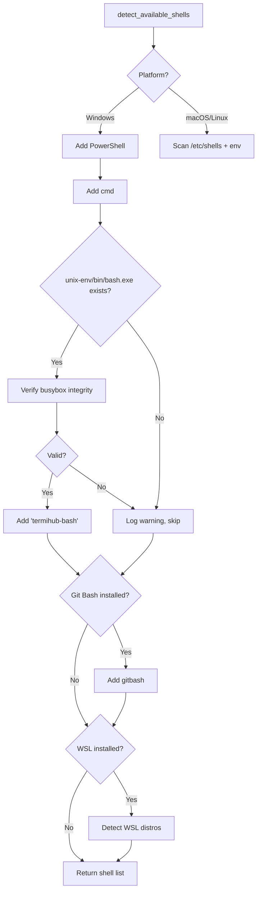
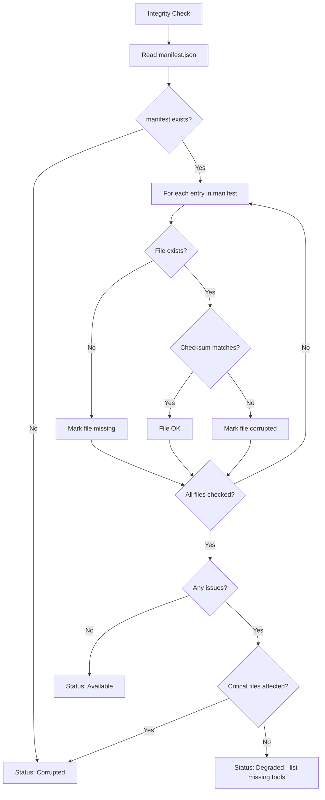
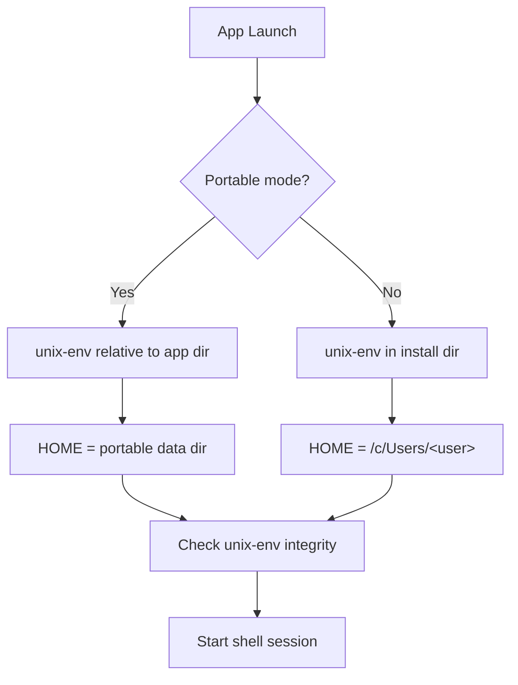
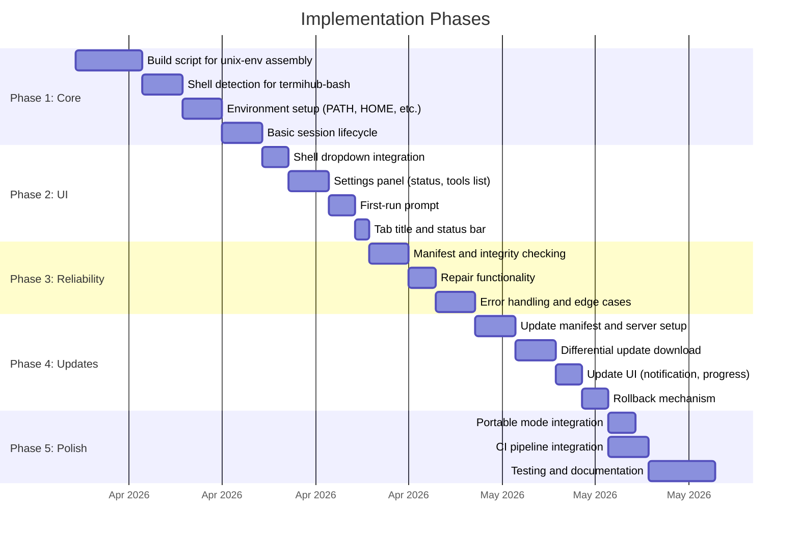

# Embedded Unix Command Environment on Windows

> GitHub Issue: [#519](https://github.com/armaxri/termiHub/issues/519)

## Overview

termiHub currently supports local shells on Windows via PowerShell, cmd, Git Bash
(if installed), and WSL distributions. However, users who want standard Unix tools
(bash, grep, sed, awk, curl, ssh, rsync, etc.) must install a separate environment
like Git for Windows, MSYS2, Cygwin, or WSL — each with its own setup burden, PATH
conflicts, and compatibility quirks.

This concept proposes bundling a minimal, self-contained Unix command environment
with the Windows build of termiHub, providing:

- **Zero-setup Unix tools**: bash, coreutils, grep, sed, awk, curl, ssh, rsync, and
  more — available immediately after installing termiHub
- **Isolated PATH**: tools are available inside termiHub terminals without polluting
  the system-wide PATH
- **Consistent behavior**: identical tool versions across all Windows machines running
  the same termiHub version
- **MobaXterm parity**: a key differentiator that MobaXterm users expect

### Goals

1. Provide a usable bash shell and ~30 essential Unix utilities on Windows
2. Keep the installer size impact under 50 MB
3. Integrate seamlessly with the existing connection type system
4. Allow independent updates of the bundled tools
5. Coexist with Git Bash, MSYS2, Cygwin, and WSL without conflicts

### Non-Goals

- Full POSIX compliance (this is not a Cygwin replacement)
- Running Linux binaries (that's WSL's job)
- Replacing the user's existing Unix environment if they have one
- macOS or Linux support (these platforms already have native Unix tools)

---

## UI Interface

### Shell Selection

The bundled Unix environment appears as a new shell option in the connection editor
and default shell settings. It is only visible on Windows.

```
┌─────────────────────────────────────────────────────────┐
│  New Connection                                         │
├─────────────────────────────────────────────────────────┤
│                                                         │
│  Connection Type:  [Local Shell ▼]                      │
│                                                         │
│  Shell:            [▼ Select shell                    ] │
│                    ┌─────────────────────────────────┐  │
│                    │ ● PowerShell (platform default)  │  │
│                    │ ○ cmd                            │  │
│                    │ ○ termiHub Bash ★                │  │
│                    │ ○ Git Bash                       │  │
│                    │ ○ WSL: Ubuntu                    │  │
│                    │ ○ Custom...                      │  │
│                    └─────────────────────────────────┘  │
│                                                         │
│  Starting Directory: [~/                             ]  │
│  Initial Command:    [                               ]  │
│                                                         │
│  [Cancel]                              [Create & Connect]│
└─────────────────────────────────────────────────────────┘
```

- **"termiHub Bash"** is the display name for the bundled environment
- The ★ marker indicates it's bundled with termiHub
- If the bundled environment is not installed or corrupted, the option appears
  grayed out with a tooltip: "Bundled Unix environment not available — reinstall
  termiHub to restore"

### Settings Panel

A new section appears in Settings under **General > Default Shell** on Windows:

```
┌─────────────────────────────────────────────────────────┐
│  Settings                                               │
├──────────┬──────────────────────────────────────────────┤
│          │                                              │
│ General  │  Default Shell                               │
│ ------   │  ┌──────────────────────────────────────┐    │
│ Appear.  │  │ PowerShell (platform default)      ▼│    │
│ Terminal │  └──────────────────────────────────────┘    │
│ Security │                                              │
│ Keyboard │  ┌──────────────────────────────────────────┐│
│          │  │ Bundled Unix Environment                 ││
│          │  ├──────────────────────────────────────────┤│
│          │  │ Status:   ✓ Installed (v1.2.0)          ││
│          │  │ Size:     38 MB                          ││
│          │  │ Location: <app>/unix-env/                ││
│          │  │                                          ││
│          │  │ Included tools:                          ││
│          │  │ bash, sh, grep, sed, awk, cat, ls,      ││
│          │  │ find, sort, uniq, wc, head, tail, cut,  ││
│          │  │ tr, diff, patch, tar, gzip, xz, curl,   ││
│          │  │ wget, ssh, scp, rsync, git, vim, less,  ││
│          │  │ man, xargs, tee, env, which              ││
│          │  │                                          ││
│          │  │ [Check for Updates]  [Repair]            ││
│          │  └──────────────────────────────────────────┘│
│          │                                              │
└──────────┴──────────────────────────────────────────────┘
```

### Terminal Tab Title

When a termiHub Bash session is active, the tab shows:

```
┌──────────────┬──────────────┬──────────────┐
│ ⬤ Bash ★    │ PowerShell   │   +          │
└──────────────┴──────────────┴──────────────┘
```

The ★ icon distinguishes the bundled bash from Git Bash or WSL bash sessions.

### Status Bar Integration

When a termiHub Bash session is focused, the status bar shows the environment info:

```
┌─────────────────────────────────────────────────────────┐
│ termiHub Bash v1.2.0 │ ~/projects │ bash 5.2           │
└─────────────────────────────────────────────────────────┘
```

### First-Run Experience

On first launch after install (Windows only), if no other Unix shell is detected:

```
┌──────────────────────────────────────────────────────────┐
│                                                          │
│  🔧 Unix Tools Available                                 │
│                                                          │
│  termiHub includes a bundled Unix command environment    │
│  with bash, grep, sed, curl, ssh, and 25+ more tools.   │
│                                                          │
│  Would you like to set termiHub Bash as your default     │
│  shell for new local connections?                        │
│                                                          │
│  [Yes, use termiHub Bash]    [No, keep PowerShell]       │
│                                                          │
│  □ Don't show this again                                 │
│                                                          │
└──────────────────────────────────────────────────────────┘
```

This dialog does **not** appear if Git Bash or WSL bash is detected — only when the
user has no existing Unix shell.

---

## General Handling

### Tool Selection Strategy

After evaluating available options, the recommended approach is a **layered
strategy** combining BusyBox-w32 as the core with supplementary standalone tools:

| Layer           | Contents            | Size   | Purpose                                                                                                                |
| --------------- | ------------------- | ------ | ---------------------------------------------------------------------------------------------------------------------- |
| **Core**        | BusyBox-w32         | ~1 MB  | bash, sh, coreutils (ls, cat, grep, sed, awk, find, sort, head, tail, wc, cut, tr, diff, xargs, tee, env, which, etc.) |
| **Network**     | Standalone binaries | ~15 MB | curl, wget, ssh/scp (from Win32-OpenSSH), rsync                                                                        |
| **Compression** | Standalone binaries | ~5 MB  | tar, gzip, xz, zip/unzip                                                                                               |
| **Extras**      | Standalone binaries | ~15 MB | git (portable), vim, less, man                                                                                         |
| **Total**       |                     | ~36 MB |                                                                                                                        |

**Why BusyBox-w32 + standalone tools:**

- BusyBox-w32 is a single ~1 MB executable providing 100+ Unix commands via applet
  symlinks — extremely lightweight
- It provides a functional bash shell (not just sh) suitable for scripting
- Standalone tools fill gaps where BusyBox applets are insufficient (e.g., full
  OpenSSH vs BusyBox's limited ssh)
- No DLL dependencies, no runtime requirements — pure static executables
- Total size is well under the 50 MB target

**Alternative approaches considered:**

| Approach                  | Pros                                   | Cons                                 | Verdict         |
| ------------------------- | -------------------------------------- | ------------------------------------ | --------------- |
| BusyBox-w32 only          | Tiny (1 MB), single binary             | Limited ssh/curl, no git             | Too limited     |
| MSYS2 subset              | Full GNU tools, excellent compat       | 200+ MB, DLL dependencies            | Too large       |
| Cygwin subset             | Most complete POSIX layer              | Large, cygwin1.dll conflicts         | Too heavy       |
| Git for Windows detection | Zero extra size                        | Not always installed, version varies | Unreliable      |
| Standalone .exe only      | No shell dependency issues             | No bash, 50+ separate files          | No shell        |
| **BusyBox + standalone**  | **Small, bash included, full toolset** | **BusyBox bash is limited**          | **Recommended** |

### Directory Structure

The bundled environment lives inside the termiHub installation directory:

```
<termiHub install dir>/
├── termiHub.exe
├── resources/
│   └── ...
└── unix-env/
    ├── manifest.json          # Version, tool inventory, checksums
    ├── bin/
    │   ├── busybox.exe        # Core BusyBox binary
    │   ├── bash.exe → busybox.exe   # Applet symlinks (hardlinks on NTFS)
    │   ├── sh.exe → busybox.exe
    │   ├── grep.exe → busybox.exe
    │   ├── sed.exe → busybox.exe
    │   ├── awk.exe → busybox.exe
    │   ├── ls.exe → busybox.exe
    │   ├── cat.exe → busybox.exe
    │   ├── find.exe → busybox.exe
    │   ├── ...                # ~60 more applet links
    │   ├── curl.exe           # Standalone
    │   ├── wget.exe           # Standalone
    │   ├── ssh.exe            # Win32-OpenSSH
    │   ├── scp.exe            # Win32-OpenSSH
    │   ├── rsync.exe          # Standalone
    │   ├── git.exe            # Portable Git (minimal)
    │   ├── vim.exe            # Standalone
    │   └── less.exe           # Standalone
    ├── etc/
    │   ├── profile            # Default bash profile
    │   ├── bashrc             # Default bashrc
    │   └── inputrc            # Readline config
    ├── share/
    │   ├── vim/               # Vim runtime files
    │   ├── terminfo/          # Terminal descriptions
    │   └── man/               # Man pages (optional)
    └── tmp/                   # Temporary directory for the environment
```

### PATH Management

When a termiHub Bash session starts, the PATH is constructed as:

```
<unix-env>/bin:<user's original PATH converted to Unix-style>
```

This ensures:

1. Bundled tools take precedence inside termiHub terminals
2. User's Windows tools (e.g., `code`, `dotnet`, `python`) remain accessible
3. No changes to the system PATH or user PATH environment variables
4. Other terminal sessions (PowerShell, cmd) are unaffected

**Path conversion**: Windows paths like `C:\Users\john` are converted to
`/c/Users/john` (MinGW-style) inside the bash environment for consistency.

### Environment Initialization

When a termiHub Bash session starts:

```bash
# Injected by termiHub before spawning bash
export TERMIHUB_UNIX_ENV="<unix-env-path>"
export HOME="/c/Users/<username>"
export TERM=xterm-256color
export LANG=en_US.UTF-8
export TMPDIR="<unix-env>/tmp"

# Source user's bashrc if it exists
[ -f "$HOME/.bashrc" ] && . "$HOME/.bashrc"
```

### User Journeys

#### Journey 1: New User on Windows

1. User installs termiHub on a fresh Windows machine (no Git Bash, no WSL)
2. First launch shows the "Unix Tools Available" prompt
3. User selects "Yes, use termiHub Bash"
4. Default shell setting is updated to `termihub-bash`
5. User opens a new terminal tab — bash prompt appears immediately
6. User runs `grep`, `curl`, `ssh` — all work without additional setup

#### Journey 2: Experienced User with Existing Tools

1. User installs termiHub on a machine with Git Bash and WSL
2. No first-run prompt appears (existing Unix shells detected)
3. User sees "termiHub Bash ★" in the shell dropdown alongside Git Bash and WSL
4. User can choose any shell per-connection
5. Bundled tools do not interfere with Git Bash or WSL environments

#### Journey 3: Using Bundled SSH from PowerShell

1. User is in a PowerShell session in termiHub
2. User wants to use `rsync` which is not available in PowerShell
3. User switches to termiHub Bash in a new tab
4. `rsync` is available immediately

### Edge Cases and Error Handling

| Scenario                                | Handling                                                                            |
| --------------------------------------- | ----------------------------------------------------------------------------------- |
| **Antivirus quarantines BusyBox**       | Detect missing binary at startup, show warning with instructions to whitelist       |
| **Installation directory is read-only** | All bundled files are read-only by design; `tmp/` must be writable — warn if not    |
| **User has conflicting BusyBox**        | termiHub's PATH prepending ensures bundled version takes precedence inside termiHub |
| **Applet hardlinks fail**               | Fall back to `busybox.exe <applet> <args>` invocation pattern                       |
| **Tool update fails mid-download**      | Keep existing version, retry on next update check                                   |
| **Disk space insufficient**             | Check available space before update, show clear error with required space           |
| **PATH too long (Windows 32K limit)**   | Unlikely but possible — truncate inherited PATH, warn user                          |
| **Unicode filenames**                   | BusyBox-w32 supports Windows Unicode APIs; test with CJK filenames                  |
| **Line endings (CRLF vs LF)**           | BusyBox handles both; document that scripts should use LF                           |

### Update Mechanism

The bundled environment can be updated independently of termiHub releases:

```
┌─────────────────────────────────────────────────────────┐
│ Update Available                                        │
├─────────────────────────────────────────────────────────┤
│                                                         │
│ Unix Environment Update: v1.2.0 → v1.3.0               │
│                                                         │
│ Changes:                                                │
│ • Updated curl to 8.5.0 (security fix)                 │
│ • Added jq 1.7 to tool set                             │
│ • BusyBox updated to 1.37.0                            │
│                                                         │
│ Size: 2.3 MB download                                  │
│                                                         │
│ [Update Now]    [Remind Me Later]    [Skip This Version]│
│                                                         │
└─────────────────────────────────────────────────────────┘
```

- Updates are checked on app startup (at most once per day)
- Update manifest hosted alongside termiHub releases (GitHub Releases or CDN)
- Differential updates: only changed binaries are downloaded
- Rollback: previous version kept until new version is verified

---

## States & Sequences

### Environment Lifecycle



### Session Startup Sequence



### Update Flow



### Shell Detection Flow (Updated for termiHub Bash)



### Environment Integrity Check



### Portable Mode Interaction



---

## Preliminary Implementation Details

### Rust Backend Changes

#### New Shell Type: `termihub-bash`

In `core/src/session/shell.rs`, extend shell detection for Windows:

```rust
#[cfg(windows)]
fn detect_termihub_bash() -> Option<String> {
    // Locate unix-env relative to the application executable
    let exe_dir = std::env::current_exe()
        .ok()?
        .parent()?
        .to_path_buf();
    let bash_path = exe_dir.join("unix-env").join("bin").join("bash.exe");

    if bash_path.exists() {
        // Verify it's a working BusyBox binary
        let output = std::process::Command::new(&bash_path)
            .arg("--version")
            .output()
            .ok()?;
        if output.status.success() {
            Some("termihub-bash".to_string())
        } else {
            None
        }
    } else {
        None
    }
}
```

In `detect_available_shells()` (Windows branch), add after PowerShell and cmd:

```rust
// Add termiHub Bash if bundled environment is available
if let Some(shell) = detect_termihub_bash() {
    shells.push(shell);
}
```

In `shell_to_command()`, add a new match arm:

```rust
"termihub-bash" | "termihub_bash" => {
    let exe_dir = std::env::current_exe()
        .context("failed to determine executable path")?
        .parent()
        .context("executable has no parent directory")?
        .to_path_buf();
    let bash_path = exe_dir.join("unix-env").join("bin").join("bash.exe");
    (bash_path.to_string_lossy().to_string(), vec!["--login".to_string()])
}
```

#### Environment Setup

In `core/src/backends/local_shell.rs`, modify the environment construction when the
shell type is `termihub-bash`:

```rust
#[cfg(windows)]
fn build_termihub_bash_env(exe_dir: &Path) -> HashMap<String, String> {
    let unix_env = exe_dir.join("unix-env");
    let bin_dir = unix_env.join("bin");
    let user_profile = std::env::var("USERPROFILE").unwrap_or_default();

    // Convert Windows PATH to Unix-style and prepend bundled bin
    let system_path = std::env::var("PATH").unwrap_or_default();
    let unix_path = format!(
        "{};{}",
        bin_dir.to_string_lossy(),
        system_path
    );

    let mut env = HashMap::new();
    env.insert("PATH".into(), unix_path);
    env.insert("HOME".into(), windows_to_unix_path(&user_profile));
    env.insert("TERM".into(), "xterm-256color".into());
    env.insert("LANG".into(), "en_US.UTF-8".into());
    env.insert("TERMIHUB_UNIX_ENV".into(), unix_env.to_string_lossy().into());
    env.insert("TMPDIR".into(), unix_env.join("tmp").to_string_lossy().into());
    env
}

#[cfg(windows)]
fn windows_to_unix_path(path: &str) -> String {
    // C:\Users\john → /c/Users/john
    let path = path.replace('\\', "/");
    if path.len() >= 2 && path.as_bytes()[1] == b':' {
        format!("/{}{}", path[..1].to_lowercase(), &path[2..])
    } else {
        path
    }
}
```

#### Manifest and Integrity Checking

New module `core/src/unix_env/` (Windows-only):

```rust
// core/src/unix_env/manifest.rs
#[cfg(windows)]
#[derive(Debug, Serialize, Deserialize)]
pub struct UnixEnvManifest {
    pub version: String,
    pub busybox_version: String,
    pub tools: Vec<ToolEntry>,
    pub created_at: String,
}

#[cfg(windows)]
#[derive(Debug, Serialize, Deserialize)]
pub struct ToolEntry {
    pub name: String,
    pub source: ToolSource, // Busybox | Standalone
    pub path: String,
    pub sha256: String,
    pub version: Option<String>,
}

#[cfg(windows)]
#[derive(Debug, Serialize, Deserialize)]
pub enum ToolSource {
    Busybox,
    Standalone,
}

#[cfg(windows)]
pub enum EnvStatus {
    Available { version: String },
    Degraded { version: String, missing: Vec<String> },
    Corrupted { reason: String },
    NotInstalled,
}
```

#### Tauri Commands

New commands in `src-tauri/src/commands/`:

```rust
#[cfg(windows)]
#[tauri::command]
pub async fn get_unix_env_status() -> Result<UnixEnvStatus, String> {
    // Check manifest, verify critical binaries
}

#[cfg(windows)]
#[tauri::command]
pub async fn repair_unix_env() -> Result<(), String> {
    // Re-extract bundled environment from app resources
}

#[cfg(windows)]
#[tauri::command]
pub async fn check_unix_env_update() -> Result<Option<UpdateInfo>, String> {
    // Check update manifest from server
}

#[cfg(windows)]
#[tauri::command]
pub async fn apply_unix_env_update(version: String) -> Result<(), String> {
    // Download and apply update
}
```

### TypeScript Frontend Changes

#### Updated Shell Types

In `src/types/terminal.ts`:

```typescript
export type ShellType =
  | "zsh"
  | "bash"
  | "cmd"
  | "powershell"
  | "gitbash"
  | "termihub-bash" // New
  | "fish"
  | "nushell"
  | "custom"
  | `wsl:${string}`;
```

#### Settings UI

In `src/components/Settings/GeneralSettings.tsx`, add a new section for the bundled
Unix environment status (conditionally rendered on Windows):

```typescript
interface UnixEnvStatus {
  status: "available" | "degraded" | "corrupted" | "not_installed";
  version?: string;
  size?: number;
  tools?: string[];
  missingTools?: string[];
}
```

#### Shell Display Names

In shell detection utilities, add display name mapping:

```typescript
const SHELL_DISPLAY_NAMES: Record<string, string> = {
  powershell: "PowerShell",
  cmd: "Command Prompt",
  "termihub-bash": "termiHub Bash ★",
  gitbash: "Git Bash",
  // ...
};
```

### Build System Changes

#### Installer Integration

The Tauri build configuration (`src-tauri/tauri.conf.json`) needs to bundle the
`unix-env/` directory as an external resource on Windows:

```json
{
  "bundle": {
    "resources": [
      {
        "path": "unix-env/**",
        "target": "unix-env/"
      }
    ]
  }
}
```

#### Build Script

A new build script `scripts/build-unix-env.sh` (or `.cmd`) would:

1. Download BusyBox-w32 release binary
2. Download standalone tool binaries (curl, ssh, rsync, etc.)
3. Create applet hardlinks/symlinks for BusyBox
4. Generate `manifest.json` with checksums
5. Package into `unix-env/` directory
6. Verify total size is within budget

```bash
#!/bin/bash
# scripts/build-unix-env.sh
# Downloads and assembles the bundled Unix environment for Windows

BUSYBOX_VERSION="FRP-5301-gda71f7c57"
BUSYBOX_URL="https://frippery.org/files/busybox/busybox.exe"
TARGET_DIR="src-tauri/unix-env"

# ... download, verify, create links, generate manifest
```

#### CI Pipeline

The Windows CI job needs an additional step to assemble `unix-env/` before building
the installer. This step only runs on Windows runners.

### Portable Mode Considerations

When termiHub runs in portable mode (see [portable-mode concept](portable-mode.md)):

- `unix-env/` lives inside the portable app directory (relative path)
- `HOME` inside bash is set to the portable data directory instead of `%USERPROFILE%`
- `TMPDIR` uses the portable temp directory
- The environment is fully self-contained and travels with the USB drive

### Testing Strategy

| Test Type             | What to Test                                                                                                                                                                 |
| --------------------- | ---------------------------------------------------------------------------------------------------------------------------------------------------------------------------- |
| **Unit tests**        | Shell detection includes `termihub-bash` when `unix-env/` exists; `shell_to_command()` resolves correctly; path conversion (Windows → Unix); manifest parsing and validation |
| **Integration tests** | Session spawns bash from bundled env; PATH isolation (bundled tools found, system tools still accessible); environment variables set correctly                               |
| **System tests**      | Full session lifecycle with bundled bash; tool execution (grep, curl, ssh); update flow (mock server)                                                                        |
| **Manual tests**      | Antivirus interaction; coexistence with Git Bash and WSL; portable mode; Windows 10 vs 11 behavior; NTFS permissions on hardlinks                                            |

### Implementation Phases



### Risks and Mitigations

| Risk                                 | Impact                           | Likelihood | Mitigation                                                                    |
| ------------------------------------ | -------------------------------- | ---------- | ----------------------------------------------------------------------------- |
| Antivirus false positives on BusyBox | High — blocks core functionality | Medium     | Code-sign BusyBox binary; provide whitelist instructions; detect and warn     |
| BusyBox bash incompatibilities       | Medium — scripts may fail        | Low        | Document known differences from GNU bash; provide full bash as alternative    |
| Installer size increase              | Low — user perception            | Low        | 36 MB is modest; compress aggressively; offer "minimal" vs "full" install     |
| NTFS hardlink limitations            | Medium — applets won't work      | Low        | Fall back to `busybox.exe <applet>` wrapper scripts (.cmd files)              |
| Licensing concerns                   | High — legal risk                | Low        | BusyBox is GPLv2; standalone tools are MIT/BSD/similar; document all licenses |
| Update server reliability            | Medium — stale tools             | Low        | Graceful degradation; bundled version always works offline                    |

### Licensing

All bundled tools must have open-source licenses compatible with termiHub's
distribution model:

| Tool           | License                      | Distribution OK?                                 |
| -------------- | ---------------------------- | ------------------------------------------------ |
| BusyBox-w32    | GPLv2                        | Yes — must include license text and source offer |
| curl           | MIT/X                        | Yes                                              |
| wget           | GPLv3                        | Yes — must include license text                  |
| Win32-OpenSSH  | MIT                          | Yes                                              |
| rsync          | GPLv3                        | Yes — must include license text                  |
| Git (portable) | GPLv2                        | Yes — must include license text                  |
| vim            | Vim License (GPL-compatible) | Yes                                              |
| less           | GPLv3                        | Yes                                              |

A `unix-env/LICENSES/` directory must contain the full license text for each
bundled component. The termiHub About dialog should reference the bundled tools
and their licenses.
