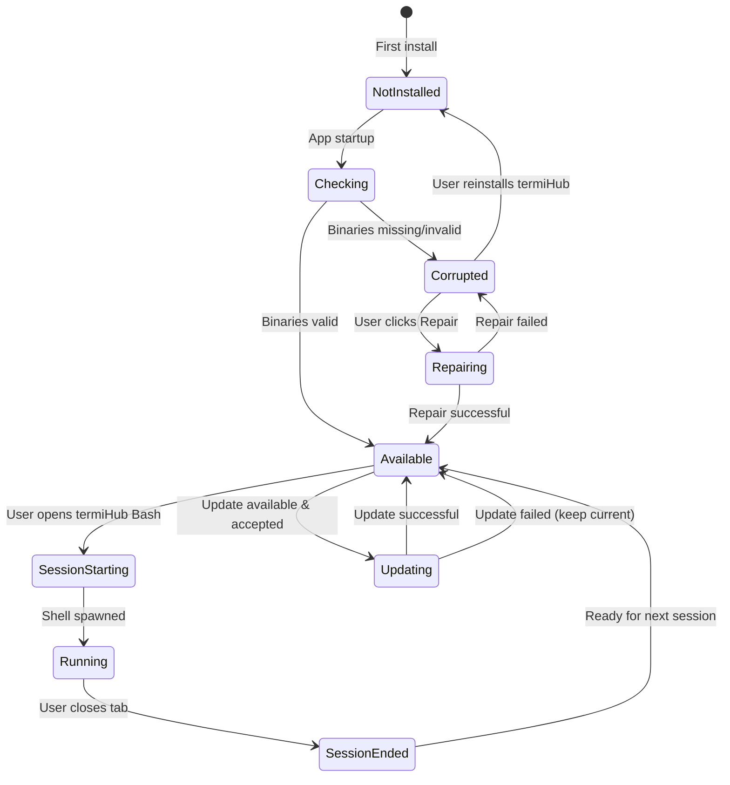
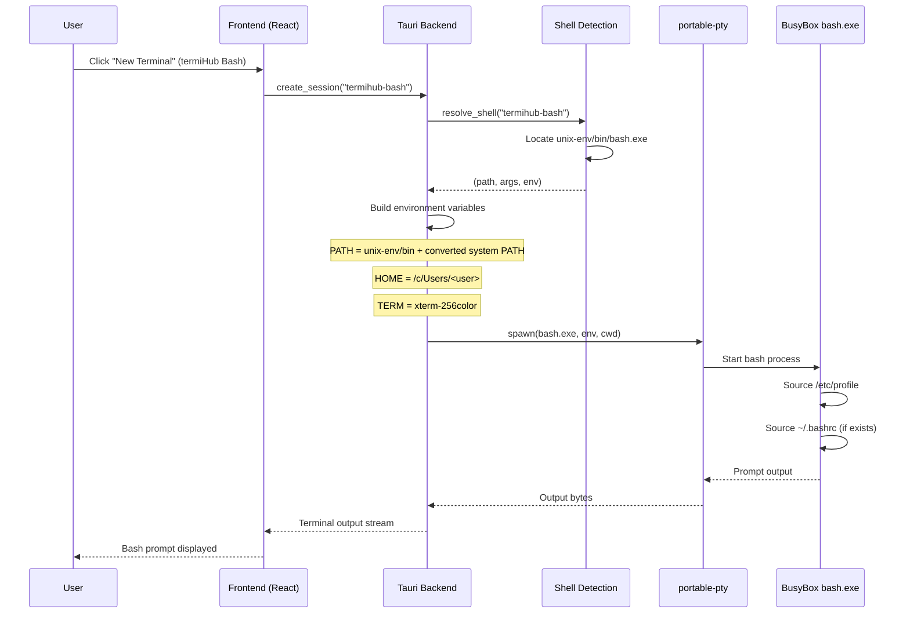
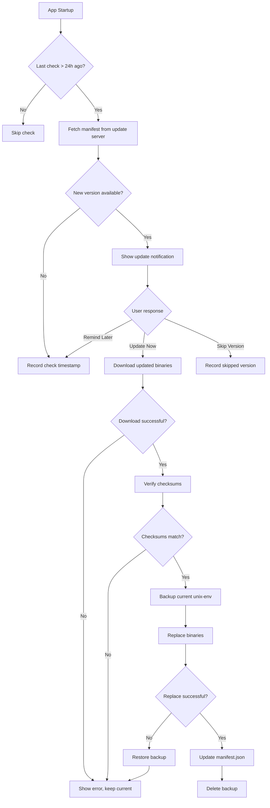
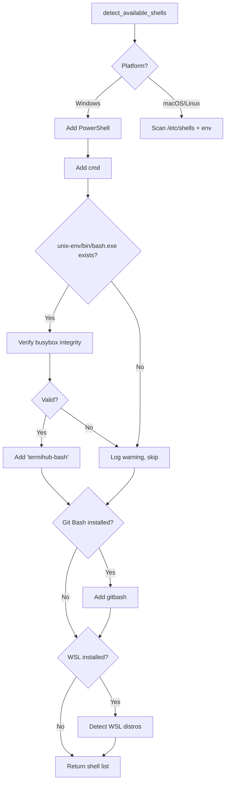
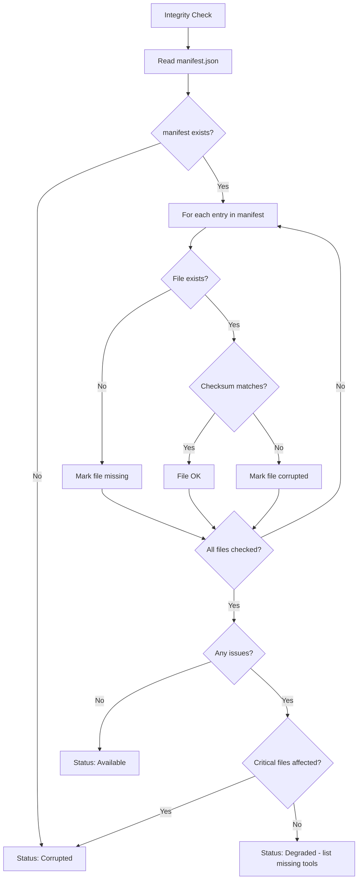
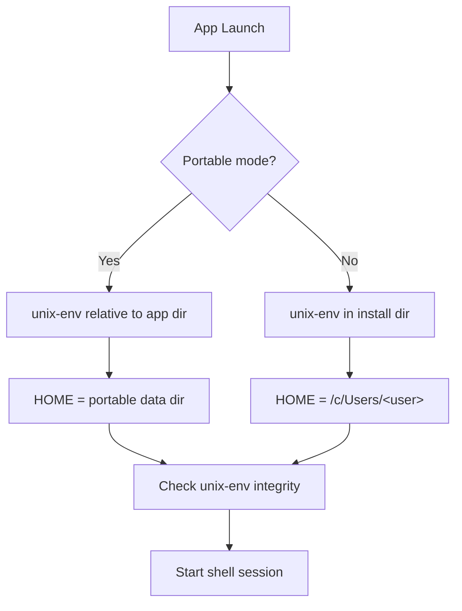
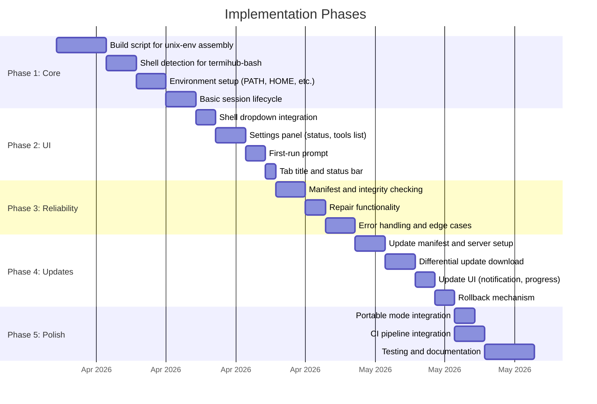

# Embedded Unix Command Environment — Behavior

Behavior diagrams for the [embedded-unix-windows concept](concept.md). State machines, sequences,
and flows live here; visual layout lives in [`mockups/`](mockups/).

---

## Environment Lifecycle

## Session Startup Sequence

## Update Flow

## Shell Detection Flow (with termiHub Bash)

## Environment Integrity Check

## Portable Mode Interaction

## Implementation Phases

