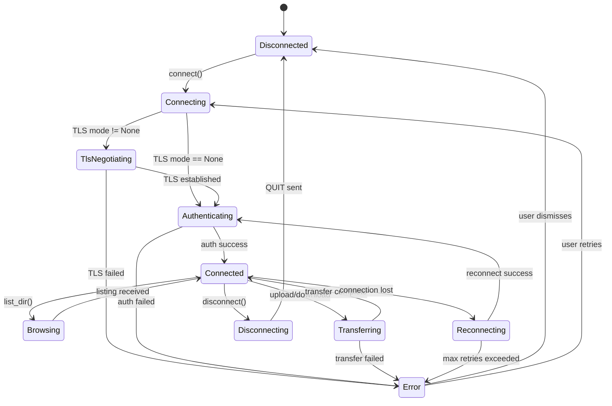
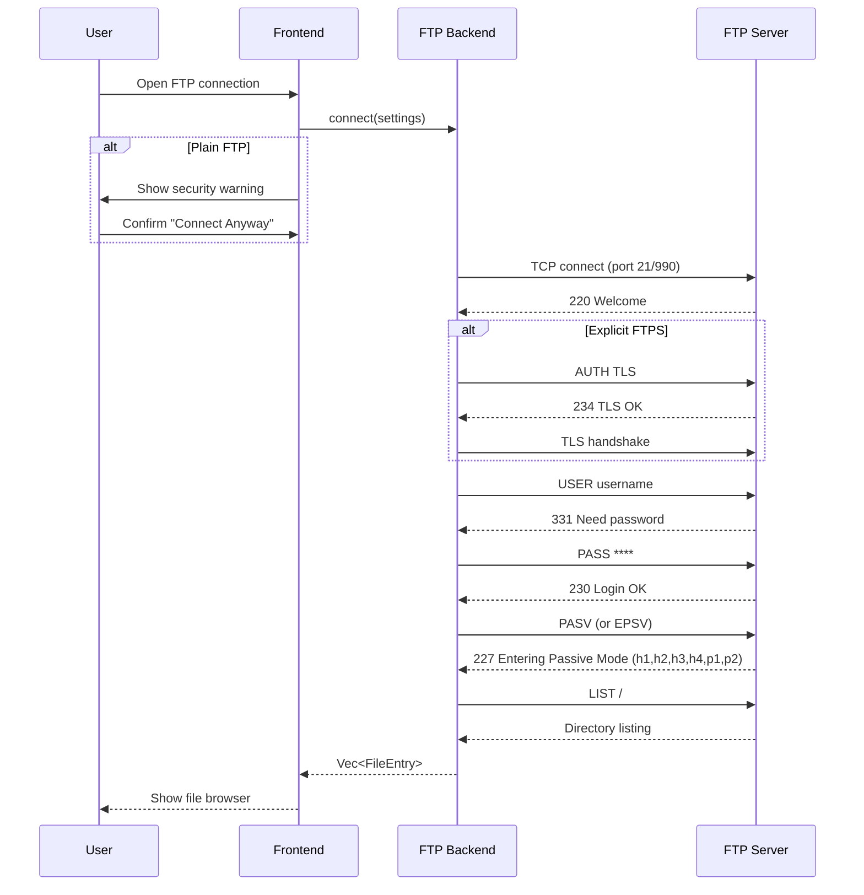
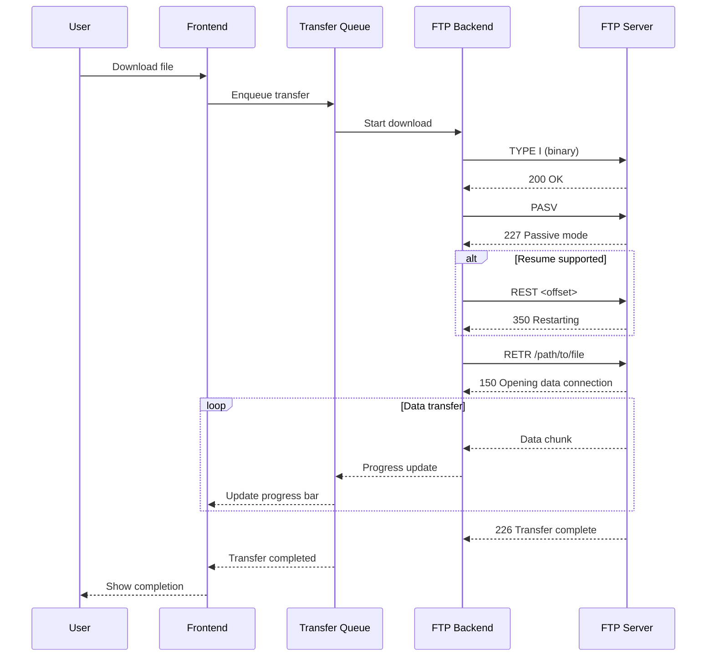
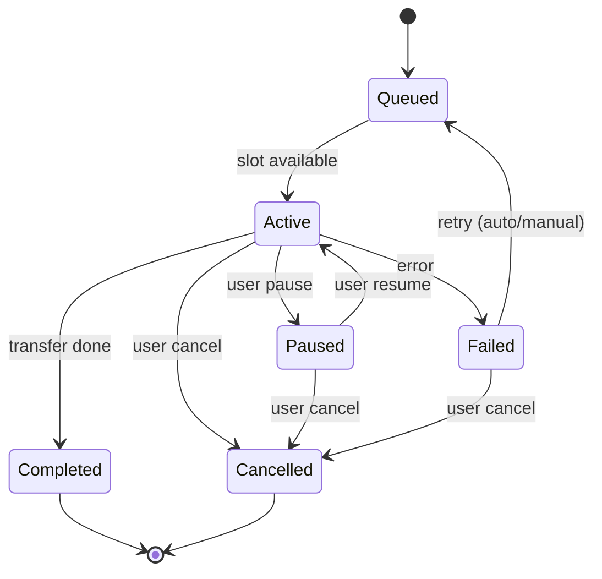
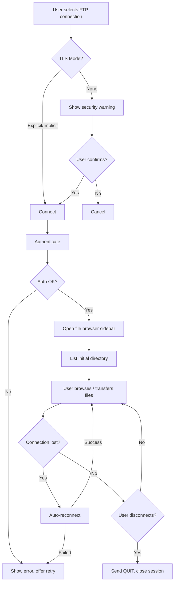
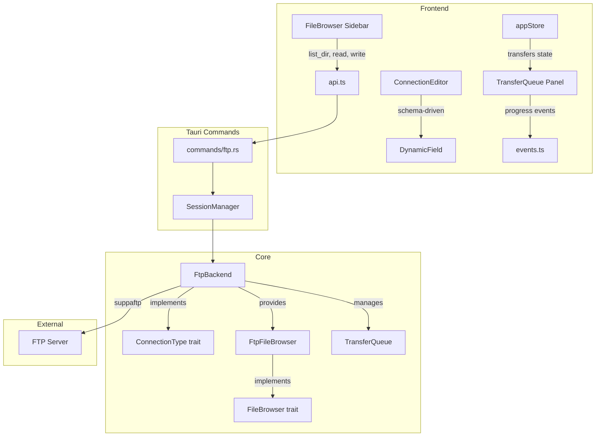

# Concept: FTP Client Sessions

> GitHub Issue: [#518](https://github.com/armaxri/termiHub/issues/518)

## Overview

Add FTP (File Transfer Protocol) client support to termiHub, enabling users to connect to FTP servers for file browsing and transfer. FTP sessions integrate with the existing file browser sidebar, connection editor, and credential store — leveraging termiHub's schema-driven architecture so that no custom UI code is required.

While SFTP has largely replaced FTP for secure transfers, FTP remains common in legacy environments, embedded systems, network equipment, and some hosting providers. Supporting FTP (plain and FTPS) broadens termiHub's compatibility with older infrastructure.

### Goals

- Support FTP (plain), FTPS explicit (STARTTLS), and FTPS implicit (TLS from the start)
- Integrate with the existing file browser sidebar for directory navigation and file operations
- Provide a transfer queue with progress tracking for uploads and downloads
- Warn users when connecting over plain FTP (unencrypted credentials on the wire)
- Support passive mode (default, firewall-friendly) and active mode as fallback
- Support transfer resume for interrupted uploads/downloads where the server supports it

### Non-Goals

- SFTP support (already handled by the SSH backend)
- FTP proxy/gateway functionality
- FTP server hosting

---

## UI Interface

### Connection Editor

FTP connections use the existing generic connection editor with a schema-driven form. When the user selects "FTP" from the connection type dropdown, the following fields appear:

```
┌─────────────────────────────────────────────────────┐
│  Connection   │  Terminal   │  Appearance           │
├─────────────────────────────────────────────────────┤
│                                                     │
│  Name:        [ My FTP Server              ]        │
│  Type:        [ FTP ▼                      ]        │
│                                                     │
│  ── Server ──────────────────────────────────────   │
│  Host:        [ ftp.example.com            ]        │
│  Port:        [ 21                         ]        │
│                                                     │
│  ── Security ────────────────────────────────────   │
│  TLS Mode:    [ None ▼                     ]        │
│               ┌──────────────────────┐              │
│               │ None (plain FTP)     │              │
│               │ Explicit (STARTTLS)  │              │
│               │ Implicit             │              │
│               └──────────────────────┘              │
│                                                     │
│  ⚠ Warning: Plain FTP transmits credentials        │
│    and data in cleartext. Use FTPS if possible.     │
│                                                     │
│  ── Authentication ──────────────────────────────   │
│  Username:    [ admin                      ]        │
│  Password:    [ ••••••••            ] [👁]          │
│  Anonymous:   [ ] Use anonymous login               │
│                                                     │
│  ── Transfer ────────────────────────────────────   │
│  Mode:        [ Passive ▼                  ]        │
│  Transfer:    [ Binary ▼                   ]        │
│  Initial Dir: [ /pub                       ]        │
│  Timeout (s): [ 30                         ]        │
│                                                     │
│           [ Test Connection ]  [ Save ]             │
└─────────────────────────────────────────────────────┘
```

**Conditional field visibility:**

- When "Anonymous" is checked, Username is set to `anonymous` and Password is hidden
- The plain FTP security warning is only shown when TLS Mode is "None"
- Port auto-adjusts to 990 when TLS Mode is "Implicit", 21 otherwise (user can override)

### File Browser Sidebar

FTP sessions appear in the file browser sidebar, reusing the same tree-view UI as SFTP:

```
┌─────────────────────────────────┐
│ 📁 FILE BROWSER                 │
├─────────────────────────────────┤
│ My FTP Server (FTP)             │
│  ├── 📁 pub/                    │
│  │   ├── 📁 archives/           │
│  │   ├── 📄 readme.txt    1.2K  │
│  │   └── 📄 data.csv     45.3K  │
│  ├── 📁 uploads/                │
│  └── 📄 welcome.msg       256B  │
│                                 │
│ ── Context Menu ──              │
│ │ Download                      │
│ │ Upload Here...                │
│ │ New Folder                    │
│ │ Rename                        │
│ │ Delete                        │
│ │ Refresh                       │
│ │ Copy Path                     │
│ │ Properties                    │
│ └───────────────                │
└─────────────────────────────────┘
```

### Transfer Queue Panel

A new transfer queue panel appears in the status bar area when FTP transfers are active. This panel is shared across all connection types that support file transfer (FTP, and potentially SFTP in the future).

```
┌─────────────────────────────────────────────────────────────┐
│ 📤 Transfers (2 active, 1 queued)                    [─][×] │
├─────────────────────────────────────────────────────────────┤
│ ↑ data.csv → /uploads/data.csv     45% ████░░░░  23KB/s ⏸ │
│ ↓ report.pdf ← /pub/report.pdf     78% ██████░░  112KB/s  │
│ ⏳ backup.tar.gz → /uploads/       queued                   │
│                                                             │
│                    [ Clear Completed ]  [ Cancel All ]      │
└─────────────────────────────────────────────────────────────┘
```

**Transfer entry controls:**

- Pause/resume individual transfers
- Cancel individual transfers
- Retry failed transfers
- Clear completed transfers

### Security Warning Dialog

When connecting via plain FTP (no TLS), a modal warning is shown:

```
┌─────────────────────────────────────────────┐
│ ⚠ Insecure Connection                      │
│                                             │
│ Plain FTP transmits your username,          │
│ password, and all data in cleartext.        │
│ Anyone on the network path can intercept    │
│ your credentials and files.                 │
│                                             │
│ Consider using FTPS (FTP over TLS) if       │
│ the server supports it.                     │
│                                             │
│ [ ] Don't warn again for this connection    │
│                                             │
│      [ Cancel ]    [ Connect Anyway ]       │
└─────────────────────────────────────────────┘
```

---

## General Handling

### Connection Lifecycle

1. **Create** — User creates an FTP connection via the connection editor, selecting "FTP" as the type. Settings are validated and saved to `connections.json`.
2. **Connect** — User opens the connection. The backend establishes a control connection to the FTP server, authenticates, and optionally negotiates TLS. On plain FTP, the security warning dialog appears first.
3. **Browse** — The file browser sidebar populates with the remote directory listing. The user navigates directories, previews text files, and initiates transfers.
4. **Transfer** — File uploads/downloads are queued and executed. Progress is reported in the transfer queue panel.
5. **Disconnect** — User closes the session. The control connection is gracefully terminated (`QUIT`). Active transfers are cancelled with a confirmation prompt.

### FTP-Specific Behaviors

- **No terminal output**: Unlike SSH or telnet, FTP connections do not produce terminal output. FTP sessions open directly into the file browser view — no terminal tab is created.
- **Keep-alive**: The backend sends periodic `NOOP` commands to prevent the server from closing idle control connections. The interval is configurable (default: 60 seconds).
- **Reconnection**: If the control connection drops during browsing, the backend attempts automatic reconnection (up to 3 retries). Active transfers are paused and resumed after reconnection.
- **Transfer types**: Binary mode (default) preserves file contents exactly. ASCII mode converts line endings — useful for text files between different OS platforms. The user can set a default and override per-transfer.
- **Passive vs Active mode**: Passive mode (default) works through NAT/firewalls by having the server open a data port. Active mode has the client open a port — this requires the client to be directly reachable, which is rare in modern networks.
- **Directory listing parsing**: FTP servers return directory listings in varied formats (Unix `ls -l`, Windows, and others). The backend must parse multiple formats to extract file entries consistently.

### Transfer Queue Behavior

- Transfers are queued globally per FTP session
- Maximum concurrent transfers per session: 2 (configurable, uses separate data connections)
- Failed transfers can be retried (up to 3 automatic retries with exponential backoff)
- Transfer resume: if the server supports `REST` (restart), interrupted downloads resume from the last byte received
- Large file transfers show estimated time remaining based on current throughput
- Completed transfers remain visible in the queue until explicitly cleared

### Credential Handling

- Passwords are stored in the credential store (master password or prompt-only — matching the user's credential storage mode setting)
- Anonymous login uses username `anonymous` with an email-style password (configurable, defaults to empty)
- Passwords are never written to `connections.json` or logs

### Edge Cases

- **Server compatibility**: Some FTP servers have non-standard behavior. The backend should handle common quirks gracefully (e.g., servers that don't support `MLSD`, falling back to `LIST`).
- **Symbolic links**: Display symlinks with a distinct icon and follow them for navigation. Show the link target in properties.
- **Large directories**: For directories with thousands of entries, implement virtual scrolling in the file browser to avoid UI freezes.
- **Filename encoding**: FTP has no standard encoding. The backend should assume UTF-8 by default, with a fallback to Latin-1. A future enhancement could add encoding selection.
- **Connection timeout**: If the server doesn't respond within the configured timeout, surface a clear error message with suggestions (check host/port, firewall, server status).

---

## States & Sequences

### Connection State Machine



### Connection Sequence



### File Transfer Sequence



### Transfer Queue State Machine



### FTP Session Lifecycle (Frontend)



---

## Preliminary Implementation Details

> Based on the current project architecture as of the time of concept creation. The codebase may evolve between concept creation and implementation.

### New Crate Dependency

Add the [`suppaftp`](https://crates.io/crates/suppaftp) crate to `core/Cargo.toml`:

```toml
[dependencies]
suppaftp = { version = "6", features = ["async-native-tls"] }
```

`suppaftp` supports FTP, FTPS (explicit and implicit), passive and active mode, and async operations via `async-native-tls`. It handles the FTP protocol details, including `PASV`/`EPSV`, `REST`, `MLSD`/`LIST`, and TLS negotiation.

### New Backend: `core/src/backends/ftp/`

```
core/src/backends/ftp/
  mod.rs              # FtpBackend — implements ConnectionType
  file_browser.rs     # FtpFileBrowser — implements FileBrowser
  transfer.rs         # TransferQueue, TransferEntry, progress tracking
  listing_parser.rs   # Directory listing parsers (Unix, Windows, MLSD)
```

**FtpBackend** (`mod.rs`):

```rust
pub struct FtpBackend {
    client: Option<AsyncFtpStream>,
    settings: FtpSettings,
    keep_alive_handle: Option<JoinHandle<()>>,
    file_browser: Option<FtpFileBrowser>,
    transfer_queue: TransferQueue,
    output_tx: Option<broadcast::Sender<Vec<u8>>>,
}

impl ConnectionType for FtpBackend {
    fn type_id(&self) -> &str { "ftp" }
    fn display_name(&self) -> &str { "FTP" }

    fn capabilities(&self) -> Capabilities {
        Capabilities {
            monitoring: false,
            file_browser: true,
            resize: false,
            persistent: false,
        }
    }

    fn settings_schema(&self) -> SettingsSchema {
        // Schema-driven fields: host, port, tls_mode,
        // username, password, anonymous, passive_mode,
        // transfer_type, initial_directory, timeout,
        // keep_alive_interval, suppress_security_warning
    }

    async fn connect(&mut self, settings: Value) -> Result<(), SessionError> {
        // 1. Parse settings
        // 2. Establish TCP connection
        // 3. Negotiate TLS if configured
        // 4. Authenticate (user/pass or anonymous)
        // 5. Set passive/active mode
        // 6. Change to initial directory
        // 7. Start keep-alive task
        // 8. Initialize FtpFileBrowser
    }

    async fn write(&mut self, _data: &[u8]) -> Result<(), SessionError> {
        // FTP has no terminal input — return error or no-op
        Err(SessionError::NotSupported("FTP has no terminal input"))
    }

    async fn resize(&mut self, _cols: u16, _rows: u16) -> Result<(), SessionError> {
        Ok(()) // No-op, FTP has no terminal
    }

    fn file_browser(&self) -> Option<&dyn FileBrowser> {
        self.file_browser.as_ref().map(|fb| fb as &dyn FileBrowser)
    }

    async fn disconnect(&mut self) -> Result<(), SessionError> {
        // Cancel active transfers, send QUIT, close connection
    }
}
```

**FtpFileBrowser** (`file_browser.rs`):

```rust
pub struct FtpFileBrowser {
    client: Arc<Mutex<AsyncFtpStream>>,
}

#[async_trait]
impl FileBrowser for FtpFileBrowser {
    async fn list_dir(&self, path: &str) -> Result<Vec<FileEntry>, FileError> {
        // Try MLSD first (structured listing), fall back to LIST
        // Parse listing into Vec<FileEntry>
    }

    async fn read_file(&self, path: &str) -> Result<Vec<u8>, FileError> {
        // RETR file into memory (for preview/edit)
    }

    async fn write_file(&self, path: &str, data: &[u8]) -> Result<(), FileError> {
        // STOR file from memory
    }

    async fn delete(&self, path: &str) -> Result<(), FileError> {
        // DELE for files, RMD for directories
    }

    async fn rename(&self, from: &str, to: &str) -> Result<(), FileError> {
        // RNFR + RNTO
    }

    async fn stat(&self, path: &str) -> Result<FileEntry, FileError> {
        // MLST if supported, otherwise LIST parent + filter
    }
}
```

### Transfer Queue

The transfer queue manages concurrent file transfers with progress reporting.

```rust
// core/src/backends/ftp/transfer.rs

pub struct TransferQueue {
    entries: Vec<TransferEntry>,
    max_concurrent: usize,
    progress_tx: broadcast::Sender<TransferProgress>,
}

pub struct TransferEntry {
    pub id: String,
    pub direction: TransferDirection,  // Upload / Download
    pub local_path: PathBuf,
    pub remote_path: String,
    pub state: TransferState,
    pub total_bytes: Option<u64>,
    pub transferred_bytes: u64,
    pub speed_bytes_per_sec: u64,
}

pub enum TransferState {
    Queued,
    Active,
    Paused,
    Completed,
    Failed(String),
    Cancelled,
}
```

### New Tauri IPC Commands

Add FTP-specific transfer commands in `src-tauri/src/commands/`:

```rust
// src-tauri/src/commands/ftp.rs

#[tauri::command]
async fn ftp_download(
    session_id: String,
    remote_path: String,
    local_path: String,
) -> Result<String, String>;  // Returns transfer ID

#[tauri::command]
async fn ftp_upload(
    session_id: String,
    local_path: String,
    remote_path: String,
) -> Result<String, String>;  // Returns transfer ID

#[tauri::command]
async fn ftp_transfer_pause(transfer_id: String) -> Result<(), String>;

#[tauri::command]
async fn ftp_transfer_resume(transfer_id: String) -> Result<(), String>;

#[tauri::command]
async fn ftp_transfer_cancel(transfer_id: String) -> Result<(), String>;

#[tauri::command]
async fn ftp_transfer_list(session_id: String) -> Result<Vec<TransferEntry>, String>;
```

### Frontend Store Extensions

Add transfer queue state to `src/store/appStore.ts`:

```typescript
// Transfer queue types (src/types/transfer.ts)
export interface TransferEntry {
  id: string;
  sessionId: string;
  direction: "upload" | "download";
  localPath: string;
  remotePath: string;
  state: "queued" | "active" | "paused" | "completed" | "failed" | "cancelled";
  totalBytes: number | null;
  transferredBytes: number;
  speedBytesPerSec: number;
  error: string | null;
}

// Store slice
interface TransferSlice {
  transfers: TransferEntry[];
  addTransfer: (entry: TransferEntry) => void;
  updateTransfer: (id: string, update: Partial<TransferEntry>) => void;
  removeTransfer: (id: string) => void;
  clearCompleted: () => void;
}
```

### New Frontend Components

```
src/components/TransferQueue/
  TransferQueue.tsx           # Transfer queue panel (status bar area)
  TransferEntry.tsx           # Individual transfer row with progress bar
  TransferControls.tsx        # Pause/resume/cancel/retry buttons
```

The transfer queue panel is connection-type agnostic — it listens for transfer events from any session that supports file transfers.

### Tauri Event Integration

Transfer progress is reported via Tauri events (not polling):

```rust
// Backend emits progress events
app_handle.emit("transfer-progress", TransferProgressPayload {
    transfer_id: id,
    transferred_bytes: bytes,
    total_bytes: total,
    speed: speed,
    state: state,
});
```

```typescript
// Frontend listens for progress
import { listen } from "@tauri-apps/api/event";

listen<TransferProgressPayload>("transfer-progress", (event) => {
  useAppStore.getState().updateTransfer(event.payload.transfer_id, {
    transferredBytes: event.payload.transferred_bytes,
    speedBytesPerSec: event.payload.speed,
    state: event.payload.state,
  });
});
```

### Settings Schema Definition

The FTP backend declares its settings schema so the connection editor renders automatically:

```rust
fn settings_schema(&self) -> SettingsSchema {
    SettingsSchema {
        groups: vec![
            SettingsGroup {
                label: "Server",
                fields: vec![
                    Field { key: "host", label: "Host", field_type: Text, required: true },
                    Field { key: "port", label: "Port", field_type: Port, default: 21 },
                ],
            },
            SettingsGroup {
                label: "Security",
                fields: vec![
                    Field {
                        key: "tlsMode",
                        label: "TLS Mode",
                        field_type: Select(vec!["none", "explicit", "implicit"]),
                        default: "none",
                    },
                    // Security warning rendered by frontend when tlsMode == "none"
                    Field {
                        key: "suppressSecurityWarning",
                        label: "Don't warn about insecure connection",
                        field_type: Boolean,
                        default: false,
                        visible_when: FieldCondition { key: "tlsMode", equals: "none" },
                    },
                ],
            },
            SettingsGroup {
                label: "Authentication",
                fields: vec![
                    Field {
                        key: "anonymous",
                        label: "Use anonymous login",
                        field_type: Boolean,
                        default: false,
                    },
                    Field {
                        key: "username",
                        label: "Username",
                        field_type: Text,
                        default: "",
                        visible_when: FieldCondition { key: "anonymous", equals: false },
                    },
                    Field {
                        key: "password",
                        label: "Password",
                        field_type: Password,
                        visible_when: FieldCondition { key: "anonymous", equals: false },
                    },
                ],
            },
            SettingsGroup {
                label: "Transfer",
                fields: vec![
                    Field {
                        key: "passiveMode",
                        label: "Mode",
                        field_type: Select(vec!["passive", "active"]),
                        default: "passive",
                    },
                    Field {
                        key: "transferType",
                        label: "Transfer Type",
                        field_type: Select(vec!["binary", "ascii"]),
                        default: "binary",
                    },
                    Field {
                        key: "initialDirectory",
                        label: "Initial Directory",
                        field_type: Text,
                        default: "/",
                    },
                    Field {
                        key: "timeout",
                        label: "Timeout (seconds)",
                        field_type: Number,
                        default: 30,
                    },
                ],
            },
        ],
    }
}
```

### Registration

Register the FTP backend in the connection type registry:

```rust
// core/src/backends/mod.rs
pub mod ftp;

// In the registry setup (desktop or agent)
registry.register(Box::new(FtpBackend::new()));
```

### Integration Overview



### Agent Support

FTP connections are **desktop-only** in the initial implementation. The remote agent does not need FTP support because:

- FTP is a direct client-to-server protocol (no SSH tunneling involved)
- The desktop app connects directly to FTP servers
- Agent-side FTP could be added later if there's demand for FTP access through SSH jump hosts

### File Touched Summary

| File/Directory                                      | Action | Purpose                              |
| --------------------------------------------------- | ------ | ------------------------------------ |
| `core/Cargo.toml`                                   | Modify | Add `suppaftp` dependency            |
| `core/src/backends/ftp/mod.rs`                      | Create | FtpBackend implementation            |
| `core/src/backends/ftp/file_browser.rs`             | Create | FtpFileBrowser implementation        |
| `core/src/backends/ftp/transfer.rs`                 | Create | Transfer queue logic                 |
| `core/src/backends/ftp/listing_parser.rs`           | Create | Directory listing parsers            |
| `core/src/backends/mod.rs`                          | Modify | Register FTP module                  |
| `src-tauri/src/commands/ftp.rs`                     | Create | Tauri IPC commands for transfers     |
| `src-tauri/src/commands/mod.rs`                     | Modify | Register FTP commands                |
| `src/types/transfer.ts`                             | Create | Transfer queue TypeScript types      |
| `src/store/appStore.ts`                             | Modify | Add transfer slice                   |
| `src/services/api.ts`                               | Modify | Add FTP transfer API functions       |
| `src/services/events.ts`                            | Modify | Add transfer progress event listener |
| `src/components/TransferQueue/TransferQueue.tsx`    | Create | Transfer queue panel                 |
| `src/components/TransferQueue/TransferEntry.tsx`    | Create | Transfer row component               |
| `src/components/TransferQueue/TransferControls.tsx` | Create | Transfer action buttons              |
