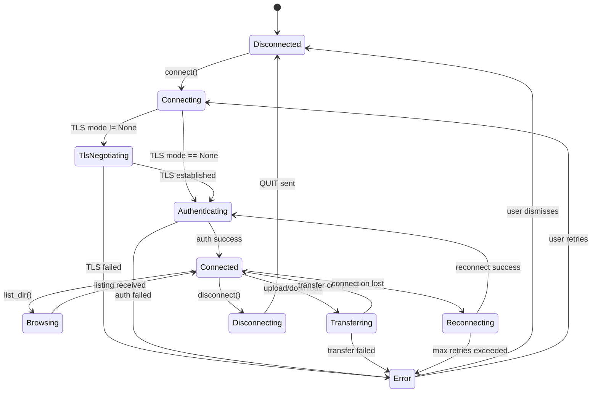
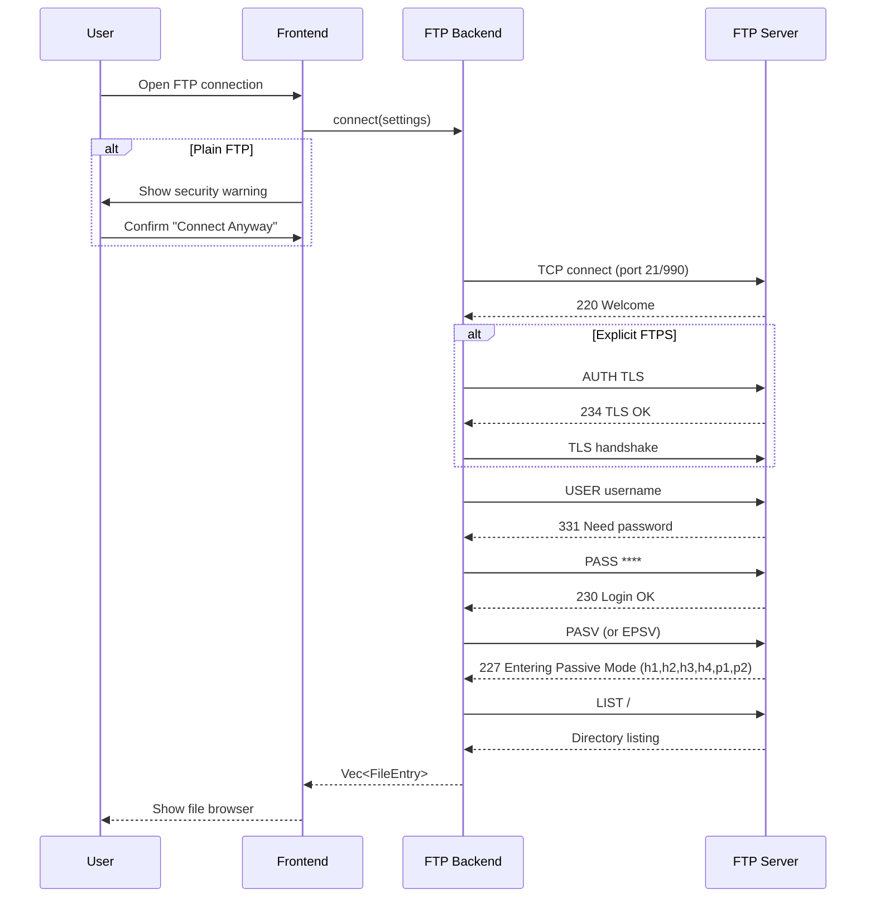
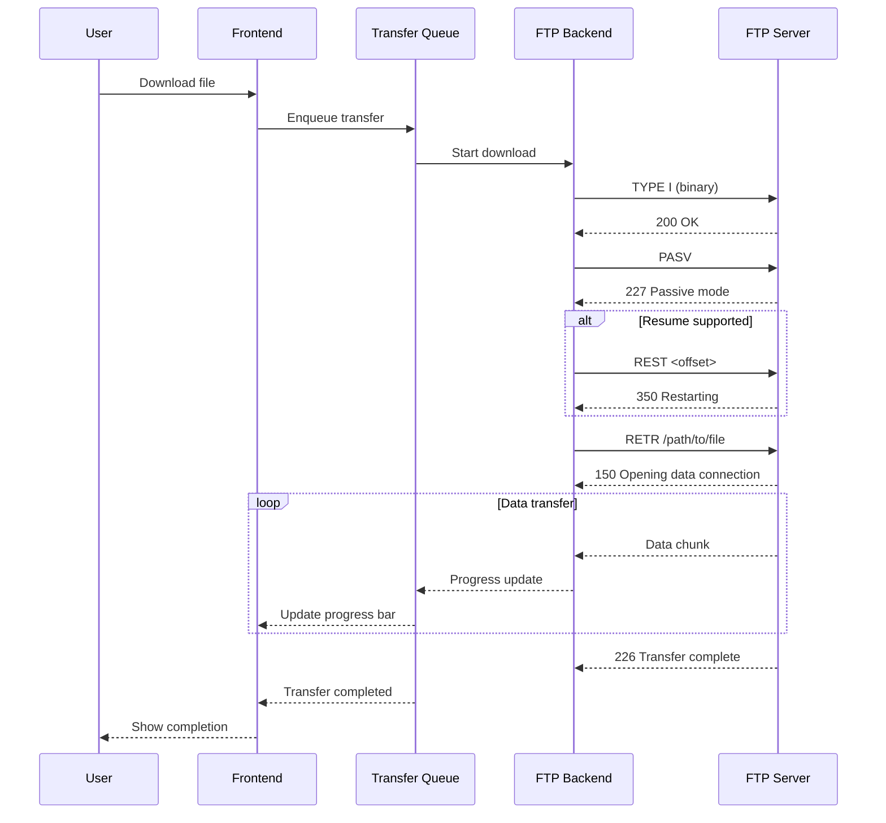
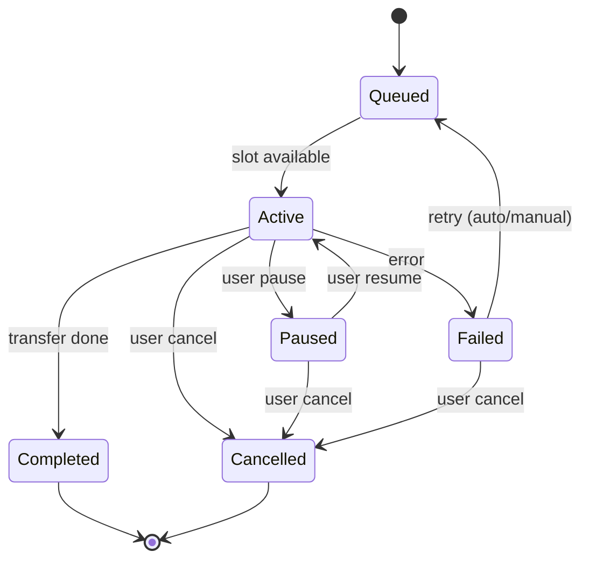
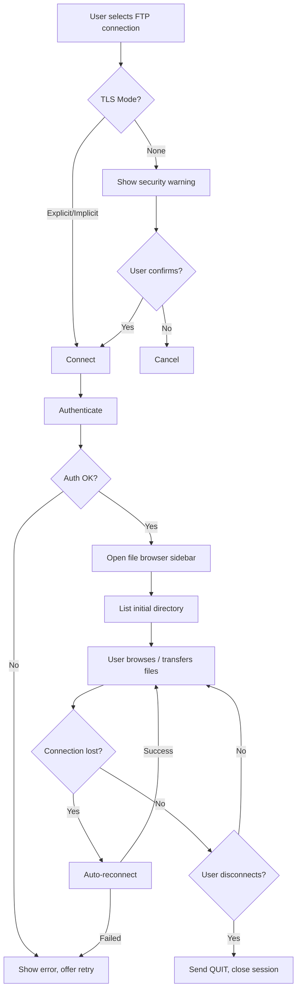
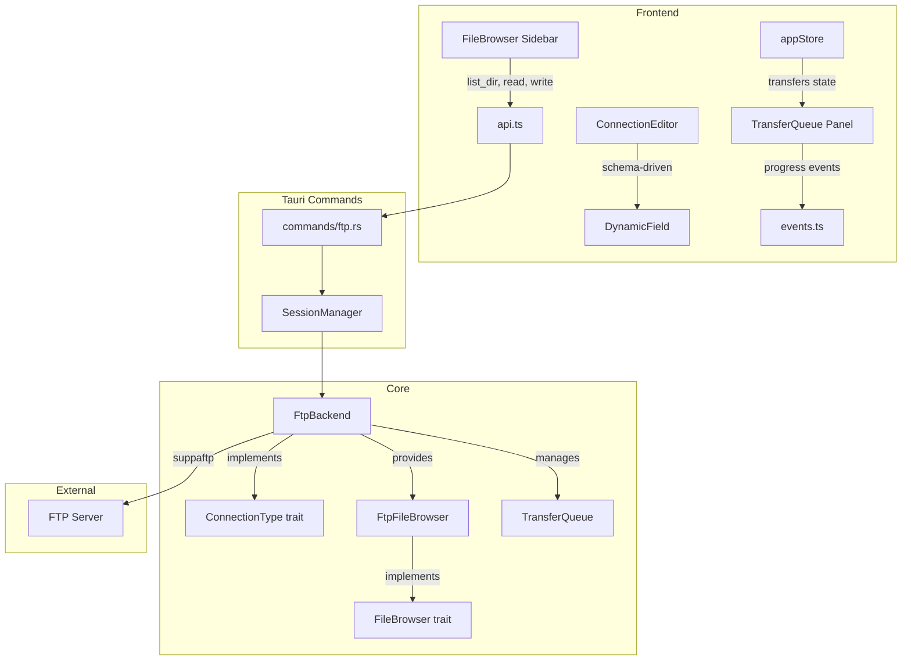
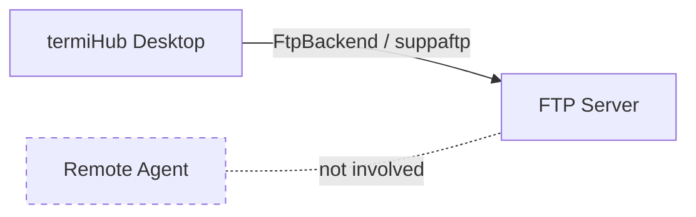

# FTP Client — Behavior

Behavior diagrams for the [ftp-client concept](concept.md). State machines, sequences, and flows
live here; visual layout lives in [`mockups/`](mockups/).

---

## Connection State Machine

## Connection Sequence

## File Transfer Sequence

## Transfer Queue State Machine

## FTP Session Lifecycle (Frontend)

## Integration Overview

## Agent Support

FTP connections are **desktop-only** in the initial implementation. The remote agent does not need
FTP support because:

- FTP is a direct client-to-server protocol (no SSH tunneling involved)
- The desktop app connects directly to FTP servers
- Agent-side FTP could be added later if there's demand for FTP access through SSH jump hosts

