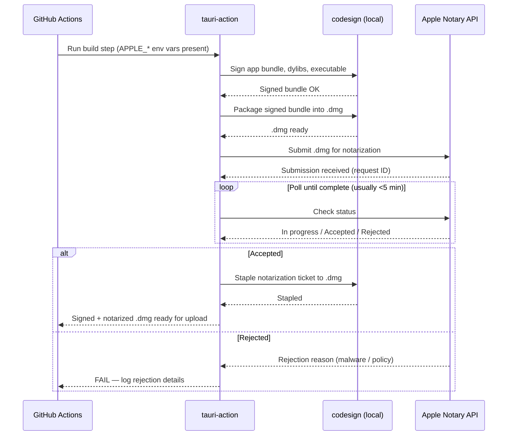
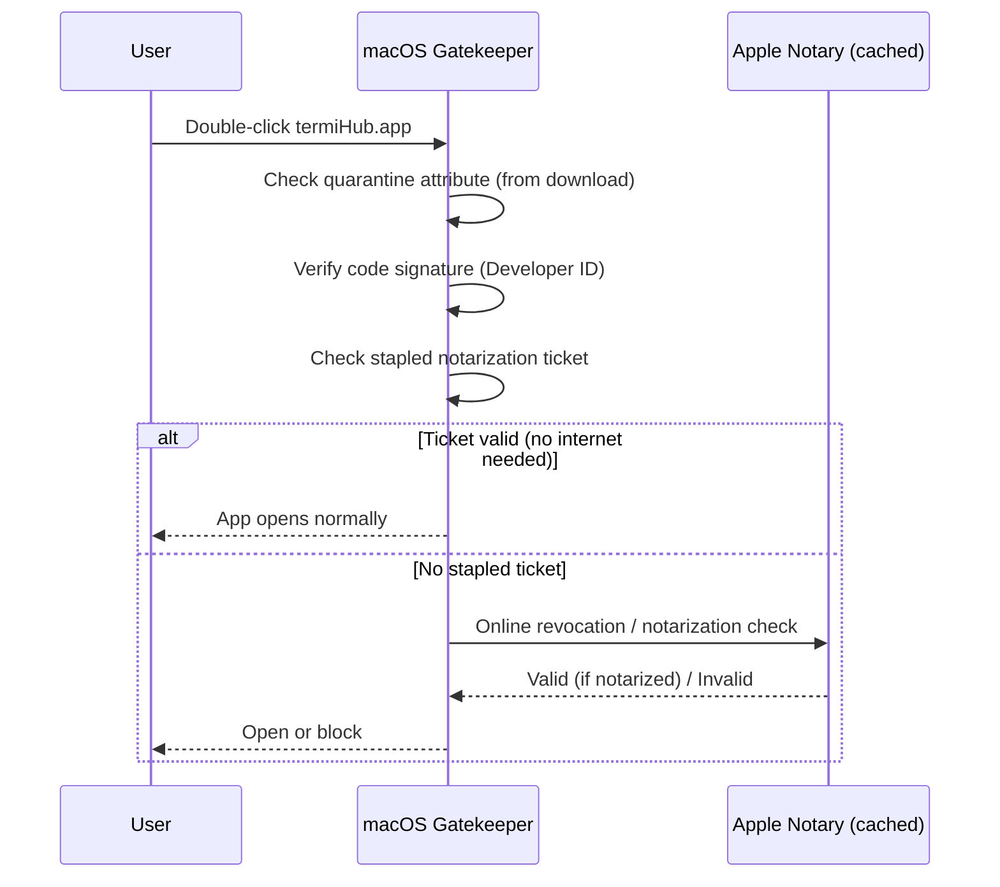
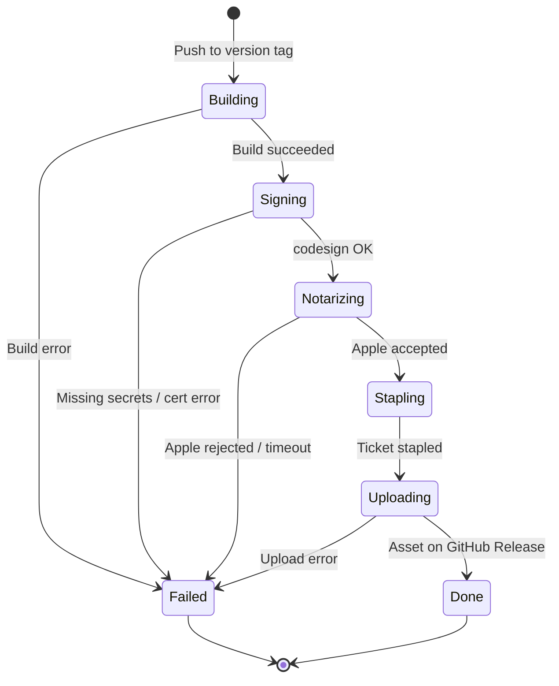

# macOS Code Signing and Notarization in CI

> GitHub Issue: #688

---

## Overview

macOS builds produced by the current CI pipeline are unsigned. When a user downloads the `.dmg`
from a GitHub release and tries to open it, macOS Gatekeeper rejects it with a security warning:

> "termiHub.app cannot be opened because Apple cannot check it for malicious software."

(On older macOS versions the wording is _"cannot be opened because it is from an unidentified
developer"_; on some systems a corrupted-signature variant reads _"is damaged and can't be
opened"_ — all are the same underlying Gatekeeper block.)

This happens because Apple requires all distributed apps to be:

1. **Code-signed** with a "Developer ID Application" certificate — proves the binary comes from an
   identified developer and has not been tampered with.
2. **Notarized** — Apple's cloud service scans the signed binary for malware and staples a ticket
   to it, which Gatekeeper verifies at launch without contacting Apple.

Without both steps, Gatekeeper quarantines every download from the internet. The workaround
(`xattr -cr`) requires command-line access and is unreasonable to expect from end users.

### Goals

- All macOS release builds (x64 and ARM64) pass Gatekeeper without any user intervention.
- Signing credentials are stored securely as GitHub Actions secrets and never committed.
- The signing/notarization step is transparent and auditable in CI logs.
- The release workflow fails fast and clearly if credentials are missing or invalid.

### Non-Goals

- Windows code signing (separate Authenticode certificate and workflow — a future concept).
- Linux packaging signing (GPG/APT/RPM — a separate topic).
- In-app auto-update (see
  [In-Field Update Mechanism](../partial/in-field-update-mechanism.md)).
- Hardened runtime entitlements beyond what Tauri requires by default.

---

## UI Interface

This is a CI/DevOps concept with no end-user UI changes. The "interface" is the experience of
two personas: the **maintainer** who configures signing, and the **end user** who downloads the
app.

### Maintainer: One-Time Setup

The maintainer works entirely in the Apple Developer portal and GitHub repository settings. There
is no termiHub UI involved.

```
Apple Developer Portal                 GitHub Repository
─────────────────────────────          ──────────────────────────────────
1. Create "Developer ID Application"   4. Settings → Secrets and variables
   certificate                            → Actions → New secret:
2. Export as .p12 (with password)
                                           APPLE_CERTIFICATE         (base64 .p12)
3. Generate app-specific password          APPLE_CERTIFICATE_PASSWORD
   at appleid.apple.com                    APPLE_SIGNING_IDENTITY
                                           APPLE_ID
                                           APPLE_PASSWORD
                                           APPLE_TEAM_ID
```

### End User: Download Experience (After Fix)

Before this fix, the user sees:

```
┌───────────────────────────────────────────────────────────┐
│  "termiHub.app" cannot be opened because Apple cannot     │
│   check it for malicious software.                        │
│                                              [ OK ]       │
└───────────────────────────────────────────────────────────┘
```

After this fix, the user simply double-clicks the `.dmg`, drags termiHub to Applications, and
opens it — no prompts, no friction.

---

## General Handling

### Certificate Lifecycle

Apple Developer ID certificates are valid for **5 years**. When a certificate is within 90 days
of expiry, Apple sends a renewal warning email to the account holder. Renewal requires generating
a new certificate and updating the GitHub secrets — the workflow itself does not need to change.

A CI job should ideally surface certificate expiry proactively (this can be done by inspecting
the `.p12` with `openssl`), but this is considered a future enhancement.

### What Gets Signed

Tauri bundles the following on macOS. All of them must be signed before notarization:

| Artifact                             | Description                      |
| ------------------------------------ | -------------------------------- |
| `termiHub.app`                       | The main application bundle      |
| All `.dylib` files inside the bundle | Shared libraries                 |
| The main executable                  | `Contents/MacOS/termiHub`        |
| Embedded helper tools                | Any helper binaries Tauri embeds |

`tauri-apps/tauri-action` handles this automatically when the Apple credentials are present as
environment variables — it calls `codesign` on each artifact in the correct order and then
submits the bundle to Apple's notarization API via `notarytool`.

### Notarization Timing

Notarization typically completes in 30 seconds to 5 minutes. `tauri-action` uses `notarytool
wait` (or `xcrun notarytool wait`) to block until Apple responds, then staples the ticket before
packaging the `.dmg`. If notarization times out or is rejected, the CI step fails and no artifact
is uploaded.

### Dev/PR Builds

PR builds (in `build.yml`) do not need to be notarized — they are internal artifacts used to
validate the build, not distributed to end users. Signing can be skipped entirely for those
builds by simply not passing the Apple credentials. The unsigned artifacts are fine for CI
validation and are retained for only 7 days.

If it becomes useful to smoke-test PR builds on macOS without the Gatekeeper error, an
alternative is to sign (but not notarize) PR builds using the same certificate — this removes
the "damaged" message for direct testers while avoiding the slower notarization wait.

### Secret Rotation

If credentials are compromised or expired:

1. Revoke the certificate in the Apple Developer portal.
2. Generate a new certificate and app-specific password.
3. Update the GitHub secrets.
4. Re-run the release workflow (no code change needed).

---

## States & Sequences

### Notarization Flow in CI



### Gatekeeper Check at User Launch



### CI Job State Machine



---

## Preliminary Implementation Details

> Note: this section reflects the codebase at the time of concept creation (May 2026). The
> workflows and config may evolve before implementation.

### 1. GitHub Secrets Required

The following secrets must be added to the GitHub repository (Settings → Secrets and variables →
Actions):

| Secret name                  | Content                                                                      |
| ---------------------------- | ---------------------------------------------------------------------------- |
| `APPLE_CERTIFICATE`          | Base64-encoded `.p12` file: `base64 -i cert.p12`                             |
| `APPLE_CERTIFICATE_PASSWORD` | Password set when exporting the `.p12`                                       |
| `APPLE_SIGNING_IDENTITY`     | Full identity string, e.g. `Developer ID Application: Jane Doe (AB12CD34EF)` |
| `APPLE_ID`                   | Apple ID email (account holder)                                              |
| `APPLE_PASSWORD`             | App-specific password from appleid.apple.com                                 |
| `APPLE_TEAM_ID`              | 10-character Team ID from the Developer portal                               |

### 2. Release Workflow Changes (`release.yml`)

In the `build-and-upload` job, the `Build Tauri app for release` step needs the Apple secrets
added to the `env` block. Only macOS matrix entries will use them (Tauri silently skips signing
on Linux/Windows if the vars are absent):

```yaml
- name: Build Tauri app for release
  uses: tauri-apps/tauri-action@v0
  env:
    GITHUB_TOKEN: ${{ secrets.GITHUB_TOKEN }}
    APPLE_CERTIFICATE: ${{ secrets.APPLE_CERTIFICATE }}
    APPLE_CERTIFICATE_PASSWORD: ${{ secrets.APPLE_CERTIFICATE_PASSWORD }}
    APPLE_SIGNING_IDENTITY: ${{ secrets.APPLE_SIGNING_IDENTITY }}
    APPLE_ID: ${{ secrets.APPLE_ID }}
    APPLE_PASSWORD: ${{ secrets.APPLE_PASSWORD }}
    APPLE_TEAM_ID: ${{ secrets.APPLE_TEAM_ID }}
  with:
    tagName: ""
    releaseName: ""
    releaseBody: ""
    releaseDraft: false
    prerelease: false
    args: --target ${{ matrix.rust_target }} ${{ matrix.extra_args }}
```

### 3. `tauri.conf.json` macOS Bundle Config

Tauri needs the signing identity declared in `src-tauri/tauri.conf.json` under the macOS section.
The identity value can be the environment variable reference or a placeholder that `tauri-action`
overrides at build time:

```json
{
  "bundle": {
    "macOS": {
      "signingIdentity": null,
      "providerShortName": null,
      "entitlements": null
    }
  }
}
```

`tauri-apps/tauri-action` sets `signingIdentity` from `APPLE_SIGNING_IDENTITY` automatically
when the env var is present. Verify this behaviour against the `tauri-action` version in use.

### 4. Hardened Runtime

Apple requires the hardened runtime for notarization. Tauri enables it by default for release
builds. If any entitlements are needed (e.g., for serial port access via IOKit), they must be
declared in an `.entitlements` plist referenced from `tauri.conf.json`. Start without a custom
entitlements file and add only what notarization rejection logs require.

### 5. Dev Builds (`build.yml`)

No changes required for now — PR builds remain unsigned. If testers report friction, consider
adding signing (without notarization) to the macOS matrix entries by passing only
`APPLE_CERTIFICATE`, `APPLE_CERTIFICATE_PASSWORD`, and `APPLE_SIGNING_IDENTITY` (omitting the
notarization credentials `APPLE_ID`, `APPLE_PASSWORD`, `APPLE_TEAM_ID`).

### 6. Verification After Implementation

After merging, verify on a fresh macOS machine:

1. Download the `.dmg` from the GitHub release (do not copy from an existing machine).
2. Mount the `.dmg` and drag the app to Applications.
3. Open the app — no Gatekeeper prompt should appear.
4. Run `codesign --verify --verbose=4 /Applications/termiHub.app` — should report "valid on
   disk" and "satisfies its Designated Requirement".
5. Run `spctl --assess --verbose /Applications/termiHub.app` — should report "accepted".

These steps should be added to `docs/testing.md` under a "macOS Release Distribution" section.
