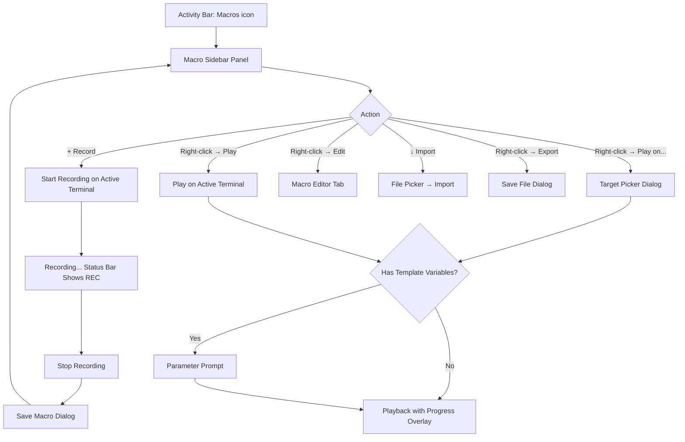
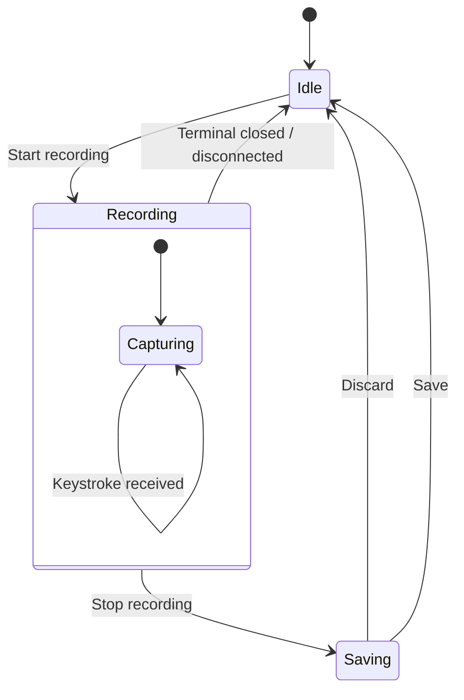
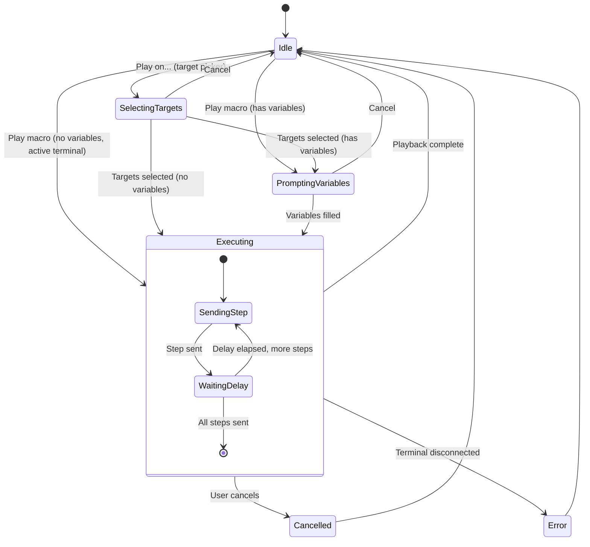
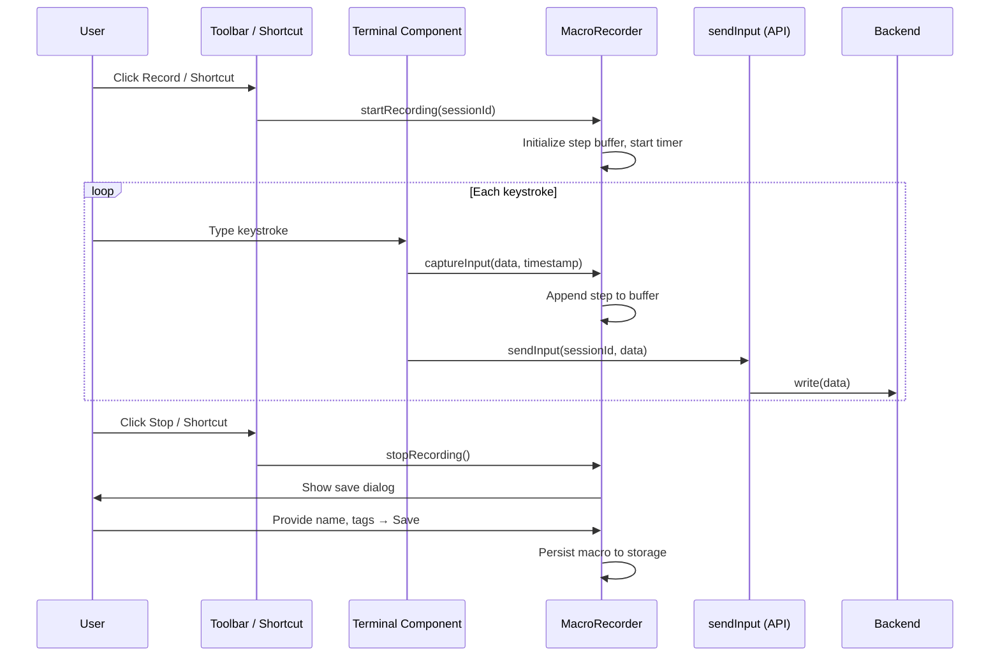
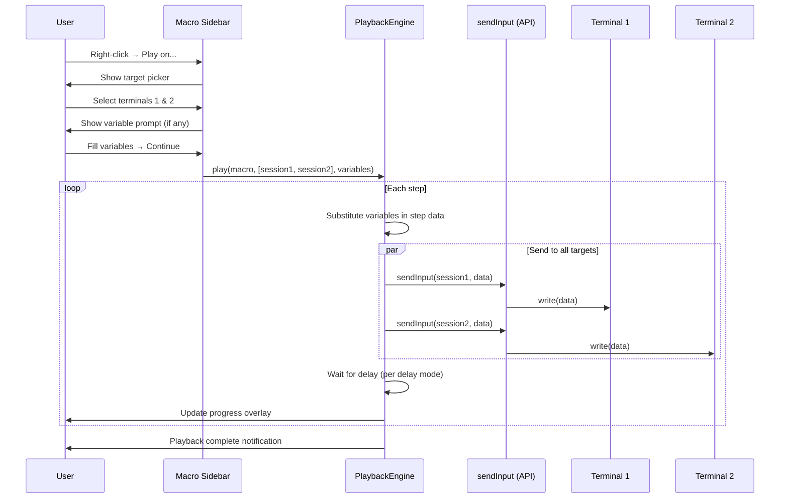
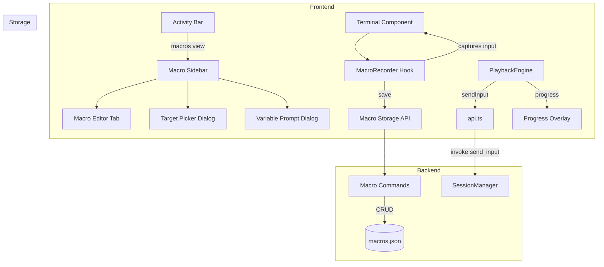
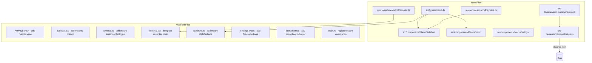

# Macro Recording and Playback

> GitHub Issue: [#517](https://github.com/armaxri/termiHub/issues/517)

---

## Overview

Add the ability to record terminal input as macros and replay them on one or more terminal sessions. Users can automate repetitive command sequences such as server setup, configuration, and maintenance workflows.

### Goals

- Record all keystrokes (including special keys, control sequences, and timing) from a terminal session
- Persist macros in a searchable, taggable macro library
- Play back macros on a single terminal or broadcast to multiple terminals simultaneously
- Support parameterized macros with template variables prompted at playback time
- Provide a macro manager UI for browsing, editing, organizing, importing, and exporting macros
- Offer safety features: preview before playback, cancel during execution

### Non-Goals

- Output-dependent macros (conditional logic based on terminal output) — this is scripting, not macro recording
- Full scripting language or control flow (loops, conditionals) within macros
- Recording mouse events (only keyboard input)

---

## UI Interface

### Recording Controls

Recording is initiated from three entry points:

1. **Toolbar button** — A record icon (circle) appears in the terminal tab's toolbar area. While recording, it pulses red and shows elapsed time.
2. **Keyboard shortcut** — A configurable shortcut (default: `Ctrl+Shift+M` / `Cmd+Shift+M`) toggles recording on/off.
3. **Status bar indicator** — While recording, a red "REC" badge appears in the status bar with the active session name.

```
┌─────────────────────────────────────────────────────┐
│ ● REC 00:42  │  server-01 (SSH)           │  ×  │   │  ← Tab bar with recording indicator
├─────────────────────────────────────────────────────┤
│                                                     │
│  $ apt update                                       │
│  $ apt install -y nginx                             │
│  $ systemctl enable nginx                           │
│  $ _                                                │
│                                                     │
├─────────────────────────────────────────────────────┤
│  ● REC  server-01  00:42                            │  ← Status bar
└─────────────────────────────────────────────────────┘
```

When recording stops, a save dialog appears:

```
┌──────────────────────────────────────────┐
│  Save Macro                              │
├──────────────────────────────────────────┤
│  Name:        [Install Nginx           ] │
│  Description: [Setup nginx on Ubuntu   ] │
│  Tags:        [nginx, setup, ubuntu    ] │
│                                          │
│  Steps recorded: 4                       │
│  Duration: 00:42                         │
│                                          │
│           [Discard]  [Save]              │
└──────────────────────────────────────────┘
```

### Macro Sidebar Panel

A new sidebar panel accessible from the Activity Bar (icon: `Play` or `ListVideo`):

```
┌──────────────────────────┐
│ MACROS                   │
├──────────────────────────┤
│ 🔍 [Search macros...   ] │
├──────────────────────────┤
│ ▸ Server Setup           │  ← Folder (user-created group)
│   ├ Install Nginx        │
│   ├ Setup Firewall       │
│   └ Configure SSL        │
│ ▸ Maintenance            │
│   ├ Log Rotation         │
│   └ Disk Cleanup         │
│ ─ Ungrouped ──────────── │
│   Quick SSH Key Copy     │
│                          │
├──────────────────────────┤
│ [+ Record] [↓ Import]   │
└──────────────────────────┘
```

**Context menu (right-click on macro):**

| Action         | Description                         |
| -------------- | ----------------------------------- |
| Play           | Execute on the active terminal      |
| Play on...     | Open target terminal picker dialog  |
| Edit           | Open macro in the macro editor tab  |
| Duplicate      | Create a copy with " (copy)" suffix |
| Move to folder | Move to an existing or new folder   |
| Export         | Save as `.termihub-macro` JSON file |
| Delete         | Delete with confirmation dialog     |

**Context menu (right-click on folder):**

| Action     | Description                                 |
| ---------- | ------------------------------------------- |
| Rename     | Inline rename                               |
| Delete     | Delete folder (moves contents to ungrouped) |
| Export all | Export all macros in folder as a bundle     |

### Macro Editor Tab

Opens as a new tab content type (`"macro-editor"`), similar to the connection editor or settings tab:

```
┌──────────────────────────────────────────────────────────────────┐
│  Edit Macro: Install Nginx                                       │
├──────────────────────────────────────────────────────────────────┤
│  Name:        [Install Nginx                                   ] │
│  Description: [Setup nginx on Ubuntu servers                   ] │
│  Tags:        [nginx] [setup] [ubuntu] [+]                      │
│                                                                  │
│  Delay Mode:  (●) Real-time delays  ( ) Fixed delay  ( ) None   │
│  Fixed delay: [100] ms                                           │
│                                                                  │
│  ┌─ Steps ────────────────────────────────────────────────────┐  │
│  │ #  │ Type     │ Content                    │ Delay   │  ×  │  │
│  ├────┼──────────┼────────────────────────────┼─────────┼─────┤  │
│  │ 1  │ Text     │ apt update                 │ —       │  ×  │  │
│  │ 2  │ Key      │ Enter                      │ 1200ms  │  ×  │  │
│  │ 3  │ Text     │ apt install -y nginx       │ —       │  ×  │  │
│  │ 4  │ Key      │ Enter                      │ 850ms   │  ×  │  │
│  │ 5  │ Text     │ systemctl enable nginx     │ —       │  ×  │  │
│  │ 6  │ Key      │ Enter                      │ 500ms   │  ×  │  │
│  ├────┴──────────┴────────────────────────────┴─────────┴─────┤  │
│  │ [+ Add Step]  [▲ Move Up]  [▼ Move Down]                  │  │
│  └────────────────────────────────────────────────────────────┘  │
│                                                                  │
│  Template Variables:                                             │
│  ┌────────────────────────────────────────────────────────────┐  │
│  │  Name           │ Default Value  │ Description             │  │
│  ├─────────────────┼────────────────┼─────────────────────────┤  │
│  │  {{package}}    │ nginx          │ Package to install      │  │
│  │  [+ Add Variable]                                         │  │
│  └────────────────────────────────────────────────────────────┘  │
│                                                                  │
│                                    [Cancel]  [Save]              │
└──────────────────────────────────────────────────────────────────┘
```

### Playback Target Picker

When choosing "Play on..." from the context menu, a dialog lists all open terminal sessions:

```
┌──────────────────────────────────────────┐
│  Play Macro: Install Nginx               │
├──────────────────────────────────────────┤
│  Select target terminals:                │
│                                          │
│  ☑ server-01 (SSH)          Panel 1      │
│  ☑ server-02 (SSH)          Panel 1      │
│  ☐ local-shell              Panel 2      │
│  ☐ server-03 (SSH)          Panel 2      │
│                                          │
│  [Select All]  [Select None]             │
│                                          │
│           [Cancel]  [Play]               │
└──────────────────────────────────────────┘
```

If the macro contains template variables, a parameter prompt appears before playback:

```
┌──────────────────────────────────────────┐
│  Macro Parameters                        │
├──────────────────────────────────────────┤
│                                          │
│  {{package}}:  [nginx              ]     │
│    Package to install                    │
│                                          │
│           [Cancel]  [Continue]           │
└──────────────────────────────────────────┘
```

### Playback Progress Overlay

During playback, a small floating overlay appears on each target terminal:

```
┌──────────────────────────────┐
│  ▶ Playing: Install Nginx    │
│  Step 3/6  ████████░░ 50%   │
│                    [Cancel]  │
└──────────────────────────────┘
```

### Macro Manager Flow Diagram



---

## General Handling

### Recording Workflow

1. User activates recording via toolbar button, keyboard shortcut, or sidebar "Record" button.
2. The active terminal session is identified. If no terminal is active, show a notification: "No active terminal — open a terminal session first."
3. A recording indicator appears in the tab bar and status bar.
4. All input sent via `xterm.onData` is intercepted and captured with:
   - The raw data string (UTF-8 encoded keystrokes)
   - A timestamp (milliseconds since recording started)
5. Recording stops when the user clicks the record button again, uses the keyboard shortcut, or closes the terminal.
6. The save dialog appears. User provides name, description, and tags.
7. If the user discards, no macro is saved. If saved, the macro is persisted and appears in the sidebar.

### Playback Workflow

1. User selects a macro and chooses a playback target (active terminal or multi-select via picker).
2. If the macro has template variables (`{{variableName}}`), a parameter prompt is shown. Variables have default values and descriptions.
3. Template variables are substituted in all text steps.
4. Playback begins: each step's data is sent to the target terminal(s) via `sendInput`. Delays are applied according to the selected delay mode:
   - **Real-time**: use the recorded inter-step delay
   - **Fixed delay**: use a configurable fixed delay between steps (default: 100ms)
   - **No delay**: send all steps as fast as possible (with a minimal 10ms gap to avoid overwhelming the terminal)
5. A progress overlay shows the current step. The user can cancel at any time.
6. On cancel, playback stops immediately. Already-sent input cannot be undone — the overlay shows "Playback cancelled at step N/M."
7. For multi-terminal playback, input is sent to all targets in parallel (same step dispatched to all sessions before moving to the next step).

### Step Types

| Step Type | Data Captured                   | Example                  |
| --------- | ------------------------------- | ------------------------ |
| Text      | Printable character sequence    | `apt update`             |
| Key       | Special key or control sequence | `Enter`, `Tab`, `Ctrl+C` |
| Paste     | Bracketed paste content         | (large text block)       |

Consecutive printable characters are coalesced into a single "Text" step for readability in the editor. Special keys and control sequences are individual "Key" steps.

### Editing Macros

- Steps can be reordered (drag-and-drop or move up/down buttons).
- Individual steps can be deleted.
- Step content can be edited inline (text steps: edit the string; key steps: select from a dropdown of special keys).
- Delays can be manually adjusted per step.
- New steps can be inserted at any position.
- Template variables are detected by scanning for `{{...}}` patterns in text steps. The variables table auto-populates from these patterns.

### Import/Export Format

Macros are exported as `.termihub-macro` files (JSON):

```json
{
  "version": 1,
  "name": "Install Nginx",
  "description": "Setup nginx on Ubuntu servers",
  "tags": ["nginx", "setup"],
  "delayMode": "realtime",
  "fixedDelayMs": 100,
  "variables": [
    {
      "name": "package",
      "defaultValue": "nginx",
      "description": "Package to install"
    }
  ],
  "steps": [
    { "type": "text", "data": "apt update", "delayMs": 0 },
    { "type": "key", "data": "\r", "label": "Enter", "delayMs": 1200 },
    { "type": "text", "data": "apt install -y {{package}}", "delayMs": 0 },
    { "type": "key", "data": "\r", "label": "Enter", "delayMs": 850 }
  ]
}
```

Folder export bundles multiple macros into a single `.termihub-macros` file (JSON array).

### Macro Storage Organization

Macros are organized in folders similar to the connection list:

- Folders are user-created groups with a name and sort order.
- Macros can be moved between folders or left ungrouped.
- Drag-and-drop reordering within and across folders.
- Folders and macros are stored in a single `macros.json` file.

### Edge Cases

| Scenario                                | Handling                                                    |
| --------------------------------------- | ----------------------------------------------------------- |
| Terminal disconnects during recording   | Stop recording, prompt to save partial macro                |
| Terminal disconnects during playback    | Stop playback, show error notification                      |
| Playback target terminal is busy        | No check — input is sent regardless (user's responsibility) |
| Empty macro (no steps recorded)         | Show warning in save dialog, allow saving anyway            |
| Duplicate macro name                    | Allowed — macros are identified by UUID, not name           |
| Import macro with same UUID as existing | Prompt: overwrite, keep both, or cancel                     |
| Very long macro (>1000 steps)           | Warn in editor, no hard limit                               |
| Template variable in key step           | Not supported — template variables only in text steps       |

---

## States & Sequences

### Recording State Machine



### Playback State Machine



### Recording Sequence



### Playback Sequence



### Integration Overview



---

## Preliminary Implementation Details

### New TypeScript Types

```typescript
// src/types/macro.ts

/** Unique identifier for a macro */
type MacroId = string;

/** Unique identifier for a macro folder */
type MacroFolderId = string;

/** Type of a recorded step */
type MacroStepType = "text" | "key" | "paste";

/** Delay mode for playback */
type MacroDelayMode = "realtime" | "fixed" | "none";

/** A single recorded step */
interface MacroStep {
  type: MacroStepType;
  /** Raw data string (UTF-8 keystrokes) */
  data: string;
  /** Human-readable label for key steps (e.g., "Enter", "Tab") */
  label?: string;
  /** Delay in ms before this step (from recording) */
  delayMs: number;
}

/** A template variable */
interface MacroVariable {
  name: string;
  defaultValue: string;
  description: string;
}

/** A saved macro */
interface Macro {
  id: MacroId;
  name: string;
  description: string;
  tags: string[];
  folderId?: MacroFolderId;
  delayMode: MacroDelayMode;
  fixedDelayMs: number;
  variables: MacroVariable[];
  steps: MacroStep[];
  createdAt: string;
  updatedAt: string;
}

/** A macro folder */
interface MacroFolder {
  id: MacroFolderId;
  name: string;
  sortOrder: number;
}

/** Top-level macro storage structure */
interface MacroStorage {
  macros: Macro[];
  folders: MacroFolder[];
}

/** Recording state tracked in the frontend */
type RecordingState =
  | { status: "idle" }
  | { status: "recording"; sessionId: string; startTime: number; steps: MacroStep[] }
  | { status: "saving"; steps: MacroStep[] };

/** Playback state tracked in the frontend */
type PlaybackState =
  | { status: "idle" }
  | {
      status: "executing";
      macroId: MacroId;
      targetSessionIds: string[];
      currentStep: number;
      totalSteps: number;
    };
```

### New Rust Data Structures

```rust
// src-tauri/src/macros/storage.rs

use serde::{Deserialize, Serialize};

#[derive(Debug, Clone, Serialize, Deserialize)]
pub struct MacroStep {
    #[serde(rename = "type")]
    pub step_type: String,
    pub data: String,
    #[serde(skip_serializing_if = "Option::is_none")]
    pub label: Option<String>,
    #[serde(rename = "delayMs")]
    pub delay_ms: u64,
}

#[derive(Debug, Clone, Serialize, Deserialize)]
pub struct MacroVariable {
    pub name: String,
    #[serde(rename = "defaultValue")]
    pub default_value: String,
    pub description: String,
}

#[derive(Debug, Clone, Serialize, Deserialize)]
pub struct Macro {
    pub id: String,
    pub name: String,
    pub description: String,
    pub tags: Vec<String>,
    #[serde(rename = "folderId", skip_serializing_if = "Option::is_none")]
    pub folder_id: Option<String>,
    #[serde(rename = "delayMode")]
    pub delay_mode: String,
    #[serde(rename = "fixedDelayMs")]
    pub fixed_delay_ms: u64,
    pub variables: Vec<MacroVariable>,
    pub steps: Vec<MacroStep>,
    #[serde(rename = "createdAt")]
    pub created_at: String,
    #[serde(rename = "updatedAt")]
    pub updated_at: String,
}

#[derive(Debug, Clone, Serialize, Deserialize)]
pub struct MacroFolder {
    pub id: String,
    pub name: String,
    #[serde(rename = "sortOrder")]
    pub sort_order: i32,
}

#[derive(Debug, Clone, Serialize, Deserialize)]
pub struct MacroStorage {
    pub macros: Vec<Macro>,
    pub folders: Vec<MacroFolder>,
}
```

### Storage

| File          | Location             | Content                |
| ------------- | -------------------- | ---------------------- |
| `macros.json` | Tauri app config dir | All macros and folders |

Follows the same persistence pattern as `connections.json` — JSON file with `.bak` backup, recovery on corruption.

### New Tauri IPC Commands

```rust
// src-tauri/src/commands/macros.rs

#[tauri::command]
pub async fn get_macros(app: AppHandle) -> Result<MacroStorage, TerminalError>;

#[tauri::command]
pub async fn save_macro(app: AppHandle, macro_data: Macro) -> Result<(), TerminalError>;

#[tauri::command]
pub async fn delete_macro(app: AppHandle, macro_id: String) -> Result<(), TerminalError>;

#[tauri::command]
pub async fn save_macro_folder(app: AppHandle, folder: MacroFolder) -> Result<(), TerminalError>;

#[tauri::command]
pub async fn delete_macro_folder(app: AppHandle, folder_id: String) -> Result<(), TerminalError>;

#[tauri::command]
pub async fn export_macro(app: AppHandle, macro_id: String, path: String) -> Result<(), TerminalError>;

#[tauri::command]
pub async fn import_macro(app: AppHandle, path: String) -> Result<Macro, TerminalError>;

#[tauri::command]
pub async fn reorder_macros(app: AppHandle, macro_ids: Vec<String>) -> Result<(), TerminalError>;
```

### Frontend Store Changes

```typescript
// Additions to src/store/appStore.ts (AppState interface)

interface AppState {
  // ... existing fields ...

  /** All macros and folders */
  macros: Macro[];
  macroFolders: MacroFolder[];

  /** Current recording state */
  recordingState: RecordingState;

  /** Current playback state */
  playbackState: PlaybackState;

  /** Macro CRUD actions */
  loadMacros: () => Promise<void>;
  saveMacro: (macro: Macro) => Promise<void>;
  deleteMacro: (macroId: MacroId) => Promise<void>;
  saveMacroFolder: (folder: MacroFolder) => Promise<void>;
  deleteMacroFolder: (folderId: MacroFolderId) => Promise<void>;

  /** Recording actions */
  startRecording: (sessionId: string) => void;
  stopRecording: () => MacroStep[];
  captureInput: (data: string) => void;

  /** Playback actions */
  startPlayback: (macroId: MacroId, targetSessionIds: string[]) => void;
  cancelPlayback: () => void;
  updatePlaybackProgress: (currentStep: number) => void;
}
```

### New UI Components

| Component              | Path                                                   | Purpose                                            |
| ---------------------- | ------------------------------------------------------ | -------------------------------------------------- |
| `MacroSidebar`         | `src/components/MacroSidebar/MacroSidebar.tsx`         | Sidebar panel for browsing/searching macros        |
| `MacroItem`            | `src/components/MacroSidebar/MacroItem.tsx`            | Single macro entry with context menu               |
| `MacroFolderItem`      | `src/components/MacroSidebar/MacroFolderItem.tsx`      | Folder entry with expand/collapse and context menu |
| `MacroEditor`          | `src/components/MacroEditor/MacroEditor.tsx`           | Tab content for editing a macro                    |
| `MacroStepEditor`      | `src/components/MacroEditor/MacroStepEditor.tsx`       | Individual step row in the editor                  |
| `MacroVariableEditor`  | `src/components/MacroEditor/MacroVariableEditor.tsx`   | Variable table in the editor                       |
| `MacroSaveDialog`      | `src/components/MacroDialogs/MacroSaveDialog.tsx`      | Dialog shown after stopping recording              |
| `MacroTargetPicker`    | `src/components/MacroDialogs/MacroTargetPicker.tsx`    | Terminal selection dialog for playback             |
| `MacroVariablePrompt`  | `src/components/MacroDialogs/MacroVariablePrompt.tsx`  | Variable input dialog before playback              |
| `MacroPlaybackOverlay` | `src/components/MacroDialogs/MacroPlaybackOverlay.tsx` | Progress overlay during playback                   |
| `RecordingIndicator`   | `src/components/StatusBar/RecordingIndicator.tsx`      | Status bar recording badge                         |

### Sidebar Integration

Add `"macros"` to the `SidebarView` type and wire it into the existing patterns:

- `src/components/ActivityBar/ActivityBar.tsx` — add a new entry to `TOP_ITEMS` with a Lucide icon (e.g., `ListVideo` or `Play`)
- `src/components/Sidebar/Sidebar.tsx` — add a rendering branch for `sidebarView === "macros"` → `<MacroSidebar />`
- `VIEW_TITLES` — add `macros: "Macros"`

### Tab Content Type

Add `"macro-editor"` to the `TabContentType` union in `src/types/terminal.ts` and add a rendering branch in the terminal view that renders `<MacroEditor macroId={...} />` when `tab.contentType === "macro-editor"`.

### Recording Hook

```typescript
// src/hooks/useMacroRecorder.ts

/**
 * Hook that intercepts xterm.onData to capture keystrokes during recording.
 * Wraps the existing onData handler in Terminal.tsx.
 *
 * When recording is active:
 * 1. Captures the raw data string and timestamp
 * 2. Coalesces consecutive printable characters into text steps
 * 3. Identifies special keys (Enter, Tab, Ctrl sequences) as key steps
 * 4. Stores steps in the Zustand store's recordingState
 * 5. Passes data through to sendInput unchanged
 */
```

Integration point: in `Terminal.tsx`, the `xterm.onData` handler (line ~215) is wrapped to call `captureInput(data)` from the store when `recordingState.status === "recording"` and the session matches.

### Playback Engine

```typescript
// src/services/macroPlayback.ts

/**
 * Executes a macro on one or more terminal sessions.
 *
 * 1. Substitutes template variables in all text steps
 * 2. Iterates through steps sequentially
 * 3. For each step, calls sendInput() for all target sessions in parallel
 * 4. Waits for the configured delay before the next step
 * 5. Updates playback progress in the store
 * 6. Respects cancellation via an AbortController
 */
```

Uses `sendInput(sessionId, data)` from `src/services/api.ts` — no new backend pathway is needed. Delays are implemented with `setTimeout` / `Promise`-based sleep. Multi-terminal send calls `sendInput` for each target session concurrently.

### Settings Extension

```typescript
// Addition to AppSettings in src/types/settings.ts

interface MacroSettings {
  /** Default delay mode for new recordings */
  defaultDelayMode: MacroDelayMode;
  /** Default fixed delay in ms */
  defaultFixedDelayMs: number;
  /** Keyboard shortcut for toggling recording */
  recordShortcut: string;
}
```

```rust
// Addition to AppSettings in src-tauri/src/settings.rs

#[derive(Debug, Clone, Serialize, Deserialize)]
pub struct MacroSettings {
    #[serde(rename = "defaultDelayMode", default = "default_delay_mode")]
    pub default_delay_mode: String,
    #[serde(rename = "defaultFixedDelayMs", default = "default_fixed_delay_ms")]
    pub default_fixed_delay_ms: u64,
    #[serde(rename = "recordShortcut", default = "default_record_shortcut")]
    pub record_shortcut: String,
}
```

### Backend Integration Overview


