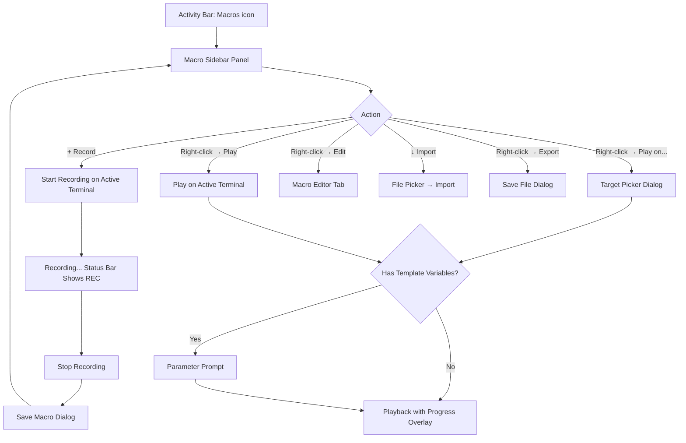
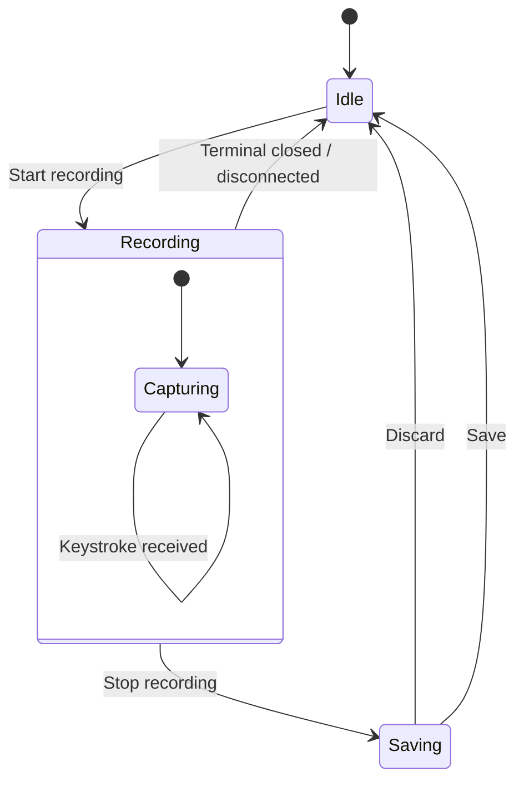
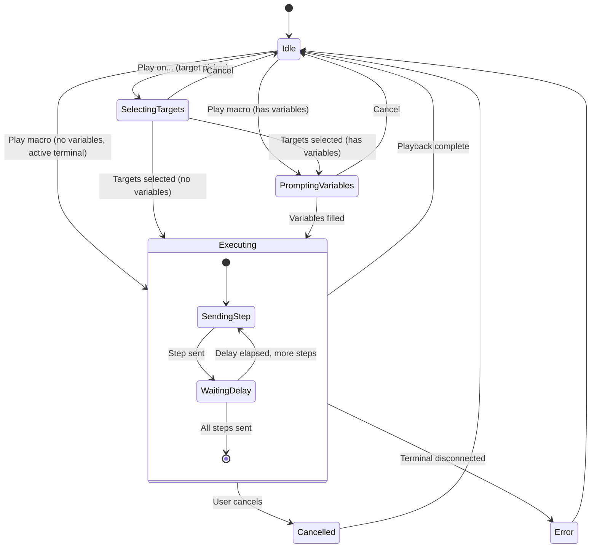
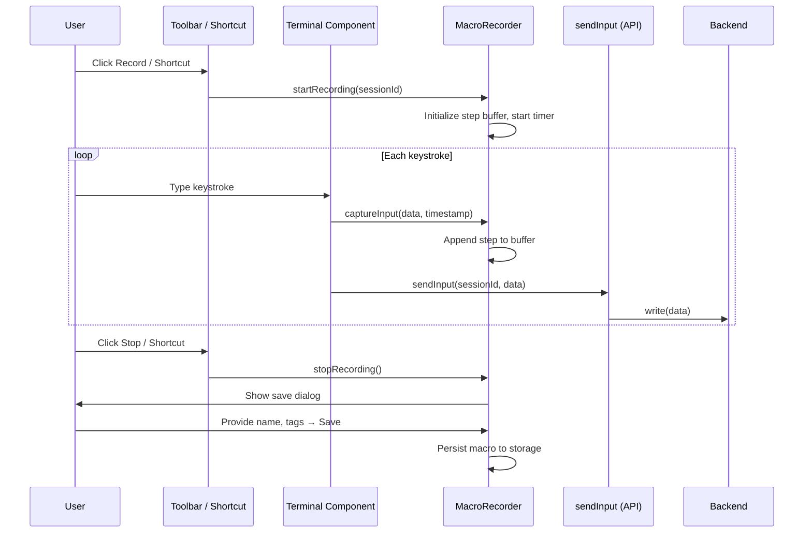
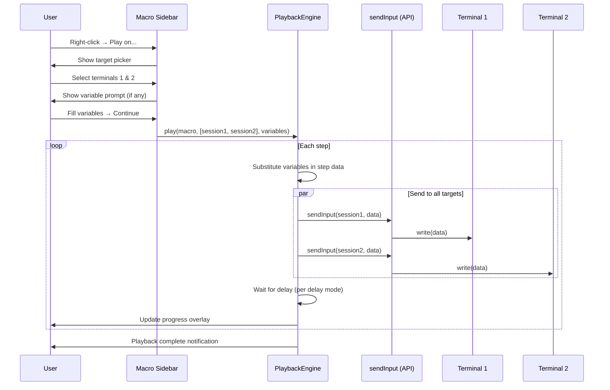
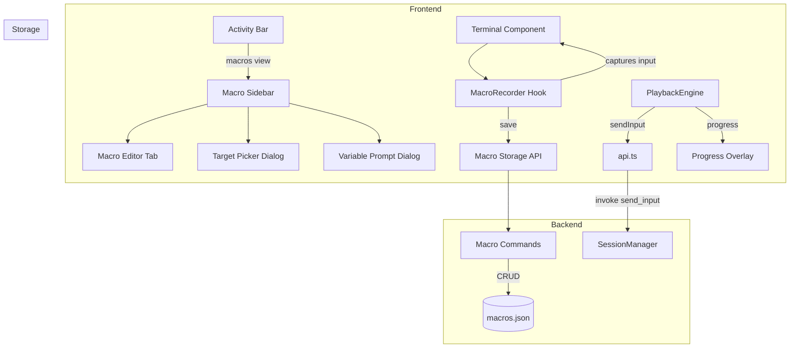
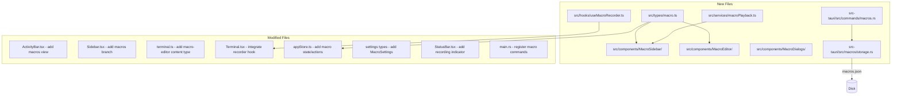

# Macro Recording — Behavior

Behavior diagrams for the [Macro Recording and Playback](concept.md) concept. The prose lives in
[`concept.md`](concept.md); the visual surfaces live in [`mockups/`](mockups/).

---

## Macro Manager Flow

---

## Recording State Machine

---

## Playback State Machine

---

## Recording Sequence

---

## Playback Sequence

---

## Integration Overview

---

## Backend Integration Overview

