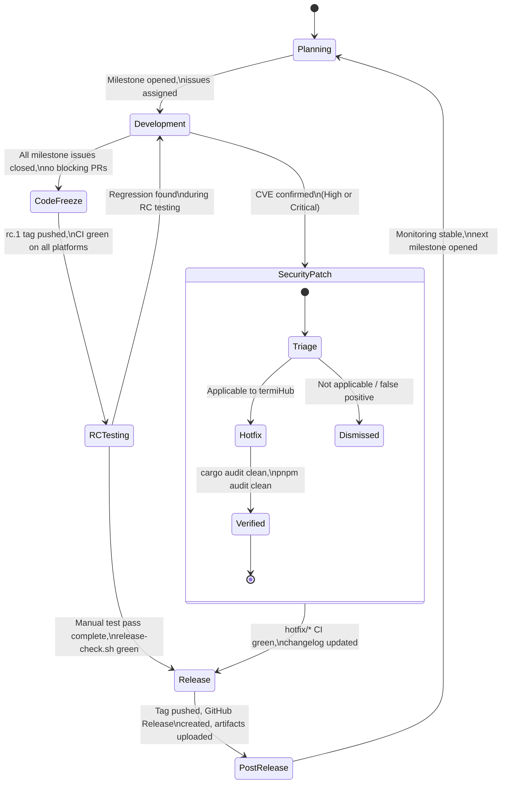
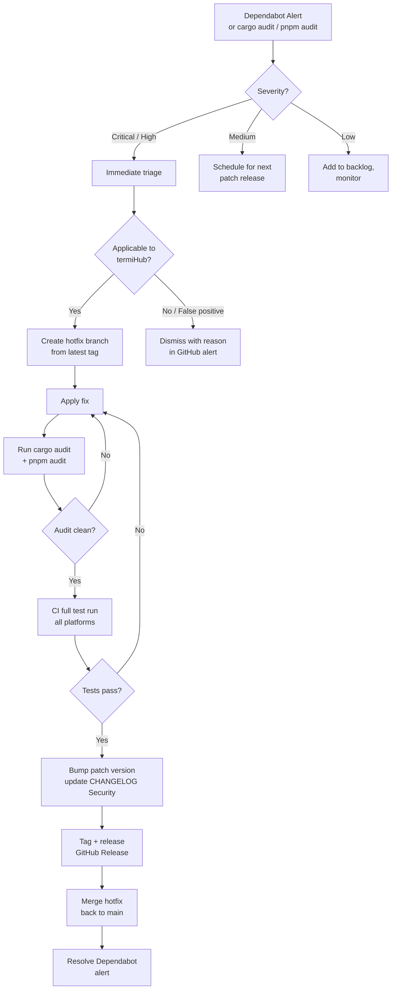
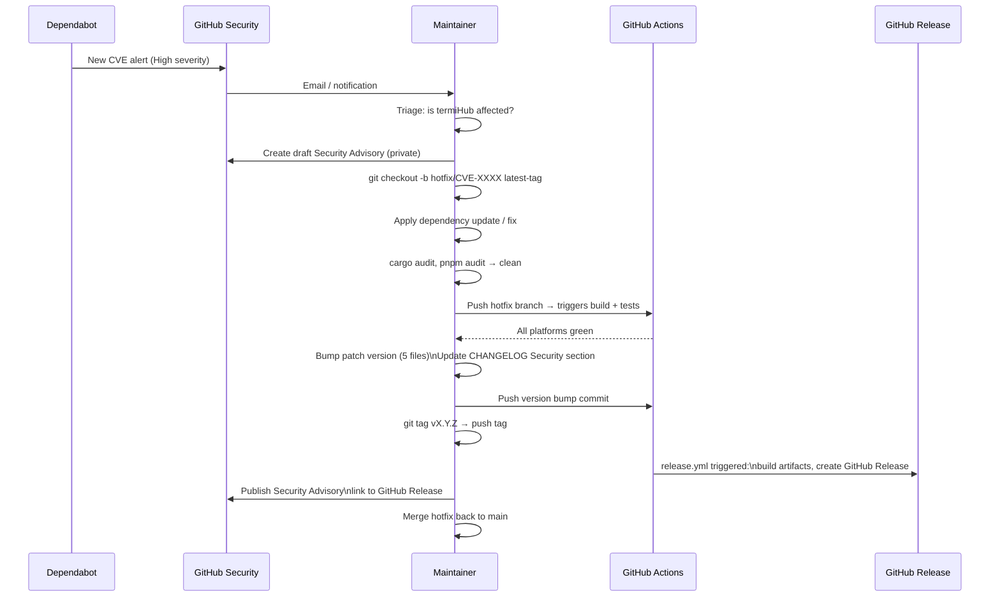
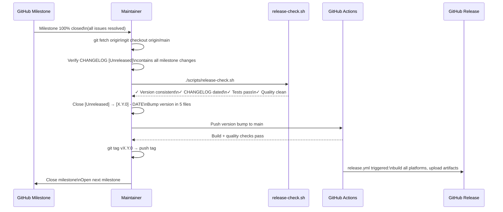

# Release Planning and Dependency Management

---

## Overview

termiHub is a cross-platform desktop application built on a Rust + npm ecosystem — both of which
have active security vulnerability databases (RUSTSEC, npm advisories) and frequent dependency
releases. As the application matures beyond its initial v0.1.0 beta, ad-hoc release timing and
manual dependency updates become a liability: security patches can be delayed, breaking changes
can accumulate unnoticed, and there is no shared understanding among contributors of when and why
a release happens.

This concept defines a structured approach to release cadence, dependency monitoring, and security
response for termiHub's ongoing development lifecycle.

### Goals

- Define clear release types with associated triggers and response time targets
- Automate dependency vulnerability detection using GitHub-native tooling
- Establish a security response workflow that can produce a patch release within 72 hours of a
  confirmed high-severity CVE
- Keep the five version-bearing config files (`package.json`, `tauri.conf.json`,
  `src-tauri/Cargo.toml`, `agent/Cargo.toml`, `core/Cargo.toml`) consistent at all times
- Minimize manual monitoring burden through automation

### Non-Goals

- Automated version bumping or changelog generation (always requires human review)
- In-app update delivery to end users (covered in the separate
  [In-Field Update Mechanism](./in-field-update-mechanism.md) concept)
- Commercial SLA guarantees or enterprise support contracts
- Backporting fixes to older release branches (single main release line only)

---

## Interface: Maintainer Tooling

This concept describes developer and maintainer workflows, not end-user UI. The relevant
interfaces are GitHub-hosted tooling and local scripts.

### GitHub Security Tab

GitHub provides a **Security** tab on every repository with the following features — all free for
public repositories:

```
Repository: armaxri/termiHub
┌─────────────────────────────────────────────────────────────────────┐
│  < > Code  Issues  Pull Requests  Actions  Security  Insights       │
│                                  ─────────                          │
│  Security Overview                                                  │
│  ┌──────────────────────────────────────────────────────────────┐   │
│  │ ✓ Dependabot alerts        3 active (1 critical, 2 medium)  │   │
│  │ ✓ Code scanning            No alerts                        │   │
│  │ ✓ Secret scanning          No secrets detected              │   │
│  │ ✓ Security advisories      Manage private advisories        │   │
│  └──────────────────────────────────────────────────────────────┘   │
└─────────────────────────────────────────────────────────────────────┘
```

**Dependabot Alerts** (requires `dependabot.yml` in `.github/`):

- Monitors `package.json` (npm) and `Cargo.toml` (cargo/crates.io) for known CVEs
- Alerts are triggered by the GitHub Advisory Database and RUSTSEC
- Each alert shows severity, affected package, fix version, and a one-click PR option
- Alerts can be dismissed with a reason (tolerated risk, not applicable, etc.)

**Dependabot Version Updates** (also via `dependabot.yml`):

- Automatically opens PRs to update outdated dependencies on a schedule
- Separate from security alerts — these are regular version bumps
- CI runs against each PR; maintainer reviews and merges

**Security Advisories**:

- Maintainers can draft private security advisories before public disclosure
- Useful for coordinating responsible disclosure of vulnerabilities found in termiHub itself

### GitHub Milestones

Each planned release is tracked as a GitHub Milestone:

```
Milestones
├── v0.2.0  (12 open, 3 closed)   Due: 2026-06-30
├── v0.1.1  ( 2 open, 0 closed)   Due: as needed (security/bugfix)
└── Backlog (no due date)
```

Issues and PRs are assigned to milestones. The milestone completion percentage provides a
at-a-glance view of release readiness. Security patches bypass normal milestones and use a
dedicated `hotfix/*` branch.

### Release Check Script

The existing `scripts/release-check.sh` already validates:

- Version consistency across all 5 config files
- CHANGELOG.md has a dated entry for the current version
- No stale `[Unreleased]` content
- Tests pass, quality checks pass
- Git state is clean on `main` or a `release/*` branch

This script is the final gate before tagging a release.

### CHANGELOG.md Workflow

CHANGELOG follows the [Keep a Changelog](https://keepachangelog.com/en/1.1.0/) format already in
use. The **Security** subsection (already supported) must be used for all security-related fixes:

```markdown
## [0.1.1] - 2026-05-12

### Security

- Update `ssh2` crate to 0.9.5 to address RUSTSEC-2026-0042 (key exchange timing oracle)
```

---

## General Handling

### Release Types and Cadence

| Release Type       | Version Bump             | Trigger                                               | Target Turnaround             |
| ------------------ | ------------------------ | ----------------------------------------------------- | ----------------------------- |
| **Security patch** | `x.y.Z`                  | Confirmed CVE / Dependabot High or Critical alert     | 48–72 hours from confirmation |
| **Bug-fix patch**  | `x.y.Z`                  | Accumulated bug fixes, typically 3–5 issues           | Monthly                       |
| **Minor release**  | `x.Y.0`                  | New features merged to main, milestone complete       | Quarterly                     |
| **Major release**  | `X.0.0`                  | Breaking API/config changes, major architecture shift | As needed                     |
| **Pre-release**    | `x.y.z-beta.N` / `-rc.N` | Major releases requiring external testing             | Before every major            |

**Security patches** bypass the normal milestone and review cycle. A single developer can
prepare and ship a security patch without waiting for other pending work.

**Bug-fix patches** are batched. A patch is cut when enough fixes accumulate or a regression
is significant enough to warrant immediate action. Monthly cadence is a guideline, not a hard
rule.

**Minor releases** align with quarterly milestones. Feature development is gated on the
current milestone. When a milestone closes (all `Ready2Implement` issues resolved), the minor
release is prepared.

### Dependency Update Workflow

Dependabot opens PRs automatically. The review policy by change type:

| Dependabot PR Type        | Review Policy                | Merge Condition                           |
| ------------------------- | ---------------------------- | ----------------------------------------- |
| Security fix (any semver) | Immediate review, prioritize | CI must pass; merge same day              |
| Patch update (`x.y.Z`)    | Light review                 | Auto-merge if CI passes (optional policy) |
| Minor update (`x.Y.0`)    | Standard review              | Maintainer approves; check changelog      |
| Major update (`X.0.0`)    | Full review, test            | Manual verification required              |

Dependabot PRs that fail CI are not merged until the failure is understood. Breaking changes in
major dependency updates require a dedicated test pass on all supported platforms.

### Security Response Process

When a vulnerability is detected (Dependabot alert, manual discovery, or responsible disclosure
from an external researcher):

1. **Triage**: Assess severity and applicability. Is the vulnerable code path reachable in
   termiHub? Which platforms are affected?
2. **Classify**: High/Critical → security patch release. Medium/Low → next patch cycle.
3. **Branch**: Create `hotfix/<advisory-id>` from the latest release tag (not `main`).
4. **Fix and audit**: Apply the fix, run `cargo audit` and `pnpm audit` to clean state.
5. **Test**: Run full test suite on all platforms via CI. Smoke test affected functionality.
6. **Release**: Bump patch version in all 5 files, update CHANGELOG Security section, tag.
7. **Communicate**: GitHub Release notes describe the CVE and fix. Dependabot alert is
   resolved/dismissed.
8. **Merge back**: Merge `hotfix/*` back to `main` to keep history consistent.

### Version Consistency Rule

All five files must always carry the same version string. The `release-check.sh` script
enforces this before any tag is pushed. A pre-commit hook or CI check should catch drift early.

### Hotfix vs. Normal Branch

```
        main ──────────────────────────────────────────────────────►
               \                          ↑ merge hotfix back
                feature/...     tag: v0.1.1
                                    |
           v0.1.0 ──────── hotfix/RUSTSEC-2026-0042 ──► tag v0.1.1
```

Hotfixes branch from the **latest release tag**, not from `main`, to avoid including
unreleased feature work in the patch.

---

## States & Sequences

### Release Lifecycle State Machine



### Dependency Alert Response Flowchart



### Emergency Security Patch Sequence



### Normal Minor Release Sequence



---

## Preliminary Implementation Details

### 1. Enable Dependabot

Create `.github/dependabot.yml`:

```yaml
version: 2
updates:
  - package-ecosystem: "npm"
    directory: "/"
    schedule:
      interval: "weekly"
      day: "monday"
    labels:
      - "dependencies"
      - "frontend"
    open-pull-requests-limit: 10
    ignore:
      - dependency-name: "*"
        update-types: ["version-update:semver-major"]

  - package-ecosystem: "cargo"
    directory: "/"
    schedule:
      interval: "weekly"
      day: "monday"
    labels:
      - "dependencies"
      - "rust"
    open-pull-requests-limit: 10
    ignore:
      - dependency-name: "*"
        update-types: ["version-update:semver-major"]
```

Major version updates are excluded from automated PRs — they require deliberate evaluation.

### 2. Harden CI Security Checks

In `.github/workflows/code-quality.yml`, remove `continue-on-error: true` from the audit steps
so that a known CVE blocks merging:

```yaml
# Before
- run: cargo audit
  continue-on-error: true # ← remove this

# After
- run: cargo audit # ← now blocking
```

Similarly harden `pnpm audit`:

```yaml
- run: pnpm audit --audit-level=high # block on high+, warn on moderate
```

### 3. Optional: cargo-deny

`cargo-deny` provides finer-grained control beyond `cargo audit`:

- License compliance checking (prevent GPL deps in a proprietary build)
- Duplicate dependency detection
- Advisory database (RUSTSEC) with allow/deny lists

Add to `code-quality.yml` if license compliance becomes a concern:

```yaml
- uses: EmbarkStudios/cargo-deny-action@v1
  with:
    command: check advisories licenses
```

### 4. GitHub Milestones

Create milestones in the GitHub UI (or via `gh` CLI) for each planned release cycle:

```bash
gh api repos/{owner}/{repo}/milestones \
  --method POST \
  -f title="v0.2.0" \
  -f due_on="2026-06-30T00:00:00Z" \
  -f description="Q2 2026 minor release"
```

### 5. Branch Protection Enhancements

In GitHub repository settings → Branch protection rules for `main`:

- Require status checks to pass: `cargo audit`, `pnpm audit`, `clippy`, `tests`
- Require a pull request before merging (already assumed)
- Restrict who can push to `main` (maintainers only)

### 6. Release Label Convention

Add GitHub labels to support release triage:

| Label             | Color     | Meaning                                  |
| ----------------- | --------- | ---------------------------------------- |
| `security`        | Red       | Fix addresses a CVE or security advisory |
| `breaking-change` | Orange    | Requires major version bump              |
| `dependencies`    | Blue-grey | Automated dependency update              |
| `hotfix`          | Dark red  | Emergency patch, bypasses milestone      |

These labels are applied to PRs and auto-included in GitHub Release notes via the release
workflow's existing changelog extraction logic.

### 7. Hotfix Branch Convention

Hotfix branches follow the pattern:

```
hotfix/<advisory-id>          # e.g. hotfix/RUSTSEC-2026-0042
hotfix/<cve-id>               # e.g. hotfix/CVE-2026-12345
hotfix/<short-description>    # e.g. hotfix/ssh2-key-exchange
```

They are branched from the latest release tag, not from `main`:

```bash
git checkout -b hotfix/RUSTSEC-2026-0042 v0.1.0
```

The `release-check.sh` script already allows `release/*` branches — extend it to also accept
`hotfix/*` branches as valid release origins.
