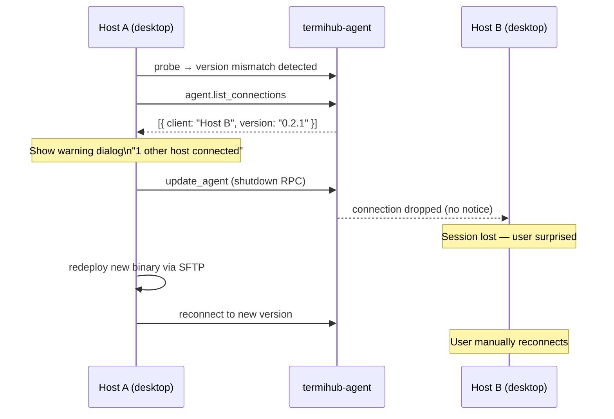
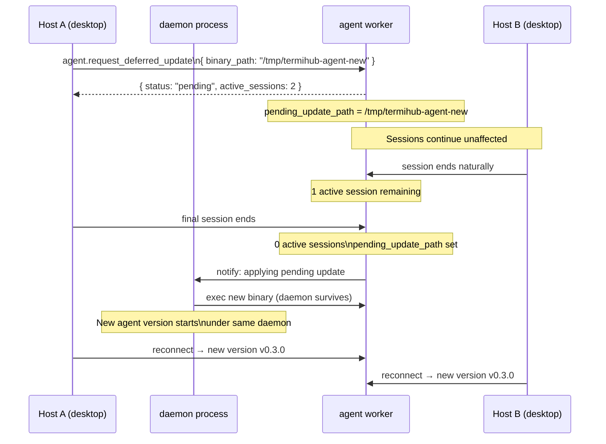
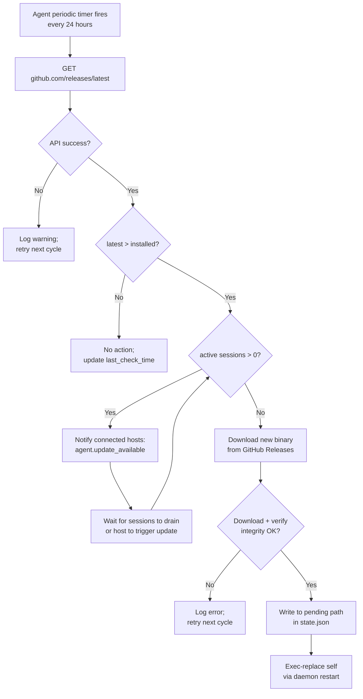

# Remote Agent Update Strategy

---

## Overview

When a termiHub desktop connects to a remote host it deploys a `termihub-agent` binary and
communicates with it over a JSON-RPC channel (see
[Remote Protocol](../remote-protocol.md)). As the desktop application evolves, the agent
binary needs to be kept in sync — but a remote agent may be **shared by multiple desktop
instances** running different versions, and updating it can disrupt sessions that are still
active.

This concept designs a coordinated update strategy for remote agents. It covers:

- How a host detects that an agent needs updating
- Four update approaches, with trade-offs for each
- A recommended phased adoption path
- How the agent can self-check for updates via GitHub
- UI surfaces for communicating update status and coordinating the update

### Current Baseline

The existing implementation already handles single-host updates:

1. **Probe** — on connection, the desktop runs `termihub-agent --version` and compares
   semver against `env!("CARGO_PKG_VERSION")` from `src-tauri/Cargo.toml`
2. **Compatibility rule** — `agent.minor ≥ desktop.minor` (same major required); an agent
   that is _ahead_ of the desktop is considered compatible
3. **Update** — `update_agent()` sends `agent.shutdown` RPC, waits 500 ms, then
   redeploys the binary via SFTP

The gap: there is **no coordination** when multiple desktops are connected. If Host A
updates the agent, Host B's active sessions are silently killed mid-use.

### Goals

- Prevent silent session termination when one host updates a shared agent
- Allow agents on production servers to stay on a predictable upgrade schedule
- Enable agent self-update (GitHub-sourced) as an optional background mechanism
- Keep the update UX consistent and visible across all connected hosts

### Non-Goals

- Side-by-side versioned agents running on the same host (see trade-off analysis below)
- Automatic rollback after a bad update
- Windows or macOS agent targets (currently Linux-only)
- Enterprise MDM / centralised fleet management

---

## UI Interface

### Connection Panel — Agent Version Badge

Each remote agent entry in the sidebar shows a version chip and update state:

```
┌─────────────────────────────────────────────────────┐
│  Remote Agents                               [+]     │
│  ─────────────────────────────────────────────────  │
│  ● prod-server-1       v0.3.0  ✓ Up to date         │
│  ● staging-server      v0.2.1  ↑ Update available   │
│  ● dev-box             v0.1.0  ✗ Incompatible        │
└─────────────────────────────────────────────────────┘
```

Badge colours:

| State              | Colour | Icon |
| ------------------ | ------ | ---- |
| Up to date         | Grey   | ✓    |
| Update available   | Amber  | ↑    |
| Update required    | Red    | ✗    |
| Update in progress | Blue   | ↻    |

### Update Prompt Dialog

When the user clicks "Update available" or triggers an update manually:

```
┌──────────────────────────────────────────────────────────────────────┐
│  Update agent on prod-server-1                                [×]    │
│  ─────────────────────────────────────────────────────────────────   │
│  Installed:  v0.2.1                                                  │
│  Available:  v0.3.0                                                  │
│                                                                      │
│  ⚠  2 other host(s) are currently connected to this agent:           │
│     • staging-pc (connected 43 min ago)                              │
│     • macbook-anne (connected 2 h ago)                               │
│                                                                      │
│  They will receive a disconnect notice and reconnect automatically.  │
│                                                                      │
│  [Cancel]                         [Notify Others & Update]           │
└──────────────────────────────────────────────────────────────────────┘
```

If no other hosts are connected, the warning section is omitted and "Update" is shown directly.

### Incoming Update Notification (on other hosts)

When Host A initiates a coordinated update, connected hosts see:

```
┌──────────────────────────────────────────────────────────────────────┐
│  ℹ  Agent on prod-server-1 is being updated by another host   [×]   │
│  ─────────────────────────────────────────────────────────────────   │
│  Sessions will be paused briefly. Reconnecting automatically…        │
│  ████████░░░░░░░░░░░░  Waiting for update…                          │
└──────────────────────────────────────────────────────────────────────┘
```

After the agent restarts, the host reconnects silently and sessions resume.

### Deferred Update Banner (Approach 4)

When an update is pending but sessions are still active:

```
┌──────────────────────────────────────────────────────────────────────┐
│  ↑  Agent update pending on prod-server-1 — applying on last disconnect
│     [Apply Now]   [Dismiss]                                   [×]   │
└──────────────────────────────────────────────────────────────────────┘
```

### Self-Update Notification (Approach 1 — agent-initiated)

The agent notifies all connected hosts that it has detected a newer version:

```
┌──────────────────────────────────────────────────────────────────────┐
│  ↑  termihub-agent v0.3.0 is available on prod-server-1       [×]   │
│  ─────────────────────────────────────────────────────────────────   │
│  Installed: v0.2.1 · This host: v0.3.0                              │
│                                                                      │
│  [Update Agent]                                    [Remind Me Later] │
└──────────────────────────────────────────────────────────────────────┘
```

---

## General Handling

### Version Compatibility Rule (recap)

```
Compatible   ↔  agent.major == desktop.major AND agent.minor >= desktop.minor
AgentTooOld  ↔  agent.major == desktop.major AND agent.minor <  desktop.minor
MajorMismatch↔  agent.major != desktop.major
```

Because the rule requires `agent.minor ≥ desktop.minor`, updating the agent to a newer
version never breaks an older desktop — the backward-compat guarantee is one-directional
(newer agent, older desktop is fine).

### What "connected host" means

A connected host is any desktop that holds an active JSON-RPC channel to the agent. The
agent can determine this from its internal session table. The `initialize` handshake already
carries `client` and `client_version` fields; the agent can maintain a live registry of
connected clients.

### Update Source

Agent binaries are published to GitHub Releases as part of the existing CI workflow (see
[`.github/workflows/release.yml`](../../.github/workflows/release.yml)):

- `termihub-agent-linux-x64`
- `termihub-agent-linux-arm64`
- `termihub-agent-linux-armv7`

The GitHub Releases API endpoint used:

```
GET https://api.github.com/repos/armaxri/termiHub/releases/latest
```

Binary download URL pattern:

```
https://github.com/armaxri/termiHub/releases/download/v{version}/termihub-agent-{arch}
```

### Desktop-side binary resolution (existing)

The desktop resolves the agent binary via a three-step chain
(`src-tauri/src/terminal/agent_binary.rs`):

1. Local cache: `~/.cache/termihub/agent-binaries/<version>/termihub-agent-<arch>`
2. Bundled resource in the Tauri app bundle
3. Download from GitHub Releases (cached after first download)

---

## Approach Comparison

### Approach 1 — Agent Self-Update (GitHub Polling)

The agent periodically queries the GitHub Releases API for a newer binary, downloads it,
and replaces itself when no sessions are active.

```
agent (running) → poll github/releases every N hours
  → newer version found → wait for zero active sessions
  → download new binary → exec-replace self
  → daemon process survives → sessions reconnect
```

**Pros:**

- No host intervention needed; useful when no host is actively connected
- Works on a predictable schedule regardless of desktop availability

**Cons:**

- Agent needs outbound internet access (unavailable in air-gapped or strict firewall envs)
- Which version to target is ambiguous: "latest" may be newer than any connected desktop
- Security: downloading and exec-replacing a binary requires integrity verification
- Self-updates do not prevent a host from also triggering an update simultaneously

**Verdict:** useful as a background hygiene option (off by default), but unsuitable as the
primary update path. Best paired with Approach 3 or 4 where the host remains in control.

---

### Approach 2 — Host-Triggered with Connected-Host Guard (Minimal Enhancement)

Before updating, the host queries a new RPC method to learn which other clients are
currently connected. If others are present, the user is warned. The update still performs a
hard shutdown.

```
host → version mismatch detected on probe → offer Update button
  → call agent.list_connections
  → 0 other hosts: update immediately (existing flow)
  → N other hosts: warn user → user confirms → update (others are kicked)
```

**New RPC method:** `agent.list_connections`

Response:

```json
{
  "connections": [
    { "client": "termihub-desktop", "client_version": "0.3.0", "connected_since": "..." },
    { "client": "termihub-desktop", "client_version": "0.2.1", "connected_since": "..." }
  ]
}
```

**Pros:**

- Minimal protocol change (one new read-only RPC method + guard in the existing update flow)
- User retains full control; no automatic behaviour change
- Prevents the silent session kill problem

**Cons:**

- Other hosts still lose their sessions (hard cutover); no graceful handoff
- Requires the agent to track connected client identities

**Verdict:** low effort, high value — this should be the **minimum viable improvement**
shipped as Phase 1.

---

### Approach 3 — Coordinated Update via Broadcast Notification

The updating host asks the agent to broadcast an `agent.update_pending` notification to
all connected clients. Each client shows a notice, cleanly disconnects, and queues a
reconnect. After all clients acknowledge or a timeout elapses, the update proceeds.

```
Host A → agent.request_update (new RPC method)
  → agent broadcasts agent.update_pending notification to all clients
  → Host B, C: show "update in progress" notice, disconnect cleanly
  → host ack timeout: 10 s
  → agent shuts down → Host A redeploys new binary
  → all hosts reconnect automatically to new version
```

**New RPC methods / notifications:**

- `agent.request_update` (request, from updating host) — triggers the broadcast
- `agent.update_pending` (notification, from agent to all clients) — carries estimated
  restart time and updating-host info

**Pros:**

- Clean UX for all parties; no surprise session termination
- Reconnect is automatic; users see a brief pause at most
- Consistent with the existing Tauri event system on the frontend

**Cons:**

- Requires protocol additions on both agent and all desktop versions
- Timeout and failure paths must be handled (what if Host B never acks?)
- Older desktop versions that don't understand the new notification will still be cut off

**Verdict:** best end-user experience for the multi-host scenario; reasonable effort.
Recommended as **Phase 2**.

---

### Approach 4 — Deferred Update (Apply on Last Disconnect)

The agent accepts "an update is available" as a signal but does not apply it until the
last session closes naturally. On reaching zero active sessions, the daemon applies the
pending update.

```
Host A requests update → agent marks pending_update_path = /tmp/termihub-agent-new
  → active sessions continue unaffected
  → last session closes (naturally or by user)
  → daemon: exec new binary; daemon itself survives (existing detach model)
  → next host that connects gets the new version
```

The existing daemon architecture (`--daemon` mode, detach-on-shutdown behaviour introduced
in commit `7c52017`) already handles the process restart with session persistence, making
this a natural extension.

**Pros:**

- Zero forced disconnects under any circumstances
- No broadcast protocol required
- Aligns perfectly with the existing daemon session-persistence model
- Useful for production servers with long-running sessions (days/weeks)

**Cons:**

- Update may be delayed indefinitely if sessions are persistent
- No guarantee of _when_ the update actually applies (may be surprising)
- Requires "pending update" state in the agent's state persistence (`state.json`)

**Verdict:** best fit for production servers; elegant given the daemon model. Recommended
as a **Phase 3 option** alongside or instead of Approach 3.

---

### Approach 5 — Side-by-Side Versioned Agents (Rejected)

Run multiple agent versions simultaneously on different ports or sockets; each desktop
connects to its compatible version; the daemon retires old versions when they have no
clients.

**Verdict:** over-engineered for this use case. The backward-compat semver rule already
means a newer agent serves older desktops correctly. The complexity of port/socket
management and version discovery outweighs any benefit. **Not recommended.**

---

## Approach Comparison Table

| Aspect                       | 1: Self-Update       | 2: Guard + Warn  | 3: Broadcast + Ack | 4: Deferred           |
| ---------------------------- | -------------------- | ---------------- | ------------------ | --------------------- |
| **Session disruption**       | Low (waits for idle) | Hard cutover     | Graceful notice    | None                  |
| **Host coordination**        | None (agent-driven)  | Host-driven      | Multi-host aware   | Multi-host aware      |
| **Internet access required** | Yes (agent → GH)     | No               | No                 | No                    |
| **Protocol changes**         | None                 | 1 new RPC method | 2 new RPC methods  | 1 new RPC method      |
| **Daemon integration**       | Required             | Not needed       | Not needed         | Required              |
| **Predictability**           | Schedule-based       | User-triggered   | User-triggered     | Session-driven        |
| **Best for**                 | Unattended servers   | All environments | Multi-user agents  | Long-running sessions |
| **Recommended phase**        | Optional add-on      | Phase 1          | Phase 2            | Phase 3               |
| **Implementation effort**    | Medium               | Low              | Medium             | Medium                |

---

## States & Sequences

### Agent Version State Machine (per connection)

```mermaid
stateDiagram-v2
    [*] --> Probing : Host connects via SSH

    Probing --> Compatible : agent.minor >= desktop.minor\n(same major)
    Probing --> AgentTooOld : agent.minor < desktop.minor
    Probing --> MajorMismatch : agent.major != desktop.major
    Probing --> NotInstalled : binary not found

    Compatible --> Connected : Initialize handshake OK
    AgentTooOld --> UpdateOffered : Show update badge in sidebar
    MajorMismatch --> BlockedReinstall : Show error;\nrequire manual redeploy
    NotInstalled --> DeployOffered : Show deploy button

    UpdateOffered --> Updating : User confirms update
    DeployOffered --> Updating : User deploys

    Updating --> Connected : Deploy succeeds;\nre-probe passes
    Updating --> UpdateFailed : Deploy fails

    UpdateFailed --> UpdateOffered : Show error;\nretry available

    Connected --> Disconnected : Session ends / network drop
    Disconnected --> Probing : User reconnects
```

### Approach 2: Host-Triggered Update with Guard



### Approach 3: Coordinated Broadcast Update

```mermaid
sequenceDiagram
    participant HA as Host A (desktop)
    participant Agent as termihub-agent
    participant HB as Host B (desktop)
    participant HC as Host C (desktop)

    HA->>Agent: agent.request_update
    Agent-->>HB: notification: agent.update_pending\n{ estimated_restart: "10s", requested_by: "Host A" }
    Agent-->>HC: notification: agent.update_pending

    Note over HB: Show "agent updating" notice;\nqueue reconnect
    Note over HC: Show "agent updating" notice;\nqueue reconnect

    HB-->>Agent: clean disconnect
    HC-->>Agent: clean disconnect

    Note over Agent: All clients disconnected\n(or 10s timeout elapsed)

    HA->>Agent: agent.shutdown (graceful)
    HA->>HA: redeploy new binary via SFTP

    HB->>Agent: auto-reconnect (new version)
    HC->>Agent: auto-reconnect (new version)
    HA->>Agent: reconnect (updating host)

    Note over HA,HC: All hosts on new version;\nsessions resume
```

### Approach 4: Deferred Update via Daemon



### Agent Self-Update Flow (Approach 1 — optional)



---

## Preliminary Implementation Details

### Phase 1 — Approach 2: Connected-Host Guard

**Agent side** (`agent/src/`):

New RPC method `agent.list_connections` added to `handler/dispatch.rs`:

```rust
pub async fn list_connections(state: Arc<AppState>) -> Result<ListConnectionsResult, AgentError> {
    let clients = state.connection_registry.list().await;
    Ok(ListConnectionsResult { connections: clients })
}
```

`SessionRegistry` (or a new `ConnectionRegistry`) tracks each connected client's metadata
received during `initialize`:

```rust
pub struct ConnectedClient {
    pub client_id: String,
    pub client: String,          // "termihub-desktop"
    pub client_version: String,
    pub connected_since: DateTime<Utc>,
}
```

**Desktop side** (`src-tauri/src/terminal/agent_deploy.rs`):

`update_agent()` gains a pre-check step:

```rust
let connections = agent_rpc.list_connections(&agent_id).await?;
if !connections.is_empty() {
    // Return connections list to caller; UI shows the warning dialog
    return Ok(AgentDeployResult::OtherHostsConnected(connections));
}
// proceed with existing update logic
```

New Tauri command variant `update_agent_force` bypasses the guard after user confirms.

**Frontend** (`src/components/`):

- Update `RemoteAgentsSidebar` (or equivalent) to show version badge per agent
- Add `UpdateAgentDialog.tsx` that renders the connected-hosts warning
- Wire `agent.list_connections` result into the dialog state before showing

---

### Phase 2 — Approach 3: Broadcast Notification

**New protocol messages** (`agent/src/protocol/methods.rs`):

```rust
pub const AGENT_REQUEST_UPDATE: &str = "agent.request_update";
pub const AGENT_UPDATE_PENDING: &str = "agent.update_pending";  // notification
```

`agent.update_pending` notification payload:

```rust
#[derive(Serialize)]
pub struct UpdatePendingNotification {
    pub requested_by_version: String,
    pub estimated_restart_secs: u32,
}
```

**Agent handler** (`agent/src/handler/dispatch.rs`):

On receiving `agent.request_update`:

1. Collect all active client channels from `ConnectionRegistry`
2. Send `agent.update_pending` notification to every channel except the requester
3. Start a 10-second timeout
4. On timeout or all non-requester clients disconnected: signal the requester to proceed

**Desktop side** — new Tauri event `remote-agent-update-pending` forwarded from the
agent notification to the frontend via the existing event bridge.

**Frontend** — `UpdatePendingToast.tsx` shown on receiving `remote-agent-update-pending`;
triggers graceful session suspension and queues reconnect after 15 seconds.

---

### Phase 3 — Approach 4: Deferred Update via Daemon

The agent's `state.json` persistence (`agent/src/state/`) gains:

```json
{
  "pending_update": {
    "binary_path": "/tmp/termihub-agent-0.3.0",
    "requested_by": "Host A",
    "requested_at": "2026-04-19T10:00:00Z"
  }
}
```

New RPC method `agent.request_deferred_update`:

1. Downloads (or accepts) new binary path
2. Persists `pending_update` to state
3. Registers a zero-session callback in `SessionManager`

Zero-session callback in `SessionManager`:

```rust
if self.active_sessions() == 0 {
    if let Some(update) = self.state.pending_update.take() {
        self.state.save().await?;
        daemon.exec_replace(&update.binary_path).await?;
    }
}
```

Daemon exec-replace uses the existing detach mechanism (commit `7c52017`) to survive the
agent worker process restart.

---

### Approach 1 Add-on: Agent Self-Update (optional)

Enabled via `agent.enable_self_update: true` in the agent's config or as a flag passed
during `initialize`. When enabled:

- Agent runs a 24-hour timer
- Queries `https://api.github.com/repos/armaxri/termiHub/releases/latest`
- Compares `tag_name` semver against `env!("CARGO_PKG_VERSION")`
- If newer: notifies connected hosts via `agent.update_available` notification (new)
- If no hosts connected and Approach 4 is also enabled: auto-downloads and defers update

Binary integrity verification: SHA-256 checksum published as a release asset
(`termihub-agent-linux-x64.sha256`) and verified before exec-replace.

---

### Config / State Schema

Agent `state.json` additions:

```json
{
  "update": {
    "self_update_enabled": false,
    "last_check_time": null,
    "pending_update": null
  }
}
```

Desktop connection config (`RemoteAgentConfig`) additions:

```rust
pub struct RemoteAgentConfig {
    // ... existing fields ...
    pub allow_self_update: bool,       // Phase 1 add-on
    pub update_strategy: UpdateStrategy, // "immediate" | "coordinated" | "deferred"
}
```
