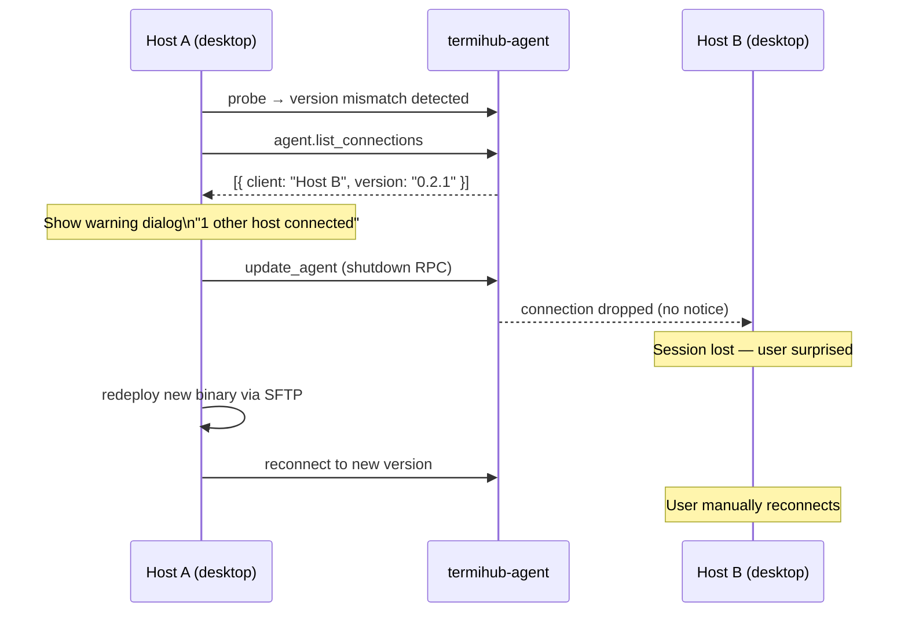
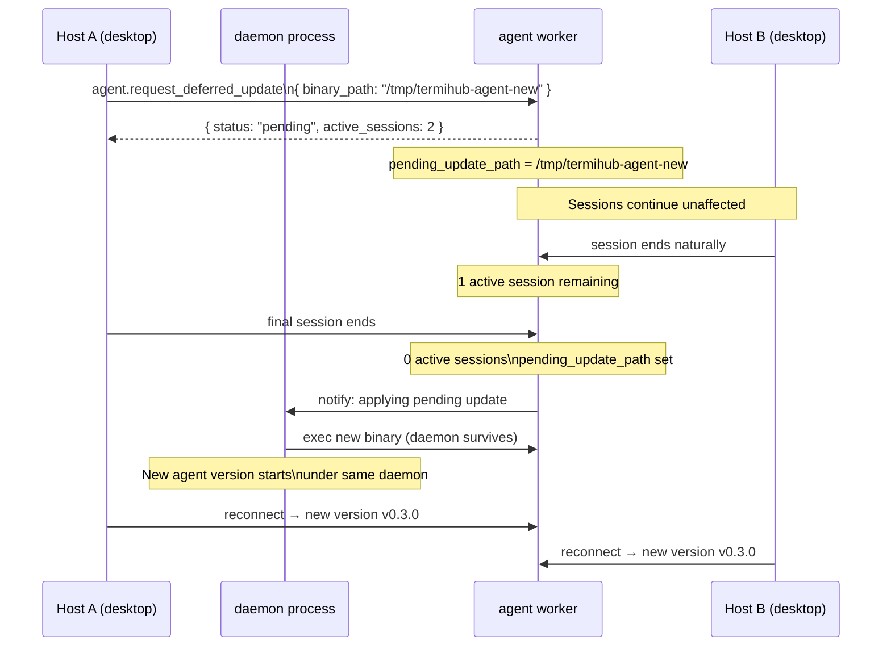
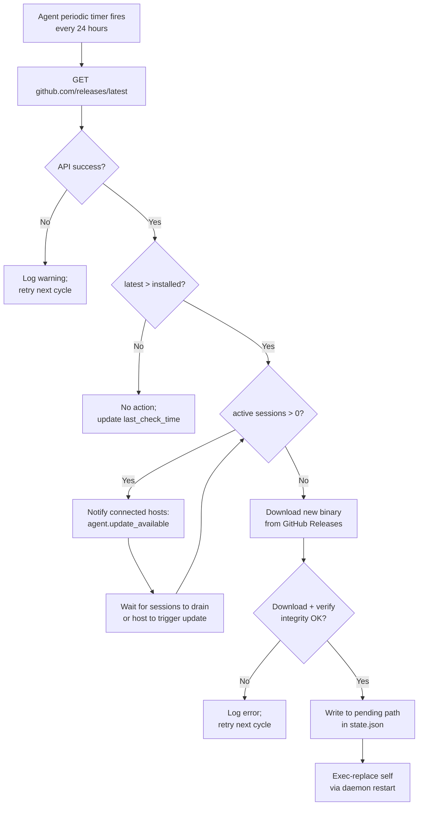

# Remote Agent Update Strategy — Behavior

Behavior diagrams for the [remote-agent-update-strategy concept](concept.md). State machines,
sequences, and flows live here; visual layout lives in [`mockups/`](mockups/).

---

## Agent Version State Machine (per connection)

Drives the update-state badge shown on each agent row in
[`mockups/agent-update-sidebar.html`](mockups/agent-update-sidebar.html).

```mermaid
stateDiagram-v2
    [*] --> Probing : Host connects via SSH

    Probing --> Compatible : agent.minor >= desktop.minor\n(same major)
    Probing --> AgentTooOld : agent.minor < desktop.minor
    Probing --> MajorMismatch : agent.major != desktop.major
    Probing --> NotInstalled : binary not found

    Compatible --> Connected : Initialize handshake OK
    AgentTooOld --> UpdateOffered : Show update badge in sidebar
    MajorMismatch --> BlockedReinstall : Show error;\nrequire manual redeploy
    NotInstalled --> DeployOffered : Show deploy button

    UpdateOffered --> Updating : User confirms update
    DeployOffered --> Updating : User deploys

    Updating --> Connected : Deploy succeeds;\nre-probe passes
    Updating --> UpdateFailed : Deploy fails

    UpdateFailed --> UpdateOffered : Show error;\nretry available

    Connected --> Disconnected : Session ends / network drop
    Disconnected --> Probing : User reconnects
```

---

## Approach 2: Host-Triggered Update with Guard

Surfaces the other-hosts warning in the Update Prompt dialog
([`mockups/agent-update-dialogs.html`](mockups/agent-update-dialogs.html), state 1).



---

## Approach 3: Coordinated Broadcast Update

Drives the "being updated by another host" notice
([`mockups/agent-update-dialogs.html`](mockups/agent-update-dialogs.html), state 2).

```mermaid
sequenceDiagram
    participant HA as Host A (desktop)
    participant Agent as termihub-agent
    participant HB as Host B (desktop)
    participant HC as Host C (desktop)

    HA->>Agent: agent.request_update
    Agent-->>HB: notification: agent.update_pending\n{ estimated_restart: "10s", requested_by: "Host A" }
    Agent-->>HC: notification: agent.update_pending

    Note over HB: Show "agent updating" notice;\nqueue reconnect
    Note over HC: Show "agent updating" notice;\nqueue reconnect

    HB-->>Agent: clean disconnect
    HC-->>Agent: clean disconnect

    Note over Agent: All clients disconnected\n(or 10s timeout elapsed)

    HA->>Agent: agent.shutdown (graceful)
    HA->>HA: redeploy new binary via SFTP

    HB->>Agent: auto-reconnect (new version)
    HC->>Agent: auto-reconnect (new version)
    HA->>Agent: reconnect (updating host)

    Note over HA,HC: All hosts on new version;\nsessions resume
```

---

## Approach 4: Deferred Update via Daemon

Drives the deferred-update banner
([`mockups/agent-update-dialogs.html`](mockups/agent-update-dialogs.html), state 3).



---

## Agent Self-Update Flow (Approach 1 — optional)

Drives the self-update toast
([`mockups/agent-update-dialogs.html`](mockups/agent-update-dialogs.html), state 4).


