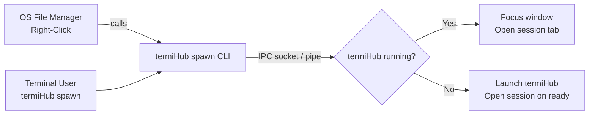
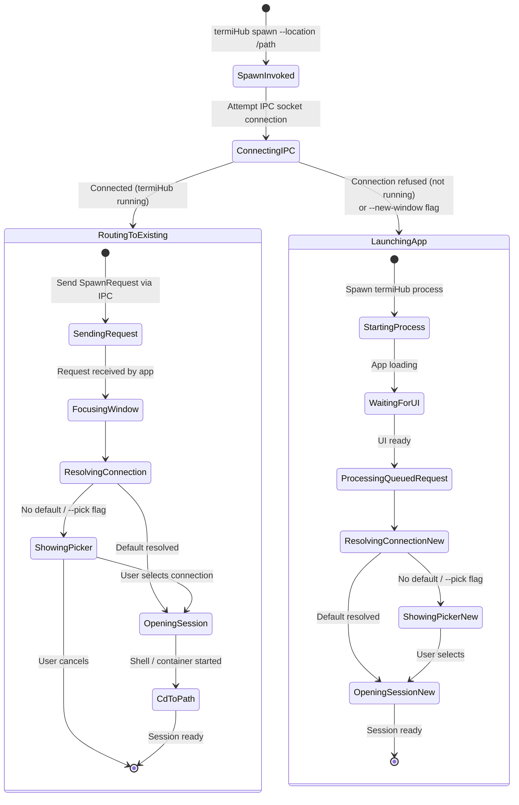
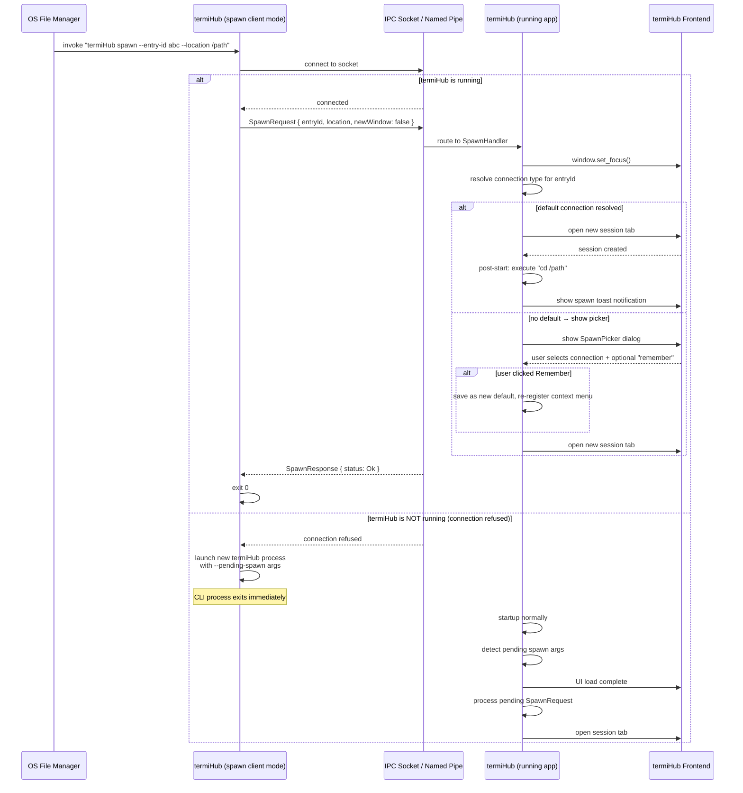
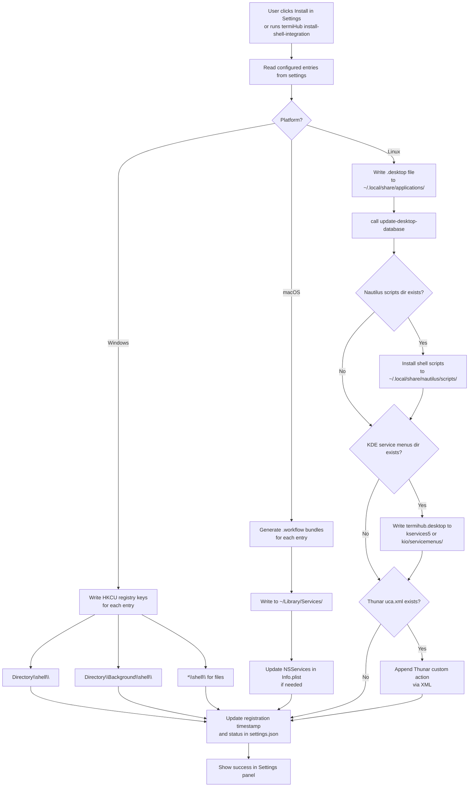
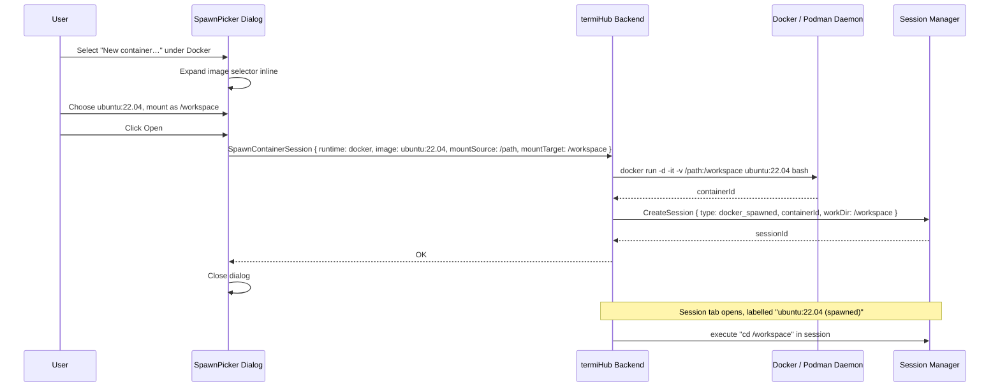
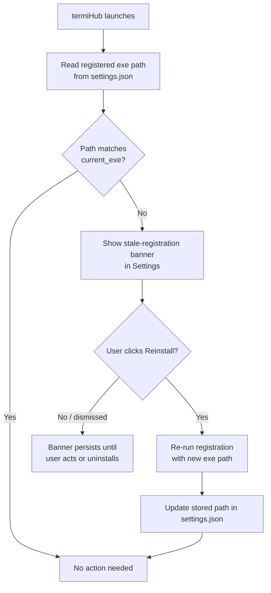
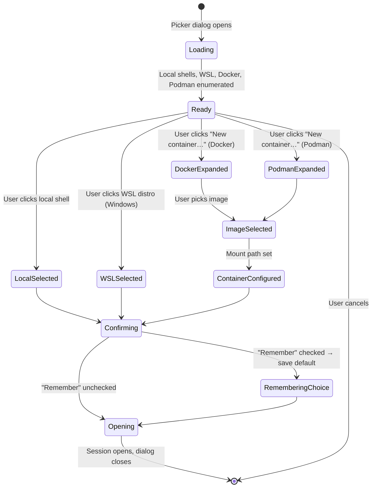

# Shell Context Menu & CLI Spawn Integration — Behavior

Behavior diagrams for the [shell-context-menu-integration concept](concept.md). State machines,
sequences, and flows live here; in-app visual layout lives in [`mockups/`](mockups/).

---

## Top-Level Spawn Flow

Every spawn request — whether from an OS file-manager context menu entry or a terminal user running
`termiHub spawn` — funnels through the same IPC path and either attaches to a running window or
launches a new one.



## Spawn Request — Full State Machine



## Full Spawn Sequence (Existing Instance)



## Spawn Sequence — New Window

```mermaid
sequenceDiagram
    participant CLI as termiHub spawn --new-window
    participant IPC as IPC Socket
    participant Existing as Existing termiHub Window
    participant New as New termiHub Window

    CLI->>IPC: attempt connection
    IPC-->>CLI: connected (termiHub is running)
    Note over CLI: --new-window flag bypasses attach-to-existing
    CLI->>CLI: launch new termiHub process<br>with --new-window --location /path
    Note over CLI: does NOT send to IPC; exits
    New->>New: startup → open session at /path
    Note over Existing: existing window unaffected
```

## Context Menu Registration Flow



## Docker Container Mount Sequence



## Binary Path Staleness Check



## Session Picker — User Interaction State


