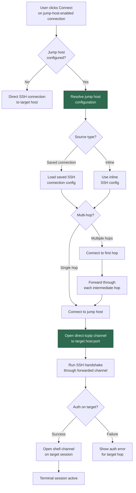
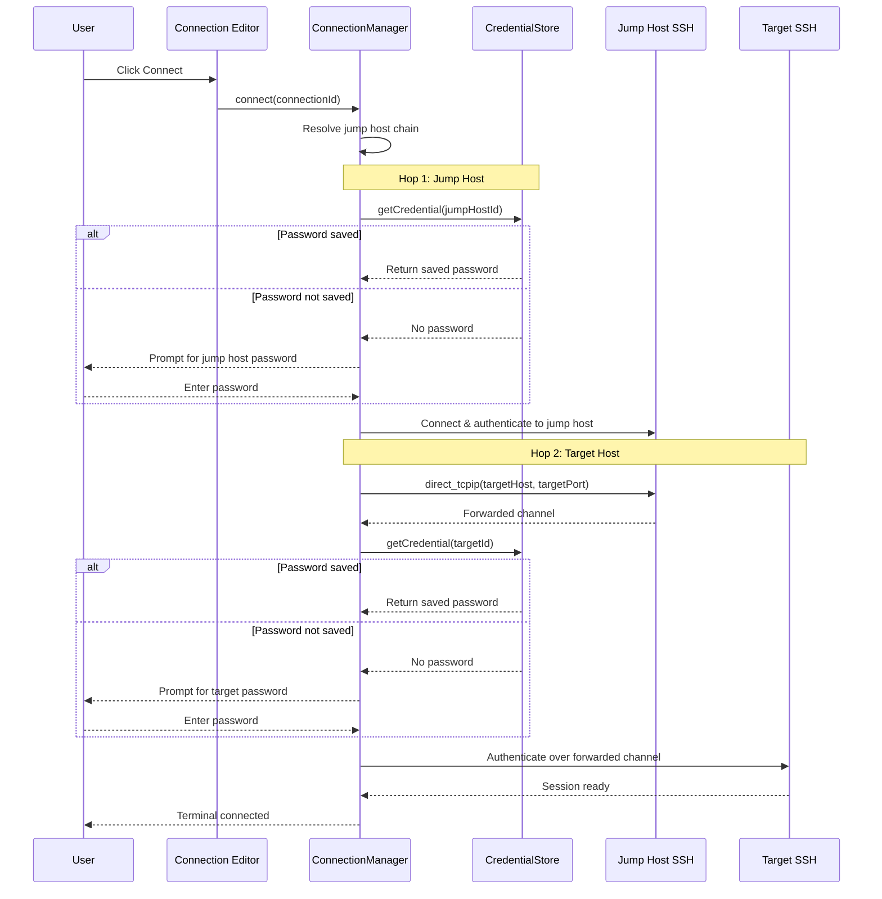
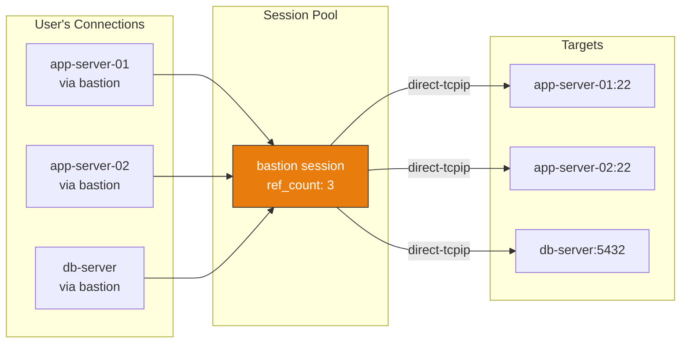
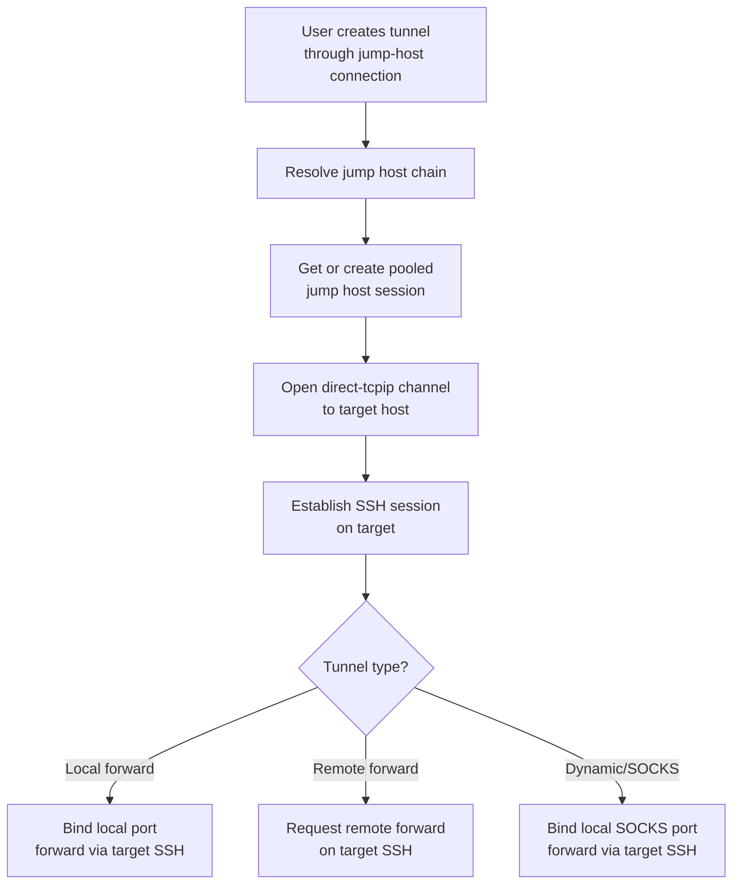
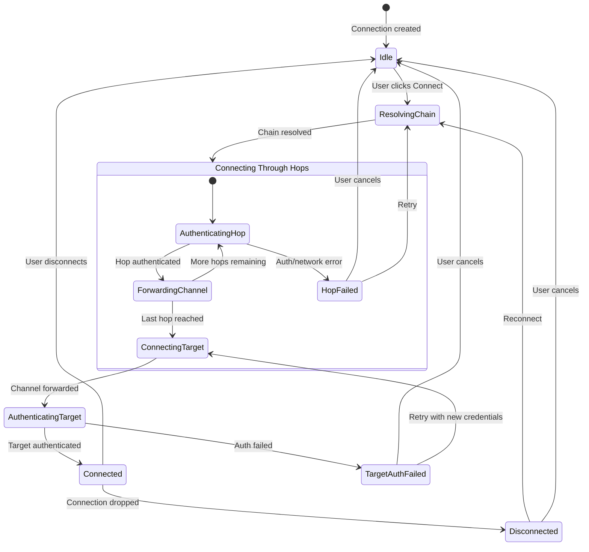
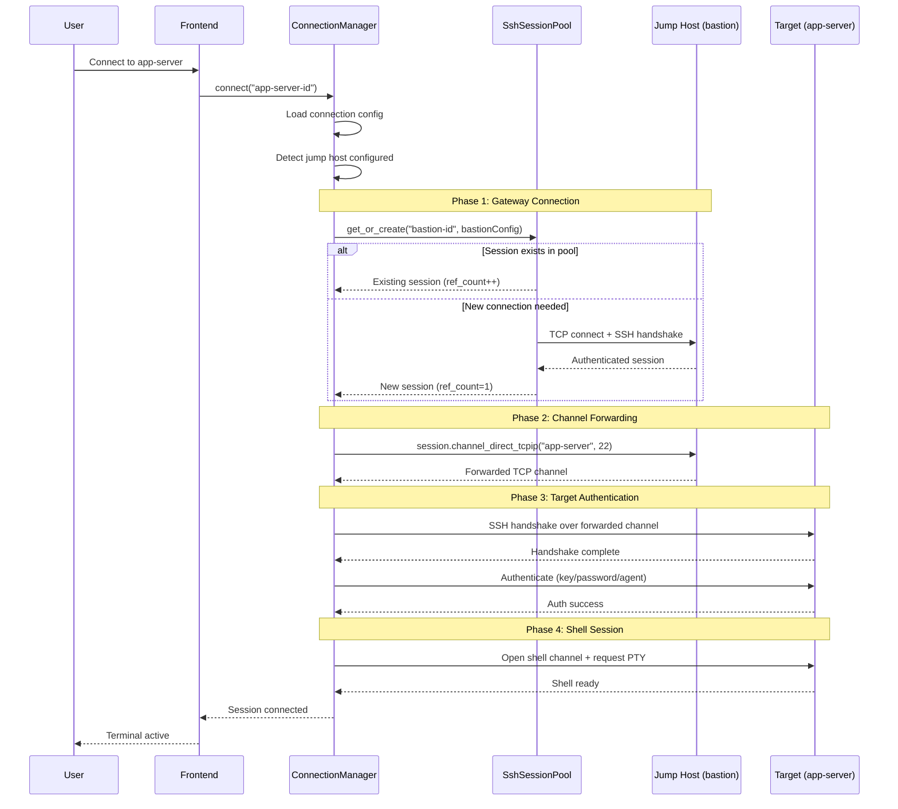
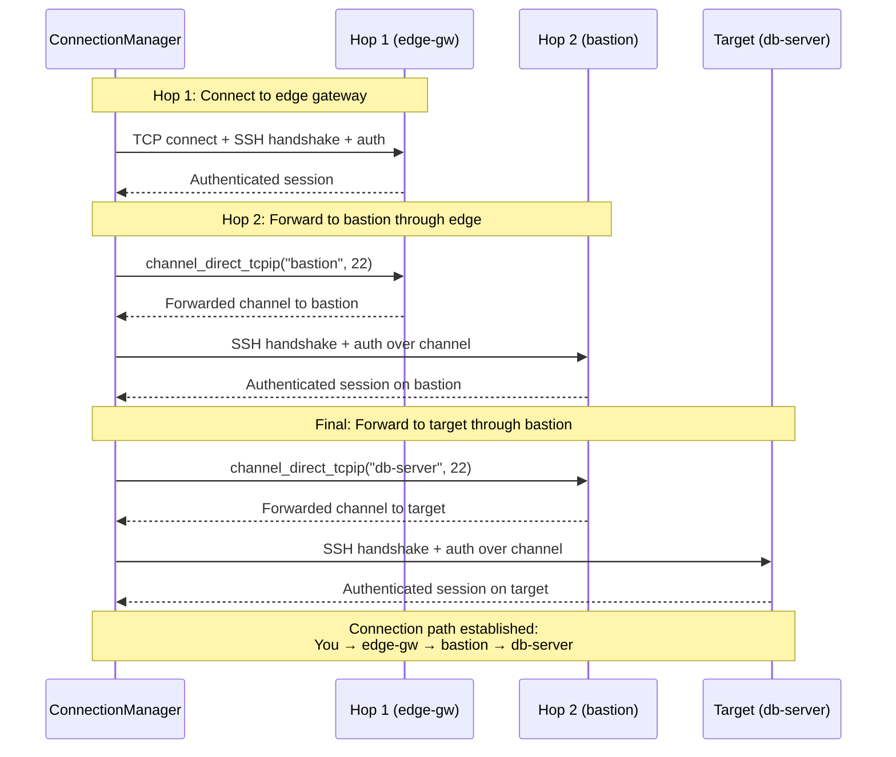
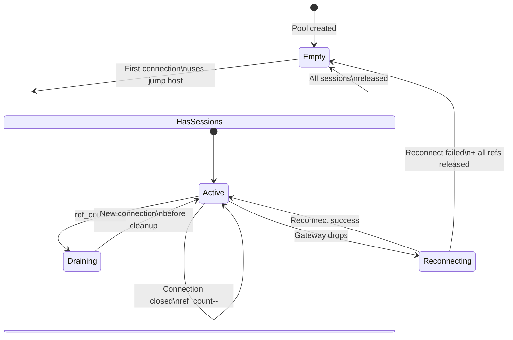
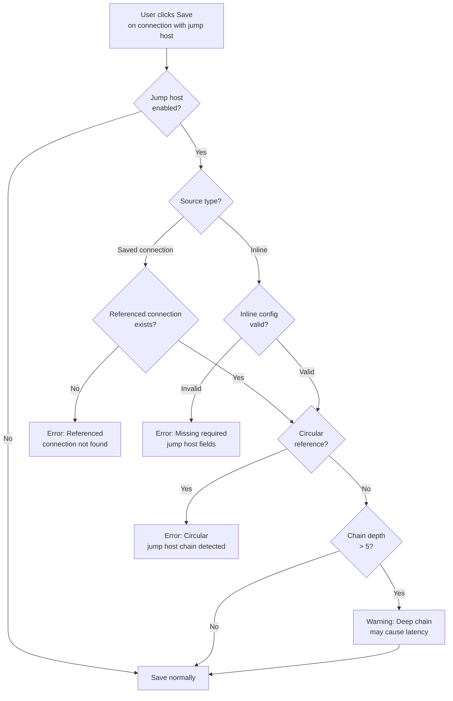

# First-Class SSH Jump Host / Gateway in Connection Editor

> GitHub Issue: [#520](https://github.com/armaxri/termiHub/issues/520)

## Overview

Add a first-class SSH gateway / jump host option directly in the SSH connection editor, allowing users to configure proxy hops without deploying the remote agent. This brings termiHub in line with MobaXterm's SSH gateway feature and OpenSSH's `ProxyJump` directive.

**Motivation**: termiHub currently supports SSH jump hosts only through the remote agent's sub-sessions, which requires agent deployment on the bastion host. Many users need simple `ProxyJump` / `ProxyCommand` functionality to reach servers behind a bastion host without that overhead. This is one of the most common SSH workflows in enterprise environments.

### Goals

- Allow users to select an SSH gateway per connection in the connection editor UI
- Support both referencing an existing saved SSH connection and inline gateway configuration
- Support multi-hop chaining (gateway -> gateway -> target)
- Integrate with the credential store for per-hop authentication
- Pool gateway sessions across multiple connections sharing the same jump host
- Ensure SSH tunnels work through jump hosts

### Non-Goals

- Replacing the remote agent for advanced features (file browsing, monitoring, Docker sessions)
- Automatic detection of bastion hosts from `~/.ssh/config` (future enhancement)
- SOCKS proxy or HTTP CONNECT proxy support (separate feature)
- Jump hosts for non-SSH connection types (serial, telnet, local shell)

---

## UI Interface

### Connection Editor — Jump Host Section

A new collapsible **"Jump Host"** section appears in the SSH connection editor, between the Authentication and Advanced groups:

```
┌─────────────────────────────────────────────────────────────────────┐
│ SSH Connection Settings                                              │
│                                                                      │
│ ─── Connection ───                                                   │
│ Host:     [bastion-internal.example.com]                             │
│ Port:     [22        ]                                               │
│ Username: [deploy    ]                                               │
│                                                                      │
│ ─── Authentication ───                                               │
│ Method:   [SSH Key ▾]                                                │
│ Key:      [~/.ssh/id_ed25519               ] [Browse]                │
│                                                                      │
│ ─── Jump Host ───                                              [▾]  │
│ ☑ Connect through a jump host                                        │
│                                                                      │
│ Source:   [● Saved connection  ○ Inline configuration]               │
│ Gateway:  [bastion.example.com (SSH) ▾]                              │
│                                                                      │
│ [+ Add another hop]                                                  │
│                                                                      │
│ ─── Advanced ───                                               [▾]  │
│ Shell:    [Default ▾]                                                │
│ X11:      ☐ Enable X11 forwarding                                    │
│ ...                                                                  │
└─────────────────────────────────────────────────────────────────────┘
```

When the user enables "Connect through a jump host", the section expands with two configuration modes:

#### Mode 1: Saved Connection Reference

The user selects an existing SSH connection from a dropdown. This is the quickest option when the bastion host is already configured as a saved connection:

```
┌─────────────────────────────────────────────────────────────────────┐
│ ─── Jump Host ───                                                    │
│ ☑ Connect through a jump host                                        │
│                                                                      │
│ Source:   [● Saved connection  ○ Inline configuration]               │
│                                                                      │
│ Gateway:  [bastion.example.com (SSH) ▾]                              │
│           ├─ Work / bastion.example.com                              │
│           ├─ Personal / home-gateway                                 │
│           └─ Lab / jump-server-01                                    │
│                                                                      │
│ [+ Add another hop]                                                  │
└─────────────────────────────────────────────────────────────────────┘
```

The dropdown only shows SSH-type saved connections. It displays the full path (folder / name) to disambiguate connections with the same name.

#### Mode 2: Inline Configuration

The user configures the gateway directly within the connection editor, without needing a separate saved connection. This is useful for one-off gateways or when the bastion host isn't worth saving as a standalone connection:

```
┌─────────────────────────────────────────────────────────────────────┐
│ ─── Jump Host ───                                                    │
│ ☑ Connect through a jump host                                        │
│                                                                      │
│ Source:   [○ Saved connection  ● Inline configuration]               │
│                                                                      │
│ Host:     [bastion.example.com ]  Port: [22  ]                       │
│ Username: [admin               ]                                     │
│ Auth:     [SSH Key ▾]                                                │
│ Key:      [~/.ssh/bastion_key          ] [Browse]                    │
│                                                                      │
│ [+ Add another hop]                                                  │
└─────────────────────────────────────────────────────────────────────┘
```

#### Multi-Hop Chaining

Clicking "Add another hop" appends an additional jump host entry. Hops are numbered and ordered from outermost (first connection) to innermost (closest to target):

```
┌─────────────────────────────────────────────────────────────────────┐
│ ─── Jump Host ───                                                    │
│ ☑ Connect through a jump host                                        │
│                                                                      │
│ Hop 1 (outermost)                                           [× Remove]│
│ Source:   [● Saved connection  ○ Inline]                             │
│ Gateway:  [edge-gateway.example.com (SSH) ▾]                         │
│                                                                      │
│ Hop 2                                                       [× Remove]│
│ Source:   [● Saved connection  ○ Inline]                             │
│ Gateway:  [internal-bastion (SSH) ▾]                                 │
│                                                                      │
│ [+ Add another hop]                                                  │
│                                                                      │
│ Connection path:                                                     │
│ You → edge-gateway → internal-bastion → bastion-internal.example.com │
└─────────────────────────────────────────────────────────────────────┘
```

The "Connection path" line at the bottom provides a visual summary of the full hop chain for easy verification.

### Connection Sidebar — Visual Indicator

Connections configured with a jump host display a small hop icon (or badge) in the connection tree sidebar:

```
┌─────────────────────────────────────┐
│ CONNECTIONS                          │
│                                      │
│ ▼ Work                               │
│   🖥 bastion.example.com             │
│   🖥⮂ app-server-01  (via bastion)   │
│   🖥⮂ app-server-02  (via bastion)   │
│   🖥⮂⮂ db-server  (2 hops)          │
│ ▼ Personal                           │
│   🖥 home-server                     │
└─────────────────────────────────────┘
```

- A small arrow/hop indicator (`⮂`) next to the icon shows this connection routes through a gateway
- Tooltip on hover shows the full path: "Via: bastion.example.com → target"
- Multiple arrows (`⮂⮂`) for multi-hop connections

### Status Bar — Connection Info

When a terminal tab using a jump host is active, the status bar shows the hop chain:

```
┌──────────────────────────────────────────────────────────────────────┐
│ SSH: deploy@app-server via bastion.example.com │       │ 80x24      │
└──────────────────────────────────────────────────────────────────────┘
```

### Connection Context Menu

Right-clicking a connection that uses a jump host shows additional context actions:

```
┌───────────────────────────────────┐
│ Connect                            │
│ Edit Connection...                 │
│ ─────────────────────────────────  │
│ Open Jump Host Terminal            │
│ Show Connection Path               │
│ ─────────────────────────────────  │
│ Duplicate                          │
│ Delete                             │
└───────────────────────────────────┘
```

- **Open Jump Host Terminal**: Opens a terminal directly on the gateway (useful for debugging connectivity)
- **Show Connection Path**: Displays a tooltip/popover with the full hop chain and connection status per hop

---

## General Handling

### Connection Workflow



### Authentication Flow Per Hop

Each hop in the chain may use a different authentication method. The credential store resolves credentials independently per hop:



### Session Pooling

When multiple connections share the same jump host, the gateway SSH session is pooled (reused) to avoid redundant connections. This extends the existing `SshSessionPool` pattern used by SSH tunnels:



### Relationship with Remote Agent

Jump host (simple forwarding) and remote agent (full capabilities) serve different needs. The UI should make the distinction clear:

| Capability                  | Jump Host Only   | Remote Agent           |
| --------------------------- | ---------------- | ---------------------- |
| Shell access to target      | Yes              | Yes                    |
| File browsing (SFTP)        | Yes (via target) | Yes (via agent)        |
| System monitoring           | No               | Yes                    |
| Docker sessions on target   | No               | Yes                    |
| Sub-sessions from target    | No               | Yes                    |
| Agent deployment required   | No               | Yes                    |
| Connection overhead         | Minimal          | Higher (agent process) |
| Works with restricted hosts | Yes (no install) | Requires write access  |

When a user configures both a jump host AND agent deployment, the agent is deployed through the jump host tunnel — the jump host provides the transport, and the agent provides the features.

### Tunnel Compatibility

SSH tunnels (local forward, remote forward, dynamic/SOCKS) should work through jump hosts. The tunnel's SSH session is established over the forwarded channel, just like a terminal session:



### Edge Cases & Error Handling

| Scenario                                            | Handling                                                                                                       |
| --------------------------------------------------- | -------------------------------------------------------------------------------------------------------------- |
| Jump host unreachable                               | Show error: "Cannot reach jump host `bastion.example.com:22`. Check network connectivity."                     |
| Jump host auth fails                                | Show error specifying which hop failed: "Authentication failed on hop 1 (bastion.example.com)"                 |
| Target unreachable from jump host                   | Show error: "Jump host connected, but target `app-server:22` is unreachable from `bastion.example.com`"        |
| Target auth fails (after successful hop)            | Show error: "Connected via jump host. Authentication failed on target `app-server`"                            |
| Jump host session drops                             | All connections through that gateway disconnect. Show reconnection dialog per connection.                      |
| Referenced saved connection deleted                 | Show warning when deleting: "This connection is used as a jump host by N other connections." Block or confirm. |
| Referenced saved connection modified                | Changes to the gateway connection automatically apply to all connections using it as a jump host.              |
| Circular reference (A jumps through B, B through A) | Validate on save — reject circular jump host chains with clear error message.                                  |
| Jump host chain too deep (>5 hops)                  | Warn on save: "Chain has N hops. Deep chains may cause latency issues." Allow but warn.                        |
| Inline gateway password not saved                   | Prompt at connect time. Optionally save to credential store.                                                   |
| Connection timeout through hops                     | Per-hop timeout. Show which hop timed out.                                                                     |

### Reconnection Behavior

When a jump host connection drops mid-session:

1. All terminal sessions through that gateway are disconnected
2. Each terminal shows a reconnection banner: "Connection lost (jump host disconnected). [Reconnect]"
3. Clicking Reconnect re-establishes the full hop chain
4. The session pool creates a new gateway session on reconnection
5. If multiple terminals reconnect simultaneously, the pool ensures only one gateway session is created

---

## States & Sequences

### Jump Host Connection State Machine



### Connection Establishment Sequence (Single Hop)



### Multi-Hop Connection Sequence



### Session Pool Lifecycle



### Validation Flow (On Save)



---

## Preliminary Implementation Details

> Based on the current project architecture as of the time of concept creation. The codebase may evolve before implementation.

### Backend (Rust)

#### Core Config Extension (`core/src/config/mod.rs`)

Add jump host configuration to `SshConfig`:

```rust
/// Configuration for a single jump host hop.
#[derive(Debug, Clone, Serialize, Deserialize)]
#[serde(rename_all = "camelCase")]
pub struct JumpHostConfig {
    /// Reference to a saved SSH connection ID (mutually exclusive with inline config).
    pub connection_id: Option<String>,
    /// Inline SSH configuration (used when connection_id is None).
    pub host: Option<String>,
    pub port: Option<u16>,
    pub username: Option<String>,
    pub auth_method: Option<String>,
    pub password: Option<String>,
    pub key_path: Option<String>,
    pub save_password: Option<bool>,
}

// Add to SshConfig:
pub struct SshConfig {
    // ... existing fields ...
    /// Optional jump host chain (ordered outermost to innermost).
    #[serde(default, skip_serializing_if = "Vec::is_empty")]
    pub jump_hosts: Vec<JumpHostConfig>,
}
```

The `expand()` method on `SshConfig` should also expand environment variables in inline jump host fields.

#### SSH Backend Modification (`core/src/backends/ssh/`)

Add a new module `core/src/backends/ssh/jump_host.rs` to handle jump host connection logic:

```rust
/// Establish an SSH session through a chain of jump hosts.
///
/// Returns the authenticated session on the final target host.
pub fn connect_through_jump_hosts(
    hops: &[ResolvedJumpHost],
    target_config: &SshConfig,
) -> Result<ssh2::Session, SessionError> {
    // 1. Connect to the first hop directly via TCP
    // 2. For each subsequent hop, open a direct-tcpip channel
    //    and establish an SSH session over it
    // 3. On the final hop, open a direct-tcpip channel to the target
    // 4. Establish the target SSH session over that channel
}
```

The `connect_and_authenticate` function in `auth.rs` currently creates a `TcpStream` directly. For jump host support, a new variant is needed that accepts a pre-established channel (from `direct_tcpip`) instead of opening a new TCP connection:

```rust
/// Connect and authenticate over an existing forwarded channel.
pub fn connect_and_authenticate_over_channel(
    config: &SshConfig,
    channel: ssh2::Channel,
) -> Result<ssh2::Session, SessionError> {
    let mut session = ssh2::Session::new()?;
    // The ssh2 crate's Session::set_tcp_stream() accepts any Read+Write.
    // A Channel implements Read+Write, so it can be used as the transport.
    session.set_tcp_stream(channel);
    session.handshake()?;
    // ... authenticate as before ...
}
```

> **Note**: The `ssh2` crate's `Session::set_tcp_stream` accepts a generic `TcpStream`, not a `Channel` directly. The implementation may need to wrap the channel in a custom adapter that implements `Read + Write`, or use the lower-level `libssh2` API for session-over-channel. This is a key technical risk to investigate during implementation.

#### Session Pool Extension (`src-tauri/src/tunnel/session_pool.rs`)

The existing `SshSessionPool` already supports reference-counted session sharing. It needs to be extended:

1. **Shared between tunnels and terminal connections**: Currently only used by the tunnel manager. Make it accessible from the terminal connection path too.
2. **Jump host session tracking**: Pool entries keyed by connection ID. When a saved connection is used as a jump host, its session can be shared across all consumers.
3. **Intermediate hop sessions**: For multi-hop chains, intermediate sessions also need pooling.

```rust
/// Extended pool entry to track jump host intermediates.
struct PooledSession {
    session: Arc<Mutex<Session>>,
    ref_count: usize,
    /// Sessions for intermediate hops (if this is a multi-hop chain).
    intermediate_sessions: Vec<Arc<Mutex<Session>>>,
}
```

#### Connection Manager Changes (`src-tauri/src/connection/`)

- **Validation**: Add circular reference detection when saving a connection with jump host references
- **Deletion protection**: When deleting a saved connection, check if other connections reference it as a jump host. Warn user and optionally cascade-update or block deletion.
- **Resolution**: New method `resolve_jump_host_chain(connection_id) -> Vec<ResolvedJumpHost>` that follows the chain of connection references, loading inline or saved configs for each hop.

#### New and Modified Files

| File                                   | Change                                                                |
| -------------------------------------- | --------------------------------------------------------------------- |
| `core/src/config/mod.rs`               | **Modify** — Add `JumpHostConfig` struct, `jump_hosts` to `SshConfig` |
| `core/src/backends/ssh/jump_host.rs`   | **New** — Jump host connection logic, channel-based auth              |
| `core/src/backends/ssh/mod.rs`         | **Modify** — Use jump host logic when `jump_hosts` is non-empty       |
| `core/src/backends/ssh/auth.rs`        | **Modify** — Add `connect_and_authenticate_over_channel`              |
| `src-tauri/src/tunnel/session_pool.rs` | **Modify** — Extend for shared use, intermediate session tracking     |
| `src-tauri/src/connection/manager.rs`  | **Modify** — Add chain resolution, deletion protection                |
| `src-tauri/src/connection/config.rs`   | **Modify** — Validate jump host config on save                        |

### Frontend (React/TypeScript)

#### Connection Editor Changes

Extend the SSH settings schema to include the jump host section:

```typescript
// New fields in SSH connection settings schema
interface JumpHostEntry {
  /** "saved" or "inline" */
  source: "saved" | "inline";
  /** Connection ID when source is "saved" */
  connectionId?: string;
  /** Inline config fields when source is "inline" */
  host?: string;
  port?: number;
  username?: string;
  authMethod?: string;
  password?: string;
  keyPath?: string;
  savePassword?: boolean;
}

// Added to SSH connection config
interface SshConnectionConfig {
  // ... existing fields ...
  jumpHostEnabled: boolean;
  jumpHosts: JumpHostEntry[];
}
```

#### New Components

```
src/components/ConnectionEditor/
  JumpHostSection.tsx        # Collapsible jump host configuration section
  JumpHostEntry.tsx          # Single hop entry (saved ref or inline config)
  JumpHostPathDisplay.tsx    # Visual "You → hop1 → hop2 → target" display
```

`JumpHostSection.tsx` follows the collapsible group pattern already used in the connection editor (Authentication, Advanced). Each `JumpHostEntry` renders either a saved connection dropdown or inline SSH fields.

#### Sidebar Visual Indicator

Modify the connection tree rendering in `src/components/Sidebar/` to show a hop badge on connections with jump hosts configured:

```typescript
// In connection tree item rendering
{connection.config.jumpHosts?.length > 0 && (
  <span
    className="connection-item__jump-badge"
    title={`Via: ${jumpHostNames.join(" → ")}`}
  >
    ⮂
  </span>
)}
```

#### Store Changes (`src/store/appStore.ts`)

Minimal changes needed — the jump host config is part of the connection config and flows through existing save/load paths. The connection editor state already handles dynamic SSH settings.

#### API Layer (`src/services/api.ts`)

No new Tauri commands needed for basic jump host support — the jump host config is part of the SSH connection config that flows through the existing `connect_session` command. The backend resolves and connects through the chain internally.

New command only for validation:

```typescript
/** Validate a jump host chain (check for circular refs, missing connections). */
export function validateJumpHostChain(
  connectionId: string,
  jumpHosts: JumpHostEntry[]
): Promise<ValidationResult>;
```

#### Types (`src/types/connection.ts`)

Add jump host related types alongside existing connection types.

### Data Model & Storage

Jump host configuration is stored inline within the SSH connection config in `connections.json`:

```json
{
  "type": "ssh",
  "config": {
    "host": "app-server.internal",
    "port": 22,
    "username": "deploy",
    "authMethod": "key",
    "keyPath": "~/.ssh/id_ed25519",
    "jumpHostEnabled": true,
    "jumpHosts": [
      {
        "source": "saved",
        "connectionId": "Work/bastion.example.com"
      }
    ]
  }
}
```

For inline jump hosts:

```json
{
  "jumpHosts": [
    {
      "source": "inline",
      "host": "bastion.example.com",
      "port": 22,
      "username": "admin",
      "authMethod": "key",
      "keyPath": "~/.ssh/bastion_key"
    }
  ]
}
```

Inline jump host passwords follow the same credential store flow as regular SSH passwords — stored via the active credential store when `savePassword` is true.

### Implementation Phases

1. **Phase 1 — Core backend**: Add `JumpHostConfig` to `SshConfig`. Implement `connect_through_jump_hosts` for single-hop. Extend `connect_and_authenticate` to work over forwarded channels. Unit test with mock sessions.

2. **Phase 2 — Connection editor UI**: Add `JumpHostSection` component. Implement saved-connection dropdown and inline config mode. Wire to existing save/load paths.

3. **Phase 3 — Session pooling**: Extend `SshSessionPool` for shared jump host → terminal use. Ensure tunnels through jump hosts also pool correctly. Add reference counting for intermediate hops.

4. **Phase 4 — Multi-hop support**: Extend Phase 1 for N-hop chains. Add "Add another hop" UI. Implement chain validation (circular refs, depth warnings).

5. **Phase 5 — Visual indicators & polish**: Add sidebar hop badges. Add status bar connection path display. Add context menu actions (Open Jump Host Terminal, Show Connection Path). Handle reconnection through jump hosts.

### Technical Risks

| Risk                                                | Mitigation                                                                                           |
| --------------------------------------------------- | ---------------------------------------------------------------------------------------------------- |
| `ssh2` crate may not support session-over-channel   | Investigate during Phase 1. Fallback: use `russh` crate which natively supports channel transports.  |
| Pooled jump host session becomes stale              | Add keepalive pings to pooled sessions. Detect disconnection and trigger reconnection for all users. |
| Credential prompting for multiple hops is confusing | Show clear hop labels in password dialogs: "Password for hop 1 (bastion.example.com)"                |
| Performance with deep chains                        | Cap default at 5 hops with warning. Each hop adds ~100ms latency for handshake.                      |
