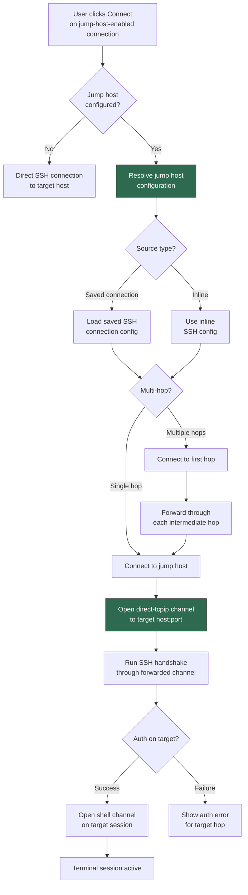
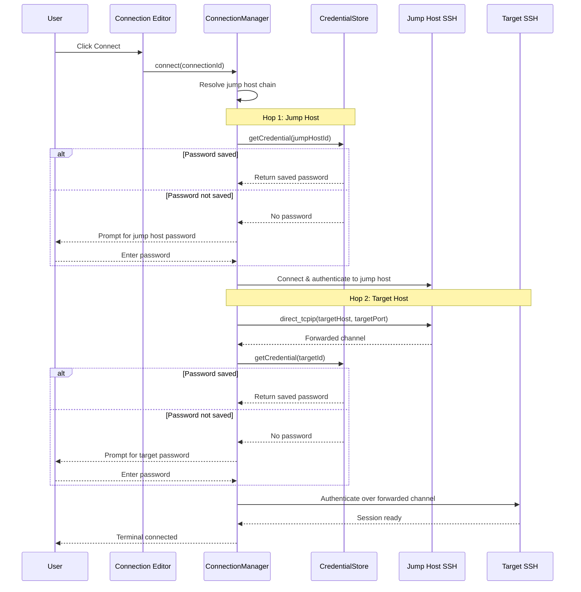
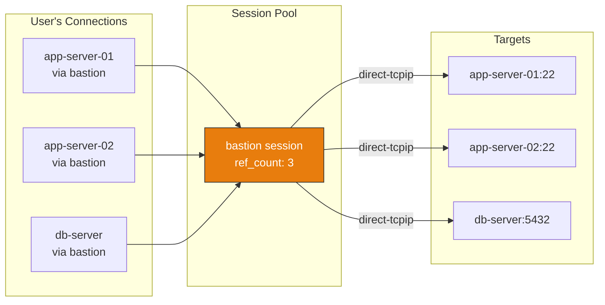
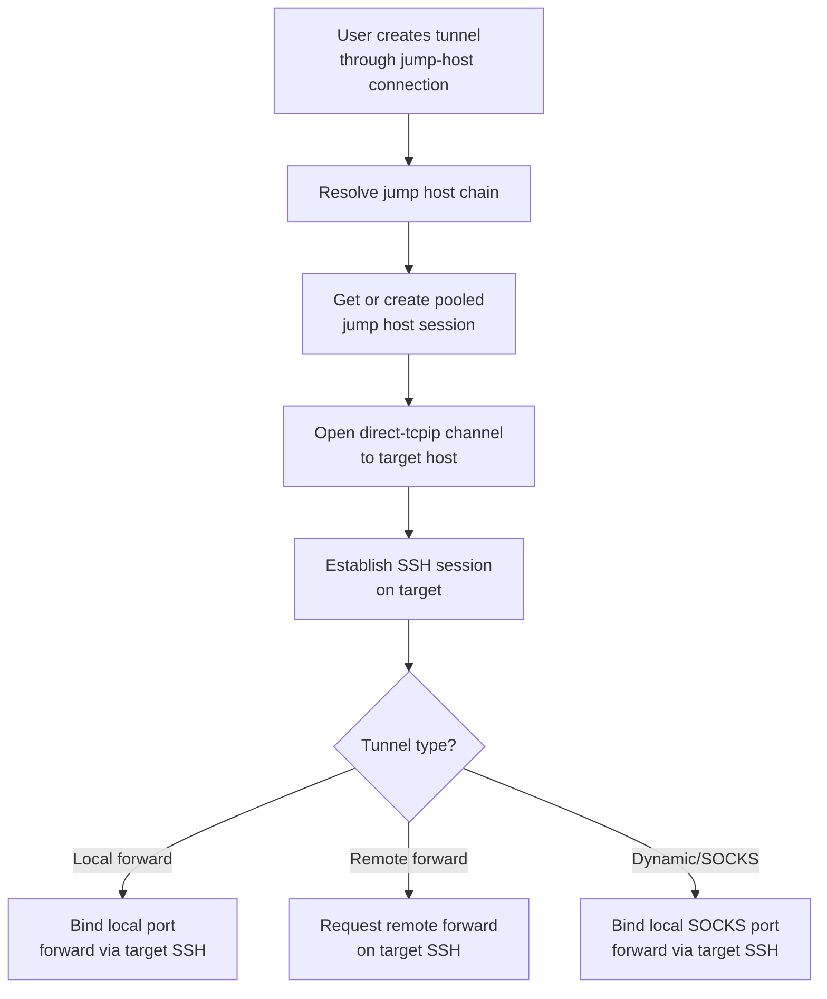
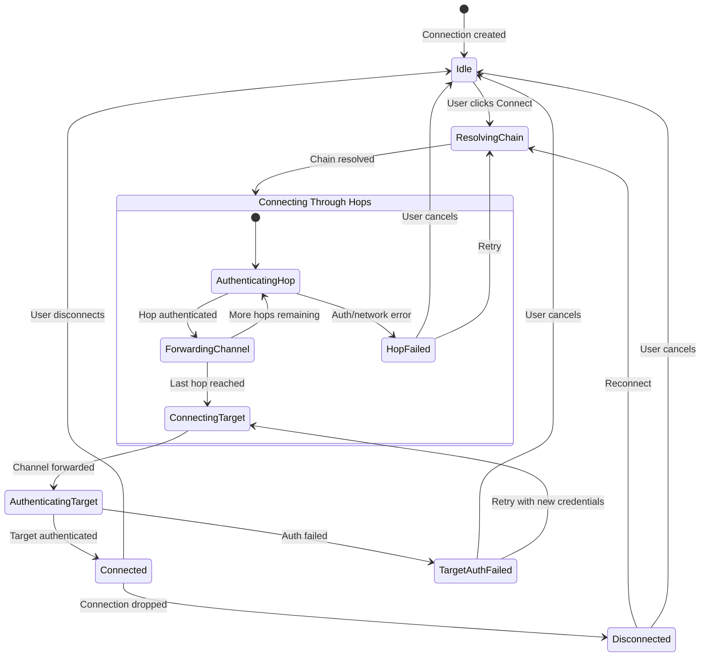
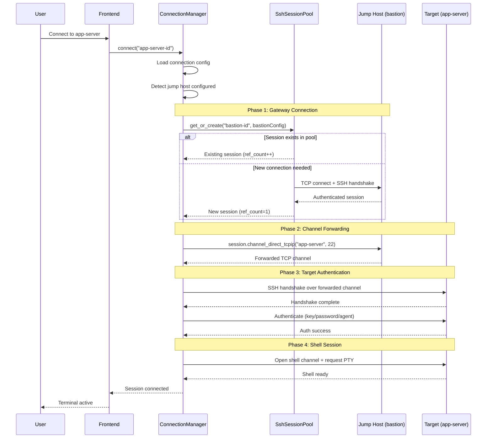
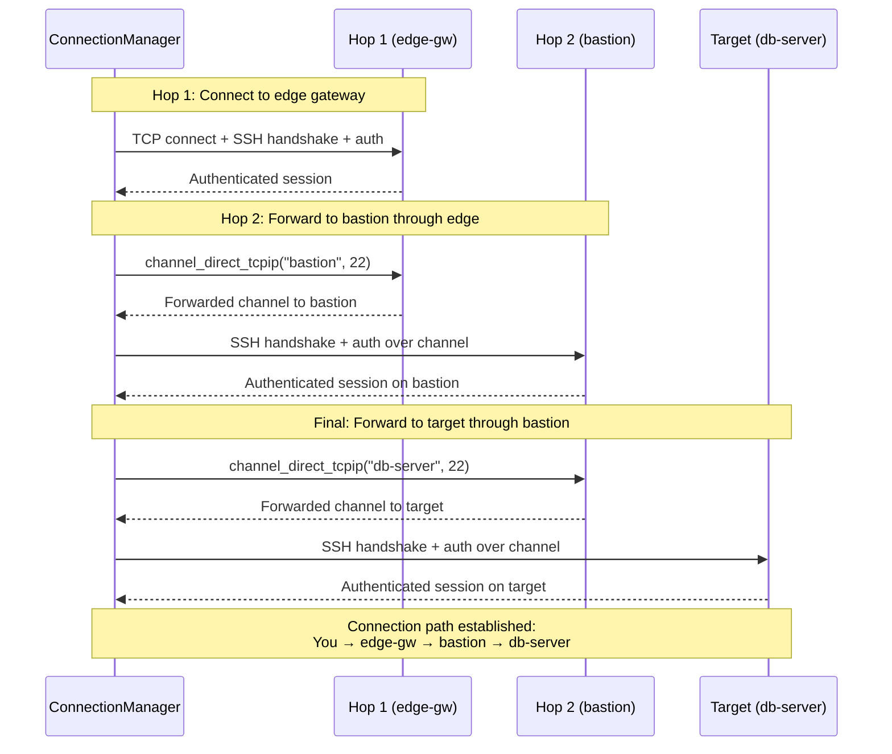
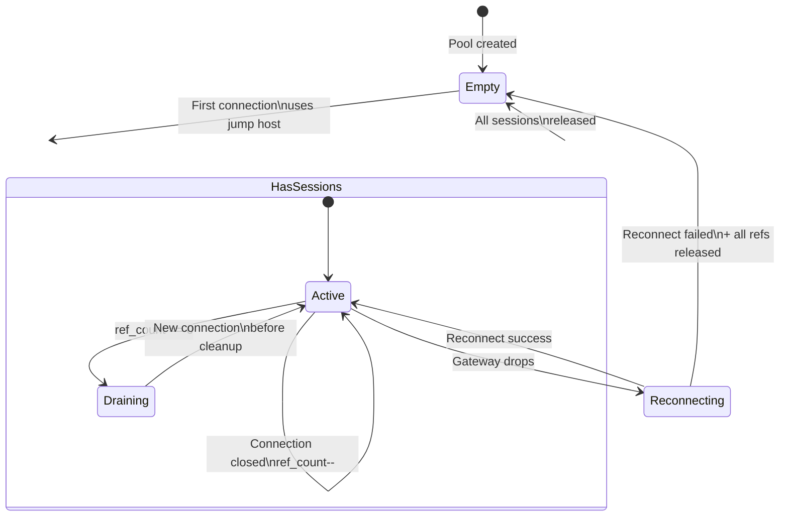
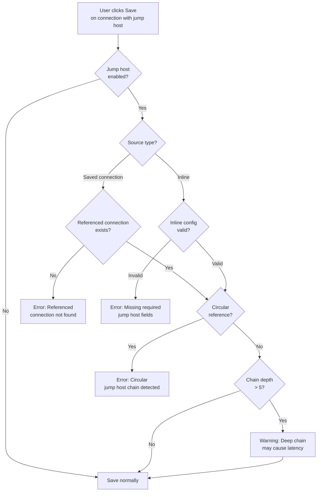

# SSH Jump Host — Behavior

Behavior diagrams for the [ssh-jump-host concept](concept.md). State machines, sequences, and
flows live here; visual layout lives in [`mockups/`](mockups/).

---

## Connection Workflow

## Authentication Flow Per Hop

Each hop in the chain may use a different authentication method. The credential store resolves
credentials independently per hop:

## Session Pooling

When multiple connections share the same jump host, the gateway SSH session is pooled (reused) to
avoid redundant connections. This extends the existing `SshSessionPool` pattern used by SSH tunnels:

## Tunnel Compatibility

SSH tunnels (local forward, remote forward, dynamic/SOCKS) should work through jump hosts. The
tunnel's SSH session is established over the forwarded channel, just like a terminal session:

## Jump Host Connection State Machine

## Connection Establishment Sequence (Single Hop)

## Multi-Hop Connection Sequence

## Session Pool Lifecycle

## Validation Flow (On Save)

