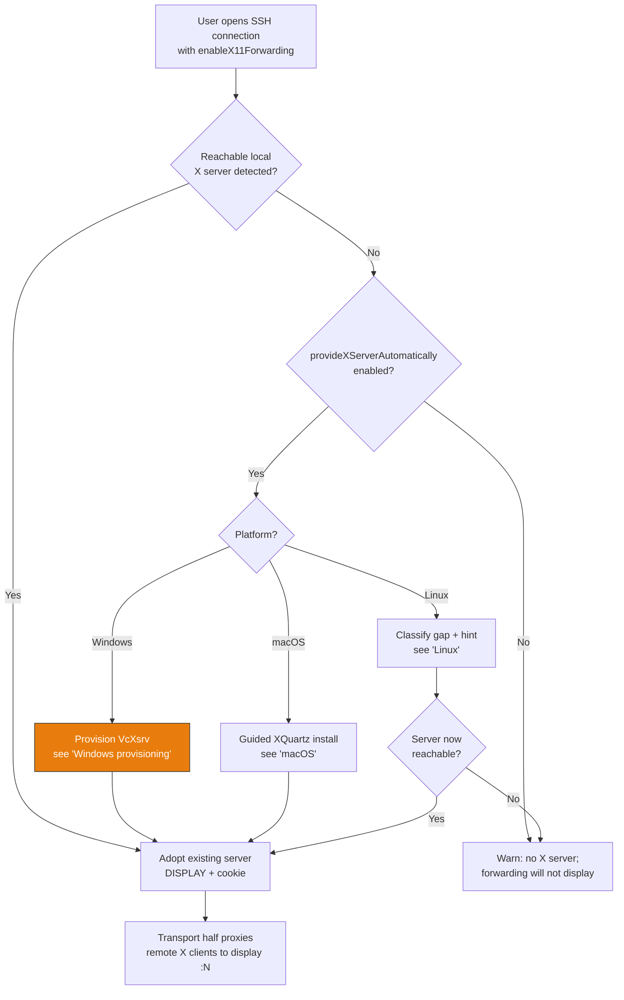
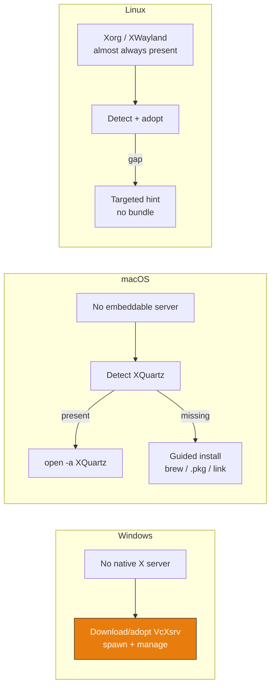
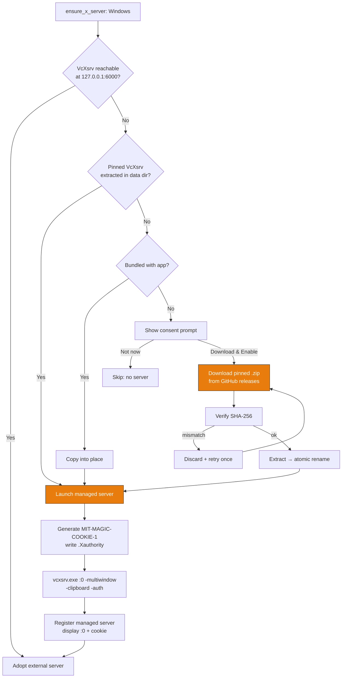
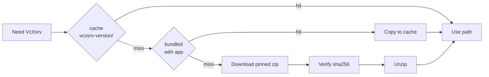
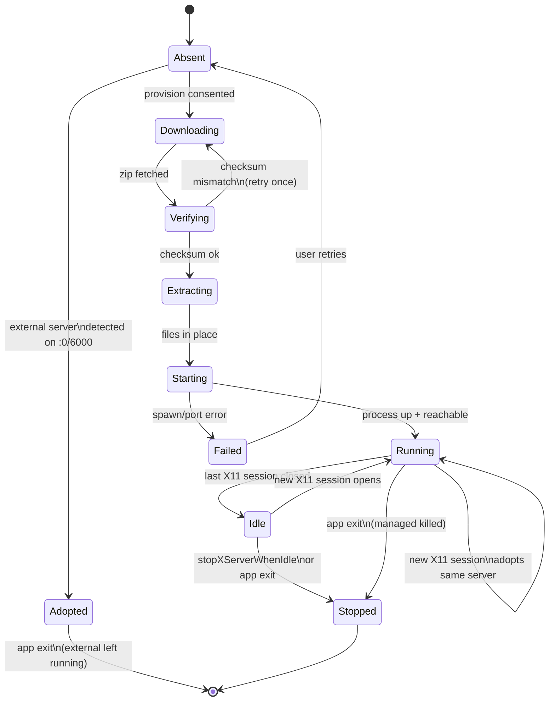
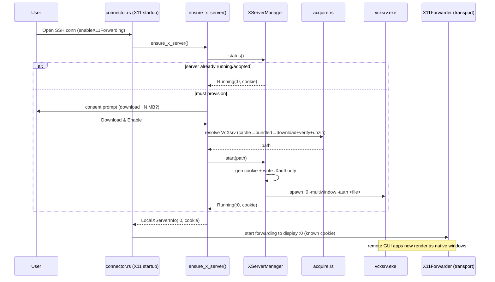
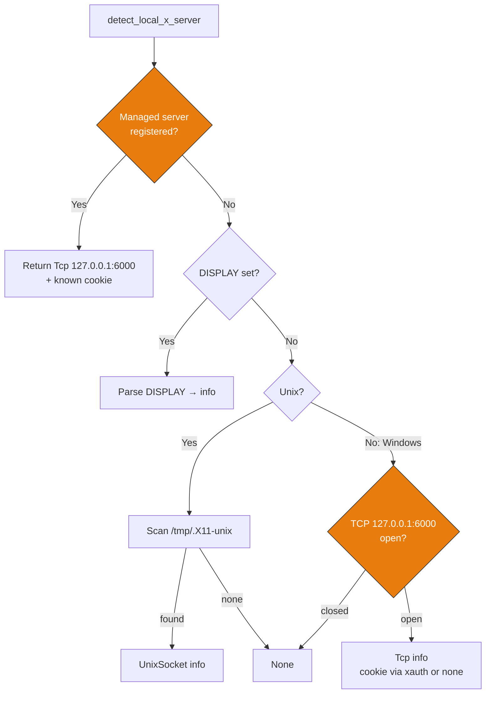
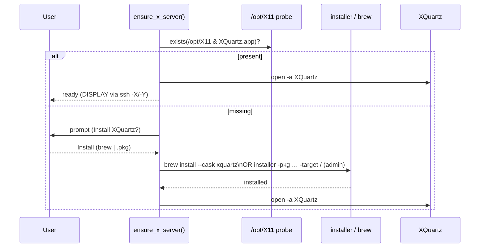
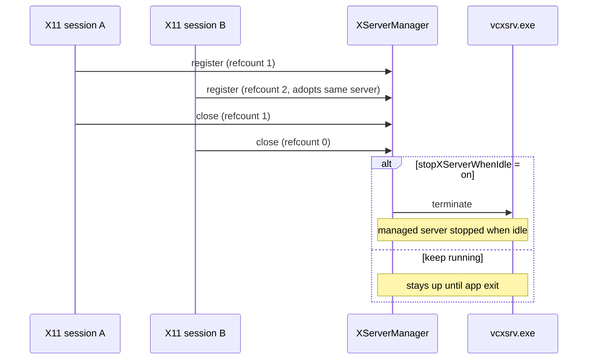
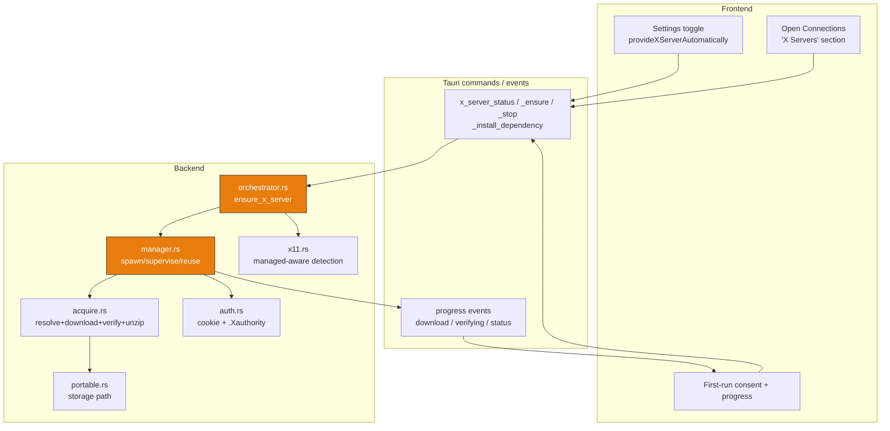

# X Server Provisioning — Behavior

Behavior diagrams for the [x-server-provisioning concept](concept.md). State machines, sequences,
and flows live here; visual layout lives in [`mockups/`](mockups/).

> **Transport note.** termiHub forwards X11 via **reverse SSH port-forwarding**
> (`tcpip_forward`), not the native `x11-req` channel, because russh does not expose `x11-req`.
> That transport half already exists (`core/src/backends/ssh/x11.rs`). These diagrams cover only
> the **provisioning half** — ensuring a local X server exists for that transport to proxy into.

---

## Top-level: ensure a server when an X11 session opens

## Per-platform decision

## Windows provisioning workflow (VcXsrv)

## Binary resolution order (mirrors agent_setup.rs)

## X server lifecycle state machine

## Session open sequence (Windows, managed server)

## Detection decision flow (`detect_local_x_server`)

## macOS guided install sequence

## Idle shutdown sequence

## Architecture overview

## Edge cases

| Scenario                                             | Behavior                                                                        |
| ---------------------------------------------------- | ------------------------------------------------------------------------------- |
| User already runs VcXsrv / X410 / Xming on `:0`      | Adopt it (TCP 6000 probe); do not spawn a duplicate                             |
| Port 6000 taken by a non-X process                   | Pick the next free display number; register that display                        |
| Download fails / checksum mismatch                   | Discard, retry once, then surface an actionable error (never run a bad binary)  |
| Offline, pinned version already cached               | No network call; launch from cache                                              |
| Portable install                                     | Store VcXsrv under `<data>/xserver/…` next to the exe; nothing outside app tree |
| Managed VcXsrv dies mid-session                      | `ensure_running()` restarts it on next use                                      |
| App exit with sessions still open                    | Managed server killed (no orphan); adopted external server left running         |
| macOS without XQuartz, user declines install         | Session opens without GUI display; clear hint shown, no silent failure          |
| Linux Wayland-only session without XWayland          | Detect gap; hint to install `xwayland`; do not bundle                           |
| Flatpak/Snap sandbox blocks the X socket             | Detect; hint to adjust sandbox `--socket=x11`; packaging-level fix              |
| macOS/Linux forwarding on a headless client box      | No local display to forward to; surface that it is a setup limitation           |
| `provideXServerAutomatically` off, no server present | Warn only; never download/install                                               |
