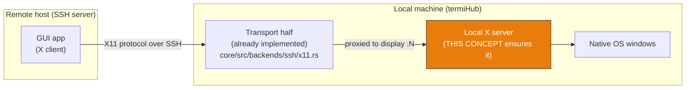

# Provide a Local X Server for SSH X11 Forwarding (MobaXterm-style)

**GitHub Issue:** [#1044](https://github.com/armaxri/termiHub/issues/1044)

> **Folder-form concept** (AI-driven concept workflow). Visual surfaces live in
> [`mockups/`](mockups/), behavior diagrams in [`behavior.md`](behavior.md), and the
> concept↔code reconciliation ledger in [`sync.md`](sync.md). The concept is the source of
> truth; run `/sync-concept x-server-provisioning` to reconcile it with the implementation.

---

## Overview

When a user opens an SSH connection with **X11 forwarding** enabled, a remote GUI program
(`xclock`, `wireshark`, a vendor tool) is an _X client_ — it needs a running **X server on the
local machine** to draw into. Today termiHub forwards the X protocol correctly but assumes the
user has already installed and configured a local X server. On Windows that is almost never true,
and on macOS it requires a manual XQuartz install. The result: X11 forwarding "silently does
nothing" for most users.

This concept adds a subsystem that **ensures a usable local X server exists** before an
X11-forwarding session starts, so remote GUI apps open as **independent native windows** with zero
manual setup — the model popularized by **MobaXterm** ("the app provides the X server; the user
never installs one").

### The two halves of X11 forwarding

The **transport half** exists: `enable_x11_forwarding` sets up reverse port-forwarding, injects
`DISPLAY` + an `xauth` cookie on the remote shell, and proxies X channels to a local display
(`connector.rs`, tested via `tests/docker/ssh-x11/`). This concept specifies the **provisioning
half**: detect-or-provide the local X server the transport half proxies into.

### Goals

- Make remote GUI apps "just work" as native windows when X11 forwarding is enabled — no manual
  X-server install on the common path.
- On **Windows**, bundle/auto-download and manage a real X server (VcXsrv) transparently.
- On **macOS**, detect XQuartz and offer a guided, consent-based install when it is missing.
- On **Linux**, detect the already-present Xorg/XWayland and give a targeted hint only in the rare
  gap cases.
- Reuse an already-running user X server instead of spawning a duplicate.
- Surface the managed server in the **Open Connections** panel so it can be inspected and killed
  like any other connection.

### Non-Goals

- Rendering remote GUIs _inside_ termiHub's own window (they stay independent OS windows).
- Native `x11-req` SSH channel support (the existing reverse-port-forward transport is sufficient;
  see [behavior.md](behavior.md) note).
- Implementing an X server ourselves — **no embeddable X-server library exists**; we ship/spawn an
  external binary (this is what MobaXterm does with its "MobaX" X.Org fork).
- Bundling an X server on macOS or Linux (not possible / not advisable respectively).
- Wayland-native remote display (out of scope; XWayland covers forwarded X11 clients).

---

## UI Interface

The visual surfaces are specified by the mockups — open them in a browser to review layout and
states. This section describes them; the mockups are authoritative for layout.

| Mockup                                                           | Shows                                                                             |
| ---------------------------------------------------------------- | --------------------------------------------------------------------------------- |
| [`mockups/provisioning.html`](mockups/provisioning.html)         | Settings toggle, first-run download-consent prompt, downloading progress, running |
| [`mockups/open-connections.html`](mockups/open-connections.html) | The "X Servers" section in the Open Connections panel (status + stop control)     |

### Settings

A schema-driven setting **`provideXServerAutomatically`** (rendered by `DynamicForm`, default
**on** for Windows) controls whether termiHub may provision an X server. A companion
**`stopXServerWhenIdle`** setting (default **on**) controls whether the managed server is stopped
once the last X11-forwarding session closes. The existing per-connection **X11 Forwarding**
toggle (`enableX11Forwarding`, already in the SSH schema) is unchanged — it decides _whether_ a
connection forwards; the new settings decide _how_ the local server is provided.

### First-run consent prompt

The first time a user opens an X11-forwarding connection on a platform with no reachable X server,
termiHub shows a consent card (mockup `provisioning.html`, state 2) before downloading anything:

- **Windows:** "termiHub needs a local X server to show remote GUI apps. Download and set up
  VcXsrv (~N MB)?" → **Download & Enable** / **Not now**.
- **macOS:** "Remote GUI forwarding needs XQuartz. Install it?" → **Install XQuartz** (Homebrew or
  notarized `.pkg`) / **Open xquartz.org** / **Not now**.
- **Linux:** normally no prompt (server already present). In a gap case (Wayland-only without
  XWayland, sandboxed socket), a targeted hint is shown instead of a download.

Nothing is downloaded or installed without explicit consent.

### Progress & running states

While provisioning, the card shows a labelled progress line — `Downloading… → Verifying… →
Starting…` (mockup `provisioning.html`, state 3) — driven by backend events. Once running, the
card collapses to a confirmation (state 4) and the session proceeds.

### Open Connections panel — "X Servers" section

The managed (or adopted) X server appears as a new **"X Servers"** section in the Open Connections
modal (`OpenConnectionsModal.tsx`), consistent with the panel's role as the one place to inspect
and kill everything. It shows the server kind (managed VcXsrv / adopted external / XQuartz), the
display number, and the count of sessions depending on it, with a **Stop** / **Kill all**
control. See `mockups/open-connections.html`.

### Status feedback

When a GUI forward is active, the status bar shows an unobtrusive indicator (X server running on
`:N`). Debug detail is emitted via `frontendLog` (never `console.*`).

---

## General Handling

Detailed flows, the per-platform decision tree, lifecycle, and detection are diagrammed in
[`behavior.md`](behavior.md). Key rules:

- **Provision is lazy & consent-gated.** Nothing is downloaded/installed until a user opens an
  X11-forwarding connection _and_ confirms the prompt. A user who never uses X11 forwarding never
  downloads an X server.
- **Reuse before spawn.** If a reachable X server already exists (`DISPLAY` set, `/tmp/.X11-unix`
  socket on Unix, or TCP `127.0.0.1:6000` open on Windows), termiHub **adopts** it instead of
  starting its own.
- **One shared managed server per termiHub instance**, reused by all X11 sessions (display `:0`,
  port 6000). Not one server per connection.
- **Idle shutdown (Windows managed server).** When the last X11-forwarding session closes and
  `stopXServerWhenIdle` is on, the managed server is stopped; it is always stopped on app exit
  (no orphan `vcxsrv.exe`).
- **Per-platform strategy:** Windows → provide (bundle/download VcXsrv); macOS → detect + guided
  install XQuartz (cannot bundle); Linux → detect + guide (never bundle).
- **Failure is actionable, never silent.** If provisioning fails at any stage, the session surfaces
  a clear error with a retry/skip path rather than forwarding into a void.
- **Security:** the managed server uses `MIT-MAGIC-COOKIE-1` auth by default (not `-ac`), matching
  the cookie the transport half installs on the remote side.

---

## Preliminary Implementation Details

Based on the current project architecture at concept-creation time; the codebase may evolve before
implementation. Architecture and sequence diagrams live in [`behavior.md`](behavior.md).

### New and Modified Files

| File                                                      | Change                                                                      |
| --------------------------------------------------------- | --------------------------------------------------------------------------- |
| `src-tauri/src/terminal/xserver/mod.rs`                   | **New** — X server provisioning module root                                 |
| `src-tauri/src/terminal/xserver/acquire.rs`               | **New (Windows)** — resolve VcXsrv: cache → bundled → download+verify+unzip |
| `src-tauri/src/terminal/xserver/manager.rs`               | **New** — `XServerManager`: spawn/supervise/reuse/idle-shutdown             |
| `src-tauri/src/terminal/xserver/auth.rs`                  | **New (Windows)** — generate `MIT-MAGIC-COOKIE-1`, write `.Xauthority`      |
| `src-tauri/src/terminal/xserver/orchestrator.rs`          | **New** — `ensure_x_server()` per-platform dispatch                         |
| `core/src/backends/ssh/x11.rs`                            | **Modify** — managed-server-aware detection; Windows TCP:6000 probe         |
| `core/src/backends/ssh/connector.rs`                      | **Modify** — call `ensure_x_server()` in X11 startup (~lines 160–189)       |
| `core/src/backends/ssh/mod.rs`                            | **Modify** — new settings fields in the SSH schema                          |
| `src-tauri/src/commands/xserver.rs`                       | **New** — `x_server_status` / `_ensure` / `_stop` / `_install_dependency`   |
| `src-tauri/src/utils/portable.rs`                         | **Reuse** — `resolve_portable_path` / `AppMode` for storage location        |
| `src/components/OpenConnections/OpenConnectionsModal.tsx` | **Modify** — add "X Servers" `Section`                                      |
| `src/components/Settings/*`                               | **Modify** — surface `provideXServerAutomatically` (schema-driven)          |
| `THIRD_PARTY_LICENSES` / installer                        | **Modify** — GPL-3.0 text + source offer for VcXsrv                         |

### Windows: VcXsrv acquisition (decision)

Deliver VcXsrv as a **pinned, pre-extracted minimal tree** (`vcxsrv.exe` + required DLLs +
`fonts/`) hosted as a **versioned `.zip` on termiHub's own GitHub releases** (same host as agent
binaries). Rationale: avoids running an NSIS installer that writes to `Program Files`, keeps the
install self-contained/portable, and gives a stable pinned URL + checksum we control.

Resolution order mirrors `agent_setup.rs` (`cache → bundled → download`):

1. Already extracted for the pinned version → use it.
2. Bundled alongside the app → copy/use.
3. Download `.zip` → verify SHA-256 → extract → atomic rename into place.

Storage via `resolve_portable_path` / `AppMode`:

- Portable mode → `<data>/xserver/vcxsrv-<version>/`
- Installed mode → `dirs::data_local_dir()/termiHub/xserver/vcxsrv-<version>/`

Pinned table compiled into the app: `{ version, zip_url, sha256 }`. Version-keyed dirs give safe
upgrade + rollback + prune of stale versions. New deps: `zip` (extraction), `sha2` (hashing);
`reqwest` (blocking) and `dirs` already exist.

### Windows: launch, auth, DISPLAY

- Launch a single shared server: `vcxsrv.exe :0 -multiwindow -clipboard -auth <xauthfile>`
  (`-multiwindow` → each remote app is its own native window; `-nowgl` as a GL fallback).
- Generate a per-start `MIT-MAGIC-COOKIE-1` (16 random bytes → 32 hex), write a standard-format
  `.Xauthority` for `localhost:0`, pass via `-auth`, and hand the cookie to the transport half
  directly (bypassing `read_local_xauth_cookie()`, which shells to `xauth` — absent on Windows).
  MVP fallback: `-ac` (loopback-only, documented security tradeoff).

### Detection fix (`x11.rs`)

`detect_local_x_server()` scans `/tmp/.X11-unix` and `read_local_xauth_cookie()` shells to
`xauth` — both no-ops on Windows. Make detection **managed-server-aware**: consult
`XServerManager` first (return `LocalXServerInfo { Tcp("127.0.0.1", 6000+n) }` + known cookie), and
add a Windows TCP `127.0.0.1:6000` probe fallback for user-installed servers. `LocalXConnection`
already has a `Tcp` variant, so no new transport type is needed. Unix behavior stays unchanged.

### macOS & Linux

- **macOS:** detect `/opt/X11` + `XQuartz.app`; if absent, offer `brew install --cask xquartz`,
  a downloaded notarized `.pkg` via `installer -pkg … -target /` (admin prompt), or a deep link.
  If present, `open -a XQuartz` and let `ssh -X/-Y` set `DISPLAY` (`:0` fallback). Cannot bundle.
- **Linux:** the existing `/tmp/.X11-unix` detection covers the normal case. Classify gaps
  (Wayland-only without XWayland, headless, Flatpak/Snap X-socket sandbox) and show a targeted
  hint; never bundle or auto-install.

### Orchestrator & IPC

`ensure_x_server()` dispatches per platform and is called from `connector.rs` X11 startup. Tauri
commands (`x_server_status`, `x_server_ensure`, `x_server_stop`, `x_server_install_dependency`)
and progress events reuse the agent-deploy event shape (`download` / `verifying` / status).

### Licensing (GPL-3.0)

Hosting/redistributing VcXsrv (GPL-3.0) obliges shipping the GPL-3.0 text + a source offer/link
for the exact pinned version (`github.com/marchaesen/vcxsrv`). VcXsrv runs strictly as a **separate
process** (no linking), so termiHub's own license is unaffected — document this boundary; confirm
with counsel before release. XQuartz (MIT + APSL2) needs attribution on the macOS path.

### Implementation Order

1. Windows acquisition (`acquire.rs`) — pinned zip resolve/download/verify/extract, portable-aware.
2. Lifecycle manager (`manager.rs`) — spawn/supervise/reuse/idle-shutdown.
3. Auth + DISPLAY (`auth.rs`) — cookie + `.Xauthority`, wire into transport.
4. Detection fix (`x11.rs`) — managed-aware + Windows TCP probe.
5. Orchestrator + Tauri commands/events; hook into `connector.rs`.
6. UI — settings toggle, first-run/progress prompt, Open Connections "X Servers" section.
7. macOS guided install; Linux detect-and-guide.
8. GPL-3.0 compliance; integration/manual tests + docs.

---

## Implementation Status

Not started — this is a `backlog/` concept authored for issue
[#1044](https://github.com/armaxri/termiHub/issues/1044). Once implementation begins, run
`/sync-concept x-server-provisioning` after each change to keep [`sync.md`](sync.md) current.
