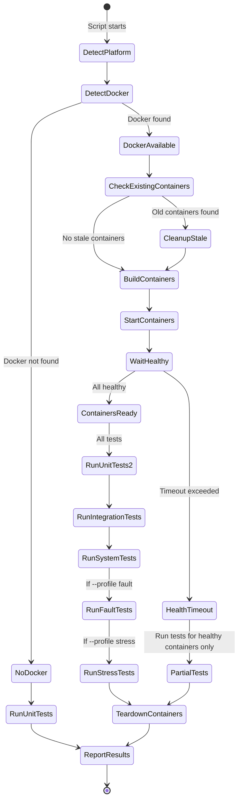
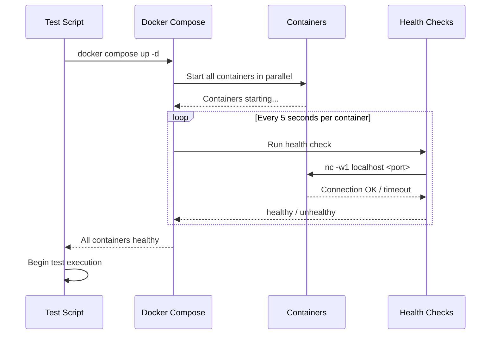
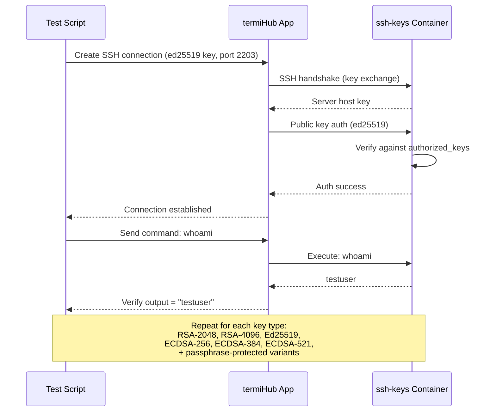
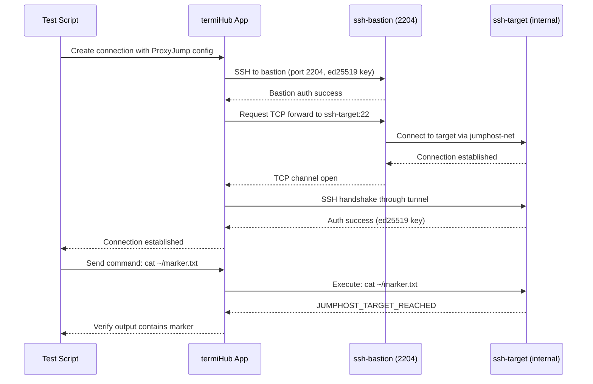
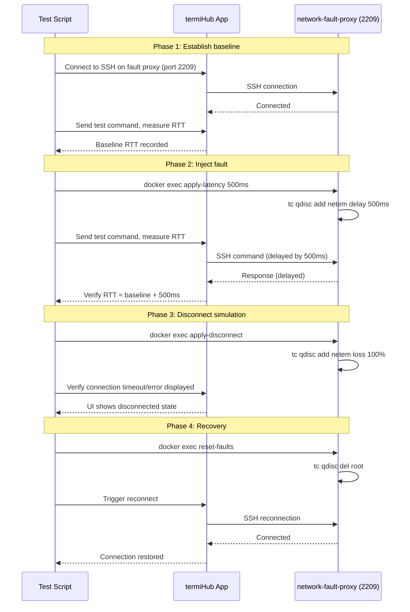
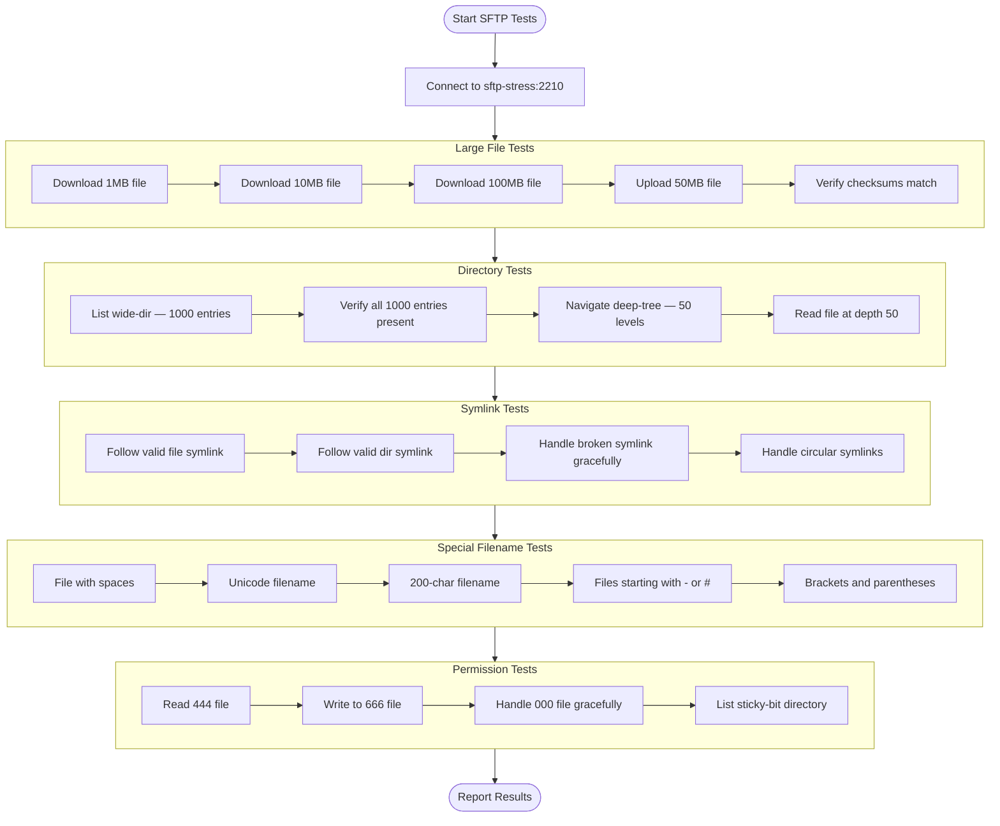
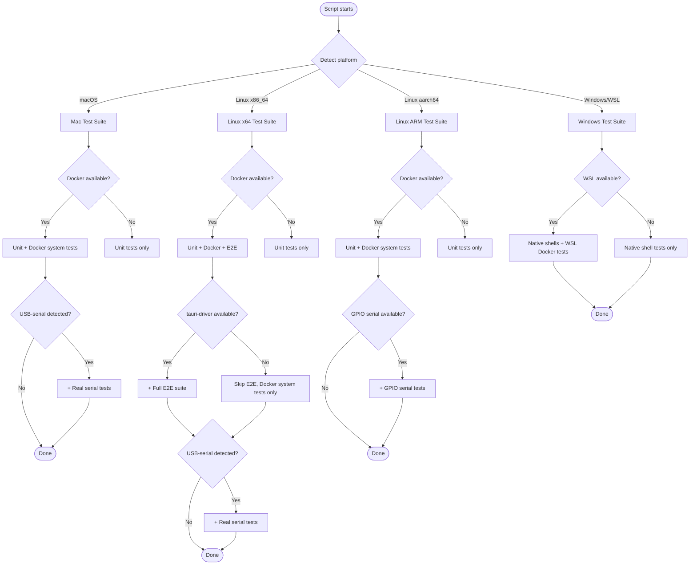
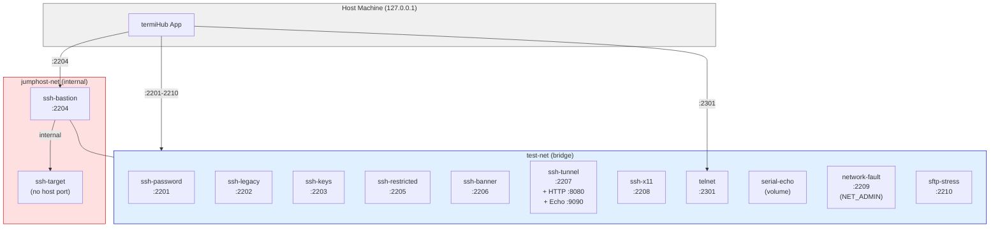

# Comprehensive Test Infrastructure

**GitHub Issue:** [#377](https://github.com/armaxri/termiHub/issues/377)

---

## Overview

termiHub has a solid multi-layer testing foundation: 29 frontend unit test files, 62+ Rust `mod tests`, integration tests for the remote agent, and 11 WebdriverIO E2E test files. However, many critical scenarios still require manual verification — SSH key type variants, network failure recovery, SFTP edge cases, jump host chains, restricted shells, and tunnel forwarding. This concept replaces the majority of those manual tests with automated system tests powered by a fleet of purpose-built Docker containers.

### Motivation

- **Manual testing is slow and unreliable**: The current `docs/testing.md` has 590+ lines of manual test checklists. Each release requires a developer to manually walk through dozens of scenarios across multiple platforms.
- **Protocol edge cases are untested**: SSH banner handling, legacy OpenSSH compatibility, restricted shells, passphrase-protected keys, and ProxyJump chains have zero automated coverage.
- **No network resilience testing**: Connection drops, high latency, packet loss, and bandwidth throttling are entirely untested — yet these are real-world conditions users face daily.
- **SFTP testing is basic**: Only functional CRUD operations are tested. Large files (100 MB), deep directory trees (50 levels), symlinks, permission edge cases, and special filenames are uncovered.
- **No per-machine test orchestration**: Tests run identically everywhere, ignoring each machine's unique capabilities (Docker, real serial hardware, WSL, ARM architecture).

### Goals

- Provide **13 Docker containers** covering SSH variants, telnet, virtual serial, SFTP stress, network fault injection, and X11 forwarding
- Provide **pre-generated SSH test keys** for all key types (RSA 2048/4096, Ed25519, ECDSA 256/384/521) with and without passphrases
- Define **per-machine test scripts** for Mac, Linux (tower + Raspberry Pi), and Windows/WSL
- Implement **network fault injection** via tc/netem for latency, jitter, packet loss, bandwidth throttling, and disconnect simulation
- Implement **SFTP stress testing** with large files, deep trees, symlinks, permissions, and special filenames
- Reduce the manual test surface to **only truly non-automatable scenarios**
- Support **manual trigger only** — no scheduled cron jobs, no self-hosted CI runners

### Non-Goals

- Self-hosted GitHub Actions runners on any machine
- Scheduled/cron-based test execution
- Replacing the existing E2E framework (WebdriverIO + tauri-driver)
- Docker Desktop on Windows (license constraints — WSL Docker is used instead)
- Testing mobile platforms

---

## UI Interface

This is a testing infrastructure concept. The "UI" refers to developer-facing interfaces: test scripts, Docker orchestration, and terminal output.

### Per-Machine Test Scripts

Each machine has a dedicated test orchestration script that auto-detects available infrastructure and runs the appropriate test suite. Scripts produce colored terminal output with clear pass/fail indicators.

```
┌──────────────────────────────────────────────────────────────────┐
│  termiHub System Tests — Linux (Ubuntu Tower)                    │
├──────────────────────────────────────────────────────────────────┤
│                                                                  │
│  Docker Infrastructure                                           │
│    ✓ ssh-password (2201)       started  [0.8s]                   │
│    ✓ ssh-legacy (2202)         started  [1.2s]                   │
│    ✓ ssh-keys (2203)           started  [0.9s]                   │
│    ✓ ssh-jumphost-bastion (2204) started [0.7s]                  │
│    ✓ ssh-jumphost-target       started  [0.6s]                   │
│    ✓ ssh-restricted (2205)     started  [0.8s]                   │
│    ✓ ssh-banner (2206)         started  [0.7s]                   │
│    ✓ ssh-tunnel-target (2207)  started  [1.1s]                   │
│    ✓ ssh-x11 (2208)           started  [1.5s]                    │
│    ✓ telnet-server (2301)      started  [0.5s]                   │
│    ✓ serial-echo               started  [0.3s]                   │
│    ✓ network-fault-proxy (2209) started [0.6s]                   │
│    ✓ sftp-stress (2210)        started  [3.2s]                   │
│                                                                  │
│  Unit Tests                                                      │
│    ✓ cargo test (workspace)    142 passed  [12.4s]               │
│    ✓ pnpm test                  87 passed  [ 4.1s]               │
│                                                                  │
│  System Tests — SSH                                              │
│    ✓ SSH-AUTH-01 password auth           [0.3s]                  │
│    ✓ SSH-AUTH-02 RSA-2048 key            [0.2s]                  │
│    ✓ SSH-AUTH-03 RSA-4096 key            [0.3s]                  │
│    ✓ SSH-AUTH-04 Ed25519 key             [0.2s]                  │
│    ✓ SSH-AUTH-05 ECDSA-256 key           [0.2s]                  │
│    ✓ SSH-AUTH-06 ECDSA-384 key           [0.2s]                  │
│    ✓ SSH-AUTH-07 ECDSA-521 key           [0.2s]                  │
│    ✓ SSH-AUTH-08 passphrase key          [0.4s]                  │
│    ✓ SSH-COMPAT-01 legacy OpenSSH 7.x   [0.5s]                  │
│    ✓ SSH-JUMP-01 2-hop ProxyJump         [0.8s]                  │
│    ✓ SSH-SHELL-01 restricted shell       [0.3s]                  │
│    ✓ SSH-BANNER-01 pre-auth banner       [0.3s]                  │
│    ✓ SSH-TUNNEL-01 local forward         [0.5s]                  │
│    ✓ SSH-TUNNEL-02 dynamic SOCKS         [0.6s]                  │
│    ✓ SSH-X11-01 X11 forwarding           [1.2s]                  │
│                                                                  │
│  System Tests — Network Resilience                               │
│    ✓ NET-FAULT-01 500ms latency          [3.1s]                  │
│    ✓ NET-FAULT-02 10% packet loss        [2.8s]                  │
│    ✓ NET-FAULT-03 disconnect/reconnect   [5.2s]                  │
│    ✓ NET-FAULT-04 56kbps throttle        [4.7s]                  │
│                                                                  │
│  System Tests — SFTP                                             │
│    ✓ SFTP-STRESS-01 100MB transfer       [8.3s]                  │
│    ✓ SFTP-STRESS-02 1000-entry dir       [1.2s]                  │
│    ✓ SFTP-STRESS-03 50-level deep tree   [0.9s]                  │
│    ✓ SFTP-STRESS-04 symlinks             [0.4s]                  │
│    ✓ SFTP-STRESS-05 special filenames    [0.5s]                  │
│    ✓ SFTP-STRESS-06 permissions          [0.3s]                  │
│                                                                  │
│  ── Summary ─────────────────────────────────────────────────    │
│  Total: 38 passed, 0 failed, 0 skipped                          │
│  Duration: 1m 23s                                                │
│                                                                  │
└──────────────────────────────────────────────────────────────────┘
```

### Docker Compose Interface

The container fleet is managed via Docker Compose with profiles:

```
┌──────────────────────────────────────────────────────┐
│  docker compose (default profile)                    │
│                                                      │
│  ┌─────────────┐  ┌─────────────┐  ┌────────────┐   │
│  │ssh-password  │  │ssh-legacy   │  │ssh-keys    │   │
│  │:2201         │  │:2202        │  │:2203       │   │
│  └─────────────┘  └─────────────┘  └────────────┘   │
│  ┌─────────────┐  ┌─────────────┐  ┌────────────┐   │
│  │ssh-bastion   │  │ssh-restricted│ │ssh-banner  │   │
│  │:2204         │  │:2205        │  │:2206       │   │
│  └──────┬──────┘  └─────────────┘  └────────────┘   │
│         │         ┌─────────────┐  ┌────────────┐   │
│         │         │ssh-tunnel   │  │ssh-x11     │   │
│         │         │:2207        │  │:2208       │   │
│         │         └─────────────┘  └────────────┘   │
│    jumphost-net                                      │
│    (internal)     ┌─────────────┐  ┌────────────┐   │
│  ┌─────────────┐  │telnet       │  │serial-echo │   │
│  │ssh-target   │  │:2301        │  │(volume)    │   │
│  │(no host port)│ └─────────────┘  └────────────┘   │
│  └─────────────┘                                     │
│                                                      │
│  --profile fault       --profile stress              │
│  ┌─────────────┐       ┌────────────┐                │
│  │network-fault│       │sftp-stress │                │
│  │:2209        │       │:2210       │                │
│  └─────────────┘       └────────────┘                │
└──────────────────────────────────────────────────────┘
```

---

## General Handling

### Machine Inventory & Roles

| Machine           | OS                 | Network         | Docker       | Serial HW     | Role                                          |
| ----------------- | ------------------ | --------------- | ------------ | ------------- | --------------------------------------------- |
| **Mac** (private) | macOS              | Private network | Yes          | USB-to-serial | Dev machine, Docker system tests, real serial |
| **Ubuntu tower**  | Ubuntu Linux       | Company network | Yes          | USB-to-serial | Primary Linux test server, full suite         |
| **Raspberry Pi**  | Ubuntu Linux (ARM) | Company network | Yes          | GPIO serial   | ARM architecture testing                      |
| **Windows PC**    | Windows + WSL2     | Company network | Yes (in WSL) | None          | Windows shell testing, WSL Docker tests       |

> **Network isolation**: The Mac is on a private network, separate from the three company machines. The company machines (Windows, Ubuntu tower, Raspberry Pi) can communicate with each other on the company network.

### Test Execution Workflow

1. **Developer pulls latest code** on the target machine
2. **Runs the per-machine test script**: `./scripts/test-system-<platform>.sh`
3. **Script auto-detects capabilities**: Docker availability, serial hardware, platform
4. **Script starts required Docker containers** (with health checks)
5. **Runs all applicable test suites** in order: unit → integration → system
6. **Tears down Docker containers** on completion (unless `--keep-infra`)
7. **Outputs summary** with pass/fail counts and duration

### Container Lifecycle: Start All At Once

All containers are started together before tests begin, rather than per-test or per-suite. Rationale:

- **Idle containers are cheap**: Each SSH server uses ~20 MB RAM and near-zero CPU when idle. All 13 containers total ~300 MB — negligible even on the Raspberry Pi (4 GB RAM).
- **Startup overhead is expensive**: Container startup takes 1-3s each, plus health checks (5s interval, 3 retries). Starting/stopping per test would add 5-15s of wait time per scenario, turning a 1-2 minute test run into 10+ minutes.
- **Docker Compose profiles provide opt-in granularity**: The `fault` and `stress` profiles let you skip the heavier containers (network fault proxy, SFTP stress with 120 MB test data) when you only need core testing. `docker compose up -d` starts just the essentials.

### Test Categories

#### Category 1: Unit Tests (all machines, no Docker)

Run everywhere, test pure logic in isolation.

- Frontend: Vitest (React components, hooks, stores, utils)
- Backend: `cargo test` (terminal backends, config parsing, protocol handling)
- Agent: `cargo test -p termihub-agent` (JSON-RPC dispatch, session management)

#### Category 2: Integration Tests (all machines with Docker)

Test component interaction with real services.

- Agent shell integration: Daemon protocol, input/output, resize, detach/reconnect
- Agent Docker integration: Container sessions
- SSH connectivity: Each key type against the `ssh-keys` container
- SSH legacy compatibility: Against the `ssh-legacy` container

#### Category 3: System/E2E Tests (Linux with Docker + tauri-driver)

Full application tests via WebdriverIO. Only possible on Linux (and Windows with tauri-driver). macOS requires Docker-based execution (ADR-5).

- All existing E2E suites (UI, local, infrastructure, performance)
- New system test suites (see Test Suites section below)

#### Category 4: Network Resilience Tests (machines with Docker)

Requires the `network-fault-proxy` container with `NET_ADMIN` capability.

- Latency scenarios (100ms, 500ms, 2000ms)
- Packet loss (5%, 10%, 50%)
- Bandwidth throttling (56kbps, 1Mbps)
- Total disconnect and reconnect
- Jitter simulation

#### Category 5: Stress Tests (machines with Docker)

Requires the `sftp-stress` container.

- Large file transfer (1 MB, 10 MB, 100 MB)
- Wide directory listing (1000 entries)
- Deep directory traversal (50 levels)
- Special filenames (Unicode, spaces, long names)
- Symlink handling (valid, broken, circular)
- Permission edge cases

### Per-Machine Test Matrix

```
                          Mac    Ubuntu   Pi    Windows
                         (priv)  Tower  (ARM)   (WSL)
Unit tests (frontend)     ✓       ✓      ✓       ✓
Unit tests (backend)      ✓       ✓      ✓       ✓
Unit tests (agent)        ✓       ✓      ✓       ✓
Integration (agent)       ✓       ✓      ✓       ✓¹
SSH auth (all key types)  ✓       ✓      ✓       ✓¹
SSH legacy compat         ✓       ✓      ✓       ✓¹
SSH jump host chain       ✓       ✓      ✓       ✓¹
SSH restricted shell      ✓       ✓      ✓       ✓¹
SSH banner handling       ✓       ✓      ✓       ✓¹
SSH tunnel forwarding     ✓       ✓      ✓       ✓¹
SSH X11 forwarding        ✓       ✓      ✓       ✓¹
Telnet                    ✓       ✓      ✓       ✓¹
Serial (virtual)          ✓       ✓      ✓       -²
Serial (real hardware)    ✓       ✓      ✓³      -
Network fault injection   ✓       ✓      ✓       ✓¹
SFTP stress               ✓       ✓      ✓       ✓¹
E2E (tauri-driver)        ✓⁴      ✓      ✓⁵      -⁶
Local shell (native)      ✓       ✓      ✓       ✓
PowerShell/cmd.exe        -       -      -       ✓
WSL shell detection       -       -      -       ✓
Performance (40 terms)    ✓⁴      ✓      -⁷      -

¹ Via Docker in WSL2
² WSL has no virtual serial port support (no socat PTY)
³ Raspberry Pi has GPIO serial (UART) for additional real serial testing
⁴ Via Docker (macOS has no native tauri-driver, ADR-5)
⁵ Native tauri-driver on ARM Linux (if supported) or Docker
⁶ tauri-driver not available on Windows yet in CI pipeline
⁷ Pi has limited resources — skip heavy performance tests
```

### Edge Cases & Error Handling

- **Docker not available**: Script detects missing Docker and runs only unit tests, skipping Docker-dependent categories with a clear warning
- **Port conflicts**: All test containers bind to `127.0.0.1` on non-standard ports (2201-2210, 2301) to avoid conflicts with real services
- **ARM image compatibility**: All Dockerfiles use `ubuntu:24.04` which supports both `amd64` and `arm64` architectures natively
- **WSL Docker access**: Windows test script detects WSL and executes Docker commands inside WSL via `wsl docker compose ...`
- **Health check timeout**: All SSH containers have health checks (5s interval, 3 retries). Script waits for all containers to be healthy before running tests.
- **Stale containers**: Script checks for existing containers and offers to remove them before starting fresh
- **Build failures**: If container build fails (e.g., network issues pulling base images), skip that container's tests and report the failure

---

## States & Sequences

### Test Execution Lifecycle



### Docker Container Startup Sequence



### SSH Key Authentication Test Flow



### Jump Host Chain Test Flow



### Network Fault Injection Test Flow



### SFTP Stress Test Flow



### Per-Machine Test Decision Flow



### Container Network Topology



---

## Test Suites — Detailed Scenarios

### SSH Authentication Suite

| ID          | Scenario                | Container         | Auth Method | Key                    |
| ----------- | ----------------------- | ----------------- | ----------- | ---------------------- |
| SSH-AUTH-01 | Password login          | ssh-password:2201 | password    | —                      |
| SSH-AUTH-02 | RSA-2048 key            | ssh-keys:2203     | publickey   | `rsa_2048`             |
| SSH-AUTH-03 | RSA-4096 key            | ssh-keys:2203     | publickey   | `rsa_4096`             |
| SSH-AUTH-04 | Ed25519 key             | ssh-keys:2203     | publickey   | `ed25519`              |
| SSH-AUTH-05 | ECDSA-256 key           | ssh-keys:2203     | publickey   | `ecdsa_256`            |
| SSH-AUTH-06 | ECDSA-384 key           | ssh-keys:2203     | publickey   | `ecdsa_384`            |
| SSH-AUTH-07 | ECDSA-521 key           | ssh-keys:2203     | publickey   | `ecdsa_521`            |
| SSH-AUTH-08 | RSA-2048 + passphrase   | ssh-keys:2203     | publickey   | `rsa_2048_passphrase`  |
| SSH-AUTH-09 | Ed25519 + passphrase    | ssh-keys:2203     | publickey   | `ed25519_passphrase`   |
| SSH-AUTH-10 | ECDSA-256 + passphrase  | ssh-keys:2203     | publickey   | `ecdsa_256_passphrase` |
| SSH-AUTH-11 | Wrong password (reject) | ssh-password:2201 | password    | —                      |
| SSH-AUTH-12 | Wrong key (reject)      | ssh-keys:2203     | publickey   | non-matching           |

### SSH Compatibility Suite

| ID            | Scenario                    | Container       | Verification                         |
| ------------- | --------------------------- | --------------- | ------------------------------------ |
| SSH-COMPAT-01 | Legacy OpenSSH 7.x password | ssh-legacy:2202 | Login + `ssh -V` output              |
| SSH-COMPAT-02 | Legacy OpenSSH 7.x key auth | ssh-legacy:2202 | Key login succeeds                   |
| SSH-COMPAT-03 | Banner display              | ssh-banner:2206 | Terminal output contains banner text |
| SSH-COMPAT-04 | MOTD display                | ssh-banner:2206 | Terminal output contains MOTD text   |

### SSH Advanced Suite

| ID            | Scenario                   | Container             | Verification                               |
| ------------- | -------------------------- | --------------------- | ------------------------------------------ |
| SSH-JUMP-01   | 2-hop ProxyJump            | bastion:2204 → target | Read marker file                           |
| SSH-SHELL-01  | Restricted shell (rbash)   | ssh-restricted:2205   | Limited commands work, `cd` fails          |
| SSH-SHELL-02  | Unrestricted comparison    | ssh-restricted:2205   | `freeuser` has full shell                  |
| SSH-TUNNEL-01 | Local port forward         | ssh-tunnel:2207       | Tunnel to internal HTTP → "TUNNEL_TEST_OK" |
| SSH-TUNNEL-02 | Dynamic SOCKS proxy        | ssh-tunnel:2207       | SOCKS proxy reaches internal HTTP          |
| SSH-TUNNEL-03 | TCP echo via tunnel        | ssh-tunnel:2207       | Echo server round-trip via tunnel          |
| SSH-X11-01    | X11 forwarding DISPLAY set | ssh-x11:2208          | Run `test-x11.sh` → "X11_FORWARDING_OK"    |
| SSH-X11-02    | X11 app launch             | ssh-x11:2208          | `xdpyinfo` succeeds                        |

### Telnet Suite

| ID     | Scenario               | Container   | Verification                 |
| ------ | ---------------------- | ----------- | ---------------------------- |
| TEL-01 | Connect + authenticate | telnet:2301 | Login with testuser/testpass |
| TEL-02 | Banner display         | telnet:2301 | Banner text visible          |
| TEL-03 | Command execution      | telnet:2301 | `whoami` returns testuser    |

### Serial Port Suite

| ID          | Scenario                     | Container/HW         | Verification                   |
| ----------- | ---------------------------- | -------------------- | ------------------------------ |
| SER-VIRT-01 | Echo mode (send = receive)   | serial-echo (port A) | Send string, verify echo       |
| SER-VIRT-02 | Uppercase mode               | serial-echo (port C) | Send "hello", verify "HELLO"   |
| SER-VIRT-03 | Binary data round-trip       | serial-echo (port A) | Send binary, verify match      |
| SER-HW-01   | Detect USB-to-serial adapter | Real hardware        | Adapter appears in device list |
| SER-HW-02   | Baud rate configuration      | Real hardware        | Connect at 9600, 115200        |
| SER-HW-03   | Data transmission            | Real hardware        | Loopback or echo device test   |

### Network Resilience Suite

| ID           | Scenario                    | Fault         | Verification                            |
| ------------ | --------------------------- | ------------- | --------------------------------------- |
| NET-FAULT-01 | High latency SSH            | 500ms delay   | Session works, commands delayed         |
| NET-FAULT-02 | Extreme latency             | 2000ms delay  | Session works, UI shows slow indicator  |
| NET-FAULT-03 | Moderate packet loss        | 10% loss      | Session recovers, some retransmissions  |
| NET-FAULT-04 | Severe packet loss          | 50% loss      | Session degrades gracefully             |
| NET-FAULT-05 | Bandwidth throttle (dialup) | 56kbps        | Large output slowed, no crash           |
| NET-FAULT-06 | Bandwidth throttle (1Mbps)  | 1Mbps         | Normal operation with slight delay      |
| NET-FAULT-07 | Full disconnect             | 100% loss     | UI shows disconnected, no hang          |
| NET-FAULT-08 | Disconnect + recovery       | 100% → 0%     | Reconnect succeeds                      |
| NET-FAULT-09 | Jitter simulation           | 200ms ± 100ms | Session stable despite variable latency |
| NET-FAULT-10 | Packet corruption           | 5% corrupt    | SSH handles corruption gracefully       |

### SFTP Stress Suite

| ID             | Scenario                 | Container        | Verification                 |
| -------------- | ------------------------ | ---------------- | ---------------------------- |
| SFTP-STRESS-01 | Download 1 MB file       | sftp-stress:2210 | Size + checksum match        |
| SFTP-STRESS-02 | Download 10 MB file      | sftp-stress:2210 | Size + checksum match        |
| SFTP-STRESS-03 | Download 100 MB file     | sftp-stress:2210 | Size + checksum match        |
| SFTP-STRESS-04 | Upload 50 MB file        | sftp-stress:2210 | Round-trip verify            |
| SFTP-STRESS-05 | List 1000-entry dir      | sftp-stress:2210 | All 1000 entries returned    |
| SFTP-STRESS-06 | Navigate 50-level tree   | sftp-stress:2210 | Read file at depth 50        |
| SFTP-STRESS-07 | Valid file symlink       | sftp-stress:2210 | Follow link, read content    |
| SFTP-STRESS-08 | Valid dir symlink        | sftp-stress:2210 | Follow link, list contents   |
| SFTP-STRESS-09 | Broken symlink           | sftp-stress:2210 | Graceful error, no crash     |
| SFTP-STRESS-10 | Circular symlinks        | sftp-stress:2210 | Detected, no infinite loop   |
| SFTP-STRESS-11 | Unicode filename         | sftp-stress:2210 | File accessible and readable |
| SFTP-STRESS-12 | Filename with spaces     | sftp-stress:2210 | File accessible and readable |
| SFTP-STRESS-13 | 200-char filename        | sftp-stress:2210 | File accessible              |
| SFTP-STRESS-14 | Hidden files (.dotfiles) | sftp-stress:2210 | Visible when option enabled  |
| SFTP-STRESS-15 | Permission 000 file      | sftp-stress:2210 | Graceful "access denied"     |
| SFTP-STRESS-16 | Permission 000 directory | sftp-stress:2210 | Graceful "access denied"     |

### Windows/WSL Suite

| ID           | Scenario            | Platform       | Verification             |
| ------------ | ------------------- | -------------- | ------------------------ |
| WIN-SHELL-01 | PowerShell session  | Windows native | `$PSVersionTable` output |
| WIN-SHELL-02 | cmd.exe session     | Windows native | `ver` output             |
| WIN-WSL-01   | WSL bash session    | WSL            | `uname -a` shows Linux   |
| WIN-WSL-02   | WSL shell detection | WSL            | Correct shell detected   |
| WIN-WSL-03   | WSL Docker tests    | WSL Docker     | SSH containers reachable |

### Monitoring Suite

| ID     | Scenario                | Container         | Verification                 |
| ------ | ----------------------- | ----------------- | ---------------------------- |
| MON-01 | CPU stats collection    | ssh-password:2201 | CPU percentages returned     |
| MON-02 | Memory stats collection | ssh-password:2201 | Memory usage returned        |
| MON-03 | Disk stats collection   | ssh-password:2201 | Disk usage returned          |
| MON-04 | Stats under load        | ssh-password:2201 | Stress + collect, no timeout |

---

## What Cannot Be Automated

The following scenarios **cannot be covered by this test infrastructure** and must remain manual:

### Platform-Specific Visual Behavior

| Scenario                                          | Reason                                    |
| ------------------------------------------------- | ----------------------------------------- |
| macOS visual rendering (fonts, DPI, Retina)       | No tauri-driver on macOS (ADR-5)          |
| macOS native Keychain prompts                     | Requires interactive user consent         |
| macOS key repeat rate fix verification            | Requires sustained physical key press     |
| Windows visual rendering (DPI scaling, ClearType) | No tauri-driver in current CI for Windows |
| System tray icon rendering and behavior           | Platform-native, not WebView-accessible   |
| Touch/trackpad gestures                           | No HID simulation in test framework       |

### Hardware-Specific Behavior

| Scenario                                 | Reason                                            |
| ---------------------------------------- | ------------------------------------------------- |
| USB-to-serial hot-plug detection         | Requires physical device insertion/removal        |
| Bluetooth serial pairing                 | Requires real Bluetooth hardware                  |
| Real serial device baud rate negotiation | Device-specific behavior varies                   |
| Raspberry Pi GPIO serial (UART)          | Platform-specific hardware, not Docker-accessible |

### User Experience & Interaction

| Scenario                                     | Reason                                             |
| -------------------------------------------- | -------------------------------------------------- |
| First-launch onboarding wizard               | One-time flow, hard to test repeatedly             |
| Auto-update download and install             | Requires real update server + platform installer   |
| Drag-and-drop between tabs (visual feedback) | WebDriver drag simulation is unreliable            |
| Right-click context menus (native)           | Platform-native menus not accessible via WebDriver |
| Clipboard integration (copy/paste)           | Platform-specific clipboard access varies          |
| Accessibility (screen reader compatibility)  | Requires real screen reader testing                |

### Network & Infrastructure

| Scenario                                     | Reason                                                    |
| -------------------------------------------- | --------------------------------------------------------- |
| Real SSH server fingerprint change detection | Requires persistent known_hosts state across runs         |
| SSH agent forwarding with real ssh-agent     | Requires host ssh-agent with real keys loaded             |
| Real DNS resolution failures                 | Docker DNS is reliable, can't simulate real DNS issues    |
| Corporate proxy/firewall behavior            | Requires real corporate network infrastructure            |
| Cross-machine SSH (tower ↔ Pi ↔ Windows)     | Company network configuration, not reproducible in Docker |

---

## Preliminary Implementation Details

### File Structure

```
tests/
  docker/
    docker-compose.yml              # Main compose file (13 containers)
    README.md                       # Usage documentation
    ssh-password/Dockerfile         # Ubuntu 24.04, OpenSSH latest, password auth
    ssh-legacy/Dockerfile           # Ubuntu 18.04, OpenSSH 7.x, password + keys
    ssh-keys/Dockerfile             # Ubuntu 24.04, key auth only (all types)
    ssh-jumphost-bastion/Dockerfile # Bastion with TCP forwarding
    ssh-jumphost-target/Dockerfile  # Target on internal network only
    ssh-restricted/Dockerfile       # rbash restricted shell
    ssh-banner/Dockerfile           # Pre-auth banner + MOTD
    ssh-tunnel-target/Dockerfile    # SSH + internal HTTP/echo servers
    ssh-x11/Dockerfile              # SSH + X11 apps (xterm, xclock, xeyes)
    telnet-server/Dockerfile        # Telnet via xinetd
    serial-echo/                    # Virtual serial ports + echo servers
      Dockerfile
      echo-server.py               # Multi-mode serial echo (echo/uppercase/hex/slow)
      start.sh                     # socat port creation + echo server startup
    sftp-stress/                    # Pre-populated SFTP test data
      Dockerfile
      generate-test-data.sh         # Build-time data generation script
    network-fault-proxy/            # tc/netem fault injection
      Dockerfile
      fault-control.sh              # Fault control CLI (apply-latency, etc.)
  fixtures/
    ssh-keys/                       # Pre-generated test SSH keys
      README.md
      authorized_keys               # Composite of all public keys
      rsa_2048, rsa_2048.pub
      rsa_4096, rsa_4096.pub
      ed25519, ed25519.pub
      ecdsa_256, ecdsa_256.pub
      ecdsa_384, ecdsa_384.pub
      ecdsa_521, ecdsa_521.pub
      rsa_2048_passphrase, rsa_2048_passphrase.pub
      ed25519_passphrase, ed25519_passphrase.pub
      ecdsa_256_passphrase, ecdsa_256_passphrase.pub
scripts/
  test-system-mac.sh                # Mac test orchestration
  test-system-linux.sh              # Linux test orchestration (tower + Pi)
  test-system-windows.sh            # Windows/WSL test orchestration
```

### Shared SSH Key Distribution

All containers that need key-based auth use Docker BuildKit's `additional_contexts` feature to reference the shared `tests/fixtures/ssh-keys/` directory. In Dockerfiles:

```dockerfile
COPY --from=keys authorized_keys /home/testuser/.ssh/authorized_keys
```

In `docker-compose.yml`:

```yaml
build:
  context: ./ssh-keys
  additional_contexts:
    keys: ../fixtures/ssh-keys
```

This avoids duplicating the keys across container directories while keeping each Dockerfile self-contained.

### Container Port Allocation

All containers bind to `127.0.0.1` to prevent external access:

```
2201  ssh-password        (default profile)
2202  ssh-legacy          (default profile)
2203  ssh-keys            (default profile)
2204  ssh-jumphost-bastion (default profile)
2205  ssh-restricted      (default profile)
2206  ssh-banner          (default profile)
2207  ssh-tunnel-target   (default profile)
2208  ssh-x11             (default profile)
2209  network-fault-proxy (fault profile)
2210  sftp-stress         (stress profile)
2301  telnet-server       (default profile)
```

### Test Script Architecture

Each per-machine script follows the same pattern:

```bash
#!/bin/bash
# 1. Detect platform capabilities
# 2. Parse arguments (--skip-build, --keep-infra, --profile)
# 3. Start Docker containers (if Docker available)
# 4. Wait for health checks
# 5. Run test categories in order
# 6. Collect results
# 7. Tear down containers (unless --keep-infra)
# 8. Print summary with pass/fail counts
```

Platform-specific differences:

- **Mac**: Runs Docker natively, detects USB-to-serial via `system_profiler SPUSBDataType`
- **Linux**: Runs Docker natively, detects tauri-driver for E2E, detects serial via `/dev/ttyUSB*` or `/dev/ttyACM*`. On ARM (Pi), skips heavy performance tests.
- **Windows**: Invokes Docker via `wsl docker compose`, runs native shell tests (PowerShell, cmd.exe) directly, detects WSL distributions for WSL shell testing.

### Integration with Existing Infrastructure

The new test containers complement (not replace) the existing `examples/docker/` infrastructure:

- **`examples/docker/`** — Remains the quick-start dev environment (single `test-target` container with SSH + telnet)
- **`tests/docker/`** — Comprehensive test fleet for system testing with fine-grained per-scenario containers
- **`scripts/test-system.sh`** — Existing script continues to work unchanged (uses `examples/docker/`)
- **`scripts/test-system-<platform>.sh`** — New scripts use `tests/docker/` for comprehensive testing

### Connection to Existing E2E Tests

The new containers can be wired into the existing WebdriverIO E2E infrastructure tests by updating the E2E helper configuration to point at the new ports. The existing `tests/e2e/helpers/infrastructure.js` already supports configurable host/port, so the new containers can be used as drop-in replacements or additions.

### Estimated Container Resource Usage

| Container             | Memory                | Disk (image) | CPU     |
| --------------------- | --------------------- | ------------ | ------- |
| SSH containers (each) | ~20 MB                | ~80 MB       | Minimal |
| Telnet                | ~15 MB                | ~70 MB       | Minimal |
| Serial echo           | ~10 MB                | ~50 MB       | Minimal |
| SFTP stress           | ~30 MB + ~120 MB data | ~200 MB      | Minimal |
| Network fault proxy   | ~20 MB                | ~90 MB       | Minimal |
| **Total (all 13)**    | **~300 MB**           | **~1.2 GB**  | **Low** |

The Raspberry Pi (4 GB RAM) can run all containers simultaneously. The total disk usage is modest and the CPU requirements are negligible since containers idle except when actively handling test connections.

### ARM Compatibility

All Dockerfiles use `ubuntu:24.04` and `ubuntu:18.04` base images, which provide official `arm64` manifests. No x86-specific packages are used. The `socat`, `openssh-server`, and Python packages are all available natively on ARM.

The only exception: `tauri-driver` may not have ARM binaries. On the Raspberry Pi, E2E tests that require tauri-driver should be skipped. System tests that use SSH/SFTP directly (without the app UI) work on ARM.

### Windows/WSL Docker Integration

The Windows test script detects WSL and routes Docker commands through it:

```bash
# Detect WSL
if command -v wsl &>/dev/null; then
    DOCKER_CMD="wsl docker"
    COMPOSE_CMD="wsl docker compose"
else
    DOCKER_CMD="docker"
    COMPOSE_CMD="docker compose"
fi

# Start containers (paths translated automatically by WSL)
$COMPOSE_CMD -f tests/docker/docker-compose.yml up -d
```

Port bindings on `127.0.0.1` inside WSL are accessible from the Windows host, allowing the Windows-native termiHub app to connect to Docker containers running in WSL.
