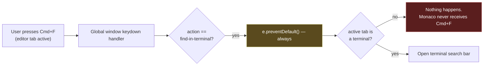
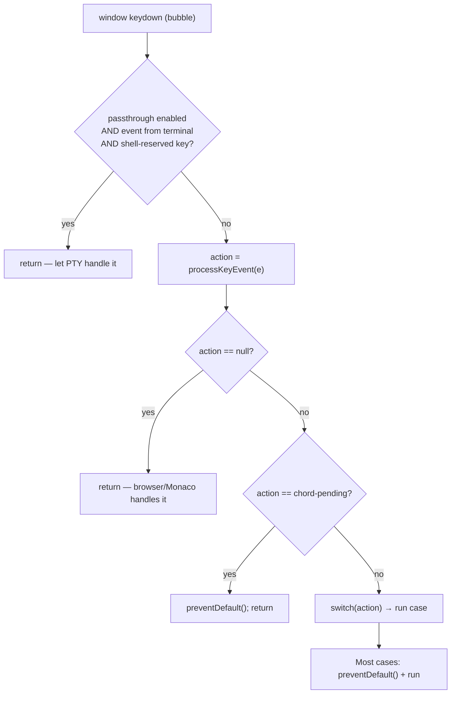
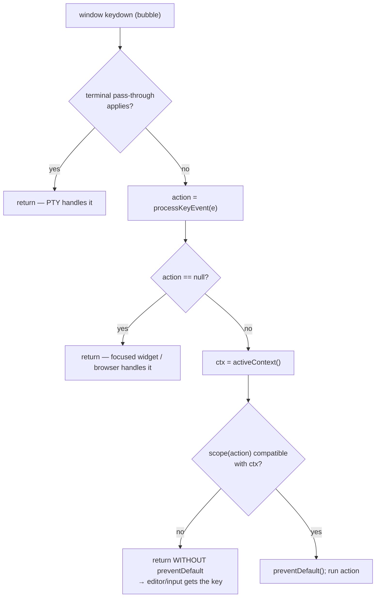
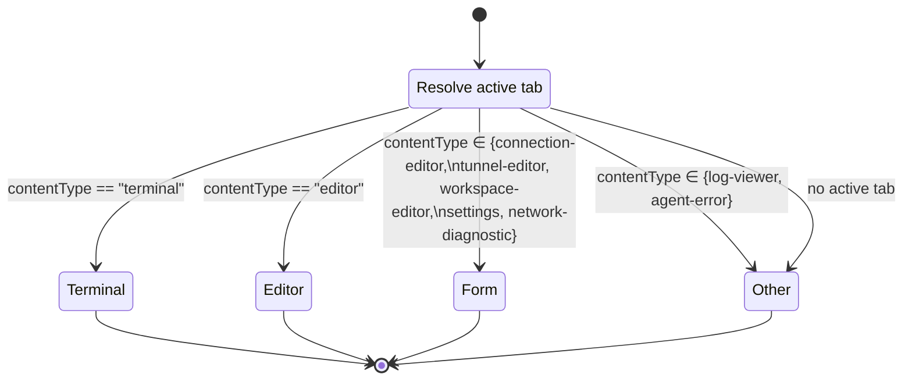
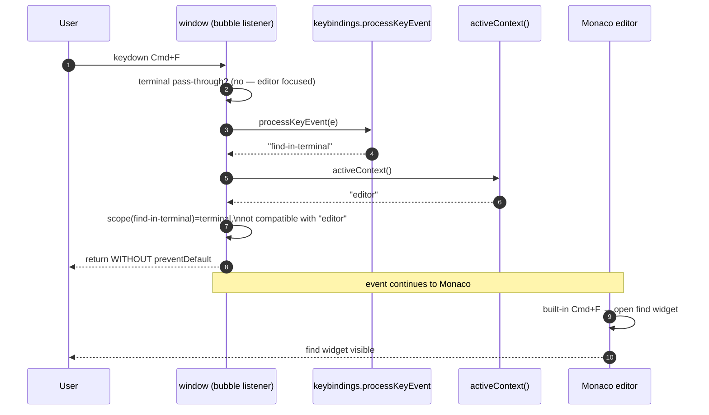
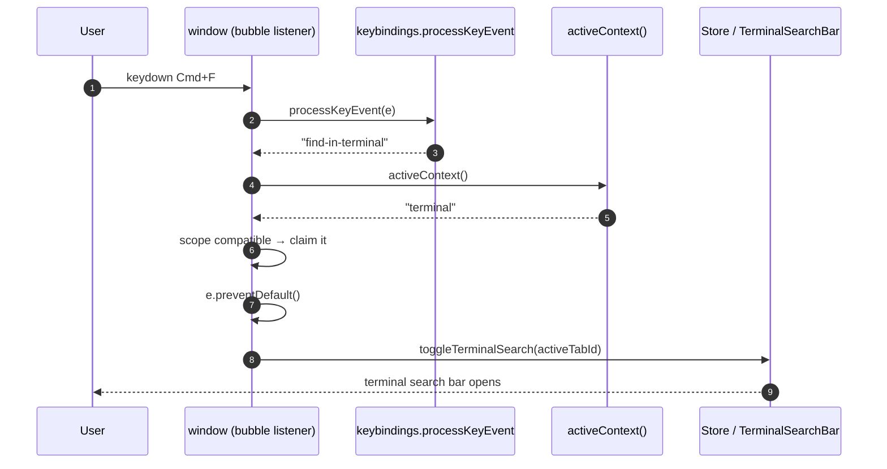
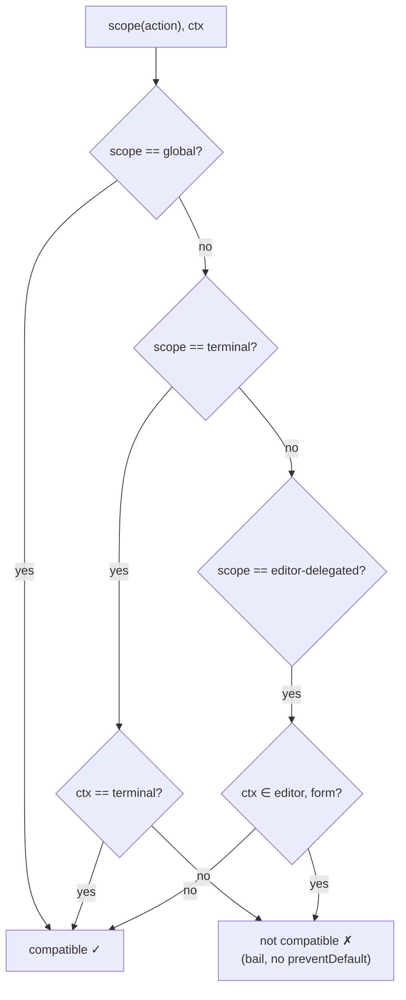

# Concept: Context-Aware Keyboard-Shortcut Routing

> **GitHub Issue:** [#787](https://github.com/armaxri/termiHub/issues/787) — _Concept: context-aware keyboard-shortcut routing (terminal vs Monaco editor tabs)_
>
> **Status:** Concept (design only — no implementation)
>
> **Author:** Generated during concept design for #787

---

## Overview

termiHub dispatches every application keyboard shortcut from a **single global
`window` keydown handler** (`src/hooks/useKeyboardShortcuts.ts`). That handler
asks the keybinding service (`src/services/keybindings.ts`) which _action_ a key
event maps to, then runs the action — **without regard for which kind of tab is
currently active**.

This works for genuinely global actions (new terminal, split, zoom, switch tab),
but it actively breaks tabs that embed their own editing surface. The clearest
symptom:

- On **macOS**, the `find-in-terminal` action defaults to **Cmd+F**.
- The global handler's `find-in-terminal` case calls `e.preventDefault()`
  **unconditionally**, and only opens the terminal search bar when the active tab
  is a terminal.
- So when a **Monaco editor tab** is active (e.g. the new _Open in Editor_
  scratch tab, or any `FileEditor`), pressing **Cmd+F** is swallowed by the
  global handler and **Monaco's built-in find widget never opens**.

The same _class_ of problem applies to any shortcut a focused editor or input
owns: the global layer can intercept the key before the focused widget sees it.



**Goal of this concept:** make shortcut handling **context-aware** so that the
routing differs by the active tab's content type. Editor (Monaco) tabs — and,
more generally, input-bearing tabs — should receive the shortcuts they own
(find, replace, select-all, …), while truly global app shortcuts keep working
everywhere. The behavior should be predictable, configurable where it already is
today, and consistent across macOS, Windows, and Linux.

### Non-goals

- Rebuilding the keybinding configuration UI or the chord engine.
- Changing the existing **terminal pass-through** mechanism
  (`isEventFromTerminal` / `isShellReservedKey`), which already lets shell keys
  reach the PTY. This concept _composes with_ that mechanism rather than
  replacing it.
- Adding new user-facing shortcuts. (A future enhancement may add an explicit
  "Find in Editor" binding, but it is optional — see _General Handling_.)

---

## Background: how shortcuts are handled today

A precise picture of the current architecture, because the design builds on it.

### The two global listeners

`useKeyboardShortcuts()` installs two `window` keydown listeners:

| Listener            | Phase       | Purpose                                                                                                                                |
| ------------------- | ----------- | -------------------------------------------------------------------------------------------------------------------------------------- |
| `handleZoomCapture` | **capture** | Intercepts the zoom-panel chord (`Cmd/Ctrl+Shift+Enter`) _before_ Monaco can act on it, then `preventDefault()` + `stopPropagation()`. |
| `handleKeyDown`     | **bubble**  | Matches all other actions via `processKeyEvent()` and runs them in a big `switch`.                                                     |

`src/hooks/useKeyboardShortcuts.ts:21-31` (capture) and `:40-249` (bubble).

### The bubble handler's decision flow



Key facts that matter for this design:

1. **`processKeyEvent()` is tab-type-blind.** It matches a key event to an
   action purely from the keybinding table + user overrides
   (`src/services/keybindings.ts:481-519`). It has no notion of "which tab is
   focused".
2. **If no action matches, the handler returns _without_ `preventDefault()`**
   (`:56`). This is why Monaco's find works on Windows/Linux today:
   `find-in-terminal` defaults to **Ctrl+Shift+F** there, so plain **Ctrl+F**
   doesn't match any action and falls through to Monaco.
3. **If an action matches, the matching `switch` case almost always calls
   `preventDefault()` first** — including `find-in-terminal` (`:189-197`), which
   prevents the default _before_ checking the tab type. That is the bug.
4. **There is no guard for `document.activeElement` being an input/textarea/
   contenteditable.** The only focus-aware guard is terminal-specific
   (`isEventFromTerminal`, `src/services/keybindings.ts:567-577`).

### Where Monaco fits

`FileEditor` (`src/components/FileEditor/FileEditor.tsx`) mounts Monaco and adds
only **one** custom action — Save on `Cmd/Ctrl+S` (`:233-240`). Everything else
(find `Cmd/Ctrl+F`, replace `Cmd/Ctrl+H` on mac / `Ctrl+H`, select-all, word
navigation, multi-cursor, …) is Monaco's own built-in keybinding set. Monaco
only receives those events if the global handler does **not** `preventDefault()`
them first.

### The collision surface

The concrete collisions are where a **global binding's effective combo on a
platform equals a combo Monaco (or a plain input) owns**:

| Combo          | macOS global action      | Win/Linux global action                     | Owned by editor?        | Collision today?   |
| -------------- | ------------------------ | ------------------------------------------- | ----------------------- | ------------------ |
| Cmd/Ctrl+F     | `find-in-terminal` (mac) | _(none — find-in-terminal is Ctrl+Shift+F)_ | Monaco find             | **Yes on macOS**   |
| Cmd/Ctrl+A     | `select-all` (mac)       | _(none — select-all is Ctrl+Shift+A)_       | Monaco/input select-all | Potential on macOS |
| Cmd/Ctrl+C / V | `copy` / `paste` (mac)   | _(none — Ctrl+Shift+C/V)_                   | Monaco/input clipboard  | Potential on macOS |

> **Observation:** because the Windows/Linux defaults were deliberately chosen to
> avoid single-modifier combos (to protect the shell), most collisions only
> surface on **macOS**, where the conventional single-`Cmd` combos overlap with
> what editors and inputs expect. The design must still be cross-platform, since
> users can rebind anything.

---

## UI Interface

This is primarily a **behavioral** change — there is no large new screen. From
the user's perspective, the win is "shortcuts now do the obvious thing for the
tab I'm looking at." The visible surfaces are:

### 1. The editor tab itself (primary)

When an editor (Monaco) tab is the active tab and focused:

- **Cmd+F / Ctrl+F** opens **Monaco's find widget** (the familiar overlay in the
  top-right of the editor with _Aa_, _.\*_, whole-word toggles and match count),
  instead of being swallowed.
- **Cmd+Alt+F / Ctrl+H** opens Monaco's find-and-replace.
- **Cmd+A / Ctrl+A** selects all text in the editor.
- All other Monaco editing shortcuts behave as a developer expects from VS Code.

```
┌── editor: server-output.log (Unsaved) ───────────────────────────┐
│                                          ┌─────────────────────┐ │
│  2026-06-05 12:00:01  starting service   │ Find  ▢ Aa .* "ab"  │ │
│  2026-06-05 12:00:02  bound :8080        │ error          3/12 │ │
│  2026-06-05 12:00:03  ERROR cannot bind  │  ⌄  ⌃  ✕            │ │
│  ...                                     └─────────────────────┘ │
└──────────────────────────────────────────────────────────────────┘
        ▲ Cmd+F now opens THIS, not the terminal search bar
```

### 2. The terminal tab (unchanged)

When a terminal tab is active, **Cmd+F / Ctrl+Shift+F** opens the existing
**terminal search bar** (`TerminalSearchBar`) exactly as today. No regression.

### 3. Keyboard Shortcuts overlay & Settings (light touch)

The existing shortcuts overlay (`show-shortcuts`) and the keybinding settings
screen list actions in categories. To make the new routing legible, each
configurable action gains a small **scope hint** so users understand _where_ a
shortcut applies:

```
Terminal
  Find in Terminal            ⌘F        Active in: Terminal tabs
  Clear Terminal              ⇧⌘K       Active in: Terminal tabs

General
  Toggle Sidebar              ⌘B        Active in: All tabs
  Open Settings               ⌘,        Active in: All tabs
```

> The scope hint is **informational only** in this concept. It reuses the
> existing `category` grouping and adds a derived "Active in" label from the new
> scope metadata (see _Preliminary Implementation Details_). No new editing
> controls are required for the MVP.

### 4. Optional: a settings toggle for editor delegation

A single, discoverable toggle under **Settings → Keyboard** (or **Terminal**,
matching where `terminalKeyPassthrough` lives):

```
☑  Let editor tabs handle their own editing shortcuts (Find, Replace, Select All)
    When on, shortcuts like Cmd+F go to the focused editor instead of the
    global app when an editor tab is active.
```

This mirrors the existing `terminalKeyPassthrough` setting and gives users an
escape hatch. Default: **on**.

---

## General Handling

### Core idea: every action declares a **scope**, and the dispatcher consults the **active context**

Two new notions:

1. **Action scope** — metadata on each keybinding describing _where_ it should
   fire. Proposed scopes:
   - `global` — fires regardless of active tab (new terminal, split, zoom,
     switch tab, open settings, toggle sidebar, tab-group actions).
   - `terminal` — fires only when the active tab is a terminal
     (`find-in-terminal`, `clear-terminal`; terminal `copy`/`paste`/`select-all`
     are already routed through the xterm custom handler).
   - `editor-delegated` — when the active tab is an editor/input surface, the
     global handler **does not** claim the key; it lets the focused widget
     handle it. (Conceptually: "this combo is owned by the editor when an editor
     is focused.")

2. **Active context** — derived at dispatch time from the active tab's
   `contentType` (and, defensively, from `document.activeElement`). Buckets:
   - `terminal`
   - `editor` (Monaco: `editor` content type)
   - `form` (input-bearing tabs: `connection-editor`, `tunnel-editor`,
     `workspace-editor`, `settings`, `network-diagnostic`)
   - `other` (read-only tabs: `log-viewer`, `agent-error`)

The dispatcher's rule becomes:

> Run a matched action **only if its scope is compatible with the active
> context**. If the active context is an editor/form and the matched action is
> `terminal`-scoped or `editor-delegated`, the global handler **bails out without
> `preventDefault()`**, so the focused widget receives the key natively.



### User journeys

#### Journey A — Find in an editor tab (the reported bug)

1. User opens an _Open in Editor_ scratch tab (captured terminal output) or any
   file in the editor.
2. User presses **Cmd+F** (macOS).
3. The active context is `editor`. The matched action `find-in-terminal` is
   `terminal`-scoped → **not compatible** → the global handler returns without
   preventing the default.
4. Monaco receives **Cmd+F** and opens its find widget. ✅

#### Journey B — Find in a terminal tab (unchanged)

1. User focuses a terminal tab.
2. Presses **Cmd+F** (macOS) / **Ctrl+Shift+F** (Win/Linux).
3. Active context is `terminal`; `find-in-terminal` is `terminal`-scoped →
   compatible → `preventDefault()` + open the terminal search bar. ✅

#### Journey C — Global shortcut from anywhere

1. User is in an editor tab and presses **Cmd+\\** (split right).
2. `split-right` is `global` → compatible with any context → runs. ✅
   (Editors do not own `Cmd+\\`, so nothing is lost.)

#### Journey D — Typing in a form field

1. User edits a connection name in `ConnectionEditor` and presses **Cmd+A**.
2. Active context is `form`; `select-all` (mac default `Cmd+A`) is treated as
   `editor-delegated` → the handler bails → the input selects its own text. ✅

### Edge cases & decisions

| Edge case                                                                      | Handling                                                                                                                                                                                                                          |
| ------------------------------------------------------------------------------ | --------------------------------------------------------------------------------------------------------------------------------------------------------------------------------------------------------------------------------- |
| **Split view, focused panel is a terminal but another panel shows an editor**  | Context is derived from the **active panel's active tab** (`activePanelId` → `activeTabId`), which is how focus already works. The defensive `document.activeElement` check disambiguates when focus is inside a specific widget. |
| **User rebinds `find-in-terminal` to Ctrl+Shift+F on macOS**                   | No collision with Monaco's Cmd+F; both work. Scope logic still applies harmlessly.                                                                                                                                                |
| **User rebinds a `global` action to a combo Monaco owns (e.g. Cmd+F → split)** | `global` scope wins by design (it is explicitly app-wide). The settings UI can warn on a known-editor-combo collision, but the rule stays simple: `global` always fires.                                                          |
| **Read-only tabs (`log-viewer`, `agent-error`)**                               | Context `other`. `find-in-terminal` does nothing there today; under the new rule it simply isn't claimed, leaving the door open to add a LogViewer find later without touching the dispatcher.                                    |
| **Terminal pass-through interaction**                                          | Unchanged and evaluated **first**. The new scope check only runs for events that were _not_ already handed to the PTY.                                                                                                            |
| **`copy`/`paste`/`select-all` in terminals**                                   | Still handled by the xterm `attachCustomKeyEventHandler` path (`Terminal.tsx`). The scope rule only changes what the _global_ handler claims; it doesn't alter the terminal's own handler.                                        |
| **Capture-phase zoom chord**                                                   | Unchanged. It is intentionally global and must pre-empt Monaco; it stays a capture-phase special case.                                                                                                                            |

### Optional enhancement: an explicit "Find in Editor" action

Rather than _only_ delegating to Monaco's native binding, a future iteration
could add a first-class `find-in-editor` action (default Cmd/Ctrl+F, scope
`editor`) that calls Monaco's find controller programmatically
(`editor.getAction("actions.find").run()`). This makes the find shortcut appear
in the shortcuts overlay and rebindable. **For the MVP, native delegation is
simpler and sufficient** — this is listed as a follow-up, not a requirement.

---

## States & Sequences

### Active-context state derivation



### Sequence — Cmd+F on a Monaco editor tab (fixed behavior)



### Sequence — Cmd+F on a terminal tab (unchanged)



### Decision flow — scope compatibility



> Reading the `editor-delegated` branch: when an editor/form is active, an
> editor-delegated combo is **handed to the widget** (the global handler bails);
> in any other context the global handler may still claim it (e.g. a terminal
> tab where the editor isn't present).

---

## Preliminary Implementation Details

> Based on the architecture at concept-creation time (June 2026). File paths and
> line numbers reflect the current `develop`. The codebase may evolve before
> implementation; treat this as the planned approach, not a binding spec.

### 1. Add `scope` metadata to keybindings

In `src/types/keybindings.ts`, extend `KeyBinding`:

```ts
/** Where an action is allowed to fire, relative to the active tab. */
export type ShortcutScope = "global" | "terminal" | "editor-delegated";

export interface KeyBinding {
  // ...existing fields...
  /** Defaults to "global" when omitted. */
  scope?: ShortcutScope;
}
```

Annotate `DEFAULT_BINDINGS` in `src/services/keybindings.ts`:

- `find-in-terminal`, `clear-terminal` → `scope: "terminal"`.
- `copy`, `paste`, `select-all` → `scope: "editor-delegated"` (so an active
  editor/form keeps native clipboard/select behavior; terminals already route
  these through the xterm handler).
- Everything else (sidebar, settings, new-terminal, split, focus, zoom, tabs,
  tab-groups) → `scope: "global"` (the default).

> Keeping `scope` optional and defaulting to `global` means no behavior change
> for unannotated actions and a minimal, reviewable diff.

### 2. Derive the active context

Add a small helper — either in `src/utils/panelTree.ts` (next to
`getAllLeaves`) or a new `src/utils/activeContext.ts`:

```ts
export type ActiveContext = "terminal" | "editor" | "form" | "other";

const FORM_TYPES = new Set<TabContentType>([
  "connection-editor",
  "tunnel-editor",
  "workspace-editor",
  "settings",
  "network-diagnostic",
]);

export function activeContextFromTab(tab?: TerminalTab): ActiveContext {
  if (!tab) return "other";
  if (tab.contentType === "terminal") return "terminal";
  if (tab.contentType === "editor") return "editor";
  if (FORM_TYPES.has(tab.contentType)) return "form";
  return "other";
}
```

The dispatcher resolves the active tab the same way the existing
`find-in-terminal` case already does (`useKeyboardShortcuts.ts:191-192`):
`activePanelId → panel.activeTabId → tab`.

**Defensive focus check (optional but recommended):** when
`document.activeElement` is inside a `.monaco-editor`, an `<input>`, a
`<textarea>`, or a `contenteditable`, treat the context as at least `editor`/
`form` regardless of tab type. This guards modal/portal inputs that aren't a
distinct tab. A helper analogous to `isEventFromTerminal`:

```ts
export function isEventFromTextInput(e: KeyboardEvent): boolean {
  const el = (e.target as Element | null) ?? document.activeElement;
  if (!el || typeof (el as Element).closest !== "function") return false;
  return !!(el as Element).closest(
    "input, textarea, [contenteditable=''], [contenteditable='true'], .monaco-editor"
  );
}
```

### 3. Gate the dispatcher on scope compatibility

In `src/hooks/useKeyboardShortcuts.ts`, between the `processKeyEvent` result and
the `switch`, compute the context once and bail early when incompatible:

```ts
const action = processKeyEvent(e);
if (!action) return;
if (action === "chord-pending") {
  e.preventDefault();
  return;
}

const allLeaves = getAllLeaves(rootPanel);
const panel = allLeaves.find((p) => p.id === activePanelId);
const activeTab = panel?.tabs.find((t) => t.id === panel.activeTabId);
const ctx = activeContextFromTab(activeTab);

if (!isScopeCompatible(action, ctx, e)) {
  // Editor / input owns this combo here — let it through untouched.
  return;
}
// ...existing switch, now safe to preventDefault per case...
```

`isScopeCompatible(action, ctx, e)` implements the decision flow above using the
action's `scope` (looked up from the binding table) plus, optionally, the
`isEventFromTextInput(e)` defensive check. The existing `find-in-terminal` case
can then **drop its internal `contentType === "terminal"` check** (the gate
already guarantees it), removing the unconditional-`preventDefault` bug.

### 4. Reuse, not rebuild

- **No change to `processKeyEvent`/chord engine** — scope is applied _after_
  matching, so chords, overrides, and platform defaults are untouched.
- **No change to the terminal pass-through** (`isEventFromTerminal` /
  `isShellReservedKey`) — it runs first and short-circuits.
- **No change to Monaco** for the MVP — native delegation is achieved simply by
  the global handler not preventing the default. (The optional `find-in-editor`
  action in _General Handling_ would later call
  `editor.getAction("actions.find")?.run()` from `FileEditor`.)
- **Settings toggle** reuses the `AppSettings` pattern already used by
  `terminalKeyPassthrough` (read in the dispatcher; default on).

### 5. Surfacing scope in the UI (optional, low-cost)

The shortcuts overlay and keybinding settings already iterate `DEFAULT_BINDINGS`
grouped by `category`. Add a derived "Active in" label from `scope`
(`global → All tabs`, `terminal → Terminal tabs`, `editor-delegated → Editors &
inputs`). No new data model — purely presentational.

### 6. Testing strategy

Following the project's TDD preference, unit tests are the highest-value layer
here because the routing is pure logic:

- **`isScopeCompatible` / `activeContextFromTab` unit tests** — table-driven over
  `(action scope, active context)` pairs, asserting compatible/incompatible.
- **Dispatcher unit tests** — simulate `KeyboardEvent`s with a mocked store
  (active tab of each `contentType`) and assert:
  - `find-in-terminal` (Cmd+F, mac) on an `editor` tab → `preventDefault` **not**
    called and `toggleTerminalSearch` **not** called (regression test for the
    reported bug).
  - `find-in-terminal` on a `terminal` tab → `preventDefault` called +
    `toggleTerminalSearch` invoked.
  - A `global` action (e.g. `split-right`) fires in every context.
- **Manual test (macOS-specific)** — `tauri-driver` cannot drive WKWebView on
  macOS (ADR-5), and Monaco's find widget is a visual surface, so add a manual
  test under **Tab Management** in `docs/testing.md` / `tests/manual/`:
  _"Cmd+F in an editor tab opens Monaco's find widget; Cmd+F in a terminal tab
  opens the terminal search bar."_

### 7. Rollout / risk

- **Low blast radius:** behavior only changes for combos that both match a
  global action _and_ collide with an editor/input context. On Windows/Linux the
  deliberate avoidance of single-modifier defaults means almost nothing changes;
  the main beneficiary is macOS.
- **Reversible:** the settings toggle disables editor delegation, restoring the
  old global-first behavior if a user prefers it.
- **Forward-compatible:** the `scope` field and `ActiveContext` buckets give a
  clean place to hang future per-surface shortcuts (LogViewer find, form-specific
  actions) without another dispatcher rewrite.

---

## Summary

| Aspect                            | Today                              | Proposed                                                                           |
| --------------------------------- | ---------------------------------- | ---------------------------------------------------------------------------------- |
| Dispatch basis                    | Key combo only (tab-type-blind)    | Key combo **+ action scope + active context**                                      |
| Cmd+F in editor tab (mac)         | Swallowed; Monaco find never opens | Delegated to Monaco's find widget                                                  |
| Cmd+F in terminal tab             | Opens terminal search bar          | Unchanged                                                                          |
| Global shortcuts (split, zoom, …) | Work everywhere                    | Work everywhere (`global` scope)                                                   |
| Editing combos in forms (mac)     | Can be intercepted globally        | Delegated to the focused input                                                     |
| Configurability                   | Per-action rebinding               | Per-action rebinding **+ scope-derived "Active in" hint + optional master toggle** |

The change is a focused, low-risk routing rule layered on top of the existing
keybinding service: actions declare a **scope**, the dispatcher derives the
**active context** from the already-tracked active tab, and the global handler
only claims a key when the two are compatible — otherwise it steps aside so the
focused editor or input handles its own shortcuts.
