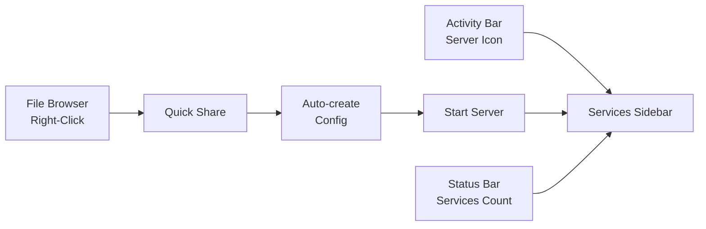
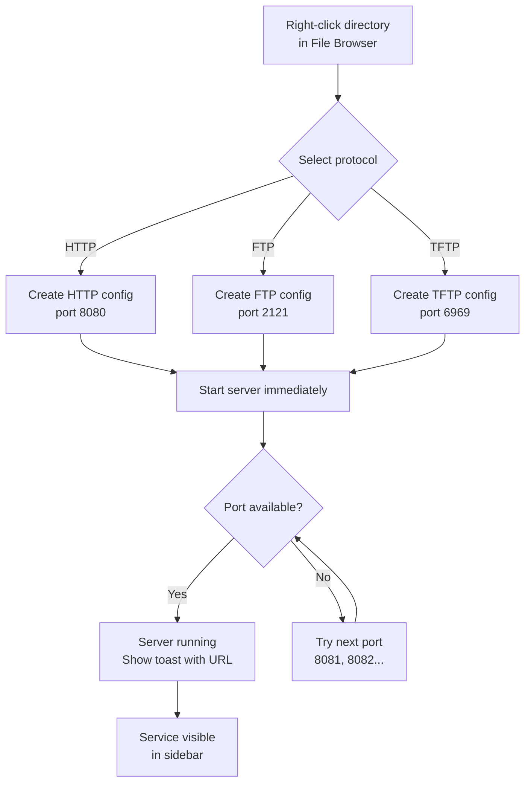
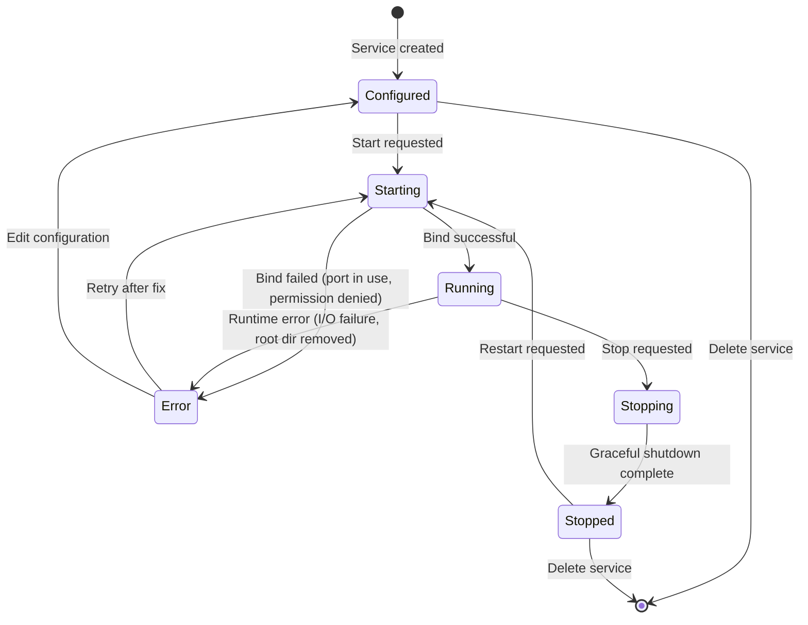
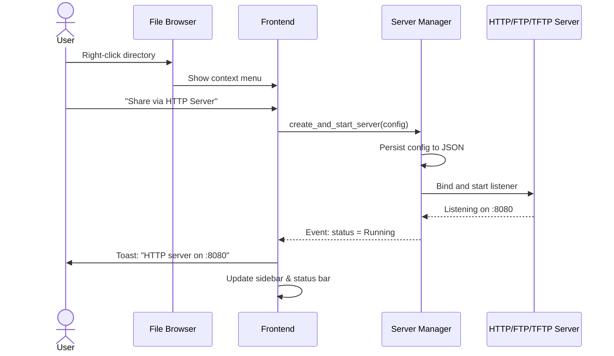
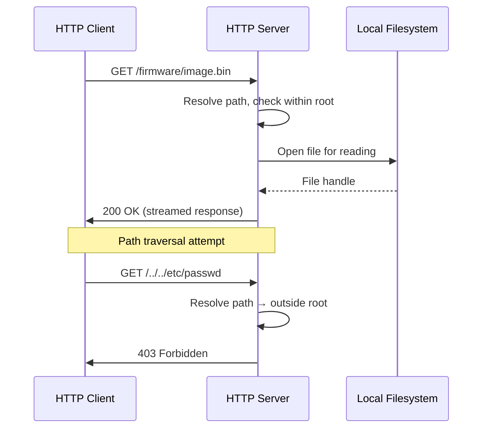
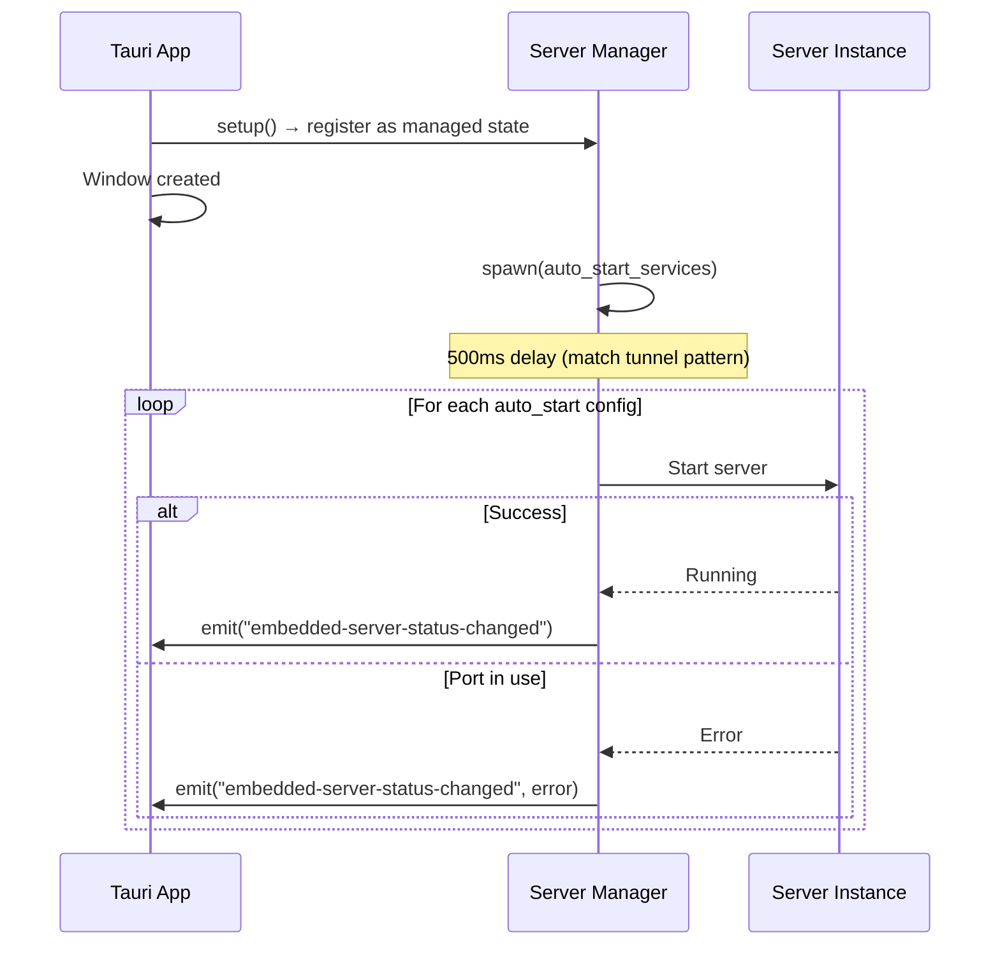
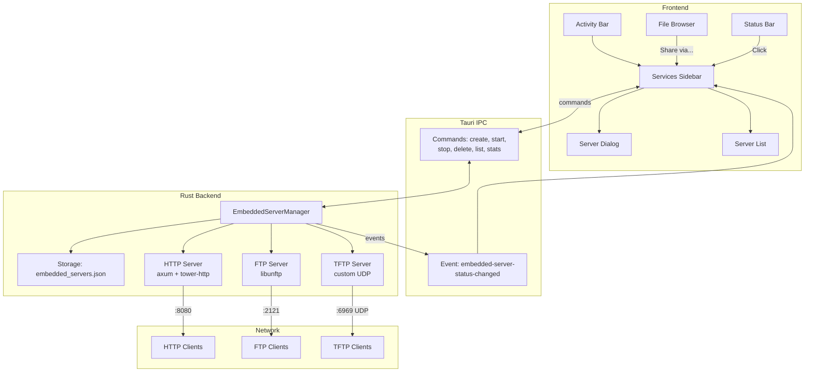

# Embedded Network Daemons (Quick-Share FTP/HTTP/TFTP Servers)

> GitHub Issue: [#526](https://github.com/armaxri/termiHub/issues/526)

---

## Overview

Add lightweight, embeddable network servers (HTTP, FTP, TFTP) to termiHub that users can start directly from the application for ad-hoc file sharing and testing. This eliminates the need for external tools when transferring files to devices that only support specific protocols — network equipment requiring TFTP firmware updates, quick HTTP file serving for downloads, or FTP for legacy device support.

### Goals

- Start/stop HTTP, TFTP, and FTP servers from within termiHub with minimal configuration
- Serve files from any local directory with a single click
- Provide a dedicated sidebar panel ("Services") for managing running servers
- Persist server configurations for quick re-use
- Support auto-start for frequently used server configurations
- Integrate with the file browser via right-click context menu ("Share via...")
- Bind to localhost by default with explicit opt-in for LAN exposure
- Show live statistics (connections, bytes transferred) for active servers

### Non-Goals

- Full-featured production server capabilities (virtual hosts, CGI, PHP, etc.)
- Serving files from remote connections (SFTP/SSH) — only local directories
- User management beyond simple username/password authentication
- HTTPS/FTPS/TLS support (these are quick-share servers, not production deployments)
- Persistent upload storage management (uploaded files go to the configured directory as-is)

---

## UI Interface

### Services Sidebar Panel

A new sidebar panel accessible from the Activity Bar (icon: `Server` from Lucide):

```
┌──────────────────────────┐
│ SERVICES            [+]  │
├──────────────────────────┤
│ 🔍 [Filter services...  ]│
├──────────────────────────┤
│ ● HTTP — Project Files   │  ← Green dot = running
│   :8080 → ~/projects     │
│   ▸ 3 connections        │
│                          │
│ ○ TFTP — Firmware Share  │  ← Gray dot = stopped
│   :6969 → ~/firmware     │
│                          │
│ ○ FTP — Dev Share        │  ← Gray dot = stopped
│   :2121 → ~/shared       │
├──────────────────────────┤
│ No more services.        │
│ Click [+] to add one.    │
└──────────────────────────┘
```

Each service entry shows:

- **Status indicator** — colored dot (green = running, gray = stopped, red = error)
- **Protocol badge** — `HTTP`, `FTP`, or `TFTP`
- **Name** — user-defined label
- **Bind address and port**
- **Root directory** (abbreviated path)
- **Live stats** when running (active connections, bytes transferred)

Right-clicking a service shows a context menu:

```
┌─────────────────────┐
│ Start               │
│ Stop                │
│ ─────────────────── │
│ Edit...             │
│ Duplicate           │
│ ─────────────────── │
│ Copy URL            │  ← e.g., http://192.168.1.10:8080
│ Open in Browser     │  ← HTTP only
│ ─────────────────── │
│ Delete              │
└─────────────────────┘
```

### Service Configuration Dialog

Opened when creating a new service or editing an existing one:

```
┌──────────────────────────────────────────────────┐
│  Configure Service                               │
├──────────────────────────────────────────────────┤
│                                                  │
│  Name:          [Firmware Share               ]  │
│                                                  │
│  Protocol:      ( ) HTTP  (●) TFTP  ( ) FTP     │
│                                                  │
│  Root Directory: [~/firmware            ] [📁]   │
│                                                  │
│  ┌─ Network ───────────────────────────────────┐ │
│  │ Bind Address:  [127.0.0.1          ] [▾]    │ │
│  │ Port:          [6969               ]        │ │
│  │                                             │ │
│  │ ☐ Expose to LAN (bind 0.0.0.0)             │ │
│  └─────────────────────────────────────────────┘ │
│                                                  │
│  ┌─ Options ───────────────────────────────────┐ │
│  │ ☐ Auto-start when termiHub launches         │ │
│  │ ☐ Read-only (disable uploads/writes)        │ │
│  │ ☐ Allow directory listing          (HTTP)   │ │
│  └─────────────────────────────────────────────┘ │
│                                                  │
│  ┌─ Authentication (FTP only) ─────────────────┐ │
│  │ ( ) Anonymous access                        │ │
│  │ (●) Username / Password                     │ │
│  │     User: [admin                  ]         │ │
│  │     Pass: [••••••                 ]         │ │
│  └─────────────────────────────────────────────┘ │
│                                                  │
│               [Cancel]  [Save]                   │
└──────────────────────────────────────────────────┘
```

Protocol-specific options:

| Option            | HTTP | FTP | TFTP |
| ----------------- | ---- | --- | ---- |
| Directory listing | Yes  | N/A | N/A  |
| Read-only mode    | Yes  | Yes | Yes  |
| Authentication    | No   | Yes | No   |
| Custom index file | Yes  | No  | No   |

### LAN Exposure Warning

When the user checks "Expose to LAN", a warning dialog appears:

```
┌──────────────────────────────────────────────┐
│  ⚠ Security Warning                         │
├──────────────────────────────────────────────┤
│                                              │
│  Binding to 0.0.0.0 will make this server   │
│  accessible to ALL devices on your network.  │
│                                              │
│  Anyone on the same network can:             │
│  • Download files from the shared directory  │
│  • Upload files (if read-only is off)        │
│                                              │
│  Only enable this on trusted networks.       │
│                                              │
│           [Cancel]  [I Understand]           │
└──────────────────────────────────────────────┘
```

### File Browser Integration

Right-clicking a directory in the local file browser shows an additional context menu group:

```
┌──────────────────────────┐
│ Open in Terminal         │
│ ──────────────────────── │
│ Share via HTTP Server    │
│ Share via FTP Server     │
│ Share via TFTP Server    │
└──────────────────────────┘
```

Selecting "Share via..." creates a new service configuration pre-filled with the selected directory as the root and a default port, then immediately starts the server. A toast notification confirms:

```
┌──────────────────────────────────────────┐
│ ✓ HTTP server started on :8080           │
│   Serving ~/projects/firmware            │
│   http://127.0.0.1:8080     [Copy URL]   │
└──────────────────────────────────────────┘
```

### Status Bar Integration

When one or more servers are running, a status bar item appears:

```
┌──────────────────────────────────────────────────────────┐
│  … │ 🖥 2 services │ …                                   │  ← Status bar
└──────────────────────────────────────────────────────────┘
```

Clicking it opens the Services sidebar panel.



---

## General Handling

### Creating a Service

1. User clicks `[+]` in the Services sidebar header or uses "Share via..." from the file browser
2. The configuration dialog opens (pre-filled for "Share via..." actions)
3. User selects protocol, root directory, port, and options
4. On save, the configuration is persisted to `embedded_servers.json`
5. The service appears in the sidebar in stopped state (unless triggered by "Share via...")

### Starting a Service

1. User clicks the start action (play button on hover, or context menu → Start)
2. Backend validates the configuration:
   - Root directory exists and is readable
   - Port is available (not already in use)
3. The server binds to the configured address and port
4. Status transitions to "Running" and the sidebar updates with a green indicator
5. A Tauri event (`embedded-server-status-changed`) pushes the state to the frontend

### Stopping a Service

1. User clicks the stop action or context menu → Stop
2. Backend sets the shutdown flag and waits for the listener thread to join
3. Active connections are allowed to complete (with a timeout)
4. Status transitions to "Stopped"

### Application Lifecycle

- On startup, services with `auto_start: true` are started automatically (after a brief delay, matching the tunnel auto-start pattern)
- On application exit (window `Destroyed` event), all running servers are stopped gracefully
- If a server crashes or encounters an unrecoverable error, it transitions to error state and emits a status event with the error message

### Port Conflict Handling

If the requested port is already in use:

1. The start operation fails with a clear error message: "Port 8080 is already in use"
2. The service transitions to error state in the sidebar
3. The user can edit the configuration to choose a different port

### Quick Share Workflow



### Edge Cases

| Scenario                              | Behavior                                                    |
| ------------------------------------- | ----------------------------------------------------------- |
| Root directory deleted while serving  | Server returns 404/error for requests; status shows warning |
| Port conflict on auto-start           | Service enters error state; user notified via status event  |
| Multiple servers on same port         | Second start fails with clear error                         |
| Very large file download              | Streamed, not buffered into memory                          |
| Concurrent uploads to same file (FTP) | Last-write-wins semantics                                   |
| Symlinks in root directory            | Followed by default; do not follow symlinks outside root    |
| Path traversal attack (e.g., `/../`)  | Resolved and rejected if outside root directory             |
| App crash during file transfer        | OS reclaims socket; partial uploads may remain              |

---

## States & Sequences

### Server Lifecycle State Diagram



### Quick Share Sequence



### File Request Sequence (HTTP Example)



### Auto-Start Sequence



---

## Preliminary Implementation Details

> Based on the project architecture as of the time of concept creation. The codebase may evolve before implementation.

### New Rust Module: `src-tauri/src/embedded_servers/`

Following the `tunnel/` module pattern:

```
src-tauri/src/embedded_servers/
├── mod.rs              # Module declarations
├── config.rs           # EmbeddedServerConfig, store types, status enum
├── storage.rs          # JSON persistence with recovery
├── server_manager.rs   # EmbeddedServerManager (Tauri managed state)
├── http_server.rs      # HTTP server implementation
├── ftp_server.rs       # FTP server implementation
└── tftp_server.rs      # TFTP server implementation
```

### Config Types (Rust)

```rust
#[derive(Debug, Clone, Serialize, Deserialize)]
#[serde(rename_all = "camelCase")]
pub struct EmbeddedServerConfig {
    pub id: String,
    pub name: String,
    pub server_type: ServerType,
    pub root_directory: String,
    pub bind_host: String,       // "127.0.0.1" or "0.0.0.0"
    pub port: u16,
    pub auto_start: bool,
    pub read_only: bool,
    // HTTP-specific
    pub directory_listing: Option<bool>,
    // FTP-specific
    pub ftp_auth: Option<FtpAuth>,
}

#[derive(Debug, Clone, Serialize, Deserialize)]
#[serde(rename_all = "camelCase")]
pub enum ServerType {
    Http,
    Ftp,
    Tftp,
}

#[derive(Debug, Clone, Serialize, Deserialize)]
#[serde(rename_all = "camelCase")]
pub enum FtpAuth {
    Anonymous,
    Credentials { username: String, password: String },
}

#[derive(Debug, Clone, Serialize, Deserialize)]
#[serde(rename_all = "camelCase")]
pub enum ServerStatus {
    Stopped,
    Starting,
    Running,
    Stopping,
    Error,
}

#[derive(Debug, Clone, Serialize, Deserialize)]
#[serde(rename_all = "camelCase")]
pub struct ServerStats {
    pub active_connections: u64,
    pub total_connections: u64,
    pub bytes_sent: u64,
    pub bytes_received: u64,
}

#[derive(Debug, Clone, Serialize, Deserialize)]
#[serde(rename_all = "camelCase")]
pub struct ServerState {
    pub server_id: String,
    pub status: ServerStatus,
    pub error: Option<String>,
    pub stats: Option<ServerStats>,
    pub started_at: Option<String>,  // ISO 8601 timestamp
}
```

### Server Manager (Rust)

```rust
pub struct EmbeddedServerManager {
    configs: Mutex<EmbeddedServerStore>,
    active_servers: Mutex<HashMap<String, ActiveServer>>,
    app_handle: AppHandle,
}

struct ActiveServer {
    config: EmbeddedServerConfig,
    shutdown: Arc<AtomicBool>,
    thread_handle: Option<JoinHandle<()>>,
    stats: Arc<ServerStats>,  // atomic counters
    started_at: Instant,
}
```

Follows the `TunnelManager` pattern exactly:

- Registered via `app.manage()` in `lib.rs::run()`
- Auto-starts services in a background thread after setup
- Stops all servers on window `Destroyed` event
- Emits `"embedded-server-status-changed"` events

### Server Implementations

Each server type implements a common pattern:

```rust
trait EmbeddedServer: Send + 'static {
    fn start(
        config: &EmbeddedServerConfig,
        shutdown: Arc<AtomicBool>,
        stats: Arc<ServerStats>,
    ) -> anyhow::Result<()>;
}
```

**HTTP Server** — Use `axum` (already part of the Tokio ecosystem):

- Serve static files from root directory using `tower-http::services::ServeDir`
- Optional directory listing via a custom handler
- Streamed responses for large files

**TFTP Server** — Custom implementation (protocol is simple, UDP-based):

- Single-threaded UDP listener
- Implements RRQ (read) and WRQ (write) opcodes per RFC 1350
- 512-byte block transfer with ACK

**FTP Server** — Use `libunftp` crate:

- Provides an async FTP server with configurable authenticators and storage backends
- Filesystem storage backend maps to the configured root directory

### New Tauri IPC Commands

```rust
// src-tauri/src/commands/embedded_servers.rs

#[tauri::command]
fn list_embedded_servers(manager: State<'_, EmbeddedServerManager>) -> Vec<ServerState>;

#[tauri::command]
fn create_embedded_server(manager: State<'_, EmbeddedServerManager>, config: EmbeddedServerConfig) -> Result<String, String>;

#[tauri::command]
fn update_embedded_server(manager: State<'_, EmbeddedServerManager>, config: EmbeddedServerConfig) -> Result<(), String>;

#[tauri::command]
fn delete_embedded_server(manager: State<'_, EmbeddedServerManager>, id: String) -> Result<(), String>;

#[tauri::command]
fn start_embedded_server(manager: State<'_, EmbeddedServerManager>, id: String) -> Result<(), String>;

#[tauri::command]
fn stop_embedded_server(manager: State<'_, EmbeddedServerManager>, id: String) -> Result<(), String>;

#[tauri::command]
fn get_embedded_server_stats(manager: State<'_, EmbeddedServerManager>, id: String) -> Result<ServerState, String>;
```

### TypeScript Types

```typescript
// src/types/embeddedServer.ts

export type ServerType = "http" | "ftp" | "tftp";

export type ServerStatus = "stopped" | "starting" | "running" | "stopping" | "error";

export interface FtpAuth {
  type: "anonymous" | "credentials";
  username?: string;
  password?: string;
}

export interface EmbeddedServerConfig {
  id: string;
  name: string;
  serverType: ServerType;
  rootDirectory: string;
  bindHost: string;
  port: number;
  autoStart: boolean;
  readOnly: boolean;
  directoryListing?: boolean;
  ftpAuth?: FtpAuth;
}

export interface ServerStats {
  activeConnections: number;
  totalConnections: number;
  bytesSent: number;
  bytesReceived: number;
}

export interface ServerState {
  serverId: string;
  status: ServerStatus;
  error?: string;
  stats?: ServerStats;
  startedAt?: string;
}
```

### Frontend Components

```
src/components/
├── EmbeddedServerSidebar/
│   ├── EmbeddedServerSidebar.tsx    # Main sidebar panel
│   ├── EmbeddedServerList.tsx       # List of configured servers
│   ├── EmbeddedServerItem.tsx       # Single server entry with status
│   └── EmbeddedServerDialog.tsx     # Create/edit configuration dialog
```

### Store Changes

```typescript
// appStore.ts additions

// Extend SidebarView union type
type SidebarView = "connections" | "files" | "tunnels" | "services";

// Add to store state
embeddedServers: ServerState[];
setEmbeddedServers: (servers: ServerState[]) => void;
```

### Activity Bar Addition

Add a new entry to `TOP_ITEMS` in `ActivityBar.tsx`:

```typescript
{ view: "services", icon: Server, label: "Services" }
```

### Event Handling

```typescript
// src/services/events.ts — new event listener
listen<ServerState>("embedded-server-status-changed", (event) => {
  // Update store with new server state
});
```

### Storage

- Config file: `<app_config_dir>/embedded_servers.json`
- Same recovery pattern as tunnels (`load_with_recovery`)
- Schema version field for future migrations

### New Dependencies

| Crate        | Purpose             | Notes                            |
| ------------ | ------------------- | -------------------------------- |
| `axum`       | HTTP server         | Tokio-native, lightweight        |
| `tower-http` | Static file serving | `ServeDir` for directory serving |
| `libunftp`   | FTP server          | Async FTP server framework       |

TFTP will use a custom implementation (UDP, ~200 lines) rather than pulling in a crate for this simple protocol.

### Integration Diagram



### Files to Modify

| File                                         | Change                                                                   |
| -------------------------------------------- | ------------------------------------------------------------------------ |
| `src-tauri/src/lib.rs`                       | Register `EmbeddedServerManager`, add IPC commands, add shutdown handler |
| `src-tauri/Cargo.toml`                       | Add `axum`, `tower-http`, `libunftp` dependencies                        |
| `src/store/appStore.ts`                      | Add `"services"` to `SidebarView`, add embedded server state             |
| `src/components/ActivityBar/ActivityBar.tsx` | Add Services entry to `TOP_ITEMS`                                        |
| `src/components/Sidebar/Sidebar.tsx`         | Add `EmbeddedServerSidebar` rendering case                               |
| `src/components/Sidebar/FileBrowser.tsx`     | Add "Share via..." context menu items                                    |
| `src/components/StatusBar/StatusBar.tsx`     | Add running services count indicator                                     |
| `src/services/api.ts`                        | Add IPC command wrappers                                                 |
| `src/services/events.ts`                     | Add event listener for server status changes                             |
| `src/types/embeddedServer.ts`                | New file: TypeScript types                                               |
