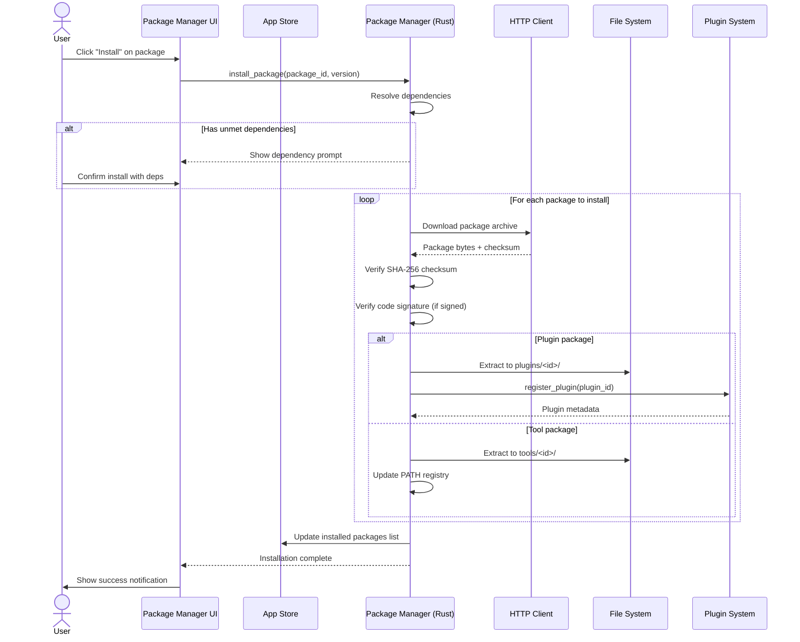
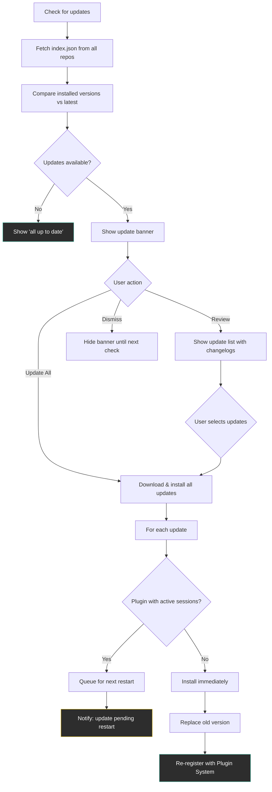
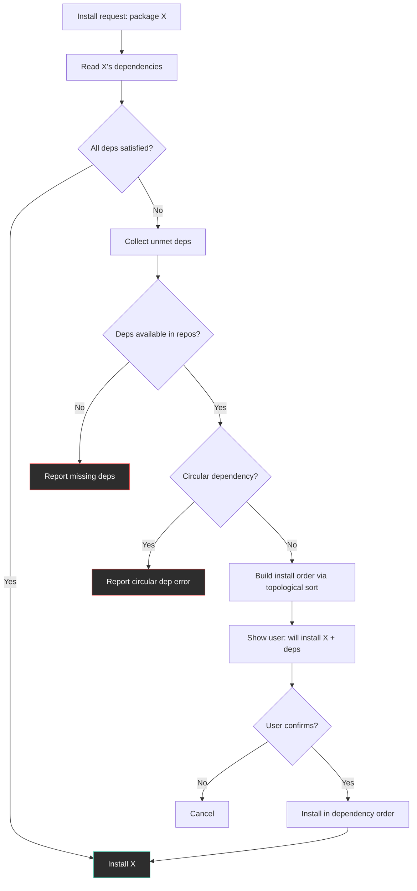
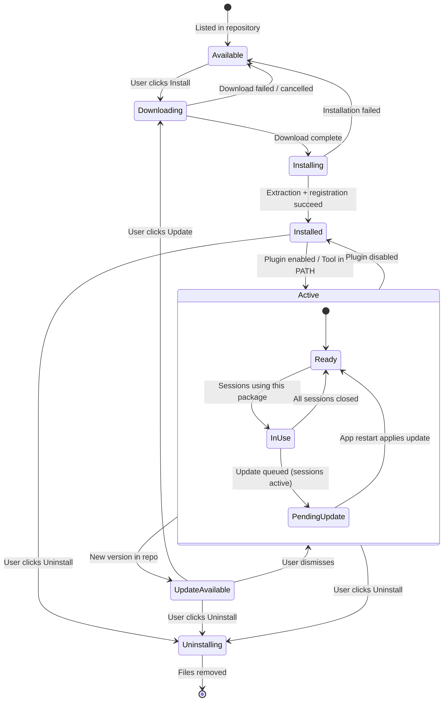
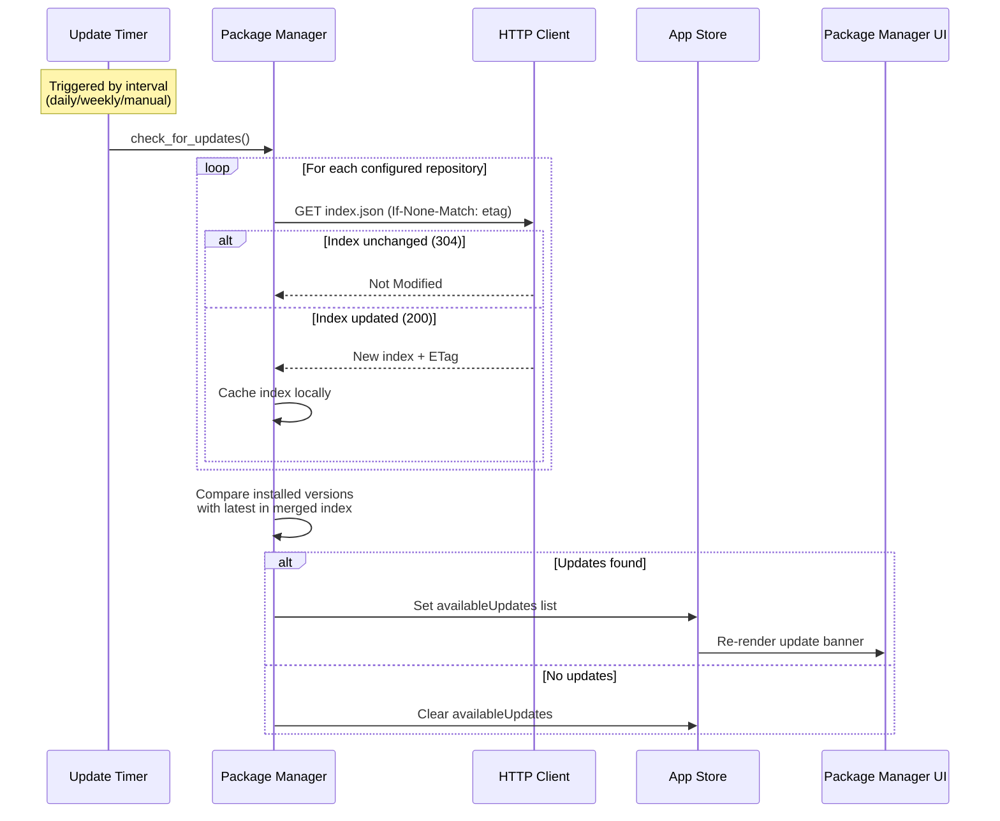
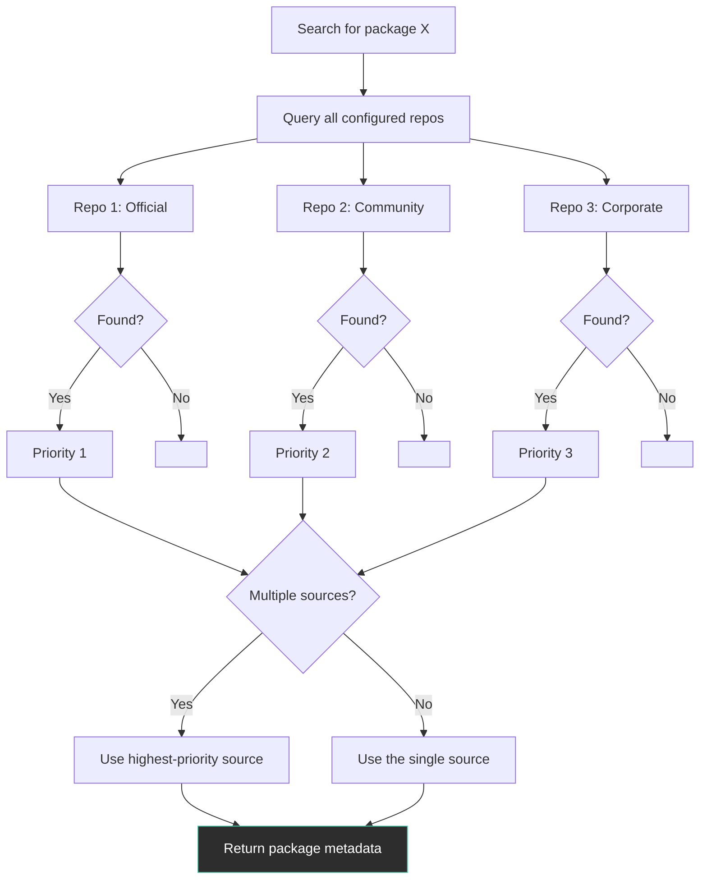
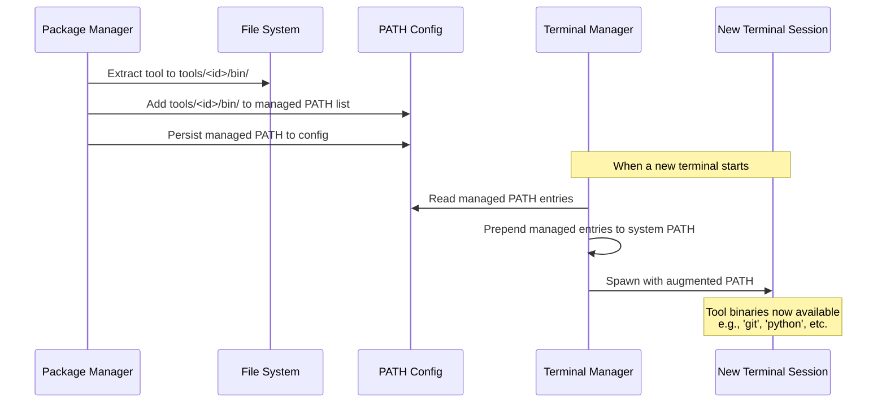
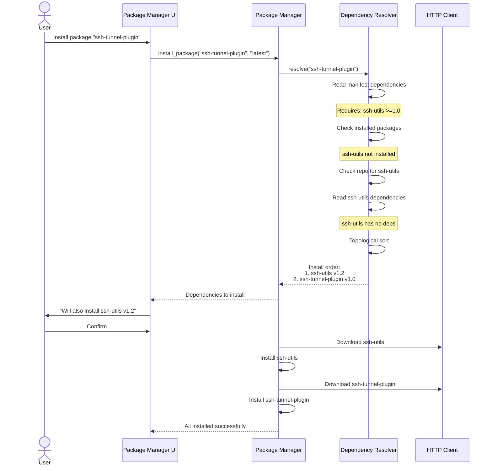
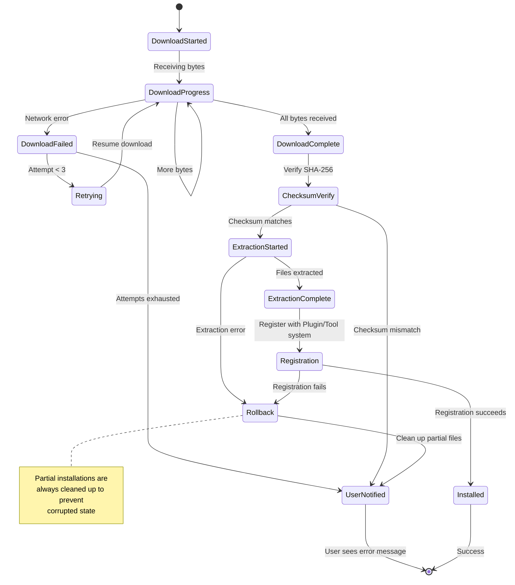
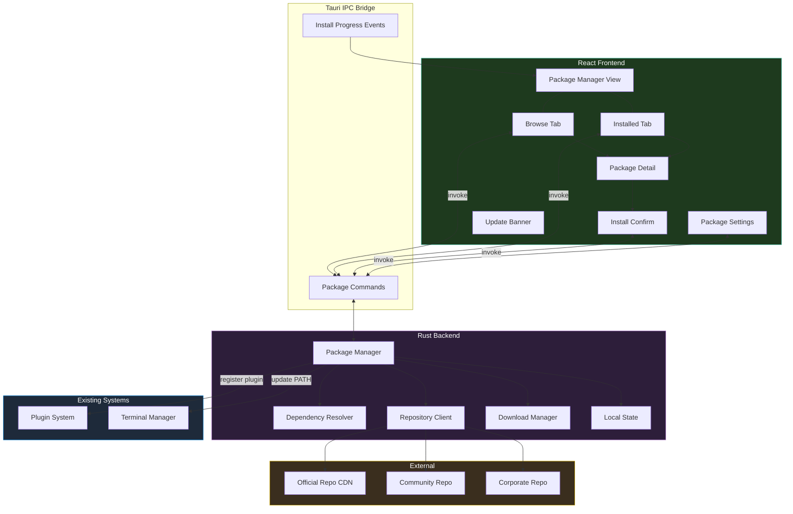

# Package Manager for Extensions and Tools

**GitHub Issue:** [#521](https://github.com/armaxri/termiHub/issues/521)

---

## Overview

The [Plugin System concept](handled/plugin-system.md) defines how termiHub loads
and runs extensions at runtime — but it only supports local, manual installation
from `.termihub-plugin` files. There is no way to discover, browse, or
automatically update plugins, and no mechanism to manage tool packages for an
embedded Unix environment.

This concept introduces a **Package Manager** that sits on top of the plugin
system and provides:

- **A curated plugin repository** with browsable catalog, search, and
  categorization
- **Dependency resolution** between plugins and external tool requirements
- **Automatic updates** with user-controlled update policies
- **Tool packages** (CLI utilities, shells, compilers) that can be installed into
  a local tools directory — analogous to MobaXterm's MobApt
- **Size management** with disk usage tracking and cleanup utilities

### Relationship to Existing Concepts

| Concept                                               | Scope                                                                                 |
| ----------------------------------------------------- | ------------------------------------------------------------------------------------- |
| [Plugin System](handled/plugin-system.md)             | Runtime loading, extension points, sandboxing, permissions                            |
| **Package Manager** (this document)                   | Discovery, repository, dependency resolution, updates, tool packages                  |
| [Embedded Unix Environment](embedded-unix-windows.md) | Bundled Unix tools on Windows — the package manager could serve as its package source |

The package manager **depends on** the plugin system being implemented first. It
extends the plugin system's "Install from file" workflow into a full
repository-backed package lifecycle.

### Goals

- Provide a **repository** of curated and community-contributed packages
- Support **two package types**: plugins (termiHub extensions) and tools (CLI
  utilities)
- Enable **one-click install** of plugins from the repository
- Handle **dependency resolution** between packages
- Support **automatic and manual updates** with configurable policies
- Show **installed size** per package and total disk usage
- Allow **multiple repository sources** (official, community, private/corporate)
- Work **cross-platform** (Windows, macOS, Linux) with platform-aware packages

### Non-Goals

- Hosting the repository infrastructure (CDN, backend) — this concept covers the
  client-side design only
- Paid plugins or a commercial marketplace
- User ratings, reviews, or social features in the initial version
- Plugin development tooling (SDK, scaffolding, testing framework)
- Running tool packages inside a containerized or sandboxed environment

---

## UI Interface

### Package Manager View — Browse Tab

The Package Manager replaces the Plugin Manager sidebar view from the plugin
system concept. It is accessible via the **Activity Bar** (puzzle-piece icon) and
has two tabs: **Browse** (repository) and **Installed** (local).

```
┌──┬──────────────────────┬──────────────────────────────────┐
│  │  PACKAGES             │                                  │
│  │───────────────────────│        Terminal Area              │
│  │  [Browse] [Installed] │                                  │
│  │                       │                                  │
│  │  [Search packages...] │                                  │
│  │                       │                                  │
│  │  Filter: [All ▾]      │                                  │
│🧩│                       │                                  │
│  │  FEATURED             │                                  │
│  │  ┌───────────────────┐│                                  │
│  │  │ ★ K8s Exec    🔌  ││                                  │
│  │  │ v1.2.0  ↓ 4.2k   ││                                  │
│  │  │ [Install]         ││                                  │
│  │  └───────────────────┘│                                  │
│  │  ┌───────────────────┐│                                  │
│  │  │ ★ Dracula Theme🎨 ││                                  │
│  │  │ v2.0.1  ↓ 12k    ││                                  │
│  │  │ [Install]         ││                                  │
│  │  └───────────────────┘│                                  │
│  │                       │                                  │
│  │  TERMINAL BACKENDS    │                                  │
│  │  ┌───────────────────┐│                                  │
│  │  │   AWS CloudShell  ││                                  │
│  │  │   v0.5.0  ↓ 890  ││                                  │
│  │  │   [Install]       ││                                  │
│  │  └───────────────────┘│                                  │
│  │                       │                                  │
│  │  TOOLS                │                                  │
│  │  ┌───────────────────┐│                                  │
│  │  │ 🔧 git  v2.44    ││                                  │
│  │  │   3.2 MB  [Install]│                                  │
│  │  └───────────────────┘│                                  │
└──┴───────────────────────┴──────────────────────────────────┘
```

### Package Manager View — Installed Tab

```
┌──┬──────────────────────┬──────────────────────────────────┐
│  │  PACKAGES             │                                  │
│  │───────────────────────│        Terminal Area              │
│  │  [Browse] [Installed] │                                  │
│  │                       │                                  │
│  │  [Search installed...] │                                  │
│  │                       │                                  │
│  │  PLUGINS (2)          │                                  │
│🧩│  ┌───────────────────┐│                                  │
│  │  │ 🟢 K8s Exec  🔌  ││                                  │
│  │  │ v1.2.0  1.4 MB   ││                                  │
│  │  │ ⬆ Update: v1.3.0 ││                                  │
│  │  └───────────────────┘│                                  │
│  │  ┌───────────────────┐│                                  │
│  │  │ 🟢 Dracula    🎨  ││                                  │
│  │  │ v2.0.1  42 KB    ││                                  │
│  │  │ ✓ Up to date     ││                                  │
│  │  └───────────────────┘│                                  │
│  │                       │                                  │
│  │  TOOLS (3)            │                                  │
│  │  ┌───────────────────┐│                                  │
│  │  │ 🔧 git  v2.44    ││                                  │
│  │  │   3.2 MB          ││                                  │
│  │  └───────────────────┘│                                  │
│  │  ┌───────────────────┐│                                  │
│  │  │ 🔧 python v3.12  ││                                  │
│  │  │   28.7 MB         ││                                  │
│  │  └───────────────────┘│                                  │
│  │                       │                                  │
│  │  ─────────────────── │                                  │
│  │  Total: 33.4 MB       │                                  │
│  │  [Clean unused...]    │                                  │
└──┴───────────────────────┴──────────────────────────────────┘
```

### Package Detail Panel

Clicking a package (in either tab) opens a detail panel within the sidebar:

```
┌───────────────────────┐
│  K8s Exec         🔌  │
│  v1.2.0               │
│  by k8s-contrib        │
│───────────────────────│
│  Terminal backend for  │
│  Kubernetes pod exec   │
│  sessions.             │
│                        │
│  Category: Backends    │
│  Downloads: 4,218      │
│  Size: 1.4 MB          │
│  License: MIT          │
│                        │
│  Dependencies:         │
│  └─ kubectl (external) │
│                        │
│  Permissions:          │
│  - Terminal            │
│  - Network             │
│                        │
│  Changelog:            │
│  v1.2.0 — Pod search  │
│  v1.1.0 — Multi-cont. │
│                        │
│  [Install]  [Homepage] │
│  ─── or if installed ──│
│  [Update] [Disable]    │
│  [Uninstall] [Settings]│
└────────────────────────┘
```

### Update Notification Banner

When updates are available, a subtle banner appears at the top of the Installed
tab:

```
┌─────────────────────────────────────────┐
│  ⬆ 2 updates available                 │
│  [Update All]   [Review...]   [Dismiss] │
└─────────────────────────────────────────┘
```

### Package Manager Settings

A new "Packages" category in the Settings panel:

```
┌──────────────────────────────────────────────┐
│  Settings                                    │
│──────────────────────────────────────────────│
│  ▼ Packages                                  │
│                                              │
│  Auto-check for updates:  [x]               │
│  Check interval:          [Daily        ▾]  │
│  Auto-install updates:    [ ] (manual)       │
│  Include pre-release:     [ ]               │
│                                              │
│  Repository Sources:                         │
│  ┌──────────────────────────────────────┐    │
│  │ ✓ Official  https://pkg.termihub.io │    │
│  │ ✓ Community https://community.term..│    │
│  │   Corporate https://internal.corp.. │    │
│  │ [Add source...]                      │    │
│  └──────────────────────────────────────┘    │
│                                              │
│  Tools directory: [~/.termihub/tools   ]     │
│  [Open tools directory]                      │
│                                              │
│  Disk Usage:                                 │
│  Plugins: 1.5 MB (2 packages)              │
│  Tools:   31.9 MB (3 packages)             │
│  Cache:   8.2 MB                            │
│  [Clear cache]                              │
└──────────────────────────────────────────────┘
```

### Tool Package Integration

Tool packages install CLI binaries into a managed tools directory. termiHub
automatically adds this directory to the `PATH` for all terminal sessions:

```
┌─────────────────────────────────────────┐
│  Install Tool: git                      │
│─────────────────────────────────────────│
│                                          │
│  git v2.44.0                            │
│  Distributed version control system     │
│                                          │
│  Platform: macOS (arm64)                │
│  Size: 3.2 MB                           │
│                                          │
│  Will be installed to:                   │
│  ~/.termihub/tools/git/                 │
│                                          │
│  Dependencies:                           │
│  └─ openssl v3.2 (will be installed)    │
│                                          │
│  [Cancel]              [Install]        │
└─────────────────────────────────────────┘
```

---

## General Handling

### Package Types

The package manager handles two distinct package types:

| Aspect             | Plugin Packages                             | Tool Packages                               |
| ------------------ | ------------------------------------------- | ------------------------------------------- |
| **Purpose**        | Extend termiHub (backends, themes, parsers) | Provide CLI utilities for terminal sessions |
| **Format**         | `.termihub-plugin` (ZIP with manifest)      | Platform-specific archives (tar.gz / zip)   |
| **Location**       | `<app-data>/plugins/<id>/`                  | `<app-data>/tools/<id>/`                    |
| **Runtime**        | Loaded by Plugin Manager at app startup     | Available in `PATH` for all sessions        |
| **Activation**     | Requires explicit enable                    | Available immediately after install         |
| **Dependencies**   | Other plugins or external tools             | Other tool packages                         |
| **Cross-platform** | May include per-platform native libraries   | Always platform-specific binaries           |

### Repository Structure

The package repository is a static file index served over HTTPS. No dynamic
backend is required — the repository can be hosted on any CDN or static file
host.

```
Repository (HTTPS)
├── index.json              # Full package catalog
├── index-v2.json           # Future catalog versions
├── plugins/
│   ├── k8s-exec/
│   │   ├── metadata.json   # Package metadata + all versions
│   │   ├── 1.2.0/
│   │   │   ├── k8s-exec-1.2.0-windows-x86_64.termihub-plugin
│   │   │   ├── k8s-exec-1.2.0-linux-x86_64.termihub-plugin
│   │   │   ├── k8s-exec-1.2.0-linux-aarch64.termihub-plugin
│   │   │   ├── k8s-exec-1.2.0-macos-x86_64.termihub-plugin
│   │   │   ├── k8s-exec-1.2.0-macos-aarch64.termihub-plugin
│   │   │   └── checksums.sha256
│   │   └── 1.1.0/
│   │       └── ...
│   └── dracula-theme/
│       └── ...
└── tools/
    ├── git/
    │   ├── metadata.json
    │   └── 2.44.0/
    │       ├── git-2.44.0-windows-x86_64.zip
    │       ├── git-2.44.0-linux-x86_64.tar.gz
    │       └── checksums.sha256
    └── python/
        └── ...
```

### Repository Index Format

The `index.json` provides a compact catalog for the browse UI:

```json
{
  "version": 2,
  "timestamp": "2026-03-21T10:00:00Z",
  "packages": [
    {
      "id": "k8s-exec",
      "name": "Kubernetes Exec",
      "type": "plugin",
      "category": "backends",
      "author": "k8s-contrib",
      "description": "Terminal backend for Kubernetes pod exec",
      "latestVersion": "1.2.0",
      "platforms": ["windows", "linux", "macos"],
      "downloads": 4218,
      "featured": true,
      "tags": ["kubernetes", "cloud", "containers"]
    }
  ]
}
```

### Browsing and Search

1. On first launch (or when the user opens Browse), the client fetches
   `index.json` from configured repository sources
2. The index is cached locally with a configurable TTL (default: 24 hours)
3. Search filters on `name`, `description`, `tags`, and `author` (client-side)
4. Category filter narrows by `type` and `category`:
   - All
   - Plugins → Backends, Themes, Protocol Parsers, Status Widgets
   - Tools → Shells, Utilities, Compilers, Languages

### Installing a Package



### Updating Packages



### Dependency Resolution

Dependencies are declared in package metadata. The resolver uses a simple
topological sort with conflict detection:

| Dependency Type        | Example                                       | Resolution                                                          |
| ---------------------- | --------------------------------------------- | ------------------------------------------------------------------- |
| **Plugin → Plugin**    | SSH Tunnel plugin depends on SSH Utils plugin | Auto-install SSH Utils first                                        |
| **Plugin → Tool**      | K8s Exec plugin requires `kubectl`            | Prompt to install kubectl tool package or note external requirement |
| **Tool → Tool**        | `git` depends on `openssl`                    | Auto-install openssl first                                          |
| **Version constraint** | `>=1.0.0, <2.0.0`                             | Install latest compatible version                                   |
| **Conflict**           | Two plugins provide the same connection type  | Block install, show conflict message                                |



### Uninstalling a Package

1. Check if other installed packages depend on this package
2. If dependents exist, warn user and offer to uninstall dependents too
3. If the package is a plugin with active sessions, warn that sessions will close
4. Remove package files from disk
5. Update installed packages list and PATH registry
6. Clear package settings

### Size Management and Cleanup

- Each package tracks its installed size on disk
- The Installed tab shows per-package and total size
- The "Clean unused" action identifies:
  - Tool packages not used in any terminal session for 90+ days
  - Download cache files older than 7 days
  - Orphaned plugin data (plugin removed but settings/cache remain)
- Cleanup is always user-confirmed, never automatic

### Multiple Repository Sources

Users can configure multiple repository sources with priority ordering:

1. **Official** (default, always present) — curated by the termiHub team
2. **Community** (opt-in) — community-contributed packages with basic review
3. **Private/Corporate** — custom repositories for internal tools

When the same package ID exists in multiple repos, the highest-priority source
wins. Repository sources are configured in Settings → Packages.

### Offline Mode

If no network is available:

- Browse tab shows cached index (if available) with a "cached" indicator
- Install/update operations fail gracefully with a clear message
- Already-installed packages continue to work normally
- Tool packages already on disk remain in PATH

### Edge Cases

- **Package available for some platforms only**: Show "Not available for your
  platform" instead of Install button, with a note about which platforms are
  supported
- **Disk space insufficient**: Check available space before download; abort with
  clear message if insufficient
- **Download interrupted**: Resume via HTTP range requests; fall back to
  re-download if server doesn't support range
- **Repository unreachable**: Retry with exponential backoff (3 attempts), then
  fall back to cached index
- **Malicious package**: Checksum verification catches tampered downloads; code
  signature verification (when available) catches unauthorized publishers
- **Version downgrade**: Explicitly supported via "Install specific version"
  option in package detail; warns that downgrading may lose settings
- **Package conflicts with built-in**: Built-in features always take precedence;
  conflicting package cannot be installed

---

## States & Sequences

### Package Lifecycle State Machine



### Update Check Sequence



### Repository Source Resolution



### Tool Package PATH Integration



### Dependency Resolution Sequence



### Error Handling During Installation



---

## Preliminary Implementation Details

Based on the current project architecture at the time of concept creation. The
codebase may evolve between concept creation and implementation.

### 1. Package Metadata Types (Rust)

```rust
// core/src/packages/ (new module)

/// A package in the repository index.
#[derive(Debug, Clone, Serialize, Deserialize)]
#[serde(rename_all = "camelCase")]
pub struct PackageInfo {
    pub id: String,
    pub name: String,
    pub package_type: PackageType,
    pub category: String,
    pub author: String,
    pub description: String,
    pub latest_version: String,
    pub platforms: Vec<Platform>,
    pub downloads: u64,
    pub featured: bool,
    pub tags: Vec<String>,
}

#[derive(Debug, Clone, Serialize, Deserialize)]
#[serde(rename_all = "lowercase")]
pub enum PackageType {
    Plugin,
    Tool,
}

/// Detailed metadata for a specific package (fetched on demand).
#[derive(Debug, Clone, Serialize, Deserialize)]
#[serde(rename_all = "camelCase")]
pub struct PackageMetadata {
    pub info: PackageInfo,
    pub versions: Vec<VersionEntry>,
    pub license: String,
    pub homepage: Option<String>,
    pub repository: Option<String>,
}

#[derive(Debug, Clone, Serialize, Deserialize)]
#[serde(rename_all = "camelCase")]
pub struct VersionEntry {
    pub version: String,
    pub release_date: String,
    pub changelog: String,
    pub min_app_version: Option<String>,
    pub dependencies: Vec<Dependency>,
    pub size_bytes: u64,
    pub platforms: Vec<PlatformAsset>,
}

#[derive(Debug, Clone, Serialize, Deserialize)]
#[serde(rename_all = "camelCase")]
pub struct Dependency {
    pub package_id: String,
    pub version_req: String,  // semver range, e.g. ">=1.0.0, <2.0.0"
    pub dep_type: DependencyType,
}

#[derive(Debug, Clone, Serialize, Deserialize)]
#[serde(rename_all = "lowercase")]
pub enum DependencyType {
    /// Must be installed (auto-resolved).
    Required,
    /// Noted in UI but not auto-installed (e.g., external CLI tools).
    External,
}

#[derive(Debug, Clone, Serialize, Deserialize)]
#[serde(rename_all = "camelCase")]
pub struct PlatformAsset {
    pub platform: Platform,
    pub arch: Arch,
    pub download_url: String,
    pub checksum_sha256: String,
}

#[derive(Debug, Clone, Serialize, Deserialize)]
#[serde(rename_all = "lowercase")]
pub enum Platform {
    Windows,
    Linux,
    Macos,
}

#[derive(Debug, Clone, Serialize, Deserialize)]
#[serde(rename_all = "lowercase")]
pub enum Arch {
    X86_64,
    Aarch64,
}
```

### 2. Package Manager Service (Rust)

The `PackageManager` lives in `src-tauri/src/packages/` and orchestrates
repository access, downloads, and local package state:

```rust
// src-tauri/src/packages/manager.rs

pub struct PackageManager {
    /// Configured repository sources, ordered by priority.
    repositories: Vec<RepositorySource>,
    /// Cached merged index from all repositories.
    cached_index: RwLock<Option<CachedIndex>>,
    /// Local state: installed packages, enabled/disabled, settings.
    local_state: RwLock<LocalPackageState>,
    /// HTTP client for downloads.
    client: reqwest::Client,
    /// Base directory for package storage.
    packages_dir: PathBuf,
    /// Directory for tool binaries.
    tools_dir: PathBuf,
}

struct CachedIndex {
    packages: Vec<PackageInfo>,
    fetched_at: SystemTime,
    etags: HashMap<String, String>,  // repo_url -> etag
}

struct LocalPackageState {
    installed: HashMap<String, InstalledPackage>,
}

pub struct InstalledPackage {
    pub id: String,
    pub name: String,
    pub version: String,
    pub package_type: PackageType,
    pub installed_at: String,
    pub size_bytes: u64,
    pub source_repo: String,
    pub enabled: bool,
}

impl PackageManager {
    /// Fetch and merge indexes from all configured repositories.
    pub async fn refresh_index(&self) -> Result<Vec<PackageInfo>>;

    /// Get cached index (or fetch if stale/missing).
    pub async fn get_index(&self) -> Result<Vec<PackageInfo>>;

    /// Fetch detailed metadata for a specific package.
    pub async fn get_package_metadata(&self, id: &str) -> Result<PackageMetadata>;

    /// Resolve dependencies and return the install plan.
    pub async fn resolve_install(
        &self, id: &str, version: Option<&str>,
    ) -> Result<InstallPlan>;

    /// Execute an install plan (download, verify, extract, register).
    pub async fn execute_install(
        &self, plan: &InstallPlan,
        progress: impl Fn(InstallProgress),
    ) -> Result<Vec<InstalledPackage>>;

    /// Check for available updates.
    pub async fn check_updates(&self) -> Result<Vec<UpdateInfo>>;

    /// Uninstall a package (with dependency check).
    pub async fn uninstall(&self, id: &str) -> Result<UninstallResult>;

    /// List installed packages.
    pub fn list_installed(&self) -> Result<Vec<InstalledPackage>>;

    /// Get total disk usage breakdown.
    pub fn disk_usage(&self) -> Result<DiskUsage>;

    /// Clean download cache and orphaned data.
    pub async fn clean_cache(&self) -> Result<CleanupResult>;

    /// Get managed PATH entries for tool packages.
    pub fn managed_path_entries(&self) -> Result<Vec<PathBuf>>;
}
```

### 3. Dependency Resolver

```rust
// src-tauri/src/packages/resolver.rs

pub struct DependencyResolver<'a> {
    index: &'a [PackageInfo],
    installed: &'a HashMap<String, InstalledPackage>,
}

pub struct InstallPlan {
    /// Packages to install, in dependency order.
    pub steps: Vec<InstallStep>,
    /// External dependencies that the user must resolve manually.
    pub external_deps: Vec<ExternalDep>,
    /// Total download size.
    pub total_download_bytes: u64,
    /// Total installed size.
    pub total_install_bytes: u64,
}

pub struct InstallStep {
    pub package_id: String,
    pub version: String,
    pub asset: PlatformAsset,
    pub is_dependency: bool,
}

impl<'a> DependencyResolver<'a> {
    /// Resolve all dependencies for a package, returning an
    /// ordered install plan or an error if conflicts are found.
    pub fn resolve(
        &self, id: &str, version: Option<&str>,
    ) -> Result<InstallPlan> {
        // 1. Fetch version's dependency list
        // 2. Recursively resolve each dependency
        // 3. Detect circular dependencies
        // 4. Detect conflicts (same connection type, incompatible versions)
        // 5. Topological sort into install order
        // 6. Separate external dependencies
        // 7. Calculate total sizes
    }
}
```

### 4. Tauri Commands

```rust
// src-tauri/src/commands/packages.rs

#[tauri::command]
pub async fn get_package_index(
    manager: State<'_, PackageManager>,
    force_refresh: bool,
) -> Result<Vec<PackageInfo>, String>

#[tauri::command]
pub async fn get_package_detail(
    manager: State<'_, PackageManager>,
    package_id: String,
) -> Result<PackageMetadata, String>

#[tauri::command]
pub async fn resolve_package_install(
    manager: State<'_, PackageManager>,
    package_id: String,
    version: Option<String>,
) -> Result<InstallPlan, String>

#[tauri::command]
pub async fn install_package(
    manager: State<'_, PackageManager>,
    package_id: String,
    version: Option<String>,
    window: tauri::Window,
) -> Result<Vec<InstalledPackage>, String>

#[tauri::command]
pub async fn uninstall_package(
    manager: State<'_, PackageManager>,
    package_id: String,
) -> Result<UninstallResult, String>

#[tauri::command]
pub async fn check_package_updates(
    manager: State<'_, PackageManager>,
) -> Result<Vec<UpdateInfo>, String>

#[tauri::command]
pub async fn update_packages(
    manager: State<'_, PackageManager>,
    package_ids: Vec<String>,
    window: tauri::Window,
) -> Result<Vec<InstalledPackage>, String>

#[tauri::command]
pub async fn get_installed_packages(
    manager: State<'_, PackageManager>,
) -> Result<Vec<InstalledPackage>, String>

#[tauri::command]
pub async fn get_package_disk_usage(
    manager: State<'_, PackageManager>,
) -> Result<DiskUsage, String>

#[tauri::command]
pub async fn clean_package_cache(
    manager: State<'_, PackageManager>,
) -> Result<CleanupResult, String>

#[tauri::command]
pub async fn get_repository_sources(
    manager: State<'_, PackageManager>,
) -> Result<Vec<RepositorySource>, String>

#[tauri::command]
pub async fn update_repository_sources(
    manager: State<'_, PackageManager>,
    sources: Vec<RepositorySource>,
) -> Result<(), String>
```

### 5. Frontend Types

```typescript
// src/types/packages.ts

export interface PackageInfo {
  id: string;
  name: string;
  packageType: "plugin" | "tool";
  category: string;
  author: string;
  description: string;
  latestVersion: string;
  platforms: string[];
  downloads: number;
  featured: boolean;
  tags: string[];
}

export interface PackageMetadata {
  info: PackageInfo;
  versions: VersionEntry[];
  license: string;
  homepage?: string;
  repository?: string;
}

export interface VersionEntry {
  version: string;
  releaseDate: string;
  changelog: string;
  minAppVersion?: string;
  dependencies: PackageDependency[];
  sizeBytes: number;
  platforms: PlatformAsset[];
}

export interface PackageDependency {
  packageId: string;
  versionReq: string;
  depType: "required" | "external";
}

export interface InstalledPackage {
  id: string;
  name: string;
  version: string;
  packageType: "plugin" | "tool";
  installedAt: string;
  sizeBytes: number;
  sourceRepo: string;
  enabled: boolean;
}

export interface InstallPlan {
  steps: InstallStep[];
  externalDeps: ExternalDep[];
  totalDownloadBytes: number;
  totalInstallBytes: number;
}

export interface InstallStep {
  packageId: string;
  version: string;
  isDependency: boolean;
}

export interface UpdateInfo {
  packageId: string;
  currentVersion: string;
  latestVersion: string;
  changelog: string;
  downloadBytes: number;
}

export interface DiskUsage {
  pluginsBytes: number;
  pluginCount: number;
  toolsBytes: number;
  toolCount: number;
  cacheBytes: number;
}

export interface RepositorySource {
  name: string;
  url: string;
  enabled: boolean;
  priority: number;
}
```

### 6. Zustand Store Extensions

```typescript
// New section in appStore.ts

// State
packageIndex: PackageInfo[];
installedPackages: InstalledPackage[];
availableUpdates: UpdateInfo[];
packageIndexLoading: boolean;

// Actions
loadPackageIndex: (forceRefresh?: boolean) => Promise<void>;
loadInstalledPackages: () => Promise<void>;
installPackage: (id: string, version?: string) => Promise<void>;
uninstallPackage: (id: string) => Promise<void>;
checkPackageUpdates: () => Promise<void>;
updatePackages: (ids: string[]) => Promise<void>;
```

### 7. New Frontend Components

| Component              | Location                                           | Purpose                                              |
| ---------------------- | -------------------------------------------------- | ---------------------------------------------------- |
| `PackageManagerView`   | `src/components/Packages/PackageManagerView.tsx`   | Main sidebar view with Browse/Installed tabs         |
| `PackageBrowseTab`     | `src/components/Packages/PackageBrowseTab.tsx`     | Repository browsing with search and filters          |
| `PackageInstalledTab`  | `src/components/Packages/PackageInstalledTab.tsx`  | List of installed packages with sizes                |
| `PackageCard`          | `src/components/Packages/PackageCard.tsx`          | Card component for package in list                   |
| `PackageDetailPanel`   | `src/components/Packages/PackageDetailPanel.tsx`   | Expanded detail view for a package                   |
| `InstallConfirmDialog` | `src/components/Packages/InstallConfirmDialog.tsx` | Dependency review and install confirmation           |
| `UpdateBanner`         | `src/components/Packages/UpdateBanner.tsx`         | Update notification banner                           |
| `PackageSettings`      | `src/components/Settings/PackageSettings.tsx`      | Settings panel for repositories, updates, disk usage |

### 8. Activity Bar Integration

The Activity Bar needs a new item for the Package Manager. This replaces the
plugin system's planned "Plugins" item:

```typescript
// In ActivityBar.tsx TOP_ITEMS array
{
  id: "packages",
  icon: Puzzle,  // lucide-react
  label: "Packages",
  view: "packages",
}
```

The Sidebar gains a new conditional branch:

```typescript
// In Sidebar.tsx
{sidebarView === "packages" && <PackageManagerView />}
```

### 9. Tool PATH Management

Tool packages need their binaries added to the PATH for all terminal sessions.
This integrates with the existing shell spawning logic:

```rust
// In src-tauri/src/terminal/backend.rs or session setup

/// Augment the environment for a new terminal session
/// with managed tool package paths.
fn build_session_env(
    package_manager: &PackageManager,
    base_env: &HashMap<String, String>,
) -> HashMap<String, String> {
    let mut env = base_env.clone();

    let managed_paths = package_manager.managed_path_entries()
        .unwrap_or_default();

    if !managed_paths.is_empty() {
        let existing_path = env.get("PATH")
            .cloned()
            .unwrap_or_default();

        let managed_str = std::env::join_paths(&managed_paths)
            .unwrap_or_default()
            .to_string_lossy()
            .to_string();

        env.insert(
            "PATH".to_string(),
            format!("{}{}{}", managed_str, PATH_SEPARATOR, existing_path),
        );
    }

    env
}
```

### 10. Download Progress Events

Installation progress is reported via Tauri events so the UI can show progress
bars:

```rust
// Event types
#[derive(Clone, Serialize)]
#[serde(rename_all = "camelCase", tag = "type")]
pub enum PackageInstallEvent {
    #[serde(rename = "download-start")]
    DownloadStart { package_id: String, total_bytes: u64 },
    #[serde(rename = "download-progress")]
    DownloadProgress { package_id: String, downloaded_bytes: u64 },
    #[serde(rename = "download-complete")]
    DownloadComplete { package_id: String },
    #[serde(rename = "install-start")]
    InstallStart { package_id: String },
    #[serde(rename = "install-complete")]
    InstallComplete { package_id: String },
    #[serde(rename = "install-error")]
    InstallError { package_id: String, error: String },
}
```

### 11. Local State Persistence

Package manager state is persisted to JSON files in the app data directory:

```
<app-data>/
├── package-state.json      # Installed packages, enabled/disabled
├── package-settings.json   # Per-package configuration values
├── package-repos.json      # Configured repository sources
├── package-cache/          # Downloaded archives (cleared by clean)
│   └── k8s-exec-1.2.0-macos-aarch64.termihub-plugin
└── repo-cache/             # Cached index files
    ├── official-index.json
    └── community-index.json
```

### 12. Architecture Overview



### 13. Migration Path

1. **First PR — Package metadata types and repository client**: Add
   `PackageInfo`, `PackageMetadata` types in core. Implement `RepositoryClient`
   that fetches and caches `index.json`. Add basic Tauri commands for
   index/metadata retrieval.

2. **Second PR — Local package state and dependency resolver**: Implement
   `LocalPackageState` persistence, `DependencyResolver` with topological sort
   and conflict detection. Add install plan resolution commands.

3. **Third PR — Download and installation pipeline**: Implement download manager
   with checksum verification, progress events, retry logic. Wire into plugin
   system for plugin packages. Implement tool extraction and PATH management.

4. **Fourth PR — Package Manager UI (Browse)**: Add `PackageManagerView`,
   `PackageBrowseTab`, `PackageCard`, `PackageDetailPanel`. Add Activity Bar
   item and Sidebar integration.

5. **Fifth PR — Package Manager UI (Installed + Updates)**: Add
   `PackageInstalledTab`, `UpdateBanner`, `InstallConfirmDialog`. Implement
   update checking and batch updates.

6. **Sixth PR — Settings and cleanup**: Add `PackageSettings` component with
   repository source management, update policies, disk usage display, and cache
   cleanup.

7. **Seventh PR — Polish and documentation**: Error handling edge cases,
   offline mode, multiple repository source priority, user documentation.
