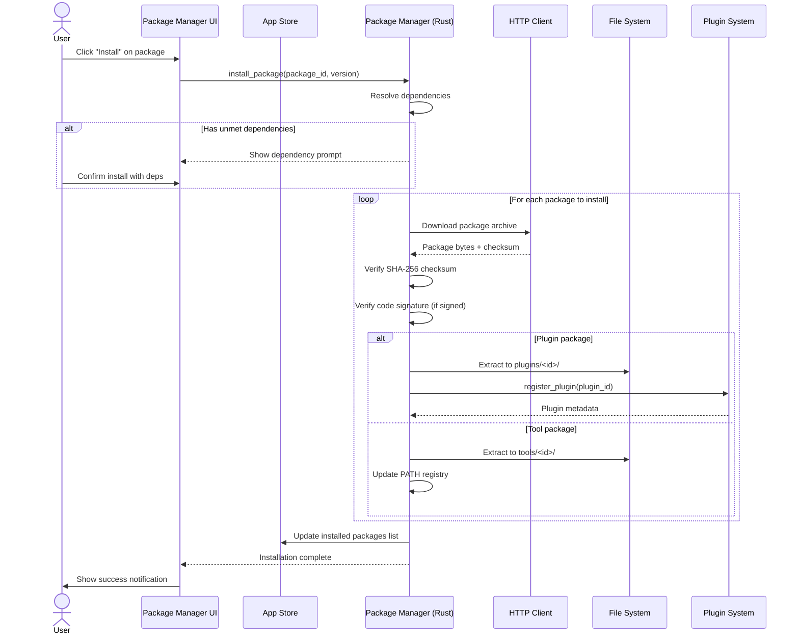
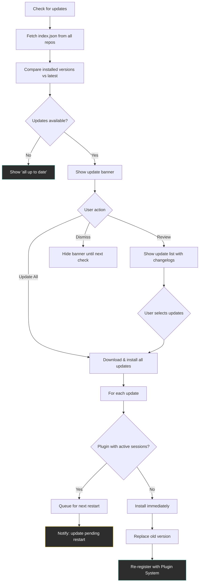
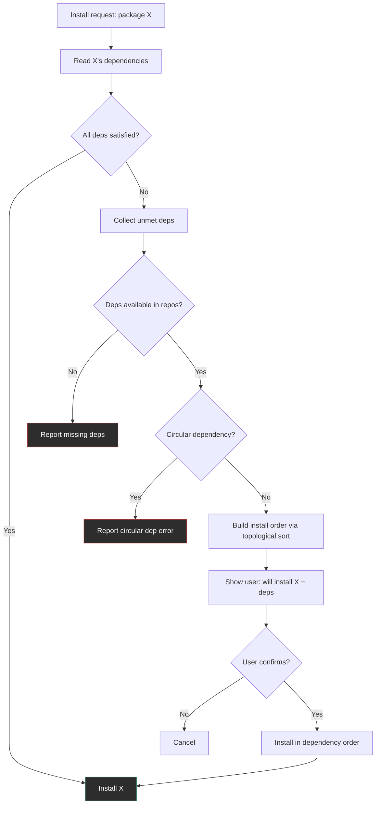
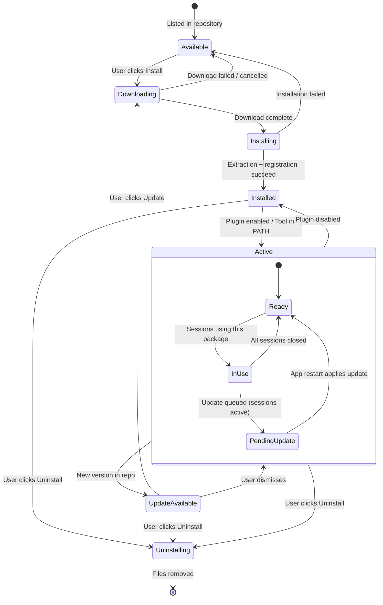
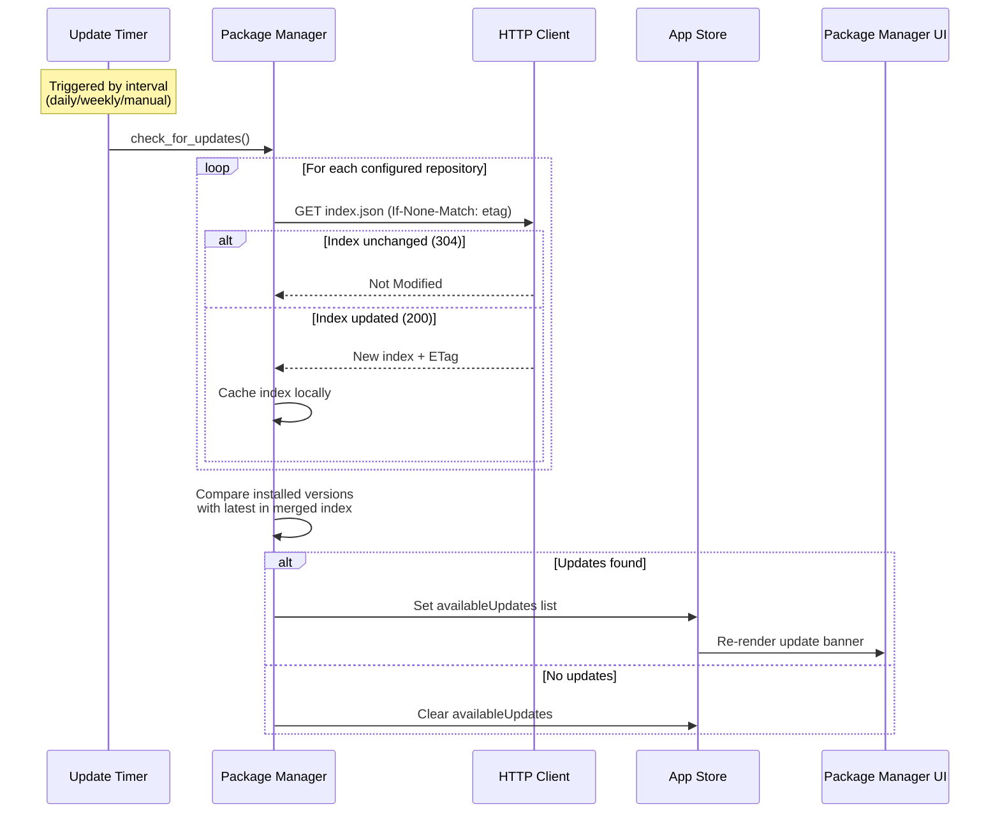
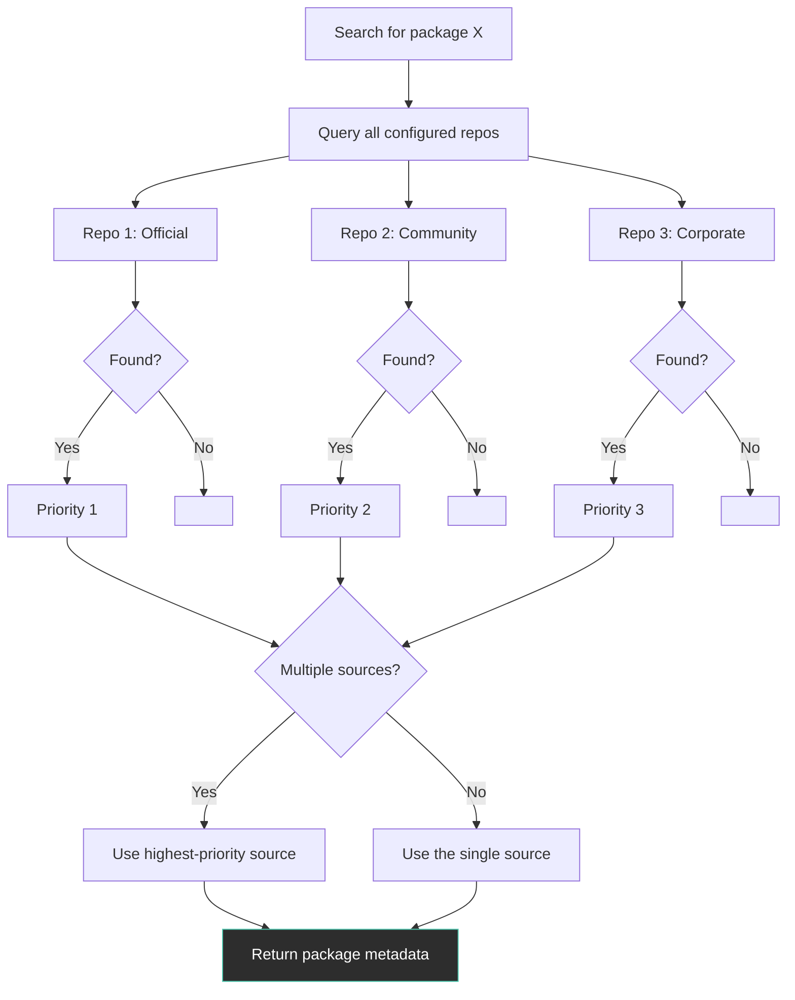
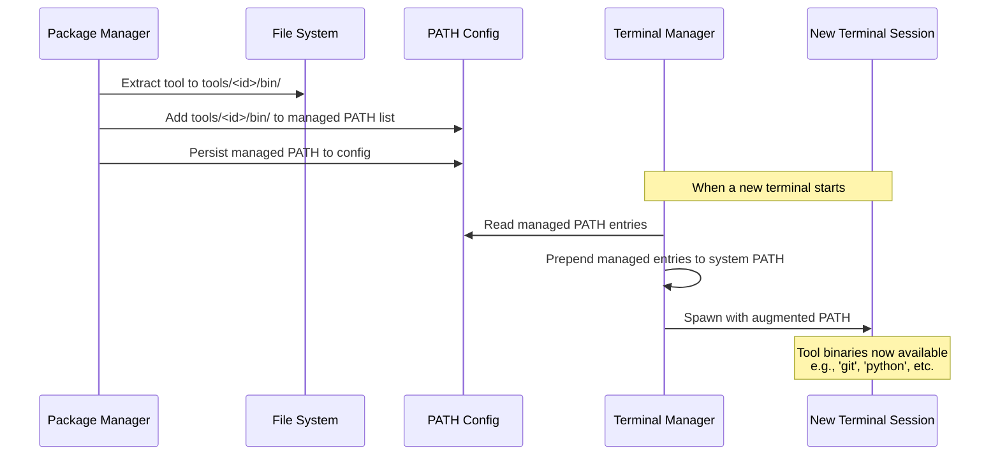
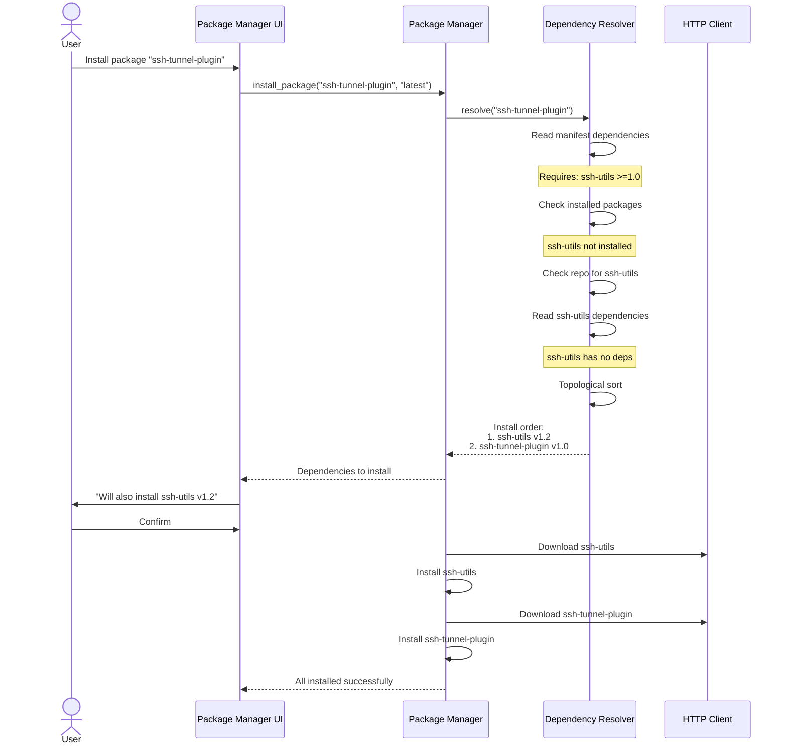
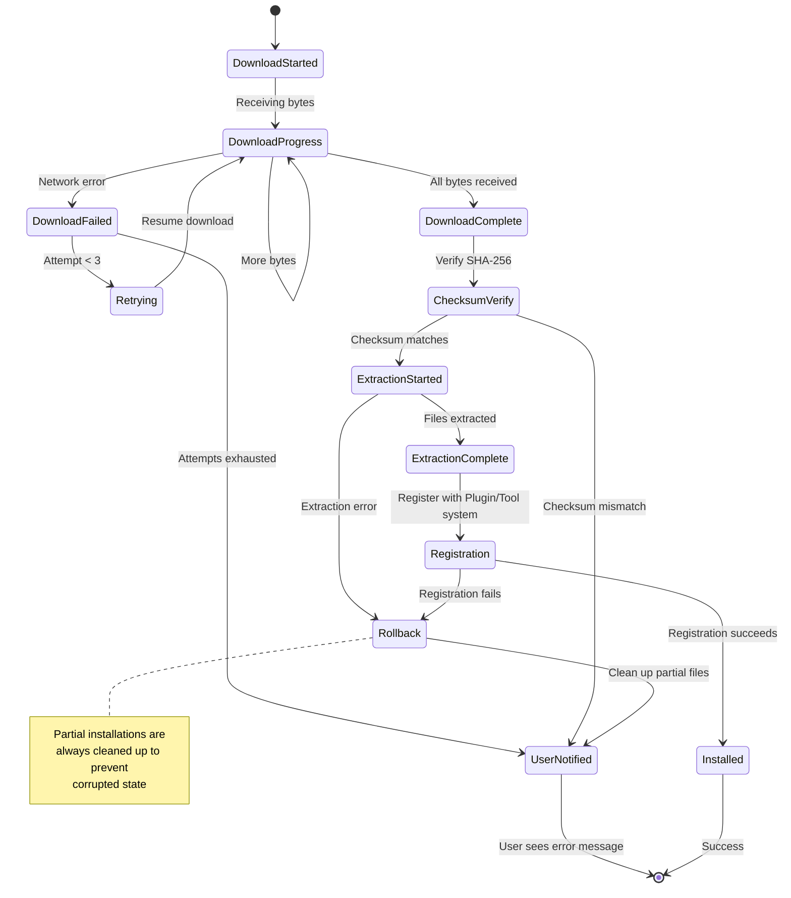
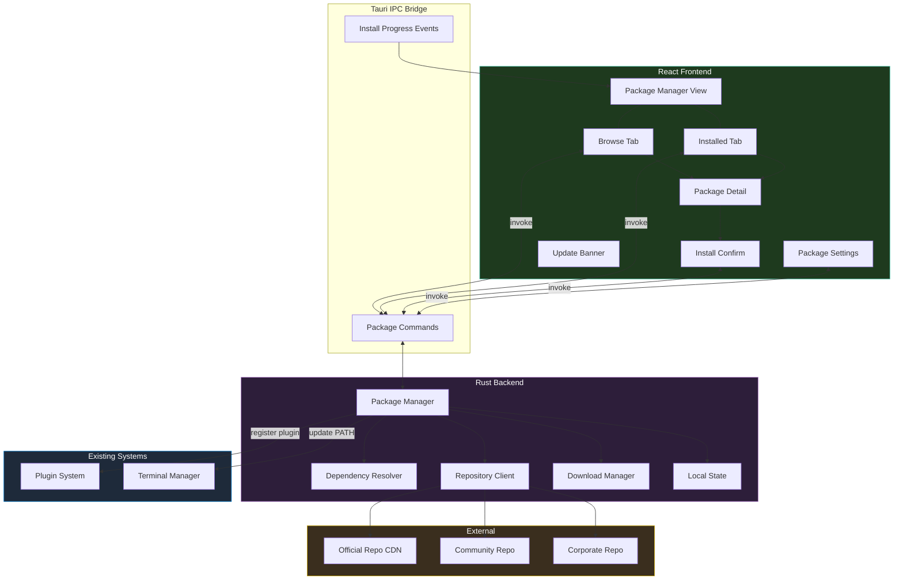

# Package Manager — Behavior

Behavior diagrams for the [package-manager concept](concept.md). State machines, sequences, and
flows live here; visual layout lives in [`mockups/`](mockups/).

---

## Installing a Package

## Updating Packages

## Dependency Resolution

## Package Lifecycle State Machine

## Update Check Sequence

## Repository Source Resolution

## Tool Package PATH Integration

## Dependency Resolution Sequence

## Error Handling During Installation

## Architecture Overview

