# Plugin System — Behavior

Behavior diagrams for the [plugin-system concept](concept.md). State machines, sequences, and
flows live here; visual layout lives in [`mockups/`](mockups/).

---

## Plugin Lifecycle (Install → Activate → Use → Deactivate)

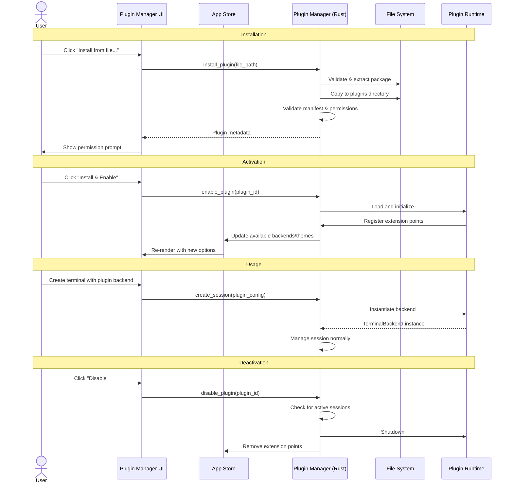

## Plugin Discovery and Loading

On application startup, the Plugin Manager scans the plugins directory for installed plugins:

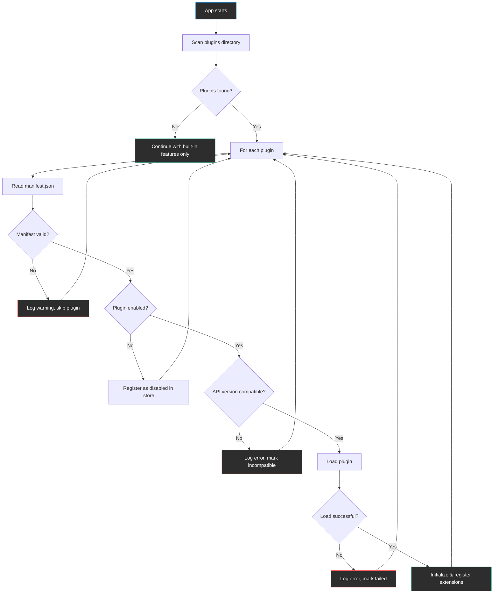

## Plugin Lifecycle State Machine

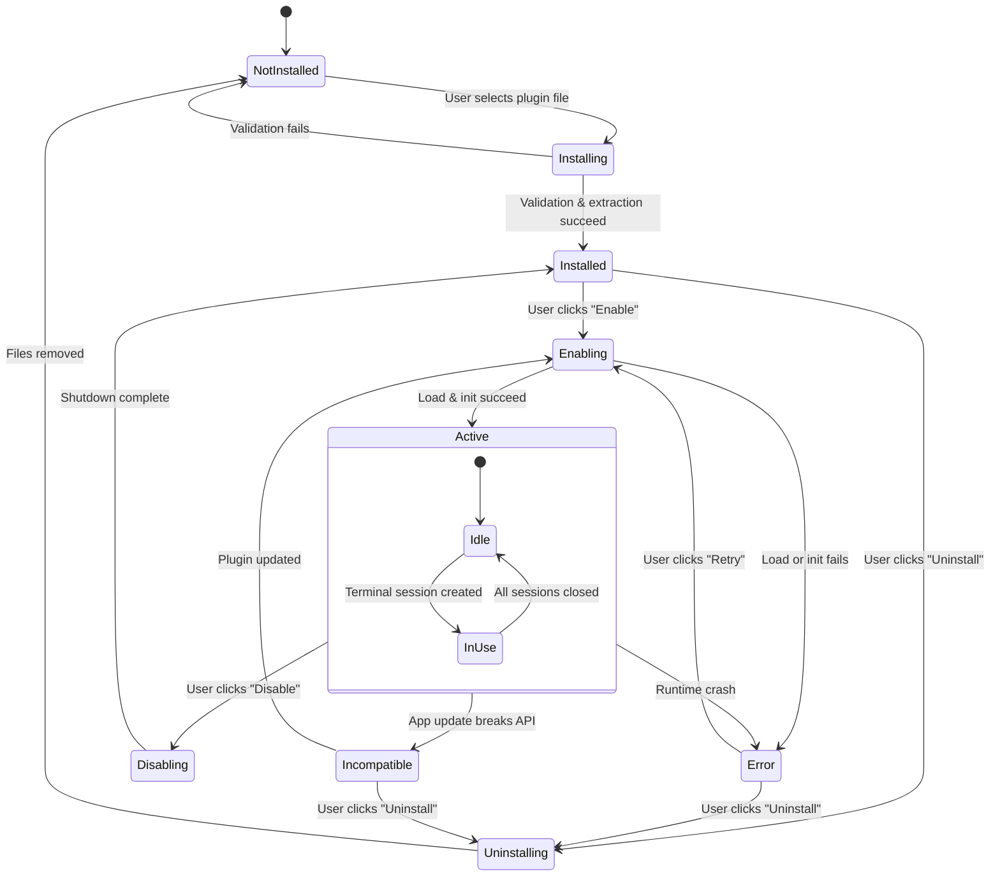

## Terminal Backend Plugin Session Flow

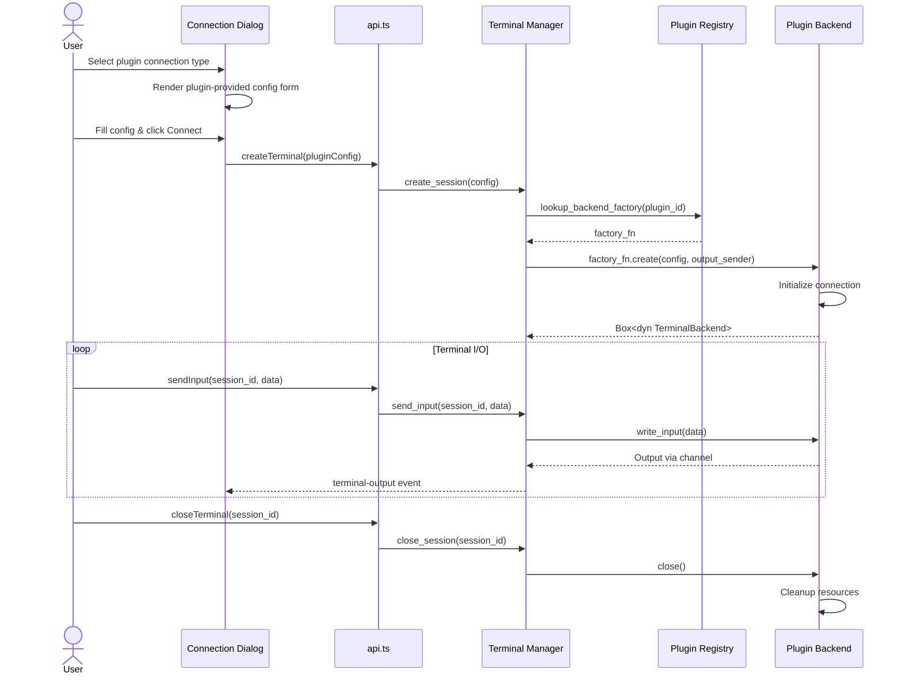

## Protocol Parser Plugin Data Flow

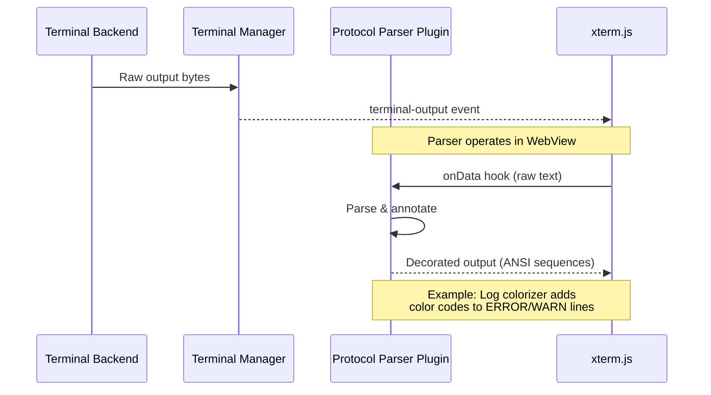

## Theme Plugin Loading

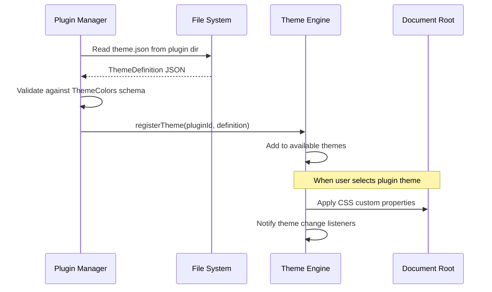

## Plugin Installation Sequence

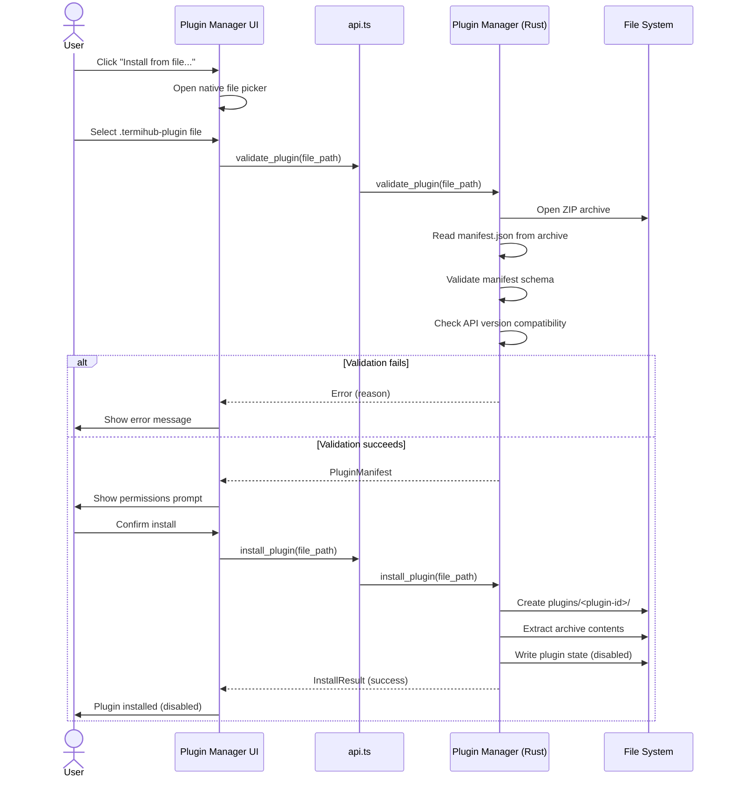

## Plugin Manager Startup Sequence

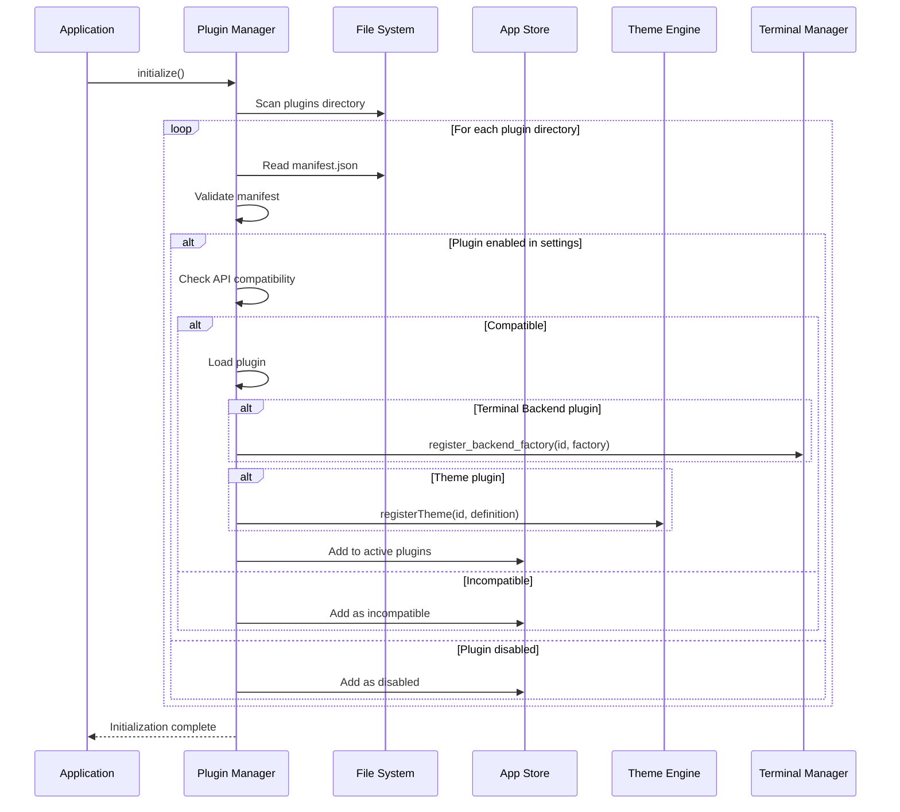

## Error Recovery State Machine

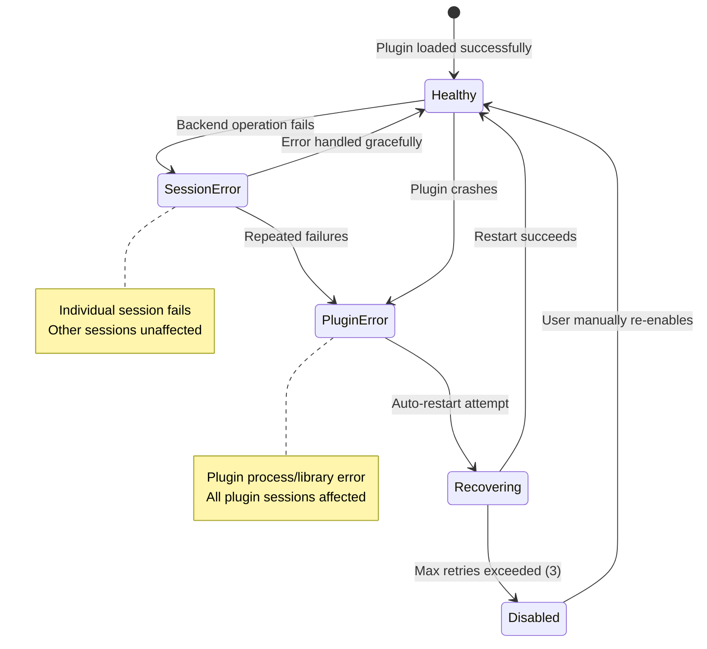

## Security Considerations — Install/Permission Gate

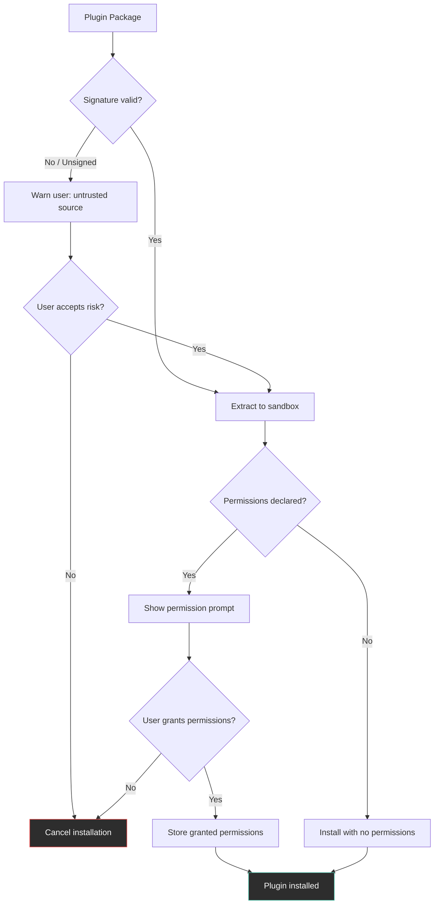

## Architecture Overview

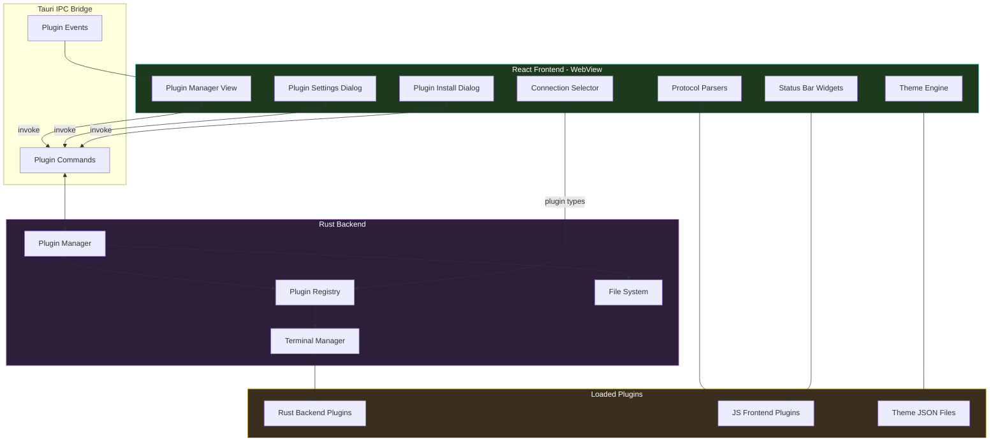

---

## Session Filtering & State Rules

| Plugin state   | Behavior in the Plugin Manager                                         |
| -------------- | ---------------------------------------------------------------------- |
| `active`       | Extension points registered; backend/theme available; green state dot  |
| `disabled`     | Installed but not loaded; no extension points; grey state dot          |
| `error`        | Load/init failed; error message in detail panel; red state dot + Retry |
| `incompatible` | API version mismatch; auto-disabled; red state dot; prompt to update   |
| `installed`    | Freshly extracted, awaiting first enable; grey state dot               |

## Edge Cases

| Scenario                                     | Behavior                                                       |
| -------------------------------------------- | -------------------------------------------------------------- |
| Two plugins provide the same connection type | Second type is suffixed with the plugin name to disambiguate   |
| Plugin and core theme share a name           | Core theme wins; plugin theme is prefixed with the plugin name |
| Plugin directory not writable                | Clear error with the path and required permissions             |
| Plugin dependency missing (e.g. `kubectl`)   | Actionable instructions shown in the detail panel              |
| App update changes the plugin API version    | Incompatible plugins auto-disabled with a notification         |
| Plugin file larger than 50 MB                | Installation rejected; size limit enforced before extraction   |
| Concurrent install/uninstall                 | Operations serialized to prevent race conditions               |
