# RDP Sessions — Behavior

Behavior diagrams for the [rdp-sessions concept](concept.md). State machines, sequences, and flows
live here; visual layout lives in [`mockups/`](mockups/).

---

## Scale Modes

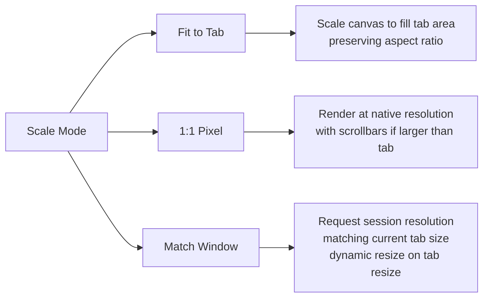

## Clipboard Integration

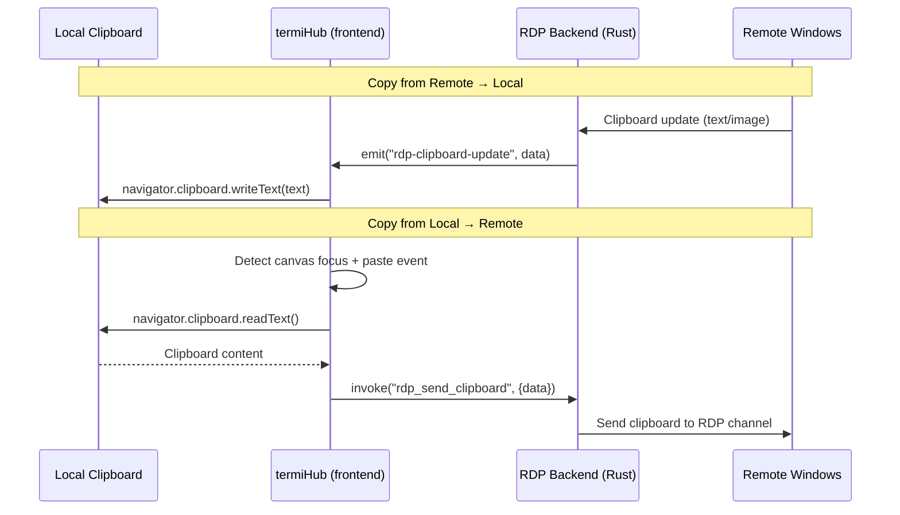

Clipboard sync is bidirectional for text content. Image clipboard support is a stretch goal (requires
format conversion between Windows CF_DIB and PNG).

## Connection Lifecycle

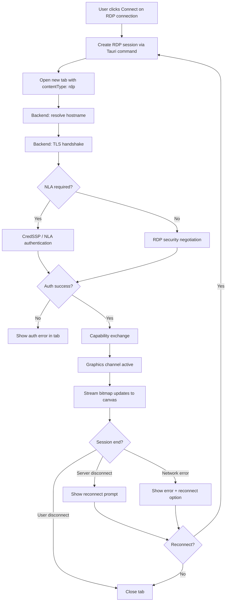

## Authentication Methods

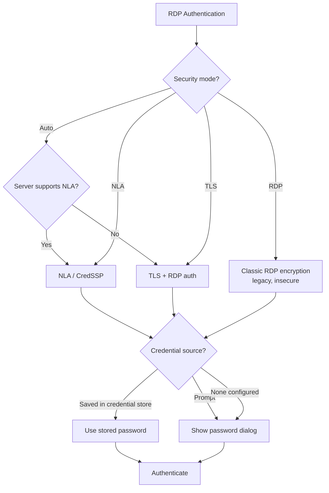

Supported authentication:

- **NLA (Network Level Authentication)** — CredSSP with NTLM or Kerberos. This is the default and most
  secure option. IronRDP supports CredSSP with NTLM; Kerberos is a stretch goal.
- **TLS** — TLS encryption with RDP-level password authentication.
- **RDP** — Legacy RDP encryption. Included for compatibility with old servers but shown with a
  security warning.

## Resolution Negotiation & Dynamic Resize

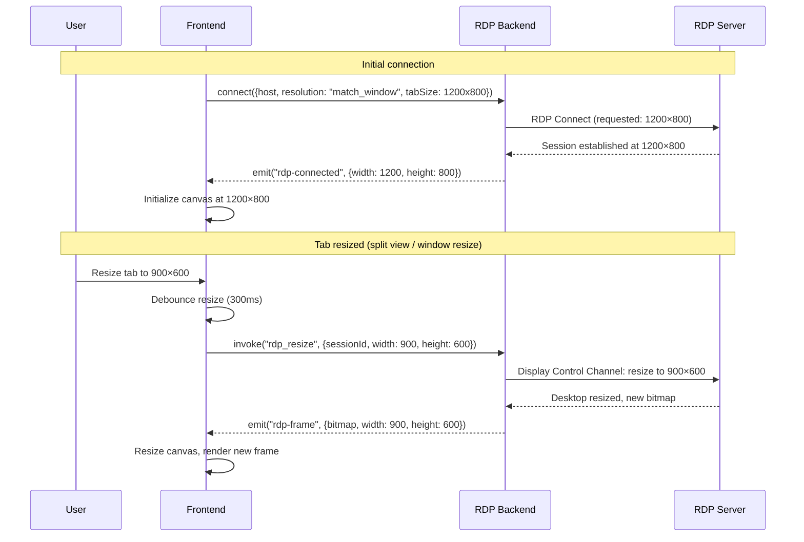

Dynamic resize uses the RDP Display Control Channel (available in RDP 8.1+). For older servers that
don't support dynamic resize, the session stays at the initially negotiated resolution and the canvas
scales to fit.

## Input Handling

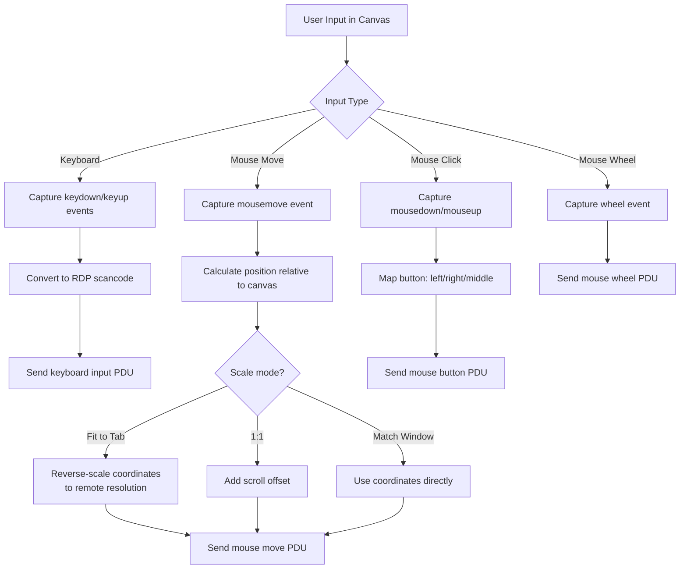

Mouse coordinate mapping is critical when using "Fit to Tab" mode — screen coordinates from the
browser canvas must be reverse-scaled to the remote desktop's resolution. The frontend handles this
transformation before sending coordinates to the backend.

## Drive Redirection

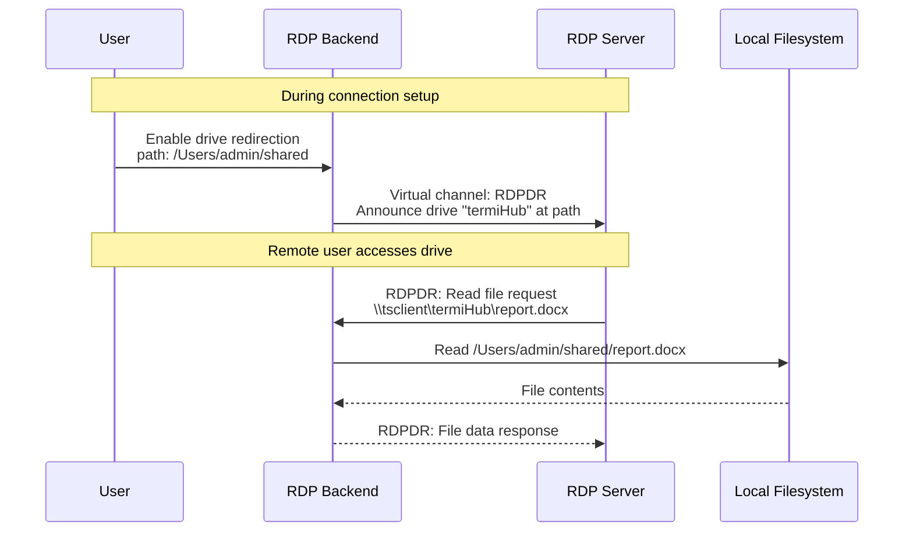

The RDPDR (RDP Device Redirection) virtual channel is handled by IronRDP's channel infrastructure.
The mapped drive appears as `\\tsclient\termiHub` in the remote Windows session.

## Session Reconnection

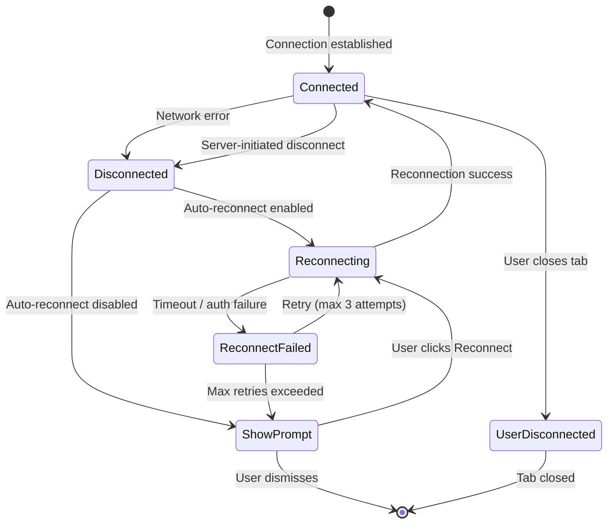

When the network drops, the RDP tab shows a semi-transparent overlay: "Connection lost.
Reconnecting... (attempt 2/3)" with a cancel button.

## RDP Session State Machine

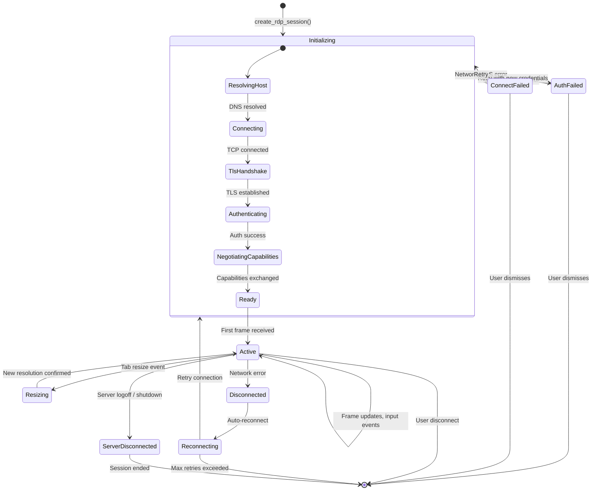

## Frame Rendering Pipeline

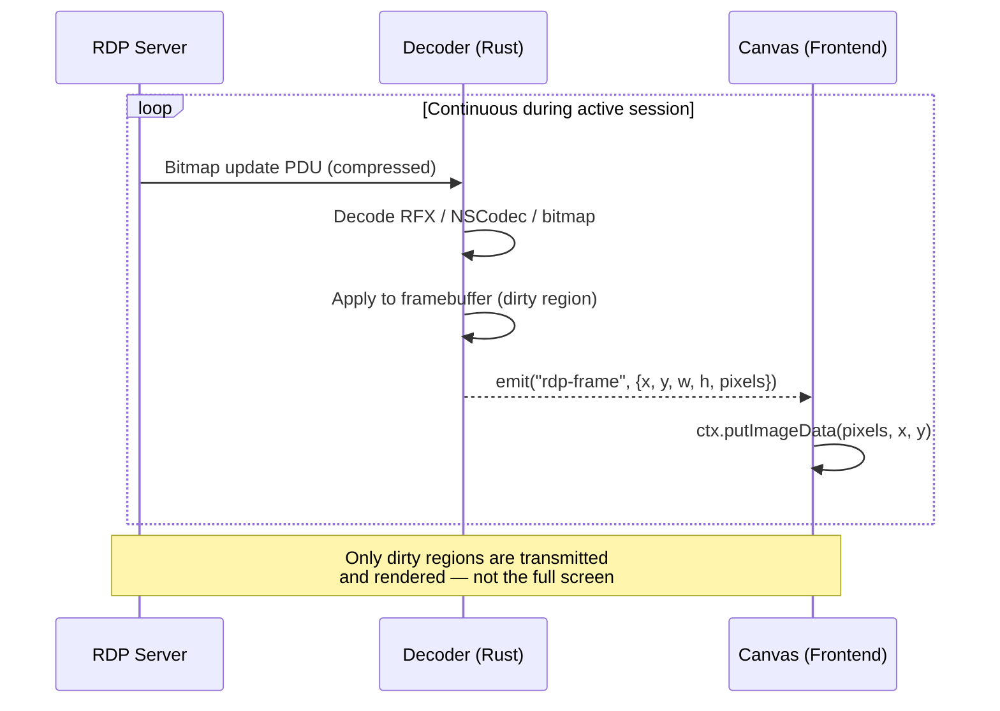

The backend maintains a full framebuffer in Rust memory. On each bitmap update, only the changed
(dirty) region is decoded and sent to the frontend as raw RGBA pixel data. The frontend uses
`CanvasRenderingContext2D.putImageData()` to update only the dirty rectangle, minimizing rendering
overhead.

### Frame Data Transfer Options

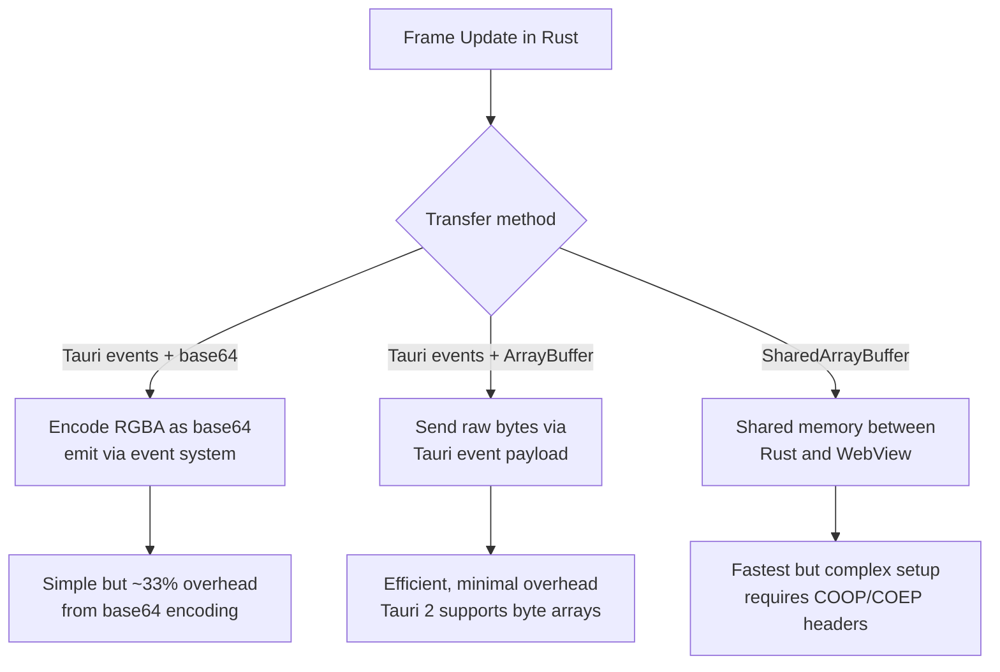

## Full Connection Sequence

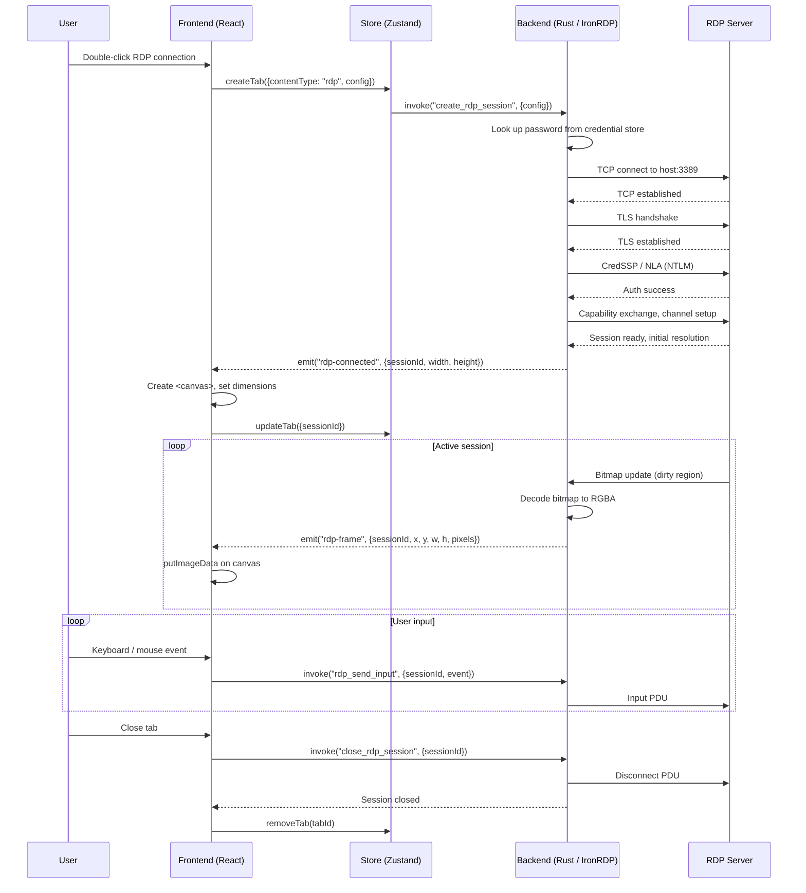

## Clipboard Sync State Machine

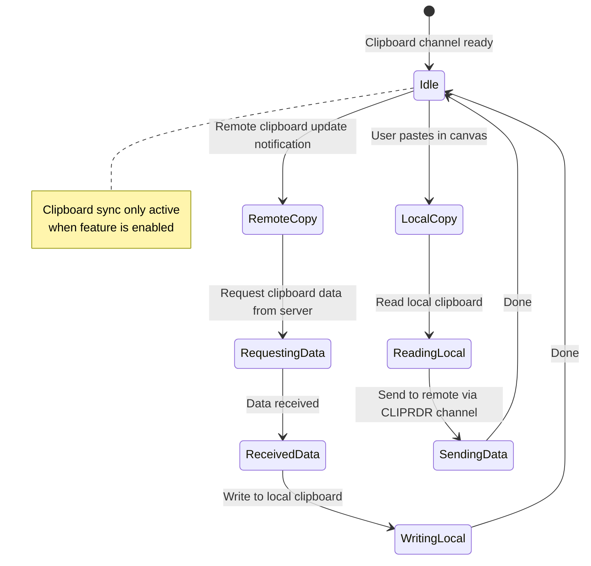

## Connection Type Routing

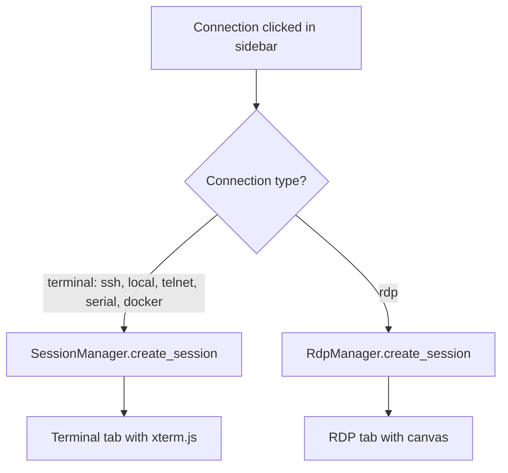

## Implementation Phases

```mermaid
gantt
    title RDP Sessions Implementation Phases
    dateFormat X
    axisFormat %s

    section Phase 1 — Core Connection
    RdpConfig + connection editor schema        :a1, 0, 2
    IronRDP integration + basic connect/auth    :a2, 2, 4
    Frame rendering pipeline (Rust → canvas)    :a3, 4, 3
    Keyboard + mouse input forwarding           :a4, 5, 3

    section Phase 2 — UI Integration
    RDP tab + panel components                  :b1, 8, 3
    Toolbar (Ctrl+Alt+Del, fullscreen, scale)   :b2, 9, 2
    Tab bar + split view integration            :b3, 10, 2
    Status bar RDP indicators                   :b4, 11, 1

    section Phase 3 — Features
    Clipboard sync (CLIPRDR)                    :c1, 12, 3
    Dynamic resize (Display Control Channel)    :c2, 12, 2
    Scale modes (fit, 1:1, match)               :c3, 14, 2
    Credential store integration                :c4, 14, 1

    section Phase 4 — Advanced (Stretch)
    Drive redirection (RDPDR)                   :d1, 16, 3
    Audio playback redirection                  :d2, 16, 3
    Session reconnection                        :d3, 19, 2
    Certificate management (trust store)        :d4, 19, 2
```
