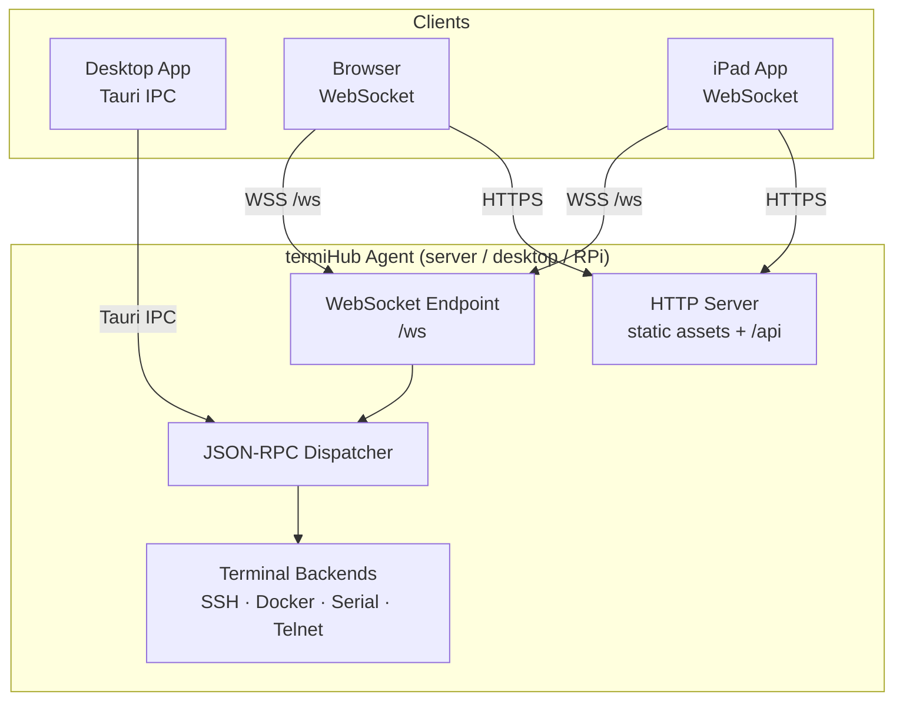
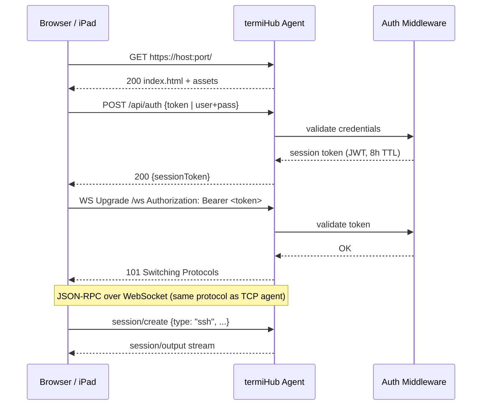
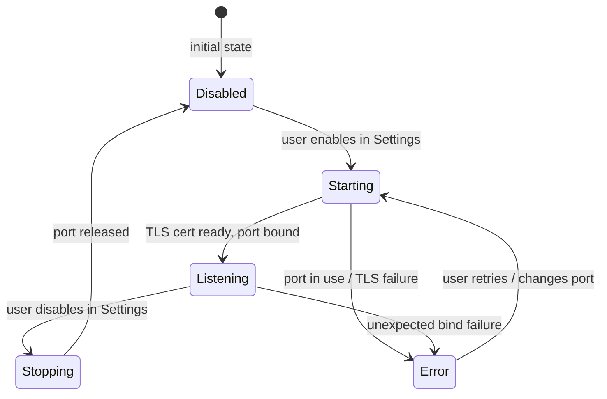
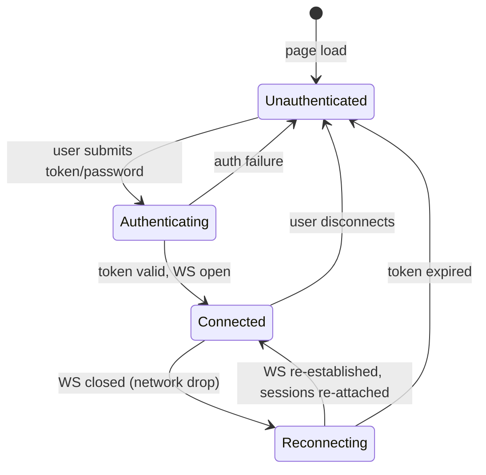
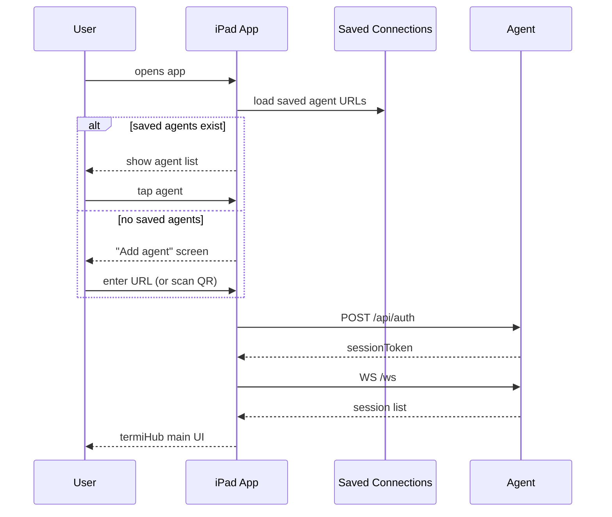

# Remote Client Mode (Web & iPad)

> GitHub Issue: #TBD

## Overview

Enable termiHub to be accessed as a web application from a browser or as a native iPad app,
in addition to the existing desktop app. In both cases the client is a **pure remote client**:
all terminal backends, file access, and SSH handling continue to run in a termiHub agent on a
server, desktop, or Raspberry Pi. The client UI connects to that agent over an authenticated
WebSocket connection and renders the familiar termiHub interface.

**Motivation**: Users increasingly want to manage remote infrastructure from a browser tab or
from an iPad while away from their desk. termiHub already has a capable remote agent with
JSON-RPC over TCP — this concept extends that transport to WebSocket + HTTP to unlock both
use-cases with a shared implementation.

**Key goals**:

- **Web client**: The agent serves the React frontend as a static web app and exposes a
  WebSocket endpoint; users open a browser URL instead of launching the desktop app
- **iPad client**: A Tauri iOS build (or PWA) connects to the same WebSocket endpoint,
  providing a touch-optimised, App-Store-distributable experience
- **Shared transport abstraction**: One frontend codebase, two transports — Tauri IPC (desktop)
  and WebSocket (web/iPad) — selected at runtime via a thin adapter layer
- **No local shell on constrained clients**: iOS and browser sessions hide the local-shell tab;
  all connections are remote (SSH, serial-via-agent, Docker, etc.)
- **Security first**: TLS, token-based session auth, and per-connection authorisation before any
  WebSocket upgrade is accepted

**Non-goals**:

- Replacing the desktop app — the Tauri desktop build remains the primary and most capable target
- Providing local PTY access on iOS (iOS platform restriction, cannot be worked around)
- Full offline capability (both web and iPad modes require network access to an agent)



---

## UI Interface

### Web Client (Browser)

The browser renders the full termiHub React SPA served from the agent's built-in HTTP server.
The experience is visually identical to the desktop app with the following differences:

- **No local-shell connection type** — the connection type selector omits "Local Shell"; existing
  local-shell connections in the workspace show a "not available in remote mode" banner
- **Connection bar** (top of window, replaces the OS title bar) — shows the agent hostname/IP,
  connection health indicator (green/yellow/red dot), and a disconnect button
- **Login screen** — shown before the main UI if the agent requires authentication:

```
┌──────────────────────────────────────────────────────────┐
│                                                          │
│              termiHub                                    │
│                                                          │
│   Connect to agent at agent.example.com                  │
│                                                          │
│   Token  [________________________________]              │
│                                                          │
│                        [Connect]                         │
│                                                          │
│   ─── or ───                                             │
│                                                          │
│   Username  [______________________]                     │
│   Password  [______________________]                     │
│                        [Sign in]                         │
│                                                          │
└──────────────────────────────────────────────────────────┘
```

- **SFTP / file browser** — fully functional; files are on the agent host, not the client
- **Settings** — saved to the agent; changes are reflected immediately for all connected clients
- **Split views, drag-and-drop tabs** — identical to desktop; no functional reduction

### iPad Client (Tauri iOS / PWA)

Same UI as the web client, with touch-specific additions:

- **On-screen toolbar** (appears below the terminal, above the keyboard):

```
┌───────────────────────────────────────────────────────┐
│  [Tab]  [Esc]  [Ctrl]  [Alt]  [↑]  [↓]  [←]  [→]    │
│  [F1] [F2] [F3] [F4] [F5] [F6] [F7] [F8] [F9] [F10]  │
└───────────────────────────────────────────────────────┘
```

- **Side panel gesture** — swipe right from the left edge to open the connection sidebar;
  swipe left to close it (mirrors the Activity Bar behaviour on desktop)
- **Split view** — supported via a vertically stacked layout (horizontal split is hidden on
  small screens; available on iPad landscape via settings toggle)
- **Pinch-to-zoom** — adjusts terminal font size; double-tap resets to default
- **Connection indicator** — persistent pill in the top-right corner showing agent hostname and
  latency; tap to expand connection detail sheet

### Agent Configuration Screen (Desktop Only)

A new "Web & Mobile Access" settings page (accessible from the Settings sidebar) lets the user
configure the agent's HTTP listener:

```
┌──────────────────────────────────────────────────────────────┐
│ Settings › Web & Mobile Access                               │
│──────────────────────────────────────────────────────────────│
│ Enable web access          [toggle: OFF]                     │
│                                                              │
│ Listen address             [0.0.0.0          ]               │
│ Port                       [7681              ]               │
│                                                              │
│ ─── TLS ───                                                  │
│ Mode        [Self-signed (auto-generated) ▾]                 │
│              ├─ Self-signed (auto-generated)                  │
│              ├─ Custom certificate + key                      │
│              └─ Disable TLS (LAN only, not recommended)       │
│                                                              │
│ ─── Authentication ───                                       │
│ Mode        [Token ▾]                                        │
│              ├─ Token (copy/paste a long-lived token)         │
│              └─ Username + Password                           │
│                                                              │
│ Token       [••••••••••••••••••••]  [Regenerate] [Copy]      │
│                                                              │
│ ─── Access URL ───                                           │
│ https://192.168.1.42:7681    [Copy] [Show QR]                │
│                                                              │
└──────────────────────────────────────────────────────────────┘
```

The **Show QR** button displays a QR code the user can scan with an iPad or phone to open the
login screen directly.

---

## General Handling

### Starting the Web Listener

1. User enables "Web & Mobile Access" in Settings
2. The Tauri backend starts an HTTP/WebSocket server on the configured address and port
3. A TLS certificate is generated (or loaded from disk) and stored in the credential store
4. The frontend build (Vite output) is embedded in the agent binary as static assets at
   compile time (similar to how Tauri bundles the web view)
5. The agent logs a line: `Web access available at https://<ip>:<port>`
6. The access URL and QR code appear in the Settings panel

### Client Connection Flow



### Transport Abstraction (Frontend)

The frontend today calls `import { invoke } from "@tauri-apps/api/core"` and
`import { listen } from "@tauri-apps/api/event"` throughout `src/services/api.ts` and
`src/services/events.ts`. In remote-client mode these are replaced by a WebSocket
transport that speaks the same JSON-RPC dialect as the desktop-to-agent protocol.

A thin adapter is selected at startup:

```
src/services/
  transport/
    index.ts          ← selects TauriTransport or WebSocketTransport
    TauriTransport.ts ← wraps invoke/listen (current behaviour)
    WebSocketTransport.ts ← wraps WebSocket + JSON-RPC
  api.ts              ← unchanged; calls transport.invoke(...)
  events.ts           ← unchanged; calls transport.listen(...)
```

Detection: if `window.__TAURI__` is present → TauriTransport; otherwise → WebSocketTransport.

### Session Lifetime

- Sessions are owned by the agent process, not the client connection
- If the WebSocket drops (network hiccup, iPad backgrounded), the terminal session continues
  running on the agent
- On reconnect the client receives a session list and can re-attach to running sessions
- Desktop app sessions are not visible to web/iPad clients (separate session namespaces)

### No-Local-Shell Enforcement

When the transport is WebSocketTransport:

- The connection type selector filters out `local_shell`
- Workspace entries of type `local_shell` render a disabled "Local shell — not available in
  remote mode" placeholder tab
- The "Open local shell" keyboard shortcut is suppressed

### Multi-Client Behaviour

Multiple clients (e.g. desktop + browser simultaneously) can connect to the same agent:

- Each client has independent tab layout and workspace view
- Sessions (terminal processes) can optionally be shared (broadcast-input feature) but are
  not shared by default
- Settings changes made by one client are reflected to all connected clients via a
  `settings/changed` push event

### Security Considerations

- TLS is mandatory in the default configuration; disabling it requires an explicit opt-in
- Session tokens are short-lived JWTs (8 h); a refresh endpoint extends them silently while
  the client is active
- Tokens are never logged
- The agent binds to `127.0.0.1` by default; `0.0.0.0` requires explicit user action
- Rate-limiting on `/api/auth` (5 attempts per minute per IP) to prevent brute-force

---

## States & Sequences

### Agent Listener State Machine



### Client Session State Machine



### iPad App Launch Sequence



---

## Preliminary Implementation Details

> This section reflects the codebase as of April 2026. The architecture may evolve before
> implementation begins.

### Phase 1 — Transport Abstraction (shared prerequisite)

**Files to create / modify:**

| Path                                           | Change                                                   |
| ---------------------------------------------- | -------------------------------------------------------- |
| `src/services/transport/index.ts`              | New — transport selector                                 |
| `src/services/transport/TauriTransport.ts`     | New — wraps existing `invoke`/`listen`                   |
| `src/services/transport/WebSocketTransport.ts` | New — JSON-RPC over WebSocket                            |
| `src/services/api.ts`                          | Refactor to call transport instead of Tauri API directly |
| `src/services/events.ts`                       | Refactor to subscribe through transport                  |

The JSON-RPC protocol over WebSocket mirrors the existing `core/src/protocol/` message types.
No changes to the protocol itself are needed.

### Phase 2 — Agent HTTP / WebSocket Server

The agent (`agent/`) gains a new entry-point mode `--web` (alongside existing `--stdio` and
`--listen`):

| Path                 | Change                                             |
| -------------------- | -------------------------------------------------- |
| `agent/src/io/`      | Add `http.rs` — axum-based HTTP + WebSocket server |
| `agent/src/main.rs`  | Add `--web` flag, bind HTTP listener               |
| `agent/src/handler/` | Reuse existing JSON-RPC dispatcher unchanged       |

The agent embeds the compiled frontend at build time using `include_dir!` or equivalent.
The Vite build output is checked into `agent/assets/` (git-ignored large files; built by CI).

**Rust dependencies to add:**

- `axum` (HTTP + WebSocket)
- `tokio-tungstenite` (WebSocket framing)
- `jsonwebtoken` (JWT auth)
- `rcgen` (self-signed TLS cert generation)
- `rustls` (TLS, already transitively present)

### Phase 3 — Desktop Agent Control (Settings UI)

The Tauri desktop app gains "Web & Mobile Access" settings backed by a new config section in
`src-tauri/src/connection/config.rs` and a new Tauri command group in
`src-tauri/src/commands/web_access.rs`.

### Phase 4 — Tauri iOS Build

Tauri 2 supports iOS via `tauri ios init` / `tauri ios build`. The key steps:

1. Add iOS target to `src-tauri/tauri.conf.json` capability definitions
2. Disable local-shell connection type via a compile-time feature flag `cfg(target_os = "ios")`
3. Add touch toolbar component `src/components/Terminal/TouchToolbar.tsx`
4. Responsive CSS breakpoints for iPad screen sizes
5. QR code scanner for agent URL entry (uses the Tauri camera plugin)

**Note:** Tauri iOS support is experimental as of Tauri 2.x. Validate that the iOS build
toolchain and WKWebView capabilities are stable enough before committing to Phase 4.
A PWA fallback (skipping the native wrapper) is viable if Tauri iOS proves too immature.

### Estimated Effort

| Phase                     | Effort    | Dependency |
| ------------------------- | --------- | ---------- |
| 1 — Transport abstraction | 2–3 weeks | None       |
| 2 — Agent HTTP/WS server  | 3–4 weeks | Phase 1    |
| 3 — Desktop settings UI   | 1 week    | Phase 2    |
| 4 — Tauri iOS / PWA       | 4–6 weeks | Phases 1–3 |

Phases 1–3 together deliver the web-browser client. Phase 4 adds the iPad app.
