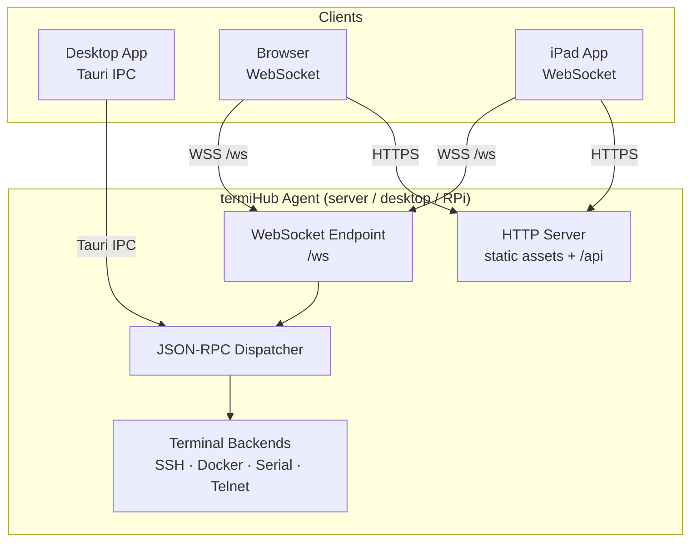
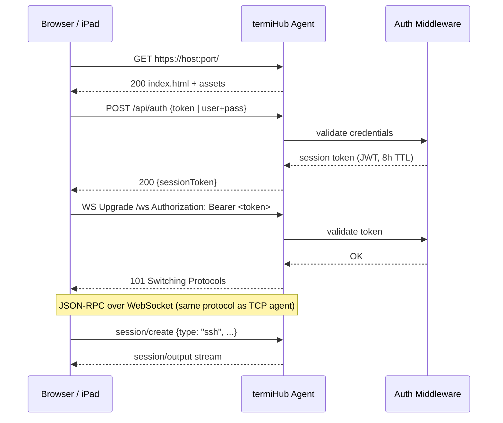
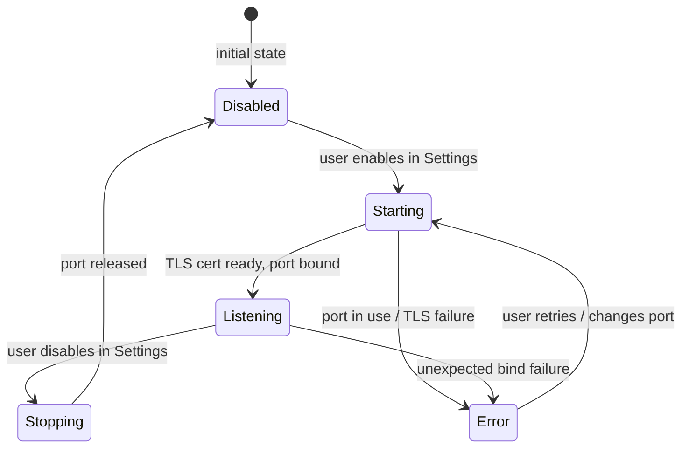
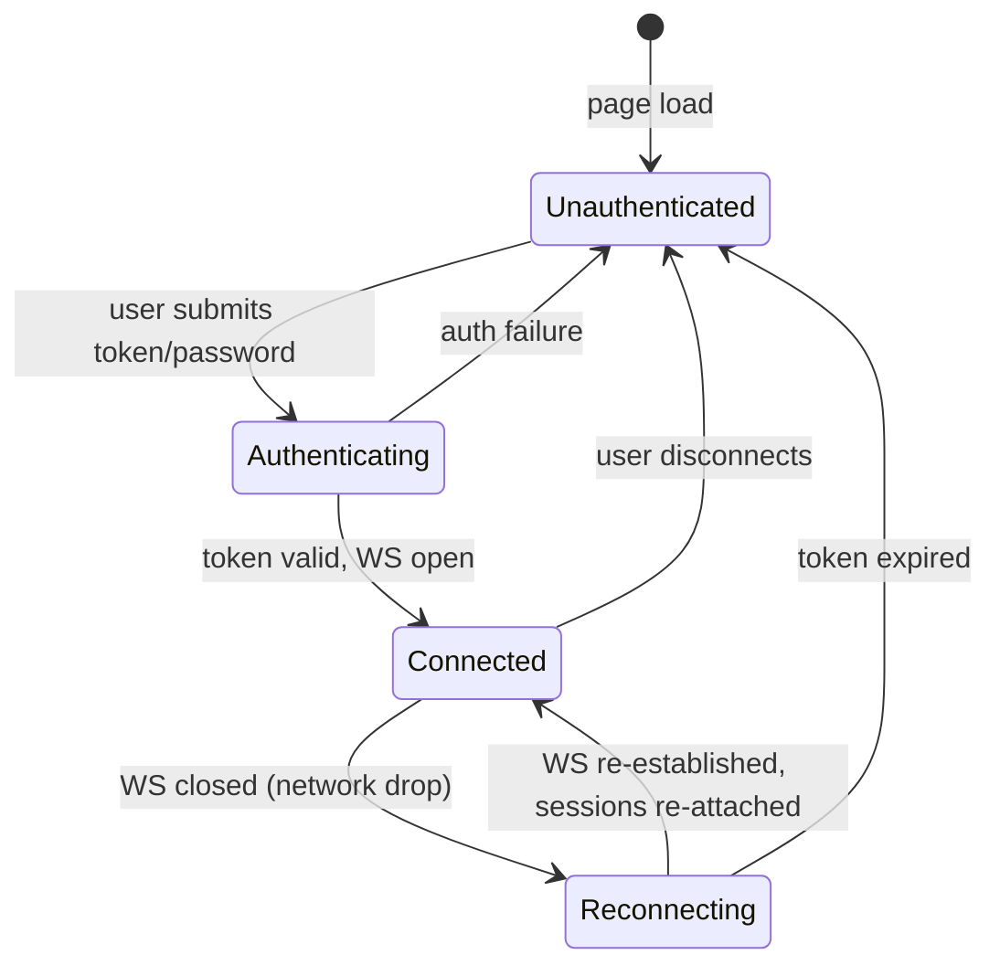
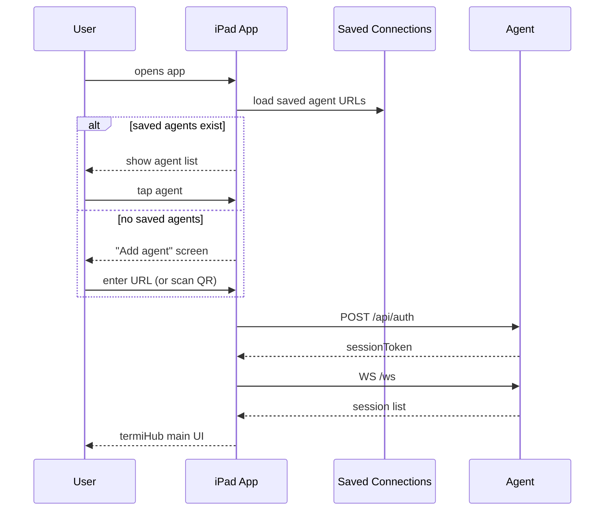

# Remote Client Mode — Behavior

Behavior diagrams for the [remote-client-mode concept](concept.md). Architecture, state machines,
and sequences live here; visual layout lives in [`mockups/`](mockups/).

---

## Architecture Overview

## Client Connection Flow

## Agent Listener State Machine

## Client Session State Machine

## iPad App Launch Sequence

