# Rlogin and RSH Protocol Support

> GitHub Issue: [#523](https://github.com/armaxri/termiHub/issues/523)

## Overview

Add Rlogin (Remote Login) and RSH (Remote Shell) protocol support to termiHub, enabling connections to legacy Unix systems that still rely on these older remote access protocols.

**Motivation**: While largely superseded by SSH, Rlogin and RSH are still encountered in legacy Unix/AIX/HP-UX environments, industrial control systems, older network equipment, and isolated lab networks. MobaXterm supports both protocols. Adding Rlogin and RSH improves termiHub's compatibility with legacy infrastructure, positioning it as a comprehensive terminal hub for heterogeneous environments.

**Key goals**:

- **Legacy compatibility**: Connect to systems that only offer Rlogin or RSH access
- **Familiar workflow**: Same connection editor, tab management, and terminal experience as other protocols
- **Prominent security warnings**: Both protocols transmit credentials in plaintext — the UI must make this risk unmistakable
- **Minimal complexity**: Straightforward TCP-based protocols, similar in implementation effort to the existing Telnet backend

### Protocol Summary

| Aspect           | Rlogin                              | RSH                                                |
| ---------------- | ----------------------------------- | -------------------------------------------------- |
| **RFC**          | RFC 1282                            | Based on BSD rsh/rcmd protocol                     |
| **Default port** | 513                                 | 514                                                |
| **Purpose**      | Interactive remote login (terminal) | Remote command execution                           |
| **Auth model**   | `.rhosts` trust + username          | `.rhosts` trust + username                         |
| **Encryption**   | None — plaintext                    | None — plaintext                                   |
| **Resize**       | Yes (urgent TCP data, 0x80 flag)    | No                                                 |
| **Interactive**  | Yes (full terminal session)         | Primarily command-based, can be used interactively |

## UI Interface

### Connection Editor

Rlogin and RSH appear as new connection types in the Connection Editor's type selector dropdown, alongside Local, SSH, Telnet, Serial, Docker, and WSL.

#### Rlogin Connection Editor

```
┌─────────────────────────────────────────────────────────────────┐
│ Connection Type: [Rlogin ▾]                                     │
│                                                                 │
│ ┌─────────────────────────────────────────────────────────────┐ │
│ │ ⚠ SECURITY WARNING                                         │ │
│ │ Rlogin transmits all data including credentials in plain-   │ │
│ │ text. Do not use over untrusted networks. Consider SSH      │ │
│ │ as a secure alternative.                                    │ │
│ └─────────────────────────────────────────────────────────────┘ │
│                                                                 │
│ ─── Connection ───                                              │
│ Name:            [Production AIX Server   ]                     │
│ Host:            [aix-prod.internal.local ]                     │
│ Port:            [513      ]                                    │
│                                                                 │
│ ─── Authentication ───                                          │
│ Remote Username: [operator                ]                     │
│ Local Username:  [arne                    ]  (auto-detected)    │
│                                                                 │
│ ─── Terminal ───                                                │
│ Terminal Type:   [xterm-256color ▾]                              │
│ Terminal Speed:  [38400/38400     ]  (baud rate sent to server)  │
│                                                                 │
│                                    [Test Connection]  [Save]    │
└─────────────────────────────────────────────────────────────────┘
```

Fields:

- **Host** (required): Hostname or IP address of the remote system
- **Port** (required, default: 513): TCP port
- **Remote Username** (required): Username to log in as on the remote system
- **Local Username** (optional, auto-detected): Local username sent during handshake; defaults to the current OS user
- **Terminal Type** (optional, default: `xterm-256color`): Terminal emulation type sent to the server
- **Terminal Speed** (optional, default: `38400/38400`): Baud rate string sent during Rlogin handshake

#### RSH Connection Editor

```
┌─────────────────────────────────────────────────────────────────┐
│ Connection Type: [RSH ▾]                                        │
│                                                                 │
│ ┌─────────────────────────────────────────────────────────────┐ │
│ │ ⚠ SECURITY WARNING                                         │ │
│ │ RSH transmits all data including credentials in plaintext.  │ │
│ │ Do not use over untrusted networks. Consider SSH as a       │ │
│ │ secure alternative.                                         │ │
│ └─────────────────────────────────────────────────────────────┘ │
│                                                                 │
│ ─── Connection ───                                              │
│ Name:            [Legacy Build Server     ]                     │
│ Host:            [build01.lab.internal    ]                     │
│ Port:            [514      ]                                    │
│                                                                 │
│ ─── Authentication ───                                          │
│ Remote Username: [builder                 ]                     │
│ Local Username:  [arne                    ]  (auto-detected)    │
│                                                                 │
│ ─── Execution ───                                               │
│ Command:         [                        ]  (optional)         │
│ ☐ Interactive mode (allocate PTY-like session if no command)    │
│                                                                 │
│                                    [Test Connection]  [Save]    │
└─────────────────────────────────────────────────────────────────┘
```

Fields:

- **Host** (required): Hostname or IP address
- **Port** (required, default: 514): TCP port
- **Remote Username** (required): Username on the remote system
- **Local Username** (optional, auto-detected): Local username for `.rhosts` authentication
- **Command** (optional): Command to execute remotely. If empty, opens an interactive shell (like `rsh host`)
- **Interactive mode** (checkbox, default: checked when no command): When checked and no command is given, RSH attempts to open an interactive shell session

#### Security Warning Banner

Both editors display a prominent warning banner (yellow/orange background) that cannot be dismissed. The warning is always visible when configuring or editing these connection types.

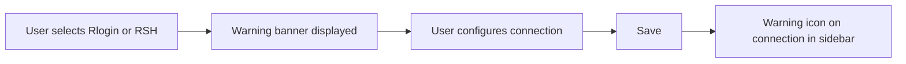

### Connection Sidebar

Rlogin and RSH connections appear in the Connections sidebar alongside other connection types, each with a distinct icon:

```
┌─────────────────────────────────┐
│ CONNECTIONS                     │
│                                 │
│ ─── SSH ───                     │
│  🔒 Production Server           │
│  🔒 Staging Server              │
│                                 │
│ ─── Rlogin ───                  │
│  ⚠ AIX Production     (rlogin) │
│  ⚠ HP-UX Legacy       (rlogin) │
│                                 │
│ ─── RSH ───                     │
│  ⚠ Build Server        (rsh)   │
│                                 │
│ ─── Telnet ───                  │
│  ○ Switch Console      (telnet)│
│                                 │
│ [+ New Connection]              │
└─────────────────────────────────┘
```

- Rlogin and RSH connections show a warning icon (⚠) to indicate unencrypted protocols
- The protocol type label appears next to the connection name
- Tooltip on hover: "Unencrypted connection — data is transmitted in plaintext"

### Terminal Tab

Once connected, Rlogin and RSH sessions render in the standard terminal tab, identical to SSH/Telnet/Local sessions. The tab title shows the connection name and a visual indicator of the protocol:

```
┌──────────────────────────────────────────────────┐
│ [⚠ AIX Production] [🔒 Staging] [> Local]        │
├──────────────────────────────────────────────────┤
│ $ hostname                                        │
│ aix-prod.internal.local                           │
│ $ uname -a                                        │
│ AIX aix-prod 7 2 00XXXXXX4C00                     │
│ $                                                 │
│                                                   │
│                                                   │
│                                                   │
│ ──────────────────────────────────────────────────│
│ ⚠ Unencrypted (Rlogin) │ operator@aix-prod │ 80x24│
└──────────────────────────────────────────────────┘
```

The status bar at the bottom of the terminal shows:

- Protocol warning indicator: "⚠ Unencrypted (Rlogin)" or "⚠ Unencrypted (RSH)"
- Username and host
- Terminal dimensions (for Rlogin which supports resize)

### First-Time Connection Warning Dialog

On the first connection attempt for each Rlogin/RSH connection, a modal dialog warns the user:

```
┌─────────────────────────────────────────────────────────────┐
│ ⚠ Insecure Connection Warning                              │
│                                                             │
│ You are about to connect to aix-prod.internal.local         │
│ using Rlogin, which does NOT encrypt any data.              │
│                                                             │
│ • Your username will be sent in plaintext                   │
│ • All terminal input and output will be visible to anyone   │
│   who can observe network traffic                           │
│ • Authentication relies on .rhosts trust, not passwords     │
│                                                             │
│ Only use this on trusted, isolated networks.                │
│                                                             │
│ ☐ Don't show this warning again for this connection         │
│                                                             │
│                          [Cancel]  [Connect Anyway]         │
└─────────────────────────────────────────────────────────────┘
```

## General Handling

### User Journeys

#### Creating an Rlogin Connection

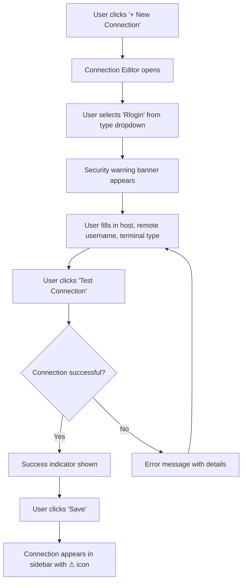

#### Connecting via Rlogin

1. User double-clicks an Rlogin connection in the sidebar (or right-click → Connect)
2. First-time warning dialog appears (if not previously suppressed)
3. User clicks "Connect Anyway"
4. Backend establishes TCP connection to host:513
5. Rlogin handshake: sends `\0`, local username, remote username, terminal type/speed, `\0`
6. Server responds with `\0` (success) or error message
7. Terminal tab opens with interactive session
8. User types commands, output streams back through the terminal emulator
9. Window resize events trigger Rlogin urgent-data resize notification (0x80 prefix)
10. User closes tab or types `~.` to disconnect

#### Executing a Remote Command via RSH

1. User double-clicks an RSH connection configured with a command
2. First-time warning dialog appears (if not previously suppressed)
3. Backend establishes TCP connection to host:514
4. RSH handshake: sends stderr port (or `0\0`), local username, remote username, command
5. Server executes the command
6. Output streams into the terminal tab
7. When the command completes, the tab shows "Process exited" in the status bar
8. User can close the tab or re-run the command

#### RSH Interactive Mode (No Command)

1. User double-clicks an RSH connection with no command and "Interactive mode" checked
2. Backend connects and sends an empty command string, requesting a shell
3. If the server supports it, an interactive shell session opens
4. Behaves like Rlogin but without window resize support
5. If the server rejects interactive mode, an error is displayed suggesting Rlogin instead

### Edge Cases & Error Handling

| Scenario                            | Handling                                                                                                             |
| ----------------------------------- | -------------------------------------------------------------------------------------------------------------------- |
| **Server rejects connection**       | Display server error message (e.g., "Permission denied") with suggestion to check `.rhosts` configuration            |
| **`.rhosts` not configured**        | Show error: "Connection refused — the remote host may not have `.rhosts` trust configured for your user"             |
| **Connection timeout**              | Configurable timeout (default: 10s). Show: "Connection timed out. Verify the host is reachable on port N."           |
| **Server sends error on connect**   | Parse the error text from the server response and display it in the terminal tab                                     |
| **RSH command exits immediately**   | Show exit code in status bar. If exit code is non-zero, highlight in red.                                            |
| **Network drops mid-session**       | Detect broken TCP connection, show "Connection lost" banner with reconnect option                                    |
| **Privileged port requirement**     | Rlogin traditionally requires a source port < 1024. If binding fails, show guidance about privilege needs.           |
| **Server not running rlogind/rshd** | Connection refused error with suggestion: "No Rlogin/RSH service found. Is rlogind/rshd running on the remote host?" |
| **IPv6 address**                    | Support IPv6 addresses in the host field (bracket notation for display)                                              |
| **Window resize (Rlogin)**          | Send urgent TCP data with new dimensions. If urgent data fails, log warning but continue session.                    |
| **Window resize (RSH)**             | Not supported by protocol. Status bar shows fixed dimensions. No resize events sent.                                 |
| **Empty remote username**           | Validation error in connection editor: "Remote username is required"                                                 |

### Reconnection Behavior

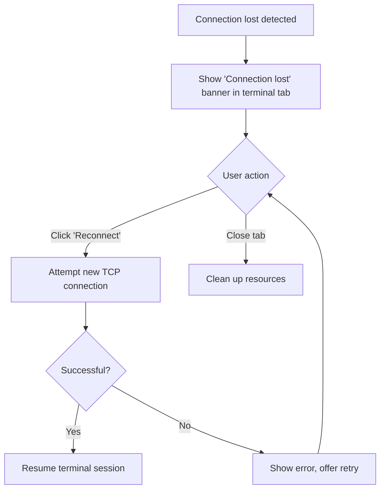

Rlogin and RSH connections follow the same reconnection pattern as Telnet: a new TCP connection is established from scratch (no session resumption since these protocols are stateless).

### Privileged Source Port Handling

Rlogin (RFC 1282) and RSH traditionally require the client to connect from a privileged source port (512-1023) to prove the client is running as a trusted user. This is enforced by some servers.

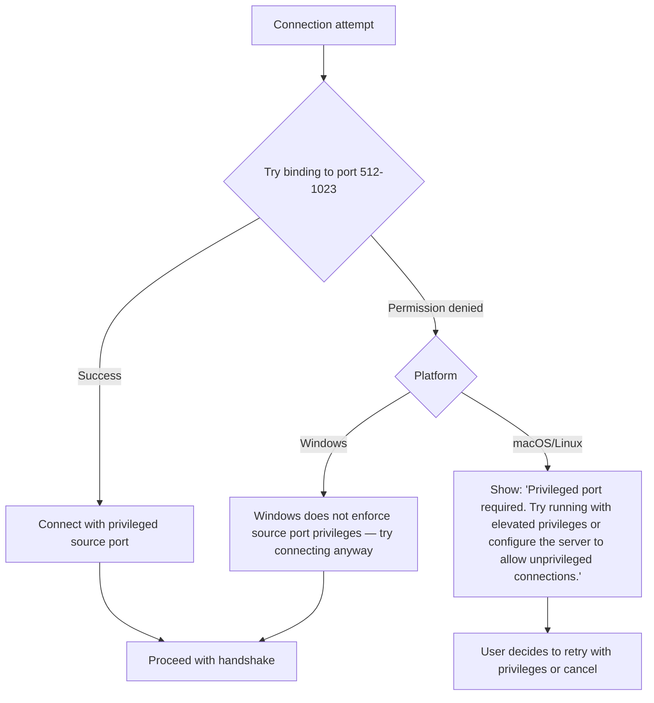

## States & Sequences

### Rlogin Connection Lifecycle

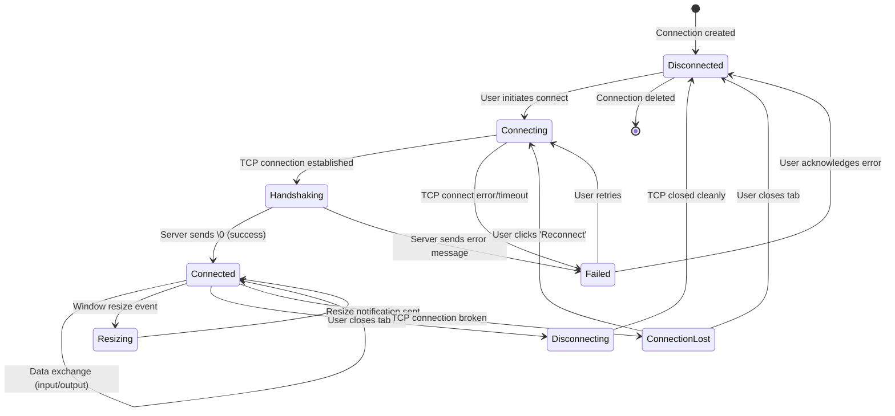

### RSH Connection Lifecycle

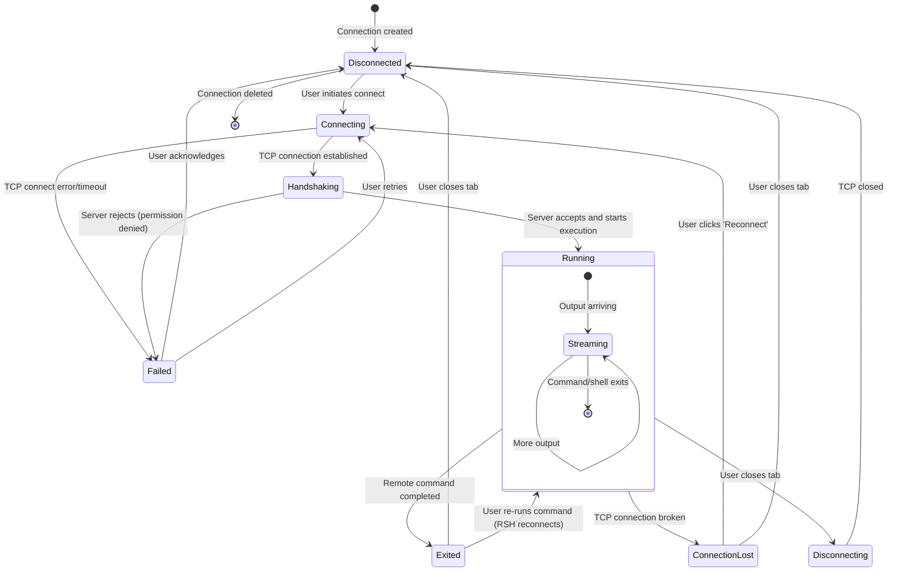

### Rlogin Handshake Sequence

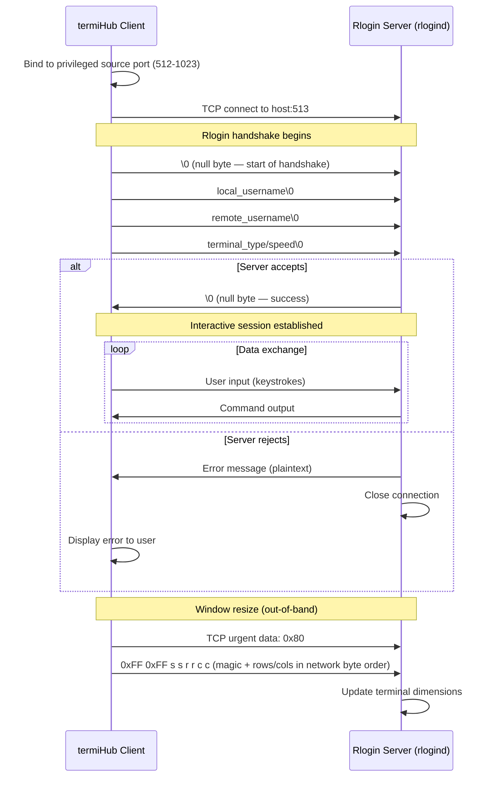

### RSH Handshake Sequence

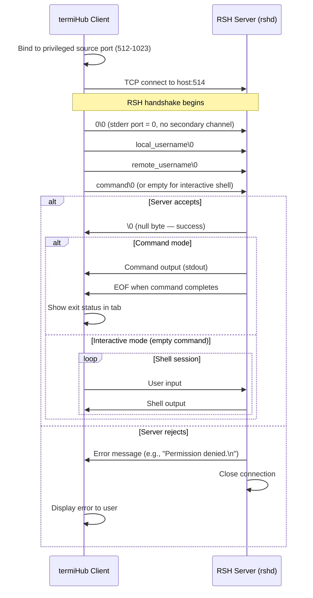

### RSH with Stderr Channel (Optional)

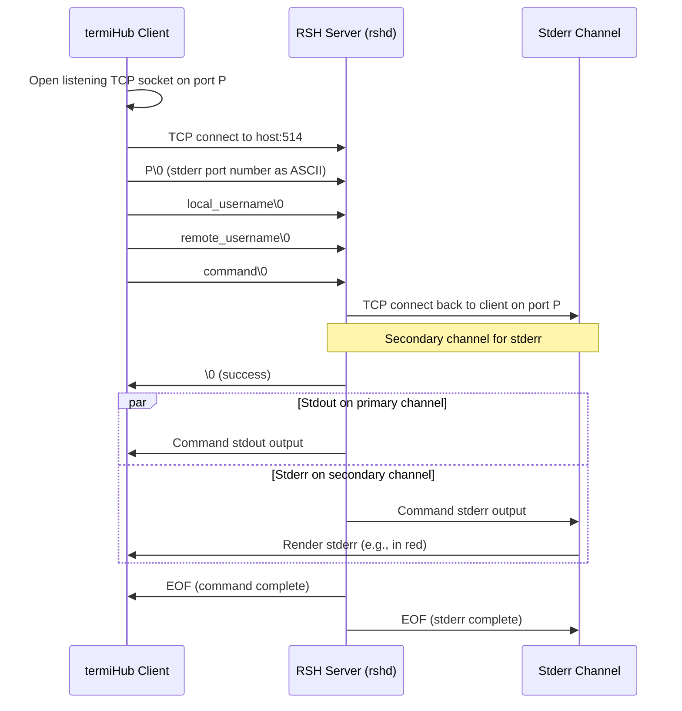

### Connection Setup Flow (Frontend to Backend)

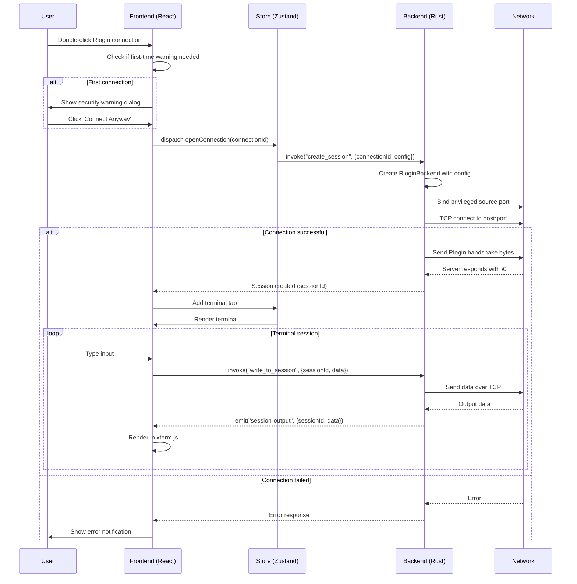

## Preliminary Implementation Details

> Based on the current project architecture as of the time of concept creation. The codebase may evolve before implementation.

### Backend (Rust) — Core Library

#### New Backend Files

```
core/src/backends/
  rlogin.rs          # Rlogin backend implementation
  rsh.rs             # RSH backend implementation
```

Both backends follow the same pattern as the existing Telnet backend (`core/src/backends/telnet.rs`): simple TCP socket connection, reader thread bridging sync reads to async channels, and `Backend` trait implementation.

#### Rlogin Backend (`core/src/backends/rlogin.rs`)

```rust
pub struct Rlogin {
    stream: Option<TcpStream>,
    alive: Arc<AtomicBool>,
    output_tx: Option<tokio::sync::mpsc::Sender<Vec<u8>>>,
}
```

Key implementation details:

- **`type_id()`**: Returns `"rlogin"`
- **`display_name()`**: Returns `"Rlogin"`
- **`capabilities()`**: `{ monitoring: false, file_browser: false, resize: true, persistent: false }`
- **`settings_schema()`**: Returns schema with fields for host, port, remote_username, local_username, terminal_type, terminal_speed
- **`connect()`**:
  1. Attempt to bind to a privileged source port (512-1023), iterating through available ports
  2. Establish TCP connection with configurable timeout (default: 10s)
  3. Send handshake: `\0` + local_username + `\0` + remote_username + `\0` + terminal_type/speed + `\0`
  4. Read server response — expect `\0` for success, otherwise treat as error message
  5. Spawn reader thread to forward output via `mpsc` channel
- **`resize()`**: Send TCP urgent data with `0x80` flag followed by `0xFF 0xFF` magic bytes and new dimensions (rows, cols as 2 bytes each in network byte order)
- **`write()`**: Write input bytes to TCP stream
- **`disconnect()`**: Set alive flag to false, close TCP stream

#### RSH Backend (`core/src/backends/rsh.rs`)

```rust
pub struct Rsh {
    stream: Option<TcpStream>,
    alive: Arc<AtomicBool>,
    output_tx: Option<tokio::sync::mpsc::Sender<Vec<u8>>>,
    stderr_listener: Option<TcpListener>,  // for optional stderr channel
}
```

Key implementation details:

- **`type_id()`**: Returns `"rsh"`
- **`display_name()`**: Returns `"RSH"`
- **`capabilities()`**: `{ monitoring: false, file_browser: false, resize: false, persistent: false }`
- **`settings_schema()`**: Returns schema with fields for host, port, remote_username, local_username, command, interactive_mode
- **`connect()`**:
  1. Optionally open a listening socket for stderr (if stderr separation is desired)
  2. Bind to privileged source port (512-1023)
  3. Establish TCP connection with configurable timeout
  4. Send handshake: stderr_port + `\0` + local_username + `\0` + remote_username + `\0` + command + `\0`
  5. Read server response — expect `\0` for success
  6. Spawn reader thread(s) for stdout (and optionally stderr)
- **`resize()`**: Not supported — returns `Ok(())` as a no-op
- **`write()`**: Write input bytes to TCP stream (for interactive mode)
- **`disconnect()`**: Clean up TCP streams and optional stderr listener

#### Configuration Types (`core/src/config/mod.rs`)

```rust
#[derive(Debug, Clone, Serialize, Deserialize)]
#[serde(rename_all = "camelCase")]
pub struct RloginConfig {
    pub host: String,
    #[serde(default = "default_rlogin_port")]
    pub port: u16,                    // default: 513
    pub remote_username: String,
    #[serde(default)]
    pub local_username: String,       // default: current OS user
    #[serde(default = "default_terminal_type")]
    pub terminal_type: String,        // default: "xterm-256color"
    #[serde(default = "default_terminal_speed")]
    pub terminal_speed: String,       // default: "38400/38400"
}

#[derive(Debug, Clone, Serialize, Deserialize)]
#[serde(rename_all = "camelCase")]
pub struct RshConfig {
    pub host: String,
    #[serde(default = "default_rsh_port")]
    pub port: u16,                    // default: 514
    pub remote_username: String,
    #[serde(default)]
    pub local_username: String,       // default: current OS user
    #[serde(default)]
    pub command: String,              // empty = interactive shell
    #[serde(default = "default_true")]
    pub interactive_mode: bool,       // default: true
}
```

Both configs implement the `.expand()` method for `${env:...}` variable expansion, following the existing pattern.

#### Privileged Port Binding Helper

A shared utility for both Rlogin and RSH to bind to a privileged source port:

```rust
// core/src/backends/privileged_port.rs (or within each backend)
fn bind_privileged_port() -> Result<TcpSocket> {
    for port in (512..=1023).rev() {
        let socket = TcpSocket::new_v4()?;
        if socket.bind(SocketAddr::new(Ipv4Addr::UNSPECIFIED.into(), port)).is_ok() {
            return Ok(socket);
        }
    }
    // Fall back to ephemeral port if no privileged port available
    let socket = TcpSocket::new_v4()?;
    socket.bind(SocketAddr::new(Ipv4Addr::UNSPECIFIED.into(), 0))?;
    Ok(socket)
}
```

The helper iterates through ports 1023 down to 512. If none are available (due to permissions or exhaustion), it falls back to an ephemeral port with a logged warning.

### Backend (Rust) — Desktop Integration

#### Session Registry (`src-tauri/src/session/registry.rs`)

Register both new backends:

```rust
registry.register(
    "rlogin",
    "Rlogin",
    "rlogin",  // icon ID
    Box::new(|| Box::new(termihub_core::backends::rlogin::Rlogin::new())),
);

registry.register(
    "rsh",
    "RSH",
    "rsh",    // icon ID
    Box::new(|| Box::new(termihub_core::backends::rsh::Rsh::new())),
);
```

No new Tauri commands are needed — the existing `create_session`, `write_to_session`, `resize_session`, and `close_session` commands work with any registered backend.

### Frontend (React/TypeScript)

#### Connection Type Update (`src/types/terminal.ts`)

Add `"rlogin"` and `"rsh"` to the `ConnectionType` union:

```typescript
export type ConnectionType =
  | "local"
  | "ssh"
  | "telnet"
  | "serial"
  | "remote"
  | "remote-session"
  | "docker"
  | "rlogin"
  | "rsh"
  | (string & {});
```

#### Security Warning Component

Create a reusable security warning banner component used by the Connection Editor when the selected type is `"rlogin"` or `"rsh"`:

```
src/components/ConnectionEditor/
  InsecureProtocolWarning.tsx   # Reusable warning banner
```

This component can also be retroactively applied to Telnet connections (which are also unencrypted).

#### First-Connection Warning Dialog

Add a confirmation dialog that appears on the first connection attempt for insecure protocols. The suppression state ("Don't show again for this connection") is stored in the connection's metadata.

#### Status Bar Protocol Indicator

Extend the terminal status bar to show protocol security status:

- Encrypted protocols (SSH): lock icon
- Unencrypted protocols (Rlogin, RSH, Telnet): warning icon with "Unencrypted" label

#### Connection Sidebar Icons

Add icons for Rlogin and RSH in the connection sidebar. Both should use a warning-styled icon to visually distinguish them from encrypted protocols.

### Cross-Platform Considerations

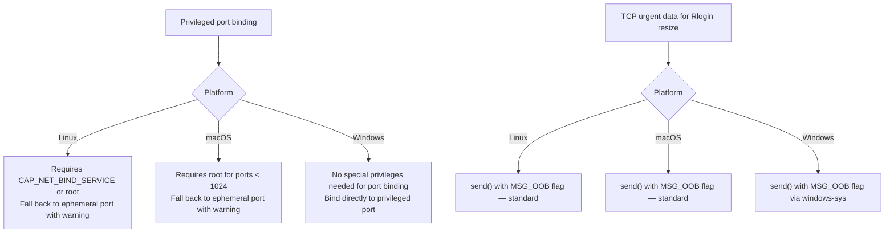

All three platforms support standard TCP socket operations. The main platform difference is privileged port binding:

- **Linux/macOS**: Ports below 1024 require root or `CAP_NET_BIND_SERVICE`. The backend falls back gracefully to ephemeral ports.
- **Windows**: No restriction on binding to ports below 1024.

TCP urgent (out-of-band) data for Rlogin window resize is supported on all platforms via the `MSG_OOB` socket flag.

### Testing Strategy

#### Unit Tests

- **Handshake construction**: Verify Rlogin and RSH handshake byte sequences are correctly formed for various input combinations
- **Config serialization**: Roundtrip serialization/deserialization of `RloginConfig` and `RshConfig`
- **Config defaults**: Verify default port, terminal type, speed values
- **Schema validation**: Ensure `settings_schema()` returns correct fields with proper types and defaults
- **Privileged port binding**: Test fallback behavior when privileged ports are unavailable
- **Resize message**: Verify Rlogin urgent data format (0x80, 0xFF 0xFF, dimensions)
- **Error parsing**: Test server error message extraction from handshake response

#### Integration Tests

- **Docker test containers**: Add `rlogind` and `rshd` containers to `tests/docker/` for full connection testing
- **End-to-end handshake**: Connect to test server, verify handshake completes, send a command, verify output
- **Connection failure**: Test timeout, connection refused, and permission denied scenarios
- **RSH command execution**: Verify command output is received and exit status is reported

#### Manual Tests

- **Visual verification**: Security warning banners, icons, status bar indicators display correctly
- **Legacy system compatibility**: Test with actual AIX/HP-UX systems if available
- **Window resize**: Verify Rlogin terminal resize works with a real server

### Implementation Phases

```mermaid
gantt
    title Rlogin & RSH Implementation Phases
    dateFormat X
    axisFormat %s

    section Phase 1 — Core Backends
    RloginConfig & RshConfig types           :a1, 0, 1
    Rlogin backend (connect, handshake, I/O) :a2, 1, 3
    RSH backend (connect, handshake, I/O)    :a3, 1, 3
    Privileged port binding utility           :a4, 1, 1
    Unit tests for both backends             :a5, 4, 2

    section Phase 2 — Desktop Integration
    Register backends in session registry    :b1, 6, 1
    Rlogin window resize (urgent data)       :b2, 6, 2
    RSH stderr channel (optional)            :b3, 7, 2

    section Phase 3 — Frontend
    Connection type & schema integration     :c1, 9, 1
    Security warning banner component        :c2, 9, 2
    First-connection warning dialog          :c3, 10, 1
    Status bar protocol indicator            :c4, 10, 1
    Sidebar icons                            :c5, 11, 1

    section Phase 4 — Testing & Polish
    Docker test containers                   :d1, 12, 2
    Integration tests                        :d2, 14, 2
    Manual test documentation                :d3, 14, 1
    Cross-platform verification              :d4, 15, 2
```

### Security Considerations

- **No password authentication**: Rlogin and RSH rely on `.rhosts` trust, not passwords. termiHub does not implement password prompting for these protocols — if the server requires a password (e.g., modified rlogind), the password prompt appears in the terminal output and the user types it directly (plaintext).
- **Plaintext warning everywhere**: The security risk is surfaced at every touchpoint — connection editor, sidebar, tab title, status bar, and first-connection dialog.
- **No credential storage**: Unlike SSH connections, Rlogin/RSH connections do not store passwords in the credential store (since authentication is `.rhosts`-based). Only the username is stored in the connection config.
- **Network isolation recommendation**: Documentation should recommend using these protocols only on isolated/air-gapped networks.
- **Audit logging**: Log all Rlogin/RSH connection attempts (including failures) at INFO level for security auditing.
