# VNC (Virtual Network Computing) Sessions

> GitHub Issue: [#514](https://github.com/armaxri/termiHub/issues/514)

## Overview

Add built-in VNC session support to termiHub, allowing users to view and interact with remote graphical desktops directly within application tabs using the VNC/RFB (Remote Framebuffer) protocol.

**Motivation**: VNC is the standard protocol for remote graphical access on Linux, macOS, and Unix systems. Tools like MobaXterm bundle a VNC viewer alongside their terminal emulator. Adding VNC support makes termiHub a more complete remote access tool — users can manage terminal sessions, file transfers, SSH tunnels, and graphical remote desktops from a single application.

**Key goals**:

- **Embedded graphical sessions**: View and control remote desktops inside termiHub tabs, alongside terminal sessions
- **noVNC integration**: Leverage the mature, production-grade [noVNC](https://novnc.com/) JavaScript library for canvas-based VNC rendering
- **SSH tunnel support**: Connect to VNC servers through existing SSH tunnels for secure access
- **Credential store integration**: Store VNC passwords securely using the existing credential store
- **Connection editor integration**: Configure VNC connections with the same UX as SSH, telnet, and serial connections
- **Cross-platform**: Works on Windows, macOS, and Linux

### VNC Protocol Basics

VNC uses the RFB (Remote Framebuffer) protocol. The client connects to a VNC server (typically port 5900 + display number), authenticates, and then receives framebuffer updates that it renders locally. User input (keyboard and mouse) is sent back to the server. noVNC implements the RFB protocol in JavaScript and renders to an HTML5 `<canvas>` element, but it requires a **WebSocket** transport — VNC servers speak raw TCP. The Rust backend must bridge TCP-to-WebSocket.

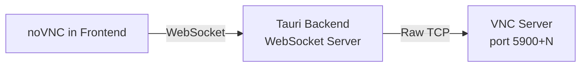

## UI Interface

### Connection Editor: VNC Type

When the user selects **VNC** as the connection type in the connection editor, a VNC-specific form appears:

```
┌─────────────────────────────────────────────────────────────────┐
│ Connection Editor                                    [Save] [X] │
│─────────────────────────────────────────────────────────────────│
│ Name:   [My Linux Desktop          ]                            │
│ Type:   [VNC ▾]                                                 │
│                                                                 │
│ ─── Server ───                                                  │
│ Host:           [192.168.1.100         ]                        │
│ Port:           [5901                  ]                        │
│ Display Number: [1   ] (auto-fills port as 5900 + display)      │
│                                                                 │
│ ─── Authentication ───                                          │
│ Password:       [••••••••              ]  [Save Password ☑]     │
│                                                                 │
│ ─── Display ───                                                 │
│ View Only:      [☐]                                             │
│ Scaling Mode:   [Fit to Window ▾]                               │
│                   ├─ Fit to Window (maintain aspect ratio)       │
│                   ├─ Fill Window (stretch to fit)                │
│                   ├─ None (native resolution, scroll if needed)  │
│                   └─ Custom Scale (50%-200%)                     │
│ Quality:        [Automatic ▾]                                   │
│                   ├─ Automatic (adapts to connection speed)      │
│                   ├─ High (lossless, more bandwidth)             │
│                   ├─ Medium (JPEG quality 6)                     │
│                   └─ Low (JPEG quality 2, fast)                  │
│ Show Remote Cursor: [☑]                                         │
│ Clipboard Sync:     [☑]                                         │
│                                                                 │
│ ─── SSH Tunnel (Optional) ───                                   │
│ Use SSH Tunnel: [☐]                                             │
│ SSH Host:       [                      ]                        │
│ SSH Port:       [22                    ]                        │
│ SSH Username:   [                      ]                        │
│ SSH Auth:       [Key ▾]                                         │
│                                                                 │
│ [Test Connection]                        [Save]  [Connect]      │
└─────────────────────────────────────────────────────────────────┘
```

**Display number / port interplay**: Changing the display number auto-fills the port as `5900 + display`. Manually editing the port clears the display number field. This mirrors how VNC conventionally maps display numbers to ports.

### VNC Session Tab

When a VNC connection is opened, it renders as a tab (new `TabContentType: "vnc"`) in the existing tab/panel system. The tab shows the remote desktop rendered on a `<canvas>` element by noVNC.

```
┌─────────────────────────────────────────────────────────────────┐
│ [Terminal 1] [SSH: dev-server] [VNC: My Linux Desktop ●] [+]    │
│─────────────────────────────────────────────────────────────────│
│ ┌─────────────────────────────────────────────────────────────┐ │
│ │                                                             │ │
│ │                                                             │ │
│ │              ┌──────────────────────────┐                   │ │
│ │              │   Remote Desktop         │                   │ │
│ │              │   rendered by noVNC      │                   │ │
│ │              │   on <canvas>            │                   │ │
│ │              │                          │                   │ │
│ │              └──────────────────────────┘                   │ │
│ │                                                             │ │
│ │                                                             │ │
│ └─────────────────────────────────────────────────────────────┘ │
│                                                                 │
│ ─── Toolbar (hover to show) ──────────────────────────────────  │
│ [Ctrl+Alt+Del] [Clipboard] [Fullscreen] [Scaling ▾] [⚙ Settings]│
└─────────────────────────────────────────────────────────────────┘
```

#### Toolbar

A floating toolbar appears at the top of the VNC canvas when the user hovers near the top edge (auto-hide, similar to fullscreen video controls):

| Button           | Action                                                             |
| ---------------- | ------------------------------------------------------------------ |
| **Ctrl+Alt+Del** | Send Ctrl+Alt+Del key combination to remote                        |
| **Clipboard**    | Open clipboard sync panel (paste text to remote, copy from remote) |
| **Fullscreen**   | Toggle fullscreen mode for the VNC canvas                          |
| **Scaling**      | Quick-switch between scaling modes                                 |
| **Settings**     | Open connection settings overlay (quality, cursor, etc.)           |
| **Disconnect**   | Close the VNC session                                              |

#### Split View Support

VNC tabs work in split views just like terminal tabs. Users can drag a VNC tab to create a side-by-side layout with terminals:

```
┌────────────────────────────┬────────────────────────────┐
│ [Terminal: SSH dev-server]  │ [VNC: My Linux Desktop ●]  │
│──────────────────────────  │────────────────────────────│
│ $ ls -la                   │ ┌────────────────────────┐ │
│ drwxr-xr-x  12 user ...   │ │   Remote Desktop       │ │
│ -rw-r--r--   1 user ...   │ │   Canvas               │ │
│ $ _                        │ │                        │ │
│                            │ └────────────────────────┘ │
└────────────────────────────┴────────────────────────────┘
```

#### Input Handling

When a VNC tab is focused, keyboard and mouse events are captured and forwarded to the remote desktop:

- **Keyboard**: All key events are captured and sent via RFB KeyEvent messages. Special handling for modifier keys and platform-specific mappings (e.g., Cmd on macOS maps to Super/Meta on remote Linux).
- **Mouse**: Click, move, scroll, and drag events are translated to RFB PointerEvent messages with coordinates relative to the framebuffer.
- **Focus boundary**: When the VNC canvas has focus, termiHub's own keyboard shortcuts (except the escape hatch) are suppressed to avoid conflicts. A configurable escape key (default: `Ctrl+Shift+Escape`) releases focus back to termiHub.

### Connection Sidebar

VNC connections appear in the Connections sidebar alongside SSH, serial, and other connection types, with a distinct icon (monitor/screen icon):

```
┌─────────────────────────────────┐
│ CONNECTIONS                     │
│                                 │
│ ▼ Development Servers           │
│   ⬡ SSH: dev-server             │
│   ⬡ SSH: staging-server         │
│   🖥 VNC: dev-desktop (5901)    │
│                                 │
│ ▼ Home Lab                      │
│   🖥 VNC: workstation (5900)    │
│   ⬡ SSH: nas                    │
└─────────────────────────────────┘
```

Double-click or context menu "Connect" opens the VNC session in a new tab.

### Status Bar Integration

When a VNC session is active, the status bar shows connection info:

```
┌─────────────────────────────────────────────────────────────────┐
│ VNC: 192.168.1.100:5901 | 1920x1080 | Tight encoding | 24-bit │
└─────────────────────────────────────────────────────────────────┘
```

### Clipboard Sync Panel

A slide-out panel for bidirectional clipboard exchange:

```
┌──────────────────────────────────┐
│ Clipboard Sync                [X]│
│──────────────────────────────────│
│ ─── Local → Remote ───           │
│ ┌──────────────────────────────┐ │
│ │ (paste text here to send     │ │
│ │  to remote clipboard)        │ │
│ └──────────────────────────────┘ │
│ [Send to Remote]                 │
│                                  │
│ ─── Remote → Local ───           │
│ ┌──────────────────────────────┐ │
│ │ (remote clipboard contents   │ │
│ │  appear here automatically)  │ │
│ └──────────────────────────────┘ │
│ [Copy to Local]                  │
│                                  │
│ Auto-sync: [☑]                   │
└──────────────────────────────────┘
```

When auto-sync is enabled, clipboard changes are exchanged automatically via the RFB `ServerCutText`/`ClientCutText` messages. This only supports plain text (VNC protocol limitation).

### Theme Integration

The VNC tab UI (toolbar, clipboard panel, connection status) uses existing theme CSS variables. The canvas itself displays the remote desktop as-is (unthemed). The toolbar and overlays use:

- `--vscode-editor-background` for panel backgrounds
- `--vscode-editor-foreground` for text
- `--vscode-button-background` for action buttons
- `--vscode-badge-background` for connection status indicator

## General Handling

### User Journeys

#### Creating and Opening a VNC Connection

1. User clicks **"+"** in the Connections sidebar or opens a new connection editor tab
2. Selects **"VNC"** from the connection type dropdown
3. Fills in host, port (or display number), and optionally a password
4. Clicks **Save** to store the connection, then **Connect**
5. termiHub opens a new VNC tab, shows a "Connecting..." overlay
6. The backend starts a WebSocket proxy, noVNC connects through it
7. The remote desktop appears in the canvas; the user interacts with it

#### Quick-Connect to VNC

1. User right-clicks in the tab bar → "New VNC Connection..."
2. A minimal connect dialog appears: Host, Port, Password
3. User fills in details and clicks **Connect**
4. VNC session opens without saving a persistent connection config

#### VNC via SSH Tunnel

1. User edits a VNC connection and enables **"Use SSH Tunnel"**
2. Fills in SSH server details (host, port, username, auth)
3. On connect, the backend first establishes an SSH tunnel (local port → remote VNC port)
4. The WebSocket proxy connects to the local tunnel endpoint instead of the remote VNC server directly
5. All VNC traffic is encrypted through the SSH tunnel

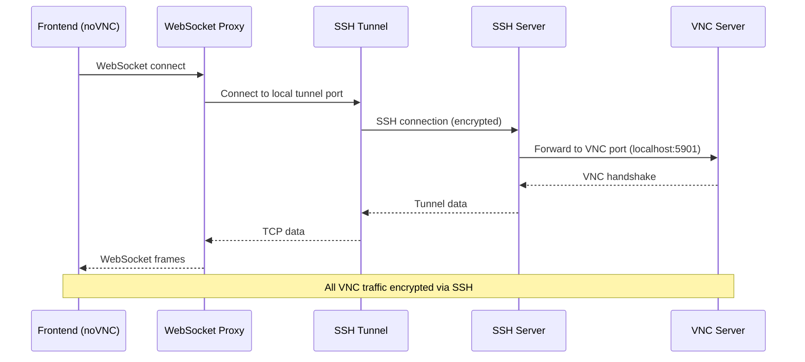

#### Using VNC with Existing SSH Tunnel

1. User has an existing SSH tunnel configured in the Tunnels sidebar that forwards a local port to a remote VNC port
2. When creating a VNC connection, user points it to `localhost:<tunnel-port>`
3. The VNC connection uses the tunnel transparently without needing built-in SSH tunnel config

#### Reconnection After Network Drop

1. Network connection drops while a VNC session is active
2. noVNC detects the disconnect, the tab shows "Connection lost" overlay with a **Reconnect** button
3. User clicks **Reconnect** (or auto-reconnect triggers after configurable delay)
4. Backend re-establishes the WebSocket proxy and SSH tunnel if applicable
5. noVNC reconnects; the remote desktop reappears (server state is preserved server-side)

### Edge Cases & Error Handling

| Scenario                           | Handling                                                                                         |
| ---------------------------------- | ------------------------------------------------------------------------------------------------ |
| **VNC server unreachable**         | Show "Connection failed: Unable to reach `host:port`" with retry button                          |
| **Authentication failed**          | Show "Authentication failed" dialog with option to re-enter password                             |
| **Unsupported VNC security type**  | Show specific error: "VNC server requires security type X which is not supported"                |
| **Connection dropped mid-session** | Show overlay with countdown to auto-reconnect (configurable: 5s default)                         |
| **Server framebuffer resize**      | noVNC handles this natively; canvas and scrollbars update automatically                          |
| **Very high resolution remote**    | Scaling mode "Fit to Window" prevents overflow; "None" mode enables scrollbars                   |
| **Multiple monitors on remote**    | VNC protocol sends a single framebuffer; multi-monitor appears as one wide desktop               |
| **Clipboard sync fails**           | Silently degrade; show info message in toolbar if clipboard cut-text is rejected                 |
| **VNC over slow connection**       | Auto-quality mode reduces JPEG quality and disables cursor rendering                             |
| **WebSocket proxy port conflict**  | Backend dynamically allocates available ports for each proxy instance                            |
| **Tab closed while connected**     | Prompt "Disconnect from VNC session?" confirmation before closing                                |
| **SSH tunnel drops**               | Treat as connection drop; reconnect SSH tunnel first, then VNC                                   |
| **VNC session in view-only mode**  | Canvas still renders but all mouse/keyboard input is suppressed; toolbar shows "View Only" badge |
| **macOS keyboard mapping**         | Map Cmd key to Super/Meta on remote; provide configurable key mapping in settings                |

### Keyboard Shortcut Handling

VNC sessions create a conflict with termiHub's keyboard shortcuts since all keys should be forwarded to the remote desktop. The resolution:

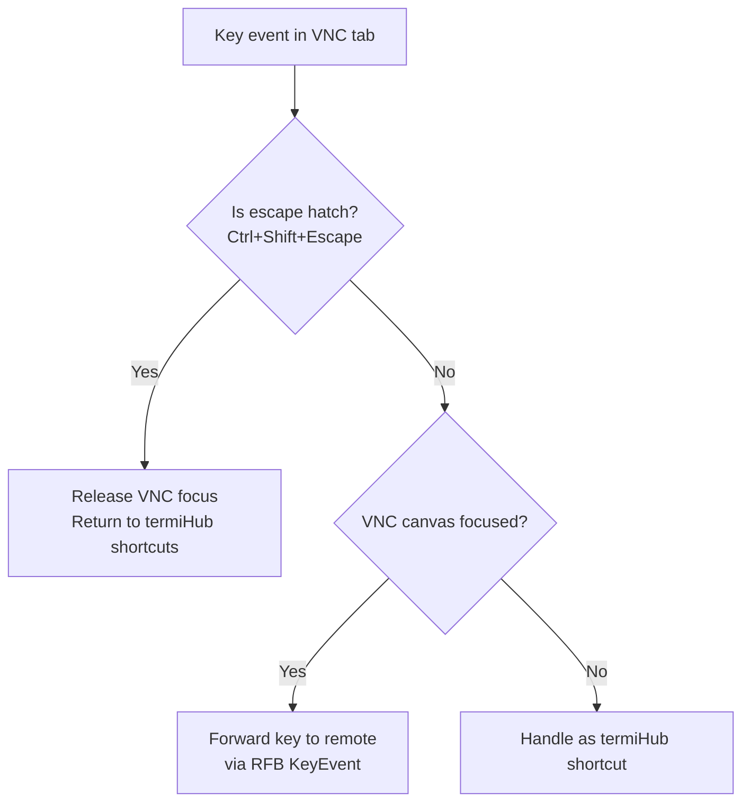

The escape hatch key (`Ctrl+Shift+Escape` by default) is configurable in settings. When the VNC canvas does not have focus (e.g., user clicked the toolbar or another panel), normal termiHub shortcuts work.

## States & Sequences

### VNC Session Lifecycle

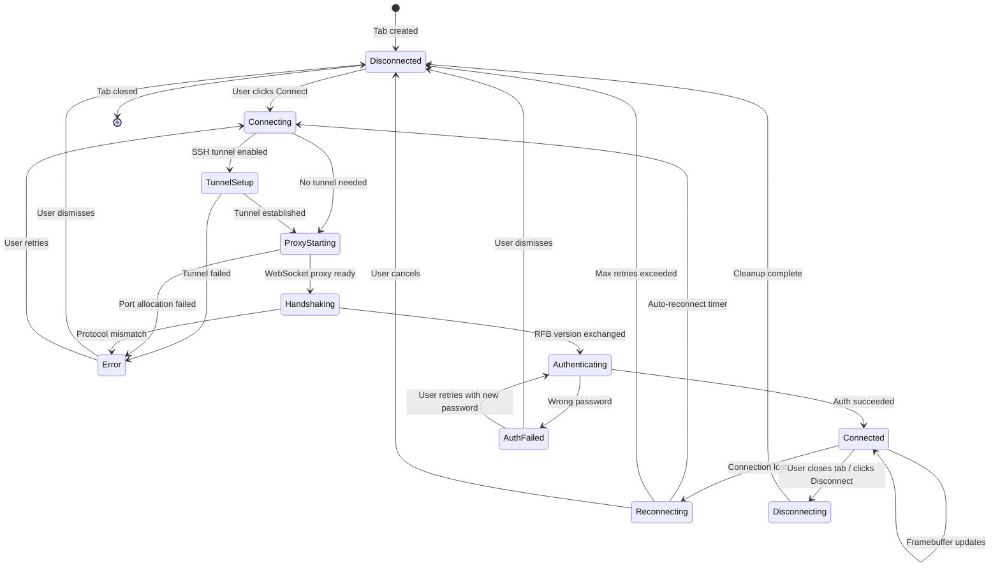

### WebSocket Proxy Lifecycle

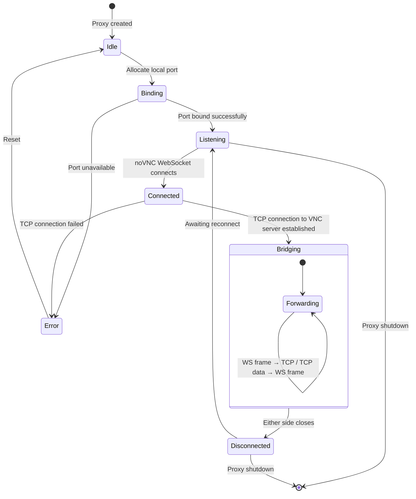

### Connection Sequence (Full Flow)

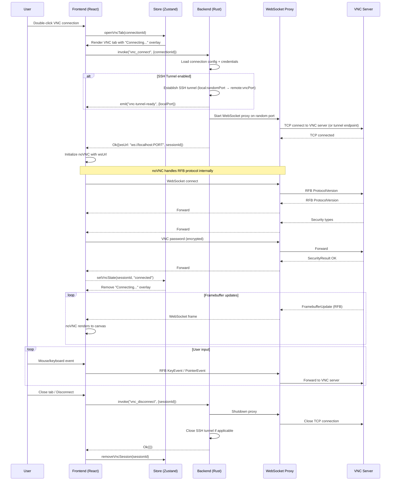

### Clipboard Sync Sequence

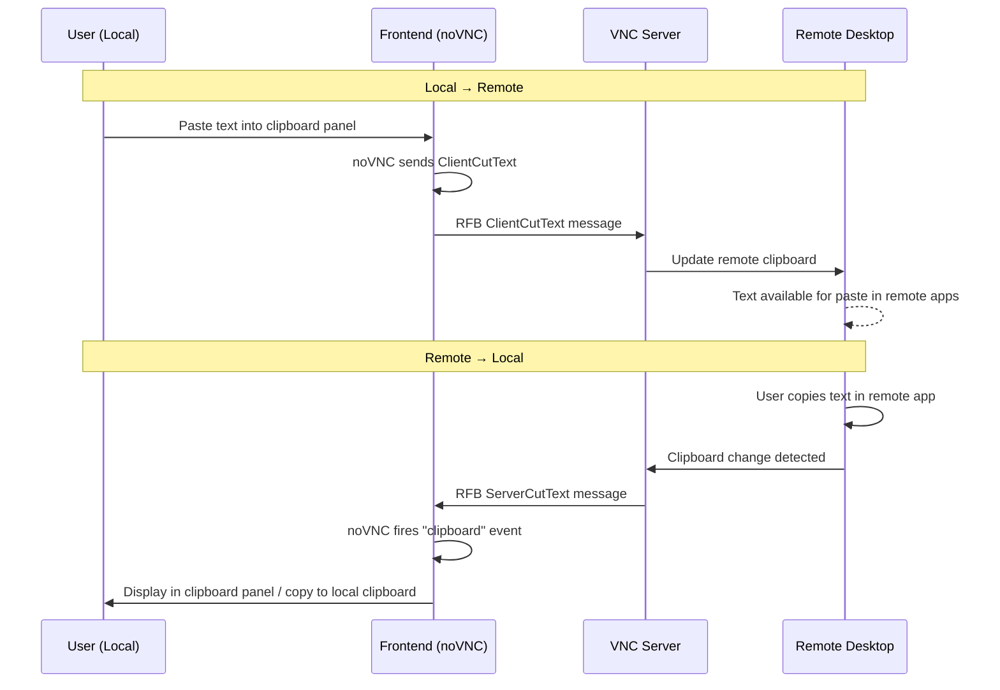

### Scaling & Resize Flow

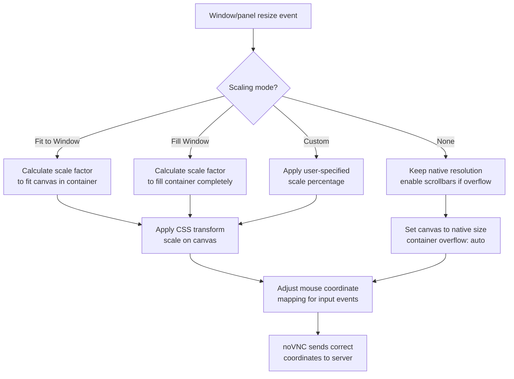

## Preliminary Implementation Details

> Based on the current project architecture as of the time of concept creation. The codebase may evolve before implementation.

### noVNC Integration

[noVNC](https://github.com/novnc/noVNC) is the recommended client library. It provides:

- Pure JavaScript/TypeScript RFB protocol implementation
- Canvas-based rendering with no plugins
- WebSocket transport
- Support for multiple encodings (Tight, ZRLE, Hextile, Raw, etc.)
- Clipboard integration (ServerCutText/ClientCutText)
- Automatic quality/encoding negotiation

**Installation**: `pnpm add @novnc/novnc` (or vendored if npm package is unavailable — noVNC distributes as ES modules on GitHub).

### Backend (Rust)

#### New Module: `src-tauri/src/vnc/`

```
src-tauri/src/vnc/
  mod.rs           # VncManager — manages active VNC sessions and proxies
  proxy.rs         # WebSocket-to-TCP proxy (tokio + tungstenite)
  session.rs       # VncSession — lifecycle for a single VNC connection
  config.rs        # VNC-specific configuration types
```

#### WebSocket-to-TCP Proxy

The core technical challenge is bridging noVNC's WebSocket transport to VNC servers' raw TCP. The backend runs a lightweight WebSocket server per VNC session:

```rust
/// A single VNC proxy instance bridging WebSocket ↔ TCP.
pub struct VncProxy {
    /// Session identifier.
    session_id: String,
    /// Local WebSocket listen port (dynamically allocated).
    ws_port: u16,
    /// Target VNC server address (host:port or tunnel endpoint).
    target_addr: SocketAddr,
    /// Handle to the proxy task for cancellation.
    task_handle: JoinHandle<()>,
}
```

The proxy uses `tokio-tungstenite` for WebSocket and `tokio::net::TcpStream` for the VNC server connection. It performs bidirectional byte forwarding:

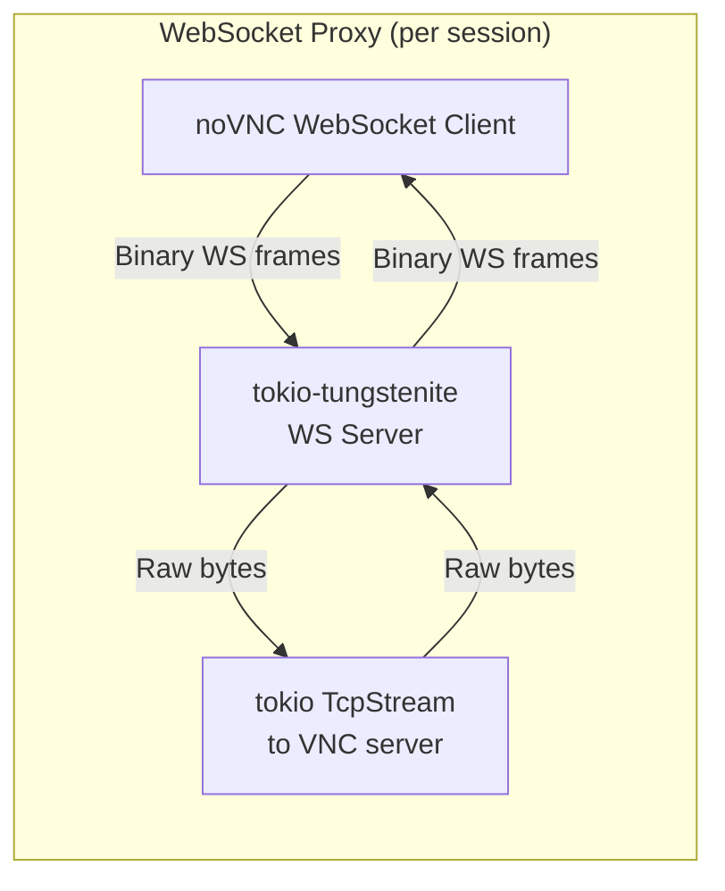

#### Key Crate Dependencies

| Crate               | Purpose                                           |
| ------------------- | ------------------------------------------------- |
| `tokio-tungstenite` | Async WebSocket server for the proxy              |
| `tokio`             | Async runtime (already in workspace)              |
| `portpicker`        | Dynamic local port allocation for proxy instances |

noVNC handles the RFB protocol entirely in the frontend — the Rust backend only needs to proxy raw bytes between WebSocket and TCP. This keeps the backend simple and avoids duplicating RFB protocol logic.

#### VncManager State

```rust
pub struct VncManager {
    /// Active VNC sessions keyed by session ID.
    sessions: HashMap<String, VncSession>,
    /// App handle for emitting events to the frontend.
    app_handle: AppHandle,
}

pub struct VncSession {
    /// Session identifier.
    id: String,
    /// Connection configuration.
    config: VncConfig,
    /// WebSocket proxy instance.
    proxy: VncProxy,
    /// SSH tunnel handle, if tunneling is enabled.
    tunnel: Option<SshTunnelHandle>,
    /// Current session state.
    state: VncSessionState,
}

pub enum VncSessionState {
    Connecting,
    Connected { ws_port: u16 },
    Reconnecting { attempt: u32 },
    Disconnecting,
    Disconnected,
    Error(String),
}
```

Registered as Tauri managed state alongside existing managers (ConnectionManager, TunnelManager, etc.).

#### Tauri Commands (`src-tauri/src/commands/vnc.rs`)

```rust
/// Start a VNC session: set up optional SSH tunnel, start WebSocket proxy,
/// return the local WebSocket URL for noVNC to connect to.
#[tauri::command]
fn vnc_connect(connection_id: String, manager: State<VncManager>) -> Result<VncConnectResult>

/// Disconnect an active VNC session and clean up resources.
#[tauri::command]
fn vnc_disconnect(session_id: String, manager: State<VncManager>) -> Result<()>

/// Send clipboard text to the VNC session (local → remote).
/// Note: noVNC handles this via RFB ClientCutText, but this command
/// provides an alternative path if needed.
#[tauri::command]
fn vnc_send_clipboard(session_id: String, text: String, manager: State<VncManager>) -> Result<()>

/// Get the current state of a VNC session.
#[tauri::command]
fn vnc_session_state(session_id: String, manager: State<VncManager>) -> Result<VncSessionState>

/// List all active VNC sessions.
#[tauri::command]
fn vnc_list_sessions(manager: State<VncManager>) -> Result<Vec<VncSessionInfo>>
```

#### VncConnectResult

```rust
pub struct VncConnectResult {
    /// Unique session identifier.
    pub session_id: String,
    /// Local WebSocket URL for noVNC (e.g., "ws://127.0.0.1:54321").
    pub ws_url: String,
}
```

#### Events

| Event               | Payload                 | Description                                   |
| ------------------- | ----------------------- | --------------------------------------------- |
| `vnc-state-changed` | `{ sessionId, state }`  | Session state transitions                     |
| `vnc-disconnected`  | `{ sessionId, reason }` | Unexpected disconnect (triggers reconnect UI) |

#### SSH Tunnel Integration

When a VNC connection has SSH tunnel settings, the backend reuses the existing SSH tunnel infrastructure from `src-tauri/src/tunnel/`:

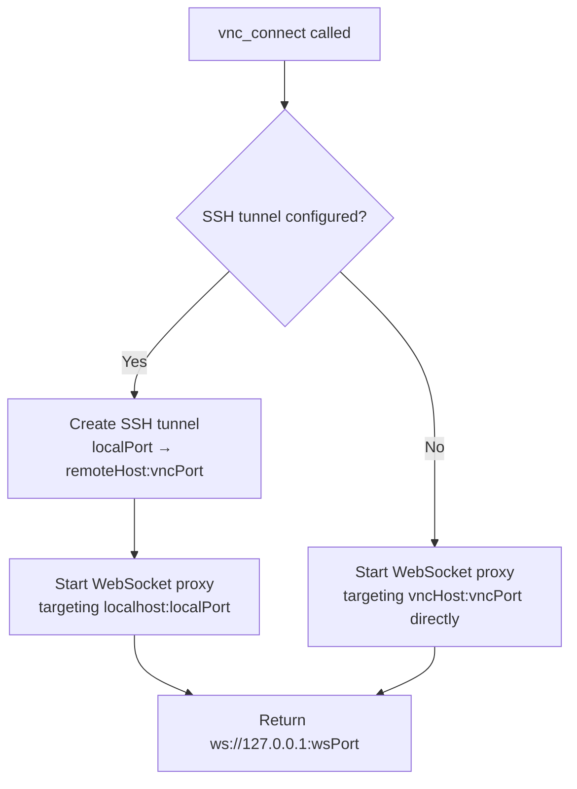

The SSH tunnel is created programmatically using the same tunnel manager, with the tunnel lifecycle tied to the VNC session (tunnel closes when VNC session closes).

#### Credential Store Integration

VNC passwords follow the same credential store pattern as SSH passwords:

- Credential key: `{connectionId}:vnc_password`
- Stored via existing `credential_store_set` / `credential_store_get` Tauri commands
- When `savePassword` is true, password is persisted in the credential store
- When `savePassword` is false, password is prompted on each connect and held in memory only

### Frontend (React/TypeScript)

#### New Components

```
src/components/VncViewer/
  VncViewer.tsx           # Main VNC viewer component (wraps noVNC)
  VncToolbar.tsx          # Floating toolbar (send keys, clipboard, scaling)
  VncClipboardPanel.tsx   # Clipboard sync slide-out panel
  VncStatusOverlay.tsx    # Connection status overlays (connecting, error, reconnect)
```

#### VncViewer Component

The core component wraps noVNC's `RFB` class:

```typescript
interface VncViewerProps {
  /** WebSocket URL returned by vnc_connect. */
  wsUrl: string;
  /** VNC password for authentication. */
  password: string;
  /** Session ID for state tracking. */
  sessionId: string;
  /** Whether the session is view-only. */
  viewOnly: boolean;
  /** Scaling mode for the canvas. */
  scalingMode: VncScalingMode;
  /** Quality preference. */
  qualityLevel: VncQuality;
  /** Whether to show the remote cursor. */
  showRemoteCursor: boolean;
  /** Whether to sync clipboard automatically. */
  clipboardSync: boolean;
  /** Callback when connection state changes. */
  onStateChange: (state: VncConnectionState) => void;
}
```

The component:

1. Creates a `<div>` container ref for noVNC to render into
2. Instantiates `new RFB(container, wsUrl, { credentials: { password } })` on mount
3. Listens to noVNC events: `connect`, `disconnect`, `credentialsrequired`, `clipboard`, `desktopname`
4. Handles resize events to update scaling
5. Cleans up the RFB instance on unmount

#### Connection Editor Integration

Extend the connection editor's type selector and form:

- Add `"vnc"` to `ConnectionType` union in `src/types/terminal.ts`
- Add VNC config schema to the backend's connection type registry
- The connection editor dynamically renders VNC-specific fields based on the schema

#### VNC Configuration Schema (Backend)

```rust
pub fn vnc_schema() -> SettingsSchema {
    SettingsSchema {
        groups: vec![
            SchemaGroup {
                label: "Server".into(),
                fields: vec![
                    SchemaField::text("host", "Host", "VNC server hostname or IP"),
                    SchemaField::number("port", "Port", 5900),
                    SchemaField::number("displayNumber", "Display Number", 0),
                ],
            },
            SchemaGroup {
                label: "Authentication".into(),
                fields: vec![
                    SchemaField::password("password", "Password"),
                    SchemaField::checkbox("savePassword", "Save Password", false),
                ],
            },
            SchemaGroup {
                label: "Display".into(),
                fields: vec![
                    SchemaField::checkbox("viewOnly", "View Only", false),
                    SchemaField::select("scalingMode", "Scaling Mode",
                        vec!["fit", "fill", "none", "custom"], "fit"),
                    SchemaField::select("quality", "Quality",
                        vec!["auto", "high", "medium", "low"], "auto"),
                    SchemaField::checkbox("showRemoteCursor", "Show Remote Cursor", true),
                    SchemaField::checkbox("clipboardSync", "Clipboard Sync", true),
                ],
            },
            SchemaGroup {
                label: "SSH Tunnel".into(),
                fields: vec![
                    SchemaField::checkbox("useSshTunnel", "Use SSH Tunnel", false),
                    SchemaField::text("sshHost", "SSH Host", ""),
                    SchemaField::number("sshPort", "SSH Port", 22),
                    SchemaField::text("sshUsername", "SSH Username", ""),
                    SchemaField::select("sshAuthMethod", "SSH Auth",
                        vec!["password", "key", "agent"], "key"),
                ],
            },
        ],
    }
}
```

#### Types (`src/types/vnc.ts`)

```typescript
export type VncScalingMode = "fit" | "fill" | "none" | "custom";
export type VncQuality = "auto" | "high" | "medium" | "low";
export type VncConnectionState =
  | "connecting"
  | "connected"
  | "disconnected"
  | "reconnecting"
  | "error";

export interface VncConfig {
  host: string;
  port: number;
  displayNumber?: number;
  password?: string;
  savePassword?: boolean;
  viewOnly?: boolean;
  scalingMode?: VncScalingMode;
  quality?: VncQuality;
  showRemoteCursor?: boolean;
  clipboardSync?: boolean;
  useSshTunnel?: boolean;
  sshHost?: string;
  sshPort?: number;
  sshUsername?: string;
  sshAuthMethod?: "password" | "key" | "agent";
}

export interface VncSessionInfo {
  sessionId: string;
  connectionId: string;
  state: VncConnectionState;
  wsUrl: string;
  resolution?: { width: number; height: number };
  encoding?: string;
}

export interface VncTabMeta {
  connectionId: string;
  sessionId?: string;
}
```

#### Tab Content Type

Extend `TabContentType` in `src/types/terminal.ts`:

```typescript
export type TabContentType =
  | "terminal"
  | "settings"
  | "editor"
  | "connection-editor"
  | "log-viewer"
  | "tunnel-editor"
  | "workspace-editor"
  | "vnc"; // new
```

Extend `TerminalTab` with `vncMeta?: VncTabMeta`.

Add rendering branch in the split view panel renderer:

```typescript
tab.contentType === "vnc" && tab.vncMeta ? (
  <VncSession
    key={tab.id}
    meta={tab.vncMeta}
    isVisible={tab.id === panel.activeTabId}
  />
)
```

#### Store Extensions (`src/store/appStore.ts`)

Add actions:

- `openVncTab(connectionId: string)` — creates a VNC tab, invokes `vnc_connect`, initializes noVNC
- `closeVncSession(sessionId: string)` — disconnects and removes the session

Add state:

- `vncSessions: Map<string, VncSessionInfo>` — tracks active VNC session state

#### API Layer (`src/services/api.ts`)

```typescript
// VNC session management
export async function vncConnect(connectionId: string): Promise<VncConnectResult>;
export async function vncDisconnect(sessionId: string): Promise<void>;
export async function vncSendClipboard(sessionId: string, text: string): Promise<void>;
export async function vncSessionState(sessionId: string): Promise<VncSessionState>;
export async function vncListSessions(): Promise<VncSessionInfo[]>;
```

### Implementation Phases

```mermaid
gantt
    title VNC Sessions Implementation Phases
    dateFormat X
    axisFormat %s

    section Phase 1 — Core Infrastructure
    WebSocket-to-TCP proxy (Rust)             :a1, 0, 3
    VncManager + Tauri commands               :a2, 0, 2
    VNC connection type + schema              :a3, 2, 2

    section Phase 2 — Frontend Integration
    VncViewer component (noVNC wrapper)       :b1, 4, 3
    VNC tab type + store integration          :b2, 4, 2
    Connection editor VNC form                :b3, 6, 2

    section Phase 3 — Features
    Floating toolbar + special keys           :c1, 8, 2
    Clipboard sync panel                      :c2, 8, 2
    Scaling modes + resize handling           :c3, 8, 2
    Reconnection logic                        :c4, 10, 2

    section Phase 4 — SSH Tunnel + Polish
    SSH tunnel integration for VNC            :d1, 12, 2
    Credential store for VNC passwords        :d2, 12, 1
    Keyboard mapping + escape hatch           :d3, 13, 2
    Status bar integration                    :d4, 14, 1
```

### Security Considerations

- **WebSocket proxy binds to localhost only**: The proxy listens on `127.0.0.1` exclusively — never exposed to the network. This prevents other machines from accessing the proxy.
- **VNC password handling**: Passwords are stored in the credential store (encrypted) or held in memory only. Never logged or written to disk in plaintext.
- **SSH tunnel recommended**: VNC traffic is unencrypted by default. The UI should prominently suggest using SSH tunnels for remote connections (not on localhost/LAN).
- **Input validation**: Host and port inputs are validated before connecting. Reject invalid hostnames, negative ports, and ports above 65535.
- **Resource cleanup**: Proxy and tunnel resources are cleaned up on disconnect, tab close, and application exit to prevent port leaks.
- **noVNC security**: noVNC handles VNC authentication (VeNCrypt, VNC Auth) within the browser — passwords are sent over the local WebSocket only, never over the network in plaintext (the RFB challenge-response is handled by noVNC).
