# VNC Sessions — Behavior

Behavior diagrams for the [VNC sessions concept](concept.md). State machines, sequences, and flows
live here; visual layout lives in [`mockups/`](mockups/).

---

## Transport Topology

noVNC speaks WebSocket; VNC servers speak raw TCP. The Rust backend bridges the two, optionally
through an SSH tunnel.

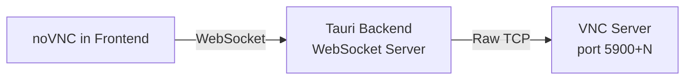

## VNC via SSH Tunnel

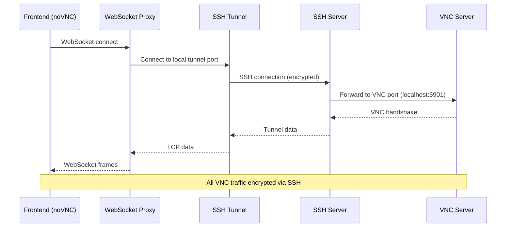

## Keyboard Shortcut Handling

VNC sessions conflict with termiHub's keyboard shortcuts since all keys should be forwarded to the
remote desktop. The escape hatch (`Ctrl+Shift+Escape` by default, configurable) releases focus back
to termiHub.

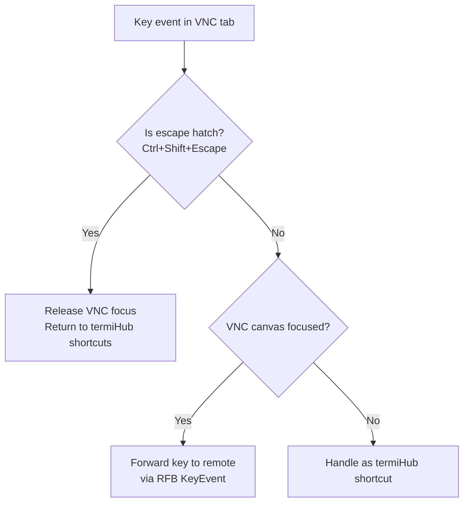

## VNC Session Lifecycle

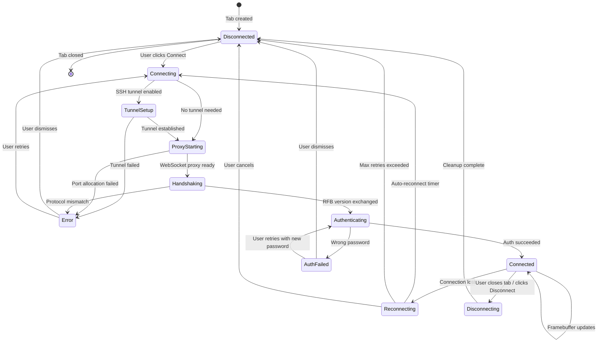

## WebSocket Proxy Lifecycle

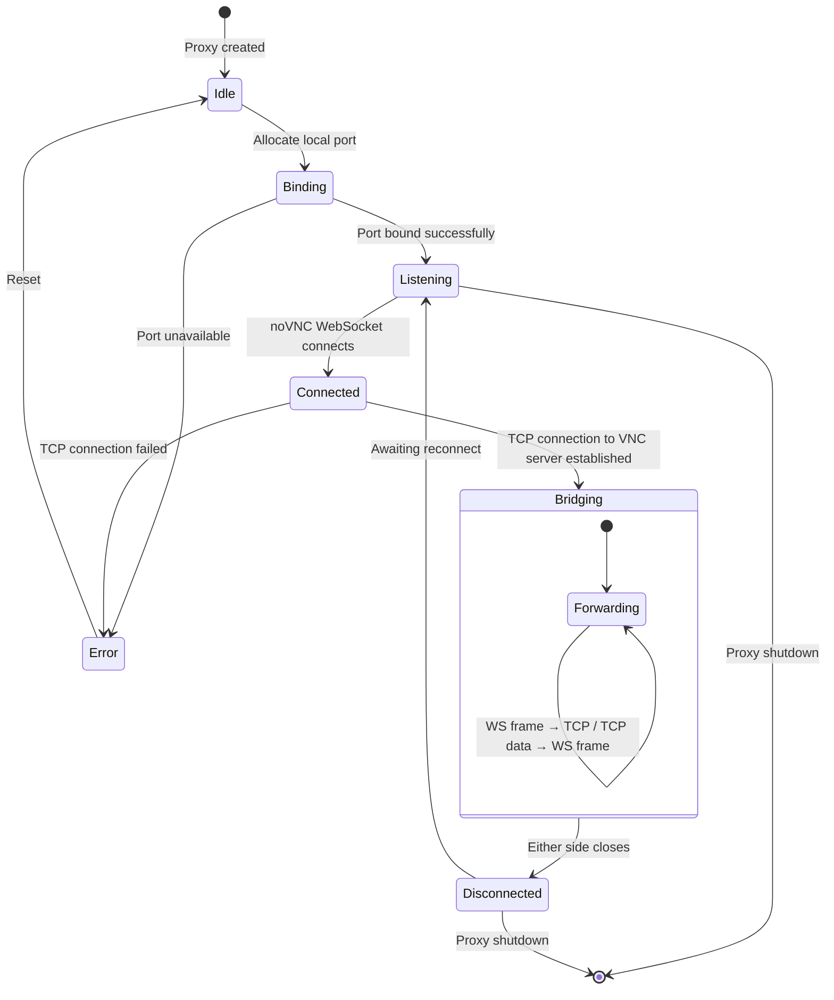

## Connection Sequence (Full Flow)

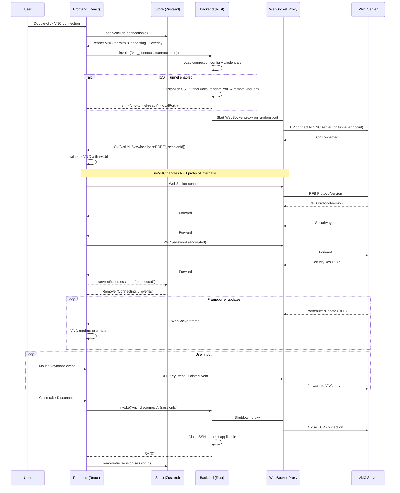

## Clipboard Sync Sequence

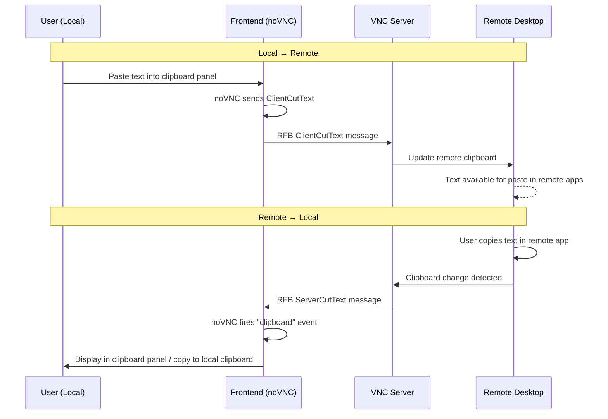

## Scaling & Resize Flow

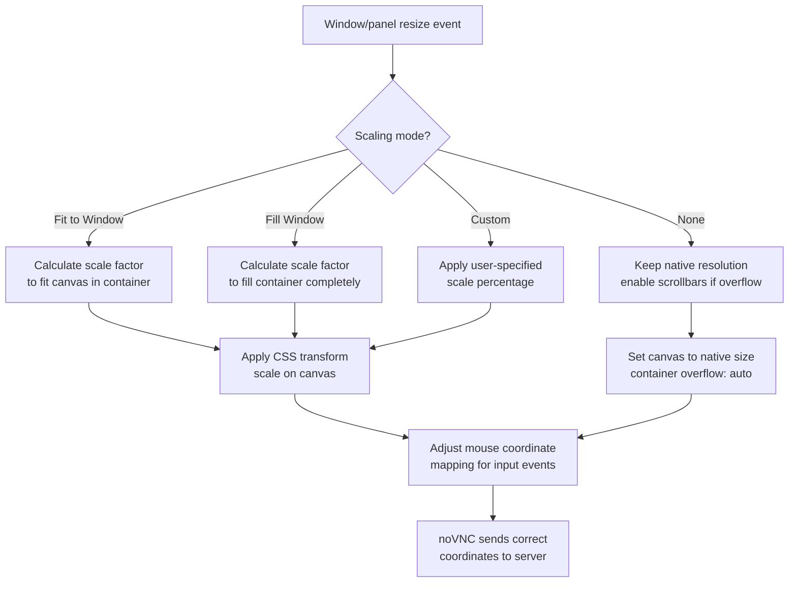

## SSH Tunnel Branch

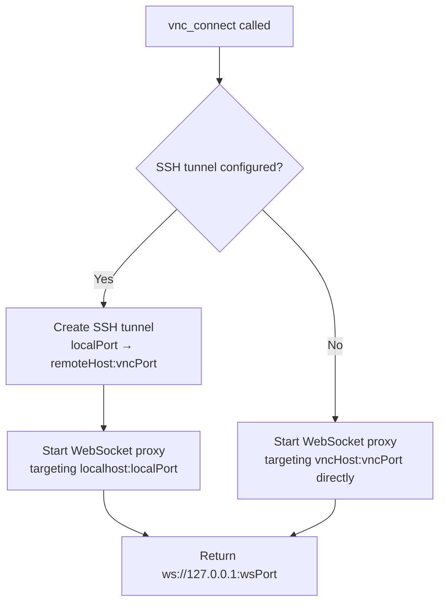

## Proxy Byte Forwarding

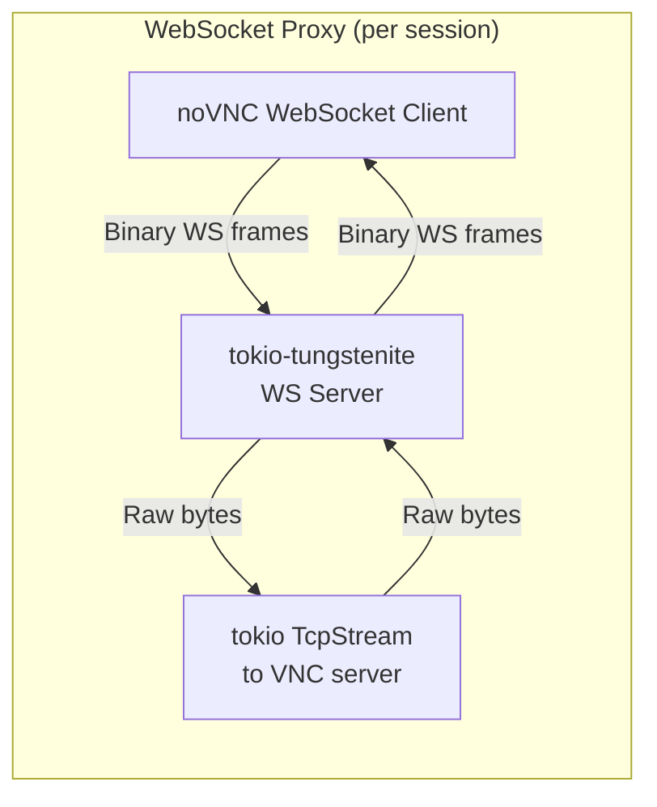

## Implementation Phases

```mermaid
gantt
    title VNC Sessions Implementation Phases
    dateFormat X
    axisFormat %s

    section Phase 1 — Core Infrastructure
    WebSocket-to-TCP proxy (Rust)             :a1, 0, 3
    VncManager + Tauri commands               :a2, 0, 2
    VNC connection type + schema              :a3, 2, 2

    section Phase 2 — Frontend Integration
    VncViewer component (noVNC wrapper)       :b1, 4, 3
    VNC tab type + store integration          :b2, 4, 2
    Connection editor VNC form                :b3, 6, 2

    section Phase 3 — Features
    Floating toolbar + special keys           :c1, 8, 2
    Clipboard sync panel                      :c2, 8, 2
    Scaling modes + resize handling           :c3, 8, 2
    Reconnection logic                        :c4, 10, 2

    section Phase 4 — SSH Tunnel + Polish
    SSH tunnel integration for VNC            :d1, 12, 2
    Credential store for VNC passwords        :d2, 12, 1
    Keyboard mapping + escape hatch           :d3, 13, 2
    Status bar integration                    :d4, 14, 1
```
