# XDMCP (X Display Manager Control Protocol) Sessions

> GitHub Issue: [#515](https://github.com/armaxri/termiHub/issues/515)

## Overview

Add XDMCP support to termiHub, allowing users to connect to remote Unix/Linux graphical desktop sessions and display them locally. XDMCP provides full remote desktop login sessions (display manager login screen → complete desktop environment), unlike X11 forwarding which handles individual application windows.

**Motivation**: XDMCP is the native X Window System protocol for remote desktop sessions. While its usage has declined in favor of VNC and RDP, it remains relevant in:

- Legacy Unix/Solaris/AIX environments
- Academic and research computing (shared workstations, HPC clusters)
- Thin client deployments
- Environments where X11 is the native display protocol and VNC/RDP would add unnecessary overhead

MobaXterm supports XDMCP via its built-in X server. Adding XDMCP support makes termiHub a more complete MobaXterm replacement for Unix-centric workflows.

**Key goals**:

- **Full desktop sessions**: Connect to a remote X Display Manager (XDM, GDM, LightDM, SDDM) and run a complete desktop environment
- **Multiple implementation strategies**: Support both external X server delegation and an embedded rendering approach
- **SSH tunneling recommendation**: XDMCP is inherently insecure (unencrypted UDP) — always recommend SSH tunneling for non-LAN connections
- **Connection editor integration**: Schema-driven form for host, display number, query type, and X server options
- **Cross-platform**: Works on Windows (Xming/VcXsrv), macOS (XQuartz), and Linux (native X11)

### XDMCP Protocol Basics

XDMCP operates over UDP port 177. The protocol negotiates a session between a local X server and a remote X Display Manager:

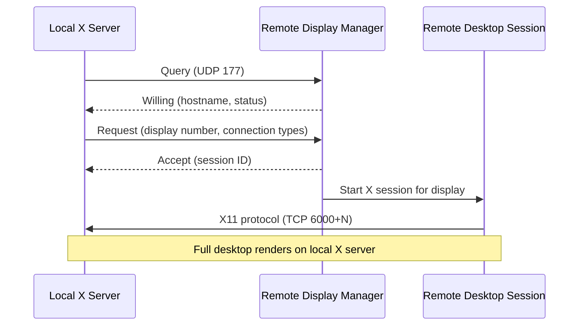
```mermaid
sequenceDiagram
    participant X as Local X Server
    participant D as Remote Display Manager
    participant S as Remote Desktop Session

    X->>D: Query (UDP 177)
    D-->>X: Willing (hostname, status)
    X->>D: Request (display number, connection types)
    D-->>X: Accept (session ID)
    D->>S: Start X session for display
    S->>X: X11 protocol (TCP 6000+N)
    Note over X,S: Full desktop renders on local X server
```

Unlike VNC/RDP which transmit pixel data, XDMCP instructs the remote system to open an X11 connection back to the local X server. The remote applications send X11 drawing commands, which the local X server renders natively. This means **a local X11 server is required** — there is no way to render XDMCP sessions without one.

### Implementation Approach Comparison

| Approach                                         | Pros                                                                        | Cons                                                                                        |
| ------------------------------------------------ | --------------------------------------------------------------------------- | ------------------------------------------------------------------------------------------- |
| **External X server delegation**                 | Simplest, leverages mature tools (XQuartz, VcXsrv, Xming), full performance | Requires user to install/configure external software, not embedded in termiHub              |
| **Embedded X server (Xvfb/Xephyr) + VNC bridge** | Self-contained, no external deps on Linux                                   | Complex setup, adds latency via VNC re-encoding, Xvfb/Xephyr not available on all platforms |
| **Web-based X11 rendering (Xpra HTML5)**         | Runs in WebView, no external deps                                           | Xpra is heavy, not designed for XDMCP, complex deployment                                   |
| **Native X11 rendering in canvas**               | Fully embedded, best UX                                                     | Enormous effort — essentially writing an X server, not feasible                             |

**Recommendation**: Use a **two-tier approach**:

1. **Primary (all platforms)**: Delegate to an external X server (XQuartz on macOS, VcXsrv/Xming on Windows, native Xorg on Linux). termiHub manages the XDMCP negotiation and launches/configures the X server session.
2. **Secondary (Linux only, stretch goal)**: Use an embedded Xephyr instance with VNC bridge to render inside a termiHub tab via the existing VNC infrastructure.

## UI Interface

### Connection Editor — XDMCP Configuration

The connection editor uses the existing schema-driven form system. When the user selects "XDMCP" as the connection type:

```
┌──────────────────────────────────────────────────────────────┐
│ CONNECTION EDITOR                                            │
│                                                              │
│ Type: [XDMCP ▾]                                              │
│                                                              │
│ ─── Connection ───                                           │
│ Host:           [unix-server.local      ]                    │
│ Query Type:     [Direct ▾]                                   │
│                  ├─ Direct (connect to specific host)         │
│                  ├─ Indirect (via XDMCP chooser)             │
│                  └─ Broadcast (discover on LAN)              │
│ Display Number: [0                      ]                    │
│                                                              │
│ ─── X Server ───                                             │
│ X Server Mode:  [External ▾]                                 │
│                  ├─ External (use installed X server)         │
│                  └─ Embedded (Xephyr + VNC, Linux only)      │
│ Resolution:     [1280×1024 ▾]                                │
│                  ├─ 1024×768                                  │
│                  ├─ 1280×1024                                 │
│                  ├─ 1920×1080                                 │
│                  └─ Custom: [____] × [____]                  │
│ Color Depth:    [24-bit ▾]                                   │
│                                                              │
│ ─── Security ───                                             │
│ ⚠ XDMCP traffic is unencrypted. Use SSH tunnel for          │
│   remote connections.                                        │
│ Use SSH Tunnel: [☐]                                          │
│ SSH Host:       [                       ]                    │
│ SSH Port:       [22                     ]                    │
│ SSH Username:   [                       ]                    │
│ SSH Auth:       [Key ▾]                                      │
│                                                              │
│ ─── Advanced ───                                             │
│ X Server Path:  [auto-detect            ]  [Browse]          │
│ Extra X Args:   [                       ]                    │
│ Session Timeout: [0    ] seconds (0 = no timeout)            │
│                                                              │
│              [Test Connection]  [Save]                        │
└──────────────────────────────────────────────────────────────┘
```

**Query type interplay**:

- **Direct**: Connects to the specified host. Host field is required.
- **Indirect**: Connects to the specified host which acts as an XDMCP chooser, presenting a list of available hosts. Host field is required.
- **Broadcast**: Sends a BroadcastQuery on the local network to discover available display managers. Host field is hidden (not needed).

### XDMCP Session — External X Server Mode

When using an external X server, termiHub launches a new X server window (or nested X session) on the user's system. The remote desktop renders in that external window, not inside a termiHub tab:

```
┌──────────────────────────────────────────────────────────────┐
│ Tab: XDMCP: unix-server  │ Tab: SSH: dev-box  │ +           │
├──────────────────────────────────────────────────────────────┤
│                                                              │
│  ┌────────────────────────────────────────────────────────┐  │
│  │  XDMCP Session Active                                  │  │
│  │                                                        │  │
│  │  Host:       unix-server.local                         │  │
│  │  Display:    :0                                        │  │
│  │  Status:     ● Connected (external X server)           │  │
│  │  X Server:   XQuartz (/opt/X11/bin/Xquartz)            │  │
│  │  Resolution: 1280×1024                                 │  │
│  │                                                        │  │
│  │  The remote desktop is displayed in the external       │  │
│  │  X server window.                                      │  │
│  │                                                        │  │
│  │  [Focus X Window]  [Restart Session]  [Disconnect]     │  │
│  └────────────────────────────────────────────────────────┘  │
│                                                              │
├──────────────────────────────────────────────────────────────┤
│ XDMCP │ unix-server.local │ :0 │ External (XQuartz)         │
└──────────────────────────────────────────────────────────────┘
```

The XDMCP tab in termiHub serves as a **control panel** for the external session, showing connection status and providing session controls. The actual remote desktop is in the external X server window.

### XDMCP Session — Embedded Mode (Linux Stretch Goal)

On Linux, the embedded mode uses Xephyr (nested X server) with a VNC bridge to render inside a termiHub tab, reusing the VNC viewer infrastructure:

```
┌──────────────────────────────────────────────────────────────┐
│ Tab: XDMCP: unix-server  │ Tab: SSH: dev-box  │ +           │
├──────────────────────────────────────────────────────────────┤
│ ┌────────────────────────────────────────────────────────┐   │
│ │ 🖥 unix-server.local │ :0 │ 1280×1024 │ Ctrl+Alt+Del │ ⛶ │   │
│ └────────────────────────────────────────────────────────┘   │
│ ╔════════════════════════════════════════════════════════╗   │
│ ║                                                        ║   │
│ ║          Remote Linux Desktop                          ║   │
│ ║          (rendered via Xephyr + VNC bridge)            ║   │
│ ║                                                        ║   │
│ ║   ┌──────────────────────────────────┐                 ║   │
│ ║   │  GDM login screen or desktop    │                 ║   │
│ ║   │  environment displayed here     │                 ║   │
│ ║   └──────────────────────────────────┘                 ║   │
│ ║                                                        ║   │
│ ╚════════════════════════════════════════════════════════╝   │
├──────────────────────────────────────────────────────────────┤
│ XDMCP │ unix-server.local │ :0 │ Embedded (Xephyr+VNC)      │
└──────────────────────────────────────────────────────────────┘
```

This mode reuses the toolbar, canvas rendering, and input handling from the VNC concept, since the Xephyr display is bridged to a VNC server.

### Sidebar — Connection List

XDMCP connections appear in the Connections sidebar with a distinct icon:

```
┌─────────────────────────────────────┐
│ CONNECTIONS                         │
│                                     │
│ ─── Servers ───                     │
│  🖧 Unix Server (XDMCP)            │
│  🖥 Windows Server (RDP)            │
│  🔌 Linux Box (SSH)                 │
│  📡 Network Switch (Telnet)         │
│                                     │
│ ─── Local ───                       │
│  💻 Bash                            │
└─────────────────────────────────────┘
```

Right-click context menu on an XDMCP connection:

- **Connect** — start XDMCP session
- **Edit** — open connection editor
- **Duplicate**
- **Delete**

### X Server Status Indicator

Since XDMCP requires an external X server, the status bar shows X server availability:

```
┌──────────────────────────────────────────────────────────────┐
│ X Server: ● Available (XQuartz 2.8.5)                        │
└──────────────────────────────────────────────────────────────┘
```

Or when no X server is detected:

```
┌──────────────────────────────────────────────────────────────┐
│ X Server: ○ Not detected — Install XQuartz (macOS) or       │
│ VcXsrv (Windows) to use XDMCP. [Learn More]                 │
└──────────────────────────────────────────────────────────────┘
```

### Broadcast Discovery Dialog

When using the Broadcast query type, a discovery dialog shows available display managers on the LAN:

```
┌──────────────────────────────────────────────────────────────┐
│ XDMCP Discovery                                        [X]  │
│                                                              │
│ Scanning for XDMCP hosts on local network...                 │
│                                                              │
│ ┌──────────────────────────────────────────────────────────┐ │
│ │ Host                    │ Status    │ OS                 │ │
│ ├─────────────────────────┼───────────┼────────────────────┤ │
│ │ workstation.local       │ Willing   │ Linux 6.1          │ │
│ │ solaris-box.local       │ Willing   │ SunOS 5.11         │ │
│ │ lab-server.local        │ Willing   │ Linux 5.15         │ │
│ └──────────────────────────────────────────────────────────┘ │
│                                                              │
│ [Refresh]                                    [Connect]       │
└──────────────────────────────────────────────────────────────┘
```

### Indirect Chooser Dialog

When using Indirect query type, the remote chooser host presents available display managers:

```
┌──────────────────────────────────────────────────────────────┐
│ XDMCP Chooser (via chooser.corp.local)                 [X]  │
│                                                              │
│ Select a host to connect to:                                 │
│                                                              │
│ ┌──────────────────────────────────────────────────────────┐ │
│ │ Host                    │ Status    │ Load               │ │
│ ├─────────────────────────┼───────────┼────────────────────┤ │
│ │ server1.corp.local      │ Willing   │ Low                │ │
│ │ server2.corp.local      │ Willing   │ Medium             │ │
│ │ server3.corp.local      │ Busy      │ High               │ │
│ └──────────────────────────────────────────────────────────┘ │
│                                                              │
│                                          [Connect]           │
└──────────────────────────────────────────────────────────────┘
```

## General Handling

### Connection Lifecycle

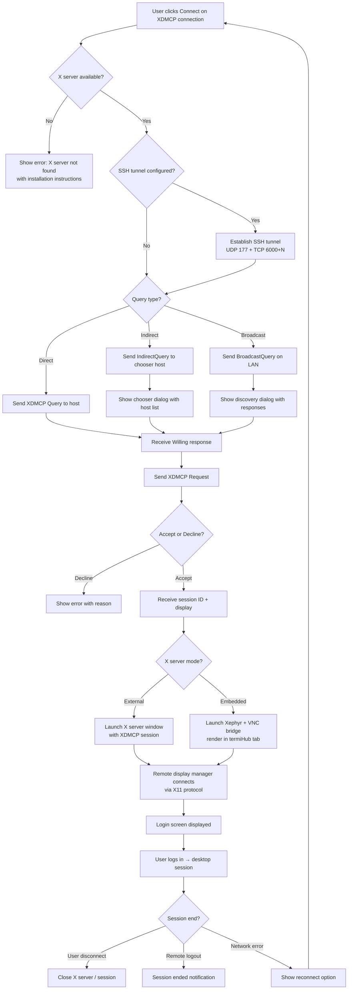
```mermaid
flowchart TD
    A[User clicks Connect on XDMCP connection] --> B{X server available?}
    B -->|No| C[Show error: X server not found<br>with installation instructions]
    B -->|Yes| D{SSH tunnel configured?}
    D -->|Yes| E[Establish SSH tunnel<br>UDP 177 + TCP 6000+N]
    D -->|No| F{Query type?}
    E --> F
    F -->|Direct| G[Send XDMCP Query to host]
    F -->|Indirect| H[Send IndirectQuery to chooser host]
    F -->|Broadcast| I[Send BroadcastQuery on LAN]
    G --> J[Receive Willing response]
    H --> K[Show chooser dialog with host list]
    I --> L[Show discovery dialog with responses]
    K --> J
    L --> J
    J --> M[Send XDMCP Request]
    M --> N{Accept or Decline?}
    N -->|Decline| O[Show error with reason]
    N -->|Accept| P[Receive session ID + display]
    P --> Q{X server mode?}
    Q -->|External| R[Launch X server window<br>with XDMCP session]
    Q -->|Embedded| S[Launch Xephyr + VNC bridge<br>render in termiHub tab]
    R --> T[Remote display manager connects<br>via X11 protocol]
    S --> T
    T --> U[Login screen displayed]
    U --> V[User logs in → desktop session]
    V --> W{Session end?}
    W -->|User disconnect| X[Close X server / session]
    W -->|Remote logout| Y[Session ended notification]
    W -->|Network error| Z[Show reconnect option]
    Z --> A
```

### X Server Detection

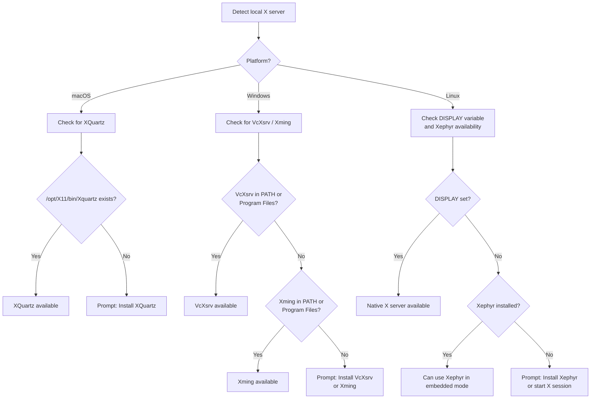
```mermaid
flowchart TD
    A[Detect local X server] --> B{Platform?}

    B -->|macOS| C[Check for XQuartz]
    C --> C1{/opt/X11/bin/Xquartz exists?}
    C1 -->|Yes| C2[XQuartz available]
    C1 -->|No| C3[Prompt: Install XQuartz]

    B -->|Windows| D[Check for VcXsrv / Xming]
    D --> D1{VcXsrv in PATH or<br>Program Files?}
    D1 -->|Yes| D2[VcXsrv available]
    D1 -->|No| D3{Xming in PATH or<br>Program Files?}
    D3 -->|Yes| D4[Xming available]
    D3 -->|No| D5[Prompt: Install VcXsrv<br>or Xming]

    B -->|Linux| E[Check DISPLAY variable<br>and Xephyr availability]
    E --> E1{DISPLAY set?}
    E1 -->|Yes| E2[Native X server available]
    E1 -->|No| E3{Xephyr installed?}
    E3 -->|Yes| E4[Can use Xephyr in embedded mode]
    E3 -->|No| E5[Prompt: Install Xephyr<br>or start X session]
```

### Authentication Flow

XDMCP itself does not handle user authentication — it delegates to the X Display Manager on the remote host. The authentication flow is:

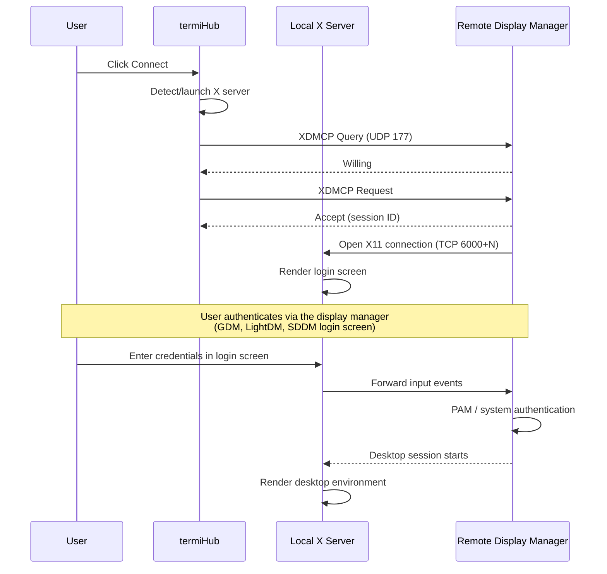
```mermaid
sequenceDiagram
    participant U as User
    participant T as termiHub
    participant X as Local X Server
    participant D as Remote Display Manager

    U->>T: Click Connect
    T->>T: Detect/launch X server
    T->>D: XDMCP Query (UDP 177)
    D-->>T: Willing
    T->>D: XDMCP Request
    D-->>T: Accept (session ID)
    D->>X: Open X11 connection (TCP 6000+N)
    X->>X: Render login screen

    Note over U,D: User authenticates via the display manager<br>(GDM, LightDM, SDDM login screen)

    U->>X: Enter credentials in login screen
    X->>D: Forward input events
    D->>D: PAM / system authentication
    D-->>X: Desktop session starts
    X->>X: Render desktop environment
```

The user logs in via the graphical login screen rendered by the display manager — there is no password field in the termiHub connection editor for XDMCP (unlike RDP/VNC).

### XDMCP Query Types

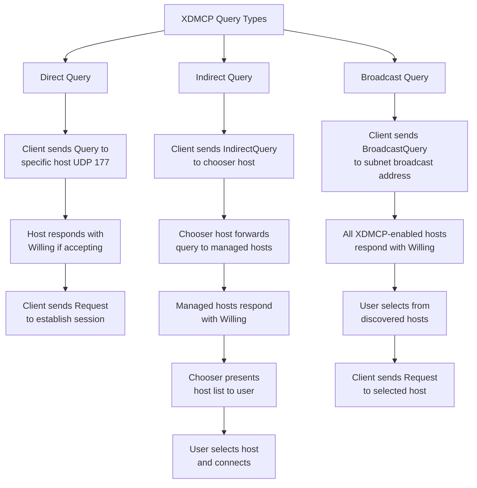
```mermaid
flowchart TD
    A[XDMCP Query Types] --> B[Direct Query]
    A --> C[Indirect Query]
    A --> D[Broadcast Query]

    B --> B1[Client sends Query to<br>specific host UDP 177]
    B1 --> B2[Host responds with<br>Willing if accepting]
    B2 --> B3[Client sends Request<br>to establish session]

    C --> C1[Client sends IndirectQuery<br>to chooser host]
    C1 --> C2[Chooser host forwards<br>query to managed hosts]
    C2 --> C3[Managed hosts respond<br>with Willing]
    C3 --> C4[Chooser presents<br>host list to user]
    C4 --> C5[User selects host<br>and connects]

    D --> D1[Client sends BroadcastQuery<br>to subnet broadcast address]
    D1 --> D2[All XDMCP-enabled hosts<br>respond with Willing]
    D2 --> D3[User selects from<br>discovered hosts]
    D3 --> D4[Client sends Request<br>to selected host]
```

### SSH Tunneling for XDMCP

XDMCP is inherently insecure — all traffic (including the X11 protocol carrying display data and user input) travels unencrypted. For any non-LAN connection, SSH tunneling is strongly recommended.

XDMCP tunneling is more complex than VNC/RDP tunneling because it involves **two protocols on different transports**:

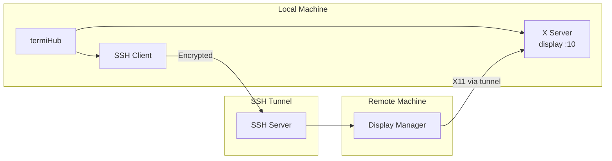
```mermaid
flowchart LR
    subgraph "Local Machine"
        T[termiHub] --> X[X Server<br>display :10]
        T --> SSH[SSH Client]
    end

    subgraph "SSH Tunnel"
        SSH -->|Encrypted| SSHD[SSH Server]
    end

    subgraph "Remote Machine"
        SSHD --> DM[Display Manager]
        DM -->|X11 via tunnel| X
    end
```

The SSH tunnel approach for XDMCP:

1. **Forward UDP 177** (XDMCP queries) — SSH does not natively support UDP forwarding, so use `socat` or a UDP-to-TCP relay on both ends
2. **Reverse X11 forwarding** — Use SSH's built-in X11 forwarding (`-X` or `-Y`) to carry the X11 display protocol back through the tunnel

Alternatively, the simpler (and recommended) approach is to use **SSH X11 forwarding with a remote Xephyr**:

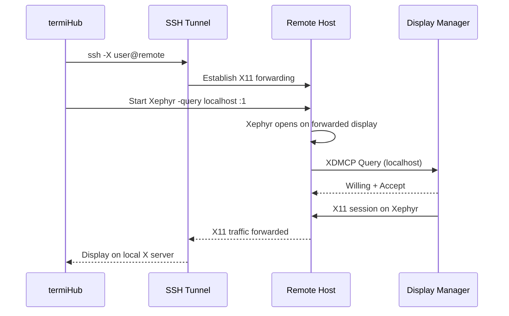
```mermaid
sequenceDiagram
    participant T as termiHub
    participant SSH as SSH Tunnel
    participant R as Remote Host
    participant DM as Display Manager

    T->>SSH: ssh -X user@remote
    SSH->>R: Establish X11 forwarding
    T->>R: Start Xephyr -query localhost :1
    R->>R: Xephyr opens on forwarded display
    R->>DM: XDMCP Query (localhost)
    DM-->>R: Willing + Accept
    DM->>R: X11 session on Xephyr
    R-->>SSH: X11 traffic forwarded
    SSH-->>T: Display on local X server
```

### Edge Cases

| Scenario                                 | Handling                                                                                                        |
| ---------------------------------------- | --------------------------------------------------------------------------------------------------------------- |
| **No X server installed**                | Show installation instructions with links for each platform. Disable Connect button until X server is detected. |
| **X server crashed during session**      | Detect process exit, show "X server terminated unexpectedly" with restart option                                |
| **XDMCP host refuses connection**        | Show "Host declined XDMCP request" with common causes (XDMCP disabled, firewall, access control)                |
| **Broadcast finds no hosts**             | Show "No XDMCP hosts found on the local network" with troubleshooting tips                                      |
| **Firewall blocking UDP 177**            | Show timeout error with note: "XDMCP uses UDP port 177 — ensure firewall allows this port"                      |
| **Multiple displays**                    | Allow user to specify display number; default to :0                                                             |
| **X server already running**             | Detect existing X server instance and offer to reuse or launch a new one                                        |
| **Remote DM not configured for XDMCP**   | Show error with instructions to enable XDMCP in GDM/LightDM/SDDM configuration                                  |
| **Session timeout**                      | Configurable timeout; show warning before disconnect, allow extension                                           |
| **Tab closed while session active**      | Prompt "Disconnect XDMCP session?" before closing; kill X server process on confirm                             |
| **Very high latency**                    | X11 protocol is latency-sensitive; show latency warning if RTT > 50ms and recommend VNC instead                 |
| **Xephyr not available (embedded mode)** | Fall back to external mode with explanation                                                                     |
| **Display number conflict**              | Auto-detect available display numbers to avoid conflicts with existing X sessions                               |

## States & Sequences

### XDMCP Session State Machine

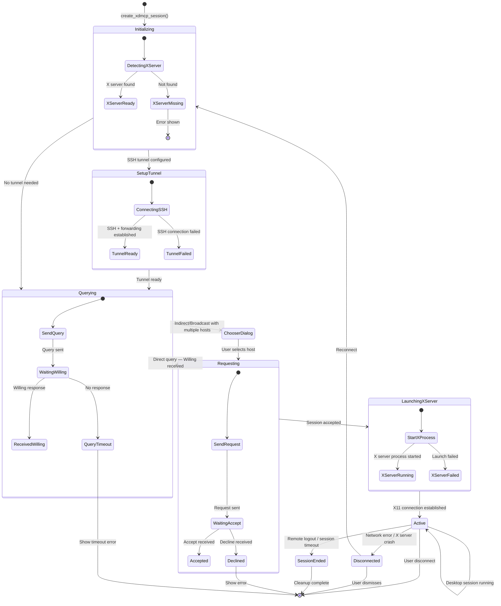
```mermaid
stateDiagram-v2
    [*] --> Initializing: create_xdmcp_session()

    state Initializing {
        [*] --> DetectingXServer
        DetectingXServer --> XServerReady: X server found
        DetectingXServer --> XServerMissing: Not found
        XServerMissing --> [*]: Error shown
    }

    Initializing --> SetupTunnel: SSH tunnel configured

    state SetupTunnel {
        [*] --> ConnectingSSH
        ConnectingSSH --> TunnelReady: SSH + forwarding established
        ConnectingSSH --> TunnelFailed: SSH connection failed
    }

    SetupTunnel --> Querying: Tunnel ready
    Initializing --> Querying: No tunnel needed

    state Querying {
        [*] --> SendQuery
        SendQuery --> WaitingWilling: Query sent
        WaitingWilling --> ReceivedWilling: Willing response
        WaitingWilling --> QueryTimeout: No response
    }

    Querying --> ChooserDialog: Indirect/Broadcast with multiple hosts
    ChooserDialog --> Requesting: User selects host

    Querying --> Requesting: Direct query — Willing received

    state Requesting {
        [*] --> SendRequest
        SendRequest --> WaitingAccept: Request sent
        WaitingAccept --> Accepted: Accept received
        WaitingAccept --> Declined: Decline received
    }

    Requesting --> LaunchingXServer: Session accepted

    state LaunchingXServer {
        [*] --> StartXProcess
        StartXProcess --> XServerRunning: X server process started
        StartXProcess --> XServerFailed: Launch failed
    }

    LaunchingXServer --> Active: X11 connection established

    Active --> Active: Desktop session running
    Active --> Disconnected: Network error / X server crash
    Active --> SessionEnded: Remote logout / session timeout
    Active --> [*]: User disconnect

    Disconnected --> Initializing: Reconnect
    Disconnected --> [*]: User dismisses

    SessionEnded --> [*]: Cleanup complete

    Declined --> [*]: Show error
    QueryTimeout --> [*]: Show timeout error
```

### External X Server Launch Sequence

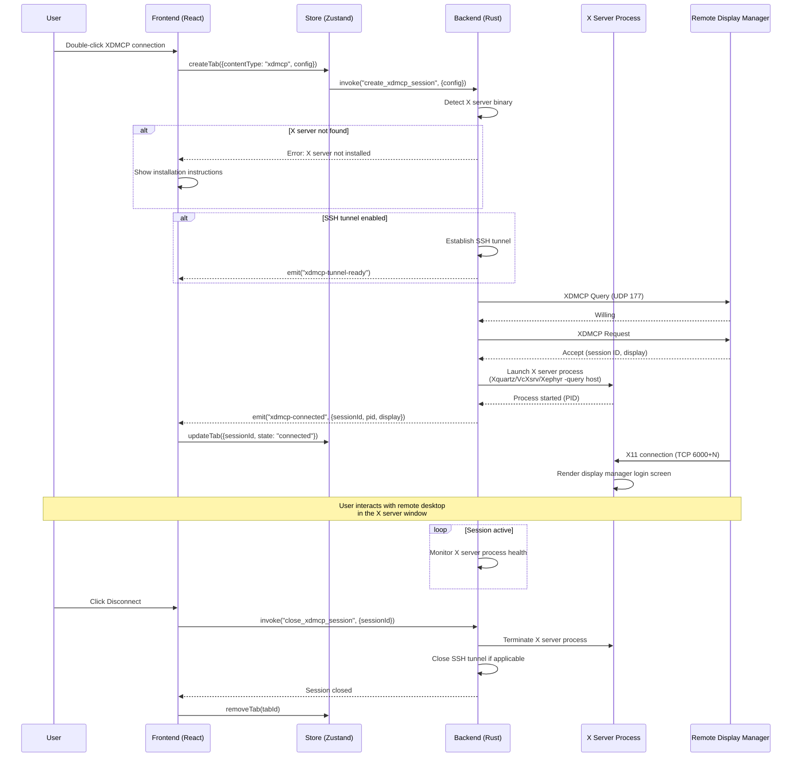
```mermaid
sequenceDiagram
    participant U as User
    participant F as Frontend (React)
    participant S as Store (Zustand)
    participant B as Backend (Rust)
    participant X as X Server Process
    participant D as Remote Display Manager

    U->>F: Double-click XDMCP connection
    F->>S: createTab({contentType: "xdmcp", config})
    S->>B: invoke("create_xdmcp_session", {config})

    B->>B: Detect X server binary
    alt X server not found
        B-->>F: Error: X server not installed
        F->>F: Show installation instructions
    end

    alt SSH tunnel enabled
        B->>B: Establish SSH tunnel
        B-->>F: emit("xdmcp-tunnel-ready")
    end

    B->>D: XDMCP Query (UDP 177)
    D-->>B: Willing
    B->>D: XDMCP Request
    D-->>B: Accept (session ID, display)

    B->>X: Launch X server process<br>(Xquartz/VcXsrv/Xephyr -query host)
    X-->>B: Process started (PID)
    B-->>F: emit("xdmcp-connected", {sessionId, pid, display})
    F->>S: updateTab({sessionId, state: "connected"})

    D->>X: X11 connection (TCP 6000+N)
    X->>X: Render display manager login screen

    Note over U,D: User interacts with remote desktop<br>in the X server window

    loop Session active
        B->>B: Monitor X server process health
    end

    U->>F: Click Disconnect
    F->>B: invoke("close_xdmcp_session", {sessionId})
    B->>X: Terminate X server process
    B->>B: Close SSH tunnel if applicable
    B-->>F: Session closed
    F->>S: removeTab(tabId)
```

### Embedded Mode Sequence (Linux Stretch Goal)

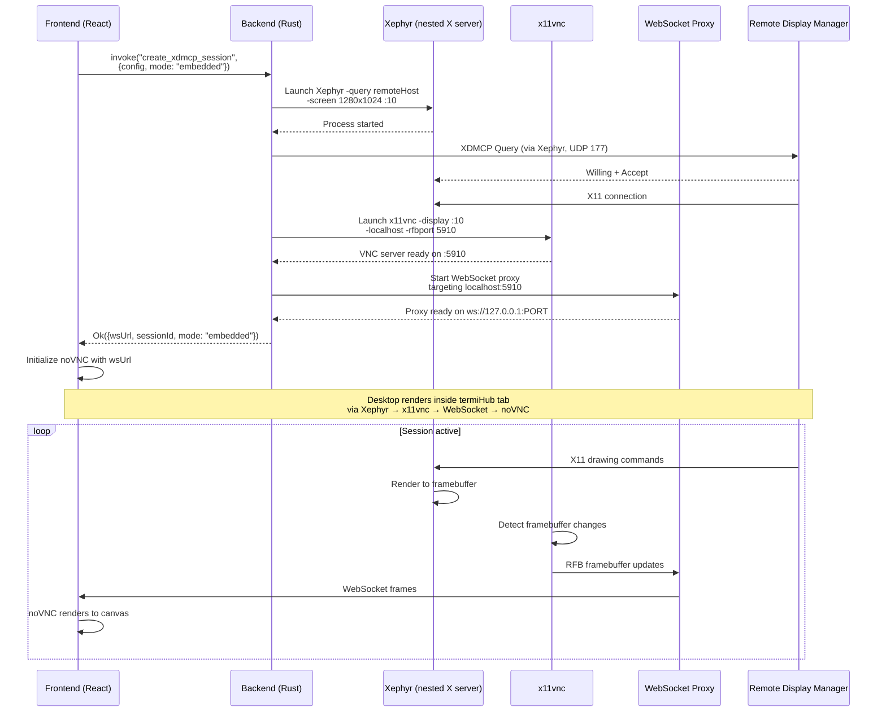
```mermaid
sequenceDiagram
    participant F as Frontend (React)
    participant B as Backend (Rust)
    participant XE as Xephyr (nested X server)
    participant VNC as x11vnc
    participant WS as WebSocket Proxy
    participant D as Remote Display Manager

    F->>B: invoke("create_xdmcp_session",<br>{config, mode: "embedded"})

    B->>XE: Launch Xephyr -query remoteHost<br>-screen 1280x1024 :10
    XE-->>B: Process started

    B->>D: XDMCP Query (via Xephyr, UDP 177)
    D-->>XE: Willing + Accept
    D->>XE: X11 connection

    B->>VNC: Launch x11vnc -display :10<br>-localhost -rfbport 5910
    VNC-->>B: VNC server ready on :5910

    B->>WS: Start WebSocket proxy<br>targeting localhost:5910
    WS-->>B: Proxy ready on ws://127.0.0.1:PORT

    B-->>F: Ok({wsUrl, sessionId, mode: "embedded"})
    F->>F: Initialize noVNC with wsUrl

    Note over F,D: Desktop renders inside termiHub tab<br>via Xephyr → x11vnc → WebSocket → noVNC

    loop Session active
        D->>XE: X11 drawing commands
        XE->>XE: Render to framebuffer
        VNC->>VNC: Detect framebuffer changes
        VNC->>WS: RFB framebuffer updates
        WS->>F: WebSocket frames
        F->>F: noVNC renders to canvas
    end
```

### XDMCP Protocol Message Flow

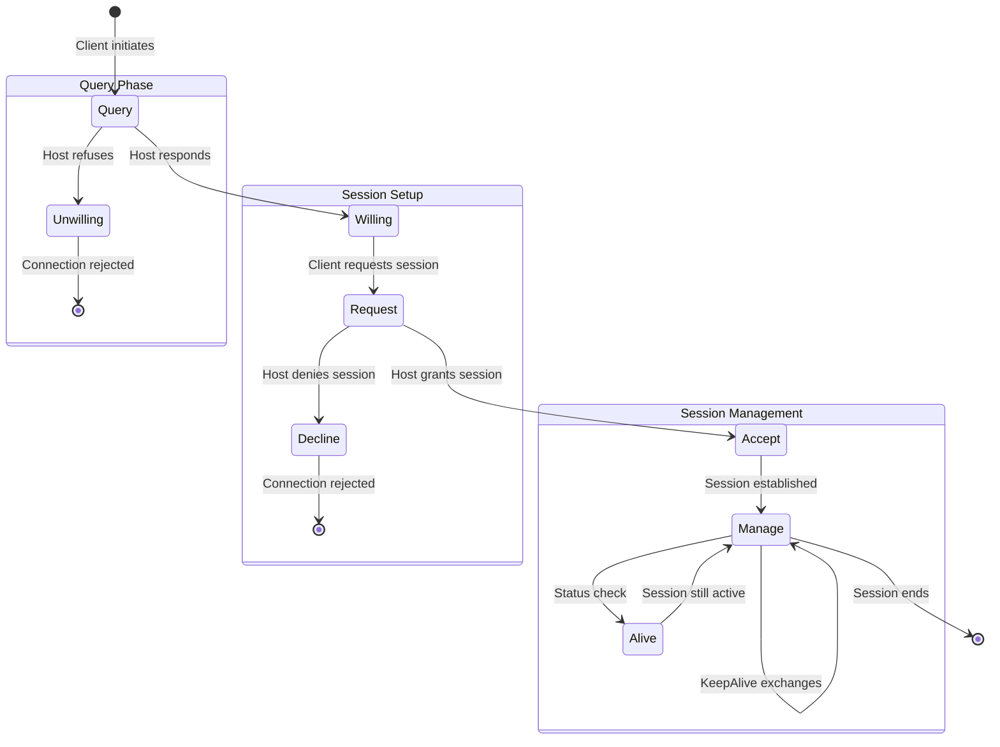
```mermaid
stateDiagram-v2
    [*] --> Query: Client initiates

    state "Query Phase" as QueryPhase {
        Query --> Willing: Host responds
        Query --> Unwilling: Host refuses
        Unwilling --> [*]: Connection rejected
    }

    state "Session Setup" as SessionSetup {
        Willing --> Request: Client requests session
        Request --> Accept: Host grants session
        Request --> Decline: Host denies session
        Decline --> [*]: Connection rejected
    }

    state "Session Management" as SessionManagement {
        Accept --> Manage: Session established
        Manage --> Manage: KeepAlive exchanges
        Manage --> Alive: Status check
        Alive --> Manage: Session still active
    }

    Manage --> [*]: Session ends
```

### Process Tree for External Mode

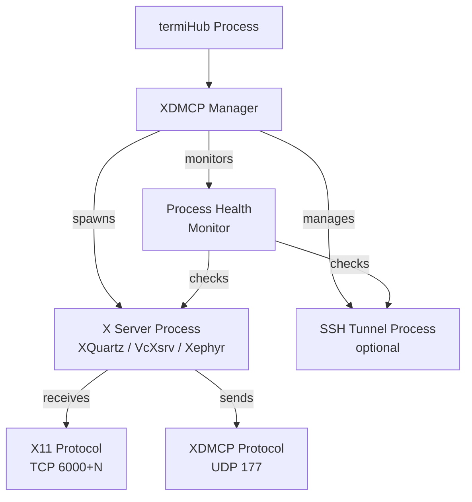
```mermaid
flowchart TD
    T[termiHub Process] --> M[XDMCP Manager]
    M --> |spawns| X[X Server Process<br>XQuartz / VcXsrv / Xephyr]
    M --> |manages| SSH[SSH Tunnel Process<br>optional]

    X --> |receives| X11[X11 Protocol<br>TCP 6000+N]
    X --> |sends| XDMCP[XDMCP Protocol<br>UDP 177]

    M --> |monitors| PID[Process Health<br>Monitor]
    PID --> |checks| X
    PID --> |checks| SSH
```

### Process Tree for Embedded Mode

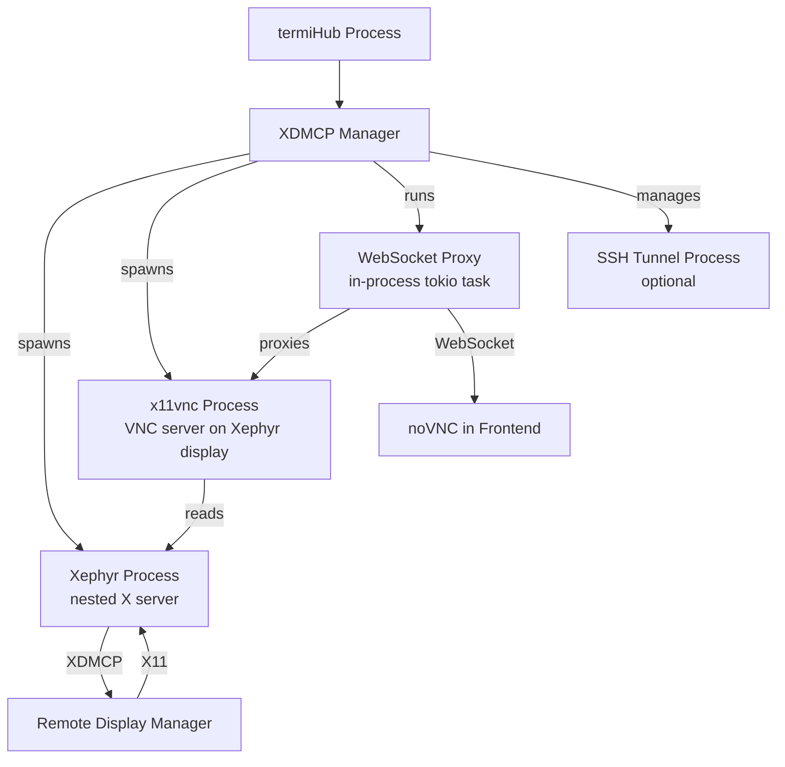
```mermaid
flowchart TD
    T[termiHub Process] --> M[XDMCP Manager]
    M --> |spawns| XE[Xephyr Process<br>nested X server]
    M --> |spawns| VNC[x11vnc Process<br>VNC server on Xephyr display]
    M --> |runs| WS[WebSocket Proxy<br>in-process tokio task]
    M --> |manages| SSH[SSH Tunnel Process<br>optional]

    XE --> |XDMCP| DM[Remote Display Manager]
    DM --> |X11| XE
    VNC --> |reads| XE
    WS --> |proxies| VNC
    WS --> |WebSocket| NV[noVNC in Frontend]
```

## Preliminary Implementation Details

> **Note**: These details reflect the codebase at the time of concept creation. The implementation may need to adapt if the codebase evolves before this feature is built.

### Backend: XDMCP Session Manager

Create `src-tauri/src/xdmcp/` as a new module:

```
src-tauri/src/xdmcp/
  mod.rs            # XdmcpManager — holds active sessions, manages lifecycle
  session.rs        # XdmcpSession — wraps X server process and XDMCP state
  protocol.rs       # XDMCP protocol messages (Query, Willing, Request, Accept, etc.)
  xserver.rs        # X server detection, launch, and process management
  config.rs         # XdmcpConfig struct and validation
```

#### XdmcpConfig (Rust)

```rust
/// XDMCP connection configuration.
#[derive(Debug, Clone, Serialize, Deserialize)]
#[serde(rename_all = "camelCase")]
pub struct XdmcpConfig {
    pub host: Option<String>,  // None for Broadcast mode
    #[serde(default)]
    pub query_type: XdmcpQueryType,
    #[serde(default)]
    pub display_number: u16,

    // X Server
    #[serde(default)]
    pub x_server_mode: XServerMode,
    #[serde(default = "default_xdmcp_resolution")]
    pub resolution: XdmcpResolution,
    #[serde(default = "default_color_depth")]
    pub color_depth: u8,  // 8, 16, or 24

    // Security
    #[serde(default)]
    pub use_ssh_tunnel: bool,
    pub ssh_host: Option<String>,
    #[serde(default = "default_ssh_port")]
    pub ssh_port: u16,
    pub ssh_username: Option<String>,
    #[serde(default)]
    pub ssh_auth_method: SshAuthMethod,

    // Advanced
    pub x_server_path: Option<String>,  // None = auto-detect
    pub extra_x_args: Option<String>,
    #[serde(default)]
    pub session_timeout: u64,  // seconds, 0 = no timeout
}

#[derive(Debug, Clone, Serialize, Deserialize, Default)]
#[serde(rename_all = "camelCase")]
pub enum XdmcpQueryType {
    #[default]
    Direct,
    Indirect,
    Broadcast,
}

#[derive(Debug, Clone, Serialize, Deserialize, Default)]
#[serde(rename_all = "camelCase")]
pub enum XServerMode {
    #[default]
    External,
    Embedded,  // Linux only — Xephyr + VNC bridge
}

#[derive(Debug, Clone, Serialize, Deserialize)]
#[serde(rename_all = "camelCase")]
pub struct XdmcpResolution {
    pub width: u16,
    pub height: u16,
}

fn default_xdmcp_resolution() -> XdmcpResolution {
    XdmcpResolution { width: 1280, height: 1024 }
}

fn default_color_depth() -> u8 { 24 }
fn default_ssh_port() -> u16 { 22 }
```

#### XdmcpManager

```rust
pub struct XdmcpManager {
    /// Active XDMCP sessions keyed by session ID.
    sessions: HashMap<String, XdmcpSession>,
    /// App handle for emitting events to the frontend.
    app_handle: AppHandle,
}

impl XdmcpManager {
    /// Detect available X servers on the current platform.
    pub fn detect_x_server(&self) -> anyhow::Result<XServerInfo>;

    /// Create and start a new XDMCP session. Returns the session ID.
    pub async fn create_session(&mut self, config: XdmcpConfig) -> anyhow::Result<XdmcpSessionInfo>;

    /// Perform XDMCP broadcast discovery. Returns list of willing hosts.
    pub async fn broadcast_discover(&self) -> anyhow::Result<Vec<XdmcpHost>>;

    /// Perform XDMCP indirect query. Returns list of hosts from chooser.
    pub async fn indirect_query(&self, chooser_host: &str) -> anyhow::Result<Vec<XdmcpHost>>;

    /// Disconnect and clean up a session (kill X server process, close tunnel).
    pub async fn close_session(&mut self, session_id: &str) -> anyhow::Result<()>;
}
```

#### XdmcpSession

```rust
pub struct XdmcpSession {
    /// Session identifier.
    id: String,
    /// Connection configuration.
    config: XdmcpConfig,
    /// X server process handle.
    x_server_process: Option<Child>,
    /// X server PID for health monitoring.
    x_server_pid: Option<u32>,
    /// SSH tunnel handle, if tunneling is enabled.
    ssh_tunnel: Option<SshTunnelHandle>,
    /// For embedded mode: VNC proxy components.
    vnc_bridge: Option<VncBridge>,
    /// Current session state.
    state: XdmcpSessionState,
}

pub enum XdmcpSessionState {
    Initializing,
    DetectingXServer,
    EstablishingTunnel,
    Querying,
    ChooserActive { hosts: Vec<XdmcpHost> },
    Requesting,
    LaunchingXServer,
    Active { display: String, pid: u32 },
    Disconnecting,
    Disconnected,
    Error(String),
}

/// For embedded mode: manages Xephyr + x11vnc + WebSocket proxy.
pub struct VncBridge {
    xephyr_process: Child,
    x11vnc_process: Child,
    ws_proxy_port: u16,
    ws_proxy_handle: JoinHandle<()>,
}
```

#### X Server Detection and Launch

```rust
/// Information about a detected X server.
pub struct XServerInfo {
    pub name: String,           // "XQuartz", "VcXsrv", "Xming", "Xorg", "Xephyr"
    pub path: PathBuf,
    pub version: Option<String>,
}

/// Detect available X server on the current platform.
pub fn detect_x_server() -> anyhow::Result<XServerInfo> {
    #[cfg(target_os = "macos")]
    {
        // Check /opt/X11/bin/Xquartz and /usr/X11/bin/Xquartz
    }

    #[cfg(target_os = "windows")]
    {
        // Check Program Files for VcXsrv (vcxsrv.exe) and Xming (Xming.exe)
        // Also check PATH
    }

    #[cfg(target_os = "linux")]
    {
        // Check $DISPLAY for existing X server
        // Check for Xephyr in PATH
    }
}

/// Launch X server with XDMCP query to the specified host.
pub fn launch_x_server(
    x_server: &XServerInfo,
    host: &str,
    display: u16,
    resolution: &XdmcpResolution,
    color_depth: u8,
    extra_args: Option<&str>,
) -> anyhow::Result<Child> {
    // Build command based on X server type:
    // XQuartz: Xquartz :N -query host -screen 0 WxH
    // VcXsrv:  vcxsrv.exe :N -query host -screen 0 WxHxD
    // Xephyr:  Xephyr :N -query host -screen WxH
}
```

### XDMCP Protocol Implementation

The XDMCP protocol is simple enough to implement directly (no external crate needed). It uses UDP with a small set of message types:

```rust
/// XDMCP protocol opcodes (RFC 1148 / X11 specification).
#[repr(u16)]
pub enum XdmcpOpcode {
    BroadcastQuery = 1,
    Query = 2,
    IndirectQuery = 3,
    ForwardQuery = 4,
    Willing = 5,
    Unwilling = 6,
    Request = 7,
    Accept = 8,
    Decline = 9,
    Manage = 10,
    Refuse = 11,
    Failed = 12,
    KeepAlive = 13,
    Alive = 14,
}

/// Parsed XDMCP message.
pub enum XdmcpMessage {
    Query { authentication_names: Vec<String> },
    Willing { hostname: String, status: String },
    Unwilling { hostname: String, status: String },
    Request {
        display_number: u16,
        connection_types: Vec<u16>,
        connection_addresses: Vec<Vec<u8>>,
        authentication_name: String,
        authentication_data: Vec<u8>,
        authorization_names: Vec<String>,
        manufacturer_display_id: String,
    },
    Accept {
        session_id: u32,
        authentication_name: String,
        authentication_data: Vec<u8>,
        authorization_name: String,
        authorization_data: Vec<u8>,
    },
    Decline {
        status: String,
        authentication_name: String,
        authentication_data: Vec<u8>,
    },
    // ... KeepAlive, Alive, Manage, Refuse, Failed
}

/// Send and receive XDMCP messages over UDP.
pub struct XdmcpClient {
    socket: UdpSocket,
}

impl XdmcpClient {
    pub async fn query(&self, host: &str) -> anyhow::Result<XdmcpMessage>;
    pub async fn broadcast_query(&self) -> anyhow::Result<Vec<(SocketAddr, XdmcpMessage)>>;
    pub async fn indirect_query(&self, chooser: &str) -> anyhow::Result<Vec<XdmcpMessage>>;
    pub async fn request(&self, host: &str, display: u16) -> anyhow::Result<XdmcpMessage>;
}
```

### Tauri Commands (`src-tauri/src/commands/xdmcp.rs`)

```rust
/// Detect available X server on the current platform.
#[tauri::command]
async fn xdmcp_detect_x_server(
    manager: State<'_, Mutex<XdmcpManager>>,
) -> Result<Option<XServerInfo>, TerminalError>;

/// Create and start an XDMCP session.
#[tauri::command]
async fn create_xdmcp_session(
    config: XdmcpConfig,
    manager: State<'_, Mutex<XdmcpManager>>,
    credentials: State<'_, CredentialManager>,
) -> Result<XdmcpSessionInfo, TerminalError>;

/// Perform XDMCP broadcast discovery.
#[tauri::command]
async fn xdmcp_broadcast_discover(
    manager: State<'_, Mutex<XdmcpManager>>,
) -> Result<Vec<XdmcpHost>, TerminalError>;

/// Perform XDMCP indirect query via a chooser host.
#[tauri::command]
async fn xdmcp_indirect_query(
    chooser_host: String,
    manager: State<'_, Mutex<XdmcpManager>>,
) -> Result<Vec<XdmcpHost>, TerminalError>;

/// Select a host from broadcast/indirect results and connect.
#[tauri::command]
async fn xdmcp_select_host(
    session_id: String,
    host: String,
    manager: State<'_, Mutex<XdmcpManager>>,
) -> Result<(), TerminalError>;

/// Close an active XDMCP session.
#[tauri::command]
async fn close_xdmcp_session(
    session_id: String,
    manager: State<'_, Mutex<XdmcpManager>>,
) -> Result<(), TerminalError>;

/// Focus the external X server window (bring to front).
#[tauri::command]
async fn xdmcp_focus_x_window(
    session_id: String,
    manager: State<'_, Mutex<XdmcpManager>>,
) -> Result<(), TerminalError>;
```

### Tauri Events

| Event                                | Payload                  | Description                              |
| ------------------------------------ | ------------------------ | ---------------------------------------- |
| `xdmcp:{sessionId}:state-changed`    | `{ state, details }`     | Session state transition                 |
| `xdmcp:{sessionId}:connected`        | `{ display, pid, mode }` | Session established, X server running    |
| `xdmcp:{sessionId}:disconnected`     | `{ reason }`             | Session ended                            |
| `xdmcp:{sessionId}:error`            | `{ message }`            | Error notification                       |
| `xdmcp:{sessionId}:x-server-exit`    | `{ exitCode }`           | X server process terminated unexpectedly |
| `xdmcp:{sessionId}:hosts-discovered` | `{ hosts: [...] }`       | Broadcast/indirect discovery results     |
| `xdmcp:{sessionId}:tunnel-ready`     | `{}`                     | SSH tunnel established                   |
| `xdmcp:{sessionId}:embedded-ready`   | `{ wsUrl }`              | Embedded mode VNC bridge ready           |

### Frontend: TypeScript Types

Add to `src/types/terminal.ts`:

```typescript
export type TabContentType =
  | "terminal"
  | "settings"
  | "editor"
  | "connection-editor"
  | "log-viewer"
  | "tunnel-editor"
  | "workspace-editor"
  | "xdmcp"; // New

export interface XdmcpTabMeta {
  host?: string;
  queryType: "direct" | "indirect" | "broadcast";
  displayNumber: number;
  xServerMode: "external" | "embedded";
}
```

Extend `TerminalTab`:

```typescript
export interface TerminalTab {
  // ... existing fields
  xdmcpMeta?: XdmcpTabMeta;
}
```

### Frontend: New Components

```
src/components/Xdmcp/
  XdmcpPanel.tsx            # Main XDMCP tab panel — control panel for external mode,
                            # or VNC viewer wrapper for embedded mode
  XdmcpControlPanel.tsx     # External mode: session status, controls (Focus, Restart, Disconnect)
  XdmcpDiscoveryDialog.tsx  # Broadcast/Indirect host selection dialog
  XdmcpSetupGuide.tsx       # X server installation instructions per platform
  useXdmcpSession.ts        # Hook: manages session lifecycle, event listeners
```

#### XdmcpPanel Component (Sketch)

```typescript
interface XdmcpPanelProps {
  tabId: string;
  meta: XdmcpTabMeta;
  isVisible: boolean;
}

export function XdmcpPanel({ tabId, meta, isVisible }: XdmcpPanelProps) {
  const session = useXdmcpSession(tabId, meta);

  if (session.state === "error" && session.error === "x_server_not_found") {
    return <XdmcpSetupGuide platform={session.platform} />;
  }

  if (session.state === "chooser_active") {
    return (
      <XdmcpDiscoveryDialog
        hosts={session.discoveredHosts}
        onSelect={(host) => session.selectHost(host)}
        onCancel={() => session.disconnect()}
      />
    );
  }

  if (meta.xServerMode === "embedded" && session.wsUrl) {
    // Reuse VNC viewer for embedded mode
    return (
      <VncViewer
        wsUrl={session.wsUrl}
        password=""
        sessionId={session.sessionId}
        viewOnly={false}
        scalingMode="fit"
        qualityLevel="auto"
        showRemoteCursor={true}
        clipboardSync={true}
        onStateChange={session.handleVncState}
      />
    );
  }

  // External mode: show control panel
  return <XdmcpControlPanel session={session} />;
}
```

#### useXdmcpSession Hook

```typescript
function useXdmcpSession(tabId: string, meta: XdmcpTabMeta) {
  const [state, setState] = useState<XdmcpSessionState>("initializing");
  const [sessionId, setSessionId] = useState<string | null>(null);
  const [xServerInfo, setXServerInfo] = useState<XServerInfo | null>(null);
  const [discoveredHosts, setDiscoveredHosts] = useState<XdmcpHost[]>([]);
  const [wsUrl, setWsUrl] = useState<string | null>(null); // For embedded mode

  // Connect, listen for events, handle lifecycle
  // Returns: { state, sessionId, xServerInfo, discoveredHosts, wsUrl,
  //            selectHost, focusXWindow, disconnect }
}
```

### API Layer (`src/services/api.ts`)

```typescript
// XDMCP session management
export async function xdmcpDetectXServer(): Promise<XServerInfo | null>;
export async function createXdmcpSession(
  config: Record<string, unknown>
): Promise<XdmcpSessionInfo>;
export async function xdmcpBroadcastDiscover(): Promise<XdmcpHost[]>;
export async function xdmcpIndirectQuery(chooserHost: string): Promise<XdmcpHost[]>;
export async function xdmcpSelectHost(sessionId: string, host: string): Promise<void>;
export async function closeXdmcpSession(sessionId: string): Promise<void>;
export async function xdmcpFocusXWindow(sessionId: string): Promise<void>;
```

### Store Extensions (`src/store/appStore.ts`)

Add `openXdmcpTab(config)` action following existing patterns. The action creates a tab with `contentType: "xdmcp"` and `xdmcpMeta` populated from the connection config.

Add state:

- `xdmcpSessions: Map<string, XdmcpSessionInfo>` — tracks active XDMCP session state

### Connection Type Registration

Register `"xdmcp"` in the `ConnectionTypeRegistry` with:

- **type_id**: `"xdmcp"`
- **display_name**: `"XDMCP (X Desktop)"`
- **icon**: `"monitor"` (or custom X11/XDMCP icon)
- **capabilities**: `{}` (no monitoring, no file_browser, no terminal I/O)
- **settings_schema**: JSON schema for the connection editor form

Like RDP and VNC, XDMCP is not a terminal connection — the `ConnectionType` trait (designed for byte-stream I/O) does not fit. The XDMCP backend registers as a separate manager (`XdmcpManager`) with its own Tauri commands. The connection editor and sidebar use the `ConnectionTypeRegistry` for discovery and schema.

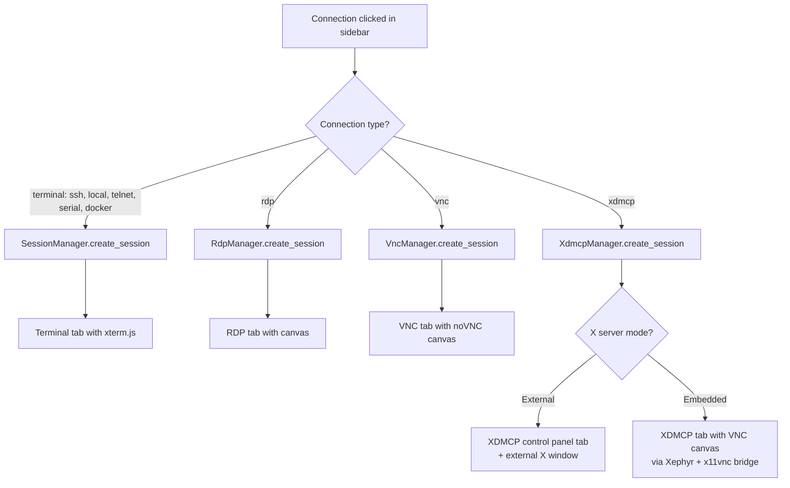
```mermaid
flowchart TD
    A[Connection clicked in sidebar] --> B{Connection type?}
    B -->|terminal: ssh, local, telnet, serial, docker| C[SessionManager.create_session]
    C --> D[Terminal tab with xterm.js]
    B -->|rdp| E[RdpManager.create_session]
    E --> F[RDP tab with canvas]
    B -->|vnc| G[VncManager.create_session]
    G --> H[VNC tab with noVNC canvas]
    B -->|xdmcp| I[XdmcpManager.create_session]
    I --> J{X server mode?}
    J -->|External| K[XDMCP control panel tab<br>+ external X window]
    J -->|Embedded| L[XDMCP tab with VNC canvas<br>via Xephyr + x11vnc bridge]
```

### Relationship to Existing X11 Forwarding

termiHub already supports X11 forwarding for individual applications via SSH (`core/src/backends/ssh/x11.rs`). XDMCP extends this concept to full desktop sessions. The key differences:

| Aspect               | X11 Forwarding (existing)            | XDMCP (new)                                |
| -------------------- | ------------------------------------ | ------------------------------------------ |
| Scope                | Individual application windows       | Full desktop session (login screen → DE)   |
| Protocol             | SSH X11 channel + local X server     | XDMCP (UDP 177) + X11 (TCP 6000+N)         |
| Authentication       | SSH session auth                     | Display Manager login (GDM, LightDM, etc.) |
| X server usage       | Reuses existing DISPLAY              | Launches dedicated X server instance       |
| termiHub integration | Transparent (apps appear as windows) | Tab with control panel or embedded viewer  |

The existing X11 forwarding code in `x11.rs` handles the X11 protocol reverse tunnel and xauth cookie management. XDMCP sessions can potentially reuse the xauth utilities for cookie generation, but the session model is fundamentally different.

### Files to Create or Modify

| File                                            | Change                                                    |
| ----------------------------------------------- | --------------------------------------------------------- |
| `src-tauri/src/xdmcp/mod.rs`                    | **New** — XdmcpManager, session lifecycle                 |
| `src-tauri/src/xdmcp/session.rs`                | **New** — XdmcpSession, X server process management       |
| `src-tauri/src/xdmcp/protocol.rs`               | **New** — XDMCP protocol messages and UDP client          |
| `src-tauri/src/xdmcp/xserver.rs`                | **New** — X server detection, launch, health monitoring   |
| `src-tauri/src/xdmcp/config.rs`                 | **New** — XdmcpConfig, validation                         |
| `src-tauri/src/commands/xdmcp.rs`               | **New** — Tauri XDMCP commands                            |
| `src-tauri/src/lib.rs`                          | Register XdmcpManager as managed state, register commands |
| `src/components/Xdmcp/XdmcpPanel.tsx`           | **New** — Main XDMCP tab component                        |
| `src/components/Xdmcp/XdmcpControlPanel.tsx`    | **New** — External mode session controls                  |
| `src/components/Xdmcp/XdmcpDiscoveryDialog.tsx` | **New** — Broadcast/Indirect host picker                  |
| `src/components/Xdmcp/XdmcpSetupGuide.tsx`      | **New** — X server installation instructions              |
| `src/hooks/useXdmcpSession.ts`                  | **New** — XDMCP session lifecycle hook                    |
| `src/types/terminal.ts`                         | Add `"xdmcp"` to `TabContentType`, add `XdmcpTabMeta`     |
| `src/services/api.ts`                           | Add XDMCP command wrappers                                |
| `src/store/appStore.ts`                         | Add `openXdmcpTab` action                                 |
| `src/components/SplitView/SplitView.tsx`        | Add rendering branch for `contentType === "xdmcp"`        |
| `src/components/StatusBar/StatusBar.tsx`        | Add XDMCP-specific status display + X server indicator    |

### Implementation Phases


```mermaid
gantt
    title XDMCP Sessions Implementation Phases
    dateFormat X
    axisFormat %s

    section Phase 1 — Core Infrastructure
    XdmcpConfig + connection editor schema       :a1, 0, 2
    XDMCP protocol implementation (UDP)          :a2, 0, 3
    X server detection (all platforms)           :a3, 2, 3

    section Phase 2 — External Mode
    X server launch + process management         :b1, 5, 3
    Direct query connection flow                 :b2, 5, 2
    XDMCP session tab + control panel UI         :b3, 7, 3
    Process health monitoring                    :b4, 8, 2

    section Phase 3 — Discovery & Chooser
    Broadcast discovery + dialog                 :c1, 10, 3
    Indirect query + chooser dialog              :c2, 10, 3
    Host selection and connection flow           :c3, 12, 2

    section Phase 4 — SSH Tunnel Integration
    SSH tunnel for XDMCP (UDP relay)             :d1, 14, 3
    Alternative: SSH X11 fwd + remote Xephyr     :d2, 14, 3
    Security warnings and guidance               :d3, 16, 1

    section Phase 5 — Embedded Mode (Stretch)
    Xephyr + x11vnc + WebSocket proxy bridge     :e1, 17, 4
    Reuse VNC viewer for embedded rendering      :e2, 19, 2
    Unified tab experience (embedded vs external) :e3, 20, 2
```

### Security Considerations

- **XDMCP is unencrypted**: The protocol uses plaintext UDP. All XDMCP messages, and the subsequent X11 protocol traffic, travel unencrypted. The connection editor prominently warns about this and recommends SSH tunneling.
- **X11 protocol carries sensitive data**: Keystrokes, screen contents, and clipboard data are transmitted as X11 protocol messages. Without SSH tunneling, these are visible to anyone on the network.
- **XDMCP access control**: Most modern display managers disable XDMCP by default for security reasons. Users must explicitly enable it in their display manager configuration (e.g., `/etc/gdm3/custom.conf` for GDM, `/etc/lightdm/lightdm.conf` for LightDM).
- **Firewall considerations**: XDMCP requires UDP port 177 (inbound/outbound) and TCP port 6000+N (inbound on the client). These are often blocked by firewalls. The setup guide should include firewall configuration instructions.
- **X server access control**: The local X server must accept connections from the remote host. This requires proper xhost or xauth configuration. termiHub should manage xauth cookies automatically.
- **No credential storage for XDMCP**: Unlike RDP/VNC, XDMCP does not have a password field in the connection editor. Authentication happens via the remote display manager's login screen. SSH tunnel credentials (if configured) use the existing credential store.
- **Process isolation**: X server processes are spawned as child processes of termiHub. On session close or application exit, all spawned processes (X server, SSH tunnel, x11vnc) must be terminated to prevent orphaned processes consuming resources.
- **Localhost binding**: In embedded mode, the x11vnc and WebSocket proxy bind to `127.0.0.1` exclusively, preventing network exposure.
